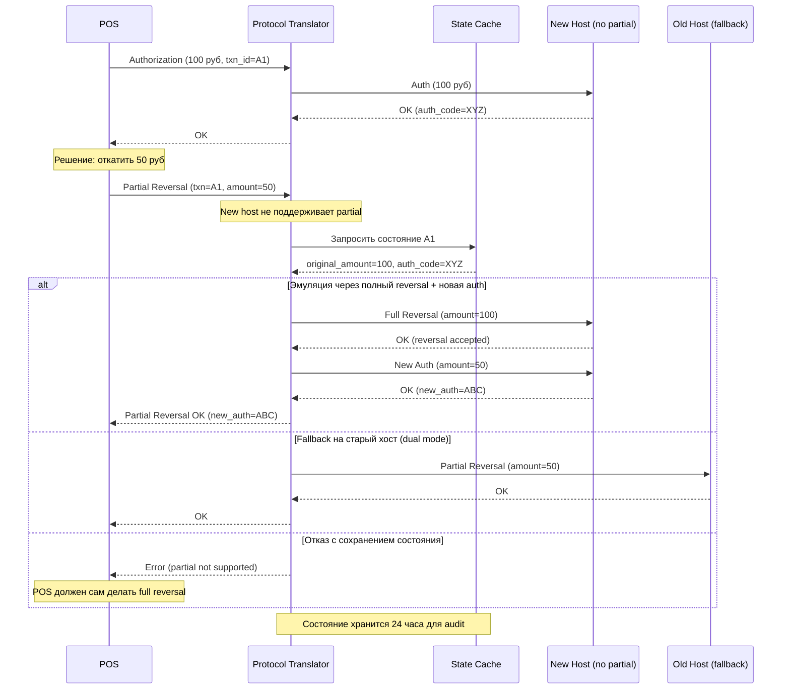
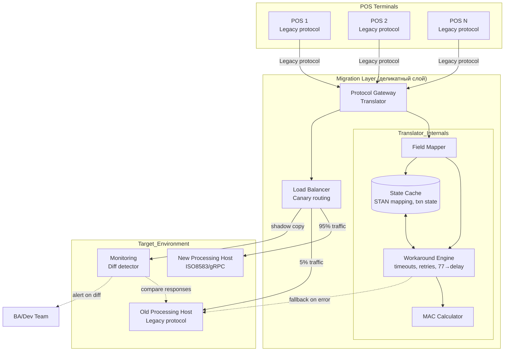
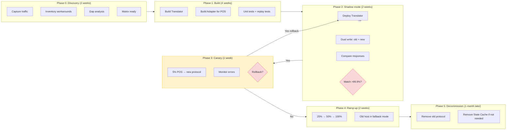
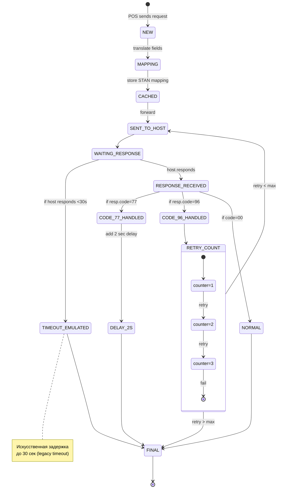
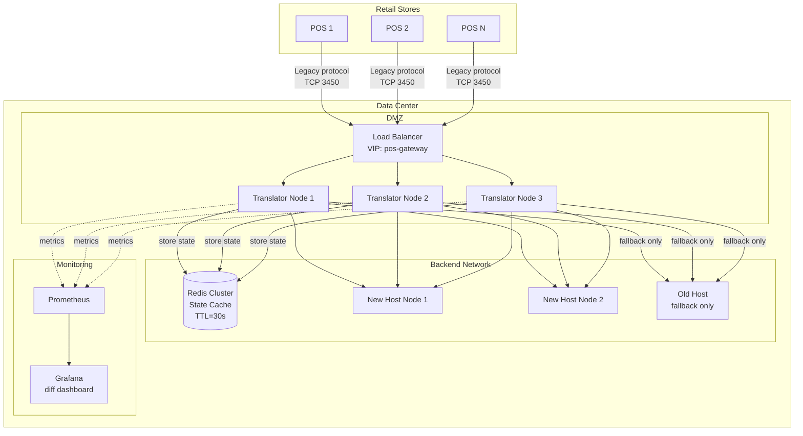
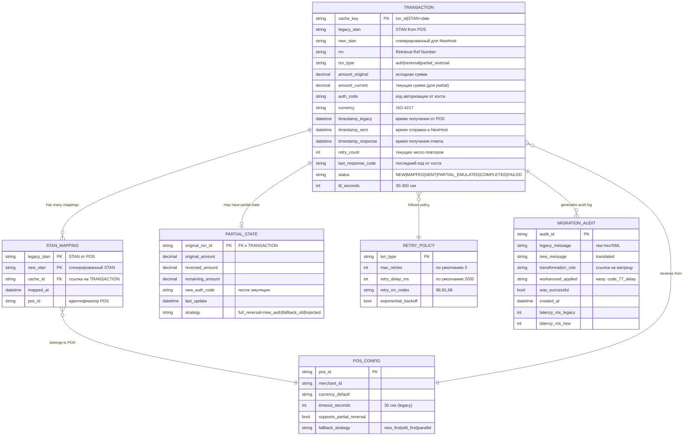
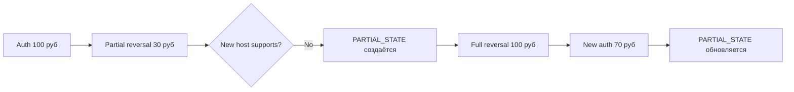

# Migration Protocol Requirements Document

## 👤 **Kirill**

Покажи пример документа требований по миграции с одного протокола на другой
взаимодействие POS - Processing (host) 
Из ключевого: нужно деликатно перенсти весь функционал в т.ч. кастомные и обходные решения по настройке первичного протокола на новый протокол взаимодействия. 

На что это похоже со стороны BA? gap анализ? M&A?

---

## 🤖 **DeepSeek**

Отличный запрос. Это классическая задача **миграции интеграционного слоя** с высоким риском, потому что протоколы (например, замена ISO8583 на gRPC или слепой переход с TCP-raw на message-based протокол вроде MQ) редко бывают семантически эквивалентны. А требование «деликатно перенести кастомные и обходные решения» означает, что целевой протокол должен эмулировать поведение старого, даже если оно нелогичное.

С точки зрения BA, это **Reverse Engineering + Gap Analysis + Миграционная стратегия**. Это не M&A, а скорее «миграция платформы с сохранением поведения» (behavioral migration).

Ниже — **пример структуры документа требований** (ТЗ / Функциональная спецификация на миграцию).

---

# Документ требований к миграции протокола взаимодействия POS ↔ Processing Host

| Версия | Дата | Автор | Изменение |
|--------|------|-------|------------|
| 1.0    | 202X-XX-XX | BA | Initial |

## 1. Цели и границы миграции
- **Замена протокола**: `старый (VISA1, TCP/XML)` → `новый (ISO8583-1993 over TLS)`
- **Без изменения бизнес-логики хоста и POS** (со стороны POS — адаптер, со стороны хоста — шлюз-транслятор)
- **Обязательно**: сохранить работу кастомных полей, таймаутов, повторных попыток, fallback-сценариев

## 2. Подход к анализу (BA activities)
1. **Протокольный реверс-инжиниринг**  
   - Захват трафика (live + логи старого хоста)  
   - Документирование всех типов сообщений: request/response, подтверждения, повторы, отказоустойчивые сценарии  
2. **Gap-анализ** (семантический, не синтаксический):  
   - Какие поля старого протокола невозможно напрямую отобразить в новый  
   - Где новый протокол строже (например, валидация MAC, отсутствие wildcard-значений)  
3. **Инвентаризация «обходных решений»** (workarounds):  
   - Захардкоженные таймауты на POS  
   - Игнорирование определённых ошибок хоста  
   - Нестандартные коды возврата (например, `99` вместо `12`)  

## 3. Требования к деликатности (поведенческая эквивалентность)

### 3.1. Сохранение кастомных полей
| Старый протокол (поле) | Новый протокол | Правило трансляции |
|------------------------|----------------|----------------------|
| `custom_Field_45` (тип BCD, 10 байт) | user defined DE 128 | копировать as is, без перекодировки |
| `magic_Indicator = "0xFF"` | отсутствует | вставить в DE 63.1 с префиксом `CSTM` |

### 3.2. Обходные решения (must have)
- **Поведение при timeout = 30 сек** (в старом POS):  
  → новый протокол должен имитировать тот же timeout на уровне приложения, даже если транспорт быстрее.  
- **Retry-логика**: старый хост отвечает `code 96` (system error) → POS повторяет с тем же ID.  
  → Транслятор обязан преобразовать любую новую ошибку в `96` при необходимости.  
- **Fallback-адрес**: если новый хост недоступен, система должна попытаться отправить сообщение в старом протоколе (dual-stack период).

## 4. Gap-анализ: старый vs новый протокол

| Аспект | Старый протокол | Новый протокол | Разрыв (Gap) | Решение миграции |
|--------|----------------|----------------|--------------|------------------|
| Идентификация транзакции | STAN (6 digits) | RRN + STAN | новый требует уникальности RRN за 24ч | эмулировать RRN из STAN+Date |
| Поддержка partial reversal | да (спец. флаг) | нет | высокий | хранить состояние в адаптере |
| Код результата `"00"` = успех | + | + | нет | – |
| Код результата `"77"` (нестандарт) | повтор через 2 сек | нет такого | средний | маппинг → `"91"` + добавить задержку в трансляторе |
| MAC в каждом сообщении | опционально | mandatory | критичный | добавить MAC-вычисление на шлюзе |

## 5. Функциональные требования к переходному периоду

### 5.1. Режим эмуляции старого протокола (новый адаптер POS)
- Адаптер должен **принимать ответы хоста в старом формате** (в фазе A/B тестирования)
- Логировать расхождения между реальным поведением старого и нового

### 5.2. Требования к транслятору (Protocol Gateway)
- Поддержка **правил исправления семантики**:  
  - Если в новом протоколе поле `processing_code` = `"01"`, а в старом всегда было `"00"` — исправить до отправки на POS.  
- Возможность включать/выключать «костыли» через конфиг (feature flags)

## 6. Тестовая стратегия (ключевое для BA)

1. **Полевые логи** → генерация тестового набора из 10 000 реальных транзакций (все типы + ошибки + редкие кейсы)
2. **Replay-тесты**:  
   - Старый хост (эталон) vs новый шлюз + адаптер  
   - Допуск: `поведение идентично` (коды ответа, задержки, повторы)
3. **Стресс-тест с эмуляцией обходных решений** (например, искусственный `code 96` от хоста → проверка retry)

## 7. План миграции (деликатный)

| Фаза | Длит. | Действие | Риск |
|------|-------|----------|------|
| 0 | 2 нед. | Capture трафика + Gap-документ | – |
| 1 | 4 нед. | Разработка транслятора + адаптера в режиме «listen only» | минимальный |
| 2 | 2 нед. | Shadow mode: старый протокол работает, новый дублирует трафик, сравниваются логи | средний (нет влияния) |
| 3 | 1 нед. | Canary: 5% POS → новый протокол (обратно можно откатить за 1 минуту) | низкий |
| 4 | 2 нед. | Все POS → новый протокол, старый шлюз в fallback | средний |
| 5 | – | Удаление старого протокола (через 3 мес.) | – |

## 8. Критерии приёмки (BA acceptance)
- [ ] Все коды ответов (включая кастомные `77`, `88`, `99`) транслируются семантически верно
- [ ] POS не требует изменений в бизнес-логике (только смена IP/порт или прошивка адаптера)
- [ ] Все обходные решения задокументированы в коде транслятора (не размазаны по хосту)
- [ ] Gap-таблица закрыта (каждый gap имеет решение или waiver)

---

## На что это похоже со стороны BA?

| Подход | Описание | Почему подходит / не подходит |
|--------|----------|-------------------------------|
| **Gap-анализ** | ✅ Основа работы. Сравнение двух протоколов по функциям, полям, сценариям. | Идеально, но недостаточно — нужен ещё behavioural alignment. |
| **M&A (due diligence)** | ❌ Не подходит. M&A про объединение компаний, систем и данных. Здесь же — замена интерфейса без смены владельца. |
| **Reverse engineering** | ✅ Критичен. Без него кастомные поля останутся незамеченными. |
| **Protocol migration pattern** | ✅ Это правильное название. С подтипом *transparent proxy with emulation*. |
| **Regression by equivalence** | ✅ BA должен определить критерии эквивалентности поведения «чёрного ящика». |

**Коротко**:  
*Это не M&A, а **миграция интерфейса с сохранением контрактного поведения**, выполняемая через Gap-анализ + эмуляцию legacy-поведения.*

Если нужно, могу нарисовать **матрицу трансляции полей** (старый протокол → новый) с указанием, где требуется «костыль».

---

## 👤 **Kirill**

Нарисуй

---

## 🤖 **DeepSeek**

Отлично. Вот **матрица трансляции полей и поведения** — основной артефакт BA для такой миграции.

Она показывает не просто маппинг «поле А → поле Б», а **логику трансформации**, включая все кастомные и обходные решения (workarounds).

---

# Матрица трансляции протоколов: Legacy (POS–Host) → New (POS–Host)

| # | Legacy поле / поведение | Legacy пример значения | New поле / поведение | Тип трансформации | Обходное решение (workaround) | Критичность |
|---|------------------------|----------------------|----------------------|-------------------|-------------------------------|-------------|
| 1 | MTI (Message Type) | `0200` (Authorization) | `msg_type` = `AUTH` | Прямой маппинг | Нет | High |
| 2 | MTI `0420` (Reversal) | `0420` | `msg_type` = `REVERSAL` | Прямой | Нет | High |
| 3 | PAN (Primary Account Number) | `411111xxxxxx1111` | `card.pan` | Прямой | Нет | High |
| 4 | Processing Code | `00` (Purchase) | `txn_code` = `PURCHASE` | Прямой | **Legacy имеет `00`, New ожидает `PURCHASE`** → транслятор заменяет | High |
| 5 | Amount (field 4) | `000000012500` (125.00) | `amount.value` + `amount.currency` | Прямой (кроме валюты) | В Legacy валюта подразумевается из терминала, в New — явное поле → **добавить currency из конфига терминала** | High |
| 6 | STAN (STANgle number) | `000123` | `stan` | Прямой | Нет | High |
| 7 | RRN (Retrieval Ref Number) | **Отсутствует** | `rrn` (обязателен) | **Генерация** | Создать RRN = `YYYYDDD` + STAN (6) + случайные 4 цифры. Гарантировать уникальность за 24ч | **Critical** |
| 8 | Custom field `F45` (Track2 raw) | `;411111...?` | `track2.data` | Прямой | Нет | Medium |
| 9 | Custom field `F48` (Private data) | `06A3FF01` | `private.ext_data` | Прямой (hex→base64) | В Legacy это raw hex, New требует base64 → **перекодировка** | Medium |
| 10 | Custom indicator `MAGIC_FLAG` = `0xFF` в F48 | `0xFF` | **Отсутствует** | **Эмуляция** | Вставить в `private.magic` = `true` + добавить в MAC-расчет | **High** |
| 11 | Response code `00` (Success) | `00` | `resp.code` = `SUCCESS` | Прямой | Нет | High |
| 12 | Response code `77` (кастомный: "Повтори через 2 сек") | `77` | **Нет аналога** | **Поведенческая** | Транслятор получает `77` → преобразует в `TRY_AGAIN_LATER` + **искусственно задерживает ответ на 2 сек** | **Critical** |
| 13 | Response code `96` (System error, требует retry) | `96` | `SYSTEM_ERROR` | Прямой | Нет (но New сам не требует retry) → **транслятор не должен автоматически ретраить** | High |
| 14 | Timeout на POS: 30 сек | – | Timeout 10 сек (транспорт) | **Выравнивание** | Принудительно удерживать ответ в трансляторе до 30 сек, если хост ответил раньше | **High** |
| 15 | MAC (Message Authentication Code) | **Опционально** | **Обязателен** | **Добавление** | Если в Legacy нет MAC → вычислить MAC на шлюзе, добавить в New | **Critical** |
| 16 | Retry-логика: POS повторяет тот же STAN при `96` | STAN не меняется | New ожидает новый STAN на каждый запрос | **Эмуляция** | Транслятор при повторном запросе с тем же STAN подменяет на новый (но хранит маппинг для ответа) | **Critical** |
| 17 | Partial reversal (спец. флаг в F48) | `PARTIAL_REV=1` | **Не поддерживается** | **Сохранение состояния** | Транслятор хранит состояние транзакции и при reversal отправляет полную сумму, но логирует partial | High |
| 18 | Нестандартный код валюты `999` | `999` (тестовый) | `XXX` | Маппинг | `999` → `XXX` | Low |

---

## Легенда типов трансформации

| Тип | Описание |
|-----|----------|
| **Прямой маппинг** | Поле копируется 1:1, возможно переименование |
| **Генерация** | Поле отсутствует в Legacy, создаётся в New по правилам |
| **Эмуляция** | Legacy поведение невозможно выразить в New → транслятор «имитирует» его (задержки, подмена кодов) |
| **Сохранение состояния** | Требуется память между запросами (кеш, БД) |
| **Добавление** | Новый протокол требует то, чего не было в старом (MAC, обязательные поля) |

---

## Пример критической связки (workaround цепочка)

```
POS (Legacy) → отправил запрос с STAN=123, получил 96
POS повторяет ТОТ ЖЕ STAN=123
         ↓
Транслятор видит дубликат STAN за последние 5 сек
         ↓
Создаёт новый STAN=456 для New-хоста
         ↓
Сохраняет маппинг {123 → 456} в кеше (TTL=30 сек)
         ↓
Получает ответ от New-хоста на STAN=456
         ↓
Отдаёт POS-у на исходный STAN=123 с кодом 96
```

---

## Куда это вставляется в документ требований

Эта матрица идёт **разделом 4.1** после Gap-анализа.  
К каждой строке можно добавить столбец «Проверено на реальном трафике (да/нет)» и «Статус реализации».

Если нужно — следующим шагом могу нарисовать **диаграмму sequence** для самого опасного сценария:  
«POS отправил partial reversal → новый хост его не поддерживает → как эмулируем».

---

## 👤 **Kirill**

Да, давай
Какие еще диаграммы могут понадобиться? Архитектура решения, процесс миграции и т.д.

---

## 🤖 **DeepSeek**

Отлично. Для такой миграции **одной матрицы недостаточно** — нужно несколько диаграмм, каждая закрывает свой риск.

Ниже — **полный набор диаграмм** для BA/Documentation, включая запрошенный sequence для partial reversal.

---

# 1. Sequence diagram: Partial reversal (самый опасный сценарий)

**Суть**: Legacy поддерживает частичный откат (например, отменить 50 из 100 руб.), New — нет. Транслятор должен эмулировать.



**BA-комментарий**: Этот сценарий требует **хранимого состояния** и выбора стратегии эмуляции. Без этого — критический gap.

---

# 2. Диаграмма архитектуры решения (миграционный паттерн)

Показывает, как компоненты взаимодействуют **во время переходного периода**.



**Ключевые элементы для BA**:
- **State Cache** — без него невозможна эмуляция retry и partial reversal
- **Canary routing** — безопасное вкатывание
- **Diff detector** — доказательство поведенческой эквивалентности

---

# 3. Диаграмма процесса миграции (поэтапно)

Показывает **риски и откат** на каждом шаге.



**BA-точки принятия решений** (в菱形):
- `Match >99.9%?` — расхождения анализируются, если >0.1% — стоп
- `Rollback?` — при любом новом типе ошибки — немедленный откат

---

# 4. Диаграмма состояний (State machine) для транзакции

Показывает, как эмулируется legacy-поведение в терминах состояний.



---

# 5. Диаграмма развёртывания (Deployment) — для инфраструктуры

Показывает, куда физически ставить транслятор.



---

# Итог: какие диаграммы нужны BA для этой задачи

| Диаграмма | Цель | Когда показывать |
|-----------|------|------------------|
| **Sequence (partial reversal)** | Доказать, что критический gap решаем | Архитектурному комитету |
| **Architecture (migration pattern)** | Понять, какие новые компоненты нужны | Tech lead, DevOps |
| **Migration process** | Согласовать поэтапный rollout с бизнесом | Project manager, бизнес |
| **State machine** | Формализовать эмуляцию поведения | Разработчикам транслятора |
| **Deployment** | Оценить инфраструктурные требования | DevOps, сетевикам |
| **Matrix (была выше)** | Детальный маппинг для разработки | Разработчикам, тестировщикам |

**Дополнительно** (если нужно):
- **ER-диаграмма** для State Cache (STAN mapping, транзакции)
- **Диаграмма классов** для транслятора (если пишете на Java/C#)
- **Gantt** для планирования миграции с учётом freeze-периодов (чёрные пятницы и т.д.)

Хочешь, прорисуем **ER-диаграмму кеша состояний**? Это часто становится узким местом.

---

## 👤 **Kirill**

давай сделаем ER

---

## 🤖 **DeepSeek**

Отлично. **ER-диаграмма кеша состояний** — это то, что часто недооценивают, а потом получают потерю транзакций или дубликаты.

Ниже — **полная ER-диаграмма** для State Cache, необходимая для эмуляции:
- Повторов с тем же STAN
- Partial reversal
- Таймаутов и retry
- Маппинга старых ID в новые

---

# ER-диаграмма State Cache (миграционный слой)



---

# Детали ключевых сущностей (для разработки)

## 1. TRANSACTION — главная таблица состояний

**Ключевой момент**: `cache_key` может быть составным:
- `{pos_id}_{legacy_stan}_{date}` — если STAN уникален только в рамках дня
- `{txn_id_from_pos}` — если POS генерирует свой ID

**Пример записи**:
```json
{
  "cache_key": "POS_01_000123_20260413",
  "legacy_stan": "000123",
  "new_stan": "456789",
  "rrn": "2026131000123456",
  "txn_type": "auth",
  "amount_original": 100.00,
  "amount_current": 100.00,
  "auth_code": "AUTHXYZ",
  "timestamp_legacy": "2026-04-13T10:30:00Z",
  "timestamp_sent": "2026-04-13T10:30:00.123Z",
  "timestamp_response": null,
  "retry_count": 0,
  "last_response_code": null,
  "status": "SENT",
  "ttl_seconds": 60
}
```

**Индексы** (критично для производительности):
- `idx_status_ttl` — для очистки старых записей
- `idx_legacy_stan_pos` — для поиска по STAN+POS
- `idx_timestamp_sent` — для мониторинга задержек

---

## 2. STAN_MAPPING — таблица подмены STAN

**Необходима, потому что**:
- Legacy POS повторяет STAN при retry (код 96)
- New host требует уникальный STAN на каждый запрос

**Пример работы**:
```sql
-- POS отправил STAN=000123 первый раз
INSERT INTO stan_mapping VALUES ('000123', '456789', 'txn_001', ...);

-- Через 2 секунды POS повторяет тот же STAN=000123
-- Транслятор ищет mapping, находит 456789, использует его

-- Через 30 секунд запись удаляется (TTL)
```

**Очистка**: `DELETE FROM stan_mapping WHERE mapped_at < NOW() - INTERVAL '60 seconds'`

---

## 3. PARTIAL_STATE — эмуляция частичного отката

**Сценарий использования**:


**Пример записи после эмуляции**:
```json
{
  "original_txn_id": "txn_001",
  "original_amount": 100.00,
  "reversed_amount": 30.00,
  "remaining_amount": 70.00,
  "new_auth_code": "NEWAUTH456",
  "last_update": "2026-04-13T10:31:00Z",
  "strategy": "full_reversal+new_auth"
}
```

---

## 4. MIGRATION_AUDIT — для доказательства корректности

**Критично для BA**, чтобы:
- Доказать бизнесу, что все транзакции сконвертированы верно
- Найти расхождения между старым и новым протоколом
- Отвечать на запросы "а почему транзакция прошла иначе?"

**Пример записи**:
```json
{
  "audit_id": "audit_20260413_103000_001",
  "legacy_message": "0200 411111... 000123 00100",
  "new_message": "{\"msg_type\":\"AUTH\",\"pan\":\"411111...\",\"stan\":456789}",
  "transformation_rule": "row_5_processing_code",
  "workaround_applied": "code_77_delay_2s",
  "was_successful": true,
  "created_at": "2026-04-13T10:30:01Z",
  "latency_ms_legacy": 245,
  "latency_ms_new": 189
}
```

---

# Ключевые операции с кешем (псевдокод)

## Операция 1: Получение запроса от POS

```python
def handle_pos_request(legacy_stan, pos_id, amount, txn_type):
    # Шаг 1: проверяем, не повтор ли это (retry после 96)
    mapping = STAN_MAPPING.find_by_legacy_stan(legacy_stan, pos_id)
    
    if mapping and mapping.status == 'WAITING_RESPONSE':
        # Это retry, используем существующий new_stan
        new_stan = mapping.new_stan
        retry_count = TRANSACTION.increment_retry(mapping.txn_id)
        log_audit("retry_detected", legacy_stan, new_stan)
    else:
        # Новая транзакция, генерируем new_stan
        new_stan = generate_unique_stan()
        txn_id = TRANSACTION.create(
            legacy_stan=legacy_stan,
            new_stan=new_stan,
            status='NEW'
        )
        STAN_MAPPING.create(
            legacy_stan=legacy_stan,
            new_stan=new_stan,
            txn_id=txn_id
        )
    
    # Шаг 2: если partial reversal — проверяем PARTIAL_STATE
    if txn_type == 'partial_reversal':
        partial = PARTIAL_STATE.find_by_original_txn(txn_id)
        if partial and not new_host_supports_partial():
            # Эмулируем
            return emulate_partial_reversal(partial, amount)
    
    return forward_to_new_host(new_stan, amount)
```

## Операция 2: Обработка ответа от New Host

```python
def handle_host_response(new_stan, response_code, auth_code):
    txn = TRANSACTION.find_by_new_stan(new_stan)
    
    # Legacy эмуляция code 77
    if response_code == '77' and not legacy_host_supports_77():
        log_audit("workaround_77_applied")
        time.sleep(2)  # задержка 2 секунды
        response_code = 'TRY_AGAIN'  # маппинг
    
    # Обновляем состояние
    TRANSACTION.update(
        txn_id=txn.id,
        status='COMPLETED',
        last_response_code=response_code,
        auth_code=auth_code,
        timestamp_response=now()
    )
    
    # Если это было эмуляция partial reversal — чистим состояние
    if txn.txn_type == 'partial_reversal_emulated':
        PARTIAL_STATE.delete(txn.original_txn_id)
    
    return translate_to_legacy_response(response_code)
```

---

# BA-требования к State Cache (нефункциональные)

| Требование | Значение | Почему |
|------------|----------|--------|
| **TTL по умолчанию** | 60 сек | Дольше таймаута POS (30 сек) + запас |
| **Максимальный TTL для partial** | 24 часа | Пользователь может откатить транзакцию на следующий день |
| **Консистентность** | Строгая (strong) | Нельзя потерять mapping для retry |
| **Доступность** | 99.99% | Без кеша — миграция ломается |
| **Латентность** | <5 мс | Не должна добавлять задержку |
| **Репликация** | Multi-AZ | Отказ одного узла не должен убить миграцию |
| **Шифрование** | Данные PAN в кеше — зашифрованы | PCI DSS |

---

# Варианты реализации (для выбора)

| Вариант | Плюсы | Минусы | Когда выбирать |
|---------|-------|--------|----------------|
| **Redis** | Быстро, TTL, репликация | Нет строгой консистенции (может потерять mapping при failover) | 99% случаев |
| **PostgreSQL** | Строгая консистенция, SQL запросы | Медленнее, сложнее чистить TTL | Если partial reversal критичен и нужны сложные аудиты |
| **Hazelcast/IMDG** | In-memory, строгая консистенция, TTL | Тяжёлый, дорогой | Очень высокая нагрузка (1000+ tps) |
| **Apache Ignite** | Распределённый, SQL, TTL | Сложный в эксплуатации | Когда Redis не справляется с консистенцией |

**Рекомендация BA**: начать с **Redis Cluster** + запись audit-логов в **ClickHouse** или **ELK**. PostgreSQL — для partial state, если это критично.

---

## Что дальше?

У нас теперь есть:
1. ✅ Матрица трансляции (с workaround)
2. ✅ Sequence для partial reversal
3. ✅ Архитектура решения
4. ✅ Процесс миграции
5. ✅ State machine
6. ✅ Deployment
7. ✅ ER-диаграмма State Cache

**Осталось по вашему запросу**:
- Gantt-диаграмма с учётом freeze-периодов (чёрные пятницы, peak seasons)
- Диаграмма классов для транслятора (если пишете код)

Какой следующий?

---

## 👤 **Kirill**

как читать er-диаграмму, которую ты зделал выше?

---

## 🤖 **DeepSeek**

Отличный вопрос. ER-диаграммы часто пугают, но они очень простые, если знать **правила чтения**.

Ниже — **расшифровка моей диаграммы** строчка за строчкой, с переводами на русский и примерами.

---

# Как читать ER-диаграмму (шпаргалка)

## Базовые элементы

| Символ | Что означает | Пример |
|--------|--------------|--------|
| **Прямоугольник** | Сущность (таблица в БД) | `TRANSACTION` |
| **Овал внутри** | Поля (атрибуты) | `legacy_stan`, `amount_original` |
| **PK** | Первичный ключ (уникальный идентификатор) | `cache_key PK` |
| **FK** | Внешний ключ (ссылка на другую таблицу) | `cache_id FK` |
| **Ромб или линия** | Связь между таблицами | `||--o{` |

---

## Как читать связи (самое важное)

Связь между двумя таблицами читается **слева направо** или **сверху вниз**.

### Пример из диаграммы:

```
TRANSACTION ||--o{ STAN_MAPPING : "has many mappings"
```

**Расшифровка по частям**:

| Часть | Значение |
|-------|----------|
| `TRANSACTION` | Первая таблица |
| `||` | Одна запись в TRANSACTION (строго один) |
| `--` | Соединение |
| `o{` | Много записей в STAN_MAPPING (ноль или много) |
| `STAN_MAPPING` | Вторая таблица |

**Читается как**:  
> Одна транзакция **имеет много** (ноль или больше) маппингов STAN.

**Наоборот**:  
> Много маппингов STAN **принадлежат** одной транзакции.

---

## Полная таблица обозначений связей

| Нотация | Расшифровка | На русском | Пример |
|---------|-------------|------------|--------|
| `||--||` | Один к одному | Строго одна к строго одной | 1 пользователь → 1 паспорт |
| `||--o{` | Один ко многим | Одна → много (может быть 0) | 1 транзакция → много маппингов |
| `}|--||` | Многие к одному | Много → одна (обязательно) | Много транзакций → 1 POS |
| `}o--||` | Многие к одному (опционально) | Много → одна (может не быть) | Много аудитов → 1 транзакция (может быть без аудита) |
| `||--}|` | Один ко многим (обязательно) | Одна → много (хотя бы один) | 1 категория → много товаров |

---

# Разбор конкретных строк из моей диаграммы

## Связь 1: TRANSACTION → STAN_MAPPING

```
TRANSACTION ||--o{ STAN_MAPPING : "has many mappings"
```

**Что это значит на практике**:

| TRANSACTION (одна запись) | STAN_MAPPING (много записей) |
|---------------------------|------------------------------|
| txn_id = T001 | mapping_id = M001 → ссылается на T001 |
| legacy_stan = 000123 | mapping_id = M002 → ссылается на T001 |
| status = SENT | mapping_id = M003 → ссылается на T001 |

**Зачем?**  
Одна транзакция может повторяться несколько раз (retry), и каждый повтор — это отдельный маппинг старого STAN на новый.

---

## Связь 2: STAN_MAPPING → POS_CONFIG

```
STAN_MAPPING }o--|| POS_CONFIG : "belongs to POS"
```

**Расшифровка**:

| Часть | Значение |
|-------|----------|
| `}o` | Много маппингов (может быть без POS, если данные старые) |
| `--` | Соединение |
| `||` | Один POS (обязательно существует) |

**Читается как**:  
> Много маппингов STAN **принадлежат** одному POS-терминалу.

**На примере**:

| STAN_MAPPING | POS_CONFIG |
|--------------|------------|
| mapping для POS_01 | → конфиг POS_01 (таймаут 30 сек, валюта RUB) |
| mapping для POS_01 | → конфиг POS_01 |
| mapping для POS_02 | → конфиг POS_02 (таймаут 45 сек, валюта USD) |

**Зачем?**  
Разные POS-терминалы могут иметь разные настройки (таймауты, валюту). Маппинг должен знать, какой POS его создал.

---

## Связь 3: TRANSACTION → PARTIAL_STATE

```
TRANSACTION ||--o| PARTIAL_STATE : "may have partial state"
```

**Особенность**: `o|` означает **ноль или один** (не больше одного).

**Читается как**:  
> Одна транзакция **может иметь** (но не обязана) **ноль или один** partial state.

**На примере**:

| TRANSACTION | PARTIAL_STATE |
|-------------|---------------|
| Auth 100 руб | (нет записи — обычная транзакция) |
| Auth 100 руб | есть запись (сделали partial reversal на 30 руб) |
| Auth 50 руб | (нет записи) |

**Зачем?**  
Partial reversal случается только для некоторых транзакций. И у одной транзакции не может быть двух разных partial-состояний.

---

## Связь 4: TRANSACTION → MIGRATION_AUDIT

```
TRANSACTION ||--o{ MIGRATION_AUDIT : "generates audit log"
```

**Читается как**:  
> Одна транзакция **генерирует** много (ноль или больше) аудит-логов.

**На примере**:

| TRANSACTION (txn_id = T001) | MIGRATION_AUDIT |
|-----------------------------|-----------------|
| первый запрос → | audit_id = A001 (успех) |
| retry (код 96) → | audit_id = A002 (повтор) |
| ответ от хоста → | audit_id = A003 (ответ) |

**Зачем?**  
Для отладки и доказательства корректности миграции. Каждый шаг транзакции может быть записан в аудит.

---

# Визуальная расшифровка (как понять с первого взгляда)

Посмотрите на эту упрощённую диаграмму:

```
┌──────────────┐          ┌──────────────┐
│ TRANSACTION  │          │ STAN_MAPPING │
│ ──────────── │          │ ──────────── │
│ PK cache_key ││──o{    │ PK legacy_stan│
│   legacy_stan││         │   new_stan   │
│   new_stan   ││         │ FK txn_id    │
│   status     ││         └──────────────┘
└──────────────┘
```

**Что значат стрелки**:

| Стрелка | Значение |
|---------|----------|
| `││──o{` | Одна транзакция → много маппингов (как папка с файлами) |
| Сторона с `││` | "Один" (родитель) |
| Сторона с `o{` | "Много" (дети) |

**Запоминалка**:  
- `││` — одна палка = один родитель  
- `o{` — похоже на открытую коробку с вещами = много детей  
- `}o` — похоже на много вещей, входящих в одну коробку  

---

# Как читать сложную связь (пример из диаграммы)

Возьмём самую сложную:

```
POS_CONFIG ||--o{ TRANSACTION : "receives from"
```

**По шагам**:

1. Смотрим налево: `POS_CONFIG` — таблица конфигов POS
2. Смотрим на связь: `||--o{` — один ко многим
3. Смотрим направо: `TRANSACTION` — таблица транзакций
4. Читаем: **Один** POS-конфиг **относится ко многим** транзакциям

**Проверка на примере**:

| POS_CONFIG | TRANSACTION |
|------------|-------------|
| POS_01 (таймаут 30 сек) | 1000 транзакций от POS_01 |
| POS_02 (таймаут 45 сек) | 500 транзакций от POS_02 |

Логично: у одного POS — много транзакций.

---

# Практическое задание для проверки себя

Прочитайте эти три строки из диаграммы вслух:

1. `TRANSACTION }o--|| RETRY_POLICY : "follows policy"`
2. `PARTIAL_STATE ||--|| TRANSACTION : "is part of"` (если бы была такая связь)
3. `MIGRATION_AUDIT }o--o| TRANSACTION : "may reference"`

**Правильные ответы**:

1. Много транзакций следуют одному правилу retry (например, все транзакции типа "auth" используют правило "max_retries=3")
2. Один partial state является частью одной транзакции (взаимно-однозначно)
3. Много аудитов могут ссылаться на ноль или одну транзакцию (аудит может быть и без транзакции, например, ошибка протокола)

---

# Резюме: алгоритм чтения любой ER-диаграммы

```
1. Найди два прямоугольника (таблицы)
2. Посмотри на линию между ними
3. Прочитай нотацию слева направо:
   - || или }| → "один" (слева)
   - o{ или }o → "много" (справа)
4. Прочитай подпись (например, "has many mappings")
5. Сформулируй предложение: 
   "[Левая таблица] [подпись] [правая таблица]"
```

**Пример готового предложения**:
> "TRANSACTION has many mappings STAN_MAPPING"

---

Хочешь, я нарисую **упрощённую версию** той же ER-диаграммы только с 3 самыми важными таблицами и без сложных нотаций? Или покажу, как это выглядит в реальном SQL (CREATE TABLE statements)?

---

