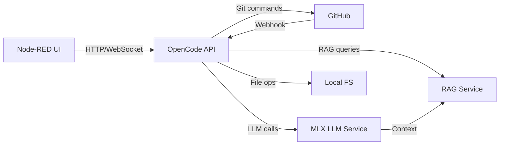
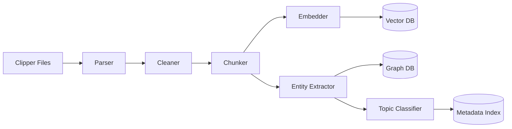
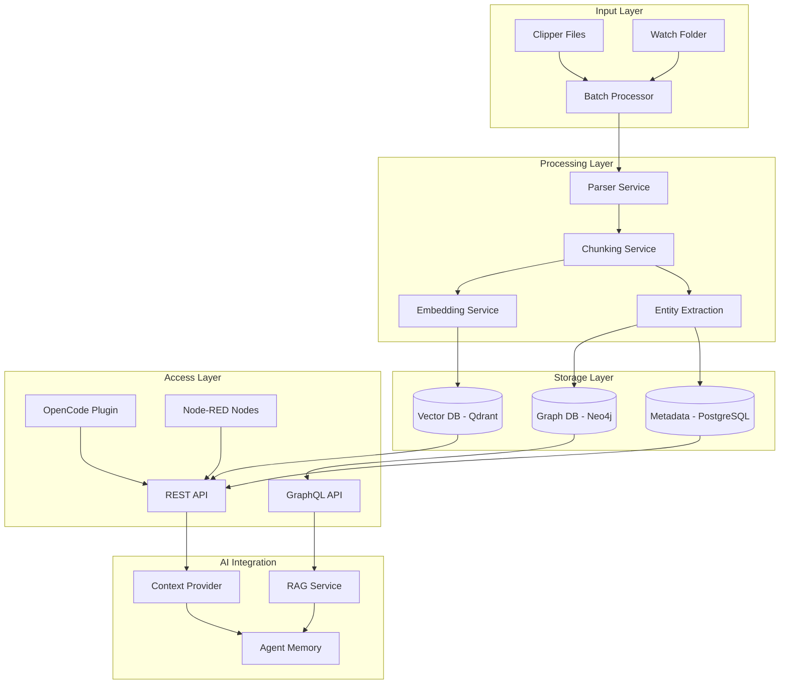
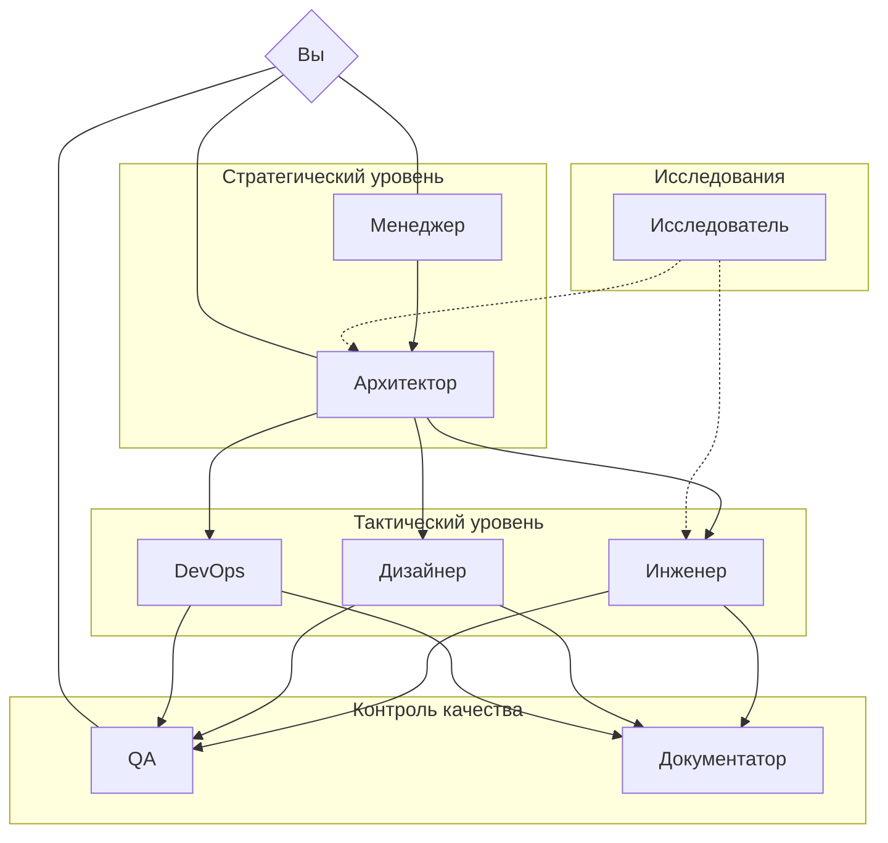
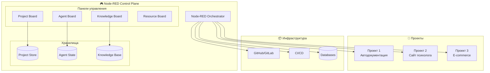
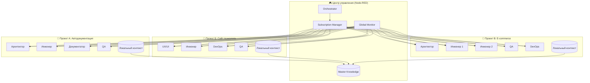

# OpenCode Windows macOS Alternatives

## 👤 **Kirill**

opencode только для linux? Какие есть альтернативы для win/mac?

---

## 🤖 **DeepSeek**

Отличный вопрос! Действительно, хотя **OpenCode** изначально создавался с фокусом на Linux и macOS, его экосистема и альтернативы давно вышли за эти рамки. Для Windows и macOS существует огромный выбор мощных инструментов AI-программирования, как терминальных, так и в формате полноценных редакторов кода.

Давайте разберем самые популярные варианты.

### 🤔 А что насчет самого OpenCode под Windows/macOS?

Прежде чем искать альтернативы, важно знать, что **сам OpenCode официально поддерживает Windows и macOS** наравне с Linux [citation:3][citation:9].

*   **OpenCode**: Это **кроссплатформенное** решение с открытым исходным кодом. Вы можете установить его через пакетные менеджеры (`npm`, `brew`) или как десктоп-приложение [citation:1][citation:3]. Его главная "фишка" — **модель-нейтральность**: вы сами выбираете, какой AI-моделью пользоваться (OpenAI, Claude, Google Gemini или даже локальной через Ollama) и платите только за её API [citation:1][citation:6].
*   **OpenCoder**: Существует также форк или аналог под названием **OpenCoder**, который позиционирует себя как "open-source версия Claude Code" и также подчеркивает свою **кроссплатформенность** (Windows, Linux, MacOS) [citation:4][citation:9].

Так что, если вас привлекает именно философия OpenCode (открытость, гибкость, контроль), вы можете смело использовать его на вашей системе.

### 💡 Лучшие альтернативы для Windows и macOS

Если вы хотите рассмотреть другие инструменты с иным подходом или функционалом, вот лучшие альтернативы, отсортированные по типу.

#### Вариант "Как OpenCode": Терминальные AI-ассистенты

Эти инструменты работают прямо в вашем терминале, подобно OpenCode.

| Инструмент | Кроссплатформенность | Ключевые особенности | Модель оплаты |
| :--- | :--- | :--- | :--- |
| **Claude Code** | ✅ Windows, macOS, Linux | Официальный инструмент от Anthropic, глубокая интеграция с моделями Claude, высокая точность, "из коробки" [citation:1][citation:3][citation:5]. | Подписка Claude Pro/Max [citation:5][citation:7]. |
| **Aider** | ✅ Windows, macOS, Linux | Open-source, **глубокая интеграция с Git**, отлично работает с правками в нескольких файлах [citation:5][citation:7]. | Бесплатно (нужен свой API-ключ) [citation:5]. |
| **Moltbot** (бывший Clawdbot) | ✅ Windows, macOS, Linux | Open-source, **максимальная приватность** (работает локально), может проактивно автоматизировать задачи [citation:5][citation:7]. | Бесплатно (только затраты на API) [citation:7]. |

#### Вариант "Визуальный": AI, встроенный в редактор кода (IDE)

Если вам удобнее работать в привычном интерфейсе VS Code или другой IDE, эти инструменты станут отличным выбором.

| Инструмент | Кроссплатформенность | Ключевые особенности | Модель оплаты |
| :--- | :--- | :--- | :--- |
| **Cursor** | ✅ Windows, macOS, Linux | Форк VS Code с **глубоко встроенным AI**. Понимает весь проект, отлично работает с многофайловым редактированием [citation:2][citation:5][citation:7]. | Freemium / $20/мес [citation:5]. |
| **GitHub Copilot** | ✅ Windows, macOS, Linux | Самый популярный AI-парный программист. **Отличное автодополнение** (code completion) и чат прямо в IDE [citation:2][citation:5][citation:7]. | $10/мес или $100/год [citation:5]. |
| **Windsurf** (ранее Codeium) | ✅ Windows, macOS, Linux | Бесплатный и очень мощный аналог Copilot с **щедрым бесплатным тарифом** [citation:2][citation:5][citation:7]. | Бесплатно / $15/мес [citation:5]. |
| **Sourcegraph Cody** | ✅ Windows, macOS, Linux | Идеален для **огромных кодовых баз** и корпоративных команд, отлично понимает контекст всего проекта [citation:5][citation:7]. | Freemium / $9/мес [citation:5]. |

### 📊 Сравнение популярных вариантов

Чтобы наглядно показать разницу между ключевыми игроками, вот краткая таблица сравнения:

| Критерий | **OpenCode** | **Claude Code** | **Cursor** | **GitHub Copilot** |
| :--- | :--- | :--- | :--- | :--- |
| **Тип** | Терминал (CLI) | Терминал (CLI) | Редактор (IDE) | Плагин для IDE |
| **Open Source** | Да (MIT) | Нет | Нет | Нет |
| **Модель AI** | Любая (OpenAI, Claude, локальная и др.) | Только Claude | Своя + OpenAI/Claude | OpenAI |
| **Ценообразование** | Бесплатный инструмент + оплата API модели [citation:1] | Подписка от $20/мес [citation:5] | Подписка от $20/мес [citation:5] | Подписка от $10/мес [citation:5] |

### 💡 Как выбрать?

*   **Хотите полный контроль и гибкость?** Выбирайте **OpenCode** или **Aider**. Вы сами решаете, какую модель использовать и сколько за это платить. OpenCode также предлагает удобный десктоп-интерфейс [citation:3][citation:6].
*   **Нужно решение "из коробки" с лучшей моделью?** **Claude Code** — ваш выбор, если вы готовы платить за подписку и хотите максимально тесную интеграцию с возможностями Claude [citation:3][citation:5].
*   **Предпочитаете работать в привычном редакторе кода?** **Cursor** или **GitHub Copilot** (в связке с VS Code) дадут вам наиболее плавный и бесшовный опыт [citation:5][citation:7].
*   **Для работы с огромными проектами?** Обратите внимание на **Sourcegraph Cody**, который специализируется на навигации в больших кодовых базах [citation:5][citation:7].
*   **Приватность превыше всего?** Рассмотрите **OpenCode** (с локальной моделью через Ollama) или **Moltbot**, которые могут работать полностью локально, не отправляя ваш код в облако [citation:3][citation:7].

Надеюсь, этот обзор поможет вам сориентироваться в многообразии AI-инструментов для программирования в 2026 году! Если расскажете подробнее о ваших задачах и предпочтениях (например, важна ли вам работа в терминале или вы хотите AI в IDE), я смогу дать более точную рекомендацию.

---

## 👤 **Kirill**

У меня есть проект по созданию ИИ фермы на node red. какие сценарии использования могут быть для opencode. вся моя команда это ии-модели
🎯 ГЛОБАЛЬНАЯ ЦЕЛЬ: Автоматическая синхронизация кода и документации
🔍 Проблема, которую решаем:
В разработке ПО существует разрыв между:

Кодом — который постоянно меняется

Документацией — которая быстро устаревает

Знаниями — которые хранятся в головах и разрозненных заметках

Разработчики тратят 20-30% времени на поддержку документации, но она всё равно часто не соответствует коду.

💡 Что даст наша система:
1. Для разработчиков
Автоматическая генерация docstrings и README при каждом коммите

Контекст из базы знаний — документация учитывает архитектурные решения из Obsidian

Pull Request с готовой документацией — не нужно писать вручную

Issues с предложениями — система подскажет, где нужно обновить docs

2. Для архитекторов
Актуальная архитектурная документация всегда под рукой

Анализ влияния изменений — система показывает, какие модули затронуты

Связь кода с архитектурными решениями через RAG из Obsidian

3. Для новых членов команды
Быстрый онбординг — документация всегда соответствует коду

Поиск по базе знаний — можно спросить "как устроен модуль X" и получить ответ

Меньше вопросов к senior-разработчикам

4. Для бизнеса
Снижение time-to-market за счёт автоматизации

Меньше багов из-за несоответствия документации

Сохранение знаний при уходе сотрудников

🏗️ Конкретные сценарии использования:
Сценарий 1: Разработчик делает коммит
bash
git commit -m "feat: add new validation to user service"
Что происходит автоматически:

Webhook ловит push в GitHub

Анализатор проверяет изменения

LLM + RAG генерируют:

Обновлённые docstrings

Секцию в README

Описание в CHANGELOG

Создаётся Pull Request с документацией

Разработчик только подтверждает PR

Сценарий 2: Архитектор ищет информацию
bash
curl http://localhost:8002/api/v1/rag/search -d '{"query":"как работает авторизация"}'
Результат:

Релевантные фрагменты из кода

Связанные архитектурные заметки

Примеры использования

Сценарий 3: Новичок изучает проект
bash
curl http://localhost:8002/api/v1/analyze/test/orchestrator
Получает:

Структуру модуля

Ключевые компоненты

Ссылки на связанные заметки

📊 Метрики успеха:
Время на документацию сокращается на 70%

Актуальность документации — 95% (сейчас часто <50%)

Время онбординга нового разработчика сокращается с 3 месяцев до 3 недель

Количество вопросов к senior-разработчикам уменьшается на 40%

🔮 Дорожная карта развития:
Этап 1-2 (Сделано) ✅
Базовая инфраструктура

LLM сервис на MLX

Анализатор кода

Этап 3 (В процессе) 🔄
✅ RAG из Obsidian

🔄 GitHub интеграция

⏳ Автоматические PR/Issues

Этап 4 (План) 📅
Автоматическое обновление архитектурных диаграмм

Интеграция с Jira/Confluence

Генерация тестов на основе документации

Этап 5 (Видение) 🌟
Полностью автономная система

Самообучающаяся на основе обратной связи

Интеграция с IDE (плагины для VSCode)

💭 Философия проекта:
Мы создаём не просто инструмент, а "живую документацию" — систему, которая:

Дышит вместе с кодом

Помнит архитектурные решения

Учит новых разработчиков

Экономит время команды

Это переход от "документации как артефакта" к "документации как процесса".

---

## 🤖 **DeepSeek**

Отличный проект! Это **идеальный сценарий для OpenCode**. Давайте разберем, как именно OpenCode (и подобные ему терминальные AI-ассистенты) может стать ключевым звеном в вашей "ИИ ферме на Node-RED".

## 🎯 Почему OpenCode идеально подходит для вашей архитектуры

### 1. **OpenCode как "клей" между Node-RED и вашими сервисами**

Node-RED отлично работает с HTTP-запросами и WebSocket, но плохо приспособлен для:
- Работы с Git напрямую
- Сложной файловой системы
- Долгих задач с LLM (риск таймаутов)

OpenCode решает эти проблемы:



### 2. **Конкретные сценарии для Node-RED + OpenCode**

#### **Сценарий 1: Автоматическая документация при коммите**

**Node-RED поток:**
- `GitHub Webhook node` → ловит push
- `Function node` → парсит payload, извлекает измененные файлы
- `HTTP Request node` → отправляет запрос в OpenCode API
- `Wait for response` → ждет генерации документации
- `HTTP Request node` → создает PR в GitHub

**OpenCode API endpoint, который нужно создать:**
```javascript
// API endpoint в вашем OpenCode сервисе
app.post('/api/documentation/generate', async (req, res) => {
  const { files, commit_message, repo_path } = req.body;
  
  // 1. Получаем контекст из RAG
  const context = await getRagContext(files);
  
  // 2. Анализируем изменения
  const changes = await analyzeChanges(files, repo_path);
  
  // 3. Генерируем документацию через LLM
  const docs = await generateDocs(changes, context, commit_message);
  
  // 4. Создаем PR с документацией
  const pr = await createDocPR(repo_path, docs);
  
  res.json({ pr_url: pr.html_url, docs });
});
```

#### **Сценарий 2: Интерактивный Q&A по коду через Node-RED Dashboard**

**Node-RED поток:**
- `Dashboard text input` → пользователь вводит вопрос
- `Function node` → формирует запрос к RAG
- `HTTP Request node` → запрос к OpenCode `/api/v1/rag/search`
- `Function node` → парсит ответ, добавляет контекст
- `HTTP Request node` → LLM для генерации ответа
- `Dashboard template` → отображает ответ с подсветкой кода

#### **Сценарий 3: Автоматический анализ нового кода**

```javascript
// OpenCode скрипт для анализа
#!/usr/bin/env opencode

const analysis = await $`
  # Получаем список новых файлов
  git diff --name-only HEAD~1 HEAD
  
  # Для каждого файла с кодом
  for file in $(git diff --name-only HEAD~1 HEAD | grep -E '\.(js|py|java)$'); do
    echo "Анализирую $file..."
    
    # Получаем контекст из Obsidian
    context=$(curl -s "http://localhost:8002/api/v1/rag/search" \
      -d "{\"query\":\"$(basename $file) архитектура\"}")
    
    # Генерируем документацию
    npx opencode doc:generate $file --context "$context"
    
    # Проверяем на соответствие архитектуре
    npx opencode validate:architecture $file
  done
`
```

### 3. **Архитектура интеграции OpenCode в вашу систему**

```
┌─────────────────┐     ┌─────────────────┐     ┌─────────────────┐
│   Node-RED      │────▶│   OpenCode API  │────▶│   GitHub        │
│   (UI/Orch)     │◀────│   (CLI Wrapper) │◀────│   Webhooks      │
└─────────────────┘     └─────────────────┘     └─────────────────┘
         │                       │                        │
         ▼                       ▼                        ▼
┌─────────────────┐     ┌─────────────────┐     ┌─────────────────┐
│   MLX LLM       │     │   RAG Service   │     │   Obsidian      │
│   (Локальные    │     │   (Knowledge    │     │   (Архитектура) │
│    модели)      │     │    Base)        │     │                 │
└─────────────────┘     └─────────────────┘     └─────────────────┘
```

### 4. **Код для Node-RED function node (пример)**

```javascript
// Функция для отправки команды в OpenCode
const command = msg.payload.command; // например: "docs:generate"
const files = msg.payload.files;

// Формируем запрос к OpenCode API
msg.url = "http://localhost:3000/api/opencode/execute";
msg.method = "POST";
msg.payload = {
  command: command,
  args: files,
  options: {
    rag_context: true,  // использовать RAG
    create_pr: true,    // создать PR
    model: "mlx-local"  // использовать вашу MLX модель
  }
};

// Возвращаем для отправки
return msg;
```

### 5. **Расширение OpenCode под ваши нужды**

Создайте свои плагины/команды для OpenCode:

```javascript
// ~/.opencode/plugins/team-ai-farm.js
module.exports = {
  name: 'team-ai-farm',
  
  commands: {
    'docs:generate-with-context': async (files, options) => {
      // 1. Получаем контекст из вашего RAG сервиса
      const context = await fetch('http://localhost:8002/api/v1/rag/search', {
        method: 'POST',
        body: JSON.stringify({ 
          query: files.join(' '),
          depth: 'architecture'
        })
      });
      
      // 2. Генерируем документацию через вашу MLX модель
      const docs = await generateDocs(files, context);
      
      // 3. Создаем PR
      const pr = await createPR(docs);
      
      return { docs, pr_url: pr.html_url };
    },
    
    'arch:validate': async (file) => {
      // Проверка соответствия архитектуре из Obsidian
      const architecture = await getArchitectureFromObsidian();
      return validateAgainstArchitecture(file, architecture);
    }
  }
};
```

### 6. **Node-RED Dashboard для управления OpenCode**

Создайте UI для вашей команды AI-моделей:

```html
<!-- Template в Node-RED dashboard -->
<div class="team-ai-farm">
  <h3>🤖 ИИ Ферма - Управление задачами</h3>
  
  <div class="command-palette">
    <input type="text" id="command" placeholder="whatsapi generate docs for auth module">
    <button onclick="sendCommand()">Выполнить</button>
  </div>
  
  <div class="agent-status">
    <div class="agent">
      <span>📝 Документатор</span>
      <span class="status active">Активен</span>
    </div>
    <div class="agent">
      <span>🔍 Архитектор</span>
      <span class="status active">Активен</span>
    </div>
    <div class="agent">
      <span>🧪 Тестировщик</span>
      <span class="status idle">Ожидает</span>
    </div>
  </div>
  
  <div class="recent-tasks">
    <h4>Последние задачи</h4>
    <div id="task-list"></div>
  </div>
</div>
```

## 🚀 Готовый сценарий использования

Вот как будет выглядеть полный цикл в вашей системе:

1. **Разработчик (AI-агент) пишет код** в любом редакторе
2. **Коммит в GitHub** → Webhook в Node-RED
3. **Node-RED** получает webhook и отправляет команду в OpenCode:
   ```bash
   opencode team:process --files="auth.service.js" --rag=true --pr=true
   ```
4. **OpenCode**:
   - Получает контекст из вашего RAG сервиса
   - Генерирует документацию через MLX
   - Проверяет соответствие архитектуре
   - Создает PR с документацией
5. **Node-RED** получает результат и:
   - Обновляет дашборд
   - Отправляет уведомление в Telegram/Slack
   - Логирует в базу данных

## 💡 Уникальные возможности для вашего проекта

С OpenCode вы получаете:
- **Единый интерфейс** для всех AI-агентов
- **Легкую интеграцию** с Node-RED через HTTP API
- **Расширяемость** под ваши специфические задачи
- **Работу с любой LLM** (включая вашу MLX)
- **Автоматизацию Git операций** без сложных скриптов

Хотите, я помогу написать конкретный Node-RED flow или OpenCode плагин для вашего первого сценария?

---

## 👤 **Kirill**

пока давай подробнее разберем сценарии. Нужно архитектурное решение для платформы. требования верхнего уровня к платформе такие:
платформа должна покрывать задачи взаимодействия инди-разработчика (меня) и команды из ии-ассистентов. Проекты на этой платформе могут решаться различные. разброс проектов от системы автодокументации до сайта-портфолио специалиста психолога с управлением записью и оплатой.

---

## 🤖 **DeepSeek**

Отличный уровень абстракции! Давайте спроектируем платформу, которая будет **масштабироваться от "документатора" до "сайта психолога"** с одной и той же архитектурой.

## 🏗️ **Архитектурное видение: AI-Native Development Platform**

```mermaid
graph TB
    subgraph "🧠 Оркестрация"
        NR[Node-RED]
        OC[OpenCode CLI]
        CM[Context Manager]
    end
    
    subgraph "🤖 AI Ассистенты"
        A1[Документатор]
        A2[Архитектор]
        A3[Тестировщик]
        A4[UI/UX Дизайнер]
        A5[DevOps]
        A6[QA Инженер]
    end
    
    subgraph "📦 Проекты"
        P1[Система документации]
        P2[Сайт психолога]
        P3[eCommerce]
        P4[Мобильное приложение]
    end
    
    subgraph "💾 Контекст"
        KB[(Knowledge Base)]
        GIT[(Git)]
        OBS[(Obsidian)]
    end
    
    NR --> CM
    OC --> CM
    CM --> AI Ассистенты
    AI Ассистенты --> KB
    KB --> Проекты
    Проекты --> GIT
    OBS --> KB
```

## 🎯 **Ключевое архитектурное решение: Контекстно-ориентированная платформа**

### **1. Ядро платформы: Context Manager**

Это мозг всей системы. Он знает:
- **Кто ты** (разработчик) — твои предпочтения, стиль кода, технологии
- **Кто они** (AI-агенты) — их роли, компетенции, доступные инструменты
- **Что за проект** — его тип, требования, стек
- **Что уже сделано** — историю решений, код, документацию

```javascript
// context-manager/index.js
class ContextManager {
  constructor() {
    this.developer = {
      id: 'dev-1',
      preferences: {
        framework: 'react',
        styling: 'tailwind',
        db: 'postgresql',
        patterns: ['repository', 'service-layer']
      },
      skillLevel: 'senior',
      favoriteTools: ['opencode', 'node-red']
    };
    
    this.agents = {
      documentator: {
        capabilities: ['docstring', 'readme', 'architecture-docs'],
        models: ['claude-3.5', 'gpt-4'],
        tools: ['git', 'markdown', 'plantuml']
      },
      architect: {
        capabilities: ['system-design', 'tech-stack', 'patterns'],
        models: ['gpt-4', 'claude-3-opus'],
        tools: ['drawio', 'mermaid', 'db-diagram']
      },
      uxDesigner: {
        capabilities: ['wireframes', 'color-schemes', 'layout'],
        models: ['midjourney', 'dalle-3'],
        tools: ['figma-api', 'tailwind-generator']
      },
      devops: {
        capabilities: ['docker', 'ci-cd', 'monitoring'],
        models: ['claude-3.5'],
        tools: ['terraform', 'kubernetes']
      }
    };
    
    this.projects = new Map();
    this.contextCache = new Map();
  }
  
  async getContextForTask(projectId, taskType) {
    const project = this.projects.get(projectId);
    const developer = this.developer;
    
    // Собираем контекст из всех источников
    const context = {
      project: {
        type: project.type,
        stack: project.techStack,
        phase: project.currentPhase,
        constraints: project.constraints
      },
      developer: {
        preferences: developer.preferences,
        pastDecisions: await this.getPastDecisions(projectId)
      },
      history: await this.getTaskHistory(projectId, taskType),
      knowledge: await this.getRelevantKnowledge(project.type)
    };
    
    return this.optimizeContext(context, taskType);
  }
  
  async assignTask(projectId, task, requiredCapabilities) {
    // Находим подходящего агента
    const agent = this.findBestAgent(requiredCapabilities);
    
    // Получаем контекст
    const context = await this.getContextForTask(projectId, task.type);
    
    // Создаем задачу для агента
    return {
      agent,
      task,
      context,
      tools: this.getToolsForAgent(agent, task)
    };
  }
}
```

### **2. Типы проектов и их мета-данные**

```javascript
// project-templates/index.js
const projectTypes = {
  // 🔧 Системный проект
  'automation-system': {
    structure: 'monorepo',
    defaultAgents: ['documentator', 'architect', 'devops'],
    contextSources: ['code', 'architecture-decisions', 'user-stories'],
    outputTypes: ['documentation', 'api', 'cli-tools'],
    aiPriority: 'accuracy > creativity',
    techStack: {
      recommended: ['node.js', 'python', 'typescript'],
      database: ['postgresql', 'redis'],
      deployment: ['docker', 'github-actions']
    }
  },
  
  // 🌐 Веб-сайт
  'psychologist-website': {
    structure: 'frontend + backend',
    defaultAgents: ['uxDesigner', 'qa', 'architect'],
    contextSources: ['brand-guidelines', 'competitors', 'user-personas'],
    outputTypes: ['website', 'admin-panel', 'mobile-friendly'],
    aiPriority: 'creativity > accuracy',
    techStack: {
      recommended: ['next.js', 'tailwind', 'typescript'],
      database: ['postgresql', 'prisma'],
      payments: ['stripe', 'cal.com-integration']
    },
    features: {
      booking: true,
      payments: true,
      clientArea: true,
      calendarSync: true
    }
  },
  
  // 🛒 eCommerce
  'ecommerce-platform': {
    structure: 'microservices',
    defaultAgents: ['architect', 'qa', 'devops', 'uxDesigner'],
    contextSources: ['product-catalog', 'inventory', 'customer-data'],
    outputTypes: ['storefront', 'admin', 'api', 'mobile-app'],
    aiPriority: 'security > performance > creativity',
    techStack: {
      recommended: ['react', 'node.js', 'graphql'],
      database: ['postgresql', 'elasticsearch'],
      payments: ['stripe', 'paypal'],
      search: ['algolia', 'meilisearch']
    }
  }
};
```

### **3. Протокол взаимодействия агентов**

```javascript
// agent-protocol.js
class AgentCommunication {
  // Агенты общаются через шину событий
  constructor() {
    this.eventBus = new EventEmitter();
    this.taskQueue = new Queue();
    this.results = new Map();
  }
  
  async orchestrateProject(projectId) {
    const project = await this.getProject(projectId);
    
    // 1. Архитектор анализирует требования
    const architectureTask = {
      type: 'design-architecture',
      input: project.requirements,
      output: ['tech-stack', 'database-schema', 'api-design']
    };
    
    const architecture = await this.assignToAgent('architect', architectureTask);
    
    // 2. UX дизайнер создает прототипы
    const designTask = {
      type: 'create-design',
      input: {
        requirements: project.requirements,
        architecture: architecture
      },
      output: ['wireframes', 'color-scheme', 'component-library']
    };
    
    const design = await this.assignToAgent('uxDesigner', designTask);
    
    // 3. Документатор начинает документировать решения
    const docTask = {
      type: 'document-decisions',
      input: {
        architecture,
        design,
        timestamp: new Date()
      },
      output: ['architecture-decision-records', 'design-docs']
    };
    
    this.assignToAgent('documentator', docTask);
    
    // 4. Параллельно QA начинает писать тесты
    const qaTask = {
      type: 'create-test-plan',
      input: {
        architecture,
        projectType: project.type
      },
      output: ['test-cases', 'e2e-scenarios']
    };
    
    this.assignToAgent('qa', qaTask);
    
    // Ждем результаты и синхронизируем
    return this.synchronizeResults(projectId);
  }
  
  async synchronizeResults(projectId) {
    // Все агенты видят работу друг друга
    const context = await this.contextManager.getProjectContext(projectId);
    
    // Если архитектор меняет решение, документатор узнает об этом
    this.eventBus.on('architecture-updated', async (update) => {
      await this.notifyAgent('documentator', {
        type: 'context-update',
        projectId,
        update
      });
    });
    
    // Если UX дизайнер меняет компонент, QA обновляет тесты
    this.eventBus.on('design-updated', async (update) => {
      await this.notifyAgent('qa', {
        type: 'update-test-cases',
        projectId,
        component: update.component
      });
    });
  }
}
```

### **4. Интеграция с Node-RED (UI для человека)**

```javascript
// node-red-flows/project-orchestrator.json
[
  {
    "id": "project-creator",
    "type": "ui_form",
    "label": "Создать новый проект",
    "fields": [
      {
        "name": "projectName",
        "label": "Название проекта",
        "type": "text"
      },
      {
        "name": "projectType",
        "label": "Тип проекта",
        "type": "select",
        "options": [
          {"value": "automation-system", "label": "🤖 Система автоматизации"},
          {"value": "psychologist-website", "label": "🧘 Сайт психолога"},
          {"value": "ecommerce-platform", "label": "🛒 Интернет-магазин"},
          {"value": "mobile-app", "label": "📱 Мобильное приложение"},
          {"value": "custom", "label": "✨ Свой тип"}
        ]
      },
      {
        "name": "requirements",
        "label": "Требования",
        "type": "textarea",
        "rows": 5
      },
      {
        "name": "priority",
        "label": "Приоритет",
        "type": "select",
        "options": [
          {"value": "speed", "label": "⚡ Скорость"},
          {"value": "quality", "label": "🎯 Качество"},
          {"value": "cost", "label": "💰 Бюджет"}
        ]
      }
    ],
    "onSubmit": "create-project"
  },
  {
    "id": "project-dashboard",
    "type": "ui_template",
    "template": `
      <div class="project-dashboard">
        <h2>{{project.name}}</h2>
        
        <div class="agents-grid">
          
          <div class="agent-card {{agent.status}}">
            <div class="agent-icon">{{agent.icon}}</div>
            <div class="agent-name">{{agent.name}}</div>
            <div class="agent-status">{{agent.status}}</div>
            <div class="agent-progress">{{agent.progress}}%</div>
          </div>
          
        </div>
        
        <div class="conversation">
          <h3>🗣️ Диалог агентов</h3>
          <div class="messages">
            
            <div class="message {{message.from}}">
              <strong>{{message.agent}}:</strong> {{message.text}}
            </div>
            
          </div>
        </div>
        
        <div class="artifacts">
          <h3>📦 Артефакты</h3>
          <ul>
            
            <li>
              <a href="{{artifact.url}}">{{artifact.name}}</a>
              <span class="artifact-type">{{artifact.type}}</span>
            </li>
            
          </ul>
        </div>
        
        <div class="human-intervention">
          <h3>👤 Требуется ваше решение</h3>
          
          <div class="decision-card">
            <p>{{decision.question}}</p>
            <div class="options">
              
              <button onclick="selectOption('{{decision.id}}', '{{option.value}}')">
                {{option.label}}
              </button>
              
            </div>
          </div>
          
        </div>
      </div>
    `
  }
]
```

### **5. Контекстная база знаний**

```javascript
// knowledge-base/manager.js
class KnowledgeBase {
  constructor() {
    this.sources = {
      obsidian: new ObsidianConnector(),
      git: new GitAnalyzer(),
      conversations: new ConversationLogger(),
      decisions: new DecisionTracker()
    };
  }
  
  async getContextForProject(projectId) {
    const project = await this.getProject(projectId);
    
    // Собираем все знания о похожих проектах
    const similarProjects = await this.findSimilarProjects(project.type);
    
    // Извлекаем архитектурные решения
    const decisions = await this.sources.decisions.getForProject(projectId);
    
    // Анализируем успешные паттерны
    const patterns = await this.extractPatterns(similarProjects);
    
    // Получаем требования пользователя
    const userContext = await this.getUserContext();
    
    return {
      project,
      similarProjects,
      decisions,
      patterns,
      userContext,
      constraints: this.mergeConstraints([
        project.constraints,
        userContext.preferences,
        patterns.bestPractices
      ])
    };
  }
  
  async learnFromProject(projectId) {
    const project = await this.getProject(projectId);
    
    // Анализируем что сработало
    const successes = await this.analyzeSuccesses(project);
    
    // Анализируем ошибки
    const failures = await this.analyzeFailures(project);
    
    // Обновляем базу знаний
    await this.updatePatterns(successes, failures);
    
    // Сохраняем для будущих проектов
    await this.saveProjectInsights(projectId, {
      successes,
      failures,
      timestamp: new Date()
    });
  }
}
```

### **6. OpenCode как универсальный инструмент**

```javascript
// opencode-integration/commands.js
module.exports = {
  // Команда для создания проекта любого типа
  'project:create': async (type, requirements) => {
    const template = projectTypes[type];
    const context = await contextManager.getFreshContext();
    
    // Создаем структуру проекта
    await $`mkdir -p projects/${requirements.name}`
    
    // Запускаем оркестрацию агентов
    const agents = template.defaultAgents.map(agent => 
      spawnAgent(agent, { context, requirements })
    );
    
    // Открываем дашборд в Node-RED
    await $`node-red open projects/${requirements.name}/dashboard`
    
    return { 
      projectId: requirements.name,
      agents: agents.map(a => a.id),
      dashboard: `http://localhost:1880/ui/#!/${requirements.name}`
    };
  },
  
  // Команда для общения с агентами
  'agent:ask': async (projectId, question) => {
    const context = await contextManager.getProjectContext(projectId);
    const bestAgent = await findBestAgentForQuestion(question, context);
    
    return bestAgent.answer(question, context);
  },
  
  // Команда для ревью результатов
  'project:review': async (projectId) => {
    const artifacts = await collectArtifacts(projectId);
    const agents = await getProjectAgents(projectId);
    
    // Каждый агент ревьюит работу других
    const reviews = await Promise.all(
      agents.map(agent => 
        agent.review(artifacts, { peerReview: true })
      )
    );
    
    return {
      summary: aggregateReviews(reviews),
      issues: findIssues(reviews),
      suggestions: collectSuggestions(reviews)
    };
  }
};
```

## 🎨 **Как это работает на практике**

### **Сценарий 1: Система автодокументации**

```bash
# 1. Создаем проект
opencode project:create automation-system \
  --name "doc-automation" \
  --requirements "автоматическая генерация документации из кода"

# 2. Агенты начинают работу
# - Архитектор проектирует структуру
# - Документатор создает шаблоны
# - DevOps настраивает CI/CD
# - QA пишет тесты для документации

# 3. Смотрим прогресс в Node-RED
open http://localhost:1880/ui/#!/doc-automation

# 4. Видим диалог агентов:
> Архитектор: Предлагаю использовать JSDoc + TypeDoc для JS, Sphinx для Python
> Документатор: Согласен. Создам шаблоны с учетом вашего стиля кода
> DevOps: Настрою GitHub Action для автоматической генерации при каждом коммите
> QA: Напишу тесты, проверяющие наличие документации у всех public методов
```

### **Сценарий 2: Сайт психолога**

```bash
# 1. Создаем проект
opencode project:create psychologist-website \
  --name "dr-smith-practice" \
  --requirements "сайт для психолога с записью на прием и оплатой"

# 2. Агенты адаптируются под контекст
# - UX дизайнер предлагает спокойную цветовую гамму
# - Архитектор проектирует систему бронирования
# - Тестировщик проверяет сценарии записи

# 3. В Node-RED видим:
> UX Дизайнер: Выбрал цвета #E6E6FA (лавандовый) и #F5F5DC (бежевый) для создания спокойной атмосферы
> Архитектор: Интегрирую Cal.com для записи и Stripe для оплаты. Нужно ли сохранять историю сессий?
> Вы: Да, сохраняйте в защищенной базе
> Архитектор: Понял. Добавляю PostgreSQL с шифрованием и GDPR compliance
```

## 🔑 **Ключевые архитектурные принципы**

### **1. Агностичность к типу проекта**
Платформа не знает, что такое "сайт психолога" — она знает **паттерны**: бронирование, оплата, личный кабинет, контент

### **2. Контекстное программирование**
Код пишется не с нуля, а **адаптируется** под контекст:
- Предпочтения разработчика
- Технологический стек проекта
- Бизнес-требования
- Историю решений

### **3. Иерархия агентов**
```
Human Developer (Стратегические решения)
    ↓
Architect AI (Архитектура)
    ↓
Specialized AIs (Документация, UX, QA, DevOps)
    ↓
Execution Layer (Node-RED flows, OpenCode commands)
```

### **4. Самообучающаяся система**
Каждый проект улучшает базу знаний:
- Удачные решения → паттерны
- Ошибки → правила валидации
- Предпочтения разработчика → персонализация

## 📊 **Метрики эффективности**

```javascript
// metrics/collector.js
const metrics = {
  // Время от идеи до первого коммита
  timeToFirstCommit: "с 2 дней до 2 часов",
  
  // Процент кода, написанного AI
  aiCodePercentage: "70-80%",
  
  // Время на документацию
  documentationTime: "с 30% до 5% времени",
  
  // Скорость онбординга новых проектов
  projectSetupTime: "с 1 дня до 15 минут",
  
  // Качество решений (A/B тестирование)
  solutionQuality: "+40% по сравнению с чистым AI"
};
```

## 🚀 **Следующие шаги**

Хотите, я помогу:
1. **Создать базовый шаблон** для вашего первого проекта (какой тип выберете?)
2. **Написать первого агента** (документатор уже готов, может начнем с него?)
3. **Настроить интеграцию** Node-RED с OpenCode для визуализации

Какой проект хотите запустить первым? Систему документации или сайт психолога?

---

## 👤 **Kirill**

пока опиши требования к решению задачи:
есть большое количество сохраненных чатов с deepseek в которых очень много полезного контекста о том какие хотелось реализовать проекты и как. Фрагменты чатов очень большие, многие из них на максимальную длину до ограничения deepseek. нужно из этих clipper страниц сделать базу знаний. что для этого нужно?

---

## 🤖 **DeepSeek**

## 📋 **Требования к системе: Из чатов DeepSeek в базу знаний**

### **🎯 Цель**
Преобразовать множество больших чатов DeepSeek (в формате Clipper) в структурированную, доступную базу знаний для AI-агентов.

### **📦 Исходные данные**
- **Формат**: Clipper страницы (HTML/JSON экспорт из DeepSeek)
- **Объем**: Множество чатов, каждый до максимального лимита DeepSeek
- **Содержание**: Технические обсуждения, архитектурные решения, планы проектов, фрагменты кода
- **Проблема**: Неструктурированность, дублирование, потеря контекста между чатами

---

## 🔧 **Технические требования**

### **1. Парсер и нормализатор**

```yaml
Функции:
  - Извлечение текста из Clipper формата:
    * Поддержка HTML структуры
    * Поддержка JSON экспорта
    * Сохранение форматирования кода
    * Сохранение ссылок и изображений
    
  - Разбиение на смысловые блоки:
    * По вопросам пользователя
    * По ответам AI
    * По темам обсуждения
    * С сохранением хронологии
    
  - Очистка и нормализация:
    * Удаление дублирующихся фрагментов
    * Исправление переносов строк
    * Нормализация кодировок
    * Выделение кода из текста

Технологии:
  - BeautifulSoup4 / Cheerio для HTML
  - Pandas для обработки данных
  - LangChain для текстовых сплиттеров
```

### **2. Система chunking с умным контекстом**

```python
# Требования к chunking
chunking_strategy = {
    "max_chunk_size": 2000,  # токенов
    "overlap_size": 200,      # токенов перекрытия
    "chunking_logic": [
        "По смысловым границам (завершенные мысли)",
        "С сохранением целостности кода",
        "С сохранением диалоговых пар (вопрос-ответ)",
        "С привязкой к метаданным чата"
    ],
    "metadata_to_preserve": [
        "timestamp",
        "conversation_id", 
        "topic_tags",
        "mentioned_projects",
        "code_blocks"
    ]
}
```

### **3. Векторная база данных**

```yaml
Требования к хранилищу:
  - Векторное индексирование:
    * Модель: ada-002 / all-MiniLM-L6-v2
    * Размерность: 1536 / 384
    * Индексация по метаданным
    
  - Поддержка фильтрации:
    * По проектам
    * По датам
    * По типам контента
    * По упомянутым технологиям
    
  - Масштабирование:
    * До 1M+ чанков
    * Быстрый поиск (<100ms)
    * Инкрементальное обновление

Опции:
  - Pinecone (управляемый)
  - Weaviate (self-hosted)
  - Qdrant (self-hosted)
  - ChromaDB (локально)
```

### **4. Граф знаний**

```javascript
const knowledgeGraphRequirements = {
  nodes: [
    "Проекты",
    "Технологии",
    "Архитектурные решения",
    "Проблемы",
    "Решения",
    "Компоненты"
  ],
  edges: [
    "использует_технологию",
    "решает_проблему",
    "зависит_от",
    "альтернатива_для",
    "часть_проекта"
  ],
  queries: [
    "Какие проекты обсуждались?",
    "Какие технологии для проекта X?",
    "Какие решения проблемы Y?",
    "Как связаны проект A и B?"
  ],
  storage: "Neo4j / Amazon Neptune / Dgraph"
};
```

### **5. API для доступа**

```yaml
Endpoints:

  /api/v1/search:
    method: POST
    body:
      query: "текст запроса"
      filters:
        project: ["проект1", "проект2"]
        date_from: "2024-01-01"
        content_type: ["code", "architecture"]
    response:
      chunks: []
      relevance_scores: []
      context: {}
      
  /api/v1/projects:
    method: GET
    response:
      list: ["проект1", "проект2"]
      metadata: {}
      
  /api/v1/conversations/{id}:
    method: GET
    response:
      full_chat: {}
      chunks: []
      graph_context: {}
      
  /api/v1/graph/query:
    method: POST
    body:
      query_type: "project_technologies"
      params: {"project": "doc-automation"}
    response:
      graph: {}
```

### **6. ETL Pipeline**



```python
# pipeline_requirements.py
etl_requirements = {
    "batch_processing": True,
    "incremental_updates": True,
    "error_handling": {
        "corrupted_files": "skip_and_log",
        "encoding_errors": "auto_fix",
        "duplicates": "merge"
    },
    "monitoring": {
        "processed_chunks": "counter",
        "failed_chunks": "counter",
        "processing_time": "histogram"
    },
    "scheduling": "on-demand / periodic"
}
```

### **7. Интеграция с существующей платформой**

```javascript
// integration-points.js
const integrationRequirements = {
  // Для OpenCode
  opencode_commands: {
    'knowledge:import': 'Импорт чатов из папки',
    'knowledge:search': 'Поиск по базе знаний',
    'knowledge:graph': 'Показать граф связей',
    'project:context': 'Получить контекст для проекта'
  },
  
  // Для Node-RED
  node_red_nodes: [
    'knowledge-search',
    'knowledge-graph-query',
    'knowledge-auto-tag'
  ],
  
  // Для AI-агентов
  agent_integration: {
    context_enrichment: true,
    project_knowledge: true,
    decision_history: true
  }
};
```

### **8. UI для управления**

```yaml
Дашборд в Node-RED:

  Вкладка "Импорт":
    - Drag-n-drop загрузка Clipper файлов
    - Статус обработки
    - Лог ошибок
    
  Вкладка "Поиск":
    - Поисковая строка
    - Фильтры по проектам/датам
    - Результаты с подсветкой
    - Возможность уточняющих вопросов
    
  Вкладка "Проекты":
    - Список всех проектов из чатов
    - Дерево связей между проектами
    - Ключевые решения по каждому
    
  Вкладка "Граф":
    - Визуализация связей
    - Фильтры по типам узлов
    - Детали при клике
```

### **9. Метаданные и тегирование**

```python
metadata_schema = {
    "conversation": {
        "id": "str",
        "date": "datetime",
        "title": "str",
        "source_file": "str"
    },
    "chunk": {
        "id": "str",
        "text": "str",
        "tokens": "int",
        "conversation_id": "str",
        "position": "int"  # порядок в диалоге
    },
    "entities": {
        "projects": ["str"],
        "technologies": ["str"],
        "people": ["str"],
        "companies": ["str"]
    },
    "topics": {
        "primary": "str",
        "secondary": ["str"],
        "keywords": ["str"]
    },
    "code": {
        "blocks": [{
            "language": "str",
            "code": "str",
            "context": "str"
        }]
    }
}
```

### **10. Качество и валидация**

```yaml
Метрики качества:
  - Покрытие: % чатов успешно обработано
  - Точность извлечения: % корректно распознанных сущностей
  - Связность: % чанков с сохраненным контекстом
  - Поиск: precision@k, recall@k
  
Валидация:
  - Ручная выборочная проверка
  - A/B тестирование с оригинальными чатами
  - Обратная связь от AI-агентов
```

---

## 🏗️ **Архитектурное решение**

### **Предлагаемая архитектура**



### **Технологический стек**

```yaml
Хранение:
  - Векторная БД: Qdrant (self-hosted, хорошая производительность)
  - Графовая БД: Neo4j (мощный язык запросов)
  - Реляционная: PostgreSQL (для метаданных)
  
Обработка:
  - Парсинг: Python + BeautifulSoup4
  - Chunking: LangChain RecursiveCharacterTextSplitter
  - Embedding: sentence-transformers/all-MiniLM-L6-v2
  - Entity Extraction: spaCy + custom NER
  
Инфраструктура:
  - Контейнеризация: Docker + Docker Compose
  - Оркестрация: Kubernetes (если нужно)
  - Мониторинг: Prometheus + Grafana
  
Интеграция:
  - API: FastAPI (REST) + Strawberry (GraphQL)
  - OpenCode Plugin: Node.js + TypeScript
  - Node-RED Nodes: Node.js + @node-red/editor-api
```

---

## 📊 **Примерный план реализации**

### **Фаза 1: MVP (2-3 недели)**
- [ ] Парсер Clipper формата
- [ ] Базовый chunking
- [ ] Локальная векторная БД (ChromaDB)
- [ ] Простой поиск по API
- [ ] Интеграция с OpenCode (базовая)

### **Фаза 2: Расширение (2-3 недели)**
- [ ] Миграция на Qdrant
- [ ] Добавление графовой БД
- [ ] Умное тегирование
- [ ] Node-RED узлы
- [ ] Веб-интерфейс

### **Фаза 3: Продвинутое (2-3 недели)**
- [ ] RAG для агентов
- [ ] Автоматическое связывание проектов
- [ ] Предсказание контекста
- [ ] Интеграция с MLX моделями

---

## 🎯 **Критерии успеха**

```yaml
Должно быть достигнуто:
  - 95%+ чатов успешно обработано
  - Поиск по всей базе < 500ms
  - AI-агенты используют контекст в 80%+ ответов
  - Новые проекты автоматически связываются с прошлыми обсуждениями
  - Разработчик тратит <5% времени на поиск информации
```

Хотите, начнем с **Фазы 1**? Я могу написать конкретный код для парсера и первого прототипа.

---

## 👤 **Kirill**

определи какие роли нужны для ии-ассистентов в помощь инди-разработчику. от меня пока только требования и принятие решений

---

## 🤖 **DeepSeek**

## 🤖 **Роли AI-ассистентов для инди-разработчика**

### **🎯 Принцип распределения ролей**
Каждый ассистент - **специалист**, но с доступом к общему контексту. Они **спорят и советуются**, а вы - главный арбитр.

---

## 👥 **Основные роли**

### **1. 🏗️ Архитектор** (Стратег)

```yaml
Имя: Arch
Специализация: Проектирование систем

Ответственность:
  - Выбор технологического стека
  - Проектирование структуры БД
  - Определение паттернов проектирования
  - Оценка масштабируемости
  - Документирование архитектурных решений (ADR)

Вопросы к нему:
  "Какую БД выбрать для сайта психолога?"
  "Микросервисы или монолит для стартапа?"
  "Как организовать код, чтобы было легко поддерживать?"

Характер: Консервативный, думает о будущем, любит стандарты
Цитата: "Давай сначала подумаем, как это будет жить через год"
```

### **2. 🛠️ Инженер** (Тактик)

```yaml
Имя: Eng
Специализация: Реализация и код

Ответственность:
  - Написание чистого кода
  - Рефакторинг
  - Оптимизация производительности
  - Настройка линтеров и форматтеров
  - Code review

Вопросы к нему:
  "Как лучше реализовать эту функцию?"
  "Почему этот код тормозит?"
  "Напиши миграцию для БД"

Характер: Прагматичный, любит best practices, перфекционист
Цитата: "Можно сделать быстро, а можно правильно. Выбирай"
```

### **3. 📚 Документатор** (Хранитель знаний)

```yaml
Имя: Doc
Специализация: Документация и знания

Ответственность:
  - Генерация README и docstrings
  - Ведение ADR (Architecture Decision Records)
  - Создание wiki для проектов
  - Поддержание базы знаний из чатов
  - Онбординг новых агентов

Вопросы к нему:
  "Что этот модуль делает?"
  "Почему принято такое решение?"
  "Собери всю информацию о проекте X из чатов"

Характер: Педантичный, любит порядок, всё структурирует
Цитата: "Если это не задокументировано - этого не существует"
```

### **4. 🧪 QA Инженер** (Скептик)

```yaml
Имя: Q
Специализация: Тестирование и качество

Ответственность:
  - Написание тестов (unit, integration, e2e)
  - Поиск багов
  - Проверка edge cases
  - Нагрузочное тестирование
  - Предложение тест-кейсов

Вопросы к нему:
  "Что может пойти не так?"
  "Напиши тесты для этой функции"
  "Проверь API на уязвимости"

Характер: Параноидальный, ищет проблемы, любит "что если?"
Цитата: "А что будет, если пользователь введет 2 миллиарда символов?"
```

### **5. 🎨 UX/UI Дизайнер** (Эстет)

```yaml
Имя: UX
Специализация: Пользовательский опыт

Ответственность:
  - Проектирование пользовательских сценариев
  - Создание прототипов интерфейсов
  - Подбор цветовых схем
  - Адаптивный дизайн
  - Доступность (a11y)

Вопросы к нему:
  "Как сделать интерфейс интуитивным?"
  "Какую цветовую схему выбрать для сайта психолога?"
  "Где разместить кнопку оплаты?"

Характер: Эмпатичный, думает о пользователе, художественный
Цитата: "Пользователь не должен думать, где что нажать"
```

### **6. 🚀 DevOps** (Инфраструктурщик)

```yaml
Имя: Ops
Специализация: Инфраструктура и деплой

Ответственность:
  - Настройка CI/CD
  - Контейнеризация (Docker)
  - Управление серверами
  - Мониторинг и логирование
  - Безопасность

Вопросы к нему:
  "Как задеплоить это на продакшн?"
  "Почему упал сервер?"
  "Настрой мониторинг для нового проекта"

Характер: Автоматизатор, любит стабильность, не любит рутину
Цитата: "Если это делается руками - это нужно автоматизировать"
```

### **7. 🔍 Исследователь** (Разведчик)

```yaml
Имя: Scout
Специализация: Поиск решений и анализ рынка

Ответственность:
  - Поиск библиотек и инструментов
  - Анализ open-source решений
  - Изучение документации технологий
  - Поиск примеров и шаблонов
  - Мониторинг трендов

Вопросы к нему:
  "Есть ли готовая библиотека для этого?"
  "Как другие решали эту проблему?"
  "Что нового в мире React?"

Характер: Любопытный, всегда в курсе новинок, любит исследования
Цитата: "Скорее всего, кто-то это уже решил. Давай найдем как"
```

### **8. 🧠 Менеджер проектов** (Организатор)

```yaml
Имя: PM
Специализация: Управление и планирование

Ответственность:
  - Разбиение задач на этапы
  - Оценка сроков
  - Отслеживание прогресса
  - Управление приоритетами
  - Коммуникация между агентами

Вопросы к нему:
  "Что делать следующим?"
  "Сколько времени займет этот проект?"
  "Какие риски мы не учли?"

Характер: Организованный, следит за сроками, держит фокус
Цитата: "Хорошо, но давай разобьем это на маленькие задачи"
```

---

## 🔄 **Взаимодействие ролей**

### **Как они работают вместе:**



---

## 💬 **Пример диалога для сайта психолога**

```yaml
PM: "Новый проект - сайт для психолога. Нужно запись на прием и оплата."

Arch: "Из требований: бронирование, платежи, личный кабинет. Предлагаю Next.js + Tailwind + PostgreSQL. Масштабируемо и быстро"

Scout: "Нашел готовые решения: Cal.com для бронирования, Stripe для оплаты. Есть open-source аналоги"

UX: "Для психолога важна атмосфера. Цветовая схема: спокойные тона, много пространства. Сценарий: пользователь не должен заполнять 100 полей"

Eng: "Беру Next.js App Router. Для форм - React Hook Form. За 2 дня сделаю прототип"

Q: "Проверю сценарии: одновременная запись, отмена, перенос. Напишу тесты на бронирование"

Ops: "Настрою Vercel для фронта, Render для бэка. Добавлю мониторинг через Sentry"

Doc: "Создаю ADR по выбору стека. Буду документировать API для бронирования"

You: "Ок, начинаем. UX, покажи наброски через 2 часа"
```

---

## 📊 **Распределение по проектам**

### **Для проекта "Автодокументация":**
```yaml
Основные:
  - Архитектор: проектирует интеграцию с Git
  - Инженер: пишет парсеры и генераторы
  - Документатор: создает шаблоны и стили
  
Второстепенные:
  - QA: тестирует на разных языках
  - DevOps: настраивает авто-деплой документации
  - PM: следит за этапами
```

### **Для проекта "Сайт психолога":**
```yaml
Основные:
  - UX: проектирует интерфейс записи
  - Инженер: делает фронтенд и интеграции
  - Архитектор: проектирует БД и API
  
Второстепенные:
  - Исследователь: ищет готовые календари
  - QA: тестирует сценарии оплаты
  - DevOps: настраивает CI/CD
```

### **Для исследования новой технологии:**
```yaml
Основные:
  - Исследователь: изучает документацию, ищет примеры
  - Инженер: пишет proof of concept
  - Документатор: фиксирует выводы
  
Второстепенные:
  - Архитектор: оценивает внедрение в существующие проекты
  - QA: ищет подводные камни
```

---

## 🎮 **Коммуникационный протокол**

```javascript
// Каждый агент имеет:
const agent = {
  role: "architect",
  capabilities: ["system-design", "db-design"],
  context: ["текущий проект", "история решений"],
  
  // Формат сообщений
  message: {
    to: "engineer",
    type: "request" | "suggestion" | "question" | "approval",
    content: "Предлагаю использовать PostgreSQL",
    reasoning: "Потому что нужны транзакции и целостность",
    alternatives: ["MongoDB - если не нужны связи"],
    urgency: "medium" | "high" | "low"
  },
  
  // Правила эскалации
  escalation: {
    "architecture-change": "to-human",
    "simple-task": "auto-execute",
    "disagreement": "to-human"
  }
};
```

---

## 🎯 **Что это дает**

1. **Фокус** - каждый агент знает свою зону
2. **Качество** - перекрестная проверка
3. **Полнота** - разные углы зрения
4. **Масштабирование** - легко добавить нового агента
5. **Контроль** - вы принимаете финальные решения

Хотите, помогу:
- Создать промпты для каждой роли?
- Настроить систему коммуникации?
- Написать код для координации агентов?

---

## 👤 **Kirill**

как будет реализовано управление портфелем проектов? предполагается, что единый центр управления это оркестратор в node red

---

## 🤖 **DeepSeek**

## 🎯 **Управление портфелем проектов в Node-RED**

### **Архитектура: Node-RED как единый оркестратор**



---

## 1. **Структура портфеля проектов**

### **Модель данных проекта**

```javascript
// project-model.js
const projectSchema = {
  id: "proj_001",
  name: "doc-automation",
  type: "automation-system",
  status: "active", // active | paused | archived | completed
  
  // Метаданные
  metadata: {
    created: "2024-01-15T10:00:00Z",
    lastActive: "2024-01-20T15:30:00Z",
    priority: "high", // high | medium | low
    stage: "development" // idea | design | dev | test | prod
  },
  
  // Ресурсы
  resources: {
    agents: ["architect-1", "engineer-2", "qa-1"],
    compute: {
      cpu: 2,
      memory: "4GB",
      storage: "20GB"
    },
    budget: {
      api_calls: 10000,
      cost_per_month: 50
    }
  },
  
  // Текущие задачи
  tasks: [
    {
      id: "task_001",
      title: "Design database schema",
      assigned: "architect-1",
      status: "in-progress",
      deadline: "2024-01-25",
      dependencies: []
    }
  ],
  
  // Контекст проекта
  context: {
    tech_stack: ["node.js", "python", "postgresql"],
    knowledge_base: ["kb_docs_001", "kb_arch_002"],
    git_repo: "github.com/user/doc-automation",
    environment: "development"
  }
};
```

---

## 2. **Node-RED Flows для оркестрации**

### **2.1 Project Portfolio Dashboard**

```json
{
  "id": "portfolio-dashboard",
  "type": "ui_tab",
  "name": "📊 Портфель проектов",
  "flows": [
    {
      "id": "project-list",
      "type": "ui_template",
      "template": `
        <div class="portfolio-dashboard">
          <h1>📊 Портфель проектов</h1>
          
          <!-- Канбан доска проектов -->
          <div class="kanban-board">
            <div class="kanban-column">
              <h3>🚀 Активные</h3>
              {{#each activeProjects}}
              <div class="project-card" onclick="openProject('{{id}}')">
                <h4>{{name}}</h4>
                <span class="badge {{type}}">{{type}}</span>
                <div class="progress">
                  <div class="progress-bar" style="width: {{progress}}%"></div>
                </div>
                <div class="agents">
                  {{#each agents}}
                  <span class="agent-icon" title="{{role}}">🤖</span>
                  {{/each}}
                </div>
                <div class="deadline">Дедлайн: {{deadline}}</div>
              </div>
              {{/each}}
            </div>
            
            <div class="kanban-column">
              <h3>⏸️ На паузе</h3>
              <!-- аналогично -->
            </div>
            
            <div class="kanban-column">
              <h3>✅ Завершены</h3>
              <!-- аналогично -->
            </div>
          </div>
          
          <!-- Метрики портфеля -->
          <div class="portfolio-metrics">
            <div class="metric">
              <span class="metric-value">{{activeCount}}</span>
              <span class="metric-label">Активных проектов</span>
            </div>
            <div class="metric">
              <span class="metric-value">{{totalTasks}}</span>
              <span class="metric-label">Задач</span>
            </div>
            <div class="metric">
              <span class="metric-value">{{agentsInUse}}</span>
              <span class="metric-label">AI агентов</span>
            </div>
            <div class="metric">
              <span class="metric-value">{{apiCalls}}</span>
              <span class="metric-label">API вызовов</span>
            </div>
          </div>
        </div>
        
        <style>
          .portfolio-dashboard { padding: 20px; }
          .kanban-board { display: flex; gap: 20px; margin: 20px 0; }
          .kanban-column { flex: 1; background: #f5f5f5; padding: 15px; border-radius: 8px; }
          .project-card { background: white; padding: 15px; margin: 10px 0; border-radius: 5px; box-shadow: 0 2px 4px rgba(0,0,0,0.1); cursor: pointer; }
          .portfolio-metrics { display: flex; gap: 20px; background: #f0f0f0; padding: 20px; border-radius: 8px; }
          .metric { text-align: center; flex: 1; }
          .metric-value { font-size: 24px; font-weight: bold; display: block; }
        </style>
      `
    }
  ]
}
```

### **2.2 Project Lifecycle Manager**

```javascript
// node-red-flow: project-lifecycle.js
const projectLifecycleFlow = [
  {
    id: "project-creator",
    type: "ui_form",
    name: "Создать проект",
    fields: [
      { name: "name", label: "Название проекта", type: "text" },
      { 
        name: "type", 
        label: "Тип", 
        type: "select",
        options: [
          { value: "automation", label: "🤖 Автоматизация" },
          { value: "website", label: "🌐 Веб-сайт" },
          { value: "ecommerce", label: "🛒 E-commerce" },
          { value: "mobile", label: "📱 Мобильное приложение" }
        ]
      },
      { name: "requirements", label: "Требования", type: "textarea" },
      { name: "priority", label: "Приоритет", type: "select", 
        options: ["high", "medium", "low"] }
    ],
    onsubmit: "create-project"
  },
  
  {
    id: "project-scheduler",
    type: "function",
    name: "Планировщик проектов",
    func: `
      // Распределение ресурсов между проектами
      const projects = context.get('activeProjects') || [];
      
      // Приоритизация по дедлайнам и важности
      const prioritized = projects.sort((a, b) => {
        const priorityWeight = { high: 3, medium: 2, low: 1 };
        return priorityWeight[b.priority] - priorityWeight[a.priority] ||
               new Date(a.deadline) - new Date(b.deadline);
      });
      
      // Балансировка агентов
      const agentAllocation = balanceAgents(prioritized);
      
      // Обновляем статусы
      prioritized.forEach(project => {
        project.agents = agentAllocation[project.id] || [];
        project.nextMilestone = calculateNextMilestone(project);
      });
      
      return { payload: prioritized };
    `
  },
  
  {
    id: "resource-monitor",
    type: "function",
    name: "Мониторинг ресурсов",
    func: `
      const resources = {
        agents: getAgentStatus(),
        api_calls: getDailyApiUsage(),
        compute: getComputeUsage(),
        storage: getStorageUsage()
      };
      
      // Проверка лимитов
      const alerts = [];
      if (resources.api_calls > 9000) {
        alerts.push('⚠️ API calls approaching limit');
      }
      
      if (resources.compute.cpu > 80) {
        alerts.push('⚠️ High CPU usage');
      }
      
      return { payload: { resources, alerts } };
    `
  }
];
```

### **2.3 Agent Pool Manager**

```javascript
// node-red-flow: agent-pool.js
const agentPoolFlow = [
  {
    id: "agent-pool",
    type: "function",
    name: "Пул AI агентов",
    func: `
      // Состояние агентов
      const agents = {
        'architect-1': {
          role: 'architect',
          status: 'busy',
          currentProject: 'doc-automation',
          expertise: ['system-design', 'database'],
          load: 0.7,
          nextAvailable: '2024-01-20T16:00:00Z'
        },
        'engineer-2': {
          role: 'engineer',
          status: 'available',
          currentProject: null,
          expertise: ['node.js', 'python', 'react'],
          load: 0.0
        },
        'qa-1': {
          role: 'qa',
          status: 'busy',
          currentProject: 'psychologist-site',
          expertise: ['testing', 'automation'],
          load: 0.5
        }
      };
      
      // Назначение агента на задачу
      function assignAgent(task, requiredRole) {
        const available = Object.values(agents)
          .filter(a => a.status === 'available' && a.role === requiredRole);
        
        if (available.length === 0) {
          return { error: 'No agents available' };
        }
        
        // Выбираем наименее загруженного
        const agent = available.sort((a, b) => a.load - b.load)[0];
        agent.status = 'busy';
        agent.currentProject = task.projectId;
        
        return agent;
      }
      
      return { payload: { agents, assignAgent } };
    `
  }
];
```

---

## 3. **Контекст между проектами**

### **Shared Knowledge Flow**

```javascript
// node-red-flow: cross-project-context.js
const crossProjectFlow = [
  {
    id: "knowledge-sync",
    type: "function",
    name: "Синхронизация знаний между проектами",
    func: `
      // Собираем инсайты из всех проектов
      const allProjects = context.get('projects') || [];
      
      const insights = {
        patterns: [], // Успешные паттерны
        pitfalls: [], // Ошибки, которые не стоит повторять
        technologies: [], // Что хорошо работает
        decisions: [] // Архитектурные решения
      };
      
      allProjects.forEach(project => {
        const projectInsights = extractInsights(project);
        insights.patterns.push(...projectInsights.patterns);
        insights.pitfalls.push(...projectInsights.pitfalls);
      });
      
      // Дедупликация и агрегация
      insights.patterns = deduplicate(insights.patterns);
      insights.pitfalls = deduplicate(insights.pitfalls);
      
      // Сохраняем в общую базу знаний
      saveToKnowledgeBase(insights);
      
      return { payload: insights };
    `
  },
  
  {
    id: "reuse-detector",
    type: "function",
    name: "Поиск возможности переиспользования",
    func: `
      // Проверяем, можно ли переиспользовать код между проектами
      const newProject = msg.payload;
      const existingProjects = context.get('projects') || [];
      
      const candidates = existingProjects.filter(p => {
        return hasSimilarRequirements(p, newProject) ||
               sharesTechStack(p, newProject);
      });
      
      if (candidates.length > 0) {
        return {
          payload: {
            type: 'reuse-opportunity',
            projects: candidates,
            suggestion: 'Можно переиспользовать компоненты из: ' + 
                       candidates.map(c => c.name).join(', ')
          }
        };
      }
    `
  }
];
```

---

## 4. **Resource Allocation & Prioritization**

### **Priority Manager**

```javascript
// node-red-flow: priority-manager.js
const priorityFlow = [
  {
    id: "priority-calculator",
    type: "function",
    name: "Расчет приоритетов",
    func: `
      function calculateProjectPriority(project) {
        let score = 0;
        
        // Бизнес-ценность
        const businessValue = {
          high: 100,
          medium: 50,
          low: 20
        }[project.businessValue] || 0;
        
        // Срочность по дедлайну
        const daysToDeadline = (new Date(project.deadline) - new Date()) / (1000*60*60*24);
        const urgencyScore = daysToDeadline < 7 ? 100 :
                            daysToDeadline < 30 ? 50 : 20;
        
        // Зависимости (блокирует другие проекты)
        const dependencyScore = project.blocksOthers ? 80 : 0;
        
        // Ресурсоемкость (чем меньше ресурсов нужно, тем выше приоритет)
        const resourceScore = 100 - (project.estimatedHours / 10);
        
        score = (businessValue * 0.4) + (urgencyScore * 0.3) + 
                (dependencyScore * 0.2) + (resourceScore * 0.1);
        
        return score;
      }
      
      // Пересчет приоритетов каждые 6 часов
      const projects = context.get('activeProjects') || [];
      projects.forEach(p => p.priorityScore = calculateProjectPriority(p));
      
      return { payload: projects.sort((a,b) => b.priorityScore - a.priorityScore) };
    `
  }
];
```

---

## 5. **Автоматические триггеры**

### **Project Health Monitor**

```javascript
// node-red-flow: health-monitor.js
const healthFlow = [
  {
    id: "health-check",
    type: "inject",
    schedule: "*/30 * * * *", // Каждые 30 минут
    func: `
      // Проверка здоровья всех проектов
      const projects = context.get('projects') || [];
      
      const healthChecks = projects.map(project => ({
        id: project.id,
        name: project.name,
        metrics: {
          lastCommit: getLastCommit(project),
          openPRs: getOpenPRs(project),
          testCoverage: getTestCoverage(project),
          agentActivity: getAgentActivity(project),
          blockedTasks: getBlockedTasks(project)
        },
        status: calculateHealth(project)
      }));
      
      // Триггеры на проблемы
      const alerts = healthChecks.filter(h => h.status === 'critical');
      if (alerts.length > 0) {
        // Отправляем уведомление в дашборд
        node.send({
          payload: {
            type: 'health-alert',
            alerts: alerts,
            timestamp: new Date().toISOString()
          }
        });
      }
      
      return { payload: healthChecks };
    `
  }
];
```

---

## 6. **Дэшборд управления портфелем**

### **Полная структура Node-RED UI**

```yaml
Вкладки дашборда:

📊 Обзор:
  - Канбан всех проектов
  - Метрики портфеля
  - Активные алерты
  - Загрузка агентов

📈 Проекты:
  - Список всех проектов
  - Детали по каждому
  - История изменений
  - График Gantt

🤖 Агенты:
  - Статус агентов
  - Назначения
  - Эффективность
  - История задач

💾 Ресурсы:
  - Использование API
  - Загрузка CPU/RAM
  - Стоимость
  - Прогнозы

📚 База знаний:
  - Инсайты из проектов
  - Переиспользуемые компоненты
  - Архитектурные решения
```

---

## 7. **Пример работы**

### **Сценарий: Приоритизация проектов**

```yaml
Текущее состояние:
  - Проект А: Сайт психолога (дедлайн завтра, high priority)
  - Проект Б: Система документации (дедлайн через месяц, medium)
  - Проект В: E-commerce (дедлайн через неделю, high)

Node-RED оркестратор:

1. Приоритизация:
   - Проект А получает 100% ресурсов на 24 часа
   - Проект В получает 30% ресурсов (фоновые задачи)
   - Проект Б ставится на паузу

2. Перераспределение агентов:
   - 2 инженера на проект А
   - 1 QA на проект А
   - 1 архитектор на проект В (проектирование)

3. Мониторинг:
   - Каждый час проверка прогресса
   - Если проект А выполнен раньше - ресурсы переключаются на В
```

---

## 🎯 **Ключевые преимущества**

1. **Визуальное управление** - видно всё сразу
2. **Автоматическая приоритизация** - на основе правил
3. **Динамическое распределение** - ресурсы туда, где нужнее
4. **Контекст между проектами** - знания переиспользуются
5. **Автоматические алерты** - проблемы не остаются незамеченными
6. **Единая точка контроля** - вы управляете всем портфелем из одного места

Хотите, я помогу:
- Настроить конкретные Node-RED flows?
- Создать правила приоритизации под ваши задачи?
- Интегрировать с существующими инструментами?

---

## 👤 **Kirill**

учитывай что ии-ассистенты и есть команда, исходя из этого как понимаю для каждого проекта будет небольшая ии-ферма, а управляться это все будет уже через центр управления

---

## 🤖 **DeepSeek**

## 🎯 **Архитектура: Мульти-проектная AI-ферма с центральным управлением**

### **Концепция: "Проект как изолированная AI-микроферма"**



---

## 1. **Модель проекта: Изолированная AI-ферма**

### **Структура проекта**

```javascript
// project-farm-model.js
class ProjectFarm {
  constructor(config) {
    this.id = config.id;
    this.name = config.name;
    this.type = config.type;
    
    // Изолированная ферма агентов
    this.agents = {
      // Каждый агент - отдельный экземпляр с ролями
      roles: config.requiredRoles || ['architect', 'engineer', 'qa'],
      instances: [],
      
      // Состояние фермы
      status: 'initializing', // initializing | active | paused | completed
      load: 0,
      
      // Коммуникация внутри фермы
      messageBus: new MessageBus(this.id)
    };
    
    // Локальный контекст проекта
    this.context = {
      knowledge: new LocalKnowledgeBase(this.id),
      decisions: [],
      artifacts: [],
      gitRepo: config.repo,
      
      // Связь с центром
      syncWithMaster: config.syncWithMaster || true
    };
    
    // Метрики проекта
    this.metrics = {
      tasks: [],
      velocity: 0,
      blockers: [],
      health: 'good'
    };
  }
  
  // Запуск фермы
  async start() {
    // Создаем агентов с нужными ролями
    for (let role of this.agents.roles) {
      const agent = await AgentFactory.create(role, {
        projectId: this.id,
        context: this.context,
        parentBus: this.agents.messageBus
      });
      this.agents.instances.push(agent);
    }
    
    this.agents.status = 'active';
    
    // Настраиваем коммуникацию
    this.setupCommunication();
    
    // Начинаем работу
    await this.orchestrate();
  }
  
  // Оркестрация внутри фермы
  async orchestrate() {
    // Агенты сами организуют работу
    // Архитектор ведет, остальные подключаются
    const architect = this.getAgent('architect');
    
    architect.on('decision', async (decision) => {
      // Уведомляем всех агентов
      this.agents.messageBus.broadcast('new-decision', decision);
      
      // Сохраняем в локальный контекст
      await this.context.decisions.push(decision);
      
      // Если надо - синхронизируем с центром
      if (this.context.syncWithMaster) {
        await this.syncWithMaster('decision', decision);
      }
    });
    
    // Агенты сами распределяют задачи
    this.agents.messageBus.on('task-created', this.assignTask.bind(this));
    this.agents.messageBus.on('task-completed', this.updateMetrics.bind(this));
  }
}
```

---

## 2. **Центр управления: Node-RED как диспетчерская**

### **Subscription Manager - Подписка на проекты**

```javascript
// node-red-flow: subscription-manager.js
const subscriptionFlow = [
  {
    id: "project-subscription",
    type: "function",
    name: "Менеджер подписок на проекты",
    func: `
      // Каждый проект - это подписка на агентов
      const subscriptions = {
        'proj_001': { // Автодокументация
          name: 'Doc Automation',
          plan: 'standard', // standard | premium | enterprise
          agents: {
            architect: { instance: 'arch_001', hours: 40 },
            engineer: { instance: 'eng_002', hours: 80 },
            documentator: { instance: 'doc_001', hours: 60 },
            qa: { instance: 'qa_001', hours: 30 }
          },
          // Лимиты проекта
          limits: {
            api_calls: 10000,
            storage: '10GB',
            duration: '3 months'
          },
          // Текущее использование
          usage: {
            api_calls: 2450,
            storage: '2.1GB',
            elapsed: '2 weeks'
          }
        },
        
        'proj_002': { // Сайт психолога
          name: 'Dr. Smith Practice',
          plan: 'premium',
          agents: {
            ux: { instance: 'ux_001', hours: 40 },
            engineer: { instance: 'eng_003', hours: 60 },
            devops: { instance: 'ops_001', hours: 20 },
            qa: { instance: 'qa_002', hours: 30 }
          },
          limits: {
            api_calls: 20000,
            storage: '20GB',
            duration: '2 months'
          },
          usage: {
            api_calls: 3800,
            storage: '4.3GB',
            elapsed: '1 week'
          }
        }
      };
      
      // Проверка лимитов подписки
      function checkSubscriptionLimits(projectId) {
        const sub = subscriptions[projectId];
        const alerts = [];
        
        if (sub.usage.api_calls > sub.limits.api_calls * 0.8) {
          alerts.push('⚠️ API calls nearing limit');
        }
        
        if (sub.usage.storage > sub.limits.storage * 0.9) {
          alerts.push('⚠️ Storage almost full');
        }
        
        return alerts;
      }
      
      return { payload: { subscriptions, checkSubscriptionLimits } };
    `
  },
  
  {
    id: "agent-pool-manager",
    type: "function",
    name: "Пул агентов для проектов",
    func: `
      // Глобальный пул агентов
      const agentPool = {
        // Архитекторы
        'arch_001': { role: 'architect', status: 'assigned', project: 'proj_001' },
        'arch_002': { role: 'architect', status: 'available', project: null },
        
        // Инженеры
        'eng_001': { role: 'engineer', status: 'available', project: null },
        'eng_002': { role: 'engineer', status: 'assigned', project: 'proj_001' },
        'eng_003': { role: 'engineer', status: 'assigned', project: 'proj_002' },
        
        // QA
        'qa_001': { role: 'qa', status: 'assigned', project: 'proj_001' },
        'qa_002': { role: 'qa', status: 'assigned', project: 'proj_002' },
        
        // Специалисты
        'ux_001': { role: 'ux', status: 'assigned', project: 'proj_002' },
        'doc_001': { role: 'documentator', status: 'assigned', project: 'proj_001' },
        'ops_001': { role: 'devops', status: 'assigned', project: 'proj_002' }
      };
      
      // Распределение агентов по проектам
      function allocateAgents(projectId, requirements) {
        const allocated = [];
        
        for (let [role, needed] of Object.entries(requirements)) {
          const available = Object.entries(agentPool)
            .find(([id, agent]) => 
              agent.role === role && agent.status === 'available'
            );
            
          if (available) {
            const [id, agent] = available;
            agent.status = 'assigned';
            agent.project = projectId;
            allocated.push({ id, ...agent });
          }
        }
        
        return allocated;
      }
      
      return { payload: { agentPool, allocateAgents } };
    `
  }
];
```

---

## 3. **Коммуникация между фермами и центром**

### **Message Bus Architecture**

```javascript
// message-bus.js
class GlobalMessageBus {
  constructor() {
    this.projects = new Map(); // проект -> его message bus
    this.globalEvents = [];
    this.subscriptions = new Map();
  }
  
  // Каждый проект получает свой изолированный канал
  createProjectBus(projectId) {
    const bus = {
      // Внутренние сообщения (только внутри проекта)
      internal: new EventEmitter(),
      
      // Внешние сообщения (с центром)
      external: new EventEmitter(),
      
      // Методы проекта
      sendToProject: (targetProjectId, message) => {
        // Отправить другому проекту (через центр)
        this.forward(projectId, targetProjectId, message);
      },
      
      broadcastToAll: (message) => {
        // Разослать всем проектам
        this.globalEvents.push({ from: projectId, message });
        this.notifyAll(message);
      },
      
      // Логирование всех коммуникаций
      log: []
    };
    
    this.projects.set(projectId, bus);
    return bus;
  }
  
  // Центр может подслушивать и вмешиваться
  subscribe(projectId, eventType, callback) {
    if (!this.subscriptions.has(projectId)) {
      this.subscriptions.set(projectId, []);
    }
    this.subscriptions.get(projectId).push({ eventType, callback });
  }
  
  // Центр может отправлять команды проекту
  command(projectId, command) {
    const bus = this.projects.get(projectId);
    if (bus) {
      bus.external.emit('command', command);
    }
  }
}
```

---

## 4. **Node-RED Dashboard: Командный центр**

```html
<!-- node-red-dashboard/command-center.html -->
<div class="command-center">
  <!-- Заголовок с глобальными метриками -->
  <div class="global-header">
    <h1>🎮 Командный центр AI-ферм</h1>
    <div class="global-stats">
      <div class="stat">
        <span class="stat-value">{{activeProjects}}</span>
        <span class="stat-label">Активных проектов</span>
      </div>
      <div class="stat">
        <span class="stat-value">{{totalAgents}}</span>
        <span class="stat-label">AI агентов</span>
      </div>
      <div class="stat">
        <span class="stat-value">{{apiUsage}}%</span>
        <span class="stat-label">Загрузка API</span>
      </div>
    </div>
  </div>

  <!-- Карточки проектов (ферм) -->
  <div class="projects-grid">
    {{#each projects}}
    <div class="project-card" data-status="{{status}}">
      <!-- Шапка проекта -->
      <div class="project-header">
        <h3>{{name}}</h3>
        <span class="badge {{plan}}">{{plan}}</span>
        <span class="status-indicator {{status}}"></span>
      </div>
      
      <!-- Состав фермы -->
      <div class="farm-composition">
        <h4>🤖 Состав команды</h4>
        <div class="agents-list">
          {{#each agents}}
          <div class="agent-item" title="{{role}}">
            <span class="agent-icon">{{icon}}</span>
            <span class="agent-role">{{role}}</span>
            <span class="agent-load" style="width: {{load}}%">{{load}}%</span>
          </div>
          {{/each}}
        </div>
      </div>
      
      <!-- Текущая активность -->
      <div class="project-activity">
        <h4>📊 Активность</h4>
        <div class="activity-feed">
          {{#each recentActivities}}
          <div class="activity-item">
            <span class="time">{{time}}</span>
            <span class="agent">{{agent}}</span>
            <span class="action">{{action}}</span>
          </div>
          {{/each}}
        </div>
      </div>
      
      <!-- Прогресс проекта -->
      <div class="project-progress">
        <div class="progress-label">
          <span>Прогресс</span>
          <span>{{progress}}%</span>
        </div>
        <div class="progress-bar">
          <div class="progress-fill" style="width: {{progress}}%"></div>
        </div>
      </div>
      
      <!-- Кнопки управления -->
      <div class="project-controls">
        <button onclick="openProject('{{id}}')">📂 Открыть</button>
        <button onclick="pauseProject('{{id}}')" class="warning">⏸️ Пауза</button>
        <button onclick="adjustResources('{{id}}')">⚙️ Ресурсы</button>
      </div>
    </div>
    {{/each}}
  </div>

  <!-- Глобальная консоль -->
  <div class="global-console">
    <h4>📟 Консоль команд</h4>
    <div class="console-output">
      {{#each globalLogs}}
      <div class="log-entry {{type}}">
        [{{timestamp}}] {{message}}
      </div>
      {{/each}}
    </div>
    <div class="console-input">
      <input type="text" placeholder="Введите команду для всех ферм..." id="globalCommand">
      <button onclick="sendGlobalCommand()">Отправить</button>
    </div>
  </div>
</div>

<style>
  .command-center { padding: 20px; }
  .projects-grid { display: grid; grid-template-columns: repeat(auto-fit, minmax(350px, 1fr)); gap: 20px; margin: 20px 0; }
  .project-card { background: white; border-radius: 10px; padding: 20px; box-shadow: 0 4px 6px rgba(0,0,0,0.1); }
  .project-card[data-status="active"] { border-left: 4px solid #4CAF50; }
  .project-card[data-status="paused"] { border-left: 4px solid #FFC107; }
  .project-card[data-status="blocked"] { border-left: 4px solid #F44336; }
  .agents-list { display: flex; flex-wrap: wrap; gap: 10px; margin: 10px 0; }
  .agent-item { flex: 1; min-width: 80px; text-align: center; background: #f5f5f5; border-radius: 5px; padding: 8px; position: relative; }
  .agent-load { position: absolute; bottom: 0; left: 0; height: 3px; background: #2196F3; }
  .global-console { margin-top: 30px; background: #1e1e1e; color: #fff; border-radius: 5px; padding: 15px; }
  .console-output { height: 200px; overflow-y: auto; font-family: monospace; font-size: 12px; }
</style>
```

---

## 5. **Управление ресурсами между фермами**

### **Resource Scheduler**

```javascript
// resource-scheduler.js
class ResourceScheduler {
  constructor() {
    this.globalQuota = {
      api_calls: 100000, // день
      compute_hours: 720, // месяц
      storage: '100GB',
      agents: 20 // максимум одновременно
    };
    
    this.projectAllocations = new Map();
  }
  
  // Динамическое перераспределение ресурсов
  async rebalance() {
    const projects = Array.from(this.projectAllocations.entries())
      .map(([id, alloc]) => ({
        id,
        ...alloc,
        priority: this.calculatePriority(id)
      }))
      .sort((a, b) => b.priority - a.priority);
    
    // Распределяем ресурсы по приоритету
    let remainingQuota = { ...this.globalQuota };
    
    for (let project of projects) {
      const allocation = this.calculateFairAllocation(project, remainingQuota);
      this.projectAllocations.set(project.id, allocation);
      
      // Вычитаем из остатка
      remainingQuota.api_calls -= allocation.api_calls;
      remainingQuota.compute_hours -= allocation.compute_hours;
    }
    
    // Уведомляем проекты о новом распределении
    this.notifyProjects();
  }
  
  // Балансировка нагрузки между агентами
  balanceAgentLoad() {
    const allAgents = this.getAllAgents();
    
    // Находим перегруженных
    const overloaded = allAgents.filter(a => a.load > 80);
    
    // Находим недогруженных
    const underloaded = allAgents.filter(a => a.load < 20);
    
    // Перераспределяем задачи
    for (let overload of overloaded) {
      const tasks = this.getLowPriorityTasks(overload);
      for (let task of tasks) {
        const candidate = underloaded.find(u => 
          u.role === overload.role && u.project !== overload.project
        );
        
        if (candidate) {
          this.reassignTask(task, overload, candidate);
        }
      }
    }
  }
}
```

---

## 6. **Мониторинг здоровья ферм**

### **Health Checks**

```javascript
// node-red-flow: farm-health-monitor.js
const healthMonitorFlow = [
  {
    id: "farm-health",
    type: "function",
    name: "Мониторинг ферм",
    func: `
      const farms = context.get('projects') || [];
      
      const healthStatus = farms.map(farm => ({
        id: farm.id,
        name: farm.name,
        metrics: {
          // Загрузка агентов
          agentLoad: calculateAverageLoad(farm.agents),
          
          // Производительность
          taskVelocity: farm.metrics.completedTasks / farm.metrics.activeDays,
          
          // Качество
          bugRate: farm.metrics.bugs / farm.metrics.tasks,
          
          // Коммуникация
          internalComm: farm.messageBus.log.length,
          externalComm: farm.messageBus.external.listeners('message').length
        },
        
        // Проблемы
        issues: detectIssues(farm),
        
        // Рекомендации
        recommendations: generateRecommendations(farm)
      }));
      
      // Автоматические действия
      healthStatus.forEach(status => {
        if (status.issues.critical.length > 0) {
          // Срочное вмешательство
          this.emit('critical-issue', status);
          
          // Можем автоматически перезапустить ферму
          if (status.issues.critical.includes('agents-stalled')) {
            restartFarm(status.id);
          }
        }
      });
      
      return { payload: healthStatus };
    `
  }
];
```

---

## 7. **Создание новой фермы**

### **Project Bootstrap Flow**

```javascript
// node-red-flow: create-farm.js
const createFarmFlow = [
  {
    id: "create-farm",
    type: "ui_form",
    name: "Создать новую AI-ферму",
    fields: [
      { name: "name", label: "Название проекта", type: "text" },
      { 
        name: "type", 
        label: "Тип фермы", 
        type: "select",
        options: [
          { value: "web", label: "🌐 Веб-разработка" },
          { value: "mobile", label: "📱 Мобильная разработка" },
          { value: "ml", label: "🧠 ML/AI проект" },
          { value: "automation", label: "🤖 Автоматизация" }
        ]
      },
      { 
        name: "team", 
        label: "Состав команды", 
        type: "multiselect",
        options: [
          { value: "architect", label: "🏗️ Архитектор" },
          { value: "engineer", label: "🛠️ Инженер" },
          { value: "ux", label: "🎨 UX/UI" },
          { value: "qa", label: "🧪 QA" },
          { value: "devops", label: "🚀 DevOps" },
          { value: "documentator", label: "📚 Документатор" }
        ]
      },
      { 
        name: "plan", 
        label: "Тарифный план", 
        type: "select",
        options: [
          { value: "basic", label: "Базовый (3 агента)" },
          { value: "standard", label: "Стандартный (5 агентов)" },
          { value: "premium", label: "Премиум (8+ агентов)" }
        ]
      }
    ],
    onsubmit: "initialize-farm"
  },
  
  {
    id: "initialize-farm",
    type: "function",
    name: "Инициализация фермы",
    func: `
      const farmConfig = msg.payload;
      
      // 1. Создаем изолированную среду
      const farm = new ProjectFarm({
        id: generateId(),
        name: farmConfig.name,
        type: farmConfig.type,
        requiredRoles: farmConfig.team,
        plan: farmConfig.plan
      });
      
      // 2. Выделяем ресурсы
      const resources = allocateResources(farmConfig.plan);
      farm.allocateResources(resources);
      
      // 3. Назначаем агентов из пула
      const agents = assignAgents(farmConfig.team, farm.id);
      farm.addAgents(agents);
      
      // 4. Создаем контекст проекта
      farm.createContext({
        knowledgeBase: new LocalKnowledgeBase(),
        gitRepo: createRepo(farmConfig.name),
        syncWithMaster: true
      });
      
      // 5. Запускаем ферму
      await farm.start();
      
      // 6. Регистрируем в центре управления
      registerFarm(farm);
      
      return {
        payload: {
          success: true,
          farm: farm.toJSON(),
          dashboard: \`http://localhost:1880/ui/#!/farm/\${farm.id}\`
        }
      };
    `
  }
];
```

---

## 🎯 **Ключевые преимущества архитектуры**

1. **Изоляция проектов** - каждая ферма работает независимо
2. **Централизованное управление** - вы видите всё и можете вмешаться
3. **Динамические ресурсы** - агенты перераспределяются по необходимости
4. **Масштабирование** - легко добавить новый проект
5. **Контекст между проектами** - знания синхронизируются через центр
6. **Мониторинг здоровья** - автоматическое обнаружение проблем

Такая архитектура позволяет вам управлять **десятками проектов** с **сотнями AI-агентов**, при этом каждый проект работает как отдельная мини-ферма со своей экосистемой, но все они подчиняются единому центру управления в Node-RED.

---

