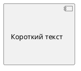
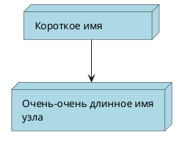
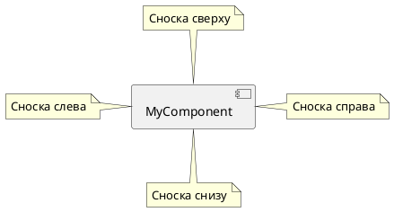
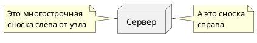
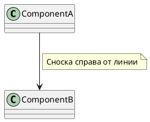
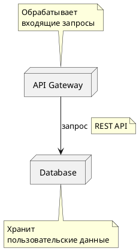

# PlantUML node minimum size settings

## 👤 **Kirill**

Задать миниммальный размер node в диаграмме компонентов Plantuml

---

## 🤖 **DeepSeek**

# Установка минимального размера узла в диаграмме компонентов PlantUML

К сожалению, **в PlantUML нет прямого способа задать минимальный или фиксированный размер для узлов (`node`) в диаграмме компонентов**. Размер узла по умолчанию определяется автоматически на основе его содержимого [citation:4].

Однако существуют обходные решения и связанные настройки, которые могут помочь вам управлять размерами элементов.

## Обходные решения

### 1. Добавление отступов внутри узла
Самый простой способ увеличить минимальный размер узла — добавить невидимые символы или пустые строки в текст. Для более предсказуемого результата используйте моноширинный шрифт [citation:4]:



### 2. Использование стилей (ограниченная поддержка)
Стилизация через блок `<style>` для `node` поддерживается, но не во всех версиях PlantUML. Свойства `MinimumWidth` и `MaximumWidth` могут не работать для диаграмм компонентов и классов в старых версиях [citation:5].

**Важно:** Согласно информации с форума PlantUML, проблемы с `MinimumWidth` и `MaximumWidth` для `node` были **исправлены в версии v1.2023.0** [citation:5]. Если вы используете актуальную версию, попробуйте следующий код:



### 3. Настройка переноса текста
Для контроля ширины узлов с длинным текстом можно использовать параметр `wrapwidth`:


## Что работает гарантированно?

Если вам нужен полный контроль над размерами узлов, рассмотрите следующие подходы:

| Подход | Надежность | Сложность |
|--------|------------|-----------|
| Ручной перенос строк (`\n`) | ✅ Высокая | Низкая |
| Моноширинный шрифт + пробелы | ✅ Высокая | Средняя |
| `<style>` с `MinimumWidth` | ⚠️ С версии v1.2023.0 | Низкая |
| `skinparam wrapwidth` | ✅ Высокая | Низкая |

## Альтернативное решение

Если стандартные средства не подходят, можно использовать **embedding Graphviz** внутри узла. Это позволяет явно задать размеры через атрибуты Graphviz, хотя такое решение выходит за рамки стандартного синтаксиса PlantUML [citation:4]:


## Рекомендация

**Обновите PlantUML до версии v1.2023.0 или новее** и используйте блок `<style>` с `MinimumWidth`. Это наиболее чистый и поддерживаемый способ решения задачи [citation:5]. Если обновление невозможно, используйте ручной перенос строк (`\n`) и пробелы для контроля размеров.

---

## 👤 **Kirill**

Направление сноски как задать?

---

## 🤖 **DeepSeek**

# Направление сноски (note) в PlantUML

В PlantUML направление сноски задается с помощью ключевых слов **`left`**, **`right`**, **`top`**, **`bottom`**, которые указываются **после слова `note`**.

## Базовый синтаксис



## Многострочная сноска с указанием направления



## Сноска с явной позицией на конце линии

Можно задать направление **относительно линии связи**:



## Полный пример с компонентами



## Краткая справка

| Направление | Синтаксис |
|-------------|-----------|
| Слева | `note left of` |
| Справа | `note right of` |
| Сверху | `note top of` |
| Снизу | `note bottom of` |
| У линии (слева) | `note left on link` |
| У линии (справа) | `note right on link` |

## Важное замечание

Направление сноски — это **рекомендация** для PlantUML, а не жесткое правило. При недостатке места рендерер может немного сместить сноску, чтобы избежать наложения элементов.

---

## 👤 **Kirill**

Passthrough что значит для сервисов а it

---

## 🤖 **DeepSeek**

# Passthrough для сервисов в IT

**Passthrough** (дословно — «пропуск насквозь», «транзит») означает, что сервис или компонент **передаёт данные, запросы или трафик дальше без их обработки, модификации или анализа**.

## Основные контексты использования

### 1. API Gateway / Прокси
Сервис действует как **прозрачный шлюз** — принимает запрос и отправляет его целевой системе без изменений:
- Не проверяет тело запроса
- Не аутентифицирует (или делегирует аутентификацию)
- Не изменяет заголовки
- Не логирует содержимое

```yaml
# Пример конфигурации в API Gateway
routes:
  /api/users:
    passthrough: true  # все запросы идут прямо в бэкенд
    target: http://user-service:8080
```

### 2. TLS/SSL Passthrough
В балансировщиках или Ingress-контроллерах (например, Kubernetes Ingress, HAProxy, Nginx) — **шифрованное соединение не расшифровывается** на балансировщике, а передаётся «как есть» до целевого сервера:

```
Клиент --(TLS)--> Балансировщик --(TLS, не расшифрован)--> Сервер
```

**Плюсы:** безопасность — ключи шифрования не хранятся на балансировщике  
**Минусы:** нельзя маршрутизировать по содержимому запроса (URL, заголовкам)

### 3. Service Mesh (Istio, Linkerd)
Режим, при котором sidecar-прокси **не применяет политики (mTLS, retries, timeouts)**, а просто пересылает трафик.

### 4. Kafka / Message Brokers
Коннектор передаёт сообщения из топика в топик без сериализации/десериализации или бизнес-логики.

## Сравнение: Passthrough vs обработка

| Характеристика | Passthrough | Обычная обработка |
|----------------|-------------|-------------------|
| Модификация данных | ❌ Нет | ✅ Да |
| Анализ содержимого | ❌ Нет | ✅ Да |
| Логирование тела | ❌ Обычно нет | ✅ Да |
| Задержка | Минимальная | Выше |
| Производительность | Высокая | Ниже |
| Безопасность | TLS может быть end-to-end | TLS часто терминируется |

## Типичные сценарии

1. **Балансировщик TCP-трафика** — просто перенаправляет соединения
2. **Ingress для HTTPS без расшифровки** — экономит CPU на балансировщике
3. **Транзитный сервис-адаптер** — меняет только протокол, но не данные (например, HTTP → gRPC без изменений полезной нагрузки)
4. **Аудит-прокси** — записывает метаданные (размер, время), но не смотрит содержимое

## Когда НЕ нужен passthrough

- Нужно маршрутизировать по **URL или заголовкам** (требуется расшифровка)
- Нужна **модификация запроса** (добавление заголовков, трансформация тела)
- Нужна **валидация или фильтрация** содержимого

## Резюме

**Passthrough** — это архитектурное решение **«не вмешиваться»**. Оно даёт максимальную производительность и end‑to‑end безопасность, но за счёт отказа от инспекции и маршрутизации по содержимому трафика.

---

## 👤 **Kirill**

Failover по бд

---

## 🤖 **DeepSeek**

# Failover по базе данных

**Failover** (переключение при отказе) — это автоматический или ручной переход с основной (primary/master) базы данных на резервную (standby/replica) при возникновении сбоя.

## Основные компоненты

```
Нормальная работа:
Клиент → Primary БД ← Репликация → Standby БД

После сбоя (failover):
Клиент → Standby БД (становится новой Primary)
```

## Типы failover

| Тип | Описание | Время простоя |
|-----|----------|---------------|
| **Автоматический** | Система сама детектирует сбой и переключается | Секунды |
| **Ручной** | Администратор принимает решение и выполняет переключение | Минуты+ |
| **Плановый** | Своп при обновлении/ремонте (switchover) | Минимальное |

## Архитектурные паттерны

### 1. Синхронная репликация
- Транзакция подтверждается только после записи на primary и standby
- Минимальная потеря данных (RPO ≈ 0)
- Влияет на производительность (задержки)

### 2. Асинхронная репликация
- Primary подтверждает транзакцию, не дожидаясь standby
- Высокая производительность
- Риск потери последних данных при сбое

### 3. Quorum-based (RAFT / Paxos)
- Несколько узлов голосуют
- Пример: Patroni + etcd, CockroachDB, YugabyteDB

## Механизмы детекции сбоя

```
Таймаут heartbeat (обычно 3-10 сек)
        ↓
Повторные попытки подключения
        ↓
Split-brain защита (fencing/STONITH)
        ↓
Промоушен нового primary
```

## Популярные решения

| Решение | Механизм | Особенность |
|---------|----------|-------------|
| **Patroni** (PostgreSQL) | etcd/zk/consul + API | Самое популярное для PG |
| **MySQL Group Replication** | InnoDB Cluster | Автоматический failover |
| **MSSQL Always On** | Windows Failover Cluster | Интеграция с AD |
| **MongoDB Replica Set** | Internal election | Автоматический |
| **Redis Sentinel** | Quorum + Raft-like | Для кешей |

## Ключевые метрики

- **RTO (Recovery Time Objective)** — сколько времени система недоступна
- **RPO (Recovery Point Objective)** — сколько данных потеряно

```
Типичные значения:
- Критичные системы: RTO < 10 сек, RPO = 0
- Стандартные: RTO < 2 мин, RPO < 5 сек
- Некритичные: RTO < 15 мин, RPO < 5 мин
```

## Проблемы и подводные камни

### 1. Split-brain (разделение мозга)
Обе ноды считают себя primary → конфликт записей

**Решение:** Fencing (отключение бывшего primary через STONITH)

### 2. Thundering herd
После failover все клиенты одновременно переподключаются

**Решение:** Jitter + exponential backoff + пул соединений

### 3. Ложные срабатывания
Сетевой лаг вызвал failover без реальной проблемы

**Решение:** Настройка чувствительности, несколько независимых проверок

### 4. Потеря соединений
Существующие подключения разрываются

**Решение:** Retry-логика на клиенте + connection pooling

## Пример конфигурации (Patroni + PostgreSQL)

```yaml
scope: prod-db
name: postgresql-node1

restapi:
  listen: 0.0.0.0:8008

bootstrap:
  dcs:
    ttl: 30
    loop_wait: 10
    retry_timeout: 10
    maximum_lag_on_failover: 1048576  # 1GB

postgresql:
  use_pg_rewind: true
  parameters:
    hot_standby: "on"
```

## Failover vs Switchover

| | Failover | Switchover |
|--|----------|-------------|
| Причина | Сбой (неплановый) | Обслуживание (плановый) |
| Риск потери данных | Есть (при асинхронной реплике) | Минимальный |
| Действия | Автоматические + уведомление | Контролируемые администратором |

## Рекомендации

1. **Всегда тестируйте failover** в среде, близкой к production
2. **Настраивайте мониторинг** самого процесса failover
3. **Используйте connection string с несколькими хостами** на клиенте
4. **Документируйте ручную процедуру** — автоматика не всегда срабатывает
5. **Не забывайте про обратный failover** (репромоушен старого primary)

## Итог

Failover — это не просто «переключили на запасную БД». Это комплексная система детекции сбоев, консенсуса, fencing, переподключения клиентов и восстановления после инцидента. В современных решениях (Patroni, Stolon, Vitess) failover обрабатывается автоматически, но требует тщательного проектирования и регулярного тестирования.

---

