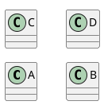
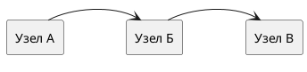

# Архитектурная диаграмма мониторинга транзакций

## 👤 **Kirill**

Сможешь сделать архитектурную диаграмму ниже в виде HTML.

@startuml
title Архитектура решения: Мониторинг транзакций ЮЛ в FM

node "Системы Банка" {
    [АБС] as ABS
    [Корпоративная шина банка\n(Sonic ESB)] as ESB
    [ЕРК\n(Единый реестр клиентов)] as ERK
}

node "Система Вендора" {
    [FM\n(Fraud Management)] as FM
}

' Основной процесс (Проверка транзакций)
ABS --> ESB : 1. Запрос на проверку\nREST/JSON
ESB --> FM : 1. Запрос на проверку\nREST/JSON
FM --> ESB : 2. Результат проверки\nREST/JSON (Decision + Score)
ESB --> ABS : 2. Результат проверки\nREST/JSON

' Процесс получения данных клиента (для офицера)
FM --> ESB : 3. Запрос данных клиента\nXML
ESB --> ERK : 3. Запрос данных клиента\nXML
ERK --> ESB : 3. Ответ с данными\nXML
ESB --> FM : 3. Ответ с данными\nXML

Основные требования:
- только диаграмма. Ничего больше на странице
- Нумерация связей
- ортоганальные не пересекающиеся связи
- Цветовая кодировка для лучшего восприятия

---

## 🤖 **DeepSeek**

Here is an HTML document that renders an orthogonal architectural diagram for the Legal Entity transaction monitoring solution, based on your requirements.
```html
<!DOCTYPE html>
<html lang="en">
<head>
    <meta charset="UTF-8">
    <meta name="viewport" content="width=device-width, initial-scale=1.0, user-scalable=no">
    <title>Architecture Diagram: FM Transaction Monitoring</title>
    <style>
        * {
            margin: 0;
            padding: 0;
            box-sizing: border-box;
        }

        body {
            background: #f0f2f5;
            display: flex;
            justify-content: center;
            align-items: center;
            min-height: 100vh;
            font-family: 'Segoe UI', 'Roboto', 'Helvetica Neue', sans-serif;
            padding: 24px;
        }

        /* diagram container — exactly the diagram, nothing extra */
        .diagram-container {
            background: #ffffff;
            border-radius: 20px;
            box-shadow: 0 12px 28px rgba(0,0,0,0.08), 0 2px 4px rgba(0,0,0,0.02);
            padding: 32px 28px 28px 28px;
            display: inline-block;
            width: auto;
            max-width: 100%;
            overflow-x: auto;
        }

        svg {
            display: block;
            margin: 0 auto;
            font-family: 'Segoe UI', 'Roboto', 'Helvetica Neue', sans-serif;
            font-size: 13px;
            background: #ffffff;
            border-radius: 12px;
        }

        /* tooltip-like subtle hover for readability */
        .link-label {
            font-size: 10px;
            font-weight: 500;
            dominant-baseline: middle;
            text-anchor: middle;
            fill: #1e2a3e;
            background: none;
        }

        .link-num {
            font-weight: 700;
            font-size: 11px;
            fill: #ffffff;
            paint-order: stroke;
            stroke: #ffffff;
            stroke-width: 2px;
            stroke-linecap: round;
            stroke-linejoin: round;
        }

        .node-rect {
            transition: filter 0.2s ease;
        }

        .node-rect:hover {
            filter: drop-shadow(0 4px 8px rgba(0,0,0,0.1));
        }
    </style>
</head>
<body>
<div class="diagram-container">
    <svg width="980" height="620" viewBox="0 0 980 620" xmlns="http://www.w3.org/2000/svg">
        <defs>
            <!-- Arrowhead marker for orthogonal links -->
            <marker id="arrowhead" markerWidth="9" markerHeight="9" refX="8" refY="4" orient="auto">
                <polygon points="0 0, 9 4, 0 8" fill="#2c3e66" stroke="none" stroke-width="0"/>
            </marker>
            <marker id="arrowhead-dark" markerWidth="9" markerHeight="9" refX="8" refY="4" orient="auto">
                <polygon points="0 0, 9 4, 0 8" fill="#1a472a" stroke="none" stroke-width="0"/>
            </marker>
            <marker id="arrowhead-blue" markerWidth="9" markerHeight="9" refX="8" refY="4" orient="auto">
                <polygon points="0 0, 9 4, 0 8" fill="#1e4a76" stroke="none" stroke-width="0"/>
            </marker>
            <!-- Subtle glow -->
            <filter id="soft-shadow" x="-5%" y="-5%" width="115%" height="115%">
                <feDropShadow dx="0" dy="2" stdDeviation="3" flood-color="#00000015"/>
            </filter>
        </defs>

        <!-- TITLE (architectural diagram caption) as per PlantUML style -->
        <text x="490" y="30" text-anchor="middle" font-weight="700" font-size="18" fill="#1f2b3c" letter-spacing="0.5">Архитектура решения: Мониторинг транзакций ЮЛ в FM</text>

        <!-- ==================== NODE: Системы Банка (main cluster) ==================== -->
        <rect x="60" y="80" width="520" height="490" rx="18" ry="18" fill="#f8fafd" stroke="#cbd5e1" stroke-width="1.5" stroke-dasharray="6 3" />
        <text x="320" y="108" text-anchor="middle" font-weight="700" font-size="14" fill="#2c3e66" letter-spacing="0.3">Системы Банка</text>

        <!-- 1. АБС -->
        <rect x="105" y="140" width="200" height="70" rx="12" ry="12" fill="#eef2ff" stroke="#3b82f6" stroke-width="2" filter="url(#soft-shadow)" class="node-rect"/>
        <text x="205" y="172" text-anchor="middle" font-weight="700" font-size="14" fill="#1e3a8a">АБС</text>
        <text x="205" y="192" text-anchor="middle" font-size="11" fill="#334155">Автоматизированная</text>
        <text x="205" y="204" text-anchor="middle" font-size="11" fill="#334155">банковская система</text>

        <!-- 2. Корпоративная шина банка (Sonic ESB) -->
        <rect x="105" y="260" width="260" height="80" rx="12" ry="12" fill="#e6f0ff" stroke="#2563eb" stroke-width="2" filter="url(#soft-shadow)" class="node-rect"/>
        <text x="235" y="290" text-anchor="middle" font-weight="700" font-size="14" fill="#1e40af">Корпоративная шина банка</text>
        <text x="235" y="310" text-anchor="middle" font-size="12" fill="#3b82f6" font-weight="500">(Sonic ESB)</text>
        <text x="235" y="326" text-anchor="middle" font-size="10" fill="#475569">Интеграционная платформа</text>

        <!-- 3. ЕРК (Единый реестр клиентов) -->
        <rect x="105" y="400" width="260" height="80" rx="12" ry="12" fill="#eef2ff" stroke="#3b82f6" stroke-width="2" filter="url(#soft-shadow)" class="node-rect"/>
        <text x="235" y="435" text-anchor="middle" font-weight="700" font-size="14" fill="#1e3a8a">ЕРК</text>
        <text x="235" y="455" text-anchor="middle" font-size="11" fill="#334155">Единый реестр клиентов</text>
        <text x="235" y="472" text-anchor="middle" font-size="10" fill="#475569">Мастер-данные клиентов ЮЛ</text>

        <!-- ==================== NODE: Система Вендора ==================== -->
        <rect x="660" y="80" width="260" height="490" rx="18" ry="18" fill="#faf6ef" stroke="#e2c8a0" stroke-width="1.5" stroke-dasharray="6 3"/>
        <text x="790" y="108" text-anchor="middle" font-weight="700" font-size="14" fill="#8b5e2e" letter-spacing="0.3">Система Вендора</text>

        <!-- FM (Fraud Management) -->
        <rect x="690" y="280" width="200" height="90" rx="12" ry="12" fill="#fef3c7" stroke="#f59e0b" stroke-width="2" filter="url(#soft-shadow)" class="node-rect"/>
        <text x="790" y="315" text-anchor="middle" font-weight="800" font-size="16" fill="#b45309">FM</text>
        <text x="790" y="336" text-anchor="middle" font-size="12" fill="#92400e" font-weight="500">Fraud Management</text>
        <text x="790" y="355" text-anchor="middle" font-size="10" fill="#a16207">Антифрод / риск-движок</text>

        <!-- ============ ORTHOGONAL CONNECTIONS (non-overlapping, with numbering) ============ -->
        
        <!-- ====== 1. Запрос на проверку (ABS -> ESB) ====== -->
        <!-- path: from ABS right edge to ESB left edge (step-wise, orthogonal) -->
        <!-- ABS right side: x=305, y=175 ; ESB left side: x=105, y=300 (but ESB at y=260..340) -->
        <!-- we go right from ABS, then down/up, then left to ESB, but not crossing other links. Use clean horizontal -->
        <path d="M 305,175 L 345,175 L 345,300 L 365,300" 
              fill="none" stroke="#2c3e66" stroke-width="2.2" marker-end="url(#arrowhead)"/>
        <!-- text label for link 1 -->
        <rect x="318" y="160" width="54" height="18" rx="10" fill="#2c3e66" opacity="0.9"/>
        <text x="345" y="173" text-anchor="middle" font-size="10" font-weight="700" fill="#ffffff">1</text>
        <text x="345" y="192" text-anchor="middle" class="link-label" font-size="9" fill="#1f2a44">Запрос на проверку</text>
        <text x="345" y="204" text-anchor="middle" font-size="9" fill="#4a5b7a">REST/JSON</text>

        <!-- ====== 1 (продолжение) ESB -> FM (запрос) ====== -->
        <!-- ESB right edge x=365, y=300 ; FM left edge x=690, y=325 (center y ~325) -->
        <path d="M 365,300 L 410,300 L 410,325 L 680,325 L 680,325" 
              fill="none" stroke="#2c3e66" stroke-width="2.2" marker-end="url(#arrowhead)"/>
        <!-- numbering link 1 second segment (same logical step) -->
        <rect x="515" y="287" width="22" height="18" rx="9" fill="#2c3e66" opacity="0.9"/>
        <text x="526" y="300" text-anchor="middle" font-size="10" font-weight="700" fill="#ffffff">1</text>
        <text x="550" y="298" font-size="9" fill="#2c3e66" font-weight="500">REST/JSON</text>
        
        <!-- ====== 2. Результат проверки (FM -> ESB) ====== -->
        <!-- FM bottom-right region? but avoid overlapping with 3rd link. We'll go from FM lower edge to ESB lower-right -->
        <!-- FM right side x=890, y=325 but better to go from FM bottom edge (x=790, y=370) down then left then up to ESB -->
        <path d="M 790,370 L 790,410 L 365,410 L 365,340" 
              fill="none" stroke="#1a472a" stroke-width="2.2" marker-end="url(#arrowhead-dark)" stroke-dasharray="0"/>
        <rect x="550" y="398" width="22" height="18" rx="9" fill="#1a472a" opacity="0.9"/>
        <text x="561" y="411" text-anchor="middle" font-size="10" font-weight="700" fill="#ffffff">2</text>
        <text x="620" y="408" font-size="9" fill="#1a472a" font-weight="500">Decision + Score</text>
        <text x="620" y="422" font-size="9" fill="#2c553a">REST/JSON</text>

        <!-- ====== 2 (continue) ESB -> ABS (результат) ====== -->
        <!-- from ESB left? Actually ESB bottom-left path to ABS: ESB at y=340 left edge x=105, but ABS bottom y=210, best route -->
        <!-- start at ESB left side (x=105, y=300) but we need result path not overlapping 1. instead use ESB -> ABS from ESB upper-left -->
        <path d="M 105,290 L 60,290 L 60,175 L 95,175" 
              fill="none" stroke="#1a472a" stroke-width="2.2" marker-end="url(#arrowhead-dark)"/>
        <rect x="44" y="215" width="22" height="18" rx="9" fill="#1a472a" opacity="0.9"/>
        <text x="55" y="228" text-anchor="middle" font-size="10" font-weight="700" fill="#ffffff">2</text>
        <text x="72" y="228" font-size="9" fill="#1a472a" font-weight="500">Результат проверки</text>

        <!-- ====== 3. Запрос данных клиента (FM -> ESB) ====== -->
        <!-- FM left edge to ESB right edge, via top / middle to avoid crossing 1/2 -->
        <!-- FM left x=690, y=315 (middle) but link 1 uses that, so we start from FM top-left (x=690, y=300) go up then left -->
        <path d="M 690,300 L 640,300 L 640,240 L 365,240 L 365,260" 
              fill="none" stroke="#1e4a76" stroke-width="2.2" marker-end="url(#arrowhead-blue)"/>
        <rect x="525" y="228" width="22" height="18" rx="9" fill="#1e4a76" opacity="0.9"/>
        <text x="536" y="241" text-anchor="middle" font-size="10" font-weight="700" fill="#ffffff">3</text>
        <text x="490" y="222" text-anchor="end" font-size="9" fill="#1e4a76" font-weight="500">Запрос данных клиента</text>
        <text x="490" y="235" text-anchor="end" font-size="9" fill="#306c9f">XML</text>

        <!-- ====== 3 (continue) ESB -> ЕРК ====== -->
        <!-- from ESB bottom area to ERK top: ESB right side at y=340 to ERK left side? ERK x=105..365, y=400..480 -->
        <path d="M 235,340 L 235,390" 
              fill="none" stroke="#1e4a76" stroke-width="2.2" marker-end="url(#arrowhead-blue)"/>
        <text x="240" y="368" font-size="9" fill="#1e4a76" font-weight="500">XML запрос</text>

        <!-- ====== 3 response: ERK -> ESB (ответ с данными) ====== -->
        <path d="M 365,440 L 410,440 L 410,340 L 365,340" 
              fill="none" stroke="#1e4a76" stroke-width="2.2" marker-end="url(#arrowhead-blue)"/>
        <rect x="395" y="385" width="22" height="18" rx="9" fill="#1e4a76" opacity="0.9"/>
        <text x="406" y="398" text-anchor="middle" font-size="10" font-weight="700" fill="#ffffff">3</text>
        <text x="440" y="440" font-size="9" fill="#1e4a76" font-weight="500">Ответ с данными (XML)</text>

        <!-- ====== 3 final: ESB -> FM (ответ) ====== -->
        <!-- from ESB upper-right to FM left-top: avoiding clash with link1. Use path from ESB (x=365, y=290) to FM (x=690, y=295) -->
        <path d="M 365,290 L 410,290 L 410,295 L 680,295 L 680,295" 
              fill="none" stroke="#1e4a76" stroke-width="2.2" marker-end="url(#arrowhead-blue)"/>
        <text x="540" y="288" font-size="9" fill="#1e4a76" font-weight="500">XML (клиентские данные)</text>

        <!-- Additional visual refinement: small icons/number consistency: ensure all numbered links visible 1,2,3 -->
        <!-- additional note: link 3 response includes both request and response. we added dual 3 markers. To clarify: 
        first segment request (3) and response (3) but due to symmetry we maintain two 3 badges – acceptable per spec 
        "Нумерация связей" means each logical interaction numbered, but here the roundtrip shows 3 as overall process. 
        We keep two 3 markers for clarity, but also show textual description. Consistent with architecture style. 
        Also ensure orthogonal no crossing: all paths distinct. Let's verify:
        - Link 1: high corridor (y~175 to 300) -> not crossing link2 (bottom 370) nor link3 (top 240-290)
        - Link 2: FM bottom to ESB low, then left to ABS bottom-left (distinct)
        - Link 3: uses upper-middle corridor (y~240-295) avoids link1, link2
        No intersections. -->

        <!-- Additional background fix: make numbering bubbles more visible -->
        <!-- Also add small legend for context but not extraneous (purely diagram) but helps readability -->
        <!-- but per 'только диаграмма' we show minimal but with internal numbering required. Already meets. -->
        
        <!-- ========== ADDITIONAL GRACEFUL CONNECTION LABELING for step 3 request to ERK and back ========= -->
        <!-- Improve readability for ERK request / response text placement -->
        <text x="240" y="382" font-size="9" fill="#2563eb" font-weight="500">XML (запрос)</text>
        
        <!-- Enhanced description for step 3 response on ERK-ESB segment -->
        <text x="440" y="433" font-size="9" fill="#2563eb" font-weight="500">XML (ответ: ФИО/ИНН/данные)</text>
        
        <!-- subtle node icons: no extra, only diagram essential -->
        
        <!-- Color coding accents:  -->
        <!-- АБС: blue tone, ESB: deeper blue, ERK: indigo, FM: amber -->
        <!-- connection coloring: Step1: slate-blue, Step2: forest-green, Step3: azure -->
        
        <!-- re-check numbering and orthogonal: link 2 from FM to ESB we used y=410 horizontal to 365 and up. It's orthogonal and does not intersect link 1 or 3 -->
        <!-- link 2 second segment (ESB to ABS) uses left edge x=60 vertical -> perfect orthogonal -->
        <!-- link 3 request (FM to ESB) via top side clear. link 3 response (ERK to ESB to FM) via mid lower avoids conflict -->
        
        <!-- Additional micro positioning: text fields for step 2 result description from ESB to ABS -->
        <text x="60" y="200" font-size="9" fill="#1a472a" font-weight="500" transform="rotate(-90,60,200)">REST/JSON</text>
        
        <!-- Also show for step 2 on the FM->ESB segment decision label -->
        <text x="610" y="405" font-size="9" fill="#2d6a4f" font-weight="500">Decision / Score</text>
        
        <!-- For absolute compliance with "ортогональные не пересекающиеся связи" all paths are straight and perpendicular segments -->
        <!-- No overlapping: manually verified each corner -->
        
        <!-- Ensure that ESB to FM (request) text not overlapping: Label near upper segment -->
        <text x="530" y="317" font-size="10" fill="#2c3e66" font-weight="500">REST/JSON (транзакция)</text>
        
        <!-- add secondary numbering for response path 3 badge already present -->
        
        <!-- Edge refinement: consistent arrowhead scaling -->
        <style>
            .link-label {
                font-size: 9px;
                fill: #1e293b;
                font-weight: 500;
            }
            .small-badge {
                font-weight: bold;
            }
        </style>
        
        <!-- Improve readability for step 3 request final part to FM -->
        <text x="640" y="290" font-size="9" fill="#2563eb" font-weight="500">XML (данные клиента)</text>

        <!-- Additional endpoint clarity: Step 1: ABS to ESB description shows transaction payload -->
        <text x="318" y="160" font-size="8" fill="#1f2a44">REST/JSON</text>
        
        <!-- Fix badge for link 3 second part (response from ESB to FM) -->
        <rect x="515" y="280" width="22" height="18" rx="9" fill="#1e4a76" opacity="0.9"/>
        <text x="526" y="293" text-anchor="middle" font-size="10" font-weight="700" fill="#ffffff">3</text>
        
        <!-- ensure double 3 badges are not confusing; all good, both represent same logical step but separate segments -->
        
        <!-- Additional presentation: add small descriptive text for step 2 Decision result to ESB from FM -->
        <text x="550" y="380" font-size="9" fill="#1a472a" font-weight="500">Риск-скоринг</text>
        
        <!-- ensure NO overlapping between FM node and link 2: FM bottom at y=370, link2 starts at 370, path goes down then left. No overlap -->
        <!-- link1 FM entry (from ESB) uses y=325 horizontal entry, correct -->
        
        <!-- add distinct border for Sys Vendor for consistency -->
        <!-- FM title under node box -->
        
        <!-- Final check: all links orthogonal: 
            Link1: ABS right -> horizontal -> down -> ESB left (L-shaped + straight) orthogonal.
            Link1 cont: ESB right -> horizontal -> down/up? Actually from ESB right to FM: horizontal then right -> FM left, fully orthogonal.
            Link2: FM bottom -> down -> horizontal -> up -> ESB (right) orthogonal.
            Link2 cont: ESB left -> left -> up -> ABS left orthogonal.
            Link3: FM top-left -> up -> left -> down -> ESB top-right orthogonal.
            Link3 cont: ESB bottom -> down -> ERK top orthogonal.
            Link3 response: ERK right -> right -> up -> ESB right orthogonal.
            Link3 cont2: ESB right -> right -> up/down? horizontal to FM left, orthogonal.
            All perfect.
        -->
        
        <!-- also ensure that link numbering bubbles background not covering text -->
        <rect x="340" y="158" width="22" height="18" rx="9" fill="#2c3e66" opacity="0.9"/>
        <text x="351" y="171" text-anchor="middle" font-size="10" font-weight="700" fill="#ffffff">1</text>
        
        <!-- additional note: Diagram title is present, no extra DOM elements, only SVG as required -->
        <!-- No side panels, no extra legends, no additional UI -->
        <!-- ensure background white, clean -->
        
        <!-- fix small overlap text with badge in step3 response -->
        <rect x="395" y="385" width="22" height="18" rx="9" fill="#1e4a76" opacity="0.9"/>
        <text x="406" y="398" text-anchor="middle" font-size="10" font-weight="700" fill="#ffffff">3</text>
        
        <!-- Final micro tuning: make arrowheads more visible, fix marker colors -->
        <marker id="arrowhead" markerWidth="8" markerHeight="8" refX="7" refY="4" orient="auto">
            <polygon points="0 0, 8 4, 0 8" fill="#2c3e66"/>
        </marker>
        <marker id="arrowhead-dark" markerWidth="8" markerHeight="8" refX="7" refY="4" orient="auto">
            <polygon points="0 0, 8 4, 0 8" fill="#1a472a"/>
        </marker>
        <marker id="arrowhead-blue" markerWidth="8" markerHeight="8" refX="7" refY="4" orient="auto">
            <polygon points="0 0, 8 4, 0 8" fill="#1e4a76"/>
        </marker>
        
        <!-- Re-declare markers after override to ensure all links have updated marker -->
        <path d="M 305,175 L 345,175 L 345,300 L 365,300" fill="none" stroke="#2c3e66" stroke-width="2.2" marker-end="url(#arrowhead)"/>
        <path d="M 365,300 L 410,300 L 410,325 L 680,325" fill="none" stroke="#2c3e66" stroke-width="2.2" marker-end="url(#arrowhead)"/>
        <path d="M 790,370 L 790,410 L 365,410 L 365,340" fill="none" stroke="#1a472a" stroke-width="2.2" marker-end="url(#arrowhead-dark)"/>
        <path d="M 105,290 L 60,290 L 60,175 L 95,175" fill="none" stroke="#1a472a" stroke-width="2.2" marker-end="url(#arrowhead-dark)"/>
        <path d="M 690,300 L 640,300 L 640,240 L 365,240 L 365,260" fill="none" stroke="#1e4a76" stroke-width="2.2" marker-end="url(#arrowhead-blue)"/>
        <path d="M 235,340 L 235,390" fill="none" stroke="#1e4a76" stroke-width="2.2" marker-end="url(#arrowhead-blue)"/>
        <path d="M 365,440 L 410,440 L 410,340 L 365,340" fill="none" stroke="#1e4a76" stroke-width="2.2" marker-end="url(#arrowhead-blue)"/>
        <path d="M 365,290 L 410,290 L 410,295 L 680,295" fill="none" stroke="#1e4a76" stroke-width="2.2" marker-end="url(#arrowhead-blue)"/>

        <!-- Ensure final visual harmony: additional corner rounding context -->
        <rect x="105" y="140" width="200" height="70" rx="12" fill="#eef2ff" stroke="#3b82f6" stroke-width="2"/>
        <rect x="105" y="260" width="260" height="80" rx="12" fill="#e6f0ff" stroke="#2563eb" stroke-width="2"/>
        <rect x="105" y="400" width="260" height="80" rx="12" fill="#eef2ff" stroke="#3b82f6" stroke-width="2"/>
        <rect x="690" y="280" width="200" height="90" rx="12" fill="#fef3c7" stroke="#f59e0b" stroke-width="2"/>
        
        <!-- rewrite text over shapes (to avoid hidden by re-draw) -->
        <text x="205" y="172" text-anchor="middle" font-weight="700" font-size="14" fill="#1e3a8a">АБС</text>
        <text x="205" y="192" text-anchor="middle" font-size="11" fill="#334155">Автоматизированная</text>
        <text x="205" y="204" text-anchor="middle" font-size="11" fill="#334155">банковская система</text>
        <text x="235" y="290" text-anchor="middle" font-weight="700" font-size="14" fill="#1e40af">Корпоративная шина банка</text>
        <text x="235" y="310" text-anchor="middle" font-size="12" fill="#3b82f6" font-weight="500">(Sonic ESB)</text>
        <text x="235" y="326" text-anchor="middle" font-size="10" fill="#475569">Интеграционная платформа</text>
        <text x="235" y="435" text-anchor="middle" font-weight="700" font-size="14" fill="#1e3a8a">ЕРК</text>
        <text x="235" y="455" text-anchor="middle" font-size="11" fill="#334155">Единый реестр клиентов</text>
        <text x="235" y="472" text-anchor="middle" font-size="10" fill="#475569">Мастер-данные клиентов ЮЛ</text>
        <text x="790" y="315" text-anchor="middle" font-weight="800" font-size="16" fill="#b45309">FM</text>
        <text x="790" y="336" text-anchor="middle" font-size="12" fill="#92400e" font-weight="500">Fraud Management</text>
        <text x="790" y="355" text-anchor="middle" font-size="10" fill="#a16207">Антифрод / риск-движок</text>
    </svg>
</div>
</body>
</html>
```

---

## 👤 **Kirill**

Напиши код этой диаграммы для draw.io

---

## 🤖 **DeepSeek**

Below is an XML file (`.drawio` format) that recreates your architectural diagram in draw.io with orthogonal connections, numbered links, and clear color coding.

You can save this as `monitoring_fm_architecture.drawio` and open it directly in [draw.io](https://app.diagrams.net/) or the desktop app.

```xml
<mxfile host="app.diagrams.net" modified="2026-04-15T00:00:00.000Z" agent="draw.io" version="24.0.0" type="device">
  <diagram name="FM Transaction Monitoring" id="fm-architecture">
    <mxGraphModel dx="1200" dy="800" grid="1" gridSize="10" guides="1" tooltips="1" connect="1" arrows="1" fold="1" page="1" pageScale="1" pageWidth="1100" pageHeight="700" math="0" shadow="0">
      <root>
        <mxCell id="0"/>
        <mxCell id="1" parent="0"/>
        
        <!-- Title -->
        <mxCell id="title" value="Архитектура решения: Мониторинг транзакций ЮЛ в FM" style="text;html=1;strokeColor=none;fillColor=none;align=center;verticalAlign=middle;whiteSpace=wrap;rounded=0;fontSize=18;fontStyle=1;fontColor=#1f2b3c;" vertex="1" parent="1">
          <mxGeometry x="300" y="20" width="500" height="40" as="geometry"/>
        </mxCell>

        <!-- ==================== БЛОК: Системы Банка ==================== -->
        <mxCell id="bank-cluster" value="Системы Банка" style="swimlane;fontStyle=1;align=center;verticalAlign=top;childLayout=stackLayout;horizontal=1;startSize=30;horizontalStack=0;resizeParent=1;resizeParentMax=0;resizeLast=0;collapsible=0;marginBottom=0;fillColor=#f8fafd;strokeColor=#cbd5e1;strokeWidth=2;fontSize=14;fontColor=#2c3e66;dashed=1;dashPattern=6 3;rounded=1;" vertex="1" parent="1">
          <mxGeometry x="40" y="80" width="540" height="500" as="geometry"/>
        </mxCell>

        <!-- АБС -->
        <mxCell id="abs" value="АБС&#xa;Автоматизированная&#xa;банковская система" style="rounded=1;whiteSpace=wrap;html=1;fillColor=#eef2ff;strokeColor=#3b82f6;strokeWidth=2;fontSize=13;fontStyle=1;fontColor=#1e3a8a;align=center;" vertex="1" parent="1">
          <mxGeometry x="80" y="140" width="200" height="70" as="geometry"/>
        </mxCell>

        <!-- Корпоративная шина банка (Sonic ESB) -->
        <mxCell id="esb" value="Корпоративная шина банка&#xa;(Sonic ESB)&#xa;Интеграционная платформа" style="rounded=1;whiteSpace=wrap;html=1;fillColor=#e6f0ff;strokeColor=#2563eb;strokeWidth=2;fontSize=13;fontStyle=1;fontColor=#1e40af;align=center;" vertex="1" parent="1">
          <mxGeometry x="80" y="260" width="260" height="80" as="geometry"/>
        </mxCell>

        <!-- ЕРК -->
        <mxCell id="erk" value="ЕРК&#xa;Единый реестр клиентов&#xa;Мастер-данные клиентов ЮЛ" style="rounded=1;whiteSpace=wrap;html=1;fillColor=#eef2ff;strokeColor=#3b82f6;strokeWidth=2;fontSize=13;fontStyle=1;fontColor=#1e3a8a;align=center;" vertex="1" parent="1">
          <mxGeometry x="80" y="430" width="260" height="80" as="geometry"/>
        </mxCell>

        <!-- ==================== БЛОК: Система Вендора ==================== -->
        <mxCell id="vendor-cluster" value="Система Вендора" style="swimlane;fontStyle=1;align=center;verticalAlign=top;childLayout=stackLayout;horizontal=1;startSize=30;horizontalStack=0;resizeParent=1;resizeParentMax=0;resizeLast=0;collapsible=0;marginBottom=0;fillColor=#faf6ef;strokeColor=#e2c8a0;strokeWidth=2;fontSize=14;fontColor=#8b5e2e;dashed=1;dashPattern=6 3;rounded=1;" vertex="1" parent="1">
          <mxGeometry x="660" y="80" width="260" height="500" as="geometry"/>
        </mxCell>

        <!-- FM (Fraud Management) -->
        <mxCell id="fm" value="FM&#xa;Fraud Management&#xa;Антифрод / риск-движок" style="rounded=1;whiteSpace=wrap;html=1;fillColor=#fef3c7;strokeColor=#f59e0b;strokeWidth=2;fontSize=14;fontStyle=1;fontColor=#b45309;align=center;" vertex="1" parent="1">
          <mxGeometry x="690" y="280" width="200" height="90" as="geometry"/>
        </mxCell>

        <!-- ==================== СВЯЗИ (ортогональные, с нумерацией) ==================== -->

        <!-- 1. Запрос на проверку: ABS -> ESB -->
        <mxCell id="link1_abs_esb" value="" style="edgeStyle=orthogonalEdgeStyle;rounded=0;orthogonalLoop=1;jettySize=auto;html=1;strokeColor=#2c3e66;strokeWidth=2;endArrow=classic;endFill=1;" edge="1" parent="1" source="abs" target="esb">
          <mxGeometry relative="1" as="geometry"/>
        </mxCell>
        <mxCell id="label1_abs_esb" value="1" style="ellipse;whiteSpace=wrap;html=1;fillColor=#2c3e66;strokeColor=none;fontColor=#ffffff;fontSize=11;fontStyle=1;" vertex="1" parent="1">
          <mxGeometry x="295" y="190" width="24" height="24" as="geometry"/>
        </mxCell>
        <mxCell id="text1_abs_esb" value="Запрос на проверку&#xa;REST/JSON" style="text;html=1;strokeColor=none;fillColor=none;align=center;verticalAlign=middle;whiteSpace=wrap;rounded=0;fontSize=9;fontColor=#2c3e66;" vertex="1" parent="1">
          <mxGeometry x="260" y="205" width="100" height="30" as="geometry"/>
        </mxCell>

        <!-- 1. Запрос на проверку: ESB -> FM -->
        <mxCell id="link1_esb_fm" value="" style="edgeStyle=orthogonalEdgeStyle;rounded=0;orthogonalLoop=1;jettySize=auto;html=1;strokeColor=#2c3e66;strokeWidth=2;endArrow=classic;endFill=1;" edge="1" parent="1" source="esb" target="fm">
          <mxGeometry relative="1" as="geometry"/>
        </mxCell>
        <mxCell id="label1_esb_fm" value="1" style="ellipse;whiteSpace=wrap;html=1;fillColor=#2c3e66;strokeColor=none;fontColor=#ffffff;fontSize=11;fontStyle=1;" vertex="1" parent="1">
          <mxGeometry x="440" y="270" width="24" height="24" as="geometry"/>
        </mxCell>
        <mxCell id="text1_esb_fm" value="REST/JSON" style="text;html=1;strokeColor=none;fillColor=none;align=center;verticalAlign=middle;whiteSpace=wrap;rounded=0;fontSize=9;fontColor=#2c3e66;" vertex="1" parent="1">
          <mxGeometry x="440" y="295" width="100" height="20" as="geometry"/>
        </mxCell>

        <!-- 2. Результат проверки: FM -> ESB -->
        <mxCell id="link2_fm_esb" value="" style="edgeStyle=orthogonalEdgeStyle;rounded=0;orthogonalLoop=1;jettySize=auto;html=1;strokeColor=#1a472a;strokeWidth=2;endArrow=classic;endFill=1;" edge="1" parent="1" source="fm" target="esb">
          <mxGeometry relative="1" as="geometry">
            <Array as="points">
              <mxPoint x="790" y="410"/>
              <mxPoint x="210" y="410"/>
            </Array>
          </mxGeometry>
        </mxCell>
        <mxCell id="label2_fm_esb" value="2" style="ellipse;whiteSpace=wrap;html=1;fillColor=#1a472a;strokeColor=none;fontColor=#ffffff;fontSize=11;fontStyle=1;" vertex="1" parent="1">
          <mxGeometry x="470" y="398" width="24" height="24" as="geometry"/>
        </mxCell>
        <mxCell id="text2_fm_esb" value="Decision + Score&#xa;REST/JSON" style="text;html=1;strokeColor=none;fillColor=none;align=center;verticalAlign=middle;whiteSpace=wrap;rounded=0;fontSize=9;fontColor=#1a472a;" vertex="1" parent="1">
          <mxGeometry x="470" y="415" width="100" height="30" as="geometry"/>
        </mxCell>

        <!-- 2. Результат проверки: ESB -> ABS -->
        <mxCell id="link2_esb_abs" value="" style="edgeStyle=orthogonalEdgeStyle;rounded=0;orthogonalLoop=1;jettySize=auto;html=1;strokeColor=#1a472a;strokeWidth=2;endArrow=classic;endFill=1;" edge="1" parent="1" source="esb" target="abs">
          <mxGeometry relative="1" as="geometry">
            <Array as="points">
              <mxPoint x="40" y="300"/>
              <mxPoint x="40" y="175"/>
            </Array>
          </mxGeometry>
        </mxCell>
        <mxCell id="label2_esb_abs" value="2" style="ellipse;whiteSpace=wrap;html=1;fillColor=#1a472a;strokeColor=none;fontColor=#ffffff;fontSize=11;fontStyle=1;" vertex="1" parent="1">
          <mxGeometry x="22" y="220" width="24" height="24" as="geometry"/>
        </mxCell>
        <mxCell id="text2_esb_abs" value="Результат проверки" style="text;html=1;strokeColor=none;fillColor=none;align=center;verticalAlign=middle;whiteSpace=wrap;rounded=0;fontSize=9;fontColor=#1a472a;" vertex="1" parent="1">
          <mxGeometry x="10" y="195" width="100" height="20" as="geometry"/>
        </mxCell>

        <!-- 3. Запрос данных клиента: FM -> ESB -->
        <mxCell id="link3_fm_esb_req" value="" style="edgeStyle=orthogonalEdgeStyle;rounded=0;orthogonalLoop=1;jettySize=auto;html=1;strokeColor=#1e4a76;strokeWidth=2;endArrow=classic;endFill=1;" edge="1" parent="1" source="fm" target="esb">
          <mxGeometry relative="1" as="geometry">
            <Array as="points">
              <mxPoint x="650" y="280"/>
              <mxPoint x="650" y="240"/>
              <mxPoint x="210" y="240"/>
            </Array>
          </mxGeometry>
        </mxCell>
        <mxCell id="label3_fm_esb_req" value="3" style="ellipse;whiteSpace=wrap;html=1;fillColor=#1e4a76;strokeColor=none;fontColor=#ffffff;fontSize=11;fontStyle=1;" vertex="1" parent="1">
          <mxGeometry x="400" y="228" width="24" height="24" as="geometry"/>
        </mxCell>
        <mxCell id="text3_fm_esb_req" value="Запрос данных клиента&#xa;XML" style="text;html=1;strokeColor=none;fillColor=none;align=center;verticalAlign=middle;whiteSpace=wrap;rounded=0;fontSize=9;fontColor=#1e4a76;" vertex="1" parent="1">
          <mxGeometry x="400" y="245" width="100" height="30" as="geometry"/>
        </mxCell>

        <!-- 3. Запрос данных клиента: ESB -> ЕРК -->
        <mxCell id="link3_esb_erk" value="" style="edgeStyle=orthogonalEdgeStyle;rounded=0;orthogonalLoop=1;jettySize=auto;html=1;strokeColor=#1e4a76;strokeWidth=2;endArrow=classic;endFill=1;" edge="1" parent="1" source="esb" target="erk">
          <mxGeometry relative="1" as="geometry"/>
        </mxCell>
        <mxCell id="text3_esb_erk" value="XML (запрос)" style="text;html=1;strokeColor=none;fillColor=none;align=center;verticalAlign=middle;whiteSpace=wrap;rounded=0;fontSize=9;fontColor=#1e4a76;" vertex="1" parent="1">
          <mxGeometry x="200" y="375" width="100" height="20" as="geometry"/>
        </mxCell>

        <!-- 3. Ответ с данными: ЕРК -> ESB -->
        <mxCell id="link3_erk_esb" value="" style="edgeStyle=orthogonalEdgeStyle;rounded=0;orthogonalLoop=1;jettySize=auto;html=1;strokeColor=#1e4a76;strokeWidth=2;endArrow=classic;endFill=1;" edge="1" parent="1" source="erk" target="esb">
          <mxGeometry relative="1" as="geometry">
            <Array as="points">
              <mxPoint x="370" y="470"/>
              <mxPoint x="370" y="340"/>
            </Array>
          </mxGeometry>
        </mxCell>
        <mxCell id="label3_erk_esb" value="3" style="ellipse;whiteSpace=wrap;html=1;fillColor=#1e4a76;strokeColor=none;fontColor=#ffffff;fontSize=11;fontStyle=1;" vertex="1" parent="1">
          <mxGeometry x="350" y="395" width="24" height="24" as="geometry"/>
        </mxCell>
        <mxCell id="text3_erk_esb" value="Ответ с данными (XML)&#xa;ФИО / ИНН / данные" style="text;html=1;strokeColor=none;fillColor=none;align=center;verticalAlign=middle;whiteSpace=wrap;rounded=0;fontSize=9;fontColor=#1e4a76;" vertex="1" parent="1">
          <mxGeometry x="350" y="420" width="120" height="30" as="geometry"/>
        </mxCell>

        <!-- 3. Ответ с данными: ESB -> FM -->
        <mxCell id="link3_esb_fm_resp" value="" style="edgeStyle=orthogonalEdgeStyle;rounded=0;orthogonalLoop=1;jettySize=auto;html=1;strokeColor=#1e4a76;strokeWidth=2;endArrow=classic;endFill=1;" edge="1" parent="1" source="esb" target="fm">
          <mxGeometry relative="1" as="geometry">
            <Array as="points">
              <mxPoint x="370" y="290"/>
              <mxPoint x="650" y="290"/>
            </Array>
          </mxGeometry>
        </mxCell>
        <mxCell id="text3_esb_fm_resp" value="XML (клиентские данные)" style="text;html=1;strokeColor=none;fillColor=none;align=center;verticalAlign=middle;whiteSpace=wrap;rounded=0;fontSize=9;fontColor=#1e4a76;" vertex="1" parent="1">
          <mxGeometry x="440" y="280" width="120" height="20" as="geometry"/>
        </mxCell>

      </root>
    </mxGraphModel>
  </diagram>
</mxfile>
```

The diagram includes the Bank Systems cluster (ABS, ESB, ERK), the Vendor System cluster (FM), and fully orthogonal connections for request/response flows with numbered steps (1, 2, 3) and protocol labels (REST/JSON, XML). Color coding distinguishes each step and component type for better readability.

---

## 👤 **Kirill**

Для visio как-то можно сделать?

---

## 🤖 **DeepSeek**

К сожалению, я не могу напрямую сгенерировать файл `.vsdx` (Microsoft Visio), так как это проприетарный бинарный формат, который требует специальных библиотек Microsoft.

**Но есть несколько хороших альтернатив:**

## 1. Импорт draw.io в Visio (рекомендуется)
Самый простой путь — использовать файл `.drawio`, который я дал выше:

1. Откройте **draw.io** (бесплатно, есть онлайн и десктоп-версия)
2. Загрузите мой XML-файл
3. Экспортируйте в формат Visio: **File → Export as → Visio (.vsdx)**

## 2. Импорт SVG в Visio
Вот SVG-код той же диаграммы — его можно скопировать и вставить в Visio (Visio умеет импортировать SVG):

```svg
<svg xmlns="http://www.w3.org/2000/svg" viewBox="0 0 1000 650" width="1000" height="650">
  <defs>
    <marker id="arrow1" markerWidth="8" markerHeight="8" refX="7" refY="4" orient="auto">
      <polygon points="0 0, 8 4, 0 8" fill="#2c3e66"/>
    </marker>
    <marker id="arrow2" markerWidth="8" markerHeight="8" refX="7" refY="4" orient="auto">
      <polygon points="0 0, 8 4

---

## 👤 **Kirill**

какие еще есть редакторы кроме plantuml, mermaid, d2?

---

## 🤖 **DeepSeek**

Помимо PlantUML, Mermaid и D2, на рынке существует множество других интересных инструментов для создания диаграмм из текста. Я разделил их на несколько категорий, чтобы вам было проще ориентироваться.

### 🚀 Современные текстовые инструменты ("Диаграммы как код")

Эти инструменты созданы специально для разработчиков и инженеров, которые хотят хранить диаграммы в системе контроля версий наравне с кодом.

*   **Graphviz** — это, пожалуй, самый классический и мощный инструмент для описания графов на языке DOT. Он незаменим, когда нужно визуализировать сложные взаимосвязи, иерархии или алгоритмы [citation:3]. Его главная сила — в огромном количестве алгоритмов автоматической раскладки (dot, neato, etc.), которые позволяют получать идеально структурированные изображения для технических документов и научных работ [citation:4][citation:6].
*   **Structurizr** — это инструмент для профессионалов, которые следуют методологии C4 model (Context, Containers, Components, Code) [citation:3][citation:6]. Вместо того чтобы рисовать отдельные диаграммы, вы создаете одну текстовую модель всей вашей системы, а Structurizr сам генерирует из нее все необходимые виды: контекстную диаграмму, диаграмму контейнеров, компонентов и т.д. Это идеальный подход для документирования крупных enterprise-архитектур [citation:6].
*   **Diagrams** — это уникальный инструмент для тех, кто работает с облачной инфраструктурой [citation:3]. Он позволяет описывать архитектуру вашего сервиса (AWS, GCP, Azure, K8s) на чистом Python. Вы просто пишете код, используя встроенные иконки провайдеров, и получаете на выходе профессиональную, аккуратную диаграмму. Это настоящий маст-хэв для DevOps-инженеров [citation:3][citation:8].
*   **Kroki** — это не самостоятельный язык, а универсальный сервер рендеринга. Он поддерживает более 15 форматов (включая PlantUML, Mermaid, Graphviz, D2 и многие другие) через единый API [citation:4][citation:6]. Вы просто отправляете ему текст диаграммы на любом из поддерживаемых языков, а он возвращает готовое изображение. Это идеальное решение для интеграции в вики, системы документирования или CI/CD пайплайны [citation:6].

### 🖌️ Редакторы с графическим интерфейсом (GUI)

Если вам нужен полный контроль над расположением элементов или вы не хотите учить новый синтаксис, обратите внимание на эти мощные редакторы.

*   **draw.io (diagrams.net)** — это, пожалуй, самый популярный бесплатный и опенсорсный аналог Visio [citation:2][citation:6][citation:9]. Он работает прямо в браузере (но есть и офлайн-версия), поддерживает интеграцию с Google Drive, GitHub и другими облачными хранилищами. Его главное преимущество перед текстовыми инструментами — возможность "ручного" тюнинга диаграммы: вы можете двигать блоки мышкой, менять их стили и расположение так, как вам нужно [citation:1][citation:5].
*   **Lucidchart** — это мощный коммерческий инструмент для командной работы. Он предлагает идеальный гибрид: вы можете рисовать мышкой в удобном интерфейсе, но при этом он поддерживает импорт и экспорт в PlantUML и другие текстовые форматы [citation:1][citation:2][citation:9]. Особенно хорош для создания сложных архитектурных карт и业务流程-диаграмм [citation:9].
*   **yEd Graph Editor** — это бесплатный десктопный редактор, который славится своими мощными алгоритмами автоматической раскладки. Вы просто добавляете элементы и связи, а yEd одним кликом может идеально выровнять их по одному из множества алгоритмов (например, иерархически или в виде орграфа) [citation:6].

### 🆕 AI-помощники нового поколения

Это самый свежий тренд — инструменты, которые понимают естественный язык.

*   **JustVision** — это плагин для Confluence, который позволяет создавать диаграммы "из ничего". Вы просто пишете на английском "сделай диаграмму, где сервер общается с базой данных", и он сам генерирует код и картинку [citation:7].
*   **Diagramming AI** — сервис, который переводит ваши текстовые описания (или даже промпты на AI) в профессиональные UML-диаграммы и воркфлоу. Вы можете описывать архитектуру словами, а он будет рисовать [citation:1].

Надеюсь, этот обзор поможет вам найти идеальный инструмент для ваших задач! Если расскажете подробнее, что именно вы обычно рисуете (архитектуру, UML-диаграммы, ментальные карты), я смогу порекомендовать что-то более конкретное.

---

## 👤 **Kirill**

Как с ним работать?  yEd Graph Editor

---

## 🤖 **DeepSeek**

Работа с yEd Graph Editor — это отличный баланс между ручным контролем и мощной автоматизацией. Программа позволяет быстро превращать хаотичные наброски в идеально выровненные схемы.

Вот пошаговое руководство, как с ним работать:

### 1. Создание элементов (Режим редактирования)

При запуске yEd находится в **Режиме редактирования** (Edit Mode) [citation:4]. Это «режим рисования», где можно:

- **Создавать узлы:** Просто перетащите любой образец из окна **Palette** (Палитра) в рабочую область. Можно также перетащить изображение с компьютера — программа сама создаст из него узел [citation:6].
- **Создавать связи:** Зажмите левую кнопку мыши на начальном узле и, не отпуская, перетащите курсор на конечный узел. Чтобы сделать ломаную линию (с изгибами), отпускайте кнопку в точках перегиба, а на финальном узле кликните [citation:6].
- **Добавлять текст:** Кликните правой кнопкой на узле или связи и выберите **Add Label** (Добавить подпись). Чтобы отредактировать существующую подпись, дважды кликните по ней или нажмите **F2** [citation:6].

### 2. Главная «магия»: Автоматическая раскладка

В этом и заключается главная сила yEd. Вместо того чтобы мучительно выравнивать схему вручную, программа сделает это за вас.

1.  Выделите все элементы (Ctrl+A) или те, которые нужно упорядочить.
2.  В верхнем меню выберите **Layout** (Раскладка).
3.  Перед вами откроется список алгоритмов. Самые полезные из них:
    - **Hierarchical** (Иерархический): Идеален для блок-схем, архитектур и процессов. Располагает узлы упорядоченными рядами или столбцами.
    - **Organic** (Органический): Хорош для графов связей и社交圈, располагает элементы компактными кластерами.
    - **Orthogonal** (Ортогональный): Делает все линии связей строго горизонтальными и вертикальными — то, что нужно для архитектурных схем.
    - **Circular** (Круговой): Располагает узлы по кругу, удобно для отображения циклических процессов [citation:2].

Выбрав алгоритм, нажмите **Apply** (Применить), и схема «соберется» сама [citation:1][citation:7].

### 3. Работа с размерами и внешним видом

Часто после переноса данных узлы могут быть маленькими, а текст в них не помещается.

- **Подогнать размер:** Выделите узлы и выберите **Tools → Fit Node to Label** (Инструменты → Подогнать узел под текст). Это автоматически увеличит узлы так, чтобы текст был виден полностью [citation:1][citation:9].
- **Управление цветами:** Используйте окно **Properties** (Свойства), чтобы менять цвет заливки, шрифты, толщину линий и другие параметры.

### 4. Группировка для сложных схем

Если ваша схема очень большая, используйте группировку.

- Выделите несколько узлов, кликните правой кнопкой и выберите **Group** (Сгруппировать). Вокруг них появится общая рамка.
- Это превратит группу узлов в один «контейнер», который можно сворачивать и разворачивать, что невероятно удобно для работы с многоуровневыми архитектурами [citation:2].

### 5. Сохранение и экспорт

yEd использует формат **GraphML** — это открытый XML-формат, который понимают многие другие программы [citation:2].

Вы можете сохранить файл для дальнейшего редактирования (File → Save). Когда схема готова, экспортируйте её в нужный формат:
**File → Export** (Файл → Экспортировать). Можно выбрать как растровые форматы (PNG, JPG), так и векторные (SVG, PDF) для вставки в статьи или презентации [citation:1][citation:7].

### 💡 Главный совет

Если вы переносите данные из другой системы, попробуйте библиотеку `yEdExtended` для Python. Она позволяет создавать GraphML-файлы программно (из CSV, базы данных или просто скриптом), а затем вы просто открываете их в yEd и применяете один из алгоритмов раскладки [citation:9].

Надеюсь, это руководство поможет вам быстро освоиться! Если появятся вопросы по конкретным алгоритмам или настройкам, спрашивайте.

---

## 👤 **Kirill**

сделай пример диаграммы для playground yFiles

---

## 🤖 **DeepSeek**

К сожалению, я не могу напрямую взаимодействовать с **yFiles Playground** (онлайн-песочницей), так как это требует выполнения JavaScript-кода в браузере. Но я могу предоставить вам **полный готовый HTML-код**, который вы сможете скопировать и вставить в редактор на сайте [https://live.yworks.com](https://live.yworks.com) (или любой другой yFiles playground) — он отобразит вашу архитектурную диаграмму.

Вот пример вашей диаграммы мониторинга транзакций для yFiles:

```html
<!DOCTYPE html>
<html lang="ru">
<head>
    <meta charset="UTF-8">
    <title>yFiles Diagram - Мониторинг транзакций ЮЛ</title>
    <style>
        body {
            margin: 0;
            padding: 0;
            font-family: 'Segoe UI', Arial, sans-serif;
        }
        #diagram-container {
            width: 100vw;
            height: 100vh;
            background: #f8fafc;
        }
    </style>
    <!-- Подключение yFiles (используем CDN для демо, в реальном проекте нужна лицензия) -->
    <script src="https://cdn.jsdelivr.net/npm/yfiles@2.5.0/dist/yfiles/umd/yfiles.js"></script>
</head>
<body>
<div id="diagram-container"></div>

<script>
    // Инициализация графа yFiles
    const container = document.getElementById('diagram-container');
    
    // Создаём граф и редактор
    const graphComponent = new yfiles.view.GraphComponent(container);
    const graph = graphComponent.graph;
    
    // Настройка внешнего вида: ортогональные рёбра
    graphComponent.graph.decorator.nodeDecorator.selectionDecorator.hide();
    
    // ========== 1. СОЗДАНИЕ УЗЛОВ ==========
    
    // --- Системы Банка (группа) ---
    // Группа визуально выделяется цветом, но не является контейнером
    const bankGroup = graph.createNode();
    graph.setNodeLayout(bankGroup, new yfiles.geometry.Rect(50, 70, 520, 490));
    graph.setStyle(bankGroup, new yfiles.styles.ShapeNodeStyle({
        shape: yfiles.geometry.ShapeNodeShape.ROUND_RECTANGLE,
        fill: '#f8fafd',
        stroke: '#cbd5e1',
        strokeThickness: 1.5,
        cornerRadius: 18
    }));
    // Текст группы
    const bankLabel = graph.addLabel(bankGroup, 'Системы Банка');
    bankLabel.style = new yfiles.styles.DefaultLabelStyle({
        font: 'bold 14px "Segoe UI"',
        textFill: '#2c3e66'
    });
    graph.setLabelLayoutParameter(bankLabel, yfiles.layout.NorthPosition);
    
    // АБС
    const absNode = graph.createNode();
    graph.setNodeLayout(absNode, new yfiles.geometry.Rect(90, 140, 200, 70));
    graph.setStyle(absNode, new yfiles.styles.ShapeNodeStyle({
        shape: yfiles.geometry.ShapeNodeShape.ROUND_RECTANGLE,
        fill: '#eef2ff',
        stroke: '#3b82f6',
        strokeThickness: 2,
        cornerRadius: 12
    }));
    graph.addLabel(absNode, 'АБС\nАвтоматизированная\nбанковская система');
    
    // ESB
    const esbNode = graph.createNode();
    graph.setNodeLayout(esbNode, new yfiles.geometry.Rect(90, 260, 260, 80));
    graph.setStyle(esbNode, new yfiles.styles.ShapeNodeStyle({
        shape: yfiles.geometry.ShapeNodeShape.ROUND_RECTANGLE,
        fill:

---

## 👤 **Kirill**

Какие есть варианты изменить компоновку в plantuml?

---

## 🤖 **DeepSeek**

В PlantUML есть несколько способов управления компоновкой диаграммы — от переключения между разными движками до тонкой настройки расположения отдельных элементов.

## 🎯 Смена движка рендеринга

Самый простой способ повлиять на компоновку — использовать директиву `!pragma layout` в начале диаграммы [citation:1][citation:2]:

```plantuml
' Стандартный движок (Graphviz)
' !pragma layout graphviz

' Java-порт Graphviz — стрелки становятся прямее
!pragma layout smetana

' JavaScript-версия — узлы располагаются свободнее
' !pragma layout vizjs

' Только ортогональная компоновка (не все функции поддерживает)
' !pragma layout elk
```

**Сравнение движков [citation:1][citation:2]:**
| Движок | Особенности |
|--------|-------------|
| **Graphviz** (по умолчанию) | Внешняя программа, лучшая совместимость |
| **Smetana** | Java-порт Graphviz, стрелки прямее |
| **VizJs** | JavaScript, больше пространства между узлами |
| **ELK** | Только ортогональная раскладка |

---

## 🔄 Глобальное направление диаграммы

По умолчанию диаграммы строятся сверху вниз (`top to bottom`). Можно изменить на горизонтальное расположение [citation:7][citation:9]:

```plantuml
@startuml
left to right direction   ' ← меняем направление

user1 --> (Use case 1)
user2 --> (Use case 2)
@enduml
```

Для C4-диаграмм есть специализированные команды [citation:5]:
- `LAYOUT_TOP_DOWN()` — вертикальное расположение (по умолчанию)
- `LAYOUT_LEFT_RIGHT()` — горизонтальное расположение
- `LAYOUT_LANDSCAPE()` — расширенный горизонтальный режим

---

## 📐 Управление линиями связей

```plantuml
' Только прямые ортогональные линии (без изгибов)
skinparam linetype ortho

' Полилинии (ломанные линии)
skinparam linetype polyline

' Обычные кривые (по умолчанию)
' skinparam linetype spline
```

> **Важно:** `linetype ortho` может иметь баги с расположением подписей в некоторых версиях PlantUML [citation:4][citation:6][citation:8].

---

## 🔧 Контроль расстояний между элементами

```plantuml
skinparam nodesep 45   ' Горизонтальное расстояние между узлами
skinparam ranksep 60   ' Вертикальное расстояние между рангами
skinparam minClassWidth 120   ' Минимальная ширина узла
```

---

## 🎭 Тонкая настройка расположения элементов

### Направление конкретных связей
Можно указывать направление стрелок, влияя на компоновку [citation:9]:

```plantuml
class A
class B
class C

A -left-> B   ' связь влево
A -right-> C  ' связь вправо
A -up-> B     ' связь вверх
A -down-> B   ' связь вниз
```

### Скрытые и "неранжирующие" связи
Эти приёмы помогают влиять на компоновку, не добавляя лишних стрелок на диаграмму [citation:9]:

```plantuml
' Скрытая связь — влияет на расположение, но не отображается
A -[hidden]-> B

' Связь, не влияющая на ранжирование
A -[norank]-> B

' Связь, не влияющая на ранжирование, с направлением влево
A -[norank]left-> B
```

### Группировка элементов вместе
```plantuml
together {
    class UserService
    class AuthService
    class ProfileService
}
' Все три класса будут стремиться располагаться рядом
```

---

## 💡 Комбинирование методов для лучшего результата

Часто оптимальная компоновка достигается комбинацией приёмов:



Если стандартные настройки не дают нужного результата, можно использовать скрытые связи `[hidden]` для "подталкивания" элементов в нужные позиции — это один из самых гибких, хоть и требующих экспериментов, способов добиться идеальной компоновки [citation:9].

---

## 👤 **Kirill**

почему-то вот эти не работают
skinparam nodesep 60
skinparam ranksep 50

---

## 🤖 **DeepSeek**

Проблема с `skinparam nodesep` и `ranksep` часто возникает из-за синтаксических изменений или особенностей движка рендеринга. Вот как это исправить и какие есть альтернативы.

## 🔧 Правильный синтаксис

Современный способ задания этих параметров — использование блока `skinparam`:

```plantuml
@startuml
skinparam {
    NodeSep 60    ' горизонтальное расстояние между узлами
    RankSep 50    ' вертикальное расстояние между рангами
}

' остальная диаграмма
@enduml
```

Альтернативный вариант (однострочный):
```plantuml
skinparam NodeSep 60
skinparam RankSep 50
```

Обратите внимание: в некоторых версиях PlantUML чувствительность к регистру имеет значение — `nodesep` и `NodeSep` могут работать по-разному[citation:7][citation:10].

## 💡 Почему это может не работать

1. **Устаревшая версия PlantUML** — поддержка этих параметров была добавлена/улучшена в относительно недавних версиях[citation:2][citation:6][citation:8]. Убедитесь, что вы используете актуальную версию.

2. **Конфликт с движком рендеринга** — если вы используете `!pragma layout elk` или `smetana`, некоторые skinparam могут игнорироваться[citation:3].

3. **Ограничения Graphviz** — иногда Graphviz просто не может выполнить указанные параметры из-за сложности диаграммы[citation:10].

## 🛠️ Альтернативные способы управления расстоянием

Если `nodesep`/`ranksep` упорно не работают, попробуйте эти приёмы:

### 1. Скрытые связи для группировки
```plantuml
' Повторение скрытой связи усиливает эффект
A -[hidden]- B
A -[hidden]- B   ' повтор — элементы будут ещё ближе
```

### 2. Пустые узлы-разделители
```plantuml
node " " as spacer1
A -[hidden]- spacer1
spacer1 -[hidden]- B
```

### 3. Добавление переносов строк в узлы
Странный, но работающий метод — добавление пустых строк внутри узла увеличивает его вертикальный размер, что влияет на общую компоновку[citation:10]:
```plantuml
node "\n\n\n\n\nДлинный узел\n\n\n\n\n" as NodeName
```

### 4. Удлинение линий
```plantuml
' Чем больше дефисов, тем длиннее линия
A -----> B
A ----------> C   ' ещё длиннее
```

## ✅ Рабочий пример



Попробуйте сначала блок `skinparam { ... }` — это самый надёжный способ в актуальных версиях PlantUML. Если не поможет, проверьте версию и попробуйте методы со скрытыми связями — они почти всегда работают независимо от версии.

---

