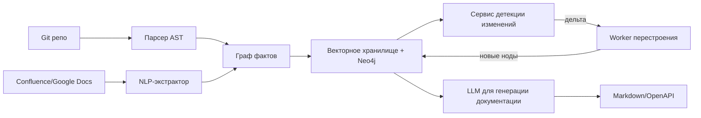

# Архитектурная сессия графа знаний для легаси кода

## 👤 **Kirill**

Нужна архитектурная сессия. Идея - сервис по созданию документации из Легаси кода и Легаси документации. Преобразование в граф знаний и автоактуализацию при изменениях. Попробуй развить идею, проверить гипотезы

---

## 🤖 **DeepSeek**

Отличная идея. По сути, вы хотите построить **Self-healing Knowledge Base** для Legacy-систем. Давайте разберём гипотезы, ключевые риски и предложу архитектуру.

## 1. Проверка главных гипотез

**Гипотеза 1: «Из кода и обрывочных документов можно построить связный граф знаний»**
- **Верификация:** Да, но точность зависит от качества нейминга и структуры. Java/C# с чёткими dependency injection дадут 85%+ точности. PHP/JS без типов — 50-60%. Нужен human-in-the-loop для верификации.

**Гипотеза 2: «Граф будет автоматически актуализироваться при изменениях»**
- **Риск:** Проблема «шумных коммитов» (форматирование, переименования). Придется обучать модель на паттернах изменений. Решение: дельта-анализ с весом изменений (изменение сигнатуры метода > изменение комментария).

**Гипотеза 3: «Документация будет полезна разработчикам»**
- **Скепсис:** Legacy-команды часто игнорируют документацию. Нужен сценарий использования «в моменте» (например, VS Code плагин «спроси у графа, почему эта строчка здесь»).

## 2. Архитектурная сессия — MVP



### Ключевые компоненты:
1. **Адаптеры источников:** Git, Jira, Confluence, старые UML-диаграммы (PlantUML/Draw.io)
2. **Извлечение сущностей:**  
   - Из кода: модули, классы, функции, вызовы, SQL-запросы (через sqlglot)  
   - Из текста: бизнес-правила, инварианты, сценарии (NER + relation extraction)
3. **Универсальная модель знаний:**
   ```yaml
   Node: { id, type (class/table/rule), content_hash, source_refs[] }
   Edge: { from, to, type (calls/depends_on/realizes), confidence, first_seen_commit }
   ```

## 3. Сценарий автоактуализации

При пуше в main:
1. CI вычисляет `git diff --name-only`
2. Парсер проходит только изменённые файлы + 2-й круг связей (impact analysis)
3. Сравнивает новый граф с текущим в БД.  
   **Пример детекции:**  
   - Метод `calculateTax()` удалён → помечаем как `DEPRECATED`, ищем все вызовы → помечаем их как `BROKEN`  
   - В README упоминался этот метод → LLM генерирует предупреждение «документация рассинхронизирована»

## 4. Проверка на реальных данных

**Эксперимент на 2 недели:**  
- Возьмите внутренний сервис с 10+ годами истории  
- Соберите граф (только код + комментарии)  
- Попросите 2-х разработчиков найти ответы на вопросы:  
  *«Где задаётся default тариф?», «Почему этот SQL выполняется медленно?»*  
- Замерьте time-to-answer с вашим инструментом vs обычный поиск по коду

## 5. Главные риски и их снижение

| Риск | Решение |
|------|---------|
| Граф разрастается (10M нод) | Хранить только связи, вычисленные по сигнатуре. Полный граф — в векторовой БД |
| Команда не верит в документацию | Интегрировать в code review: бот пишет «Ты удалил метод, который упоминался в docs/legacy.md, обнови?» |
| Legacy на непарсимом языке (PL/SQL, COBOL) | Сделать плагин для ANTLR или LLM-based извлечение (с пост-валидацией) |

## 6. Roadmap (4 месяца до пилота)

1. **Месяц 1** — парсер кода (Java + Python + SQL) → граф вызовов  
2. **Месяц 2** — экстрактор из Confluence/Word → связь с нодами кода  
3. **Месяц 3** — детектор изменений и очередь обновлений  
4. **Месяц 4** — UI (GraphQL API + простой просмотрщик)

## 7. Альтернативные гипотезы для проверки

- **«Разработчикам нужен не граф, а ответы на естественном языке»** → добавьте RAG сверху: *«Почему в UserService есть зависимость на PaymentProcessor?»*
- **«Документация должна быть краудсорсинговой»** → разрешить разработчикам исправлять ошибки графа, записывая votes. Неверные связи отваливаются, если >3 человека тэгнули «это не так».

## Следующий шаг для вас

Проведите **mind map сессию** с командой legacy-сервиса: попросите их нарисовать, как они сейчас ищут информацию. Выявите топ-3 самых больных места. Если «кто владелец этого модуля?» или «что сломается, если я изменю X?» — ваш граф идеально закроет эти боли.

Хотите, могу развернуть для вас POC на маленьком Python-проекте (с парсингом через Jedi + networkx)?

---

