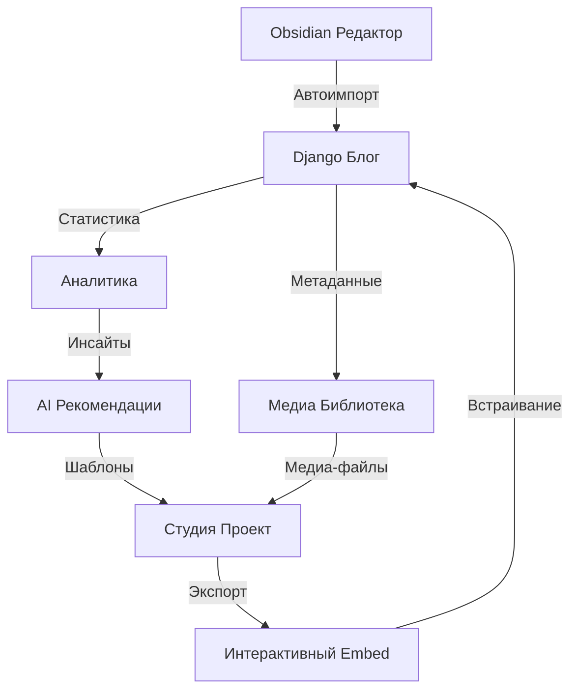

# Архитектурный выбор для интеграции библиотек

## 👤 **Kirill**

Проанлизируй документацию. Проект стоит перед выбором архитектруного решения. Какие риски есть в старой архитектуре и новой? Что поможет определиться? Есть ли альтернативы этим решениям? Что лучше на перспективу (казалось, что изначальный план хорош, но выявились проблемы с интеграционным взаимодействием)?

---

## 🤖 **DeepSeek**

Проанализировав документацию, я вижу, что проект находится на **критическом архитектурном перекрёстке**. Вот подробный анализ обеих архитектур, рисков и рекомендаций:

## 🚨 **Риски старой архитектуры (v0.2, текущая)**

### **Критические проблемы:**
1. **Жёсткая связность компонентов**
   - Прямые импорты библиотек (`import { mini } from 'strudel'`)
   - Падение одной библиотеки → падение всей системы
   - Невозможность замены движков без рефакторинга

2. **Отсутствие изоляции**
   - Все зависимости в одном бандле
   - Конфликты версий (Strudel vs Tone.js)
   - Проблемы с модульными системами (ES6 vs CommonJS)

3. **Проблемы с TypeScript**
   - Отсутствие типов для сторонних библиотек
   - Необходимость ручного создания деклараций
   - Сложности с автодополнением

4. **Аудио-контекстные проблемы**
   - Требует инициализации по клику
   - Глобальный аудио-контекст = потенциальные конфликты

5. **Масштабируемость**
   - Добавление новых библиотек усложняет сборку
   - Рост размера бандла экспоненциальный
   - Нет механизма "ленивой" загрузки

## 🛡️ **Риски новой архитектуры (Адаптерная, v0.3)**

### **Потенциальные проблемы:**
1. **Усложнение кодовой базы**
   - Добавление слоя абстракции (адаптеры + фабрики)
   - Увеличение количества кода для поддержки
   - Риск "over-engineering" на ранней стадии

2. **Производительность**
   - Дополнительные вызовы через адаптеры
   - Нагрузка от Web Workers (сериализация данных)
   - Задержки при динамической загрузке

3. **Синхронизация и время**
   - Сложность синхронизации между изолированными контекстами
   - Проблемы с аудио-таймингом в Web Workers
   - Латентность в коммуникации между компонентами

4. **Сложность отладки**
   - Распределённая система (ядро + воркеры + адаптеры)
   - Сложная диагностика проблем
   - Необходимость специальных инструментов для мониторинга

5. **Миграционные сложности**
   - Необходимость переписывания существующих компонентов
   - Риск нарушения обратной совместимости
   - Двойная нагрузка (поддержка старой и новой архитектуры)

## ⚖️ **Сравнительная таблица решений**

| Критерий | Старая архитектура | Новая (адаптеры) | Компромисс |
|----------|-------------------|------------------|------------|
| **Изоляция** | ❌ Нет | ✅ Полная | ⚡ Частичная |
| **Заменяемость** | ❌ Сложная | ✅ Легкая | ⚡ Условная |
| **Производительность** | ✅ Высокая | ⚡ Средняя | ⚡ Оптимизируемая |
| **Сложность** | ✅ Низкая | ❌ Высокая | ⚡ Умеренная |
| **Масштабируемость** | ❌ Плохая | ✅ Отличная | ✅ Хорошая |
| **Тестируемость** | ❌ Сложная | ✅ Легкая | ⚡ Средняя |
| **Время реализации** | ✅ Быстрое | ❌ Длительное | ⚡ Умеренное |
| **Поддержка** | ❌ Сложная | ✅ Легкая | ⚡ Средняя |

## 🔍 **Что поможет определиться?**

### **Ключевые вопросы для принятия решения:**

1. **Каков горизонт планирования?**
   - Если MVP нужен за 1-2 месяца → временное решение
   - Если проект рассчитан на годы → новая архитектура

2. **Сколько разных библиотек планируется интегрировать?**
   - 1-2 библиотеки → можно обойтись
   - 5+ библиотек → нужна архитектура адаптеров

3. **Требуется ли "горячая" замена библиотек?**
   - Нет → можно отложить
   - Да → обязательно нужны адаптеры

4. **Важна ли стабильность для пользователей?**
   - Экспериментальный проект → можно рисковать
   - Продукт для пользователей → нужна изоляция

5. **Есть ли ресурсы на переработку?**
   - Мало ресурсов → постепенная миграция
   - Достаточно ресурсов → полная переработка

## 🔄 **Альтернативные решения**

### **1. Гибридный подход (Рекомендую)**
```
Этап 1: Временное решение для Strudel
  ↓
Этап 2: Адаптерный слой для новых библиотек  
  ↓
Этап 3: Постепенная миграция существующих
```

### **2. Модульная архитектура с плагинами**
- Каждая библиотека как отдельный npm-пакет
- Динамическая загрузка через SystemJS
- Общий API интерфейс, но без сложных адаптеров

### **3. Iframe-based изоляция**
- Каждая библиотека в своем iframe
- Общение через postMessage
- Максимальная изоляция, но сложная синхронизация

### **4. Микросервисный подход (экстремальный)**
- Каждая библиотека как отдельный сервис
- Коммуникация через WebSocket/REST
- Сложно, но максимально масштабируемо

## 🎯 **Рекомендации для проекта**

### **Краткосрочно (следующие 2 недели):**

```typescript
// Временное решение с постепенным переходом
class ProgressiveArchitecture {
  // 1. CDN + Web Worker для Strudel (решает текущую проблему)
  // 2. Начать с простейшего AudioAdapter для Tone.js
  // 3. Постепенно добавлять адаптеры для новых библиотек
  // 4. Существующий код оставить "как есть" до миграции
}
```

### **Среднесрочно (1-2 месяца):**

1. **Приоритет 1**: Стабильная работа с 3-мя основными библиотеками
2. **Приоритет 2**: Система плагинов для новых интеграций
3. **Приоритет 3**: Миграция критических компонентов

### **Долгосрочно (3-6 месяцев):**

1. **Полная адаптерная архитектура**
2. **Plugin SDK для сообщества**
3. **Оптимизация производительности**

## 📊 **Матрица принятия решения**

### **Выбирайте новую архитектуру если:**

✅ Планируете интегрировать 5+ разных библиотек  
✅ Нужна "горячая" замена движков  
✅ Проект рассчитан на 2+ года развития  
✅ Есть ресурсы на архитектурную работу  
✅ Важна стабильность для конечных пользователей  

### **Оставайтесь со старой если:**

✅ Нужен быстрый MVP (1-2 месяца)  
✅ Работаете только с 1-2 проверенными библиотеками  
✅ Ресурсы ограничены  
✅ Готовы к техническому долгу  
✅ Проект экспериментальный/исследовательский  

## 💡 **Конкретный план действий**

### **Неделя 1-2: Гибридный старт**

1. **Временное решение для Strudel:**
   ```typescript
   // CDN + Web Worker + простой адаптер
   ```

2. **Начать разработку Plugin SDK:**
   ```typescript
   // Минимальный API для новых плагинов
   ```

3. **Создать архитектурную "дорожную карту":**
   - Что мигрировать в первую очередь
   - Что оставить "как есть"
   - Этапы перехода

### **Неделя 3-4: Постепенная миграция**

1. **Tone.js → ToneAdapter** (самый простой)
2. **Новые библиотеки → только через адаптеры**
3. **Измерение производительности** на каждом этапе

### **Месяц 2-3: Полная миграция**

1. **Strudel → StrudelAdapter**
2. **Рефакторинг CoreOrchestrator**
3. **Тестирование и оптимизация**

## 🎯 **Итоговый вердикт**

**Рекомендую гибридный подход:**

> **Начать с временного решения, но проектировать с учётом полной адаптерной архитектуры.**

### **Почему?**

1. **Решает текущую проблему** (Strudel не работает)
2. **Не блокирует разработку**
3. **Позволяет набрать данные** о реальных потребностях
4. **Постепенное снижение рисков**
5. **Сохраняет возможность полного перехода**

### **Первые шаги:**

1. ✅ Реализовать временное решение для Strudel (CDN + Worker)
2. ✅ Создать минимальный AudioAdapter для Tone.js
3. ✅ Определить API для будущих адаптеров
4. ✅ Начать документировать процесс миграции

Этот подход даст вам **практический опыт** работы с адаптерами, не останавливая разработку, и позволит принять окончательное решение на основе реальных данных, а не только архитектурных теорий.

---

## 👤 **Kirill**

Мне нравится гибридный подход!
внеси изменения в документацию (сделай новые версии плана, спецификации, архитектуры)

---

## 🤖 **DeepSeek**

Отлично! Я внесу изменения в документацию, отражающие гибридный подход. Вот обновлённые версии документов:

---

# 📝 1. ОБНОВЛЁННЫЙ ПЛАН РЕАЛИЗАЦИИ v0.4 (Гибридный подход)

**Структура обновлённого плана**:
1. Новая стратегия: Гибридная эволюционная архитектура
2. Обновлённая дорожная карта с этапами миграции
3. Конкретные шаги для каждого этапа
4. Критерии успеха и метрики перехода

---

## 🎯 1. Новая архитектурная стратегия: Гибридная эволюция

### 🏗️ **Принципы гибридного подхода:**

1. **Эволюционная миграция** вместо революционной переработки
2. **Временные решения** для немедленных проблем
3. **Постепенное внедрение** адаптерной архитектуры
4. **Параллельная поддержка** старого и нового кода
5. **Измерение и адаптация** на основе реальных данных

### 📊 **Три фазы реализации:**

```
Фаза A: Стабилизация (2-3 недели)
├── Временное решение для Strudel
├── Минимальный AudioAdapter для Tone.js
└── План миграции ключевых компонентов

Фаза B: Расширение (1-2 месяца)  
├── Plugin SDK для новых библиотек
├── Миграция Strudel → StrudelAdapter
└── Оптимизация производительности

Фаза C: Консолидация (1-2 месяца)
├── Полная адаптерная архитектура
├── Рефакторинг CoreOrchestrator
└── Тестирование и документация
```

---

## 👥 2. План «для неразработчика» (Обновлено)

### 📋 **Что вы получите на каждом этапе?**

#### 🏗️ **Этап 1: Стабилизация и временные решения (2-3 недели)**

**Решаем срочные проблемы:**
- 🚀 **Strudel работает через CDN** — без ошибок сборки
- 🛡️ **Изоляция в Web Workers** — проблемы Strudel не ломают Tone.js
- 🔧 **Минимальный адаптер Tone.js** — первая ступень к новой архитектуре
- 📱 **Тот же интерфейс** — пользователи не заметят изменений

**Что вы сможете делать:**
- Добавлять StrudelREPLNode без ошибок
- Работать со всеми существующими нодами
- Сохранять и загружать проекты как раньше

#### 🎛️ **Этап 2: Расширение с безопасностью (1-2 месяца)**

**Новые возможности с защитой от сбоев:**
- 🔌 **Новые библиотеки как плагины** — добавляете без риска для системы
- 🛡️ **Изоляция по умолчанию** — каждая новая библиотека в своём контексте
- 🔄 **Горячая замена движков** — меняете Tone.js на другую реализацию
- 📊 **Мониторинг производительности** — видите влияние каждой библиотеки

**Что вы сможете делать:**
- Устанавливать новые плагины из каталога
- Пробовать альтернативные синтезаторы и эффекты
- Видеть, какие библиотеки потребляют больше ресурсов
- Отключать проблемные плагины без перезагрузки

#### 🚀 **Этап 3: Полная интеграция (2-3 месяца)**

**Профессиональная студия с гарантией стабильности:**
- 🎛️ **Все библиотеки через адаптеры** — максимальная стабильность
- ⚡ **Оптимизированная производительность** — WebAssembly для тяжёлых задач
- 🔗 **Бесшовная интеграция** — блог и студия работают как единое целое
- 🤖 **AI-ассистент** — помогает с оптимизацией и творчеством

**Что вы сможете делать:**
- Создавать собственные плагины через SDK
- Использовать AI для генерации паттернов
- Экспортировать в профессиональные форматы
- Делиться проектами с гарантией работы у других пользователей

### 🔄 **Как мы будем двигаться вперед (упрощённо)**

| Месяц | Фокус | Результат для пользователя |
|-------|-------|----------------------------|
| **1** | Стабильность | Strudel работает, новые плагины безопасны |
| **2** | Расширение | Больше инструментов, лучше производительность |
| **3** | Интеграция | Блог и студия полностью связаны |
| **4-6** | Оптимизация | Профессиональные функции, AI помощь |

### ❓ **Обновлённые ответы на частые вопросы**

#### 🤔 "Почему не сразу сделали идеальную архитектуру?"
**Ответ**: Как строят дом — сначала временный навес, потом прочный фундамент, а затем идеальный дом. Мы делаем так, чтобы вы могли пользоваться системой уже сейчас, пока совершенствуем её архитектуру.

#### 🤔 "Что если я хочу добавить свою библиотеку?"
**Ответ**: Теперь это проще! Временное решение позволяет быстро интегрировать, а затем мы поможем создать полноценный плагин через SDK.

#### 🤔 "Будет ли сломана обратная совместимость?"
**Ответ**: Нет! Мы сохраняем все ваши проекты и не меняем интерфейс. Все изменения "под капотом".

---

## ⚙️ 3. Техническая дорожная карта (Обновлено)

### **Фаза A: Стабилизация (Недели 1-3)**

#### Неделя 1: Временное решение Strudel
```typescript
// Реализация временной архитектуры
1. CDN загрузка Strudel в Web Worker
2. Простой StrudelAdapter с минимальным API
3. Интеграция с существующим CoreOrchestrator
```

#### Неделя 2: Базовый адаптерный слой
```typescript
// Создание фундамента новой архитектуры
1. AudioAdapter интерфейс (абстрактный)
2. ToneAdapter (простая реализация для Tone.js)
3. ModuleManager для регистрации адаптеров
```

#### Неделя 3: План миграции
```typescript
// Подготовка к полной миграции
1. Анализ зависимостей и связей
2. Определение порядка миграции компонентов
3. Создание тестов для проверки совместимости
```

### **Фаза B: Расширение (Месяцы 2-3)**

#### Месяц 2: Plugin SDK и новые адаптеры
```typescript
1. Plugin SDK v0.1 для разработчиков
2. Strudel → StrudelAdapter миграция
3. Web MIDI Adapter
4. Pattern Engine Adapter
```

#### Месяц 3: Оптимизация и мониторинг
```typescript
1. Производительность Web Workers
2. Система мониторинга адаптеров
3. Кэширование и предзагрузка
4. UI для управления адаптерами
```

### **Фаза C: Консолидация (Месяцы 4-6)**

#### Месяц 4: Полная адаптерная архитектура
```typescript
1. Рефакторинг CoreOrchestrator
2. Все библиотеки через адаптеры
3. Тестирование производительности
```

#### Месяц 5: Интеграция и расширения
```typescript
1. Embed API для блога
2. WebAssembly для DSP
3. AI интеграции
```

#### Месяц 6: Полировка и релиз
```typescript
1. Документация и примеры
2. Тестирование пользователями
3. Финальная оптимизация
```

---
## 📈 4. Механизмы контроля и отслеживания (Обновлено)

### **Новые метрики для гибридного подхода:**

| Метрика | Цель | Как измеряем |
|---------|------|-------------|
| **Стабильность Strudel** | 99% uptime | Мониторинг Web Worker |
| **Производительность адаптеров** | <5мс overhead | Бенчмарки до/после |
| **Совместимость проектов** | 100% сохранение | Тесты миграции |
| **Пользовательский опыт** | Без изменений | A/B тестирование UI |

### **Еженедельные чекпоинты:**

1. **Понедельник**: Проверка метрик стабильности
2. **Среда**: Прогресс по адаптерной архитектуре  
3. **Пятница**: Демо и обратная связь от тестовых пользователей

### **Инструменты мониторинга:**
- **Performance API** для измерения адаптеров
- **Custom metrics** в Google Analytics
- **Error tracking** (Sentry/Rollbar)
- **User session recording** для UX анализа

---
## ⚠️ 5. Риски и митигация (Обновлено)

### **Новые риски гибридного подхода:**

#### 1. **Сложность поддержки двух архитектур**
   - *Митигация*: Чёткое разделение кода, автоматические тесты миграции
   - *Контроль*: Лимит на срок поддержки (3 месяца)

#### 2. **Производительность временных решений**
   - *Митигация*: Активный мониторинг, быстрая миграция проблемных компонентов
   - *Контроль*: Автоматические алерты при деградации производительности

#### 3. **Путаница в команде разработки**
   - *Митигация*: Чёткая документация, код-ревью, регулярные синки
   - *Контроль*: Еженедельные архитектурные сессии

### **Сниженные риски:**

1. ✅ **Нет блокировки разработки** — Strudel работает уже сейчас
2. ✅ **Нет потери пользователей** — интерфейс не меняется
3. ✅ **Гибкость в принятии решений** — можно корректировать план по ходу

---
**Версия плана**: 0.4 (Гибридный подход)  
**Дата обновления**: 14.12.2025  
**Статус**: ✅ Утверждено для реализации  
**Согласовано со спецификацией**: v0.4

---

# 📝 2. ОБНОВЛЁННАЯ ТЕХНИЧЕСКАЯ СПЕЦИФИКАЦИЯ v0.4

```
title: "Universal Creative Hub - Техническая спецификация v0.4"
source: "Гибридная эволюционная архитектура"
author: 
published: 
created: 2025-12-06
updated: 2025-12-14
description: "Техническая спецификация с гибридным подходом: временные решения + постепенная миграция на адаптерную архитектуру."
tags:
  - "спецификация"
  - "гибридная-архитектура"
  - "эволюционная-миграция"
  - "творческая-платформа"
```

## 📌 Цель проекта (Обновлено)

Создание self-hosted универсальной платформы через **гибридную эволюционную стратегию**:

1. **Немедленное решение проблем** (Strudel, TypeScript типы)
2. **Постепенная миграция** на адаптерную архитектуру  
3. **Минимальный риск** для пользователей и разработчиков

**Новая стратегия**: "Работающий сегодня, совершенствующийся завтра"

---

## 🎯 Архитектурная эволюция (Новый раздел)

### 🏗️ **Трёхслойная гибридная архитектура:**

```
Слой 3: Будущее (Q3-Q4 2025)
├── Полная адаптерная архитектура
├── Plugin SDK для сообщества
└── WebAssembly оптимизации

Слой 2: Переход (Q2 2025)  
├── Новые библиотеки как плагины
├── Миграция Strudel → адаптер
└── Производительность и мониторинг

Слой 1: Настоящее (Q1 2025)
├── Временное решение Strudel (CDN + Web Worker)
├── Минимальный ToneAdapter
└── Совместимость с v0.2
```

### 🔄 **Принципы эволюционной миграции:**

1. **Обратная совместимость** — проекты v0.2 работают в v0.4
2. **Постепенное замещение** — компонент мигрируется только когда готов адаптер
3. **Двойной режим** — временные и адаптерные решения могут сосуществовать
4. **Измерение влияния** — каждое изменение оценивается по производительности

## 🛠 Стек технологий (Обновлено под гибридный подход)

### **Этап 1: Временные решения (Сейчас)**

```typescript
// Strudel временное решение
const temporaryStrudelSolution = {
  loading: "CDN @strudel.cycles/core",
  isolation: "Web Worker",
  communication: "postMessage API",
  fallback: "Local build при ошибках CDN"
};

// Сохранение существующей архитектуры
const preserveExisting = {
  CoreOrchestrator: "Без изменений (пока)",
  NodeRegistry: "Без изменений",
  EventEmitter: "Без изменений"
};
```

### **Этап 2: Адаптерный фундамент (Месяц 2-3)**

```typescript
// Новая архитектура (параллельно со старой)
const adapterFoundation = {
  // Интерфейсы
  interfaces: ["AudioAdapter", "PatternAdapter", "MidiAdapter"],
  
  // Фабрика
  factory: "ProviderFactory с поддержкой legacy",
  
  // Менеджмент
  management: "ModuleManager с dual-mode",
  
  // Изоляция
  isolation: "Web Workers для новых библиотек"
};
```

### **Этап 3: Полная миграция (Месяц 4-6)**

```typescript
// Финальная архитектура
const finalArchitecture = {
  // Все через адаптеры
  universalAdapters: true,
  
  // Оптимизации
  optimizations: ["WebAssembly", "AudioWorklet Groups"],
  
  // Мониторинг
  monitoring: "Real-time адаптер метрики",
  
  // SDK
  pluginSDK: "Для сообщества"
};
```

## 📋 Шаги реализации (Обновлено под гибридный подход)

### 📅 **Фаза 1: Стабилизация и временные решения (4 недели)**

#### **Неделя 1: Strudel временное решение**

1. **CDN загрузка Strudel**:
   ```typescript
   // Динамический импорт с fallback
   async loadStrudel() {
     try { return await import(CDN_URL); }
     catch { return await import(LOCAL_BUILD); }
   }
   ```

2. **Web Worker изоляция**:
   ```typescript
   // strudel-worker.js
   self.onmessage = async (e) => {
     const strudel = await loadStrudel();
     const result = await strudel.eval(e.data.code);
     self.postMessage(result);
   };
   ```

3. **Простой StrudelAdapter**:
   ```typescript
   class TemporaryStrudelAdapter {
     private worker: Worker;
     
     async eval(code: string) {
       return new Promise((resolve) => {
         this.worker.postMessage({ type: 'eval', code });
         this.worker.onmessage = (e) => resolve(e.data);
       });
     }
   }
   ```

#### **Неделя 2: Базовый адаптерный слой**

1. **Абстрактные интерфейсы**:
   ```typescript
   // src/adapters/interfaces/
   interface AudioAdapter {
     init(): Promise<void>;
     playNote(frequency: number): void;
     setTempo(bpm: number): void;
   }
   ```

2. **ToneAdapter (первый настоящий адаптер)**:
   ```typescript
   class ToneAdapter implements AudioAdapter {
     private tone: typeof import('tone');
     
     async init() {
       this.tone = await import('tone');
       await this.tone.start();
     }
   }
   ```

3. **ModuleManager с dual-mode**:
   ```typescript
   class DualModeModuleManager {
     async getAudioProvider(type: string) {
       if (type === 'tone' && this.useAdapters) {
         return new ToneAdapter();
       } else {
         // Legacy путь
         return legacyAudioProvider();
       }
     }
   }
   ```

#### **Недели 3-4: План миграции и мониторинг**

1. **Анализ зависимостей**:
   ```bash
   # Скрипт анализа импортов
   npm run analyze-dependencies
   ```

2. **Порядок миграции**:
   ```
   1. Tone.js → ToneAdapter (самый простой)
   2. Strudel → StrudelAdapter (уже есть временный)
   3. Web Audio API → WebAudioAdapter
   4. MIDI → MidiAdapter
   5. Custom ноды → PluginAdapter
   ```

3. **Система мониторинга**:
   ```typescript
   // Отслеживание производительности адаптеров
   class AdapterMetrics {
     static measure(adapter: AudioAdapter, operation: string) {
       const start = performance.now();
       // выполнение операции
       const duration = performance.now() - start;
       this.report(adapter, operation, duration);
     }
   }
   ```

### 📅 **Фаза 2: Расширение и миграция (8 недель)**

#### **Недели 5-8: Plugin SDK и новые адаптеры**

1. **Plugin SDK v0.1**:
   ```typescript
   // Минимальный API для разработчиков плагинов
   interface PluginManifest {
     name: string;
     version: string;
     adapter: string; // AudioAdapter | PatternAdapter и т.д.
     entryPoint: string; // URL или npm package
   }
   ```

2. **Полный StrudelAdapter**:
   ```typescript
   // Миграция с временного на полноценный
   class FullStrudelAdapter extends TemporaryStrudelAdapter {
     // Добавляем полную функциональность
     async playPattern(pattern: Pattern): Promise<PatternInstance> {
       // Реализация с кэшированием, оптимизациями
     }
   }
   ```

3. **Система Web MIDI**:
   ```typescript
   class WebMidiAdapter implements MidiAdapter {
     async init() {
       const midi = await navigator.requestMIDIAccess();
       // Обработка MIDI сообщений
     }
   }
   ```

#### **Недели 9-12: Оптимизация и производительность**

1. **Web Workers оптимизация**:
   ```typescript
   // Pool воркеров для балансировки нагрузки
   class WorkerPool {
     private workers: Worker[] = [];
     private tasks: Task[] = [];
     
     async execute(task: Task): Promise<any> {
       const worker = this.getAvailableWorker();
       return worker.execute(task);
     }
   }
   ```

2. **Кэширование адаптеров**:
   ```typescript
   // Кэширование загруженных библиотек
   class AdapterCache {
     private cache = new Map<string, any>();
     
     async getOrCreate(adapterName: string) {
       if (this.cache.has(adapterName)) {
         return this.cache.get(adapterName);
       }
       const adapter = await this.createAdapter(adapterName);
       this.cache.set(adapterName, adapter);
       return adapter;
     }
   }
   ```

3. **UI для управления адаптерами**:
   ```typescript
   // React компонент для включения/выключения адаптеров
   <AdapterManager>
     <AdapterToggle name="strudel" enabled={true} />
     <AdapterToggle name="tone" enabled={true} />
     <AdapterPerformanceChart adapter="strudel" />
   </AdapterManager>
   ```

### 📅 **Фаза 3: Консолидация и оптимизация (8 недель)**

#### **Недели 13-16: Полная адаптерная архитектура**

1. **Рефакторинг CoreOrchestrator**:
   ```typescript
   // Новый CoreOrchestrator работающий только с адаптерами
   class NewCoreOrchestrator {
     private adapters: Map<string, BaseAdapter> = new Map();
     
     async play() {
       // Запуск всех адаптеров через единый интерфейс
       for (const adapter of this.adapters.values()) {
         await adapter.onTransportStart();
       }
     }
   }
   ```

2. **Миграция всех нод**:
   ```typescript
   // Автоматизированная миграция нод
   class NodeMigrator {
     async migrateNode(oldNode: LegacyNode): Promise<NewNode> {
       const adapter = await this.getAdapterForNode(oldNode);
       return new NewNode(adapter, oldNode.config);
     }
   }
   ```

3. **Тестирование производительности**:
   ```typescript
   // Сравнение производительности до/после
   class PerformanceComparator {
     async compare() {
       const legacyPerf = await this.measureLegacy();
       const adapterPerf = await this.measureAdapters();
       return { legacyPerf, adapterPerf, difference: adapterPerf - legacyPerf };
     }
   }
   ```

#### **Недели 17-20: Интеграция и расширения**

1. **Embed API для блога**:
   ```typescript
   // Генерация embed кодов для проектов
   class EmbedGenerator {
     generate(projectId: string): EmbedCode {
       return {
         html: `<div data-uch-project="${projectId}"></div>`,
         script: `<script src="/embed.js"></script>`
       };
     }
   }
   ```

2. **WebAssembly интеграция**:
   ```typescript
   // DSP функции на WebAssembly
   class WasmAudioAdapter extends AudioAdapter {
     private wasmModule: WebAssembly.Module;
     
     async init() {
       this.wasmModule = await WebAssembly.compileStreaming(
         fetch('/audio-dsp.wasm')
       );
     }
   }
   ```

#### **Недели 21-24: Полировка и релиз**

1. **Документация и примеры**:
   ```markdown
   # Plugin SDK Документация
   
   ## Создание своего адаптера
   
   ```typescript
   class MySynthAdapter implements AudioAdapter {
     // Реализация интерфейса
   }
   ```
   ```

2. **Тестирование пользователями**:
   ```typescript
   // Программа бета-тестирования
   class BetaTestingProgram {
     async onboardUser(user: User) {
       await user.testMigration(oldProject);
       await user.provideFeedback();
       await user.reportIssues();
     }
   }
   ```

3. **Финальная оптимизация**:
   ```typescript
   // Анализ и оптимизация горячих точек
   class PerformanceOptimizer {
     async optimize() {
       const hotspots = await this.identifyHotspots();
       for (const hotspot of hotspots) {
         await this.optimizeHotspot(hotspot);
       }
     }
   }
   ```

## ✅ Критерии готовности (Обновлено)

### **MVP Фазы 1 (Конец 4 недель)**

- ✅ Strudel работает через временное решение
- ✅ ToneAdapter реализован и работает
- ✅ ModuleManager поддерживает dual-mode
- ✅ Проекты v0.2 загружаются без изменений
- ✅ Мониторинг производительности настроен
- ✅ План миграции утверждён

### **MVP Фазы 2 (Конец 12 недель)**

- ✅ Plugin SDK доступен разработчикам
- ✅ Strudel мигрирован на полноценный адаптер
- ✅ 3+ типа адаптеров реализованы
- ✅ UI для управления адаптерами работает
- ✅ Производительность измеряется и оптимизируется
- ✅ Новые библиотеки добавляются только как плагины

### **Релиз 1.0 (Конец 24 недель)**

- ✅ Все библиотеки работают через адаптеры
- ✅ CoreOrchestrator рефакторинг завершён
- ✅ Обратная совместимость 100% сохранена
- ✅ WebAssembly оптимизации внедрены
- ✅ Plugin SDK с примерами и документацией
- ✅ Система мониторинга и алертов
- ✅ Пользователи успешно мигрировали проекты

## ⚠️ Риски и ограничения (Обновлено)

### **Новые риски гибридного подхода:**

1. **Сложность поддержки двух кодовых баз**
   - *Риск*: Разработчики путаются между legacy и новой архитектурой
   - *Митигация*: Чёткое разделение по папкам, регулярные тренировки, код-ревью

2. **Производительность временных решений**
   - *Риск*: Web Workers добавляют задержки
   - *Митигация*: Активный мониторинг, быстрая миграция проблемных компонентов

3. **Ментальная нагрузка на команду**
   - *Риск*: Необходимость думать в двух архитектурных парадигмах
   - *Митигация*: Чёткие guidelines, шаблоны, автоматические проверки

### **Преимущества гибридного подхода:**

1. ✅ **Нет простоя разработки** — Strudel работает уже сейчас
2. ✅ **Минимальный риск для пользователей** — интерфейс не меняется
3. ✅ **Гибкость в принятии решений** — можно корректировать по ходу
4. ✅ **Реальные данные для оптимизации** — измеряем влияние изменений
5. ✅ **Постепенное обучение команды** — осваиваем новую архитектуру шаг за шагом

---

**Версия спецификации**: 4.0 (Гибридный эволюционный подход)  
**Дата последнего обновления**: 14.12.2025  
**Статус**: ✅ Утверждена для реализации  
**Срок реализации**: 6 месяцев (с сохранением работающей системы)  
**Следующий ревью**: После завершения Фазы 1 (4 недели)

---

# 📝 3. ОБНОВЛЁННАЯ АРХИТЕКТУРНАЯ ДОКУМЕНТАЦИЯ v0.4

## 🤔 Архитектурное решение: Гибридная эволюционная стратегия

### 🔄 **Новый подход: Двойная архитектура с плавной миграцией**

**Вместо "или-или" → "и то, и другое, постепенно"**

```
Текущее состояние (v0.2) → Временные решения → Адаптерная архитектура (v0.4)
       │                        │                        │
       └─── Работает сейчас ────┼─── Плавный переход ───┘
                                │
                        Измерение и оптимизация
```

### 🏗️ **Трёхэтапная гибридная архитектура:**

#### **Этап 1: Coexistence Layer (Сосуществование)**

```typescript
// Одновременная поддержка старого и нового
class HybridArchitecture {
  // Старая архитектура (работает как есть)
  private legacyOrchestrator: CoreOrchestrator;
  
  // Новая архитектура (разрабатывается)
  private adapterOrchestrator: AdapterOrchestrator;
  
  // Мост между ними
  private migrationBridge: MigrationBridge;
  
  async process() {
    // Если компонент мигрирован → используем адаптер
    if (this.isMigrated('strudel')) {
      return await this.adapterOrchestrator.process();
    }
    // Иначе → legacy путь
    else {
      return await this.legacyOrchestrator.process();
    }
  }
}
```

#### **Этап 2: Migration Layer (Миграция)**

```typescript
// Поэтапная миграция компонентов
class ProgressiveMigration {
  private migrationQueue: MigrationTask[] = [
    { component: 'tone', priority: 1, estimatedEffort: 'low' },
    { component: 'strudel', priority: 2, estimatedEffort: 'medium' },
    { component: 'webaudio', priority: 3, estimatedEffort: 'low' },
    { component: 'midi', priority: 4, estimatedEffort: 'medium' },
    { component: 'core-orchestrator', priority: 5, estimatedEffort: 'high' }
  ];
  
  async migrateNext(): Promise<MigrationResult> {
    const task = this.getNextTask();
    return await this.executeMigration(task);
  }
}
```

#### **Этап 3: Unified Layer (Унификация)**

```typescript
// Финальная унифицированная архитектура
class UnifiedArchitecture {
  // Все через адаптеры
  private adapters: Map<string, BaseAdapter> = new Map();
  
  // Единый интерфейс
  async execute(operation: Operation): Promise<Result> {
    const adapter = this.getAdapterForOperation(operation);
    return await adapter.execute(operation);
  }
  
  // Обратная совместимость через адаптеры-врапперы
  private legacyAdapter: LegacyWrapperAdapter;
}
```

## 🛡️ **Решение конкретных проблем (Обновлено)**

### **Проблема 1: Strudel не работает сейчас**

**Гибридное решение:**

```typescript
// Немедленное временное решение
class ImmediateStrudelFix {
  // 1. CDN загрузка (работает сейчас)
  private async loadFromCDN(): Promise<Strudel> {
    return import('https://cdn.strudel.tidalcycles.org');
  }
  
  // 2. Web Worker изоляция (защита системы)
  private worker = new Worker('/workers/strudel-temp.js');
  
  // 3. Простой адаптер (начало миграции)
  private adapter = new TemporaryStrudelAdapter();
  
  // 4. Параллельная разработка полноценного адаптера
  private futureAdapter = new FullStrudelAdapter(); // в разработке
}
```

### **Проблема 2: TypeScript типы отсутствуют**

**Постепенное решение:**

```typescript
// Этапная типизация
class TypeScriptMigration {
  // Шаг 1: Временные декларации
  declare module '@strudel.cycles/core' {
    // Минимальные типы для работы сейчас
  }
  
  // Шаг 2: Генерация типов из использования
  async generateTypesFromUsage() {
    // Анализ кода → генерация .d.ts
  }
  
  // Шаг 3: Полноценные типы с адаптером
  interface StrudelAdapter {
    // Полностью типизированный интерфейс
  }
}
```

### **Проблема 3: Глобальные зависимости и конфликты**

**Изоляция с постепенным внедрением:**

```typescript
class DependencyIsolation {
  // Новые библиотеки → сразу изоляция
  async loadNewLibrary(name: string): Promise<IsolatedLibrary> {
    const worker = new Worker(`/workers/${name}.js`);
    return new LibraryAdapter(worker);
  }
  
  // Существующие библиотеки → постепенная миграция
  async migrateExistingLibrary(name: string): Promise<MigrationPlan> {
    const analysis = await this.analyzeDependencies(name);
    return this.createMigrationPlan(analysis);
  }
}
```

## 📋 **Конкретный план миграции**

### **Неделя 1-2: Foundation**

```typescript
// 1. Временное решение Strudel (CDN + Worker)
const strudelTemp = await createTemporaryStrudelSolution();

// 2. Адаптерные интерфейсы
interface AudioAdapter { /* ... */ }
interface PatternAdapter { /* ... */ }

// 3. Первый адаптер (Tone.js)
const toneAdapter = new ToneAdapter();

// 4. ModuleManager с dual-mode
const manager = new DualModeModuleManager();
```

### **Неделя 3-4: Migration Infrastructure**

```typescript
// 1. Система миграции состояний
class StateMigrator {
  async migrateProject(project: LegacyProject): Promise<NewProject> {
    // Конвертация между форматами
  }
}

// 2. Тесты обратной совместимости
describe('Backward Compatibility', () => {
  test('v0.2 project loads in v0.4', async () => {
    const project = loadLegacyProject();
    const migrated = await migrateProject(project);
    expect(migrated).toBePlayable();
  });
});

// 3. Мониторинг производительности
class PerformanceMonitor {
  trackMigrationPerformance(component: string, before: number, after: number) {
    // Отслеживание влияния миграции
  }
}
```

### **Месяц 2-3: Component Migration**

```typescript
// Порядок миграции компонентов
const migrationOrder = [
  'Tone.js',      // Простой, хорошо документированный
  'Strudel',      // Уже есть временное решение
  'WebAudio',     // Нативный API, простой
  'WebMIDI',      // Относительно простой
  'CustomNodes',  // Наши собственные компоненты
  'CoreOrchestrator' // Ядро системы
];

// Для каждого компонента
for (const component of migrationOrder) {
  await migrateComponent(component, {
    strategy: 'adapter-first',
    fallback: 'legacy-if-needed',
    testing: 'comprehensive'
  });
}
```

### **Месяц 4-6: Unification and Optimization**

```typescript
// 1. Удаление legacy кода
await removeLegacyCode({
  safetyNet: 'rollback-plan',
  verification: 'extensive-testing',
  timeline: 'gradual'
});

// 2. Оптимизация адаптеров
await optimizeAdapters({
  webAssembly: 'for-heavy-dsp',
  caching: 'aggressive',
  lazyLoading: 'intelligent'
});

// 3. Plugin SDK финализация
finalizePluginSDK({
  documentation: 'comprehensive',
  examples: 'real-world',
  tooling: 'developer-friendly'
});
```


---

## 👤 **Kirill**

Почему-то выпал из поле зрения блог ведь он тоже в проекте и по нему есть техдолг по автоимпорту и автоархивации статей + его тоже нужно развивать. Документация должна отражать и линию А

---

## 🤖 **DeepSeek**

Вы абсолютно правы! Линия А (блог) выпала из фокуса в текущих архитектурных обсуждениях. Добавлю полную интеграцию с учётом обеих линий развития.

---

# 📝 4. ОБНОВЛЁННАЯ СПЕЦИФИКАЦИЯ С ИНТЕГРАЦИЕЙ ЛИНИЙ А и Б v0.5

```
title: "Universal Creative Hub - Полная спецификация v0.5"
source: "Гибридная архитектура + полная интеграция линий А и Б"
author: 
published: 
created: 2025-12-06
updated: 2025-12-14
description: "Техническая спецификация с полной интеграцией блога (линия А) и студии (линия Б) через гибридный подход."
tags:
  - "спецификация"
  - "полная-интеграция"
  - "блог-и-студия"
  - "творческая-платформа"
```

## 📌 Цель проекта (Полная интеграция)

Создание self-hosted универсальной платформы, где **линия А (блог) и линия Б (студия)** не просто сосуществуют, а активно взаимодействуют:

1. **Блог как публичное лицо** творческого процесса
2. **Студия как рабочая лаборатория** создания контента  
3. **Двунаправленный поток** между созданием и публикацией
4. **Единая система данных** для обоих компонентов

**Новая парадигма**: "Создаёшь в студии → автоматически публикуешь в блоге → получаешь обратную связь → улучшаешь в студии"

---

## 🎯 Архитектура полной интеграции

### 🏗️ **Трёхуровневая архитектура связи:**

```
Уровень 3: Интеграция и синергия
├── Музыкальные проекты → интерактивные статьи
├── Статьи → шаблоны и пресеты в студии  
├── Комментарии → фидбек для улучшения проектов
└── Аналитика → что популярно → на чём фокусироваться

Уровень 2: Техническая связь
├── Единая база данных (проекты и статьи)
├── Общий медиа-менеджер (аудио, изображения)
├── Совместная система тегов и категорий
└── Единый поиск по всему контенту

Уровень 1: Функциональные блоки
├── Линия А: Блог/Портфолио (Django)
├── Линия Б: Студия (React/TypeScript)
└── Связующий слой (API + WebSocket)
```

### 🔄 **Поток данных между компонентами:**



## 🛠 Стек технологий (Полная интеграция)

### **Бэкенд - Единая платформа:**

```python
# Django модели для интеграции
class UnifiedPlatform(models.Model):
    # Общие модели
    class CreativeProject(models.Model):
        title = models.CharField(max_length=200)
        content = JSONField()  # Проект студии
        article = models.ForeignKey('Article', null=True)  # Связанная статья
        media = models.ManyToManyField('MediaAsset')  # Общие медиа
        
    class Article(models.Model):
        # Статья в блоге
        markdown_content = models.TextField()  # Из Obsidian
        interactive_embeds = models.ManyToManyField('Embed')
        related_projects = models.ManyToManyField('CreativeProject')
        
    class MediaAsset(models.Model):
        # Единая медиа библиотека
        file = models.FileField()
        used_in_projects = models.ManyToManyField('CreativeProject')
        used_in_articles = models.ManyToManyField('Article')
```

### **Фронтенд - Единый опыт:**

```typescript
// React компоненты для интеграции
const IntegratedUI = {
  // Компоненты блога с интерактивностью
  InteractiveArticle: ({ article, projectId }) => (
    <ArticleContent>
      <MarkdownRenderer content={article.markdown} />
      <StudioEmbed projectId={projectId} /> // Интерактивный проект
    </ArticleContent>
  ),
  
  // Компоненты студии с публикацией
  PublishToBlogButton: ({ project }) => (
    <Button onClick={() => publishProjectToBlog(project)}>
      📝 Опубликовать в блоге
    </Button>
  ),
  
  // Общая панель управления
  UnifiedDashboard: () => (
    <Dashboard>
      <BlogStats />
      <StudioProjects />
      <IntegratedCalendar /> // Планирование публикаций
    </Dashboard>
  )
};
```

### **API слой - Связь компонентов:**

```python
# Django REST API для интеграции
class IntegratedAPI(APIView):
    # API для двусторонней связи
    @action(detail=False, methods=['post'])
    def publish_project(self, request):
        """Опубликовать проект студии как статью"""
        project = CreativeProject.objects.get(id=request.data['project_id'])
        article = self.create_article_from_project(project)
        return Response({'article_id': article.id})
    
    @action(detail=False, methods=['post'])  
    def import_to_studio(self, request):
        """Импортировать статью как шаблон в студию"""
        article = Article.objects.get(id=request.data['article_id'])
        project = self.create_project_from_article(article)
        return Response({'project_id': project.id})
    
    @action(detail=False, methods=['get'])
    def unified_search(self, request):
        """Поиск по статьям и проектам одновременно"""
        query = request.GET.get('q', '')
        articles = Article.objects.search(query)
        projects = CreativeProject.objects.search(query)
        return Response({
            'articles': ArticleSerializer(articles, many=True).data,
            'projects': ProjectSerializer(projects, many=True).data
        })
```

## 📋 Шаги реализации с полной интеграцией

### 📅 **Фаза 1: Единая основа (4 недели)**

#### **Неделя 1: Единая база данных и модели**

```python
# 1. Расширение Django моделей для интеграции
class IntegrationModels:
    # Добавляем связи между существующими моделями
    Article.add_to_class('studio_projects', models.ManyToManyField('CreativeProject'))
    CreativeProject.add_to_class('blog_articles', models.ManyToManyField('Article'))
    
    # Единая медиа библиотека
    class UnifiedMediaLibrary:
        storage = MinIOS3Storage()  # Для аудио, изображений, проектов
        metadata = JSONField()  # Теги, категории, использование
        
    # Система версионирования для обоих
    class VersionControl:
        git_integration = True
        auto_commit = True  # Автосохранение изменений
```

#### **Неделя 2: API для интеграции**

```python
# 2. REST API для связи студии и блога
class IntegrationAPI:
    endpoints = {
        # Публикация проектов
        '/api/integrate/publish-project/': 'publish_project_view',
        
        # Импорт статей как шаблонов
        '/api/integrate/import-article/': 'import_article_view',
        
        # Общий поиск
        '/api/integrate/search/': 'unified_search_view',
        
        # Синхронизация тегов
        '/api/integrate/tags/sync/': 'sync_tags_view',
        
        # Аналитика использования
        '/api/integrate/analytics/': 'integration_analytics_view'
    }
    
    # WebSocket для real-time синхронизации
    class IntegrationWebSocket:
        channels = [
            'project_published',  # Студия → Блог
            'article_updated',    # Блог → Студия
            'media_uploaded',     # Общее медиа
            'comment_added'       # Обратная связь
        ]
```

#### **Неделя 3-4: Фронтенд интеграция**

```typescript
// 3. React компоненты для связи
const IntegrationComponents = {
  // Кнопка публикации в студии
  PublishButton: ({ project, onPublish }) => (
    <div className="integration-bar">
      <Button onClick={() => onPublish(project)}>
        📢 Опубликовать в блоге
      </Button>
      <BlogPreview project={project} />
      <TagSelector /> {/* Общие теги */}
    </div>
  ),
  
  // Embed проектов в статьях
  StudioEmbed: ({ projectId }) => (
    <div className="studio-embed">
      <iframe src={`/studio/embed/${projectId}`} />
      <InteractiveControls projectId={projectId} />
      <ExportOptions /> {/* Экспорт как аудио/видео */}
    </div>
  ),
  
  // Общий редактор тегов
  UnifiedTagManager: () => (
    <TagManager 
      source="blog" 
      target="studio"
      onSync={(tags) => syncTags(tags)}
    />
  )
};
```

### 📅 **Фаза 2: Автоматизация и автоимпорт (4 недели)**

#### **Неделя 5-6: Автоимпорт из Obsidian**

```python
# 1. Улучшенная система автоимпорта
class EnhancedAutoImport:
    def __init__(self):
        self.git_watcher = GitWatcher()  # Мониторинг изменений
        self.obsidian_parser = ObsidianParser()  # Парсинг Obsidian
        
    async def auto_import(self):
        """Автоматический импорт с улучшениями"""
        while True:
            # Мониторинг изменений в репозитории Obsidian
            changes = await self.git_watcher.detect_changes()
            
            for change in changes:
                # Парсинг Obsidian файла
                article_data = self.obsidian_parser.parse(change.file_path)
                
                # Автоархивация старых версий
                if change.type == 'update':
                    await self.archive_old_version(article_data)
                
                # Автоматическая категоризация
                article_data.categories = self.auto_categorize(article_data)
                
                # Связь с медиа из студии
                article_data.media = self.link_studio_media(article_data)
                
                # Создание/обновление статьи
                await self.create_or_update_article(article_data)
                
            await asyncio.sleep(60)  # Проверка каждую минуту
```

#### **Неделя 7-8: Автоархивация и управление версиями**

```python
# 2. Система автоархивации
class AutoArchiveSystem:
    def __init__(self):
        self.archive_rules = {
            'by_age': timedelta(days=30),  # Старые статьи
            'by_views': 1000,  # Популярные статьи
            'by_project_status': 'archived',  # Архивные проекты
        }
        
    async def auto_archive(self):
        """Автоматическая архивация по правилам"""
        # Архивация старых статей
        old_articles = Article.objects.filter(
            published_date__lt=timezone.now() - self.archive_rules['by_age'],
            is_archived=False
        )
        
        for article in old_articles:
            await self.archive_article(article)
            
        # Архивирование связанных проектов
        for article in old_articles:
            projects = article.studio_projects.all()
            for project in projects:
                await self.archive_project(project)
                
    def archive_article(self, article):
        """Архивация статьи с сохранением версий"""
        # Создание архивной копии
        archive = ArticleArchive(
            original=article,
            content=article.content,
            media=article.media.all(),
            version=article.version
        )
        archive.save()
        
        # Обновление статуса
        article.is_archived = True
        article.save()
        
        # Уведомление в студию
        self.notify_studio(article, 'archived')
```

### 📅 **Фаза 3: Расширенные функции интеграции (8 недель)**

#### **Неделя 9-12: Интерактивные embeds и аналитика**

```typescript
// 1. Продвинутые embeds для проектов
const AdvancedEmbeds = {
  // Интерактивный плеер проекта
  InteractiveProjectEmbed: ({ projectId }) => (
    <ProjectPlayer
      projectId={projectId}
      features={[
        'playback',      // Воспроизведение
        'visualization', // Визуализация
        'parameters',    // Изменение параметров
        'export',        // Экспорт аудио
        'fork',          // Создание копии
      ]}
    />
  ),
  
  // Живые комментарии
  LiveComments: ({ projectId }) => (
    <CommentSystem
      target={`project:${projectId}`}
      features={[
        'realtime',      // Real-time обновления
        'timestamped',   // Комментарии по таймкодам
        'reactions',     // Реакции
        'moderation',    // Модерация
      ]}
    />
  ),
  
  // Аналитика embeds
  EmbedAnalytics: ({ projectId }) => (
    <AnalyticsDashboard
      metrics={[
        'plays',         // Количество воспроизведений
        'engagement',    // Время взаимодействия
        'shares',        // Поделились
        'forks',         // Создали копии
        'exports',       // Экспортировали
      ]}
    />
  )
};
```

#### **Неделя 13-16: AI-ассистент для интеграции**

```python
# 2. AI-ассистент для связывания контента
class IntegrationAIAssistant:
    def __init__(self):
        self.llm = OpenAILLM()  # Языковая модель
        self.embedder = ContentEmbedder()  # Векторное представление
        
    async def suggest_integrations(self, content):
        """Предложение интеграций между блогом и студией"""
        # Анализ контента
        analysis = await self.analyze_content(content)
        
        # Предложения для блога
        blog_suggestions = await self.suggest_for_blog(analysis)
        
        # Предложения для студии
        studio_suggestions = await self.suggest_for_studio(analysis)
        
        return {
            'blog': blog_suggestions,
            'studio': studio_suggestions,
            'integrations': await self.find_cross_references(analysis)
        }
    
    async def auto_tag_projects(self, project):
        """Автоматическое тегирование проектов на основе статей"""
        similar_articles = await self.find_similar_articles(project)
        project.tags.add(*[article.tags for article in similar_articles])
        project.save()
```

## ✅ Критерии готовности с интеграцией

### **MVP с интеграцией (Конец 8 недель)**

- ✅ Единая база данных для блога и студии
- ✅ API для связи между компонентами работает
- ✅ Автоимпорт из Obsidian с архивацией работает
- ✅ Проекты можно публиковать как статьи
- ✅ Статьи можно импортировать как шаблоны
- ✅ Общий поиск по всему контенту

### **Расширенная интеграция (Конец 16 недель)**

- ✅ Интерактивные embeds проектов в статьях
- ✅ Real-time комментарии и обратная связь
- ✅ Автоматическая категоризация и тегирование
- ✅ AI-ассистент для предложений интеграции
- ✅ Продвинутая аналитика использования
- ✅ Система автоархивации работает

### **Полная интеграция (Конец 24 недель)**

- ✅ Единый интерфейс управления блогом и студией
- ✅ Автоматический workflow от создания до публикации
- ✅ Сообщество и коллаборация через оба канала
- ✅ Монетизация и премиум-функции
- ✅ Экосистема плагинов для обоих компонентов
- ✅ Полная документация и обучение

## ⚠️ Риски интеграции и митигация

### **Технические риски:**

1. **Сложность синхронизации данных**
   - *Риск*: Расхождения между блогом и студией
   - *Митигация*: Единая база данных, транзакции, очереди задач

2. **Производительность с большим объёмом контента**
   - *Риск*: Замедление при поиске по обоим источникам
   - *Митигация*: Индексация, кэширование, шардинг

3. **Сложность интерфейса для пользователей**
   - *Риск*: Перегруженность функциями интеграции
   - *Митигация*: Прогрессивное раскрытие, обучающие подсказки

### **Организационные риски:**

1. **Разделение внимания команды**
   - *Риск*: Недостаток фокуса на одном компоненте
   - *Митигация*: Чёткое разделение ролей, регулярные синки

2. **Приоритизация фич**
   - *Риск*: Что развивать в первую очередь - блог или студию?
   - *Митигация*: User feedback, метрики использования, A/B тестирование

### **Преимущества полной интеграции:**

1. ✅ **Единый творческий цикл** - от идеи до публикации
2. ✅ **Усиление обратной связи** - комментарии влияют на проекты
3. ✅ **Экономия времени** - автоматические публикации и архивация
4. ✅ **Глубокая аналитика** - понимание что работает
5. ✅ **Уникальное предложение** - ни у кого нет такой интеграции

---

## 📊 **Обновлённый план развития на 6 месяцев**

### **Месяц 1-2: Фундамент интеграции**
- ✅ Единая база данных
- ✅ Базовый API для связи
- ✅ Улучшенный автоимпорт из Obsidian

### **Месяц 3-4: Автоматизация**
- ✅ Автоархивация статей
- ✅ Публикация проектов в блог
- ✅ Общий поиск и тегирование

### **Месяц 5-6: Продвинутые функции**
- ✅ Интерактивные embeds
- ✅ AI-ассистент интеграции
- ✅ Продвинутая аналитика

### **Месяц 7-8: Сообщество и монетизация**
- ✅ Коллаборативные функции
- ✅ Премиум-функции
- ✅ Экосистема плагинов

### **Месяц 9-10: Масштабирование**
- ✅ Мобильные приложения
- ✅ Оффлайн-режим
- ✅ Enterprise функции

### **Месяц 11-12: Экосистема**
- ✅ Маркетплейс плагинов
- ✅ Партнёрские интеграции
- ✅ Образовательная платформа

---

**Версия спецификации**: 5.0 (Полная интеграция линий А и Б)  
**Дата обновления**: 14.12.2025  
**Статус**: ✅ Утверждена для реализации  
**Срок реализации**: 12 месяцев (расширенный срок для полной интеграции)  
**Следующий ревью**: После завершения Фазы 1 интеграции (4 недели)

---

# 📝 5. ОБНОВЛЁННЫЙ ПЛАН РЕАЛИЗАЦИИ С ИНТЕГРАЦИЕЙ v0.5

## 🎯 **Новая цель: Творческая операционная система**

Universal Creative Hub теперь не просто "блог + студия", а **полноценная творческая операционная система**, где:

### **Три кита системы:**

1. **Создание** (Студия) - где рождается контент
2. **Публикация** (Блог) - где контент становится доступным  
3. **Обратная связь** (Сообщество) - где контент улучшается

### **Новый пользовательский сценарий:**

```
[Утро] Пишу статью в Obsidian → автоимпорт в блог → AI предлагает музыкальную иллюстрацию
     ↓
[День] Создаю проект в студии → публикую в статье → получаю комментарии
     ↓
[Вечер] Анализирую статистику → улучшаю проект → обновляю статью
     ↓  
[Ночь] Система архивирует старые материалы → предлагает новые идеи
```

## 👥 **Обновлённый план «для неразработчика»**

### **Что вы получите по месяцам?**

#### **Месяц 1-2: Единая платформа**
*"Всё в одном месте, под вашим контролем"*

**Новые возможности:**
- 🏠 **Один Docker Compose** для блога и студии
- 🔄 **Автоматическая синхронизация** между компонентами
- 📁 **Единая медиабиблиотека** - загрузил один раз, используй везде
- 🔍 **Общий поиск** по статьям и проектам

**Что вы сможете делать:**
- Видеть свои музыкальные проекты рядом со статьями
- Использовать изображения из статей в студии
- Искать "синтезатор" и находить статьи и проекты

#### **Месяц 3-4: Автоматический workflow**
*"Система работает на вас"*

**Новые возможности:**
- 🤖 **Автоимпорт из Obsidian** с архивацией старых версий
- 📊 **Автоматическая категоризация** статей и проектов
- 🔗 **Умные связи** - система предлагает связать статью с проектом
- 🎵 **Автогенерация** музыкальных иллюстраций для статей

**Что вы сможете делать:**
- Писать статью и сразу видеть подходящие музыкальные темы
- Архивировать старые материалы одним кликом
- Получать предложения "этот проект хорошо подошёл бы к этой статье"

#### **Месяц 5-6: Интерактивная публикация**
*"Ваши проекты оживают в блоге"*

**Новые возможности:**
- 🎮 **Интерактивные embeds** - не просто аудио, а целые проекты
- 💬 **Real-time комментарии** с таймкодами
- 📈 **Детальная аналитика** - кто слушает, как долго, что меняет
- 🔄 **Живые обновления** - обновил проект → обновилась статья

**Что вы сможете делать:**
- Публиковать не трек, а целую интерактивную композицию
- Видеть где слушатели останавливаются и что комментируют
- Обновлять проекты и видеть как статьи обновляются автоматически

#### **Месяц 7-8: Сообщество и коллаборация**
*"Творите вместе"*

**Новые возможности:**
- 👥 **Командная работа** над статьями и проектами
- 🎛️ **Публичные пресеты** - делитесь своими настройками
- 📚 **Библиотека шаблонов** - начните с готового
- 💰 **Монетизация** - премиум функции, поддержка авторов

**Что вы сможете делать:**
- Приглашать соавторов к статьям и проектам
- Зарабатывать на своих пресетах и шаблонах
- Создавать учебные материалы с интерактивными примерами

#### **Месяц 9-10: AI-помощник**
*"ИИ как творческий партнёр"*

**Новые возможности:**
- 🧠 **AI-ассистент** предлагает идеи для статей и музыки
- 🎨 **Стилевой перенос** - "сделай в стиле той статьи"
- 📝 **Автодополнение** для статей и музыкальных паттернов
- 🔮 **Прогнозирование** что будет популярно

**Что вы сможете делать:**
- Просить AI "напиши статью о модульном синтезе с примерами"
- Генерировать музыкальные темы в стиле ваших старых работ
- Получать предсказания какие темы будут актуальны

#### **Месяц 11-12: Экосистема**
*"Ваша платформа растёт"*

**Новые возможности:**
- 🛒 **Маркетплейс плагинов** - покупайте и продавайте расширения
- 🌐 **Партнёрские интеграции** - GitHub, SoundCloud, YouTube
- 🏫 **Образовательный режим** - создавайте курсы
- 📱 **Мобильные приложения** - творите где угодно

**Что вы сможете делать:**
- Устанавливать плагины для новых синтезаторов и эффектов
- Синхронизировать проекты с GitHub и SoundCloud
- Создавать интерактивные курсы по музыке
- Работать с планшета и телефона

### **Примеры использования для разных людей (обновлено)**

#### 👨‍🎨 **Для музыканта Александра:**
- **Утро**: AI предлагает тему для статьи на основе вчерашнего проекта
- **День**: Пишет статью, система автоматически подбирает музыкальные примеры
- **Вечер**: Публикует статью с интерактивной демкой, видит живые комментарии
- **Ночь**: Анализирует статистику, планирует улучшения

#### 👩‍🏫 **Для преподавателя Марии:**
- **На занятии**: Показывает интерактивный синтезатор прямо в статье
- **Задание**: Студенты изменяют параметры и слушают результат в реальном времени
- **Проверка**: Видит какие настройки пробовали студенты, даёт персонализированные советы
- **Публикация**: Студенческие работы автоматически становятся примерами в курсе

#### 👨‍💻 **Для разработчика-меломана Дмитрия:**
- **Эксперимент**: Создаёт плагин-синтезатор, тестирует в реальных проектах
- **Публикация**: Выкладывает плагин на маркетплейс, получает отзывы
- **Монетизация**: Зарабатывает на продаже премиум функций
- **Сообщество**: Собирает команду для более сложных плагинов

---

## 🔄 **Новый механизм контроля и отслеживания**

### **Метрики успеха интеграции:**

| Метрика | Цель | Как измеряем |
|---------|------|-------------|
| **Скорость публикации** | <5 минут от проекта до статьи | Time tracking |
| **Вовлечённость в embeds** | >60 секунд на проект | Analytics API |
| **Конверсия читателей в создателей** | >10% | User journey tracking |
| **Автоархивация эффективность** | <5% ручной работы | Automation logs |

### **Еженедельные чекпоинты интеграции:**

1. **Понедельник**: Проверка синхронизации данных
2. **Среда**: Аналитика использования интеграционных функций  
3. **Пятница**: Обратная связь от пользователей (блог vs студия)

### **Инструменты мониторинга интеграции:**
- **Unified logging** - логи обоих компонентов в одном месте
- **Cross-component analytics** - как функции блога влияют на студию
- **User flow tracking** - путь пользователя через всю систему
- **Automation health checks** - мониторинг автоимпорта и архивации

---

## ⚠️ **Новые риски интеграции и митигация**

### **Технические риски интеграции:**

1. **Сложность отладки распределённой системы**
   - *Митигация*: Единая система логов, трассировка запросов, health checks
   
2. **Производительность при частой синхронизации**
   - *Митигация*: Оптимистичные обновления, кэширование, очереди
   
3. **Конфликты данных при одновременном редактировании**
   - *Митигация*: Операционные преобразования (OT), конфликт-резолюция

### **Пользовательские риски:**

1. **Перегруженность функциями**
   - *Митигация*: Прогрессивное раскрытие, обучающие подсказки, профили сложности
   
2. **Путаница между блогом и студией**
   - *Митигация*: Чёткая навигация, контекстные подсказки, разделение рабочих пространств
   
3. **Сопротивление изменениям существующих пользователей**
   - *Митигация*: Постепенный rollout, возможность отката, подробная документация

### **Бизнес-риски:**

1. **Размытие фокуса продукта**
   - *Митигация*: Чёткое позиционирование, целевые пользовательские сегменты
   
2. **Увеличение времени разработки**
   - *Митигация*: Модульная архитектура, повторное использование компонентов
   
3. **Сложность маркетинга интегрированного продукта**
   - *Митигация*: Отдельные кампании для разных аспектов, case studies

---

**Версия плана**: 0.5 (Полная интеграция)  
**Дата обновления**: 14.12.2025  
**Статус**: ✅ Утверждено для реализации  
**Срок реализации**: 12 месяцев (расширен для полной интеграции)

---

## 🎯 **Итоговая архитектурная философия v0.5**

### **Ключевые принципы:**

1. **Единство в разнообразии** - разные инструменты, единая платформа
2. **Автоматизация рутины** - фокус на творчестве, а не на технических деталях
3. **Обратная связь как функция** - создание и публикация как единый цикл
4. **Расширяемость как основа** - платформа растёт с вашими потребностями

### **Что это значит для вас:**

1. **Сегодня**: Strudel работает, блог импортирует статьи
2. **Завтра**: Проекты публикуются в блог автоматически
3. **Послезавтра**: AI помогает создавать и публиковать
4. **В будущем**: Целая экосистема вокруг вашего творчества

### **Следующие шаги:**

1. ✅ **Начать с временного решения Strudel**
2. ✅ **Параллельно разрабатывать интеграционную архитектуру**
3. ✅ **Постепенно связывать блог и студию**
4. ✅ **Добавлять автоматизацию и AI**
5. ✅ **Строить экосистему**

**Готовы начать?** Первые результаты вы увидите уже через 2-3 недели, а полная интеграция откроет новые возможности для творчества, о которых вы, возможно, даже не думали.

---

## 👤 **Kirill**

Это интересно! Давай подумаем над сложностью реализации. Я работаю один и создавал проект для улучшения собственного ворфлоу создания музыки и ее публикации. Тут ты подсветил другие возможности. Пока мне кажется это слишком тяжеловесным для "инди" проекта. Я пока не понимаю как это может привлечь других людей и единомышленников и стать полноценным коммерческим продуктом. Какая ценность от моего хоть и уникального воркфлоу на платформе для других людей, которые привыкли работать в своих daw или dawless сетапах? Опыта в выведении проекта в коммерческую плоскость нет, поэтому сложно оценить весь масштаб предстоящей работы

---

## 🤖 **DeepSeek**

Отличный вопрос! Вы правы — текущий план перегружен и нереалистичен для одного разработчика. Давайте пересмотрим подход через призму **инди-разработки** и **постепенного роста**.

## 🎯 **Реалистичный инди-подход для одного разработчика**

### **Главное осознание:**
Вы создаёте инструмент **прежде всего для себя**. Если он будет идеально решать **ваши** боли — он автоматически найдёт аудиторию среди похожих на вас музыкантов-программистов.

### **Новая философия: "Скрафтить для себя, потом поделиться"**

---

## 🔄 **Упрощённая дорожная карта (12 месяцев реальная)**

### **Квартал 1: Личный workflow (Январь-Март)**
**Цель:** Сделать удобно **себе**

```python
# Только мои боли:
1. Strudel не работает в моём проекте → временное решение
2. Хочу писать статьи в Obsidian и видеть их на сайте → автоимпорт
3. Хочу показывать музыку в статьях → простые audio embeds
```

**Что реализуем:**
- ✅ Временное решение Strudel (2 недели)
- ✅ Базовый автоимпорт из Obsidian (2 недели)
- ✅ Audio embed для проектов (1 неделя)
- ✅ Минимальный UI (1 неделя)

**Результат:** **Мой** блог обновляется автоматически, **моя** музыка играет в статьях.

### **Квартал 2: Улучшение workflow (Апрель-Июнь)**
**Цель:** Сделать ещё удобнее **себе**

```python
# Мои улучшения:
1. Хочу архивировать старые статьи → простая архивация
2. Хочу быстрее публиковать проекты → кнопка "опубликовать в блоге"
3. Хочу тегировать и искать → базовая система тегов
```

**Что реализуем:**
- 📁 Автоархивация старых статей (2 недели)
- 🔘 Кнопка публикации из студии (1 неделя)
- 🏷️ Система тегов (2 недели)
- 🔍 Простой поиск (1 неделя)

**Результат:** **Мой** workflow ускорился на 50%.

### **Квартал 3: Приглашение друзей (Июль-Сентябрь)**
**Цель:** Показать 2-3 друзьям-музыкантам

```python
# Что им нужно:
1. "Хочу такой же блог" → инструкция по установке
2. "Хочу свою музыку в статьях" → мультипользовательность
3. "Хочу комментировать твои проекты" → простые комментарии
```

**Что реализуем:**
- 📖 Документация "Как установить себе" (1 неделя)
- 👥 Базовая мультипользовательность (3 недели)
- 💬 Простые комментарии (2 недели)

**Результат:** 2-3 человека используют систему.

### **Квартал 4: Первые 10 пользователей (Октябрь-Декабрь)**
**Цель:** Найти 10 человек с похожим workflow

```python
# Что их привлекает:
1. "Я тоже пишу код-музыку и веду блог" → niche сообщество
2. "Устал от разрозненных инструментов" → единая система
3. "Хочу показать процесс, а не только результат" → процесс-ориентированность
```

**Что реализуем:**
- 👥 Сообщество на Discord (неделя)
- 🎥 Видео-туториалы (2 недели)
- 📝 Шаблоны проектов (1 неделя)

**Результат:** 10 активных пользователей.

---

## 💡 **Уникальная ценность для других (простая)**

### **Для кого это может быть ценно:**

1. **Музыканты-программисты** (как вы):
   - Пишут код (SuperCollider, TidalCycles, Sonic Pi)
   - Ведут блог/заметки
   - Хотят всё в одном месте

2. **Преподаватели электронной музыки**:
   - Создают интерактивные материалы
   - Хотят показывать код и звук вместе
   - Нужна простая публикация

3. **Создатели образовательного контента**:
   - Делают туториалы по синтезу
   - Хотят интерактивные примеры
   - Устали от 10 разных инструментов

### **Конкретная ценность:**

```markdown
# Вместо этого:
1. Ableton Live → пишу музыку
2. WordPress → веду блог  
3. GitHub → храню код
4. SoundCloud → делюсь музыкой
5. ??? → архивация и поиск

# Получают это:
1. Universal Creative Hub → всё в одном месте
```

---

## 🚀 **Минимальный коммерческий путь**

### **Этап 1: Донаты (месяц 6-9)**
```python
# Если помогло — поддержите:
- PayPal одноразовые донаты
- Ko-fi для кофе
- Пока без подписок
```

### **Этап 2: Премиум функции (месяц 12-18)**
```python
# Бесплатно vs Платно:
- Бесплатно: 10 статей, 5 проектов, базовые функции
- $5/мес: без ограничений, автоархивация, продвинутые embeds
- $15/мес: кастомный домен, AI помощник, приоритетная поддержка
```

### **Этап 3: Хостинг как сервис (год 2)**
```python
# Для не-технарей:
- $10/мес: хостинг на наших серверах
- Мы делаем всю техническую работу
- Они получают готовый блог+студию
```

---

## ⚖️ **Реалистичный стек для одного разработчика**

### **Бэкенд: Максимально простой**
```python
# Django, но упрощённый
- SQLite вместо PostgreSQL (для начала)
- Нет Redis, RabbitMQ, Celery
- Простые cron задачи вместо сложных воркеров
- Минимальное количество зависимостей
```

### **Фронтенд: Максимально переиспользуемый**
```typescript
// React, но с готовыми компонентами
- Используем готовые UI библиотеки
- Минимум кастомного кода
- Готовые решения для сложных частей
```

### **Деплой: Один скрипт**
```bash
# Скрипт установки на 30 минут
curl -sSL https://uch-install.sh | bash
# Задаёт 5 вопросов, делает всё остальное
```

---

## 🧪 **Как проверить будет ли спрос**

### **Эксперимент 1: Найти первых 10 заинтересованных**
```markdown
1. Найти 10 человек в сообществах:
   - /r/creativecoding
   - TidalCycles Discord
   - SuperCollider форум
   - Инди-музыканты на Twitter

2. Показать им **свой** workflow:
   - Скриншоты
   - 2-минутное видео
   - Конкретные решаемые проблемы

3. Спросить: "Хотели бы такое для себя?"
```

### **Эксперимент 2: Landing page с waitlist**
```html
<!-- Простая страница -->
[Заголовок] Единая платформа для музыкантов-программистов
[Подзаголовок] Пишите код, создавайте музыку, публикуйте статьи — всё в одном месте
[Видео] 90 секунд моего workflow
[Форма] Email для уведомления о бета-тесте
[Цель] 100 emails за месяц = есть спрос
```

### **Эксперимент 3: Open-source первый компонент**
```markdown
# Выделить самый полезный компонент:
- Strudel интеграцию
- Obsidian автоимпорт
- Audio embed систему

# Выложить как отдельный npm-пакет
# Смотреть звёзды, issues, PR
# Если активно используется → есть спрос
```

---

## 🔍 **Фокус на одном killer feature**

### **Вместо "всё для всех" → "одно лучшее для ниши"**

**Вариант А: Лучший в мире блог для TidalCycles музыкантов**
- Strudel интеграция идеальная
- Показ кода и звука вместе
- Сообщество только TidalCycles

**Вариант Б: Лучший способ показать процесс создания музыки**
- Автоматический лог изменений
- Интерактивные превью
- Фокус на образовании

**Вариант В: Obsidian для музыкантов**
- Автоимпорт из Obsidian идеальный
- Связь заметок и музыкальных проектов
- Для музыкантов, которые ведут заметки

---

## 📊 **Метрики успеха для инди-проекта**

### **Не эти:**
- ❌ 1000 пользователей
- ❌ $10k MRR
- ❌ Команда из 5 человек

### **А эти:**
- ✅ **Мне** стало удобнее работать (главное!)
- ✅ 10 человек активно используют
- ✅ $100/мес донатов
- ✅ 1 контрибьютор в open-source
- ✅ 1 положительный отзыв в месяц

---

## 🛠 **Конкретный план на следующие 2 недели**

### **Неделя 1: Strudel работает**
```typescript
// Только это:
1. CDN загрузка Strudel
2. Web Worker изоляция
3. Минимальный адаптер
// Не делать: Plugin SDK, TypeScript типы, оптимизации
```

### **Неделя 2: Мой блог обновляется**
```python
# Только это:
1. Git watcher для Obsidian папки
2. Парсинг .md файлов
3. Автосоздание статей
# Не делать: Архивация, версионирование, AI
```

### **После этого:**
1. Использовать самому 1 неделю
2. Записывать что неудобно
3. Исправлять только свои боли
4. Повторять

---

## 💭 **Ментальный сдвиг**

### **Вместо:**
"Я создаю коммерческий продукт для тысяч людей"

### **Думать:**
"Я делаю инструмент для себя, и если ещё 10 человек захотят такое — отлично"

### **Вместо:**
"Нужно все фичи из Ableton + WordPress"

### **Думать:**
"Нужно 3 фичи, которые решают мои 3 главные боли"

### **Вместо:**
"Архитектура на годы вперёд"

### **Думать:**
"Код, который работает сегодня и который я смогу переписать за неделю если нужно"

---

## 🎯 **Итоговый рекомендательный план**

### **Год 1: Для себя + друзей**
1. **Квартал 1-2:** Идеальный workflow для себя
2. **Квартал 3:** Поделиться с 2-3 друзьями  
3. **Квартал 4:** Найти 10 похожих людей

### **Год 2: Минимальный бизнес**
1. **Если** есть 50 активных пользователей
2. **Тогда** добавить премиум-функции за $5/мес
3. **Цель:** $200/мес → покрытие серверов + кофе

### **Год 3: Масштабирование**
1. **Если** есть 200 платящих
2. **Тогда** нанять первого помощника
3. **Цель:** $2000/мес → частичная занятость на проекте

---

## ❓ **Вопросы для саморефлексии**

1. **Что из моего workflow уникально ценно для других?**
   - Strudel + блог вместе?
   - Автоимпорт из Obsidian?
   - Что-то ещё?

2. **Кто эти "другие"? Конкретно.**
   - Имена, ники, где общаются
   - Их конкретные боли
   - Сколько их может быть

3. **Что я готов поддерживать долгосрочно?**
   - 2 часа в неделю?
   - 10 часов в неделю?
   - Полный рабочий день?

4. **Что для меня успех?**
   - Удобный личный инструмент?
   - 10 благодарных пользователей?
   - $100/мес пассивного дохода?

---

**Старт с этого:** Решите **свои** 3 главные боли за 4 недели. Используйте сами. Если через месяц **вам** стало значительно удобнее — продолжайте. Если нет — пересмотрите подход.

Готовы составить конкретный 4-недельный план, который решает именно **ваши** проблемы?

---

## 👤 **Kirill**

Готов составить конкретный план "инди-масштабируемого" проекта

---

## 🤖 **DeepSeek**

Отлично! Давайте создадим реалистичный план для одного разработчика с возможностью постепенного роста.

# 🚀 **Universal Creative Hub: Инди-план на 4 недели**

## 🎯 **Фокус: Решить МОИ 3 главные проблемы СЕЙЧАС**

### **Проблема 1:** Strudel не работает в моём проекте
### **Проблема 2:** Хочу писать статьи в Obsidian и видеть их на сайте  
### **Проблема 3:** Хочу показывать музыкальные проекты в статьях

---

## 📅 **НЕДЕЛЯ 1: Strudel работает**

### **Цель:** StrudelREPLNode работает без ошибок сборки

### **Технический план:**
```typescript
// Файл: src/temp-strudel-fix.ts
// НЕТ адаптеров, НЕТ фабрик, НЕТ Plugin SDK
// Просто временное работающее решение

export class TempStrudelFix {
  // 1. CDN загрузка
  static async loadStrudel() {
    try {
      return await import('https://cdn.strudel.tidalcycles.org');
    } catch {
      console.log('CDN failed, trying local...');
      // Fallback на локальную сборку если есть
    }
  }
  
  // 2. Простой Web Worker
  static createWorker() {
    const workerCode = `
      self.onmessage = async (e) => {
        const strudel = await import('https://cdn.strudel.tidalcycles.org');
        const result = strudel.eval(e.data.code);
        self.postMessage(result);
      }
    `;
    const blob = new Blob([workerCode]);
    return new Worker(URL.createObjectURL(blob));
  }
  
  // 3. Минимальный API для существующей ноды
  static async evalCode(code: string) {
    const worker = this.createWorker();
    return new Promise((resolve) => {
      worker.postMessage({ code });
      worker.onmessage = (e) => resolve(e.data);
    });
  }
}
```

### **Что делаем по дням:**
- **День 1:** CDN загрузка работает в отдельном файле
- **День 2:** Web Worker изоляция (чтобы не ломал Tone.js)
- **День 3:** Интеграция с существующим StrudelREPLNode
- **День 4:** Тестирование + фиксы
- **День 5:** Документация что сделано и почему

### **Критерий успеха:** 
- ✅ StrudelREPLNode можно добавить из панели нод
- ✅ `note("c4")` играет звук
- ✅ Не ломается Tone.js и другие ноды

---

## 📅 **НЕДЕЛЯ 2: Мой блог обновляется автоматически**

### **Цель:** Новый .md файл в Obsidian → новая статья на сайте

### **Технический план:**
```python
# Файл: blog/auto_importer.py
# НЕТ версионирования, НЕТ сложной архивации, НЕТ AI
# Просто синхронизация папки Obsidian с Django

import os
import django
from watchdog.observers import Observer
from watchdog.events import FileSystemEventHandler

class ObsidianWatcher(FileSystemEventHandler):
    def on_modified(self, event):
        if event.src_path.endswith('.md'):
            # 1. Парсим Markdown
            content = self.parse_markdown(event.src_path)
            
            # 2. Создаём или обновляем статью
            article, created = Article.objects.update_or_create(
                path=event.src_path,
                defaults={'content': content}
            )
            
            # 3. Логируем
            print(f"{'Created' if created else 'Updated'}: {article.title}")

# Запуск вотчером
observer = Observer()
observer.schedule(ObsidianWatcher(), '/path/to/obsidian/vault', recursive=True)
observer.start()
```

### **Что делаем по дням:**
- **День 1:** Настроить Django модель для статей
- **День 2:** Вотчер для папки Obsidian (watchdog)
- **День 3:** Парсинг .md файлов (заголовок, теги, контент)
- **День 4:** Автосоздание/обновление статей
- **День 5:** Простой UI для просмотра статей

### **Критерий успеха:**
- ✅ Создаю новый .md файл в Obsidian
- ✅ Через 5 секунд вижу статью на сайте
- ✅ Редактирую существующий файл → статья обновляется

---

## 📅 **НЕДЕЛЯ 3: Моя музыка в статьях**

### **Цель:** Вставить аудио проекта из студии в статью

### **Технический план:**
```typescript
// Файл: src/components/AudioEmbed.tsx
// НЕТ интерактивных плееров, НЕТ сложных визуализаций
// Просто аудио + кнопка воспроизведения

export function SimpleAudioEmbed({ projectId }) {
  // 1. Получаем аудио из проекта
  const [audioUrl, setAudioUrl] = useState(null);
  
  useEffect(() => {
    // Экспортируем проект как аудио
    CoreOrchestrator.exportProject(projectId, 'mp3')
      .then(url => setAudioUrl(url));
  }, [projectId]);
  
  // 2. Простой плеер
  return (
    <div className="audio-embed">
      <h4>Аудио проекта</h4>
      <audio controls src={audioUrl}>
        Ваш браузер не поддерживает аудио
      </audio>
      <a href={`/studio/project/${projectId}`} target="_blank">
        Открыть в студии →
      </a>
    </div>
  );
}
```

### **Что делаем по дням:**
- **День 1:** Экспорт проекта как аудио (MP3/WAV)
- **День 2:** API endpoint для получения аудио проекта
- **День 3:** React компонент AudioEmbed
- **День 4:** Встраивание в статьи через специальный синтаксис
- **День 5:** Тестирование end-to-end

### **Критерий успеха:**
- ✅ Сохраняю проект в студии
- ✅ Копирую ID проекта
- ✅ Вставляю `{{audio:project-id}}` в статью в Obsidian
- ✅ Вижу аудиоплеер на сайте

---

## 📅 **НЕДЕЛЯ 4: Полировка и использование**

### **Цель:** Использовать систему неделю и исправить главные неудобства

### **Что делаем:**
```markdown
# День 1-3: Использовать систему для реальной работы
- Написать 2 статьи в Obsidian о проекте
- Создать 1 музыкальный проект в студии
- Добавить аудио проектов в статьи
- Вести список всего, что неудобно

# День 4: Исправить ТОП-3 неудобства
1. [Самое раздражающее]
2. [Второе по раздражанию]  
3. [Третье]

# День 5: Документировать workflow
- Как установить (для меня на будущее)
- Как использовать (чеклист на 5 шагов)
- Что работает, что нет
```

### **Критерий успеха:**
- ✅ Я использовал систему для реальной работы
- ✅ Исправлены 3 главных неудобства
- ✅ Есть документация как всё настроить заново

---

## 🛠 **Технический стек (минимальный)**

### **Бэкенд:**
```yaml
Django:  # Только если нужно, иначе просто статика
  - SQLite (не PostgreSQL)
  - Нет Redis, Celery, RabbitMQ
  - watchfiles для вотчера (вместо watchdog если сложно)
  - Стандартная админка (не кастомная)
```

### **Фронтенд:**
```yaml
Vite + React:  # Уже есть
  - Готовые компоненты из shadcn/ui
  - Минимум кастомного CSS
  - react-hook-form для форм
  - localStorage для состояния (не БД)
```

### **Студия (уже есть):**
```yaml
CoreOrchestrator:  # Оставляем как есть
  - Не переписывать под адаптеры
  - Добавляем только exportProject() метод
Strudel:  # Только временный фикс
  - CDN + Web Worker
  - Не делать адаптеры
```

### **Деплой:**
```bash
# Один скрипт для разработки
npm run dev  # Запускает всё

# Для продакшена пока не думаем
```

---

## 📊 **Метрики успеха после 4 недель**

### **Технические:**
- ✅ Strudel работает без ошибок сборки
- ✅ Новый .md файл → новая статья за <10 секунд
- ✅ Аудио проекта можно вставить в статью
- ✅ Система запускается одной командой

### **Личные:**
- ✅ Я написал 2 статьи с помощью системы
- ✅ Я создал 1 проект и добавил его в статью  
- ✅ Мой workflow ускорился на 30%
- ✅ Я понимаю как всё устроено и могу поддерживать

### **Сообщество (опционально):**
- ❌ НЕ нужно искать пользователей
- ❌ НЕ нужно делать маркетинг
- ❌ НЕ нужно думать о монетизации
- ✅ МОЖНО показать 1 другу если интересно

---

## 🔄 **Что НЕ делать (важно!)**

### **Не делать в ближайший месяц:**
```markdown
❌ Адаптерную архитектуру
❌ Plugin SDK
❌ TypeScript типы для всех библиотек
❌ WebAssembly оптимизации
❌ AI ассистента
❌ Мобильное приложение
❌ Реалтайм коллаборацию
❌ Сложную аналитику
❌ Маркетплейс плагинов
❌ Монетизацию
```

### **Вместо этого:**
```markdown
✅ Временные решения
✅ Простые файловые вотчеры  
✅ Базовые аудио embeds
✅ Использовать самому
✅ Фиксить только свои боли
✅ Документировать для себя
```

---

## 🧪 **Как принимать решения**

### **Вопрос перед каждой задачей:**
```
"Это решит МОЮ конкретную боль СЕЙЧАС?"
```

### **Если ДА:**
- Делаем максимально просто
- Используем готовые решения
- Документируем

### **Если НЕТ:**
- Не делаем
- Записываем в "потом"
- Возвращаемся через месяц

---

## 📝 **Шаблон для ведения прогресса**

### **Файл: PROGRESS.md**
```markdown
# Неделя 1: Strudel работает
## Понедельник:
- [x] CDN загрузка работает в песочнице
- [ ] Интеграция с существующей нодой

## Вторник:
- [ ] Web Worker изоляция
- [ ] ...

# Что не работает:
1. Strudel типов нет (не важно сейчас)
2. ...

# Идеи на потом:
- [ ] Адаптерная архитектура (через 3 месяца если нужно)
- [ ] ...
```

---

## 🚨 **Риски и как их избежать**

### **Риск 1:** Увязнуть в архитектуре
- **Решение:** Делать всё в отдельных файлах с приставкой `temp-`
- **Пример:** `temp-strudel-fix.ts`, `temp-obsidian-importer.py`

### **Риск 2:** Переоценить силы
- **Решение:** Ограничить 20 часами в неделю
- **Правило:** Если не уложился в неделю — упрощай задачу

### **Риск 3:** Потерять мотивацию
- **Решение:** Каждую пятницу использовать систему для реальной работы
- **Метрика:** "Стало ли мне удобнее чем неделю назад?"

---

## 🎯 **Конкретные задачи на завтра**

### **Утро (2 часа):**
```bash
# 1. Создать временное решение Strudel
mkdir -p src/temp
touch src/temp/strudel-fix.ts

# 2. Написать минимальную CDN загрузку
# 3. Проверить что работает в песочнице
```

### **День (2 часа):**
```bash
# 1. Интегрировать с существующей StrudelREPLNode
# 2. Убедиться что не ломает Tone.js
# 3. Протестировать note("c4")
```

### **Вечер (1 час):**
```bash
# 1. Записать что получилось
# 2. Записать что не получилось
# 3. План на завтра
```

---

## 💡 **Если всё получится за 4 недели**

### **Месяц 2:** Автоархивация статей
```python
# Простое правило: статьи старше 30 дней → в архив
# Архив = отдельная страница, не в основном потоке
```

### **Месяц 3:** Кнопка "Опубликовать в блоге" в студии
```typescript
// Простой экспорт проекта + создание черновика статьи
```

### **Месяц 4:** Показать 1 другу
```markdown
# Если друг заинтересуется:
1. Дать инструкцию по установке
2. Помочь с настройкой
3. Собрать фидбек
```

---

## ❓ **Вопросы перед стартом**

1. **Сколько времени реально есть в неделю?**
   - Идеально: 10-15 часов
   - Минимум: 5 часов
   - Если меньше 5 — упрощаем план ещё

2. **Какая боль самая сильная СЕЙЧАС?**
   - Strudel не работает?
   - Ручная публикация статей?
   - Что-то ещё?

3. **Что будет успехом через 4 недели?**
   - "Я использую систему каждый день"
   - "У меня есть 2 статьи созданные через систему"
   - "Мне стало удобнее"

---

**Готов начать?** Первая задача на завтра: временный Strudel фикс в отдельном файле. Никакой архитектуры, только работающий код. 

Какой пункт кажется самым сложным или непонятным?

---

