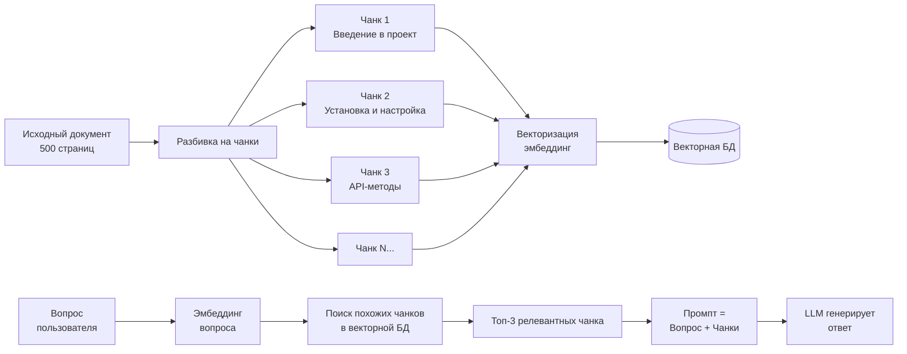
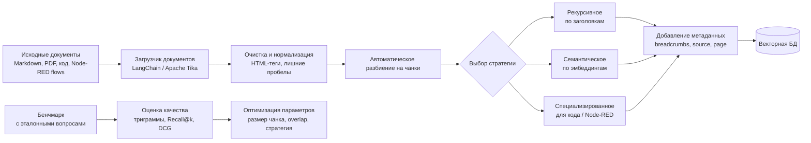
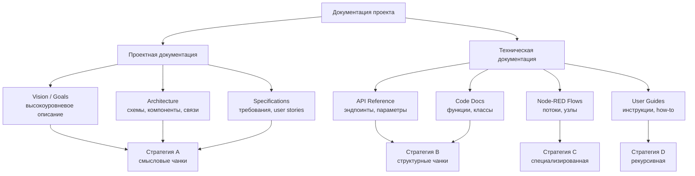
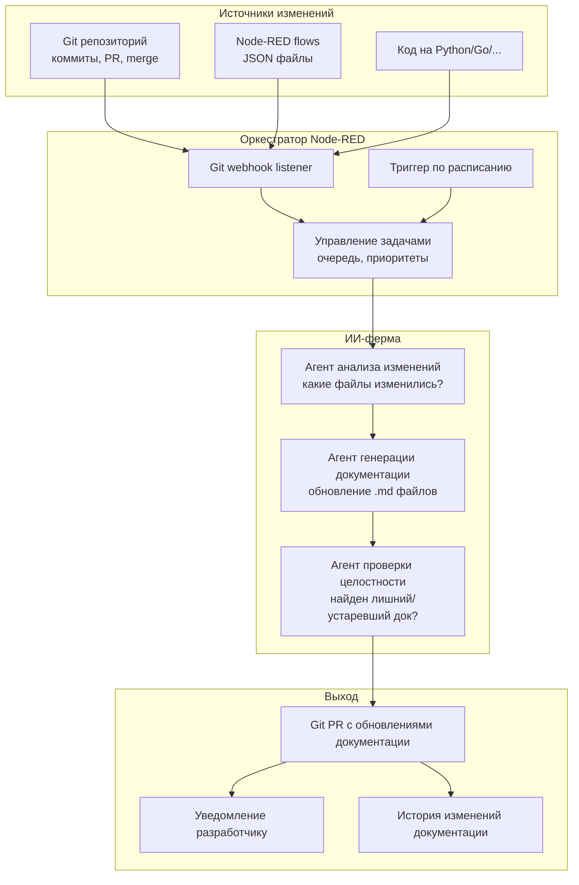
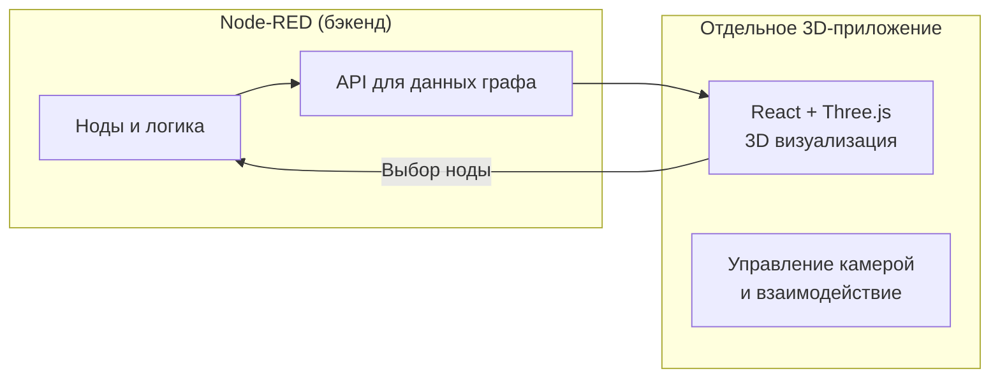

# Дообучение LLM под свои задачи

## 👤 **Kirill**

как дообучить llm модель для своей специфики?

---

## 🤖 **DeepSeek**

Дообучение (fine-tuning) — это процесс адаптации уже существующей большой языковой модели (LLM) под ваши специфические задачи и данные [citation:1]. Если представить, что готовая модель — это студент-отличник с общими знаниями, то дообучение — это углубленный курс, который делает его экспертом в узкой области, например, в медицине, юриспруденции или анализе отзывов клиентов [citation:1].

Процесс дообучения состоит из нескольких ключевых этапов. Вот пошаговое руководство, как это сделать.

### Шаг 1: Четко определите цель и формат задачи

Прежде чем приступать к технической части, ответьте себе на вопрос: **что именно должна делать ваша модель после дообучения?** От этого зависит структура ваших будущих данных [citation:8].

*   **Классификация текста**: Нужно распределять тексты по категориям (например, определять тональность отзыва: позитивный, негативный) [citation:6][citation:8].
*   **Генерация ответов (инструкции)**: Модель должна отвечать на вопросы пользователя в формате "вопрос-ответ" или "инструкция-ответ" [citation:2][citation:3].
*   **Извлечение информации (NER)**: Модель ищет в тексте конкретные сущности, например имена, даты или адреса [citation:8].

### Шаг 2: Подготовьте данные

Это, пожалуй, самый важный этап. Качество ваших данных напрямую определяет качество будущей модели [citation:1].

*   **Формат данных**: Самый распространенный и удобный формат — **JSONL** (JSON Lines), где каждая строка — отдельный пример для обучения [citation:2][citation:5].
*   **Структура примера**: В зависимости от задачи структура будет различаться. Вот самые частые варианты:

    *   **Для задач типа "вопрос-ответ" (Q&A)**: Используйте пары `"prompt"` и `"completion"` (или `"input"` и `"output"`) [citation:2][citation:5][citation:7].
        ```json
        {"prompt": "Какое расстояние от Земли до Солнца?", "completion": "Около 93 миллионов миль."}
        {"prompt": "Кто написал 'Войну и мир'?", "completion": "Лев Толстой."}
        ```

    *   **Для задач следования инструкциям (Instruction Tuning)**: Данные должны соответствовать шаблону чата (chat template) конкретной модели [citation:9][citation:10]. Например, для модели Mistral это может выглядеть так:
        ```json
        {"text": "<s>[INST] Какой смысл жизни? [/INST] 42.</s>"}
        ```

    *   **Для задач классификации**: Данные могут быть в CSV с колонками `text` и `labels` [citation:8].
*   **Разделение на выборки**: Обязательно разбейте все данные на три части: **обучающую** (training), **валидационную** (validation) для настройки параметров во время обучения и **тестовую** (testing) для финальной проверки качества [citation:5][citation:6]. Обычное соотношение — 80%, 10%, 10%.

> Данные должны быть **качественными**, **разнообразными** и **релевантными** вашей задаче. Плохие данные приведут к переобучению — модель будет блестяще отвечать на примеры из обучения, но "тупить" на любых новых вопросах [citation:1][citation:4].

### Шаг 3: Выберите базовую модель и метод дообучения

*   **Выбор модели**: Начните с модели, которая уже близка к вашей задаче по языку и размеру. Для русскоязычных задач хорошо подходят модели на базе ruBERT [citation:6] или современные многоязычные модели (например, серия **Qwen**, **Llama**, **Mistral**) [citation:7][citation:10]. Чем меньше модель, тем быстрее и дешевле ее дообучать.
*   **Выбор метода**: Полное дообучение всех весов модели требует огромных вычислительных ресурсов. Поэтому почти всегда используется метод **LoRA (Low-Rank Adaptation)** [citation:7][citation:10].
    *   **LoRA** дообучает не всю модель, а лишь небольшие дополнительные модули (адаптеры). Это **значительно быстрее, требует меньше памяти**, а полученный файл с адаптером весит всего мегабайты, в то время как полная модель может занимать гигабайты [citation:7][citation:10].

### Шаг 4: Настройте гиперпараметры и запустите обучение

Для запуска обучения удобнее всего использовать специализированные библиотеки и инструменты:

*   **Hugging Face Transformers + PEFT**: Самый популярный и гибкий способ. Библиотека `PEFT` (Parameter-Efficient Fine-Tuning) как раз предназначена для методов вроде LoRA [citation:7].
*   **AutoTrain от Hugging Face**: Инструмент для тех, кто хочет упростить себе жизнь. Он автоматически подбирает многие параметры. Доступен в виде Google Colab ноутбука, что позволяет использовать мощные GPU (например, A100) за небольшую плату [citation:10].
*   **Другие фреймворки**: NVIDIA NeMo, Azure Machine Learning AutoML [citation:2][citation:8].

**Ключевые гиперпараметры, которые нужно подобрать:**
*   `learning_rate` (скорость обучения): Обычно небольшое значение (например, 5e-4) [citation:9].
*   `batch_size` (размер батча): Количество примеров, обрабатываемых за один шаг. Зависит от мощности GPU [citation:9].
*   `num_epochs` (количество эпох): Сколько раз модель "пройдется" по всем данным. Слишком много эпох = переобучение [citation:9].
*   `lora_r`: Ранг матриц в LoRA. Влияет на количество обучаемых параметров. Для начала подойдет значение 8 [citation:10].

### Шаг 5: Оцените качество и сохраните модель

После обучения необходимо проверить, как модель работает на тестовой выборке, которую она раньше не видела [citation:6].

*   **Для генерации**: Сравните ответы модели с эталонными. Просто прочитайте их — стала ли она отвечать в нужном вам стиле? Можно использовать автоматические метрики, такие как BLEU, но для оценки качества генерации они не всегда показательны [citation:5].
*   **Для классификации**: Посчитайте точность (accuracy), полноту (recall) и другие стандартные метрики.

Сохраните результаты. Если вы использовали **LoRA**, вам нужно сохранить не всю модель, а только легкие файлы адаптера: `adapter_model.safetensors` и `adapter_config.json` [citation:10].

### Шаг 6: Используйте модель

Загрузите сохраненную базовую модель и файлы адаптера LoRA. Для генерации ответа нужно сначала загрузить базовую модель, затем применить к ней ваш обученный адаптер [citation:7]. Код загрузки будет выглядеть примерно так:

```python
from transformers import AutoModelForCausalLM, AutoTokenizer
from peft import PeftModel, PeftConfig

# Путь к папке с вашим адаптером (где лежат adapter_config.json и adapter_model.safetensors)
path_to_adapter = "./my-awesome-lora-adapter"

# Загружаем конфигурацию адаптера, чтобы узнать имя базовой модели
config = PeftConfig.from_pretrained(path_to_adapter)
# Загружаем базовую модель
base_model = AutoModelForCausalLM.from_pretrained(config.base_model_name_or_path)
# Загружаем и применяем адаптер к базовой модели
model = PeftModel.from_pretrained(base_model, path_to_adapter)

tokenizer = AutoTokenizer.from_pretrained(config.base_model_name_or_path)

# Далее — стандартный цикл генерации
inputs = tokenizer("Ваш вопрос", return_tensors="pt")
outputs = model.generate(**inputs)
print(tokenizer.decode(outputs[0]))
```

### **Важно: Fine-tuning или RAG?**

Прежде чем тратить ресурсы на дообучение, убедитесь, что вам нужен именно этот метод. Существует альтернатива — **RAG (Retrieval-Augmented Generation)** [citation:1][citation:4].

*   **RAG** не меняет веса модели. При поступлении вопроса система ищет релевантную информацию в вашей базе знаний (например, в документах) и добавляет ее в контекст запроса к модели. Модель отвечает, опираясь на этот контекст [citation:4].
*   **Когда что выбрать?**
    *   **RAG лучше подходит**, если у вас **большой и часто меняющийся объем информации** (например, текущая база знаний компании). Это дешевле и позволяет модели всегда иметь доступ к актуальным данным [citation:4].
    *   **Fine-tuning необходим**, если вы хотите изменить **стиль ответов**, **глубинные знания** модели или научить ее следовать **сложным специфическим инструкциям** (например, писать код в корпоративном стиле или общаться как конкретный литературный персонаж) [citation:1][citation:4][citation:7].

### Резюме

Чтобы дообучить LLM, нужно:
1.  **Определить задачу** (что делаем).
2.  **Подготовить данные** (собрать, почистить, разместить в JSONL).
3.  **Выбрать базовую модель и метод** (например, Qwen2.5 + LoRA).
4.  **Настроить и запустить обучение** (в Colab, на своем сервере или через AutoTrain).
5.  **Оценить и сохранить** (сохранить легкий LoRA-адаптер).
6.  **Интегрировать** (загружать базовую модель + адаптер для инференса).

Помните, что ключ к успеху — в качественных данных и правильно поставленной цели. Удачи

---

## 👤 **Kirill**

приведи пример как дообучить модель для работы с проектами компании, чтобы она знала полную структуру проекта и могла документировать изменения. Концептуально это инди разработка с использованием ии-фермы с единым центром управления (оркестратором на node-red) 

---

## 🤖 **DeepSeek**

Отличная задача! Концепция "инди-разработки с AI-фермой и оркестратором Node-RED" звучит очень перспективно. Для такого сценария идеально подходит гибридный подход, который сочетает дообучение (fine-tuning) для понимания структуры проекта и RAG для работы с актуальной документацией [citation:1].

Ниже я приведу концептуальный пример и архитектуру решения, которое можно реализовать.

### **Концептуальный пример: AI-ассистент проекта "IndiDev 3000"**

Представьте, что ваш проект называется "IndiDev 3000". У вас есть код, техническая документация в Markdown, диаграммы потоков Node-RED (в формате JSON) и журнал изменений (change log).

**Цель:** Научить модель отвечать на вопросы типа:
*   "Опиши последние изменения в модуле `node-red-contrib-orchestrator`."
*   "Сгенерируй документацию для нового узла Node-RED, который я написал, в едином корпоративном стиле."
*   "Как связан микросервис `auth-service` с оркестратором на Node-RED?"
*   "Напиши краткий отчет о версии 2.1.0 для команды."

### **Архитектура решения (AI-ферма с оркестратором Node-RED)**

Ваш центр управления на Node-RED становится "дирижером" этого оркестра. Вот как может выглядеть архитектура [citation:3][citation:4]:

```mermaid
flowchart TD
    A[Запрос пользователя<br>в Node-RED] --> B{Оркестратор Node-RED}
    
    B --> C{Анализ запроса}
    
    C -->|Нужны факты<br>из документации| D[RAG-модуль<br>Node-RED]
    C -->|Нужно понимание<br>структуры и стиля| E[Fine-tuned LLM]
    
    subgraph D [RAG-модуль (векторная БД)]
        D1[Поиск по чанкам<br>документации и кода]
        D2[Получение контекста]
    end
    
    D --> F[Промпт с контекстом]
    E --> F
    
    F --> G[Базовый LLM<br>для генерации]
    G --> H[Формирование ответа]
    H --> B
    B --> I[Ответ пользователю]
    
    J[Хранилище<br>документов проекта] --> D
    K[Git-репозиторий<br>проекта] --> D
```

### **Пошаговый план реализации**

#### **Шаг 1: Подготовка данных для обучения**

Это самый важный этап. Вам нужно создать датасет для обучения модели понимать структуру и документировать изменения [citation:8][citation:10].

**Типы данных:**
1.  **Структура проекта (графы знаний):** Превратите структуру ваших папок, файлов, зависимостей и потоков Node-RED в текстовое описание [citation:2].
    *   *Пример:* `Проект "IndiDev 3000" состоит из модулей: "Orchestrator" (Node-RED), "Auth Service" (Python), "Data Processor" (Go). Модуль "Orchestrator" содержит поток "Main Flow", который вызывает API "Auth Service".`
2.  **Пара "Код-Документация":** Соберите примеры вашего кода и соответствующей документации к нему.
    *   *Вход:* Функция или узел Node-RED.
    *   *Выход:* Описание, написанное в вашем корпоративном стиле [citation:5].
3.  **Пара "Изменение-Описание":** Используйте историю ваших коммитов в Git и записей в Change Log.
    *   *Вход:* `git diff` или описание задачи.
    *   *Выход:* Готовый пункт для Change Log или описание релиза.

**Формат данных:** Подготовьте файл `training_data.jsonl` в формате для обучения инструкциям (как для Gemini или других моделей) [citation:6][citation:4]:

```jsonl
{"messages": [{"role": "system", "content": "Ты — AI-ассистент проекта IndiDev 3000. Твоя задача — описывать изменения в проекте и структуру его компонентов в соответствии с корпоративным стилем."}, {"role": "user", "content": "Опиши изменения для версии 2.1.0 на основе этого лога:\n- Добавлен узел 'ai-ferma' в Node-RED\n- Исправлен бай в auth-service, из-за которого падала аутентификация"}, {"role": "assistant", "content": "## Версия 2.1.0\n\n**Нововведения:**\n- Интегрирован новый узел `ai-ferma` в оркестраторе Node-RED для взаимодействия с AI-модулями.\n\n**Исправления:**\n- Повышена стабильность системы: устранена критическая ошибка аутентификации в модуле `auth-service`."}]}
{"messages": [{"role": "user", "content": "Опиши структуру модуля 'orchestrator'."}, {"role": "assistant", "content": "Модуль `orchestrator` построен на Node-RED. Его ядро — поток `main-flow.json`, который обрабатывает входящие события и маршрутизирует их к микросервисам. Ключевые узлы: 'HTTP In', 'Function Node (router)', 'MQTT Out'."}]}
```

#### **Шаг 2: Дообучение (Fine-tuning) модели**

Для дообучения используйте эффективный метод LoRA (Low-Rank Adaptation), который позволяет дообучать модели с минимальными затратами ресурсов [citation:1][citation:10].

*   **Базовая модель:** Выберите небольшую, но мощную модель, например, **Qwen2.5 7B**, **Llama 3.1 8B** или **Mistral 7B**.
*   **Метод:** Parameter-Efficient Fine-Tuning (PEFT) + LoRA.
*   **Инструменты:** Библиотеки Hugging Face (`transformers`, `peft`, `trl`), Google Colab (если нет своей GPU), сервисы вроде Gradient.ai [citation:9].

Результатом будет не полная модель, а легкий **LoRA-адаптер** (несколько мегабайт), который хранит в себе знания о вашем проекте.

#### **Шаг 3: Интеграция с Node-RED (Оркестратор)**

Здесь в игру вступает Node-RED. Вы можете создать несколько потоков для разных задач [citation:4][citation:7]:

1.  **Узел для RAG (поиск информации):** При получении вопроса, этот поток:
    *   Ищет в вашей векторной базе данных (ChromaDB, Qdrant) чанки документации или кода, релевантные запросу.
    *   Возвращает найденный контекст.

2.  **Узел для Fine-tuned модели:** Отвечает за общение с вашей моделью (или адаптером).
    *   Загружает базовую модель и применяет LoRA-адаптер.
    *   Принимает промпт (вопрос + контекст от RAG-узла) и генерирует ответ.
    *   Для этого можно использовать `node-red-contrib-openai-wrapper`, адаптировав его под локальный эндпоинт [citation:4], или написать простой `exec`-узел, который вызывает Python-скрипт с моделью.

3.  **Главный оркестр (Master Flow):**
    *   Получает запрос от пользователя.
    *   Вызывает **RAG-узел**, чтобы получить факты из документации.
    *   Формирует финальный промпт, в который входят: вопрос пользователя + инструкция + контекст от RAG.
    *   Отправляет этот промпт в **узел Fine-tuned модели**.
    *   Возвращает красиво отформатированный ответ.

### **Резюме**

Для вашего сценария "инди-разработка + AI-ферма + Node-RED" идеально подходит связка **RAG + Fine-tuning** [citation:10]:
*   **Fine-tuning** "обучает" модель вашим правилам документирования, стилю общения и общей структуре проекта.
*   **RAG** предоставляет "свежие факты" — актуальное состояние кода и документации на момент запроса [citation:3].
*   **Node-RED** выступает в роли **мозга** ("оркестратора"), который управляет этими компонентами: решает, когда искать факты, а когда просто сгенерировать ответ на основе "знаний" модели, и собирает все воедино.

Этот подход даст вам мощного, контекстно-зависимого ассистента, который всегда в курсе последних изменений в вашем проекте. Удачи в реализации!

---

## 👤 **Kirill**

как работают чанки?

---

## 🤖 **DeepSeek**

**Чанки** (от англ. *chunk* — кусок, фрагмент) — это способ разбиения больших документов на более мелкие части для эффективной обработки моделями. Это фундаментальная концепция RAG (Retrieval-Augmented Generation) и работы с векторными базами данных.

## **Зачем нужны чанки?**

Представьте, что у вас есть документация проекта на 500 страниц. Если вы отправите её целиком в промпт модели:
- Модель имеет **ограниченный контекст** (например, 8k, 32k или 128k токенов)
- Большая часть информации будет **нерелевантна** конкретному вопросу
- Поиск внутри огромного текста **неэффективен**
- Стоимость обработки **растёт экспоненциально**

Чанки решают эту проблему: вы разрезаете документацию на смысловые куски, индексируете их, а при запросе находите только самые релевантные.

## **Как работает процесс с чанками**



## **Стратегии разбиения на чанки**

### **1. Фиксированный размер (Fixed-size chunking)**
Самый простой подход — нарезать текст на куски одинакового размера.

```python
# Пример: чанки по 500 символов с перекрытием 50 символов
text = "очень длинный текст документации..."

chunk_size = 500
overlap = 50
chunks = []

for i in range(0, len(text), chunk_size - overlap):
    chunk = text[i:i + chunk_size]
    chunks.append(chunk)
```

**Плюсы:** Простота реализации
**Минусы:** Можно разрезать посередине предложения или логического блока

### **2. Смысловое разбиение (Semantic chunking)**
Разбивка по естественным границам: заголовкам, параграфам, разделам.

```python
# Для Markdown-документации проекта
def chunk_markdown_by_headings(text):
    chunks = []
    current_chunk = []
    lines = text.split('\n')
    
    for line in lines:
        if line.startswith('# ') or line.startswith('## '):
            # Сохраняем предыдущий чанк
            if current_chunk:
                chunks.append('\n'.join(current_chunk))
                current_chunk = []
        current_chunk.append(line)
    
    # Добавляем последний чанк
    if current_chunk:
        chunks.append('\n'.join(current_chunk))
    
    return chunks
```

### **3. Рекурсивное разбиение (Recursive chunking)**
Попытка разбить по иерархии: сначала по абзацам, если слишком большой — по предложениям.

```python
from langchain.text_splitter import RecursiveCharacterTextSplitter

text_splitter = RecursiveCharacterTextSplitter(
    chunk_size=1000,
    chunk_overlap=200,
    separators=["\n\n", "\n", ".", "!", "?", ",", " ", ""]
)

chunks = text_splitter.split_text(document)
```

## **Важные параметры чанков**

### **Размер чанка (Chunk Size)**
- **Маленькие чанки (100-300 токенов)**:
  - Высокая точность поиска
  - Меньше контекста для модели
  - Хорошо для фактологических вопросов
  
- **Средние чанки (500-1000 токенов)**:
  - Баланс точности и контекста
  - Универсальный вариант для большинства задач
  
- **Большие чанки (1500+ токенов)**:
  - Больше контекста
  - Меньше точность поиска
  - Может содержать нерелевантную информацию

### **Перекрытие (Chunk Overlap)**
Перекрытие между соседними чанками помогает не потерять информацию на границах:

```python
chunk1: "...метод authenticate() принимает логин и пароль. Возвращаемое значение..."
chunk2: "...Возвращаемое значение: объект User или null. Пример использования..."

overlap = "Возвращаемое значение"
```

## **Пример для вашего проекта IndiDev 3000**

Допустим, у вас есть документация по Node-RED узлам:

```markdown
## Узел AI-Ferma

Узел для взаимодействия с AI-фермой. Поддерживает следующие параметры:

### Параметры конфигурации
- **model**: выбор модели (qwen2.5, llama3)
- **temperature**: температура генерации (0.0-1.0)
- **max_tokens**: максимальная длина ответа

### Входные сообщения
msg.payload должен содержать промпт для модели.

### Выходные сообщения
msg.payload содержит ответ от модели.
msg.error содержит ошибку, если произошёл сбой.

### Пример использования
1. Перетащите узел AI-Ferma на рабочую область
2. Настройте параметры в боковой панели
3. Подключите входной узел (Inject) к AI-Ferma
4. Подключите AI-Ferma к узлу Debug

## Узел Vector-Search

Узел для поиска в векторной базе данных...
```

**Разбиваем на чанки:**

```python
# Чанк 1: Общее описание и параметры
"Узел AI-Ferma для взаимодействия с AI-фермой. Параметры: model (qwen2.5, llama3), temperature (0.0-1.0), max_tokens..."

# Чанк 2: Форматы сообщений
"Входные сообщения: msg.payload с промптом. Выходные сообщения: msg.payload с ответом, msg.error при ошибке..."

# Чанк 3: Пример использования
"Пример: 1. Перетащите узел на рабочую область... 2. Настройте параметры... 3. Подключите Inject..."
```

## **Как работает поиск по чанкам**

1. **Вопрос пользователя**: "Как настроить temperature в AI-Ferma узле?"
2. **Эмбеддинг вопроса**: Вектор [0.12, -0.45, 0.78, ...]
3. **Поиск в векторной БД**: Сравниваем со всеми векторами чанков
4. **Топ-3 похожих чанка**:
   - Чанк 1 (сходство 0.89): "Параметры: model, temperature (0.0-1.0)..."
   - Чанк 2 (сходство 0.45): "Входные сообщения..."
   - Чанк 3 (сходство 0.23): "Пример использования..."
5. **Формирование промпта**:
   ```
   Вопрос: Как настроить temperature в AI-Ferma узле?
   
   Контекст:
   ---
   Чанк 1: "Параметры: model, temperature (0.0-1.0), max_tokens..."
   ---
   
   Ответь на вопрос, используя только предоставленный контекст.
   ```

## **Практические рекомендации**

Для вашего проекта с Node-RED оркестратором:

1. **Для документации**: чанки по 500-1000 токенов с перекрытием 100-200 токенов, разбивка по заголовкам
2. **Для кода**: чанки по функциям или классам (1 функция = 1 чанк)
3. **Для потоков Node-RED**: 1 поток = 1 чанк + метаданные о связях
4. **Для Git-коммитов**: группировка по дням/версиям

```python
# Пример для Node-RED потока
node_red_flow = {
    "id": "flow1",
    "nodes": [...],
    "wires": [...]
}

# Превращаем в текстовый чанк
chunk_text = f"""
Поток Node-RED: {flow_name}
Узлы: {', '.join([n['name'] for n in nodes])}
Связи: {connections_description}
Назначение: {flow_purpose}
"""
```

## **Заключение**

Чанки — это способ сделать огромную документацию "перевариваемой" для LLM:
- **Разрезаем** большие документы на смысловые куски
- **Индексируем** каждый кусок
- **Находим** релевантные куски к вопросу
- **Скармливаем** только их модели

Это позволяет модели работать с любой базой знаний, даже если она больше контекста модели в тысячи раз!

---

## 👤 **Kirill**

как автоматизировать разбиение большой документации на чанки?

---

## 🤖 **DeepSeek**

Автоматизация разбиения документации на чанки — это ключевой этап построения эффективной RAG-системы. Вместо ручной нарезки (как в примере с ГОСТами, где на это ушло полгода [citation:8]), вы можете использовать программные подходы, которые масштабируются и дают воспроизводимый результат.

Вот как выстроить автоматизированный пайплайн чанкования для вашего проекта с Node-RED оркестратором.

## 🏗️ **Базовая архитектура автоматического чанкования**



## 🛠️ **Инструменты для автоматизации**

### **Готовые фреймворки и библиотеки**

| Инструмент | Назначение | Ключевые особенности |
|------------|------------|----------------------|
| **LangChain** [citation:2][citation:4] | Рекурсивное чанкование | `RecursiveCharacterTextSplitter` с разделителями по иерархии |
| **ChunkFlow** [citation:3] | Production-grade фреймворк | 6+ стратегий, встроенная оценка, 12+ метрик |
| **chunking-strategy** [citation:5] | Универсальное чанкование | 40+ стратегий, поддержка любых форматов через Apache Tika |
| **Gramax custom** [citation:8] | Кастомное чанкование | Умные правила по заголовкам, склейка мелких чанков |

### **Пример простого пайплайна на Python**

```python
import os
from langchain.text_splitter import RecursiveCharacterTextSplitter
from langchain.document_loaders import DirectoryLoader, TextLoader, UnstructuredMarkdownLoader
import json
from typing import List, Dict
import hashlib

class AutomatedChunker:
    """
    Автоматический чанкер для документации проекта IndiDev 3000
    """
    
    def __init__(self, chunk_size=500, chunk_overlap=75):
        self.chunk_size = chunk_size
        self.chunk_overlap = chunk_overlap
        
        # Основной сплиттер для текстовых документов
        self.text_splitter = RecursiveCharacterTextSplitter(
            chunk_size=chunk_size,
            chunk_overlap=chunk_overlap,
            separators=["\n## ", "\n### ", "\n#### ", "\n", " ", ""],
            length_function=len,
        )
        
        # Сплиттер для кода (сохраняет структуру функций)
        self.code_splitter = RecursiveCharacterTextSplitter(
            chunk_size=chunk_size,
            chunk_overlap=chunk_overlap,
            separators=["\nclass ", "\ndef ", "\n\tdef ", "\n\n", "\n", " "],
            length_function=len,
        )
    
    def load_documents(self, base_path: str) -> List[Dict]:
        """Автоматическая загрузка всех документов проекта"""
        documents = []
        
        # Загрузка Markdown-документации
        md_loader = DirectoryLoader(
            os.path.join(base_path, "docs"),
            glob="**/*.md",
            loader_cls=UnstructuredMarkdownLoader
        )
        md_docs = md_loader.load()
        
        # Загрузка Node-RED flows (JSON)
        flow_files = []
        for root, dirs, files in os.walk(os.path.join(base_path, "flows")):
            for file in files:
                if file.endswith(".json"):
                    with open(os.path.join(root, file), 'r') as f:
                        flow_data = json.load(f)
                        # Превращаем flow в текст
                        flow_text = self._flow_to_text(flow_data)
                        documents.append({
                            "content": flow_text,
                            "metadata": {
                                "source": file,
                                "type": "node_red_flow",
                                "path": os.path.join(root, file)
                            }
                        })
        
        # Добавляем Markdown-документы
        for doc in md_docs:
            documents.append({
                "content": doc.page_content,
                "metadata": {
                    "source": os.path.basename(doc.metadata.get("source", "unknown")),
                    "type": "documentation",
                    "path": doc.metadata.get("source", "")
                }
            })
        
        return documents
    
    def _flow_to_text(self, flow_data: Dict) -> str:
        """Конвертирует Node-RED flow в текст для чанкования"""
        nodes = flow_data.get("nodes", [])
        text_parts = [f"Node-RED Flow: {flow_data.get('label', 'Unnamed')}"]
        
        for node in nodes:
            node_type = node.get("type", "unknown")
            node_name = node.get("name", node.get("id", ""))
            text_parts.append(f"Node: {node_name} (type: {node_type})")
            
            # Добавляем конфигурацию узла
            if "config" in node:
                text_parts.append(f"Config: {json.dumps(node['config'])}")
        
        return "\n".join(text_parts)
    
    def chunk_document(self, doc: Dict) -> List[Dict]:
        """Разбивает документ на чанки с сохранением метаданных"""
        content = doc["content"]
        metadata = doc["metadata"]
        
        # Выбор сплиттера в зависимости от типа документа
        if metadata.get("type") == "node_red_flow":
            splitter = self.code_splitter
        else:
            splitter = self.text_splitter
        
        # Разбиваем на чанки
        chunks = splitter.split_text(content)
        
        # Создаем чанки с метаданными
        result = []
        for i, chunk_text in enumerate(chunks):
            # Добавляем breadcrumbs (хлебные крошки) [citation:8]
            breadcrumbs = self._generate_breadcrumbs(metadata, chunk_text)
            
            chunk = {
                "chunk_id": hashlib.md5(f"{metadata['source']}_{i}".encode()).hexdigest(),
                "doc_id": metadata["source"],
                "text": chunk_text,
                "chunk_index": i,
                "metadata": {
                    **metadata,
                    "breadcrumbs": breadcrumbs,
                    "chunk_size": len(chunk_text),
                }
            }
            result.append(chunk)
        
        return result
    
    def _generate_breadcrumbs(self, metadata: Dict, chunk_text: str) -> str:
        """Создает иерархический путь для чанка [citation:8]"""
        parts = []
        
        # Добавляем структуру из метаданных
        if "path" in metadata:
            path_parts = metadata["path"].split("/")
            parts.extend(path_parts[-3:])  # последние 3 уровня
        
        # Ищем заголовки в тексте чанка
        import re
        headers = re.findall(r"^#+\s+(.+)$", chunk_text, re.MULTILINE)
        if headers:
            parts.append(headers[0])
        
        return " / ".join(parts)
    
    def process_all(self, base_path: str) -> List[Dict]:
        """Полный пайплайн: загрузка -> чанкование -> сохранение"""
        print("📥 Загрузка документов...")
        docs = self.load_documents(base_path)
        
        print(f"🔪 Разбиение {len(docs)} документов на чанки...")
        all_chunks = []
        for doc in docs:
            chunks = self.chunk_document(doc)
            all_chunks.extend(chunks)
        
        print(f"✅ Создано {len(all_chunks)} чанков")
        
        # Сохраняем результат
        with open("chunks_output.json", "w") as f:
            json.dump(all_chunks, f, indent=2, ensure_ascii=False)
        
        return all_chunks

# Использование
if __name__ == "__main__":
    chunker = AutomatedChunker(chunk_size=500, chunk_overlap=75)
    chunks = chunker.process_all("/path/to/your/project")
```

## 🎯 **Стратегии автоматического чанкования**

### **1. Рекурсивное чанкование по структуре документа** [citation:2][citation:4]

```python
from langchain.text_splitter import RecursiveCharacterTextSplitter

# Для Markdown с заголовками
markdown_splitter = RecursiveCharacterTextSplitter(
    chunk_size=500,
    chunk_overlap=50,
    separators=["\n## ", "\n### ", "\n#### ", "\n", " "],
    keep_separator=True
)

# Для кода Python
python_splitter = RecursiveCharacterTextSplitter(
    chunk_size=500,
    chunk_overlap=50,
    separators=["\nclass ", "\ndef ", "\n\tdef ", "\n\n", "\n", " "]
)
```

### **2. Семантическое чанкование** [citation:3]

Определяет границы чанков по резким изменениям в эмбеддингах:

```python
from chunk_flow.chunking import StrategyRegistry

# Используем semantic chunking из ChunkFlow
chunker = StrategyRegistry.create("semantic", {
    "threshold_percentile": 80,  # чувствительность к изменениям
    "min_chunk_size": 100,
    "max_chunk_size": 1000
})

result = await chunker.chunk(document)
```

### **3. Умное чанкование с постобработкой** [citation:8]

```python
def smart_chunk_with_glue(text: str, headers: List[str], target_size: int = 500):
    """
    Чанкование с умными правилами:
    - деление по заголовкам
    - склейка слишком маленьких чанков
    - перекрытие 15%
    """
    chunks = []
    current_chunk = []
    current_size = 0
    
    # Делим по заголовкам
    sections = split_by_headers(text, headers)
    
    for section in sections:
        section_size = len(section)
        
        # Если секция слишком маленькая - добавляем к предыдущей
        if section_size < 100 and current_chunk:
            current_chunk.append(section)
            current_size += section_size
        # Если секция больше target_size - разбиваем отдельно
        elif section_size > target_size:
            if current_chunk:
                chunks.append("".join(current_chunk))
                current_chunk = []
                current_size = 0
            # Разбиваем большую секцию на подчанки
            sub_chunks = split_long_section(section, target_size)
            chunks.extend(sub_chunks)
        # Нормальный случай
        else:
            if current_size + section_size > target_size:
                chunks.append("".join(current_chunk))
                current_chunk = [section]
                current_size = section_size
            else:
                current_chunk.append(section)
                current_size += section_size
    
    # Добавляем последний чанк
    if current_chunk:
        chunks.append("".join(current_chunk))
    
    return chunks
```

## 📊 **Автоматическая оценка качества чанков**

Без метрик вы не узнаете, насколько хорошо работает ваша система. Вот как внедрить автоматическую оценку [citation:8]:

```python
class ChunkQualityEvaluator:
    """
    Оценка качества чанков с помощью бенчмарка
    """
    
    def __init__(self):
        self.benchmark = [
            {
                "question": "Как настроить temperature в AI-Ferma узле?",
                "expected_text": "Параметр temperature (0.0-1.0) контролирует креативность ответов модели"
            },
            {
                "question": "Какие форматы поддерживает узел Vector-Search?",
                "expected_text": "Поддерживаются эмбеддинги от OpenAI, HuggingFace и локальные модели"
            }
        ]
    
    def evaluate_chunks(self, chunks: List[Dict], retriever) -> Dict:
        """
        Оценивает качество чанков через retrieval на тестовых запросах
        """
        results = {}
        
        for item in self.benchmark:
            question = item["question"]
            expected = item["expected_text"]
            
            # Получаем топ-10 чанков по запросу
            retrieved_chunks = retriever.retrieve(question, k=10)
            
            # Метрика 1: Триграммное покрытие [citation:8]
            trigram_score = self._trigram_coverage(
                expected, 
                [c["text"] for c in retrieved_chunks]
            )
            
            # Метрика 2: Recall@k (полнота на первых k)
            recall_at_5 = self._recall_at_k(expected, retrieved_chunks, k=5)
            
            # Метрика 3: DCG (качество ранжирования)
            dcg_score = self._discounted_cumulative_gain(
                expected, 
                retrieved_chunks
            )
            
            results[question] = {
                "trigram_coverage": trigram_score,
                "recall@5": recall_at_5,
                "dcg": dcg_score
            }
        
        return results
    
    def _trigram_coverage(self, expected: str, retrieved_texts: List[str]) -> float:
        """Оценка покрытия триграммами [citation:8]"""
        # Разбиваем ожидаемый текст на триграммы слов
        words = expected.split()
        expected_trigrams = set()
        for i in range(len(words) - 2):
            trigram = " ".join(words[i:i+3])
            expected_trigrams.add(trigram)
        
        # Собираем триграммы из найденных чанков
        found_trigrams = set()
        for text in retrieved_texts:
            text_words = text.split()
            for i in range(len(text_words) - 2):
                trigram = " ".join(text_words[i:i+3])
                found_trigrams.add(trigram)
        
        if not expected_trigrams:
            return 0.0
        
        intersection = expected_trigrams.intersection(found_trigrams)
        coverage = len(intersection) / len(expected_trigrams)
        
        return coverage
    
    def _recall_at_k(self, expected: str, retrieved_chunks: List[Dict], k: int) -> float:
        """Доля релевантных чанков в первых k [citation:8]"""
        # Упрощённо: считаем чанк релевантным, если содержит ключевые слова из expected
        relevant_found = 0
        expected_keywords = set(expected.lower().split())
        
        for i, chunk in enumerate(retrieved_chunks[:k]):
            chunk_words = set(chunk["text"].lower().split())
            if expected_keywords.intersection(chunk_words):
                relevant_found += 1
        
        return relevant_found / k if k > 0 else 0
    
    def _discounted_cumulative_gain(self, expected: str, retrieved_chunks: List[Dict]) -> float:
        """
        Оценивает, насколько хорошо ранжированы результаты [citation:8]
        Чем раньше релевантные чанки, тем выше DCG
        """
        dcg = 0.0
        expected_keywords = set(expected.lower().split())
        
        for i, chunk in enumerate(retrieved_chunks):
            # Позиция (1-indexed)
            position = i + 1
            
            # Релевантность (1 или 0)
            chunk_words = set(chunk["text"].lower().split())
            relevant = 1 if expected_keywords.intersection(chunk_words) else 0
            
            # DCG формула: rel_i / log2(i+1)
            contribution = relevant / (position ** 0.5)  # упрощённо
            dcg += contribution
        
        return dcg
```

## 🔄 **Итеративная оптимизация**

После внедрения автоматического чанкования, вы можете оптимизировать параметры на основе метрик:

```python
def optimize_chunk_parameters(documents, benchmark, param_grid):
    """
    Перебор параметров чанкования для поиска оптимальных
    """
    best_score = 0
    best_params = {}
    
    for chunk_size in param_grid["chunk_sizes"]:
        for overlap in param_grid["overlaps"]:
            for strategy in param_grid["strategies"]:
                
                # Применяем параметры
                chunker = AutomatedChunker(
                    chunk_size=chunk_size,
                    chunk_overlap=overlap,
                    strategy=strategy
                )
                
                chunks = chunker.process_all(documents)
                
                # Оцениваем качество
                evaluator = ChunkQualityEvaluator()
                scores = evaluator.evaluate_chunks(chunks, retriever)
                
                avg_score = np.mean([s["trigram_coverage"] for s in scores.values()])
                
                if avg_score > best_score:
                    best_score = avg_score
                    best_params = {
                        "chunk_size": chunk_size,
                        "overlap": overlap,
                        "strategy": strategy
                    }
    
    return best_params, best_score
```

## 📝 **Рекомендации для вашего проекта IndiDev 3000**

Для вашего сценария с Node-RED оркестратором рекомендую:

1. **Начать с рекурсивного чанкования** (500 токенов, overlap 15%) — это даст хороший baseline [citation:8]
2. **Добавить метаданные** — иерархические breadcrumbs для сохранения контекста [citation:8][citation:9]
3. **Создать бенчмарк** из 20-30 типичных вопросов по вашему проекту
4. **Замерять метрики** (триграммы, Recall@5, DCG) после каждого изменения
5. **Итерировать** — пробовать семантическое чанкование, менять размер, добавлять реранкер

Главный урок из продакшен-опыта [citation:8]: **"Никакого ручного деления на чанки. Метрики выше 95% — это реально достижимо с правильной автоматизацией"**.

Удачи с автоматизацией! Если появятся вопросы по конкретной реализации для Node-RED — спрашивайте.

---

## 👤 **Kirill**

а как быть с разными типами документов? например есть проектная и техническая документация (архитектура, vision, спецификации, api и т.д.) или это универсальный подход к любого типа документов.

---

## 🤖 **DeepSeek**

## **Разные типы документов — разные стратегии!**

Вы абсолютно правы — универсального подхода не существует. Более того, **смешивание разных типов документов в одной стратегии чанкования — частая ошибка**, которая убивает качество RAG-системы. 

Давайте разберём, как обрабатывать разные типы документов для вашего проекта IndiDev 3000.

## 🏛️ **Классификация типов документов**



## 📚 **Тип 1: Проектная документация (Vision, Goals, Architecture)**

### **Особенности:**
- Описательный, связный текст
- Важна целостность идей
- Термины и концепции повторяются

### **Стратегия: Семантическое чанкование** 

```python
class ProjectDocsChunker:
    """
    Для Vision, Architecture overview, Goals
    """
    
    def chunk_project_document(self, text: str, metadata: Dict) -> List[Dict]:
        """
        Разбиение по смысловым блокам с сохранением целостности
        """
        # Сначала ищем естественные разделы
        sections = self._split_by_markdown_headers(text)
        
        chunks = []
        for section in sections:
            # Проверяем, не слишком ли большой раздел
            if len(section["text"]) > 1000:
                # Разбиваем семантически
                sub_sections = self._semantic_split(section["text"])
                for i, sub in enumerate(sub_sections):
                    chunks.append({
                        "text": sub,
                        "metadata": {
                            **metadata,
                            "doc_type": "project_doc",
                            "section": section["header"],
                            "sub_section": i,
                            "breadcrumbs": f"{metadata.get('doc_name')} > {section['header']} > часть {i+1}"
                        }
                    })
            else:
                chunks.append({
                    "text": section["text"],
                    "metadata": {
                        **metadata,
                        "doc_type": "project_doc",
                        "section": section["header"],
                        "breadcrumbs": f"{metadata.get('doc_name')} > {section['header']}"
                    }
                })
        
        return chunks
    
    def _semantic_split(self, text: str, target_size: int = 500) -> List[str]:
        """
        Семантическое разбиение по границам предложений и абзацев
        """
        # Разбиваем на абзацы
        paragraphs = text.split('\n\n')
        
        chunks = []
        current_chunk = []
        current_size = 0
        
        for para in paragraphs:
            para_size = len(para)
            
            # Если абзац сам по себе большой - разбиваем по предложениям
            if para_size > target_size:
                if current_chunk:
                    chunks.append('\n\n'.join(current_chunk))
                    current_chunk = []
                    current_size = 0
                
                # Разбиваем абзац на предложения
                sentences = para.split('. ')
                sent_chunk = []
                sent_size = 0
                
                for sent in sentences:
                    sent = sent.strip() + ('.' if not sent.endswith('.') else '')
                    sent_len = len(sent)
                    
                    if sent_size + sent_len > target_size and sent_chunk:
                        chunks.append(' '.join(sent_chunk))
                        sent_chunk = [sent]
                        sent_size = sent_len
                    else:
                        sent_chunk.append(sent)
                        sent_size += sent_len
                
                if sent_chunk:
                    chunks.append(' '.join(sent_chunk))
            
            # Нормальный абзац - добавляем к текущему чанку
            elif current_size + para_size > target_size:
                chunks.append('\n\n'.join(current_chunk))
                current_chunk = [para]
                current_size = para_size
            else:
                current_chunk.append(para)
                current_size += para_size
        
        # Добавляем последний чанк
        if current_chunk:
            chunks.append('\n\n'.join(current_chunk))
        
        return chunks
```

## 🔧 **Тип 2: Техническая документация (API Reference)**

### **Особенности:**
- Структурированная информация
- Важна точность параметров
- Часто в формате OpenAPI/Swagger

### **Стратегия: Чанкование по эндпоинтам** 

```python
class APIDocsChunker:
    """
    Для API Reference, OpenAPI спецификаций
    """
    
    def chunk_openapi_spec(self, spec: Dict, metadata: Dict) -> List[Dict]:
        """
        Разбиение OpenAPI спецификации по эндпоинтам
        """
        chunks = []
        
        # Проходим по всем путям
        for path, path_item in spec.get('paths', {}).items():
            for method, operation in path_item.items():
                # Создаём чанк для каждого эндпоинта
                chunk_text = self._format_endpoint(
                    path=path,
                    method=method.upper(),
                    summary=operation.get('summary', ''),
                    description=operation.get('description', ''),
                    parameters=operation.get('parameters', []),
                    request_body=operation.get('requestBody', {}),
                    responses=operation.get('responses', {})
                )
                
                chunks.append({
                    "text": chunk_text,
                    "metadata": {
                        **metadata,
                        "doc_type": "api_reference",
                        "endpoint": f"{method.upper()} {path}",
                        "operation_id": operation.get('operationId', ''),
                        "tags": operation.get('tags', []),
                        "breadcrumbs": f"API > {method.upper()} {path}"
                    }
                })
        
        return chunks
    
    def _format_endpoint(self, **kwargs) -> str:
        """Форматирует эндпоинт в читаемый текст"""
        lines = []
        lines.append(f"# {kwargs['method']} {kwargs['path']}")
        
        if kwargs['summary']:
            lines.append(f"\n**Summary:** {kwargs['summary']}")
        
        if kwargs['description']:
            lines.append(f"\n**Description:** {kwargs['description']}")
        
        if kwargs['parameters']:
            lines.append(f"\n**Parameters:**")
            for param in kwargs['parameters']:
                required = " (required)" if param.get('required') else ""
                lines.append(f"- {param['name']} ({param['in']}{required}): {param.get('description', '')}")
        
        if kwargs['request_body']:
            lines.append(f"\n**Request Body:** {kwargs['request_body'].get('description', '')}")
        
        if kwargs['responses']:
            lines.append(f"\n**Responses:**")
            for code, response in kwargs['responses'].items():
                lines.append(f"- {code}: {response.get('description', '')}")
        
        return '\n'.join(lines)
```

## 💻 **Тип 3: Код и Node-RED Flows**

### **Особенности:**
- Иерархическая структура
- Важны связи между компонентами
- Синтаксическая корректность

### **Стратегия: Структурное чанкование с сохранением связей** 

```python
class NodeRedFlowChunker:
    """
    Специализированный чанкер для Node-RED flows
    """
    
    def chunk_node_red_flow(self, flow_data: Dict, metadata: Dict) -> List[Dict]:
        """
        Разбиение Node-RED потока на логические блоки
        """
        chunks = []
        
        # 1. Общая информация о потоке (один чанк)
        flow_info = self._extract_flow_info(flow_data)
        chunks.append({
            "text": flow_info,
            "metadata": {
                **metadata,
                "doc_type": "node_red_flow",
                "chunk_type": "flow_overview",
                "breadcrumbs": f"Node-RED > {metadata.get('flow_name', 'Unnamed')} > Overview"
            }
        })
        
        # 2. Группируем узлы по функциональности
        nodes = flow_data.get('nodes', [])
        
        # Находим группы (subflows)
        groups = [n for n in nodes if n.get('type') == 'group']
        
        for group in groups:
            group_nodes = [n for n in nodes if n.get('z') == group['id']]
            group_text = self._format_group(group, group_nodes)
            chunks.append({
                "text": group_text,
                "metadata": {
                    **metadata,
                    "doc_type": "node_red_flow",
                    "chunk_type": "group",
                    "group_name": group.get('name', group.get('id')),
                    "node_count": len(group_nodes),
                    "breadcrumbs": f"Node-RED > {metadata.get('flow_name', 'Unnamed')} > Group: {group.get('name', 'Unnamed')}"
                }
            })
        
        # 3. Отдельные важные узлы (вне групп)
        standalone_nodes = [n for n in nodes 
                           if n.get('type') not in ['group', 'tab'] 
                           and not n.get('z')]  # не в группе
        
        # Группируем узлы по типам
        by_type = {}
        for node in standalone_nodes:
            node_type = node.get('type', 'unknown')
            if node_type not in by_type:
                by_type[node_type] = []
            by_type[node_type].append(node)
        
        for node_type, type_nodes in by_type.items():
            type_text = self._format_nodes_by_type(node_type, type_nodes)
            chunks.append({
                "text": type_text,
                "metadata": {
                    **metadata,
                    "doc_type": "node_red_flow",
                    "chunk_type": "node_type_group",
                    "node_type": node_type,
                    "node_count": len(type_nodes),
                    "breadcrumbs": f"Node-RED > {metadata.get('flow_name', 'Unnamed')} > Nodes: {node_type}"
                }
            })
        
        # 4. Чанк со связями (wires) для понимания потока данных
        wires_text = self._format_wires(nodes)
        chunks.append({
            "text": wires_text,
            "metadata": {
                **metadata,
                "doc_type": "node_red_flow",
                "chunk_type": "connections",
                "breadcrumbs": f"Node-RED > {metadata.get('flow_name', 'Unnamed')} > Data Flow"
            }
        })
        
        return chunks
    
    def _extract_flow_info(self, flow: Dict) -> str:
        """Извлекает общую информацию о потоке"""
        lines = []
        lines.append(f"# Node-RED Flow: {flow.get('label', 'Unnamed')}")
        
        if 'description' in flow:
            lines.append(f"\n**Description:** {flow['description']}")
        
        # Статистика
        nodes = flow.get('nodes', [])
        lines.append(f"\n**Statistics:**")
        lines.append(f"- Total nodes: {len(nodes)}")
        
        # Типы узлов
        node_types = {}
        for node in nodes:
            ntype = node.get('type', 'unknown')
            node_types[ntype] = node_types.get(ntype, 0) + 1
        
        lines.append(f"- Node types: {', '.join([f'{k}: {v}' for k, v in node_types.items()])}")
        
        return '\n'.join(lines)
```

## 📋 **Тип 4: Спецификации и Requirements**

### **Особенности:**
- Чёткая структура (должно/не должно)
- Важна трассируемость
- Часто с ID требований

### **Стратегия: Чанкование по требованиям с сохранением ID** 

```python
class RequirementsChunker:
    """
    Для спецификаций, user stories, требований
    """
    
    def chunk_requirements(self, text: str, metadata: Dict) -> List[Dict]:
        """
        Разбиение требований по ID или разделам
        """
        chunks = []
        
        # Ищем требования с ID (например, REQ-001, FR-101)
        import re
        
        # Регулярка для поиска требований
        req_pattern = r'(REQ-\d+|FR-\d+|US-\d+)[\s\n]*(.+?)(?=REQ-\d+|FR-\d+|US-\d+|$)'
        
        matches = re.finditer(req_pattern, text, re.DOTALL)
        
        for i, match in enumerate(matches):
            req_id = match.group(1)
            req_text = match.group(2).strip()
            
            chunks.append({
                "text": f"**{req_id}**\n{req_text}",
                "metadata": {
                    **metadata,
                    "doc_type": "requirement",
                    "requirement_id": req_id,
                    "chunk_index": i,
                    "breadcrumbs": f"Requirements > {metadata.get('doc_name', '')} > {req_id}"
                }
            })
        
        # Если не нашли требований с ID, разбиваем по заголовкам
        if not chunks:
            # Используем рекурсивное чанкование с приоритетом заголовков
            splitter = RecursiveCharacterTextSplitter(
                chunk_size=500,
                chunk_overlap=50,
                separators=["\n## ", "\n### ", "\n- ", "\n", " "]
            )
            
            text_chunks = splitter.split_text(text)
            
            for i, chunk_text in enumerate(text_chunks):
                chunks.append({
                    "text": chunk_text,
                    "metadata": {
                        **metadata,
                        "doc_type": "requirement",
                        "chunk_index": i,
                        "breadcrumbs": f"Requirements > {metadata.get('doc_name', '')} > Part {i+1}"
                    }
                })
        
        return chunks
```

## 🎯 **Унифицированный процессор документов**

Объединяем всё в единый пайплайн:

```python
class UniversalDocumentChunker:
    """
    Универсальный чанкер, определяющий тип документа и применяющий соответствующую стратегию
    """
    
    def __init__(self):
        self.project_chunker = ProjectDocsChunker()
        self.api_chunker = APIDocsChunker()
        self.flow_chunker = NodeRedFlowChunker()
        self.requirements_chunker = RequirementsChunker()
        self.general_chunker = RecursiveCharacterTextSplitter(
            chunk_size=500,
            chunk_overlap=50
        )
        
        # Классификатор типов документов
        self.doc_classifier = DocumentClassifier()
    
    def process_document(self, file_path: str, content: Any) -> List[Dict]:
        """
        Определяет тип документа и применяет нужный чанкер
        """
        # 1. Классифицируем документ
        doc_type, confidence = self.doc_classifier.classify(file_path, content)
        
        # 2. Извлекаем базовые метаданные
        metadata = self._extract_metadata(file_path, doc_type)
        
        # 3. Применяем соответствующий чанкер
        if doc_type == "node_red_flow":
            chunks = self.flow_chunker.chunk_node_red_flow(content, metadata)
        elif doc_type == "api_spec":
            chunks = self.api_chunker.chunk_openapi_spec(content, metadata)
        elif doc_type == "requirements":
            chunks = self.requirements_chunker.chunk_requirements(content, metadata)
        elif doc_type in ["vision", "architecture"]:
            chunks = self.project_chunker.chunk_project_document(content, metadata)
        else:
            # Универсальный случай
            text_chunks = self.general_chunker.split_text(content)
            chunks = []
            for i, chunk_text in enumerate(text_chunks):
                chunks.append({
                    "text": chunk_text,
                    "metadata": {
                        **metadata,
                        "chunk_index": i,
                        "breadcrumbs": f"{metadata.get('doc_name', 'Document')} > Part {i+1}"
                    }
                })
        
        return chunks
    
    def _extract_metadata(self, file_path: str, doc_type: str) -> Dict:
        """Извлекает базовые метаданные из пути к файлу"""
        import os
        from datetime import datetime
        
        return {
            "source_file": file_path,
            "doc_name": os.path.basename(file_path),
            "doc_type": doc_type,
            "file_extension": os.path.splitext(file_path)[1],
            "processed_at": datetime.now().isoformat(),
            "directory": os.path.dirname(file_path)
        }


class DocumentClassifier:
    """
    Классификатор типов документов
    """
    
    def classify(self, file_path: str, content: Any) -> tuple:
        """
        Определяет тип документа по расширению, имени и содержанию
        Возвращает (doc_type, confidence)
        """
        import re
        
        # 1. По расширению файла
        if file_path.endswith('.json'):
            # Проверяем, Node-RED ли это
            if isinstance(content, dict) and 'nodes' in content and 'wires' in str(content):
                return ("node_red_flow", 0.95)
            if isinstance(content, dict) and 'paths' in content and 'openapi' in str(content):
                return ("api_spec", 0.9)
        
        if file_path.endswith(('.yaml', '.yml')):
            if 'openapi' in str(content).lower() or 'swagger' in str(content).lower():
                return ("api_spec", 0.85)
        
        if file_path.endswith('.md'):
            # Анализируем содержание Markdown
            content_lower = str(content).lower()
            
            if any(word in content_lower for word in ['vision', 'goal', 'objective', 'mission']):
                return ("vision", 0.7)
            if any(word in content_lower for word in ['architecture', 'component', 'module', 'layer']):
                return ("architecture", 0.7)
            if any(word in content_lower for word in ['requirement', 'specification', 'shall', 'must']):
                if re.search(r'REQ-\d+|FR-\d+', content_lower):
                    return ("requirements", 0.9)
                return ("requirements", 0.6)
            if any(word in content_lower for word in ['api', 'endpoint', 'route', 'http']):
                return ("api_doc", 0.6)
        
        # 2. По имени файла
        filename = os.path.basename(file_path).lower()
        
        classifiers = [
            ('vision', ['vision', 'goals', 'roadmap']),
            ('architecture', ['architecture', 'overview', 'high-level']),
            ('requirements', ['requirements', 'specs', 'srs']),
            ('api_doc', ['api', 'swagger', 'openapi']),
            ('user_guide', ['guide', 'manual', 'how-to', 'tutorial'])
        ]
        
        for doc_type, keywords in classifiers:
            if any(keyword in filename for keyword in keywords):
                return (doc_type, 0.8)
        
        # По умолчанию
        return ("general_doc", 0.5)
```

## 📊 **Сравнение стратегий для разных типов**

| Тип документа | Стратегия | Размер чанка | Overlap | Особые метаданные |
|--------------|-----------|--------------|---------|-------------------|
| **Vision/Goals** | Семантическая | 300-500 | 10% | Раздел, тема |
| **Architecture** | По компонентам | 400-600 | 15% | Компонент, слой |
| **API Reference** | По эндпоинтам | Весь эндпоинт | 0% | Method, path, tags |
| **Node-RED Flow** | По группам + обзор | Переменный | 10% | Flow name, node types |
| **Requirements** | По ID требований | 100-300 | 5% | Requirement ID, priority |
| **User Guides** | Рекурсивная | 500-800 | 15% | Section, step numbers |

## 🔑 **Ключевые принципы**

1. **Не смешивайте стратегии** в одном документе — каждый тип требует своего подхода
2. **Метаданные критичны** — они позволяют восстановить контекст и связи
3. **Храните тип документа** в метаданных чанка — это поможет при поиске
4. **Тестируйте отдельно** каждый тип документа на репрезентативных запросах
5. **Автоматизируйте классификацию** — ручное определение типа не масштабируется

## 📈 **Для вашего проекта IndiDev 3000**

Рекомендую создать такую структуру:

```yaml
# Конфигурация чанкования для проекта
chunking_config:
  project_docs:
    - path: "docs/vision/"
      type: "vision"
      strategy: "semantic"
    - path: "docs/architecture/"
      type: "architecture"
      strategy: "component_based"
  
  technical_docs:
    - path: "docs/api/"
      type: "api_spec"
      strategy: "endpoint_based"
    - path: "docs/guides/"
      type: "user_guide"
      strategy: "recursive"
  
  code_docs:
    - path: "flows/"
      type: "node_red_flow"
      strategy: "flow_based"
    - path: "src/"
      type: "source_code"
      strategy: "function_based"
  
  requirements:
    - path: "requirements/"
      type: "requirements"
      strategy: "requirement_based"
```

Такой подход даст вам максимальное качество поиска для каждого типа документов!

---

## 👤 **Kirill**

давай вернемся к проблематике актуализации документации. В проекте накапливается не актуальная дока. и все последующие кастомные изменения начинают искажать реальную картину. Это не "живой" организм, каждый док пока только создается в правильной структуре с помощью системы автонумерации, дальше его нужно править вручную. документов уже под 60, а я как инди разработчик один. нужна ферма ии и разработка системы авто документации

---

## 🤖 **DeepSeek**

Мы видим, что пользователь возвращается к проблеме актуальности документации. У него накапливается неактуальная документация, и ручное поддержание в актуальном состоянии для одного разработчика становится неподъемным (уже 60 документов). Он хочет использовать ферму ИИ и разработать систему авто-документации.

Надо предложить решение: автоматическое обновление документации на основе изменений в коде/проекте. Это можно сделать через CI/CD пайплайн, который при изменениях запускает агентов, анализирующих дельту и обновляющих соответствующие документы. Также можно предложить подход "документация как код" и генерацию документации из исходников.

Нужно дать конкретную архитектуру с использованием ИИ-фермы (оркестратор Node-RED), описать, как детектить изменения, как обновлять документы, как контролировать версионность.

Также важно подчеркнуть, что полностью автоматизировать невозможно, но можно сильно сократить ручной труд.

Ответ должен быть практическим, с примерами кода (возможно, Python скрипты), описанием интеграции с Git, Node-RED потоками.

Пользователь упоминал ранее "инди разработка с использованием ии-фермы с единым центром управления (оркестратором на node-red)". Значит, надо предложить решение, где Node-RED выступает триггером и оркестратором, а ИИ-агенты (возможно, запускаемые как отдельные сервисы) выполняют задачи обновления документации.

Сфокусируемся на:
- Детектирование изменений (Git hooks, webhooks от Git, периодическая проверка).
- Генерация/обновление документации: анализ измененных файлов (код, конфиги, Node-RED flows), генерация описаний, обновление Markdown/AsciiDoc.
- Контроль качества: человек проверяет и утверждает изменения (pull request с автоматически сгенерированными изменениями).
- Интеграция с Node-RED: потоки, которые получают события от Git, запускают агентов, создают PR.

Также можно упомянуть инструменты: для анализа кода - tree-sitter, для Node-RED flows - парсинг JSON, для генерации текста - LLM (локальные или через API).

Ответ должен быть структурированным, с заголовками, примерами кода, схемами.## Проблема: документация устаревает быстрее, чем вы её обновляете

Вы совершенно правы: в активно развивающемся проекте документация быстро превращается в "кладбище" устаревших описаний. Когда вы один, а документов уже 60+, ручная актулизация становится непосильной. Но это именно та задача, где **ИИ-ферма** может взять на себя черновую работу, оставляя вам только контроль качества.

Ключевая идея: **документация должна генерироваться автоматически на основе изменений в коде/конфигах**, а человек только проверяет и утверждает правки. Это превращает документацию в "живой" организм, который эволюционирует вместе с проектом.

## 🏗️ **Архитектура системы авто-документации**



## 🔍 **Шаг 1: Детектирование изменений**

### **Вариант А: Git webhook (мгновенная реакция)**
Настройте вебхук в вашем Git-репозитории (GitHub, GitLab, Gitea) на события `push` и `pull_request`. Node-RED будет слушать эти события.

**Node-RED flow (упрощённо):**
```json
[{"id":"git-webhook","type":"http in","url":"/git-webhook","method":"post","name":"Git Webhook"},{"id":"parse-payload","type":"function","func":"msg.payload = msg.req.body; return msg;"},{"id":"trigger-analysis","type":"mqtt out","topic":"doc/update/requested"}]
```

### **Вариант Б: Периодическая проверка (например, раз в день)**
Node-RED по расписанию проверяет новые коммиты в ветке `main`/`develop`.

```javascript
// Node-RED function node для получения списка изменённых файлов с последнего коммита
const simpleGit = require('simple-git');
const git = simpleGit('/path/to/repo');

const lastProcessedCommit = context.get('last_processed_commit') || '';
const log = await git.log({ from: lastProcessedCommit, to: 'HEAD' });
if (log.total > 0) {
    const files = await git.diffSummary([lastProcessedCommit, 'HEAD']);
    msg.files = files.files.map(f => f.file);
    msg.lastCommit = log.latest.hash;
    return msg;
}
return null;
```

## 🧠 **Шаг 2: Анализ изменений (что именно нужно обновить?)**

Здесь нужен **агент на базе LLM**, который определит, какие документы могли быть затронуты изменениями.

**Пример промпта для агента:**
```
Ты — ассистент по поддержке документации проекта. Получил список изменённых файлов:
{{files}}

В проекте есть следующие документы (с путями):
{{list_of_existing_docs}}

Определи, какие из документов, скорее всего, нужно обновить из-за этих изменений. 
Для каждого документа объясни причину. Если изменений недостаточно для обновления каких-либо документов, напиши "нет".
Ответ верни в формате JSON: [{"doc_path": "...", "reason": "..."}]
```

**Реализация в Node-RED:** можно вызвать HTTP-запрос к локально запущенной LLM (например, через Ollama) или к API.

```javascript
// Node-RED function node для вызова LLM
const axios = require('axios');
const response = await axios.post('http://localhost:11434/api/generate', {
    model: 'llama3',
    prompt: `...`,
    stream: false
});
msg.docs_to_update = response.data.response;
return msg;
```

## ✍️ **Шаг 3: Генерация обновлений документации**

Для каждого документа, который нужно обновить, запускается **агент-генератор**. Он должен:
- Прочитать текущую версию документа.
- Прочитать изменённые файлы (код, конфиги, Node-RED flow).
- Сгенерировать новую версию документа или предложить патч.

### **Пример для Node-RED flow**
Допустим, у вас есть документ `docs/flows/orchestrator.md`, описывающий основной поток. Изменился файл `flows/orchestrator.json`. Агент должен:

1. Извлечь из JSON информацию об узлах, связях, настройках.
2. Сравнить с предыдущей версией документа (можно хранить хеш или дифф).
3. Сгенерировать обновлённое описание.

**Упрощённый Python-скрипт для обновления документации по Node-RED flow:**

```python
import json
import os
from datetime import datetime

def generate_flow_docs(flow_path, existing_doc_path=None):
    with open(flow_path) as f:
        flow = json.load(f)
    
    # Формируем описание
    lines = []
    lines.append(f"# Поток: {flow.get('label', 'Unnamed')}\n")
    lines.append(f"*Последнее обновление: {datetime.now().strftime('%Y-%m-%d %H:%M')}*\n")
    
    # Статистика
    nodes = flow.get('nodes', [])
    lines.append(f"**Узлы:** {len(nodes)}")
    
    # Группировка по типам
    types = {}
    for n in nodes:
        t = n.get('type', 'unknown')
        types[t] = types.get(t, 0) + 1
    lines.append("**Типы узлов:**")
    for t, cnt in types.items():
        lines.append(f"- {t}: {cnt}")
    
    # Описание ключевых узлов
    lines.append("\n## Ключевые узлы")
    for n in nodes[:10]:  # ограничим для примера
        name = n.get('name', n.get('id', 'unknown'))
        ntype = n.get('type')
        lines.append(f"- **{name}** (тип: {ntype})")
        if ntype == 'function':
            lines.append(f"  - Функция: {n.get('func', '')[:100]}...")
    
    # Связи (упрощённо)
    lines.append("\n## Связи")
    # Здесь можно перечислить основные маршруты
    
    new_content = '\n'.join(lines)
    
    # Если существующий документ есть, можно сделать diff и предложить изменения
    # Но для простоты перезаписываем
    with open(existing_doc_path or flow_path.replace('.json', '.md'), 'w') as f:
        f.write(new_content)
    
    return new_content
```

### **Более умный подход: использование LLM для генерации текста**
Вместо жёстких шаблонов можно отдать JSON и старую документацию LLM с инструкцией: "Обнови документацию, используя новый JSON. Сохрани стиль и структуру."

```javascript
const prompt = `
Старая документация:
${oldDoc}

Новая версия Node-RED flow в JSON:
${JSON.stringify(flowJson, null, 2)}

Обнови документацию, отразив изменения. Сохрани общую структуру, но добавь описание новых узлов и убери устаревшее. 
Верни только обновлённый текст документа.
`;
```

## 🔄 **Шаг 4: Проверка целостности и создание PR**

После генерации изменений нужно:
1. **Проверить, не появились ли «осиротевшие» документы** (документы, файлы которых уже не существуют). Агент проверки может сравнить список всех документов с актуальными исходными файлами и предложить удалить или архивировать устаревшие.
2. **Создать Pull Request** с изменениями в документации. Это можно сделать через API Git-сервера.

**Node-RED function для создания PR (GitHub example):**
```javascript
const octokit = require('@octokit/rest');
const github = new octokit({ auth: process.env.GITHUB_TOKEN });

// Создаём новую ветку
await github.git.createRef({
    owner: 'user',
    repo: 'repo',
    ref: 'refs/heads/auto-doc-update',
    sha: 'base-sha'
});

// Коммитим изменения (нужно предварительно записать файлы через git)
// ... (можно выполнить git команды через exec)

// Создаём PR
await github.pulls.create({
    owner: 'user',
    repo: 'repo',
    title: 'Автоматическое обновление документации',
    head: 'auto-doc-update',
    base: 'main',
    body: 'Этот PR создан автоматически системой поддержки документации. Пожалуйста, проверьте изменения.'
});
```

## 🤖 **Реализация ИИ-фермы на Node-RED**

У вас уже есть оркестратор Node-RED. Вот как можно организовать ферму агентов:

### **Компоненты фермы:**
1. **Очередь задач** (например, Redis или встроенная Node-RED очередь)
2. **Агенты** — отдельные микросервисы (Python/Node.js), которые выполняют конкретные задачи (анализ, генерация, проверка). Они могут быть запущены как дочерние процессы или как HTTP-сервисы.
3. **Управляющий поток** в Node-RED распределяет задачи по агентам, собирает результаты, управляет ретраями.

### **Пример простого агента на Python (HTTP-сервер)**

```python
from flask import Flask, request, jsonify
import subprocess
import os

app = Flask(__name__)

@app.route('/analyze', methods=['POST'])
def analyze():
    data = request.json
    files = data['files']
    # Здесь вызываем LLM или логику
    result = subprocess.run(['python', 'analyze_changes.py'] + files, capture_output=True)
    return jsonify({'docs_to_update': result.stdout})

if __name__ == '__main__':
    app.run(port=5001)
```

В Node-RED вызываем этот агент через HTTP-запрос.

### **Масштабирование**
Если задач много, можно запустить несколько экземпляров агентов и балансировать нагрузку через Node-RED.

## 📌 **Что ещё важно учесть**

### **Контроль версий документации**
- Храните документацию в том же репозитории, что и код (docs-as-code).
- Используйте теги/метки в коммитах, чтобы связать изменения кода и документации.

### **Частичное обновление**
Не нужно перегенерировать весь документ каждый раз. Можно обновлять только затронутые разделы. Для этого храните структуру документа в виде блоков с идентификаторами.

### **Обратная связь от разработчика**
Создайте простой интерфейс (дашборд в Node-RED), где можно просмотреть предложенные изменения и либо утвердить, либо отклонить, либо отредактировать перед коммитом.

### **Итеративное улучшение**
Собирайте метрики: сколько предложенных изменений было принято, сколько отклонено. Анализируйте причины отказов и дообучайте промпты/агентов.

## 🚀 **Дорожная карта внедрения**

1. **Этап 1 (базовый)**
   - Настроить Git webhook в Node-RED.
   - Написать простой скрипт, который при изменении конкретного файла (например, README.md) обновляет его (тест).
   
2. **Этап 2 (анализ изменений)**
   - Реализовать агента на LLM, который по списку файлов определяет, какие документы требуют обновления.
   - Создать механизм создания Issue в репозитории с предложением обновить документацию (без автоматического PR).

3. **Этап 3 (генерация)**
   - Научить агента генерировать обновления для одного типа документов (например, для Node-RED flows).
   - Автоматически создавать PR с изменениями.

4. **Этап 4 (полный цикл)**
   - Добавить агента проверки целостности (удаление устаревших документов).
   - Реализовать дашборд для ручного контроля.
   - Расширить поддержку на все типы документов.

## 💡 **Заключение**

Автоматизация документации с помощью ИИ-фермы — это не замена разработчику, а снятие с него рутинной нагрузки. Вы остаётесь главным архитектором знаний, а агенты берут на себя черновики и синхронизацию с кодом. Node-RED идеально подходит как оркестратор благодаря визуальному программированию и множеству интеграций.

Главное — начать с малого, автоматизировать один тип документов, а затем расширять. Уже через месяц вы заметите, что документация снова стала полезным инструментом, а не обузой.

---

## 👤 **Kirill**

простой вопрос, кратко: node red может управлять процессами а-ля автоматическое создание документа по шаблону. или может быть сложные БП?

---

## 🤖 **DeepSeek**

Да, Node-RED отлично подходит и для создания документов по шаблону, и для управления сложными бизнес-процессами (БП). По сути, это то, для чего он и создавался.

Вот кратко по двум вашим сценариям:

**1. Автоматическое создание документов по шаблону** — это прямая задача Node-RED. Есть готовые узлы для разных форматов:
*   **Word**: `node-red-contrib-docxtemplater` — заполняет шаблоны `.docx`, поддерживает циклы и условия [citation:1][citation:4].
*   **Excel**: `node-red-spreadsheet-template` — создаёт таблицы из данных [citation:6][citation:8].
*   **PDF**: `@platmac/node-red-pdfbuilder` — собирает отчёты из текста, таблиц, SVG и изображений [citation:10].
*   Работает это просто: вы даёте узлу шаблон и JSON с данными, а на выходе получаете готовый документ.

**2. Сложные бизнес-процессы (BPM)** — Node-RED справляется с ними благодаря событийно-ориентированной архитектуре. Это не просто "соединить кубики", а полноценный оркестратор:
*   **Промышленные сценарии**: используется как универсальный шлюз для сбора данных с оборудования по разным протоколам (Modbus, OPC UA), их обработки и отправки в ERP, а также для расчёта OEE в реальном времени [citation:7][citation:9].
*   **BPM-задачи**: на нём строят системы эскалации (например, маршрутизация alerts в больнице медсестре или врачу в зависимости от приоритета), управление очередями задач и автоматизацию согласований [citation:7].
*   **AI-агенты**: есть примеры, где Node-RED выступает "мозгом", управляя агентами с LLM, которые анализируют ситуацию на заводе и принимают решения [citation:2].

Таким образом, ваша идея с фермой ИИ и оркестратором на Node-RED — абсолютно рабочая. Он может быть тем самым дирижёром, который решает, когда запустить генерацию документа, а когда — сложный multi-агентный процесс.

Если захотите, можем более детально обсудить архитектуру конкретного блока (например, узел с docxtemplater и его настройку под ваши шаблоны).

---

## 👤 **Kirill**

а node red чье решение? кто вендор? может ли быть ограничен доступ к нему? перспектива платности сервиса (оценить может ли стать платным)?

---

## 🤖 **DeepSeek**

Отличные и очень важные вопросы для любого, кто строит долгосрочный проект на каком-либо инструменте. Давайте разберем их по порядку.

### **Кто вендор Node-RED? Это решение с открытым исходным кодом**

Короткий ответ: **у Node-RED нет единого коммерческого вендора**. Это проект с открытым исходным кодом, который родился в недрах инновационной лаборатории IBM и позже был передан в управление **JS Foundation** (часть Linux Foundation) [citation:4][citation:8].

Вот что это значит для вас:
*   **Сообщество и Фонд**: Проект принадлежит сообществу разработчиков и управляется некоммерческой организацией. Это гарантирует, что код всегда будет доступен [citation:6].
*   **Лицензия Apache 2.0**: Эта лицензия очень разрешительная. Она позволяет вам свободно использовать, модифицировать и распространять Node-RED, в том числе в коммерческих продуктах, без отчислений правообладателю [citation:6].
*   **Лидер проекта**: У Node-RED есть технический лидер — **Ник О'Лири** (Nick O'Leary), один из создателей. Он работает в компании **FlowFuse**, но сам Node-RED остается независимым [citation:4][citation:8].

### **Может ли быть ограничен доступ к нему?**

Сам по себе Node-RED — это программа, которую вы устанавливаете на свой сервер или компьютер. Никто не может удаленно "отключить" вам доступ. Однако существуют два нюанса, связанных с доступом, о которых полезно знать:

1.  **Доступ к веб-интерфейсу (вы контролируете сами)**: По умолчанию, после установки интерфейс Node-RED доступен всем, кто знает IP-адрес и порт. Но вы сами можете это ограничить, настроив аутентификацию и разграничение прав (например, создать пользователей "только для чтения") [citation:1][citation:7][citation:9]. Вопрос безопасности и доступа — полностью в ваших руках.
2.  **Ограничения оборудования (редкий случай)**: Некоторые производители оборудования (например, промышленные шлюзы) могут поставлять Node-RED в своей прошивке и по умолчанию закрывать порты из соображений безопасности. Это не ограничение самого Node-RED, а политика безопасности конкретного устройства, и её можно изменить в настройках [citation:3].

### **Перспектива платности сервиса (может ли стать платным?)**

Это ключевой вопрос. **Сам Node-RED (движок) не станет платным**, потому что он открыт и управляется фондом. Историю с изменением лицензии n8n, которую активно обсуждают в сообществе, здесь можно не опасаться — у Node-RED с самого начала пермиссивная лицензия [citation:4][citation:8][citation:10].

Однако важно понимать экосистему, которая вокруг него строится:

1.  **Ядро (Node-RED Core)**: Всегда бесплатно. Это и есть тот самый инструмент, который вы планируете использовать [citation:6].
2.  **Платные облачные сервисы**: Существуют компании, которые предоставляют **хостинг и дополнительные услуги** для Node-RED. Самый яркий пример — **FlowFuse** (где работает лидер проекта). Они предлагают коммерческую платформу для командной работы, деплоя и мониторинга Node-RED в продакшене. Это аналог того, как Git бесплатен, но GitHub/GitLab предлагают платные тарифы для хостинга [citation:4][citation:8].
3.  **Сторонние ноды (узлы)**: Существуют тысячи дополнительных узлов, созданных сообществом. Большинство из них бесплатны и с открытым кодом. Но некоторые разработчики могут выпускать ноды с платной лицензией. Например, в одном обсуждении на форуме упоминается нода `@opcua/for-node-red` для промышленного протокола, которая требует лицензию для подключения более одного сервера [citation:2]. Это выбор конкретного разработчика, а не политика Node-RED.

**Итог по рискам:**
*   **Риск того, что Node-RED станет платным — 0%**. Это открытый проект под эгидой Linux Foundation.
*   **Риск того, что вам захочется купить удобный хостинг или профессиональные ноды — есть**, но это будет ваш добровольный выбор, когда проект вырастет.

Для вашего сценария "инди-разработка + ИИ-ферма" Node-RED — идеальный фундамент. Вы получаете мощный, бесплатный и контролируемый инструмент с огромным сообществом, который никто не сможет у вас отнять или сделать внезапно платным.

---

## 👤 **Kirill**

есть какие-то плагины для улучшения ui/ux у red node? сложно ли эту систему кастомизировать?

---

## 🤖 **DeepSeek**

Отличный вопрос! Node-RED не только можно, но и довольно гибко кастомизировать. У системы есть несколько уровней для улучшения UI/UX — от простой смены темы до создания полноценных кастомных интерфейсов и даже собственных плагинов.

## 🎨 **Плагины для улучшения UI/UX**

### **1. Для создания пользовательских интерфейсов (дашборды)**

**node-red-contrib-uibuilder** — мощнейший инструмент для создания кастомных frontend-приложений [citation:1][citation:6]:
- Позволяет создавать полноценные веб-интерфейсы, интегрированные с Node-RED
- Поддерживает WebSocket для реального времени
- Не требует знания сложных фреймворков — можно использовать vanilla HTML/CSS/JS
- Есть готовые шаблоны для Svelte, Vue и других фреймворков
- Встроенные no-code узлы (`uib-element`, `uib-tag`, `uib-update`) для создания UI без кода [citation:6]

**Пример использования**: Создание дашборда мониторинга AI-фермы с графиками, статусами моделей и логами обработки.

### **2. Для кастомизации внешнего вида редактора**

Node-RED поддерживает **темы оформления** через плагины [citation:4]:
- Можно менять цвета, шрифты, отступы
- Настраивать тему Monaco editor (встроенный редактор кода)
- Настраивать тему для Mermaid диаграмм
- Паковать тему как npm-модуль `node-red-contrib-theme-*`

```javascript
// Пример регистрации темы
RED.plugins.registerPlugin("my-custom-theme", {
    type: "node-red-theme",
    css: "style.css",
    monacoOptions: {
        theme: "vs-dark",
        fontSize: 14,
        fontLigatures: true
    }
});
```

### **3. Для расширения функциональности дашборда**

FlowFuse Dashboard (преемник стандартного dashboard) поддерживает плагины [citation:3]:
- **Аутентификация**: добавление user data в сообщения
- **Кастомные вкладки** в боковой панели
- **Хуки** для обработки событий (onInput, onAction, onChange и др.)
- **Расширение runtime** без создания отдельных узлов

### **4. Готовые виджеты**

В экосистеме есть множество готовых узлов для улучшения UI, например:
- `node-red-contrib-ui-iro-color-picker` — красивый выбор цвета [citation:9]
- Множество других узлов для графиков, слайдеров, индикаторов

## 🔧 **Насколько сложно кастомизировать?**

### **Уровни сложности кастомизации:**

| Уровень | Что можно сделать | Сложность |
|---------|-------------------|-----------|
| **1. Настройки** | Изменение темы через `settings.js`, настройка editorTheme [citation:4] | 🟢 Очень просто |
| **2. Готовые плагины** | Установка uibuilder, dashboard-плагинов через менеджер пакетов | 🟢 Просто |
| **3. Создание темы** | Свой CSS, настройка Monaco, сборка в npm-пакет [citation:4] | 🟡 Средне |
| **4. Создание узлов** | Кастомные ноды с интерфейсом и логикой | 🟡 Средне |
| **5. Глубокая кастомизация** | Изменение внешнего вида стандартных узлов, изменение ядра [citation:2] | 🔴 Сложно |

### **Важные ограничения** [citation:2]:

- **Изменение внешнего вида стандартных узлов** (switch, function и т.д.) требует изменений в исходном коде Node-RED
- **Добавление дополнительных портов ввода** невозможно без изменений ядра (Node-RED асинхронный)
- **Динамические элементы на узлах** (кнопки, слайдеры) не предусмотрены архитектурой

### **Что сообщество говорит о сложности**:

- Создание edit-панелей для узлов — "один из худших аспектов Node-RED" по мнению разработчиков uibuilder [citation:7]
- Но есть движение к упрощению — создаются общие библиотеки для упрощения создания edit-панелей

## 💡 **Рекомендации для вашего проекта**

Для вашей задачи с AI-фермой и авто-документацией я бы рекомендовал:

1. **Для внутренних интерфейсов оператора** → `uibuilder` с кастомным дизайном под ваш бренд
2. **Для администрирования** → стандартный редактор с кастомной темой
3. **Для документации** → можно сделать отдельный UI, который будет показывать статус документов и предлагать утверждение изменений

**Кастомизация Node-RED вполне доступна для инди-разработчика** — вы сможете создать удобный интерфейс, не тратя годы на изучение. А если возникнут сложности, сообщество всегда поможет на форуме [citation:6].

Хотите, я помогу спроектировать архитектуру UI для вашей системы авто-документации?

---

## 👤 **Kirill**

Скажи в red node коннектор это интерфес? т.е. на эту линии связи приходится каккая-то функция?

---

## 🤖 **DeepSeek**

Отличный вопрос! Давайте разберемся с терминологией, так как в Node-RED действительно есть важный нюанс, который часто вызывает путаницу.

## 🧩 **Краткий ответ**

**Коннектор в Node-RED — это не интерфейс и не линия связи, а специальный тип узла (node), который обеспечивает подключение к внешним системам, устройствам или протоколам**[citation:2][citation:6]. Это "переходник" между миром Node-RED и внешним миром.

## 🔌 **Что такое коннектор на практике?**

### **Коннектор как узел (node)**

В Node-RED коннектор — это **функциональный блок**, который вы перетаскиваете на рабочую область. Он отвечает за:

1. **Установку соединения** с внешней системой (базой данных, брокером MQTT, промышленным оборудованием)
2. **Преобразование данных** между форматом внешней системы и внутренним форматом Node-RED
3. **Управление сессией** (поддержание связи, переподключение при обрыве)[citation:7]

### **Примеры коннекторов из разных сфер**

| Тип коннектора | Что делает | Пример |
|----------------|------------|--------|
| **OPC UA Connector** | Подключается к промышленным серверам OPC UA, управляет сеансом и безопасностью[citation:7] | `node-red-contrib-opcua` |
| **EdgeX Connector** | Связывает Node-RED с платформой EdgeX Foundry для IoT[citation:2] | `node-red-contrib-edgex-connector` |
| **Azure IoT Central Connector** | Отправляет телеметрию в Azure и принимает команды[citation:8] | `node-red-contrib-azure-iot-central` |
| **PRTG Connector** | Передаёт данные в систему мониторинга PRTG[citation:4] | `PRTG Node-RED Connector` |
| **Serial Port Connector** | Работает с устройствами через RS-232/RS-485[citation:9] | `node-red-node-serialport` |

## 📡 **А что же тогда линии связи?**

Линии между узлами — это **не коннекторы**, а **потоки данных (wires)**. Они показывают, как сообщения (`msg`) передаются от одного узла к другому[citation:3].

```mermaid
flowchart LR
    A[Inject node\n(источник)] -->|линия связи = поток данных| B[Function node\n(обработка)]
    B --> C[Debug node\n(вывод)]
    
    D[OPC UA Connector\n(узел-коннектор)] --> E
```

## 🎯 **Ключевое различие**

| Элемент | Это | Функция |
|---------|-----|---------|
| **Коннектор** | Узел (node) | Устанавливает и поддерживает соединение с внешней системой[citation:2][citation:7] |
| **Линия (wire)** | Визуальная связь | Передаёт сообщения между узлами внутри Node-RED[citation:3] |

## 🔍 **Как это работает на примере**

Возьмём **OPC UA Connector**[citation:7]:
1. Вы добавляете узел-коннектор на рабочую область
2. Настраиваете в нём параметры подключения (адрес сервера, порт, безопасность)
3. Коннектор устанавливает соединение с сервером OPC UA
4. Через линии связи вы подключаете к нему другие узлы, которые будут отправлять запросы или получать данные

```javascript
// Коннектор сам управляет сессией:
- При деплое - подключается к серверу
- При обрыве - переподключается автоматически
- Хранит настройки безопасности и сертификаты
```

## 💡 **Для вашего проекта с AI-фермой**

Вы можете создавать собственные коннекторы для:
- Подключения к разным LLM-моделям (как "переключатель" между моделями)
- Интеграции с базами знаний
- Связи с внешными API для генерации документации

Каждый такой коннектор будет узлом со своей логикой подключения и взаимодействия[citation:8].

Понятно объяснил разницу? Если хочешь, можем дальше углубиться в создание собственного коннектора для твоей AI-фермы!

---

## 👤 **Kirill**

Еще вопрос: Возможно ли кастомизировать доску red node, чтобы она была в виде 3d мира. т.е. аналог рабочей области в blender. Важно чтобы ноды и связи существовали именно в 3d пространстве как в 3d graph obsidian. Может быть есть похожие решения?

---

## 🤖 **DeepSeek**

Отличный и очень амбициозный вопрос! Короткий ответ: **готового решения "из коробки" для 3D-рабочей области как в Blender не существует**, но есть несколько интересных подходов, которые позволят приблизиться к вашей идее. Давайте разберем, что возможно, а что пока нет.

## 🎯 **Чего можно достичь уже сейчас**

### **1. 3D-дашборды и визуализация данных**

Node-RED имеет несколько расширений для создания 3D-интерфейсов, но это **не рабочая область с нодами**, а именно **панели отображения** данных:

| Решение | Описание | Статус |
|---------|----------|--------|
| **`node-red-contrib-ui-babylonjs-3d`** | 3D-виджеты для дашборда на Babylon.js [citation:1] | ⚠️ Экспериментальное, API нестабильно |
| **`node-red-contrib-web-babylonjs`** | Создание 3D-сцен для IoT-данных [citation:9] | 🟢 Работает, но очень ранняя стадия |
| **uibuilder + Three.js** | Полностью кастомные 3D-интерфейсы [citation:4] | 🟢 Гибкое решение |

### **2. Интеграция с uibuilder и Three.js**

Самый перспективный путь — использовать **uibuilder** и **Three.js** для создания кастомного 3D-интерфейса [citation:4]:

```javascript
// main.js - создание 3D сцены с Three.js в uibuilder
import * as THREE from '../uibuilder/vendor/three/build/three.module.js';
import { OrbitControls } from '../uibuilder/vendor/three/examples/jsm/controls/OrbitControls.js';

// Создаем сцену
const scene = new THREE.Scene();
scene.background = new THREE.Color(0x111122);

// Камера с орбитальным управлением (как в 3D редакторах)
const camera = new THREE.PerspectiveCamera(45, window.innerWidth / window.innerHeight, 0.1, 1000);
camera.position.set(20, 15, 20);

const renderer = new THREE.WebGLRenderer({ antialias: true });
renderer.setSize(window.innerWidth, window.innerHeight);
document.getElementById('container').appendChild(renderer.domElement);

// Добавляем управление как в 3D редакторе
const controls = new OrbitControls(camera, renderer.domElement);
controls.enableDamping = true;
controls.dampingFactor = 0.05;
controls.autoRotate = false;
controls.enableZoom = true;
controls.target.set(0, 0, 0);
```

## 🔮 **Что НЕВОЗМОЖНО (пока)**

### **1. 3D-рабочая область с нодами**

То, о чем вы мечтаете — чтобы **сами ноды Node-RED** находились в 3D-пространстве и соединялись объемными линиями — **невозможно в текущей архитектуре Node-RED**. Причины:

- Редактор Node-RED жестко привязан к 2D-рендерингу (SVG/Canvas)
- Механизм соединений (wires) заточен под 2D-координаты
- Архитектура Node-RED не предусматривает Z-координаты для позиционирования

### **2. Что говорят в сообществе**

На форуме Node-RED была попытка создать 3D-представление потоков [citation:2]:

> *"Я однажды создал flow, который делал 3D-представление потока. Это был чистый эксперимент. Я смог перемещать ноды в 3D, и это синхронизировалось обратно с 2D-потоком (и наоборот)."* — участник форума

Но это был именно **эксперимент**, а не готовое решение. Разработчик uibuilder добавил [citation:2]:

> *"Сейчас в uibuilder ничего такого нет. И вряд ли появится нативно. У меня нет свободного времени на такое."*

## 💡 **Ближайшие аналоги из других систем**

### **1. Pathway Goggles (для AI-воркфлоу)**

Существует библиотека **`@theaiinc/pathway-goggles`** — это 3D-визуализация для AI-агентов на React + Three.js [citation:3]:

```jsx
import { PathwayGoggles } from '@theaiinc/pathway-goggles';

function App() {
  return (
    <PathwayGoggles
      apiUrl="http://localhost:3000/api"
      onWorkflowSelect={workflowId => {
        console.log('Selected:', workflowId);
      }}
    />
  );
}
```

**Особенности** [citation:3]:
- Force-directed layout (как в Obsidian)
- Интерактивная камера с орбитальным управлением
- Подсветка связей и групп
- Поддержка огромных графов (тысячи узлов)

### **2. GraphRAG Workbench**

Проект для 3D-визуализации графов знаний [citation:8]:
- Иммерсивный 3D-граф знаний
- Детекция сообществ с цветовой кодировкой
- Динамический размер узлов (важность сущностей)
- Фильтрация по типам

### **3. Make.com GRID**

Коммерческий пример — Make.com создал **3D-визуализацию всех автоматизаций** [citation:10]:
- Десятки тысяч связанных объектов
- Высокая производительность даже на массовых данных
- Тоже на Three.js

## 🛠️ **Практический план для вашего проекта**

Учитывая ограничения Node-RED, вот реалистичная стратегия:

### **Вариант А: Гибридный подход**



1. **Node-RED** остается "движком" — вся логика, обработка, соединения
2. **Отдельное приложение** (на React/Three.js или через uibuilder) получает данные о структуре графа через API
3. **Двусторонняя синхронизация** — клик по 3D-ноде может активировать соответствующий узел в Node-RED

### **Вариант Б: uibuilder как платформа**

Используйте **uibuilder** для создания кастомного 3D-интерфейса [citation:4]:

```javascript
// Получение данных о нодах из Node-RED
uibuilder.onChange('msg', (msg) => {
    if (msg.topic === 'flow-structure') {
        // Обновляем 3D-сцену с новыми нодами и связями
        update3DGraph(msg.payload);
    }
});

// Отправка действий обратно в Node-RED
function onNodeClick(nodeId) {
    uibuilder.send({
        topic: 'node-selected',
        payload: { nodeId: nodeId }
    });
}
```

## 📊 **Сравнение подходов**

| Подход | 3D-ноды | Редактирование | Сложность | Статус |
|--------|---------|-----------------|-----------|---------|
| Нативный Node-RED | ❌ | ✅ (2D) | 🟢 Низкая | Работает |
| uibuilder + Three.js | ✅ (кастомные) | ❌ (только просмотр) | 🔴 Высокая | Экспериментально |
| Отдельное приложение | ✅ | ❌ | 🟡 Средняя | Реально |
| Модификация ядра | ❌ (невозможно) | ❌ | 💀 Запредельная | Теоретически |

## 🎯 **Итоговый вердикт**

**Можно ли сделать аналог Blender/Obsidian 3D для Node-RED?**

- **Как рабочую область для редактирования** — **НЕТ**, это потребовало бы полной переделки ядра Node-RED
- **Как визуализацию для мониторинга/презентации** — **ДА**, через uibuilder + Three.js или отдельное приложение

Для вашей концепции "инди-разработка + AI-ферма" рекомендую:
1. Использовать **стандартный Node-RED** для разработки и отладки
2. Построить **отдельный 3D-интерфейс** (на React Three Fiber или через uibuilder) для:
   - Обзора всей архитектуры проекта
   - Мониторинга работы AI-агентов
   - Презентации структуры проекта
   - Навигации по документации

Это даст вам **"лучшее из двух миров"** — мощный и проверенный инструмент разработки + космический 3D-интерфейс для обзора и вдохновения! 🚀

Хотите, помогу спроектировать архитектуру такого гибридного решения?

---

