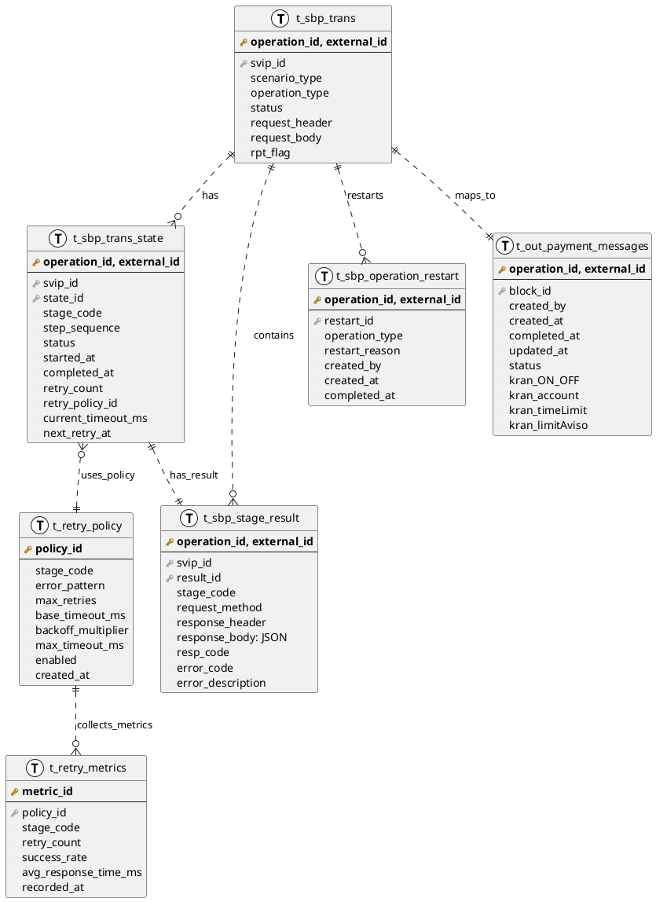

# Исправление XML-ответа для операции

## 👤 **Kirill**

Исправь ответ (параметры operation те же):
Пример запроса
<?xml version="1.0" encoding="UTF-8"?>
<clearing xmlns="http://bp.ru/XP/clearing">
    <file_type>FLTP1700</file_type>
    <operation>
        <oper_type>OPTP5001</oper_type>	                <!-- Set account balance -->
        <msg_type>MSGTPRES</msg_type>
        <sttl_type>STTT0010</sttl_type>
        <oper_date>2012-10-10T14:23:47</oper_date>
        <host_date>2012-10-10T14:25:31</host_date>
        <oper_amount>
            <amount_value>150000</amount_value>        <!-- Current balance amount -->
            <currency>840</currency>
        </oper_amount>
        <oper_reason>BLTP0001</oper_reason>             <!-- Balance type - Ledger balance (Own funds) -->
        <issuer>
            <client_id_type>CITPACCT</client_id_type>
            <client_id_value>40817810010000364783</client_id_value>
            <inst_id>1001</inst_id>
            <network_id>1001</network_id>
        </issuer>
    </operation>
    </clearing>
 
 
Пример ответа
<operationResponse xmlns="http://bp.ru/XP/clearing">
 
<operation>
    <oper_id>2505290025766088</oper_id>
    <status>OPST0600</status>
    <reference_number>121888</reference_number>
</operation>

---

## 🤖 **DeepSeek**

<?xml version="1.0" encoding="UTF-8"?>
<clearing xmlns="http://bp.ru/XP/clearing">
    <file_type>FLTP1700</file_type>
    <operation>
        <oper_type>OPTP5001</oper_type>
        <msg_type>MSGTPRES</msg_type>
        <sttl_type>STTT0010</sttl_type>
        <oper_date>2012-10-10T14:23:47</oper_date>
        <host_date>2012-10-10T14:25:31</host_date>
        <oper_amount>
            <amount_value>150000</amount_value>
            <currency>840</currency>
        </oper_amount>
        <oper_reason>BLTP0001</oper_reason>
        <issuer>
            <client_id_type>CITPACCT</client_id_type>
            <client_id_value>40817810010000364783</client_id_value>
            <inst_id>1001</inst_id>
            <network_id>1001</network_id>
        </issuer>
    </operation>
</clearing>

---

## 👤 **Kirill**

Переименуй каждый шаг процесса для хранения в БД (без префиксов, кратко) 
Шаг процесса
 
Запрос на проверку возможнотси проведения операции
Проверка подписи и полномочий
Запись пары
 
Запрос на проверку возможнотси проведения операции в Шлюз СБП
Запрос скоринга
Запрос скоринга в Антифрод
Ответ от Антифрода
Ответ на запрос скоринга
Ответ на запрос проверки возможности проведения операции
Ответ на запрос проверки возможности проведения операции
 
Запрос на выполнение операции
Асинхронный ответ «Processing»
Проверка подписи и полномочий
Контроль реквизитов Антифрод
Ответ Антифрода
Контроль реквизитов Финмониторинг
Ответ Финмониторинга
 
Проверка режима
Постановка операций на паузу
Чтение очереди АБС
Запрос записи баланса
Результат записи баланса 
Ответ о смене режима
 
Запрос выполнения операции
Ответ с результатом выполнения
Запрос отмены операции B2C 
Ответ с результатом выполнения
 
Контроль доступного остатка
Ответ с подтверждением доступного остатка
 
Запрос на проведение операции в шлюз СБП
Ответ на выполнение операции
Получение callback
 
Запрос статуса операции
Статус операции
 
Уведомление об успешной операции
Callback по операции
Уведомление об успешной операции
 
Формирование camt
Отправка camt в ЭДО

---

## 🤖 **DeepSeek**

Отлично, вот переименованные шаги процесса в краткой форме без префиксов:

1.  Проверка возможности операции
2.  Проверка подписи и полномочий
3.  Запись пары
4.  Проверка возможности в шлюзе
5.  Запрос скоринга
6.  Запрос в антифрод
7.  Ответ антифрода
8.  Ответ скоринга
9.  Ответ проверки возможности
10. Запрос на выполнение
11. Уведомление о обработке
12. Проверка подписи и полномочий
13. Контроль антифрода
14. Ответ антифрода
15. Контроль финмониторинга
16. Ответ финмониторинга
17. Проверка режима
18. Постановка на паузу
19. Чтение очереди АБС
20. Запрос записи баланса
21. Результат записи баланса
22. Ответ о смене режима
23. Запрос выполнения
24. Результат выполнения
25. Запрос отмены
26. Результат отмены
27. Контроль остатка
28. Подтверждение остатка
29. Запрос проведения в шлюз
30. Ответ выполнения из шлюза
31. Получение callback
32. Запрос статуса
33. Статус операции
34. Уведомление об успехе
35. Callback операции
36. Уведомление об успехе
37. Формирование camt
38. Отправка camt в ЭДО

---

## 👤 **Kirill**

а теперь на латинице в camelcase и с нижним подчеркиванием

---

## 🤖 **DeepSeek**

Конечно, вот варианты на латинице в camelCase и snake_case:

### camelCase
1.  operationFeasibilityCheck
2.  signatureAndAuthorityVerification
3.  pairRecording
4.  gatewayFeasibilityCheck
5.  scoringRequest
6.  antifraudRequest
7.  antifraudResponse
8.  scoringResponse
9.  feasibilityCheckResponse
10. operationExecutionRequest
11. processingNotification
12. signatureAndAuthorityVerification
13. antifraudControl
14. antifraudResponse
15. financialMonitoringControl
16. financialMonitoringResponse
17. modeCheck
18. operationPausing
19. absQueueReading
20. balanceWriteRequest
21. balanceWriteResult
22. modeChangeResponse
23. executionRequest
24. executionResult
25. cancellationRequest
26. cancellationResult
27. balanceControl
28. balanceConfirmation
29. gatewayProcessingRequest
30. gatewayExecutionResponse
31. callbackReceiving
32. statusRequest
33. operationStatus
34. successNotification
35. operationCallback
36. successNotification
37. camtGeneration
38. camtDispatch

### snake_case
1.  operation_feasibility_check
2.  signature_and_authority_verification
3.  pair_recording
4.  gateway_feasibility_check
5.  scoring_request
6.  antifraud_request
7.  antifraud_response
8.  scoring_response
9.  feasibility_check_response
10. operation_execution_request
11. processing_notification
12. signature_and_authority_verification
13. antifraud_control
14. antifraud_response
15. financial_monitoring_control
16. financial_monitoring_response
17. mode_check
18. operation_pausing
19. abs_queue_reading
20. balance_write_request
21. balance_write_result
22. mode_change_response
23. execution_request
24. execution_result
25. cancellation_request
26. cancellation_result
27. balance_control
28. balance_confirmation
29. gateway_processing_request
30. gateway_execution_response
31. callback_receiving
32. status_request
33. operation_status
34. success_notification
35. operation_callback
36. success_notification
37. camt_generation
38. camt_dispatch

---

## 👤 **Kirill**

Для каждого шага процесса опиши алгоритм перезапуска неуспешных шагов в указанном формате (В документе - Пример описания). Схема БД для реализации алгоритма тоже в документе (Схема БД).

---

## 🤖 **DeepSeek**

Отлично, я проанализировал ваш документ и схему БД. На основе предоставленного примера я опишу алгоритмы перезапуска для каждого шага процесса в едином формате.

### **Алгоритмы перезапуска неуспешных шагов процесса**

---

**1. Шаг: `operation_feasibility_check` (Запрос на проверку возможности проведения операции)**

| Шаг процесса | Сценарий\Тип ошибки | Реакция системы | Алгоритм обработки |
| :--- | :--- | :--- | :--- |
| `operation_feasibility_check` | Получен повторный запрос с одинаковым `operation_id` | Возврат предыдущего ответа или повторная проверка | **Таблицы:** `t_sbp_trans`, `t_sbp_stage_result`<br><br>**Алгоритм:**<br>1. Найти запись в `t_sbp_trans` и `t_sbp_stage_result` по `operation_id` из запроса, где `stage_code = 'operation_feasibility_check'`.<br>2. **Если** запись найдена и `t_sbp_stage_result.resp_code = 200` (успех), то вернуть сохраненный успешный ответ из `t_sbp_stage_result.response_body`.<br>3. **Если** запись не найдена или `resp_code != 200`, инициировать новую проверку возможности операции. |

---

**2. Шаг: `signature_and_authority_verification` (Проверка подписи и полномочий)**

| Шаг процесса | Сценарий\Тип ошибки | Реакция системы | Алгоритм обработки |
| :--- | :--- | :--- | :--- |
| `signature_and_authority_verification` | Ошибка проверки подписи (`error_code = 403`) | Отказ в операции | **Таблицы:** `t_sbp_trans`, `t_sbp_trans_state`, `t_sbp_stage_result`<br><br>**Алгоритм:**<br>1. **Если** `t_sbp_stage_result.stage_code = 'signature_and_authority_verification'` и `error_code = 403`, перезапуск не выполняется. Операция переводится в статус `FAILED` в `t_sbp_trans.status`.<br>2. **Если** ошибка техническая (`error_code = 500, 503`), увеличить `retry_count` в `t_sbp_trans_state`. При превышении лимита - остановка, иначе - повторная проверка подписи. |

---

**3. Шаг: `gateway_feasibility_check` (Запрос на проверку возможности проведения операции в Шлюз СБП)**

| Шаг процесса | Сценарий\Тип ошибки | Реакция системы | Алгоритм обработки |
| :--- | :--- | :--- | :--- |
| `gateway_feasibility_check` | Не получен ответ от шлюза (таймаут, `error_code = 5xx`) | Повторный запрос в шлюз СБП | **Таблицы:** `t_sbp_trans`, `t_sbp_trans_state`, `t_sbp_stage_result`<br><br>**Алгоритм:**<br>1. **Если** `t_sbp_stage_result.stage_code = 'gateway_feasibility_check'` и `error_code != 422` (логическая ошибка), и `retry_count` в `t_sbp_trans_state` не превышен, то выполнить повторный запрос (retry).<br>2. **Если** `retry_count` превышен, операция переводится в статус `FAILED`. |

---

**4. Шаг: `scoring_request` (Запрос скоринга)**

| Шаг процесса | Сценарий\Тип ошибки | Реакция системы | Алгоритм обработки |
| :--- | :--- | :--- | :--- |
| `scoring_request` | Ошибка связи с сервисом скоринга | Повторный запрос | **Таблицы:** `t_sbp_trans_state`, `t_sbp_stage_result`<br><br>**Алгоритм:**<br>1. **Если** `stage_code = 'scoring_request'` и `error_code` указывает на сетевую ошибку, система проверяет `retry_count`.<br>2. При превышении лимита попыток операция останавливается. Иначе - повторный запрос с инкрементом `retry_count`. |

---

**5. Шаг: `balance_write_request` (Запрос записи баланса)**

| Шаг процесса | Сценарий\Тип ошибки | Реакция системы | Алгоритм обработки |
| :--- | :--- | :--- | :--- |
| `balance_write_request` | Ошибка при обращении к АБС | Повторный запрос к АБС или откат | **Таблицы:** `t_sbp_trans_state`, `t_sbp_stage_result`, `t_out_payment_messages`<br><br>**Алгоритм:**<br>1. **Если** `stage_code = 'balance_write_request'` и операция в `t_out_payment_messages.status = 'FAILED'` из-за технической ошибки АБС, выполнить повторный запрос на запись.<br>2. **Если** после N попыток запись не удалась, инициировать процесс отката (компенсирующей операции) через `t_sbp_operation_restart`. |

---

**6. Шаг: `gateway_processing_request` (Запрос на проведение операции в шлюз СБП)**

| Шаг процесса | Сценарий\Тип ошибки | Реакция системы | Алгоритм обработки |
| :--- | :--- | :--- | :--- |
| `gateway_processing_request` | Шлюз СБП вернул ошибку `500 Internal Server Error` | Повторный запрос на проведение | **Таблицы:** `t_sbp_trans`, `t_sbp_trans_state`, `t_sbp_stage_result`<br><br>**Алгоритм:**<br>1. **Если** `stage_code = 'gateway_processing_request'` и `error_code = 500` (или другой повторяемой ошибки), проверить `retry_count`.<br>2. Пока `retry_count` не превышен, выполнять повторные попытки отправки запроса в шлюз.<br>3. После успешной отправки обновить `t_sbp_trans.status` на `PROCESSING`. |

---

**7. Шаг: `camt_generation` (Формирование camt)**

| Шаг процесса | Сценарий\Тип ошибки | Реакция системы | Алгоритм обработки |
| :--- | :--- | :--- | :--- |
| `camt_generation` | Ошибка генерации CAMT-файла (невалидные данные, ошибка шаблона) | Повторная попытка генерации или эскалация | **Таблицы:** `t_sbp_stage_result`<br><br>**Алгоритм:**<br>1. **Если** `stage_code = 'camt_generation'` и `error_code` указывает на ошибку данных, перезапуск не помогает. Требуется вмешательство для исправления данных.<br>2. **Если** ошибка временная (например, недоступен сервис шаблонов), выполнить повторные попытки с увеличением `retry_count` в `t_sbp_trans_state`. |

**Общий механизм перезапуска всей операции** реализуется через таблицу `t_sbp_operation_restart`. При необходимости перезапуска операции с самого начала или с определенного шага в нее заносится новая запись с `restart_reason`. Процесс-оркестратор, обнаруживая такую запись, выполняет операцию заново, начиная с шага, указанного в `restart_reason`.

---

## 👤 **Kirill**

Давай по одному шагу описывать:
antifraudResponse 
Сценарий - нет ответа

---

## 🤖 **DeepSeek**

**Шаг: `antifraud_response` (Ответ от Антифрода)**

| Шаг процесса | Сценарий\Тип ошибки | Реакция системы | Алгоритм обработки |
| :--- | :--- | :--- | :--- |
| `antifraud_response` | Не получен ответ от Антифрода (таймаут, сетевой сбой) | Повторный опрос статуса или повторная отправка запроса | **Таблицы:** `t_sbp_trans`, `t_sbp_trans_state`, `t_sbp_stage_result`<br><br>**Алгоритм:**<br>1. **Если** `t_sbp_stage_result.stage_code = 'antifraud_request'` и `response_body` пустой/отсутствует в течение заданного таймаута, проверяем `retry_count` в `t_sbp_trans_state`.<br>2. **Пока** `retry_count < MAX_RETRIES`:<br>   - Увеличить `retry_count` на 1<br>   - Выполнить повторный запрос статуса в Антифрод (`request_method = GET`) или повторную отправку исходного запроса (`request_method = POST`)<br>   - Обновить `t_sbp_stage_result.response_body`, `resp_code`, `error_code`<br>3. **Если** `retry_count >= MAX_RETRIES`:<br>   - Установить `t_sbp_trans.status = 'FAILED'`<br>   - Записать `error_code = 408` (Timeout) в `t_sbp_stage_result`<br>   - Записать причину остановки в `t_sbp_operation_restart.restart_reason` |

---

## 👤 **Kirill**

учти что с антифрод взаимодействие через kafka

---

## 🤖 **DeepSeek**

**Шаг: `antifraud_response` (Ответ от Антифрода)**

| Шаг процесса | Сценарий\Тип ошибки | Реакция системы | Алгоритм обработки |
| :--- | :--- | :--- | :--- |
| `antifraud_response` | Не получен ответ от Антифрода в Kafka (таймаут ожидания сообщения) | Повторная отправка запроса в Kafka и/или переход к запасной логике | **Таблицы:** `t_sbp_trans`, `t_sbp_trans_state`, `t_sbp_stage_result`<br><br>**Алгоритм:**<br>1. **Если** после отправки сообщения в топик Kafka `antifraud.request` в `t_sbp_stage_result` (`stage_code = 'antifraud_request'`) не получен ответ в топике `antifraud.response` в течение заданного таймаута:<br>   - Проверить `retry_count` в `t_sbp_trans_state` для этого `stage_code`.<br><br>2. **Если** `retry_count < MAX_RETRIES`:<br>   - Увеличить `retry_count` на 1.<br>   - Повторно отправить исходный запрос в топик `antifraud.request`.<br>   - Сбросить таймер ожидания ответа.<br><br>3. **Если** `retry_count >= MAX_RETRIES`:<br>   - **Вариант А (Консервативный):** Записать `error_code = 'ANTIFRAUD_UNAVAILABLE'`, перевести операцию в статус `FAILED` в `t_sbp_trans.status`.<br>   - **Вариант Б (Оптимистичный):** Записать `error_code = 'ANTIFRAUD_TIMEOUT'` и перейти к следующему шагу (`financial_monitoring_control`), отметив проверку антифрода как пропущенную due to technical reasons. Финальное решение по операции принимается на последующих шагах.<br>   - Записать причину в `t_sbp_operation_restart.restart_reason` для возможного ручного перезапуска. |

---

## 👤 **Kirill**

в процессе есть ошибки таймаута. Как учесть параметры таймаута в БД? Что касается retry_count. Сейчас есть 2 фискированных сценариев retry. Как можно задавать гибкую настройку через скрипт в БД, чтобы увеличиывать количество попыток, время и интервалы?

---

## 🤖 **DeepSeek**

Отличный вопрос! Вот как можно реализовать гибкую систему управления таймаутами и повторными попытками через БД.

### **1. Новая таблица для конфигурации повторных попыток**

```sql
CREATE TABLE t_retry_policy (
    policy_id VARCHAR(50) PRIMARY KEY,
    stage_code VARCHAR(100) NOT NULL,           -- Код этапа (antifraud_request, gateway_feasibility_check, etc)
    error_pattern VARCHAR(100) NOT NULL,        -- Паттерн ошибки (TIMEOUT, 5xx, NETWORK_ERROR, etc)
    max_retries INTEGER DEFAULT 3,
    base_timeout_ms INTEGER DEFAULT 30000,      -- Базовый таймаут
    backoff_multiplier DECIMAL(3,2) DEFAULT 1.5, -- Множитель для exponential backoff
    max_timeout_ms INTEGER DEFAULT 300000,      -- Максимальный таймаут
    enabled BOOLEAN DEFAULT true,
    created_at TIMESTAMP DEFAULT CURRENT_TIMESTAMP
);
```

### **2. Примеры конфигураций**

```sql
-- Для антифрода через Kafka
INSERT INTO t_retry_policy (policy_id, stage_code, error_pattern, max_retries, base_timeout_ms, backoff_multiplier, max_timeout_ms) 
VALUES 
('antifraud_kafka_timeout', 'antifraud_request', 'TIMEOUT', 5, 60000, 2.0, 300000),
('antifraud_kafka_network', 'antifraud_request', 'NETWORK_ERROR', 3, 30000, 1.5, 120000);

-- Для шлюза СБП
INSERT INTO t_retry_policy (policy_id, stage_code, error_pattern, max_retries, base_timeout_ms, backoff_multiplier, max_timeout_ms)
VALUES
('gateway_timeout', 'gateway_feasibility_check', 'TIMEOUT', 4, 45000, 1.8, 240000),
('gateway_5xx', 'gateway_processing_request', '5xx', 3, 30000, 1.5, 180000);
```

### **3. Модифицированная таблица состояния с учетом политик**

```sql
ALTER TABLE t_sbp_trans_state ADD COLUMN retry_policy_id VARCHAR(50);
ALTER TABLE t_sbp_trans_state ADD COLUMN current_timeout_ms INTEGER;
ALTER TABLE t_sbp_trans_state ADD COLUMN next_retry_at TIMESTAMP;
```

### **4. Обновленный алгоритм для `antifraud_response` с учетом политик**

| Шаг процесса | Сценарий\Тип ошибки | Реакция системы | Алгоритм обработки |
| :--- | :--- | :--- | :--- |
| `antifraud_response` | Таймаут ожидания ответа в Kafka | Повтор по гибкой политике с exponential backoff | **Таблицы:** `t_sbp_trans`, `t_sbp_trans_state`, `t_sbp_stage_result`, `t_retry_policy`<br><br>**Алгоритм:**<br>1. **При таймауте:** Найти активную политику в `t_retry_policy` для `stage_code = 'antifraud_request'` и `error_pattern = 'TIMEOUT'`.<br>2. **Если** `retry_count < max_retries` из политики:<br>   - Рассчитать новый таймаут: `timeout = LEAST(base_timeout_ms * (backoff_multiplier ^ retry_count), max_timeout_ms)`<br>   - Установить `next_retry_at = NOW() + (timeout / 1000)`<br>   - Увеличить `retry_count` на 1<br>   - Обновить `current_timeout_ms`<br>3. **Если** `retry_count >= max_retries`: Перейти к запасной логике (FAILED или skip) |

### **5. SQL-скрипт для применения политик**

```sql
-- Функция для получения параметров повторной попытки
CREATE OR REPLACE FUNCTION get_retry_params(
    p_stage_code VARCHAR, 
    p_error_code VARCHAR,
    p_current_retry_count INTEGER
) RETURNS TABLE (
    should_retry BOOLEAN,
    timeout_ms INTEGER,
    next_retry_delay_ms INTEGER
) AS $$
BEGIN
    RETURN QUERY
    SELECT 
        rp.max_retries > p_current_retry_count AND rp.enabled as should_retry,
        rp.base_timeout_ms as timeout_ms,
        CAST(rp.base_timeout_ms * POWER(rp.backoff_multiplier, p_current_retry_count) as INTEGER) as next_retry_delay_ms
    FROM t_retry_policy rp
    WHERE rp.stage_code = p_stage_code 
        AND (rp.error_pattern = p_error_code OR rp.error_pattern = 'ANY')
        AND rp.enabled = true
    ORDER BY rp.error_pattern DESC -- Приоритет у конкретных ошибок над 'ANY'
    LIMIT 1;
END;
$$ LANGUAGE plpgsql;
```

### **6. Пример использования в процессе**

```sql
-- В коде обработки таймаута антифрода:
SELECT * FROM get_retry_params('antifraud_request', 'TIMEOUT', 2);

-- Результат: 
-- should_retry | timeout_ms | next_retry_delay_ms
-- true         | 60000      | 240000  (60000 * 2.0^2)
```

### **7. Мониторинг и адаптация**

```sql
-- Таблица для сбора статистики по повторным попыткам
CREATE TABLE t_retry_metrics (
    metric_id SERIAL PRIMARY KEY,
    policy_id VARCHAR(50) NOT NULL,
    stage_code VARCHAR(100) NOT NULL,
    retry_count INTEGER NOT NULL,
    success_rate DECIMAL(5,4), -- Процент успешных попыток
    avg_response_time_ms INTEGER,
    recorded_at TIMESTAMP DEFAULT CURRENT_TIMESTAMP
);
```

Такая система позволяет:
- **Гибко настраивать** параметры для каждого этапа и типа ошибки
- **Применять exponential backoff** для избежания лавинообразной нагрузки
- **Динамически изменять** политики без изменения кода
- **Собирать метрики** для оптимизации параметров
- **A/B тестировать** разные стратегии повторных попыток

---

## 👤 **Kirill**

сделай матрицу связей между таблицами

---

## 🤖 **DeepSeek**

### **Матрица связей между таблицами**

| Таблица | Связь с | Тип связи | Ключи связи | Назначение |
|---------|---------|-----------|-------------|------------|
| **t_sbp_trans** | **t_sbp_trans_state** | One-to-Many | `operation_id, external_id` → `operation_id, external_id` | Основная транзакция → состояния этапов |
| **t_sbp_trans** | **t_sbp_stage_result** | One-to-Many | `operation_id, external_id` → `operation_id, external_id` | Основная транзакция → результаты этапов |
| **t_sbp_trans** | **t_sbp_operation_restart** | One-to-Many | `operation_id, external_id` → `operation_id, external_id` | Основная транзакция → история перезапусков |
| **t_sbp_trans** | **t_out_payment_messages** | One-to-One | `operation_id, external_id` → `operation_id, external_id` | Транзакция → платежные инструкции АБС |
| **t_sbp_trans_state** | **t_retry_policy** | Many-to-One | `retry_policy_id` → `policy_id` | Состояние этапа → политика повторных попыток |
| **t_sbp_trans_state** | **t_sbp_stage_result** | One-to-One | `operation_id, external_id, stage_code` → `operation_id, external_id, stage_code` | Состояние этапа → результат этапа |
| **t_retry_policy** | **t_retry_metrics** | One-to-Many | `policy_id` → `policy_id` | Политика → метрики эффективности |

---

### **Диаграмма связей в PlantUML**



---

### **Описание ключевых связей**

**1. Ядро транзакции:**
- `t_sbp_trans` - центральная таблица, содержащая основную информацию о транзакции
- Связана с 4 таблицами через композитный ключ `(operation_id, external_id)`

**2. Жизненный цикл операции:**
- `t_sbp_trans_state` - отслеживает состояние каждого этапа обработки
- `t_sbp_stage_result` - хранит детальные результаты выполнения этапов
- `t_sbp_operation_restart` - управляет перезапусками операций

**3. Интеграции:**
- `t_out_payment_messages` - связь с АБС для платежных операций
- `t_retry_policy` - гибкое управление повторными попытками для всех этапов

**4. Мониторинг и аналитика:**
- `t_retry_metrics` - сбор статистики для оптимизации политик повторных попыток

Все связи обеспечивают целостность данных и позволяют отслеживать полный жизненный цикл операции от начала до завершения.

---

