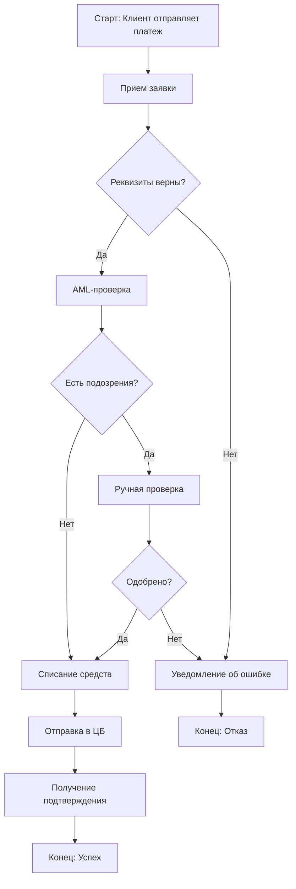

# Как работает картотека платежей

## 👤 **Kirill**

как работает картотека платежей в процессинговых системах или АБС?

---

## 🤖 **DeepSeek**

Картотека платежей в процессинговых системах или автоматизированных банковских системах (АБС) — это база данных, которая хранит информацию о платежных операциях, их статусах и параметрах. Она обеспечивает контроль, учет и обработку транзакций.  

### **Как работает картотека платежей?**  
1. **Сбор данных**  
   - В картотеку попадают все платежные операции: входящие, исходящие, внутренние переводы, платежи по картам, межбанковские операции и т. д.  
   - Данные могут поступать из разных источников: клиентские платежи (через интернет-банк, терминалы), межбанковские системы (SWIFT, SEPA, СПФС), карточные платежи (Visa/Mastercard) и др.  

2. **Хранение и классификация**  
   - Каждая операция записывается с набором реквизитов:  
     - Номер платежа (уникальный идентификатор)  
     - Сумма и валюта  
     - Отправитель и получатель (реквизиты счетов, БИК, ИНН и т. д.)  
     - Дата и время операции  
     - Статус (новый, проведен, отклонен, ожидает подтверждения)  
     - Код операции (тип платежа: перевод, оплата услуг, зарплата и т. д.)  
   - Платежи могут группироваться по:  
     - Статусу (например, "ожидающие обработки")  
     - Типу (межбанковские, внутрибанковские)  
     - Срочности (обычные, срочные)  

3. **Обработка платежей**  
   - **Автоматическая проверка** (валидация реквизитов, проверка лимитов, AML-фильтры)  
   - **Ручная обработка** (если требуется подтверждение оператором)  
   - **Проведение платежа** (списание/зачисление средств, формирование проводок)  
   - **Отправка в ЦБ или другие банки** (через платежные системы)  

4. **Контроль и мониторинг**  
   - Отслеживание "зависших" платежей (например, если не хватает средств или нет ответа от другого банка)  
   - Возможность ручной коррекции или отзыва платежа  
   - Формирование отчетов (например, сколько платежей за день, сколько отклонено и почему)  

5. **Архивация и поиск**  
   - После обработки платежи перемещаются в архив, но остаются доступными для поиска (например, по номеру, дате, контрагенту).  
   - В некоторых системах данные синхронизируются с бухгалтерией и CRM.  

### **Где используется?**  
- **В процессинге карт** – хранение транзакций по картам, сверка с эквайером.  
- **В АБС банка** – учет всех платежей клиентов и межбанковских операций.  
- **В платежных шлюзах** – контроль статусов транзакций (например, успешные/неуспешные оплаты).  

### **Пример работы**  
1. Клиент отправляет платеж через мобильный банк → платеж попадает в картотеку со статусом "новый".  
2. Система проверяет реквизиты и остаток на счете → если всё в порядке, статус меняется на "проведен".  
3. Платеж отправляется в ЦБ или другой банк → статус "исполнен".  
4. Если получатель не найден → статус "отклонен", клиент получает уведомление.  

Таким образом, картотека платежей — это ключевой инструмент для управления финансовыми потоками в банках и процессинговых компаниях.

---

## 👤 **Kirill**

в чем отличие остатков по счетам и баланса?

---

## 🤖 **DeepSeek**

**Остатки по счетам** и **баланс** — это связанные, но разные понятия в бухгалтерском учете и банковских системах (АБС). Разберем их отличия.  

---

### **1. Остатки по счетам**  
Это **текущие суммы денежных средств** на конкретных счетах (банковских, бухгалтерских) на определенный момент времени.  

#### **Характеристики:**  
- **Рассчитывается для каждого счета отдельно** (например, расчетный счет компании, карточный счет клиента, корреспондентский счет банка).  
- **Может быть:**  
  - **Дебетовый остаток** — если на счете есть средства (актив).  
  - **Кредитовый остаток** — если счет имеет отрицательный баланс (например, овердрафт или пассивный счет в бухучете).  
- **Динамический показатель** — меняется после каждой операции (списание, зачисление).  
- **Используется для:**  
  - Контроля ликвидности (например, сколько денег у клиента на счете).  
  - Проведения платежей (есть ли достаточный остаток).  

#### **Пример:**  
- На расчетном счете компании — 500 000 ₽ (дебетовый остаток).  
- По кредитной карте клиента — -50 000 ₽ (кредитовый остаток, долг).  

---

### **2. Баланс**  
Это **сводный финансовый отчет**, который отражает **состояние активов и пассивов** организации (банка, компании) на определенную дату.  

#### **Характеристики:**  
- **Состоит из двух частей:**  
  - **Активы** (что принадлежит организации: деньги, имущество, дебиторская задолженность).  
  - **Пассивы** (за счет чего формируются активы: капитал, кредиты, кредиторская задолженность).  
- **Баланс всегда сходится:** **Активы = Пассивы**.  
- **Статический показатель** — формируется на конкретную дату (например, конец дня, месяца, года).  
- **Используется для:**  
  - Финансового анализа (платежеспособность, устойчивость бизнеса).  
  - Отчетности (перед ЦБ, налоговой, акционерами).  

#### **Пример баланса банка:**  
| **Активы**          | **Сумма** | **Пассивы**         | **Сумма** |
|----------------------|----------|----------------------|----------|
| Деньги в кассе       | 10 млн ₽ | Вклады клиентов      | 100 млн ₽ |
| Кредиты выданные     | 80 млн ₽ | Заемные средства (ЦБ)| 20 млн ₽ |
| Инвестиции           | 30 млн ₽ | Собственный капитал  | 10 млн ₽ |
| **Итого активы:**    | **120 млн ₽** | **Итого пассивы:** | **120 млн ₽** |

---

### **Ключевые отличия**  
| **Критерий**       | **Остатки по счетам**            | **Баланс**                     |
|--------------------|----------------------------------|--------------------------------|
| **Уровень детализации** | По каждому счету отдельно     | Сводный отчет по всем счетам   |
| **Динамика**       | Меняется после каждой операции  | Фиксируется на определенную дату |
| **Назначение**     | Оперативный учет денежных потоков | Финансовая отчетность и анализ |
| **Пример**         | "На счете 40702 — 1 млн ₽"      | "Активы банка — 500 млн ₽"     |

---

### **Как они связаны?**  
- **Остатки по счетам** — это "кирпичики", из которых строится **баланс**.  
- В банковских системах (АБС) остатки автоматически агрегируются в балансовые отчеты.  
- Например:  
  - Остатки на расчетных счетах клиентов → попадают в пассивы банка (обязательства перед клиентами).  
  - Остатки на корсчетах банка → относятся к активам (деньги в других банках).  

**Вывод:**  
- **Остаток** — это конкретная сумма на одном счете.  
- **Баланс** — это общая картина финансового состояния, куда входят все остатки.

---

## 👤 **Kirill**

обязательно ли в системе, которая обрабатывает платежи вести остатки по счетам или например может быть общий лимит по операциям и все платежи поступившие в рамках операционного дня будут изменять этот лимит в большую или меньшую сторону в зависимости от оепрации списания или зачисления?

---

## 🤖 **DeepSeek**

В системе обработки платежей **не обязательно вести остатки по каждому счету**, если бизнес-логика допускает работу с **общим лимитом операций**. Такой подход иногда применяется, но у него есть особенности, преимущества и ограничения.  

---

## **1. Варианты учета платежей: остатки vs. общий лимит**  

### **🔹 Вариант 1: Традиционный учет по остаткам на счетах**  
- Каждому клиенту/счету присваивается **персональный баланс**.  
- Платежи проверяются на достаточность средств **индивидуально**.  
- **Пример:** Банковские системы (АБС), корпоративные казначейства.  

**Плюсы:**  
✅ Точный контроль средств каждого клиента.  
✅ Возможность частичных платежей (если не хватает полной суммы).  
✅ Подходит для систем с большим количеством транзакций.  

**Минусы:**  
❌ Требуется больше вычислительных ресурсов (хранить и обновлять остатки).  
❌ Сложнее управлять ликвидностью на уровне всей системы.  

---

### **🔹 Вариант 2: Работа с общим лимитом (пулом средств)**  
- Вместо персональных остатков используется **единый лимит** (например, дневной, месячный).  
- Все платежи списываются из этого лимита, а зачисления — увеличивают его.  
- **Пример:**  
  - Платежные шлюзы с суточным лимитом.  
  - Корпоративные карты с общим бюджетом на отдел.  
  - Предоплаченные системы (например, виртуальные кошельки с общим балансом).  

**Плюсы:**  
✅ Проще в реализации (не нужно хранить остатки по каждому клиенту).  
✅ Удобно для **предоплаченных сервисов** (например, "общий кошелек" для выплат).  
✅ Легче контролировать **риски** (например, ограничить общий отток средств за день).  

**Минусы:**  
❌ Невозможно проверить **индивидуальную платежеспособность** (если у клиента нет своих денег, но система разрешает платеж за счет общего лимита).  
❌ Сложно возвращать средства при ошибках (нет привязки к конкретному счету).  
❌ Менее прозрачно для клиентов (не видят свой личный баланс).  

---

## **2. Когда можно использовать общий лимит вместо остатков?**  
Такой подход подходит для:  
- **Платежных агрегаторов** (если важно ограничить общий объем операций, а не контролировать каждый счет).  
- **Корпоративных карт** (общий бюджет на команду, а не персональные лимиты).  
- **Закрытых платежных систем** (например, внутренние транзакции между подразделениями компании).  
- **Предоплаченных сервисов** (например, виртуальные кошельки с общим балансом).  

Но **не подходит** для:  
- Банковских счетов (требуется индивидуальный учет по ПБУ, ФЗ "О банках").  
- Систем с требованием **персональной финансовой отчетности** (например, ФНС может запросить остатки по каждому клиенту).  

---

## **3. Техническая реализация**  
### **Схема с общим лимитом:**  
1. У системы есть **мастер-баланс** (например, 10 млн ₽ на день).  
2. Каждый платеж уменьшает лимит, а зачисления — увеличивают.  
3. Если лимит исчерпан, новые платежи отклоняются (или ставятся в очередь).  

**Пример SQL-подобной логики:**  
```sql
-- Проверка лимита перед платежом
IF (SELECT daily_limit FROM system_limits) >= payment_amount THEN
    UPDATE system_limits SET daily_limit = daily_limit - payment_amount;
    EXECUTE payment;
ELSE
    REJECT payment;
END IF;
```

### **Гибридный вариант (остатки + лимиты)**  
Можно комбинировать оба подхода:  
- Основные средства учитываются **на счетах клиентов**.  
- Но дополнительно есть **общий лимит на риск** (например, не более 100 млн ₽ списаний в день).  

---

## **Вывод**  
- **Можно** обойтись без остатков по счетам, если бизнес-модель позволяет работать с **общим лимитом**.  
- Такой подход **проще в разработке**, но **менее гибок** и не подходит для регулируемых финансовых систем (банки, НПС).  
- В большинстве случаев **лучше использовать остатки**, чтобы обеспечить прозрачность и соответствие стандартам.  

Если ваша система — **не банковская** (например, внутренние переводы или агрегатор платежей), вариант с лимитом может быть удобным решением.

---

## 👤 **Kirill**

как концептуально набрасывать процесс to be в нотации bpmn на встрече с заказчиком

---

## 🤖 **DeepSeek**

Набросок процесса **To-Be** в нотации **BPMN** на встрече с заказчиком — это быстрый способ визуализировать будущий процесс, согласовать его логику и выявить спорные моменты. Вот пошаговый подход, как это сделать эффективно.  

---

## **1. Подготовка перед встречей**  
Перед сессией с заказчиком:  
✅ **Поймите текущий процесс (As-Is)** – если он есть, чтобы отталкиваться от проблем.  
✅ **Определите цель To-Be** – оптимизация скорости, снижение ошибок, автоматизация.  
✅ **Заранее набросайте ключевые шаги** – но без деталей, чтобы не тратить время встречи на рисование.  

---

## **2. Инструменты для быстрого моделирования**  
Используйте простые инструменты, которые позволяют рисовать **в реальном времени**:  
- **Доска (Miro, Lucidchart, draw.io)** – для интерактивного построения.  
- **Стикеры + флипчарт** – если встреча офлайн.  
- **BPMN-редакторы (Camunda Modeler, Bizagi)** – если заказчик понимает нотацию.  

> ⚠️ Не углубляйтесь в детали BPMN (например, типы шлюзов) – рисуйте упрощенно.  

---

## **3. Пошаговый процесс наброска To-Be**  

### **🔹 Шаг 1: Определите старт и конец**  
- Начните с **Стартового события** (например, "Клиент отправляет платеж").  
- Обозначьте **Конечное событие** (например, "Деньги зачислены", "Платеж отклонен").  

### **🔹 Шаг 2: Выделите основные этапы (Действия)**  
Разбейте процесс на **5–7 ключевых шагов**, например:  
1. **Прием платежа** (из API, файла, интерфейса).  
2. **Проверка данных** (валидация реквизитов).  
3. **AML-проверка** (если требуется).  
4. **Списание средств** (блокировка суммы).  
5. **Отправка в ЦБ/другой банк**.  
6. **Подтверждение исполнения**.  

### **🔹 Шаг 3: Добавьте ветвления (Шлюзы)**  
- **Исключительные сценарии** (например, "Реквизиты неверны?" → Да/Нет).  
- **Параллельные процессы** (если проверки идут одновременно).  

Пример:  
```
[Старт] → [Прием платежа] → [Проверка данных?]  
   → Да → [AML-проверка] → [Списание] → ...  
   → Нет → [Уведомить об ошибке] → [Конец]  
```

### **🔹 Шаг 4: Обозначьте роли (Дорожки / Swimlanes)**  
Если в процессе участвуют **разные системы или отделы**, выделите их:  
```
| Бэк-офис | → Проверяет платеж →  
| Платежная система | → Отправляет в ЦБ →  
```

### **🔹 Шаг 5: Фиксируйте вопросы и спорные моменты**  
- Если заказчик говорит: *"А вот здесь у нас есть дополнительная ручная проверка"* – помечайте это как **"Точка согласования"**.  
- Не пытайтесь сразу доработать – просто зафиксируйте и двигайтесь дальше.  

---

## **4. Как вести обсуждение?**  
- **Фокусируйтесь на логике, а не нотации** – заказчику важно понять поток, а не правила BPMN.  
- **Используйте простые элементы**:  
  - Задачи (прямоугольники)  
  - Шлюзы (ромбы)  
  - События (круги)  
- **Избегайте**:  
  - Сложных подсобытий (например, таймеры, эскалации).  
  - Подпроцессов (если это не критично).  

---

## **5. Что делать после встречи?**  
1. **Уточните детали** – если остались неясные моменты.  
2. **Оформите схему в чистовом варианте** (например, в Camunda или Visio).  
3. **Отправьте заказчику на согласование** + список открытых вопросов.  

---

## **Пример наброска To-Be**  
Простая BPMN-схема для платежа (как можно набросать на встрече):  



---

## **Итог**  
- **Рисуйте схему вместе с заказчиком** – это ускоряет согласование.  
- **Не усложняйте** – только ключевые шаги и ветвления.  
- **Фиксируйте спорные моменты** – но не углубляйтесь в детали на встрече.  
- **После сессии доработайте схему** и отправьте на подтверждение.  

Такой подход поможет быстро зафиксировать требования и избежать недопонимания.

---

## 👤 **Kirill**

Напиши вопрос: коллеги, для предварительной оценки остался непонятным пункт по очередности платежей\приоритет исполнения. Сможете дать более развернутые требования в этой части обсуждения

---

## 🤖 **DeepSeek**

Вот вариант вопроса, который можно отправить коллегам для уточнения требований по очередности платежей:  

---

**Тема:** Уточнение требований по приоритету исполнения платежей  

**Текст письма:**  

> Коллеги, добрый день!  
>  
> Для предварительной оценки процесса обработки платежей остался не до конца ясным вопрос по **очередности исполнения** (приоритизации). Не могли бы вы уточнить:  
>  
> 1. **По каким критериям определяется приоритет?** Например:  
>    - Тип платежа (межбанковские, внутренние, налоговые).  
>    - Сумма (крупные/мелкие).  
>    - Срочность (обычные, «urgent»).  
>    - Категория отправителя (VIP-клиенты, госорганы).  
>  
> 2. **Есть ли жесткие правила**, например:  
>    - Все платежи ЦБ обрабатываются первыми.  
>    - Лимитированные платежи идут в отдельной очереди.  
>  
> 3. **Как обрабатываются конфликты?** Если два платежа имеют одинаковый приоритет:  
>    - По времени поступления (FIFO).  
>    - По дополнительным атрибутам (например, валюта).  
>  
> 4. **Нужна ли возможность ручного управления очередью** (например, принудительное перемещение платежа «вверх»)?  
>  
> Буду благодарен за примеры или ссылки на регламенты, если такие есть. Это поможет избежать разночтений при проектировании.  
>  
> Сроки: [Укажите, если важно получить ответ к определенной дате].  
>  
> Спасибо!  

---

### Почему так:  
- **Конкретика** — вопросы разбиты на блоки, чтобы ответы были структурированными.  
- **Примеры** — помогают коллегам быстрее понять, что именно вам нужно.  
- **Нейтральный тон** — избегает претензий («вы не объяснили») и акцентирует на совместном решении.  

Если вопрос обсуждается в чате, можно сократить до ключевых пунктов (например, оставить только пункты 1–3).

---

