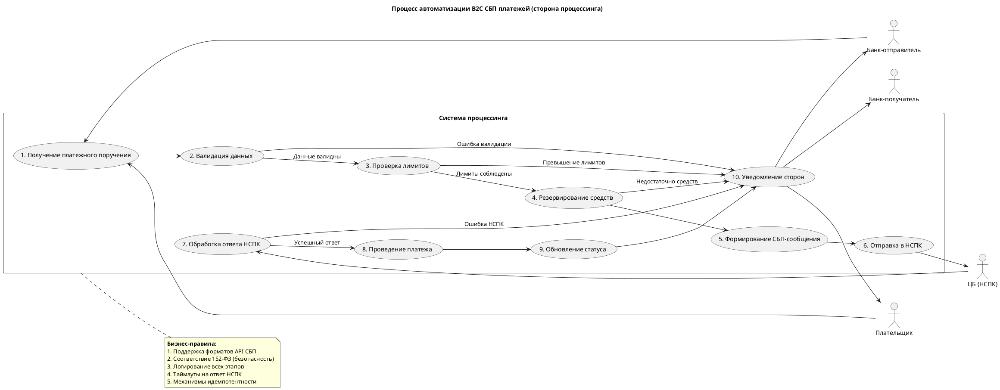
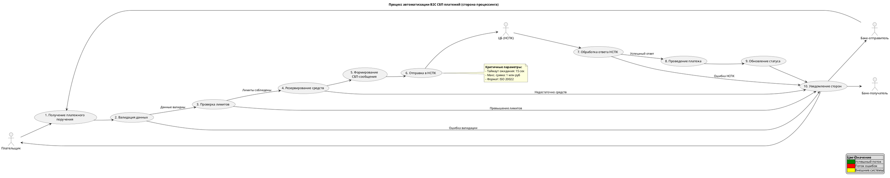
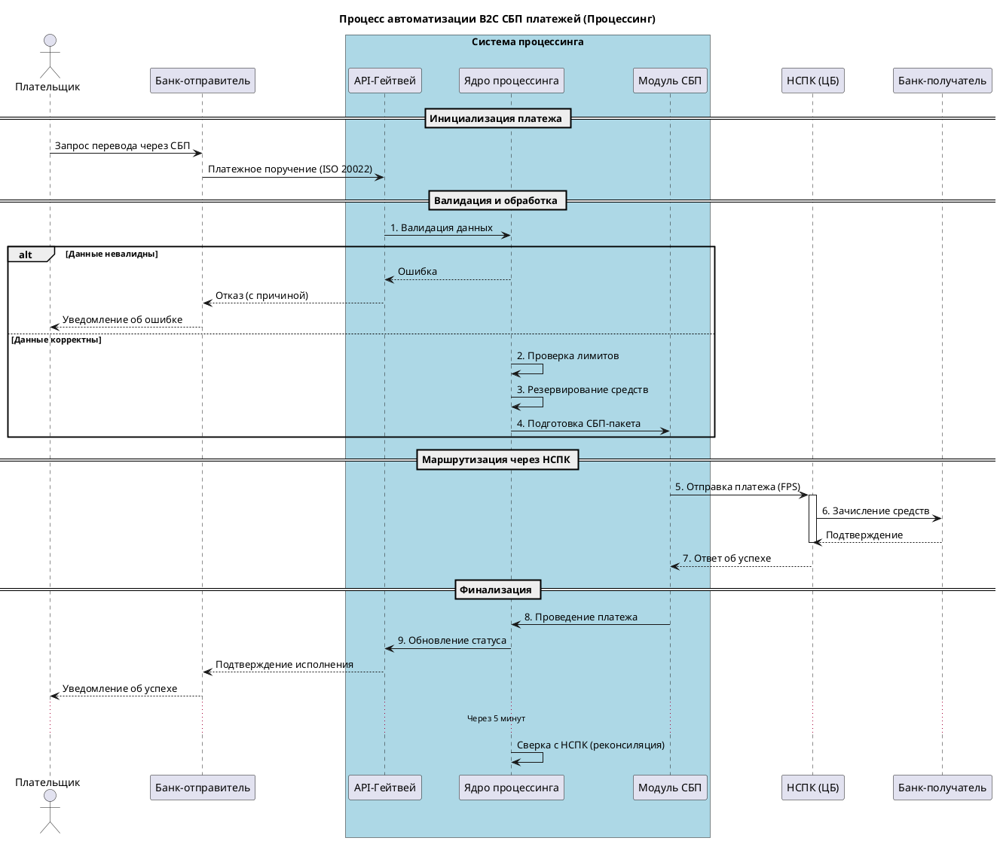
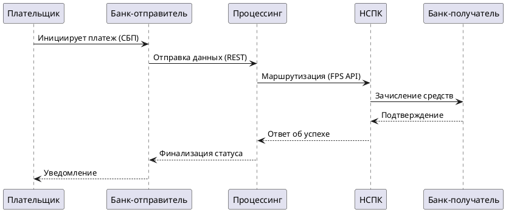

# Код диаграммы PlantUML для B2C СБП

## 👤 **Kirill**

как бизнес-аналитик напиши код диаграммы plantUML для процесса атворизации B2C СБП платежей на стороне системы процессинга платежей

---

## 🤖 **DeepSeek**

Вот код диаграммы PlantUML для процесса автоматизации B2C СБП (Системы Быстрых Платежей) платежей на стороне процессинга:



Это диаграмма вариантов использования, которая показывает:
1. Основных участников процесса
2. Ключевые этапы обработки платежа в процессинге
3. Потоки успешного выполнения и обработки ошибок
4. Бизнес-правила системы

Для более детального проектирования можно добавить:
- Диаграмму последовательности
- Диаграмму состояний платежа
- Диаграмму компонентов системы

Хотите, чтобы я разработал какую-то из этих диаграмм или уточнил текущую?

---

## 👤 **Kirill**

перепиши без использования rectangle

---

## 🤖 **DeepSeek**

Вот переработанная версия диаграммы без использования `rectangle`, с акцентом на взаимодействие между участниками:



Ключевые изменения:
1. Убрал явное выделение прямоугольником, заменив скрытыми связями для группировки
2. Добавил легенду для лучшей читаемости
3. Визуально разделил основной поток и обработку ошибок
4. Добавил примечание с техническими параметрами
5. Улучшил форматирование текста (переносы строк в длинных названиях)

Такой вариант лучше подходит для:
- Демонстрации взаимодействия между системами
- Отображения сквозного потока без привязки к конкретной системе
- Фокуса на последовательности операций

Если нужно подчеркнуть именно границы системы процессинга, можно использовать вариант с `package` вместо `rectangle`, но здесь сознательно отказался от любых боксов.

---

## 👤 **Kirill**

не работает код из-за usecase он не из нотации sequence plant uml

---

## 🤖 **DeepSeek**

Вы правы! Для последовательности действий в **Process Flow** лучше использовать **Sequence Diagram**. Вот исправленная версия на правильном синтаксисе:



### Ключевые особенности:
1. **Правильная нотация**: Используются `participant` и стрелки `->` для последовательных вызовов
2. **Логические блоки**: 
   - `alt/else` для обработки ошибок валидации
   - `box` для группировки компонентов процессинга
   - `activate/deactivate` для выделения внешних вызовов
3. **Тайминги**: Добавлен асинхронный процесс сверки (реконсиляции)
4. **Стандарты**: Указан формат сообщений (ISO 20022, FPS)

### Визуализирует:
1. Полный цикл от инициации платежа до уведомления
2. Роль каждого участника системы
3. Критичные точки интеграции с НСПК

Для дальнейшей детализации можно добавить:
- Сообщения об ошибках НСПК с `loop`
- Временные метки для SLA
- Параллельные процессы нотификации

---

## 👤 **Kirill**

для чего здесь могут применяться механизмы идемпотентности и что это такое

---

## 🤖 **DeepSeek**

### **Механизмы идемпотентности в процессинге СБП платежей**

#### **Что такое идемпотентность?**
Идемпотентность — это свойство операции, при котором **многократное выполнение одного и того же запроса** с одинаковыми параметрами приводит к **тому же результату**, что и первое выполнение.  

**Пример**:  
- Если плательщик случайно отправил один и тот же платеж дважды, система должна зачислить деньги только **один раз**, а не дублировать транзакцию.

---

### **Где применяется в B2C СБП процессинге?**
1. **Повторные запросы от банка-отправителя**  
   - Сетевые сбои или таймауты могут привести к повторной отправке платежного поручения.  
   - Идемпотентность гарантирует, что платеж не будет проведен дважды.  

2. **Обработка ответов от НСПК**  
   - Если ответ от НСПК не дошел с первого раза, процессинг повторяет запрос.  
   - Система должна понимать, что это **та же транзакция**, а не новая.  

3. **Ретри (повторные попытки) при ошибках**  
   - Например, если резервирование средств прошло, но следующий шаг упал, система повторяет операцию без повторного списания.  

4. **Сверка (реконсиляция) с НСПК**  
   - При расхождении статусов процессинг запрашивает данные повторно, но не должен дублировать платеж.  

---

### **Как реализуется?**  
1. **Уникальный ключ идемпотентности**  
   - Каждый платеж имеет `idempotency_key` (например, хеш от суммы, получателя и временной метки).  
   - Пример: `"SBP-{timestamp}-{sender_id}-{payment_hash}"`.  

2. **Проверка перед исполнением**  
   ```python
   if payment_exists(idempotency_key):
       return {"status": "already_processed"}
   else:
       process_payment()
   ```

3. **Хранение состояния**  
   - Кеширование ключей в Redis (с TTL = 24 часа) или запись в БД.  

4. **Поддержка на стороне НСПК**  
   - СБП API также должно учитывать идемпотентность, возвращая `409 Conflict` при дублях.  

---

### **Пример в коде (Python-like псевдокод)**
```python
def process_sbp_payment(request):
    idempotency_key = generate_key(request)
    
    # Проверяем, не обрабатывался ли уже такой запрос
    if cache.get(idempotency_key):
        return {"status": "duplicate", "existing_id": cache.get(idempotency_key)}
    
    # Основная логика
    try:
        payment_id = reserve_funds(request)
        sbp_response = send_to_nspk(request)
        cache.set(idempotency_key, payment_id, ttl=24h)
        return {"status": "success", "payment_id": payment_id}
    
    except TimeoutError:
        # При таймауте клиент может повторить запрос с тем же ключом
        return {"status": "retry_later"}
```

---

### **Почему это важно для СБП?**
- **Защита от двойного списания** (особенно критично для мгновенных платежей).  
- **Устойчивость к сбоям** (сети, перегрузки ЦБ, ошибки банков).  
- **Согласованность данных** между участниками (банк-процессинг-НСПК).  

Для B2C-платежей, где возможны массовые повторные запросы (например, при проблемах с мобильным интернетом у пользователей), это обязательный механизм.

---

## 👤 **Kirill**

задай мне вопросы которые нужно проработать, чтобы ты смог полностью описать процесс. Разбей по блокам

---

## 🤖 **DeepSeek**

Чтобы полностью описать процесс автоматизации B2C СБП платежей на стороне процессинга, нужно проработать следующие блоки вопросов. Отвечая на них, вы сможете выявить все нюансы системы и избежать ошибок в проектировании.

---

### **1. Блок: Участники и интеграции**
- Какие системы/участники вовлечены в процесс (банки, НСПК, мобильные приложения и т.д.)?
- Какие API и протоколы используются для взаимодействия между ними (REST, SOAP, ISO 20022, FPS)?
- Есть ли сторонние сервисы (антифрод, AML-проверки), которые нужно интегрировать?
- Как идентифицируются плательщик и получатель (телефон, СБП-ID, реквизиты)?

---

### **2. Блок: Валидация и безопасность**
- Какие данные обязательны для инициации платежа (сумма, получатель, назначение)?
- Как проверяется корректность реквизитов получателя (кеширование БИК, проверка через НСПК)?
- Какие ограничения и лимиты применяются (макс. сумма, лимиты в сутки/месяц)?
- Как обрабатываются подозрительные транзакции (антифрод, верификация по SMS/OTP)?

---

### **3. Блок: Обработка платежа**
- Какой алгоритм резервирования средств (холд на счете, списание в конце дня)?
- Как строится цепочка запросов к НСПК (маршрутизация, таймауты, ретраи)?
- Какие статусы платежа учитываются (новый, в обработке, исполнен, отменен)?
- Как обрабатываются расхождения (например, деньги списаны, но НСПК не подтвердил)?

---

### **4. Блок: Идемпотентность и надежность**
- Как генерируется уникальный ключ идемпотентности (хеш от данных, UUID)?
- Где хранятся ключи (кеш Redis, таблица в БД) и как долго (TTL)?
- Что происходит при повторном запросе с тем же ключом (отказ/возврат существующего payment_id)?
- Как обеспечивается атомарность операций (транзакции в БД, сага-паттерн)?

---

### **5. Блок: Обработка ошибок**
- Какие ошибки возможны на каждом этапе (недостаточно средств, недоступность НСПК)?
- Как система реагирует на таймауты (повторные запросы, отложенные задачи)?
- Как уведомляются участники при ошибках (email, push-уведомления, статус в ЛК)?
- Есть ли механизм ручного разбора проблем (админка с логами транзакций)?

---

### **6. Блок: Нотификации и отчетность**
- Кого и как уведомлять об успешных платежах/ошибках (клиент, банк, бухгалтерия)?
- Какие данные логируются для аудита (timestamp, суммы, статусы, ID запросов)?
- Как строится сверка (реконсиляция) с НСПК и банками (автоматическая/ручная)?
- Какие отчеты требуются регуляторам (ЦБ, Финмониторинг)?

---

### **7. Блок: Производительность и масштабирование**
- Какие SLA по времени обработки (например, <1 сек для 95% запросов)?
- Как система справляется с пиковыми нагрузками (очереди, балансировка)?
- Есть ли гео-распределенность (резервные ЦОДы на случай сбоев)?
- Как мониторится работоспособность (health-check, алерты при деградации)?

---

### **8. Блок: Юридические и регуляторные требования**
- Какие нормы 152-ФЗ (персональные данные) и 115-ФЗ (AML) учитываются?
- Как хранятся журналы операций (сроки, шифрование)?
- Есть ли особенности для跨境 платежей (если получатель — нерезидент)?
- Какие требования ЦБ к СБП (форматы сообщений, коды валют)?

---

### **Что дальше?**
1. Ответьте на вопросы по каждому блоку — это поможет выявить "узкие места".  
2. Определите приоритеты (например, сначала интеграция с НСПК, потом антифрод).  
3. На основе ответов можно доработать диаграммы (sequence, state, component) и ТЗ для разработчиков.  

Нужна детализация какого-то блока? Или примеры реализации? Уточните, и я помогу!

---

## 👤 **Kirill**

как бизнес-аналитик напиши пример как бы ты описывал блок 1?

---

## 🤖 **DeepSeek**

Вот как бизнес-аналитик может описать **Блок 1: Участники и интеграции** в формате, готовом для включения в техническое задание или аналитическую записку:

---

### **1. Участники процесса и интеграции**  
#### **1.1. Участники системы**  
| Роль | Описание | Примеры |  
|------|----------|---------|  
| **Плательщик** | Физическое лицо, инициирующее платеж через мобильное приложение/интернет-банк | Клиент Тинькофф, СберБанк, Альфа-Банк |  
| **Банк-отправитель** | Банк плательщика, передающий платежное поручение в процессинг | Тинькофф, СберБанк |  
| **Процессинг** | Система-агрегатор, обрабатывающая транзакции (наша система) | – |  
| **НСПК (ЦБ РФ)** | Оператор Системы Быстрых Платежей, маршрутизирующий платежи | Центральный Банк РФ |  
| **Банк-получатель** | Банк бенефициара (получателя платежа) | Любой банк-участник СБП |  

#### **1.2. Интеграционные точки**  
**1.2.1. Входящие взаимодействия:**  
- **От банка-отправителя:**  
  - **Формат:** REST API (JSON) / ISO 20022 (XML)  
  - **Обязательные поля:**  
    ```json
    {
      "transaction_id": "UUID",
      "sender_phone": "+79001234567",
      "receiver_phone": "+79007654321",
      "amount": 5000.00,
      "currency": "RUB",
      "idempotency_key": "req_abc123"
    }
    ```  
  - **Аутентификация:** OAuth 2.0 + SSL-сертификаты.  

**1.2.2. Исходящие взаимодействия:**  
- **К НСПК:**  
  - **Протокол:** FPS (Fast Payments System) API  
  - **Поля:**  
    - `message_id` (уникальный ID от процессинга)  
    - `qr_code` (если оплата по QR)  
    - `urgency` ("instant" для мгновенных платежей).  
  - **Таймаут:** 15 сек.  

- **К банку-получателю:**  
  - Нотификация о зачислении через callback URL.  

#### **1.3. Диаграмма взаимодействия**  


#### **1.4. Открытые вопросы**  
- Есть ли банки-партнеры с особыми условиями интеграции (например, Сбер с его гибридным API)?  
- Как обрабатываются платежи, где получатель — не клиент банка-участника СБП?  
- Требуется ли поддержка устаревших форматов (например, MT103 для юрлиц)?  

---

### **Формат заметки для команды**  
- **Цель блока:** Определить границы системы и форматы данных для начала разработки API.  
- **Что проверить:**  
  - Соответствие стандартам НСПК (актуальная версия FPS API).  
  - Наличие тестового стенда у ЦБ для интеграции.  
- **Риски:**  
  - Изменения в API НСПК без обратной совместимости.  

Такой подход структурирует информацию и сразу выделяет ключевые технические требования. Для других блоков используется аналогичный шаблон.  

Нужна детализация по конкретному участнику или пример для другого блока?

---

## 👤 **Kirill**

Как бизнес-аналитик Сформулируй вопросы для шлюза СБП по взаимодействию с процессингом:
Взаимодействие с АБС по C2B As Is 
Какой ответы предусмотрены по C2B переводам?
Обработка ошибок исключений, что передается в АБС
Какие API и протоколы предполагаются для взаимодействия с Процессингом?
B2C и возвраты C2B
Какие параметры платежа будут использоваться Шлюзом СБП 
B2C и C2B возвраты 
Работа с исключениями:
Какие ошибки обрабатывает Шлюз СБП?
Какие могут быть в ответе на запросы от Процессинга?
Как система реагирует на таймауты? Предполагаются ли ретраи?
Если предполагается то что происходит при повторном запросе с тем же ключом?
Предполагается ли сверка с НСПК?

---

## 🤖 **DeepSeek**

### **Вопросы к шлюзу СБП по взаимодействию с процессингом**  

#### **1. Взаимодействие с АБС по C2B (As Is)**  
- Какие текущие механизмы используются для приема C2B платежей?  
- Как АБС передает данные в шлюз СБП (файловый обмен, API, очередь сообщений)?  
- Какие форматы данных поддерживаются (ISO 20022, JSON, XML)?  
- Есть ли ручные операции (например, подтверждение через оператора)?  

#### **2. Ответы по C2B переводам**  
- Какие статусы платежа предусмотрены в ответах шлюза СБП (например, «Успех», «Ошибка», «В обработке»)?  
- Как передается подтверждение зачисления средств в АБС (callback, запрос статуса)?  
- Включает ли ответ дополнительные данные (комиссия, дата валютирования)?  

#### **3. Обработка ошибок и исключений**  
- Какие ошибки шлюз СБП передает в АБС (формат, коды ошибок)?  
- Пример:  
  ```json
  {
    "error_code": "LIMIT_EXCEEDED",
    "message": "Превышен дневной лимит",
    "details": {"max_limit": 100000, "current_amount": 120000}
  }
  ```  
- Как обрабатываются технические сбои (например, недоступность НСПК)?  

#### **4. API и протоколы взаимодействия с процессингом**  
- Какие методы API поддерживаются (REST, SOAP, gRPC)?  
- Требуется ли аутентификация (OAuth, API-ключи, SSL)?  
- Есть ли требования к таймаутам (например, 10 сек на ответ)?  
- Поддерживается ли webhook для асинхронных уведомлений?  

#### **5. Параметры платежа для B2C и C2B возвратов**  
- Какие обязательные поля должны передаваться в запросе?  
  - Для B2C: `sender_phone`, `receiver_phone`, `amount`, `purpose`.  
  - Для возвратов: `original_transaction_id`, `refund_reason`.  
- Как валидируются реквизиты (например, проверка номера телефона на участие в СБП)?  

#### **6. Работа с исключениями**  
- **Какие ошибки обрабатывает шлюз СБП?**  
  - Некорректные реквизиты.  
  - Лимиты (сумма, количество операций).  
  - Ошибки НСПК (отказ в проведении).  
- **Ответы на запросы от процессинга:**  
  - Стандартные HTTP-коды (200, 400, 500).  
  - Детализация ошибок в теле ответа.  

#### **7. Таймауты и ретраи**  
- Как система реагирует на таймауты (повторяет запрос или отменяет операцию)?  
- Сколько ретраев предусмотрено (например, 3 попытки с интервалом 5 сек)?  
- Что происходит при повторном запросе с тем же `idempotency_key`?  
  - Возвращается исходный ответ или новая ошибка?  

#### **8. Сверка с НСПК**  
- Как часто выполняется сверка (реконсиляция) — ежечасно/ежедневно?  
- Какие данные сверяются (номера транзакций, суммы, статусы)?  
- Как обрабатываются расхождения (автоматический откат или ручное вмешательство)?  

---

### **Формат для обсуждения с разработчиками**  
```markdown
1. **Интеграция с АБС**:  
   - Текущий процесс: [описание]  
   - Проблемы: [если есть]  

2. **Ответы по C2B**:  
   - Требуемые статусы: `SUCCESS`, `FAILED`, `PENDING`.  

3. **Ошибки**:  
   - Критичные: `INVALID_ACCOUNT`, `TIMEOUT`.  
   - Не критичные: `LIMIT_WARNING`.  

4. **API**:  
   - Предпочтительный протокол: REST JSON.  
   - Обязательные заголовки: `X-Idempotency-Key`.  
```  

Этот список поможет согласовать требования с командой разработки и НСПК. Нужна детализация по какому-то пункту?

---

