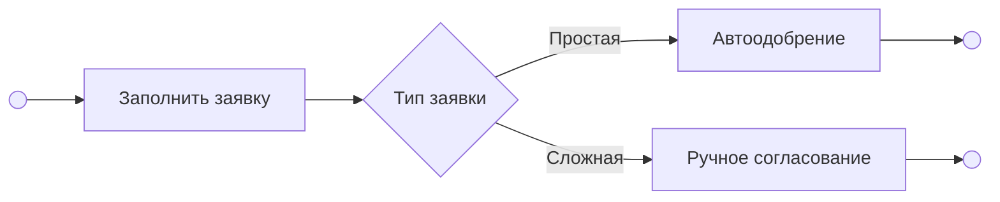
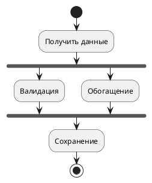
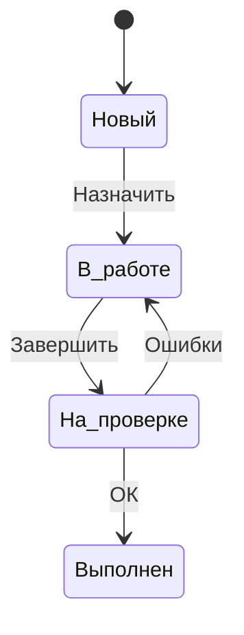
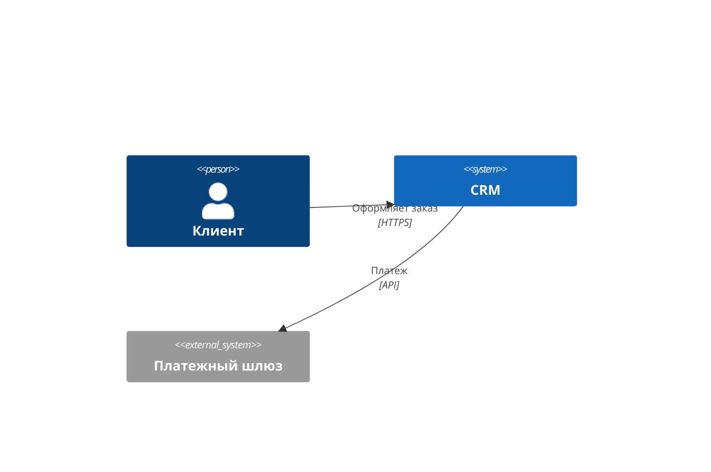
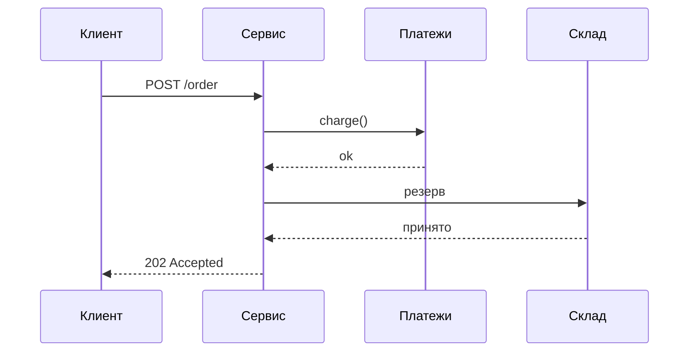

# Методологии и диаграммы для описания процессов

## 👤 **Kirill**

Какими методологиями и диаграммами (кодом) лучше всего описывать процессы?

---

## 🤖 **DeepSeek**

Для описания процессов лучше всего комбинировать **BPMN** (для исполняемых процессов), **UML Activity Diagram** (для IT-систем) и **C4** (для архитектуры). Ниже — ключевые методологии и примеры кода на DSL (все диаграммы можно использовать в Mermaid, PlantUML, Draw.io).

## 1. BPMN 2.0 (промышленный стандарт)
**Когда:** сквозные бизнес-процессы, согласования, интеграция с BPMS (Camunda, Flowable).



**Плюсы:** формализованные пулы/дорожки, события (таймеры, ошибки), чёткие правила завершения.

## 2. UML Activity Diagram
**Когда:** алгоритмы для разработчиков, распараллеливание, потоки данных.



## 3. Диаграмма состояний (State Machine)
**Когда:** управление жизненным циклом (заказ, тикет, документ).



## 4. C4 Model (для архитектуры процессов)
**Когда:** показать место процесса в системе — какой сервис вызывается, БД, внешние API.



## 5. Sequence Diagram (для взаимодействия систем)
**Когда:** синхронные/асинхронные вызовы нескольких сервисов.



## Лучшая практика
- **Для бизнеса:** BPMN (упрощённый) + дорожки по ролям.
- **Для разработки:** UML Activity + C4 + фрагменты Sequence для критических вызовов.
- **Для DevOps/SRE:** State Machine (инциденты) + BPMN для runbooks.

Избегайте **flowchart** — он не различает события, состояния и роли. Если нужен один язык на всё — **BPMN** со строгими пулами. Для быстрого прототипирования в коде — **Mermaid** (поддерживается в GitHub, GitLab, Notion, Obsidian).

---

## 👤 **Kirill**

Лучшие решения по компоновке элементов по координатам

---

## 🤖 **DeepSeek**

Выбор лучшего решения зависит от задачи: ручное управление в UI, автоматические алгоритмы для графов или математические модели для дашбордов. Вот основные подходы к компоновке по координатам:

---

## 1. Абсолютное позиционирование (Grid Layout)

Когда нужно точно указать `top`/`left` для каждого элемента — как в WYSIWYG-редакторах и десктопных приложениях.

**Технологии:**
- **CSS (position: absolute)** — для веб-интерфейсов
- **ui.abslayout (Webix)** — готовый лейаут для точного позиционирования[citation:6]
- **Canva Apps SDK** — позиционирование на странице с учётом размеров[citation:10]

**Пример (Webix):**
```javascript
webix.ui({
  view:"abslayout",
  cells:[
    { view:"text", top: 100, left:350, width:200, height:40 },
    { view:"button", top: 260, left:260, width:400 }
  ]
})
```

**✅ Плюсы:** Полный контроль, интуитивно понятно.  
**❌ Минусы:** Не адаптируется под разные экраны, сложно поддерживать[citation:4].

---

## 2. Flow Layout (последовательный)

Браузер сам расставляет элементы сверху вниз, без жёстких координат. Современные **Flexbox** и **Grid** позволяют управлять позиционированием без абсолютных значений[citation:9].

**✅ Плюсы:** Адаптивность, простота поддержки.  
**❌ Минусы:** Меньше контроля для сложных визуализаций.

---

## 3. Графовые алгоритмы (для диаграмм и связей)

Когда элементы связаны рёбрами (графы, блок-схемы, карты знаний). Библиотеки автоматически рассчитывают координаты.

**Алгоритмы (эвристические):**
- **Spring / Fruchterman-Reingold** — силовой, узлы отталкиваются, рёбра притягивают
- **Kamada-Kawai** — на основе кратчайших путей
- **ForceAtlas2** — продвинутый силовой алгоритм
- **Circular / Shell** — размещение по кругу или концентрическим слоям
- **Planar** — без пересечений рёбер

**Инструменты:**
- **@graphty/layout** — TypeScript-порт NetworkX со всеми алгоритмами[citation:3]
- **mgraph.forcelayout** — высокопроизводительный силовой алгоритм (Barnes-Hut, O(n log n))[citation:8]
- **D3.js** — forceSimulation в браузере

**Пример (mgraph.forcelayout):**
```javascript
import createLayout from 'mgraph.forcelayout';
import createGraph from 'mgraph.graph';

const graph = createGraph();
graph.addLink(1, 2);
graph.addLink(2, 3);

const layout = createLayout(graph);
for (let i = 0; i < 100; i++) layout.step();

graph.forEachNode(node => {
  const pos = layout.getNodePosition(node.id);
  console.log(`${node.id}: (${pos.x}, ${pos.y})`);
});
```

---

## 4. Математические модели

Для специализированных задач: размещение чипов на плате или дашбордов.

**Алгоритм AGLA-CT**: использует геометрические преобразования (трансляция) для размещения элементов разного размера на ограниченной плоскости без наложения сетки. Сложность **O(N)** — очень быстро для тысяч объектов[citation:2].

**Применение:** IC-дизайн, производственные планировки, плотные дашборды.

---

## 5. Определение элементов по координатам

**Web API (`elementsFromPoint`)** — получение всех DOM-элементов в заданной точке (от самого верхнего до нижнего)[citation:1]:

```javascript
const elements = document.elementsFromPoint(x, y);
elements.forEach((el, i) => console.log(el.tagName));
```

Полезно для: drag-and-drop, тултипов, визуальных редакторов.

---

## Сводная таблица

| Задача | Лучшее решение |
|--------|----------------|
| **Точный UI** (панели) | Absolute positioning (CSS, Webix) |
| **Адаптивный веб** | Flexbox / CSS Grid |
| **Связанные узлы** (графы) | Force-directed (D3, mgraph) |
| **Маршруты/иерархии** | Круговой или многоуровневый layout |
| **Тысячи элементов** | AGLA-CT, Barnes-Hut |
| **Хит-тестинг** | `elementsFromPoint()` |

Для большинства случаев рекомендую комбинировать: **CSS Grid** для общей структуры, **графовые алгоритмы** для визуализации связей и **абсолютное позиционирование** только для перетаскиваемых элементов.

---

## 👤 **Kirill**

Можно ли с помощью agla ct , и barnes-hut  описать архитектуру ит?

---

## 🤖 **DeepSeek**

Короткий ответ — **нет, напрямую использовать AGLA-CT и Barnes-Hut для описания IT-архитектуры нельзя и не нужно.** Эти алгоритмы решают совершенно другие задачи, не связанные с моделированием Enterprise Architecture (EA), где применяются свои устоявшиеся методологии и инструменты.

Чтобы было понятнее, вот сравнение их истинного назначения с тем, что требуется для архитектуры ИТ:

### ⚙️ Для чего созданы эти алгоритмы?

*   **AGLA-CT (Adaptive Graphics Layout Algorithm based on Coordinate Transformation)**: Это чисто инженерный алгоритм для **автоматической компоновки графических элементов на ограниченной плоскости**[citation:1]. Например, чтобы «умно» разложить иконки или блоки в интерфейсе, чтобы они не наезжали друг на друга. Он не несет никакого смысла о серверах или базах данных — это задача геометрии, а не архитектуры.
*   **Barnes-Hut**: Это вычислительный метод из области физики и астрофизики для **моделирования гравитационных взаимодействий N-тел**[citation:2][citation:5][citation:8]. Благодаря пространственному дереву и аппроксимации дальних групп он ускоряет расчеты (O(N log N) вместо O(N²))[citation:2]. В ИТ его можно встретить разве что при симуляции скоплений галактик или в очень специфическом машинном обучении, но никак не для описания структуры компании.

### 🏗️ Чем на самом деле описывают IT-архитектуру

Для этих целей существуют специализированные языки моделирования и фреймворки, которые фиксируют не координаты, а **сущности, связи, роли и потоки данных**:

*   **ArchiMate**: Стандарт The Open Group, созданный именно для визуализации и анализа архитектуры предприятия[citation:3][citation:9]. Он работает с тремя основными слоями (Бизнес, Приложения, Технологическая инфраструктура). Если нужно показать, как «CRM связана с Биллингом через API», это делается стрелкой в ArchiMate, а не координатами.
*   **TOGAF ADM (Architecture Development Method)**: Это не язык, а методология — пошаговый процесс (фазы от Прелиминарии до Управления изменениями) для разработки, документирования и внедрения архитектуры[citation:9].
*   **Другие подходы**: UML (диаграммы развертывания — Deployment diagram, компонентные диаграммы) и более простые средства вроде C4 Model (Context, Containers, Components, Code).

### 💎 Вывод и рекомендация

**Оставьте AGLA-CT и Barnes-Hut для их задач** — физических симуляций и сложной компоновки интерфейсов[citation:1][citation:8]. Для описания же IT-архитектуры осваивайте **язык ArchiMate** и **методологию TOGAF** — это профессиональный стандарт в отрасли[citation:3][citation:9]. Если нужна более легковесная альтернатива для начала, отлично подойдут диаграммы **C4 model** или **UML Deployment**.

Надеюсь, это разъяснение поможет сориентироваться в инструментарии. Если появятся вопросы по конкретным архитектурным нотациям, спрашивайте — я постараюсь помочь.

---

## 👤 **Kirill**

Можно ли применить agla ct , и barnes-hut (для компоновки) для диаграмм процессов или архитектур (по типу bpmn mermaid)?

---

## 🤖 **DeepSeek**

Можно, но с важной оговоркой: **Barnes-Hut и AGLA-CT решают задачу производительности для больших графов (тысячи+ узлов), но не являются "серебряной пулей" для BPMN/Mermaid-диаграмм**. Для классических блок-схем и архитектурных диаграмм они часто излишни, а иногда даже вредны.

Чтобы понять, почему так, достаточно посмотреть, что эти алгоритмы делают на самом деле.

### 📜 Что на самом деле делают эти алгоритмы?

*   **Barnes-Hut: Ускоритель "отталкивания"**. Это не самостоятельный алгоритм компоновки, а математический трюк для ускорения **силовых (force-directed) алгоритмов**[citation:1][citation:5]. Он заменяет расчет взаимодействия между всеми парами узлов (что занимает `O(n²)` времени) на более быструю оценку `O(n log n)`[citation:2][citation:6][citation:8]. Простыми словами: если звёзды (узлы) далеко, мы считаем их суммарную гравитацию (центр масс), а не притяжение каждой по отдельности[citation:5].
*   **AGLA-CT (Adaptive Grid Layout Algorithm with Cell Transposition)**: Это алгоритм для **слепого размещения объектов без наложения** (overlap removal). Его задача — взять множество прямоугольников произвольного размера и разместить их на плоскости без пересечений[citation:4]. Для связных графов он используется редко, так как "не знает" о связях.

### 🎯 Когда они подходят для BPMN/Architecture?

Силовые алгоритмы, ускоренные Barnes-Hut, лучше всего работают для отображения **сетевых топологий, социальных графов или диаграмм классов с большим количеством связей**, чтобы выявить кластеры[citation:1][citation:3][citation:7].

Однако для **BPMN и Archimate** (архитектурных диаграмм) у этого подхода есть серьёзные минусы:
1.  **Потеря семантики**: BPMN создан для **иерархий** ("родительский процесс" -> "подпроцесс") и **пулов** (строгих границ). Силовой алгоритм "размажет" по экрану всё, что связано ссылками, разрушая логику "сверху-вниз"[citation:4].
2.  **Непредсказуемость**: В отличие от чётких сеток Mermaid или PlantUML, силовая модель постоянно двигает узлы, что сбивает с толку при анализе процессов.
3.  **Проблема симметрии**: Классические силовые алгоритмы могут давать локально красивые, но глобально нечитаемые фигуры.

> *Альтернатива для процессов*: В 2019 году исследователи предложили алгоритм на базе **Sugiyama framework** (иерархическая компоновка), который сохраняет "ментальную карту" пользователя в 3 раза лучше силовых методов[citation:4]. Именно Sugiyama лежит в основе `flowchart` в Mermaid.

### 💎 Резюме и рекомендации

Если коротко, вот выбор подхода под вашу задачу:

*   **Огромные графы (10k+ узлов, социальные сети)**: Да, **Barnes-Hut** — ваш выбор.
*   **Классические BPMN (блок-схемы, архитектура)**: Нет, используйте иерархические алгоритмы (**Sugiyama** или **слоистые графы**).
*   **Очень плотные дашборды с виджетами**: Да, можно использовать **AGLA-CT**, чтобы "умно" разложить их на канве без наложений.

Поэтому:
*   Если вы пишете визуализатор **большой IT-инфраструктуры** (микросервисы, хаотичные связи) — пробуйте **D3.js Force Layout** (у него есть встроенная поддержка Barnes-Hut)[citation:3].
*   Если вы рисуете **блок-схему (Flowchart) или BPMN** — оставайтесь на **Mermaid** или **PlantUML**, им не нужны такие ускорители.

Надеюсь, это поможет вам не тратить время на настройку "танцев с бубнами" там, где это не нужно! Если появятся другие вопросы по визуализации, спрашивайте.

---

## 👤 **Kirill**

Mermaid и plant uml ужасно компонует элементы, даже с движками elk и тому подобными. А нужно умно компоновать элементы и связи

---

## 🤖 **DeepSeek**

Понимаю ваше разочарование. Mermaid и PlantUML действительно используют упрощённые эвристики, которые "ломаются" на сложных графах. К счастью, есть инструменты, которые дают тот самый "умный" контроль.

Если вам нужен **полный контроль над физикой расположения (force-directed)** для выявления кластеров, или **максимально чёткая иерархия (Sugiyama)** для сложных BPMN — смотрите таблицу ниже.

### 🛠️ Инструменты для "Умной" компоновки

#### 🥇 yFiles (Самый мощный)
*   **Тип:** Коммерческая библиотека.
*   **Суть:** Промышленный стандарт. Внутри десятки алгоритмов, включая **Hierarchic (Sugiyama)** для BPMN и **Organic (Force-directed)** [citation:10].
*   **Для кого:** Если важна каждая деталь: поддержка泳道 (swimlanes), портов и больших данных.
*   **Минусы:** Платная.

#### 🥈 elkjs (ELK)
*   **Тип:** Open Source (JavaScript).
*   **Суть:** Порт мощного Eclipse Layout Kernel [citation:2]. Даёт *тот самый* сложный алгоритм **Sugiyama** с правильной маршрутизацией.
*   **Для кого:** Веб-разработчики, кому надоел Mermaid, но yFiles дорог.
*   **Минусы:** Не готовый редактор, а "движок" — придется писать код отрисовки самому.

#### 🥉 YABAL (Для BPMN)
*   **Тип:** Open Source (npm).
*   **Суть:** Специализированная библиотека. Берет сырой BPMN XML и "причесывает" его: раскладывает подпроцессы и пулы [citation:5].
*   **Для кого:** Быстрый фикс BPMN-диаграмм.

### ⚙️ Продвинутые техники для "Идеального" результата

Даже с хорошим движком результат можно улучшить. Вот два "секретных" приёма:

*   **Разделяй и властвуй (Компоненты)**: Если граф разорван на части, не заставляйте алгоритм мучиться. Раскладывайте **каждый компонент отдельно** (своим алгоритмом), а потом собирайте их в одну схему с помощью **ComponentLayouter** [citation:4][citation:7].
*   **Игра слоёв (Группировка)**: Прежде чем запускать алгоритм, сгруппируйте узлы в "слои" (по степени связности или удалённости от корня). Алгоритм типа **Multipartite** разложит эти группы идеально ровными линиями [citation:9].

Надеюсь, эти варианты помогут вам навести порядок в схемах. Если захотите обсудить, какой движок проще внедрить в ваш текущий стек, дайте знать

---

## 👤 **Kirill**

Ок как доработать elk и какие алгоритмы можно в нем использовать для улучшения?

---

## 🤖 **DeepSeek**

ELK — это как конструктор с огромным набором деталей. Проблема в том, что часто используют только «настройки по умолчанию», которые работают как топор. Чтобы получить «умную» компоновку, нужно заменить эти дефолты на более подходящие алгоритмы на каждом из 5 этапов.

### 🧠 Этап 1: Разрыв циклов (Cycle Breaking)
Алгоритм решает, какие рёбра и в какую сторону «развернуть», чтобы избавиться от циклов.

*   **Проблема**: Стратегия **`GREEDY` (по умолчанию)** минимизирует количество развёрнутых рёбер, но делает это случайным образом, из-за чего один и тот же граф каждый раз раскладывается по-новому.
*   **Решение**: Если важен предсказуемый результат (последовательность узлов в модели), используйте **`GREEDY_MODEL_ORDER`**, чтобы сохранить ваш изначальный порядок узлов[citation:1].

**Код (layoutOptions)**:
```json
"elk.layered.cycleBreaking.strategy": "GREEDY_MODEL_ORDER"
```

### 📚 Этап 2: Назначение слоёв (Layer Assignment)
Определяет, на каком «этаже» (столбце или строке) будет стоять каждый узел.

*   **Проблема**: Стратегия **`NETWORK_SIMPLEX` (по умолчанию)** может создавать много слоёв с 1-2 узлами, растягивая диаграмму в длину.
*   **Решение**: Для компактных и широких диаграмм сдерживайте ширину слоя: используйте **`COFFMAN_GRAHAM`**, указав лимит узлов в слое, или экспериментальный **`MIN_WIDTH`**[citation:1].

**Код (layoutOptions)**:
```json
"elk.layered.layering.strategy": "COFFMAN_GRAHAM",
"org.eclipse.elk.layered.layering.coffmanGraham.layerBound": "5"
```

### 🤝 Этап 3: Минимизация пересечений (Crossing Minimization)
Самая важная часть. Решает, в каком порядке узлы стоять внутри одного слоя, чтобы рёбра меньше пересекались.

*   **Проблема**: **`LAYER_SWEEP` (по умолчанию)** использует усреднение (barycenter). Он хорош, но может «застревать» в неоптимальных локальных решениях.
*   **Решение**: Попробуйте **`MEDIAN_LAYER_SWEEP`** — он часто даёт более прямые линии рёбер за счёт использования медианы[citation:1].

**Код (layoutOptions)**:
```json
"elk.layered.crossingMinimization.strategy": "MEDIAN_LAYER_SWEEP"
```

### 📏 Этап 4: Размещение узлов (Node Placement)
Определяет точные Y-координаты узлов внутри слоя, влияя на вертикальное выравнивание и изгибы рёбер.

*   **Проблема**: Базовая настройка часто центрирует узлы, создавая лишние изгибы.
*   **Решение**: Включите пост-компакцию (сжатие) и попробуйте **`NETWORK_SIMPLEX`**. Он может динамически увеличивать высоту узла, чтобы провести ребро по прямой линии (это включается отдельной опцией)**[citation:1][citation:8].

**Код (layoutOptions)**:
```json
"elk.layered.nodePlacement.strategy": "NETWORK_SIMPLEX",
"elk.layered.compaction.postCompaction.strategy": "EDGE_LENGTH",
"elk.layered.nodePlacement.networkSimplex.nodeFlexibility": "true"
```

### 🧭 Этап 5: Трассировка рёбер (Edge Routing)
Отвечает за то, как именно линия идёт от узла А к узлу Б.

*   **Проблема**: Либо ортогональные линии (только вертикали и горизонтали), либо прямая линия.
*   **Решение**: Если стандартные стили не устраивают, попробуйте **полилинии** (`POLYLINE`) или **сплайны** (`SPLINES`). Это сделает схему «воздушнее» и читаемее[citation:2].

**Код (layoutOptions)**:
```json
"elk.edgeRouting": "POLYLINE"
```

---

### ⚙️ Чек-лист: С чего начать доработку?

Если нужно быстро улучшить результат без глубокого изучения всех параметров, начните с этой базы:

```json
{
  "elk.algorithm": "layered",
  "elk.direction": "DOWN",
  "elk.edgeRouting": "POLYLINE",
  "elk.layered.cycleBreaking.strategy": "GREEDY_MODEL_ORDER",
  "elk.layered.layering.strategy": "COFFMAN_GRAHAM",
  "elk.layered.crossingMinimization.strategy": "MEDIAN_LAYER_SWEEP",
  "elk.layered.nodePlacement.strategy": "NETWORK_SIMPLEX",
  "elk.layered.compaction.postCompaction.strategy": "EDGE_LENGTH",
  "elk.spacing.nodeNode": "60",
  "elk.layered.spacing.edgeNodeBetweenLayers": "40"
}
```

### 🧪 Альтернативный подход: Force

Если ваша диаграмма не строго иерархична (например, социальный граф, инфраструктура), то иерархический `layered` алгоритм может не подойти.

В ELK есть **`force`** алгоритм. Он не требует тонкой настройки по этапам, нужно лишь указать модель[citation:4]:
*   `FRUCHTERMAN_REINGOLD` (по умолчанию) — надёжный силовой алгоритм.
*   `EADES` — классическая пружинная модель.

```json
{
  "elk.algorithm": "force",
  "org.eclipse.elk.force.forceModel": "FRUCHTERMAN_REINGOLD",
  "org.eclipse.elk.force.iterations": "500"
}
```

**Важное предупреждение про Force:** В ELKjs (JavaScript версии) настройка `repulsivePower` для отдельных рёбер *не создаёт* изгибов (`bendPoints`). Она меняет только длину рёбер (силу отталкивания)[citation:7].

Надеюсь, эти настройки помогут вам обуздать ELK! Если захотите поэкспериментировать с конкретным фрагментом вашей схемы, дайте знать, попробуем подобрать параметры точнее.

---

## 👤 **Kirill**

Как применить elk к диаграммам написанных в разных системах (plant uml, bpmn, mermaid, d3.js)?

---

## 🤖 **DeepSeek**

Применить ELK к диаграммам из разных систем можно, но подход зависит от того, насколько глубоко система интегрирована с движком. Ниже — конкретные инструкции для каждого формата.

---

## 1. PlantUML — проще всего (встроено)

Начиная с версии **V1.2024.6**, ELK уже включён в `plantuml.jar` — ничего дополнительно скачивать не нужно[citation:1][citation:6].

### Как включить:
Добавьте в начало диаграммы:
```plantuml
@startuml
!pragma layout elk
```
Или через командную строку:
```bash
java -jar plantuml.jar -Playout=elk diagram.puml
```

### Что работает:
- **class diagram** и **deployment diagram** поддерживаются официально[citation:6]
- **sequence diagrams** тоже работают (подтверждено пользователями)[citation:1]

### Ограничения:
- Это **альфа-версия** — на сложных схемах возможны артефакты[citation:6]
- Некоторые типы диаграмм могут не поддерживаться

---

## 2. Mermaid — требуется подключение (опционально)

ELK **не входит в стандартную сборку** Mermaid. Его нужно подключать отдельно через пакет `@mermaid-js/layout-elk`[citation:3][citation:8].

### Установка:
```bash
npm install @mermaid-js/layout-elk
```

### Подключение в коде:
```javascript
import mermaid from 'mermaid';
import elkLayouts from '@mermaid-js/layout-elk';

mermaid.registerLayoutLoaders(elkLayouts);
```

### Для CDN:
```html
<script type="module">
  import mermaid from 'https://cdn.jsdelivr.net/npm/mermaid@11/dist/mermaid.esm.min.mjs';
  import elkLayouts from 'https://cdn.jsdelivr.net/npm/@mermaid-js/layout-elk@0/dist/mermaid-layout-elk.esm.min.mjs';
  mermaid.registerLayoutLoaders(elkLayouts);
</script>
```

### Использование в диаграмме:
```mermaid
flowchart-elk TD
  A --> B
  A --> C

config:
  layout: elk
```

### Доступные алгоритмы:
| Значение в `layout:` | Алгоритм ELK |
|---------------------|--------------|
| `elk` | layered (по умолчанию) |
| `elk.layered` | layered |
| `elk.stress` | стресс-компоновка |
| `elk.force` | силовой |
| `elk.mrtree` | multi-root tree |
| `elk.sporeOverlap` | spore overlap |

[citation:3]

---

## 3. D3.js — полный контроль через elkjs

Здесь всё строится вокруг библиотеки **`elkjs`** — чистого JavaScript-порта ELK. Ваша задача — преобразовать данные в формат, понятный ELK, а D3 будет только отрисовывать готовые координаты.

### Базовый пример:
```javascript
import ELK from 'elkjs';
const elk = new ELK();

const graph = {
  id: 'root',
  children: [
    { id: 'node1', width: 100, height: 50 },
    { id: 'node2', width: 100, height: 50 }
  ],
  edges: [
    { id: 'edge1', sources: ['node1'], targets: ['node2'] }
  ]
};

elk.layout(graph).then(layoutedGraph => {
  // layoutedGraph.children теперь содержат x, y координаты
  layoutedGraph.children.forEach(node => {
    d3.select('svg')
      .append('rect')
      .attr('x', node.x)
      .attr('y', node.y)
      .attr('width', node.width)
      .attr('height', node.height);
  });
});
```

### Готовое решение: d3-hwschematic
Существует библиотека **`d3-hwschematic`**, которая объединяет D3.js и ELK с готовой поддержкой:
- иерархических компонентов (раскрывающиеся узлы)
- зума, drag-and-drop
- кастомных рендереров узлов

Формат входных данных — ELK JSON с расширенными метаданными (`hwMeta`)[citation:4][citation:9].

---

## 4. BPMN — через bpmn-io экосистему

В экосистеме **bpmn.io** есть инструменты для работы с ELK[citation:7]:

### Варианты:
1. **bpmn-js + elkjs** — можно интегрировать ELK как движок раскладки для BPMN-диаграмм
2. **bpmn-auto-layout** — автоматическая раскладка BPMN-схем

### Важное ограничение:
ELK из коробки **не поддерживает swimlanes (дорожки)**. Есть обходной путь через `partitions`, но смена направления внутри одной диаграммы (например, разные ориентации для разных дорожек) не поддерживается[citation:2].

---

## Сравнительная таблица

| Система | Сложность | Вариант подключения | Готовность |
|---------|-----------|--------------------|------------|
| PlantUML | Низкая | `!pragma layout elk` | Готово «из коробки» |
| Mermaid | Средняя | `@mermaid-js/layout-elk` + регистрация | Требуется установка |
| D3.js | Высокая | `elkjs` + ручная отрисовка | Полный контроль |
| BPMN | Средняя/Высокая | `bpmn-js` + `elkjs` | Требуется интеграция |

---

## Рекомендация

- **Для быстрого старта** — используйте **PlantUML** с `!pragma layout elk`, если ваши диаграммы относятся к поддерживаемым типам.
- **Если нужен кастомный рендеринг** — берите **D3.js + elkjs**, это даст максимальную гибкость.
- **Для Mermaid на сайте** — добавьте `@mermaid-js/layout-elk`, это несложно, но нужно не забыть про регистрацию.

Если уточните, какой именно тип диаграмм и в каком окружении вы используете, смогу дать более детальный пример кода.

---

## 👤 **Kirill**

А для react flow что-то есть?

---

## 🤖 **DeepSeek**

Да, и здесь подход будет даже более гибким, чем с BPMN или PlantUML. React Flow предоставляет отличную основу для кастомных редакторов, и для умной компоновки у вас есть несколько проверенных вариантов.

### 🏆 Главный фаворит: ELKjs

**ELKjs** — это самый мощный и настраиваемый вариант для React Flow, который даёт наилучшие результаты, особенно для сложных BPMN или архитектурных диаграмм[citation:2][citation:5].

Вот как его можно использовать и что важно знать:

*   **Прямая поддержка**: Существуют официальные примеры интеграции ELKjs с React Flow[citation:8]. Более того, в платном шаблоне "Workflow Editor" авто-компоновка реализована именно через ELK[citation:1].
*   **Полный контроль**: Как вы и хотели, ELKjs даёт доступ ко всем настройкам, которые мы обсуждали ранее (`elk.direction`, `elk.spacing.nodeNode`, `elk.layered.nodePlacement.strategy` и т.д.)[citation:5][citation:10].
*   **Учёт портов (handles)**: Новые примеры от React Flow показывают, как передавать ELK позиции элементов на узлах (handles), чтобы рёбра подводились максимально аккуратно[citation:8]. Более того, энтузиасты нашли способ заставить ELK маршрутизировать сами рёбра (edge routing), что даёт идеальную ортогональную или полилинейную проводку[citation:6].

**Как начать:**
1.  Установите пакет: `npm install elkjs`
2.  Создайте экземпляр ELK и сформируйте граф в нужном JSON-формате.
3.  Используйте `elk.layout(graph)`, который вернёт Promise с вычисленными координатами.
4.  Обновите позиции ваших `nodes` в состоянии React Flow.

### 🚀 Более простые альтернативы

Если возможности ELK избыточны или его сложность пугает, рассмотрите другие варианты:

*   **Dagre**: Это самое простое "коробочное" решение. Если вам нужно быстро организовать узлы в чёткую иерархию (дерево или направленный граф) без лишних сложностей, **Dagre** — отличный выбор[citation:2][citation:7]. Он работает синхронно и требует минимум кода.
*   **D3-Hierarchy**: Подойдёт только для простых древовидных структур (как организационная схема), где все узлы имеют строго одного родителя[citation:2][citation:7].

### 💎 Резюме

Для вашей задачи — "умной компоновки сложных диаграмм" в React Flow — выбор однозначен: **ELKjs**.

Он даёт тот самый уровень контроля, который не смогли обеспечить Mermaid и PlantUML. Не пугайтесь его сложности: официальные примеры от React Flow (`reactflow.dev/examples/layout/elkjs`) и detailed гайды сообщества помогут разобраться с настройками за вечер[citation:3][citation:6][citation:8].

---

