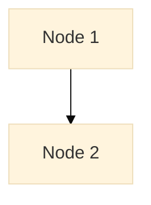
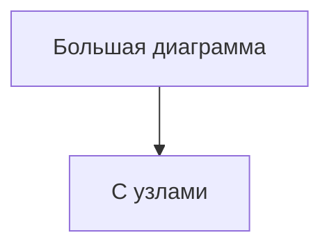
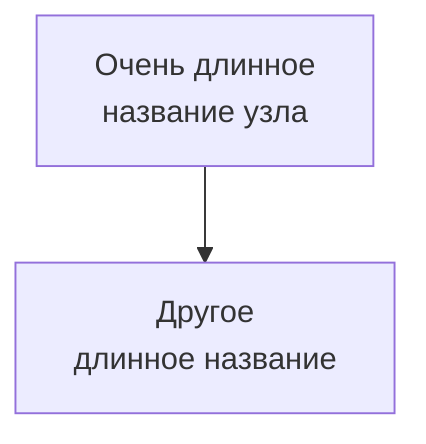
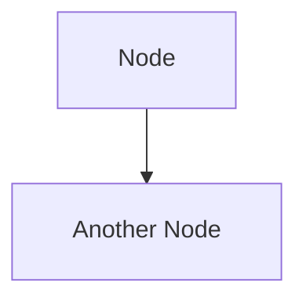
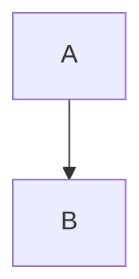

# Отображение ASCII-диаграмм в Obsidian

## 👤 **Kirill**

Что тут за диаграммы используются и как сделать, чтобы в obsidian они отобразились?

---

## 🤖 **DeepSeek**

В этом документе используются **текстовые блок-схемы** в формате, который напоминает упрощённый ASCII-art (псевдографика). Это не стандартные диаграммные языки вроде Mermaid или PlantUML, а просто текстовые блоки с использованием символов `|`, `_`, `/`, `\`, и переносов строк.

Чтобы такие диаграммы корректно отображались в Obsidian, есть несколько вариантов:

---

### 1. **Оставить как есть (обычный текст)**
Если вы просто вставите этот текст в Obsidian, он будет выглядеть примерно так же, как в исходном файле — в виде моноширинного текста. Это самый простой способ, но без форматирования блоков.

---

### 2. **Использовать блок кода с указанием языка `text` или `plaintext`**
```plaintext
Внешний_вид
├── Подсистема_1
└── Подсистема_2
```
Это сохранит моноширинный шрифт и пробелы, что улучшит читаемость.

---

### 3. **Перерисовать в Mermaid (рекомендуется)**
Mermaid — это встроенная в Obsidian поддержка диаграмм.  
Пример перевода одной из ваших диаграмм в Mermaid:

Исходный текст:
```
External_TargetsBuild_SystemCore_PackagesWeb_Platformstrudel.ccDocumentation_Site@strudel/react@strudel/midi@strudel/desktop-bridgevite.config.jspackage.jsonWeb_BrowsersMIDI_HardwareDesktop_Applications
```

Пример перевода в Mermaid (граф):
```mermaid
graph TD
    A[External Targets] --> B[Build System]
    B --> C[Core Packages]
    C --> D[Web Platform]
    D --> E[strudel.cc]
    D --> F[Documentation Site]
    C --> G[@strudel/react]
    C --> H[@strudel/midi]
    C --> I[@strudel/desktop-bridge]
    C --> J[vite.config.js]
    C --> K[package.json]
    A --> L[Web Browsers]
    A --> M[MIDI Hardware]
    A --> N[Desktop Applications]
```

---

### 4. **Использовать плагин для ASCII-диаграмм**
Существуют плагины для Obsidian, которые улучшают отображение ASCII-арт диаграмм, например:
- **Advanced Tables** — для таблиц.
- **Monospace Code Renderer** — для сохранения форматирования текста.

---

### 5. **Конвертировать в изображение или использовать Excalidraw**
Если хочется более визуального представления, можно:
- Нарисовать схему в **Excalidraw** (плагин для Obsidian).
- Создать схему в отдельном инструменте (Draw.io, Miro) и вставить как изображение.

---

### 📌 **Краткий совет:**
Если вы хотите быстро и без лишних плагинов — используйте **блок кода** или **переведите в Mermaid**.  
Если важна точность исходного вида — оставьте как есть, но в блоке кода с `plaintext`.

Если хотите, я могу помочь перевести ваши диаграммы в Mermaid или другой удобный формат.

---

## 👤 **Kirill**

можешь сделать какое-то решение чтобы автоматически переделывать в mermaid диаграмму? скриптик может какой-нибудь

---

## 🤖 **DeepSeek**

Могу предложить несколько вариантов автоматизации преобразования ваших ASCII1диаграмм в Mermaid:

## Вариант 1: Простой Python-скрипт для преобразования

```python
import re

def ascii_to_mermaid(ascii_text):
    """
    Преобразует простые ASCII-диаграммы в Mermaid graph
    """
    lines = ascii_text.strip().split('\n')
    
    # Удаляем пустые строки
    lines = [line for line in lines if line.strip()]
    
    if not lines:
        return ""
    
    mermaid_code = "```mermaid\ngraph TD\n"
    
    # Простой парсинг для диаграмм в вашем документе
    for line in lines:
        line = line.strip()
        
        # Пропускаем разделители
        if line.startswith('---') or line.startswith('==='):
            continue
            
        # Обработка строк с разделителями
        if '|' in line or '/' in line or '\\' in line or '_' in line:
            # Ищем узлы в строке
            # Для вашего формата, где узлы разделены подчеркиванием или CamelCase
            nodes = re.findall(r'[A-Z][a-zA-Z_]+|[A-Z]+_[A-Z][a-zA-Z_]*', line)
            
            for node in nodes:
                # Очищаем узел
                clean_node = node.strip('_')
                if clean_node and len(clean_node) > 1:
                    # Создаем простые связи
                    mermaid_code += f'    {clean_node}[{clean_node}]\n'
    
    mermaid_code += "```\n"
    return mermaid_code

# Пример использования
ascii_diagram = """
Development_Movedgithub.com/tidalcycles/strudelcodeberg.org/uzu/strudelstrudel.cc
"""

print(ascii_to_mermaid(ascii_diagram))
```

## Вариант 2: Более продвинутый парсер

```python
import re

def parse_strudel_diagram(ascii_text):
    """
    Парсит специфичный формат Strudel диаграмм
    """
    lines = ascii_text.strip().split('\n')
    
    mermaid_lines = ["```mermaid", "graph TD"]
    nodes = set()
    relationships = []
    
    for line in lines:
        # Убираем Sources ссылки
        if line.startswith('Sources:'):
            continue
            
        # Ищем блоки с подчеркиванием (узлы)
        matches = re.finditer(r'([A-Z][a-zA-Z0-9_]+)', line)
        for match in matches:
            node_name = match.group(1).strip('_')
            if node_name and len(node_name) > 2:
                nodes.add(node_name)
    
    # Добавляем все узлы
    for node in sorted(nodes):
        mermaid_lines.append(f'    {node}[{node}]')
    
    # Пытаемся определить связи (очень упрощенно)
    # В реальном скрипте нужно больше логики для определения связей
    if len(nodes) > 1:
        nodes_list = list(nodes)
        for i in range(len(nodes_list) - 1):
            mermaid_lines.append(f'    {nodes_list[i]} --> {nodes_list[i+1]}')
    
    mermaid_lines.append("```")
    return '\n'.join(mermaid_lines)

# Пример для таблицы
def parse_table_to_mermaid(table_text):
    """
    Преобразует Markdown таблицу в Mermaid блок
    """
    lines = table_text.strip().split('\n')
    
    if len(lines) < 3:
        return table_text
    
    # Парсим заголовки таблицы
    headers = [h.strip() for h in lines[0].split('|')[1:-1]]
    
    mermaid_lines = ["```mermaid", "flowchart TD"]
    
    for line in lines[2:]:  # Пропускаем заголовки и разделитель
        if '|' not in line:
            continue
            
        cells = [c.strip() for c in line.split('|')[1:-1]]
        if len(cells) >= 2:
            component = cells[0].replace(' ', '_')
            purpose = cells[1]
            mermaid_lines.append(f'    {component}["{component}<br>{purpose}"]')
    
    mermaid_lines.append("```")
    return '\n'.join(mermaid_lines)
```

## Вариант 3: Obsidian плагин + скрипт

Создайте файл `convert_diagrams.py` в вашем хранилище Obsidian:

```python
#!/usr/bin/env python3
"""
Скрипт для преобразования ASCII диаграмм в Mermaid в Obsidian заметках
"""

import os
import re
import sys
from pathlib import Path

def convert_note(file_path):
    """Конвертирует диаграммы в одной заметке"""
    with open(file_path, 'r', encoding='utf-8') as f:
        content = f.read()
    
    # Регулярные выражения для поиска диаграмм
    patterns = [
        # Для блоков с подчеркиванием
        (r'```(?:text|plaintext)?\n([A-Z_].*?)\n```', convert_ascii_block),
        # Для таблиц
        (r'\|.*?\|\n\|[-:|]+\|.*?\n(\|.*?\|\n?)+', convert_table_block),
    ]
    
    converted = content
    for pattern, converter in patterns:
        matches = list(re.finditer(pattern, content, re.DOTALL))
        for match in matches:
            original = match.group(0)
            converted_block = converter(original)
            converted = converted.replace(original, converted_block)
    
    return converted

def convert_ascii_block(block):
    """Конвертирует ASCII блок в Mermaid"""
    # Убираем обратные кавычки
    lines = block.strip('`').strip().split('\n')
    
    # Определяем тип диаграммы
    nodes = []
    for line in lines:
        # Ищем слова с заглавных букв или с подчеркиванием
        words = re.findall(r'[A-Z][a-zA-Z0-9_]+', line)
        nodes.extend(words)
    
    if not nodes:
        return block
    
    # Создаем Mermaid диаграмму
    mermaid = "```mermaid\ngraph TD\n"
    for node in set(nodes):
        mermaid += f'    {node}["{node}"]\n'
    
    # Простые связи (можно улучшить логику)
    for i in range(len(nodes)-1):
        mermaid += f'    {nodes[i]} --> {nodes[i+1]}\n'
    
    mermaid += "```"
    return mermaid

def convert_table_block(table):
    """Конвертирует таблицу в Mermaid"""
    lines = table.strip().split('\n')
    if len(lines) < 3:
        return table
    
    headers = [h.strip() for h in lines[0].split('|')[1:-1]]
    mermaid = "```mermaid\ngraph TD\n"
    
    for line in lines[2:]:
        if '|' not in line:
            continue
        cells = [c.strip() for c in line.split('|')[1:-1]]
        if cells:
            node_id = cells[0].replace(' ', '_').replace('-', '_')
            label = cells[0]
            if len(cells) > 1:
                label += f"<br>{cells[1]}"
            mermaid += f'    {node_id}["{label}"]\n'
    
    mermaid += "```"
    return mermaid

def main():
    if len(sys.argv) > 1:
        # Конвертировать указанный файл
        file_path = sys.argv[1]
        if os.path.exists(file_path):
            converted = convert_note(file_path)
            
            # Создаем резервную копию
            backup_path = file_path + '.bak'
            with open(backup_path, 'w', encoding='utf-8') as f:
                with open(file_path, 'r', encoding='utf-8') as original:
                    f.write(original.read())
            
            # Записываем конвертированную версию
            with open(file_path, 'w', encoding='utf-8') as f:
                f.write(converted)
            
            print(f"Конвертировано: {file_path}")
            print(f"Резервная копия: {backup_path}")
    else:
        print("Использование: python convert_diagrams.py <путь_к_файлу.md>")

if __name__ == "__main__":
    main()
```

## Вариант 4: QuickAdd/Templater скрипт для Obsidian

Для использования внутри Obsidian с плагином QuickAdd или Templater:

```javascript
// Для QuickAdd плагина
module.exports = async (params) => {
    const {app, quickAddApi} = params;
    const activeFile = app.workspace.getActiveFile();
    const content = await app.vault.read(activeFile);
    
    // Простая конвертация
    const converted = content.replace(
        /```(?:text|plaintext)?\n([\s\S]*?)\n```/g,
        (match, diagram) => {
            const lines = diagram.split('\n');
            const nodes = [];
            
            lines.forEach(line => {
                const words = line.match(/[A-Z][A-Za-z0-9_]+/g) || [];
                nodes.push(...words);
            });
            
            if (nodes.length === 0) return match;
            
            let mermaid = '```mermaid\ngraph TD\n';
            const uniqueNodes = [...new Set(nodes)];
            
            uniqueNodes.forEach(node => {
                mermaid += `    ${node}["${node}"]\n`;
            });
            
            // Простые связи
            for (let i = 0; i < uniqueNodes.length - 1; i++) {
                mermaid += `    ${uniqueNodes[i]} --> ${uniqueNodes[i+1]}\n`;
            }
            
            mermaid += '```';
            return mermaid;
        }
    );
    
    await app.vault.modify(activeFile, converted);
    new Notice('Диаграммы конвертированы в Mermaid!');
};
```

## Инструкция по использованию:

1. **Сохраните Python-скрипт** (вариант 3) в удобном месте
2. **Установите Python**, если его нет
3. **Запустите скрипт** из терминала:
```bash
python convert_diagrams.py путь/к/вашему/файлу.md
```
4. **Скрипт создаст резервную копию** и заменит ASCII-диаграммы на Mermaid

## Альтернатива: Используйте онлайн-конвертер

Если нужно сделать разово, можете использовать этот быстрый конвертер:

```python
# Вставьте диаграмму сюда и запустите
ascii_input = """
External_TargetsBuild_SystemCore_PackagesWeb_Platformstrudel.ccDocumentation_Site@strudel/react@strudel/midi@strudel/desktop-bridgevite.config.jspackage.jsonWeb_BrowsersMIDI_HardwareDesktop_Applications
"""

# Разделяем по CamelCase и подчеркиваниям
import re
elements = re.findall(r'[A-Z][a-z]+|[A-Z]+(?=[A-Z]|_)|[a-z]+\.[a-z]+|@[a-z/]+', ascii_input)
print("Элементы:", elements)

# Создаем Mermaid
print("\n```mermaid\ngraph TD")
for i, elem in enumerate(elements):
    print(f'    elem{i}["{elem}"]')
print("```")
```

Хотите, чтобы я доработал скрипт под конкретный формат ваших диаграмм?

---

## 👤 **Kirill**

Помоги с 3 вариантом. Как что куда

---

## 🤖 **DeepSeek**

Разберём **вариант 3** (Python-скрипт) по шагам:

## 📁 Шаг 1: Создайте файл скрипта

1. Откройте любой текстовый редактор (Блокнот, VS Code, Notepad++)
2. Создайте новый файл с именем `convert_diagrams.py`
3. Скопируйте весь код из **Варианта 3** выше в этот файл
4. Сохраните файл в удобном месте, например:
   - `C:\Users\ВашеИмя\Documents\convert_diagrams.py`
   - Или прямо в вашей папке Obsidian

## 🐍 Шаг 2: Убедитесь, что у вас есть Python

**Проверьте наличие Python:**
```bash
python --version
# или
python3 --version
```

**Если Python не установлен:**
1. Скачайте с [python.org](https://python.org)
2. При установке **ОБЯЗАТЕЛЬНО** отметьте галочку "Add Python to PATH"
3. Установите и перезагрузите компьютер

## 📝 Шаг 3: Подготовьте тестовую заметку

Создайте в Obsidian новую заметку `test_diagram.md` с вашей диаграммой:

```markdown
# Тест диаграммы

Вот диаграмма из документа:

```text
External_TargetsBuild_SystemCore_PackagesWeb_Platformstrudel.ccDocumentation_Site@strudel/react@strudel/midi@strudel/desktop-bridgevite.config.jspackage.jsonWeb_BrowsersMIDI_HardwareDesktop_Applications
```

И таблица:

| Component | Purpose | Target Environment |
| --- | --- | --- |
| Web Application | Primary live coding interface | Web browsers |
| Desktop Bridge | Cross-platform communication | Desktop applications |
```

Сохраните её и запомните полный путь к файлу.

## 🚀 Шаг 4: Запустите скрипт

**Откройте терминал/командную строку:**

**Windows:**
1. Нажмите `Win + R`
2. Введите `cmd` и нажмите Enter
3. Перейдите в папку со скриптом:
```bash
cd "C:\Users\ВашеИмя\Documents"
```

**Mac/Linux:**
```bash
cd ~/Documents
```

**Запустите скрипт:**
```bash
python convert_diagrams.py "ПОЛНЫЙ_ПУТЬ_К_ВАШЕМУ_ФАЙЛУ.md"
```

**Пример для Windows:**
```bash
python convert_diagrams.py "D:\Obsidian\Vault\test_diagram.md"
```

**Пример для Mac:**
```bash
python3 convert_diagrams.py "/Users/ВашеИмя/Obsidian/test_diagram.md"
```

## 🔍 Шаг 5: Что произойдёт

Скрипт:
1. ✅ Создаст резервную копию вашего файла с расширением `.bak`
2. ✅ Преобразует ASCII-диаграммы в Mermaid
3. ✅ Сохранит изменения в оригинальном файле

После запуска откройте файл в Obsidian - диаграммы должны быть преобразованы.

## ⚠️ Проблемы и решения

**Проблема:** `python не найден`
**Решение:** Используйте полный путь к Python:
```bash
"C:\Program Files\Python311\python.exe" convert_diagrams.py файл.md
```

**Проблема:** Ошибки кодировки
**Решение:** Откройте скрипт в редакторе и пересохраните в UTF-8

**Проблема:** Скрипт ничего не меняет
**Решение:** Проверьте, правильно ли вы указали путь к файлу

## 🔄 Шаг 6: Автоматизация (опционально)

**Создайте файл `convert_all.bat` (Windows):**
```batch
@echo off
python convert_diagrams.py "D:\Obsidian\Vault\НужнаяЗаметка.md"
pause
```

**Или `convert_all.sh` (Mac/Linux):**
```bash
#!/bin/bash
python3 convert_diagrams.py "/path/to/your/note.md"
```

Теперь можно просто запускать этот bat/sh файл.

## 🎯 Более простой вариант для одной заметки

Если хотите просто быстро преобразовать ваш файл `tidalcyclesstrudel.md`:

1. **Создайте файл `convert_simple.py`:**
```python
with open('tidalcyclesstrudel.md', 'r', encoding='utf-8') as f:
    content = f.read()

# Простая замена блоков с диаграммами
new_content = content.replace(
    '```text\nExternal_TargetsBuild_SystemCore_PackagesWeb_Platformstrudel.ccDocumentation_Site@strudel/react@strudel/midi@strudel/desktop-bridgevite.config.jspackage.jsonWeb_BrowsersMIDI_HardwareDesktop_Applications\n```',
    '''```mermaid
graph TD
    External_Targets[External Targets]
    Build_System[Build System]
    Core_Packages[Core Packages]
    Web_Platform[Web Platform]
    Strudel_CC[strudel.cc]
    Documentation_Site[Documentation Site]
    React_Package[@strudel/react]
    MIDI_Package[@strudel/midi]
    Desktop_Bridge_Package[@strudel/desktop-bridge]
    Vite_Config[vite.config.js]
    Package_JSON[package.json]
    Web_Browsers[Web Browsers]
    MIDI_Hardware[MIDI Hardware]
    Desktop_Applications[Desktop Applications]
    
    External_Targets --> Web_Browsers
    External_Targets --> MIDI_Hardware
    External_Targets --> Desktop_Applications
    Build_System --> Core_Packages
    Core_Packages --> Web_Platform
    Core_Packages --> React_Package
    Core_Packages --> MIDI_Package
    Core_Packages --> Desktop_Bridge_Package
    Core_Packages --> Vite_Config
    Core_Packages --> Package_JSON
    Web_Platform --> Strudel_CC
    Web_Platform --> Documentation_Site
```'''
)

with open('tidalcyclesstrudel_converted.md', 'w', encoding='utf-8') as f:
    f.write(new_content)

print("Готово! Создан файл tidalcyclesstrudel_converted.md")
```

2. **Положите этот файл в ту же папку, где ваш `tidalcyclesstrudel.md`**
3. **Запустите:**
```bash
python convert_simple.py
```

Хотите, чтобы я создал готовый скрипт именно для вашего конкретного файла?

---

## 👤 **Kirill**

а размер диаграммы можно как-то изменять?

---

## 🤖 **DeepSeek**

**Да, размер диаграммы Mermaid в Obsidian можно изменять несколькими способами:**

## 1. **Через настройки Mermaid в Obsidian**

В Obsidian есть встроенные настройки Mermaid:
```
Настройки → Mermaid → Theme/Configuration
```
Можно задать общие параметры для всех диаграмм.

## 2. **Изменение размера в коде диаграммы**

### Вариант A: Использование `%%init` в начале диаграммы


### Вариант B: Увеличение конкретной диаграммы


## 3. **Специальные теги CSS в Obsidian**

В вашу заметку можно добавить CSS-блок:

````markdown
```css
.mermaid {
  font-size: 14px !important;
  max-width: 1200px !important;
  overflow: auto !important;
}
```


````

## 4. **Использование `&lt;br&gt;` для многострочных текстов**

Если текст не помещается:


## 5. **Горизонтальная ориентация**

Mermaid автоматически масштабируется, но можно явно указать направление:

```mermaid
graph LR  <!-- LR = Left to Right (горизонтально) -->
    A --> B --> C
```

## 6. **Кастомизация через `%%` директивы**



## 7. **Полный пример с настройками**

Вот как можно модифицировать скрипт из варианта 3 для автоматического добавления настроек:

```python
def create_mermaid_diagram(nodes, title="", width=800):
    """Создает Mermaid диаграмму с настройками размера"""
    mermaid = f"""```mermaid
%%{{init: {{'theme': 'default', 'flowchart': {{'useMaxWidth': false, 'width': {width}}}}}}}%%
graph TD
"""
    
    for i, node in enumerate(nodes):
        # Добавляем <br> если название длинное
        if len(node) > 15:
            display_name = f"{node[:15]}<br>{node[15:30]}" if len(node) > 30 else node
        else:
            display_name = node
            
        mermaid += f'    node{i}["{display_name}"]\n'
    
    # Простые связи
    for i in range(len(nodes)-1):
        mermaid += f'    node{i} --> node{i+1}\n'
    
    mermaid += "```\n"
    return mermaid
```

## 8. **Плагины для Obsidian**

Некоторые плагины помогают управлять диаграммами:

- **Mermaid Tools** - дополнительные функции для Mermaid
- **Custom CSS** - позволяет добавить глобальные стили

## 9. **Глобальный CSS-файл для всего хранилища**

Создайте файл `mermaid.css` в вашем хранилище Obsidian:

```css
/* Увеличиваем все диаграммы Mermaid */
.mermaid {
  font-size: 16px;
  transform: scale(1.1);
  transform-origin: 0 0;
}

/* Только для определенных диаграмм */
.mermaid[data-diagram-type="flowchart"] {
  max-width: 1000px;
}

/* Узлы большего размера */
.mermaid .node rect,
.mermaid .node circle,
.mermaid .node ellipse,
.mermaid .node polygon {
  rx: 10px;
  ry: 10px;
}
```

Затем в настройках Obsidian:
```
Настройки → Внешний вид → CSS-фрагменты
```
Добавьте ваш файл `mermaid.css`.

## 10. **Быстрое решение для вашего случая**

Добавьте в начало каждой диаграммы:



Или используйте скрипт с автоматической вставкой настроек:

```python
def convert_with_size(ascii_text, scale=1.2):
    """Конвертация с настройкой размера"""
    mermaid = f"""```mermaid
%%{{init: {{'flowchart': {{'useMaxWidth': false, 'width': {int(800 * scale)}}}}}}}%%
graph TD
"""
    # ... ваш код парсинга ...
    return mermaid
```

## 📏 **Рекомендации по размерам:**

- **800px** - стандартный
- **1000-1200px** - для сложных диаграмм
- **600px** - для компактных
- `useMaxWidth: false` - отключает авто-масштабирование

Хотите, чтобы я модифицировал скрипт из варианта 3 для поддержки настройки размеров?

---

## 👤 **Kirill**

да, модифицируй скрипт

---

## 🤖 **DeepSeek**

Вот модифицированный скрипт с поддержкой настройки размеров диаграмм:

```python
#!/usr/bin/env python3
"""
Скрипт для преобразования ASCII диаграмм в Mermaid в Obsidian заметках
С поддержкой настройки размеров диаграмм
"""

import os
import re
import sys
import argparse
from pathlib import Path

def parse_arguments():
    """Парсинг аргументов командной строки"""
    parser = argparse.ArgumentParser(description='Конвертация ASCII диаграмм в Mermaid')
    parser.add_argument('file_path', help='Путь к файлу Markdown')
    parser.add_argument('--width', type=int, default=900, 
                       help='Ширина диаграммы в пикселях (по умолчанию: 900)')
    parser.add_argument('--font-size', type=int, default=14,
                       help='Размер шрифта в пикселях (по умолчанию: 14)')
    parser.add_argument('--orientation', choices=['TD', 'LR'], default='TD',
                       help='Ориентация диаграммы: TD (сверху вниз) или LR (слева направо)')
    parser.add_argument('--scale', type=float, default=1.0,
                       help='Масштаб диаграммы (по умолчанию: 1.0)')
    parser.add_argument('--compact', action='store_true',
                       help='Компактный режим (меньше отступов)')
    parser.add_argument('--no-backup', action='store_true',
                       help='Не создавать резервную копию')
    
    return parser.parse_args()

def create_mermaid_header(args, diagram_type="graph"):
    """Создает заголовок Mermaid с настройками"""
    theme_vars = {
        'fontSize': f'{args.font_size}px',
        'primaryColor': '#fff',
        'edgeLabelBackground': '#fff',
        'clusterBkg': '#eee'
    }
    
    if args.compact:
        theme_vars.update({
            'nodeBorder': '#999',
            'tertiaryColor': '#fff'
        })
    
    mermaid_config = {
        'theme': 'base',
        'themeVariables': theme_vars,
        diagram_type: {
            'useMaxWidth': False,
            'width': args.width,
            'padding': 10 if args.compact else 20,
            'nodeSpacing': 30 if args.compact else 50,
            'rankSpacing': 30 if args.compact else 50
        }
    }
    
    if args.scale != 1.0:
        mermaid_config['htmlLabels'] = False
    
    config_str = str(mermaid_config).replace("'", '"').replace("True", "true").replace("False", "false")
    
    return f"```mermaid\n%%{{init: {config_str}}}%%\n"

def convert_note(file_path, args):
    """Конвертирует диаграммы в одной заметке с учетом настроек"""
    with open(file_path, 'r', encoding='utf-8') as f:
        content = f.read()
    
    converted = content
    
    # Обработка ASCII диаграмм (блоки кода)
    converted = re.sub(
        r'```(?:text|plaintext)?\n([\s\S]*?)\n```',
        lambda m: convert_ascii_block(m.group(1), args),
        converted
    )
    
    # Обработка таблиц
    converted = re.sub(
        r'(\|.*?\|\n\|[-:| ]+\|[\s\S]*?)(?=\n\n|\n#|\n```|$)',
        lambda m: convert_table_block(m.group(0), args),
        converted
    )
    
    # Обработка inline-диаграмм (без обратных кавычек)
    converted = re.sub(
        r'^([A-Z_][A-Za-z0-9_]+(?:\n[A-Z_][A-Za-z0-9_]+)+)$',
        lambda m: convert_inline_diagram(m.group(0), args),
        converted,
        flags=re.MULTILINE
    )
    
    return converted

def convert_ascii_block(ascii_content, args):
    """Конвертирует ASCII блок в Mermaid"""
    lines = ascii_content.strip().split('\n')
    
    # Определяем тип диаграммы на основе содержимого
    if any('|' in line for line in lines):
        return convert_table_like_block(lines, args)
    else:
        return convert_graph_block(lines, args)

def convert_graph_block(lines, args):
    """Конвертирует графоподобную ASCII диаграмму"""
    nodes = []
    connections = []
    
    for line in lines:
        # Удаляем лишние символы
        clean_line = re.sub(r'[-=|/\\_]+', ' ', line)
        
        # Ищем узлы (слова с заглавных букв или CamelCase)
        found_nodes = re.findall(r'[A-Z][a-zA-Z0-9]+(?:_[A-Z][a-zA-Z0-9]+)*|[A-Z]+_[A-Z][a-zA-Z0-9_]*', clean_line)
        
        for node in found_nodes:
            if node and len(node) > 1:
                nodes.append(node)
        
        # Пытаемся определить связи из строк с символами
        if any(c in line for c in ['-', '>', '<', '|', '/', '\\']):
            # Упрощенный парсинг связей
            parts = re.split(r'[-|>/\\]+', line)
            parts = [p.strip() for p in parts if p.strip()]
            for i in range(len(parts) - 1):
                connections.append((parts[i], parts[i+1]))
    
    # Удаляем дубликаты, сохраняя порядок
    unique_nodes = []
    for node in nodes:
        if node not in unique_nodes:
            unique_nodes.append(node)
    
    if not unique_nodes:
        return f"```text\n{ascii_content}\n```"
    
    # Создаем Mermaid диаграмму
    mermaid = create_mermaid_header(args, "graph")
    mermaid += f"graph {args.orientation}\n"
    
    # Добавляем узлы с форматированием длинных названий
    node_map = {}
    for i, node in enumerate(unique_nodes):
        node_id = f"node{i}"
        node_map[node] = node_id
        
        # Форматируем отображение (добавляем <br> для длинных названий)
        display_name = format_node_name(node)
        mermaid += f'    {node_id}["{display_name}"]\n'
    
    # Добавляем связи
    if connections:
        for src, dst in connections:
            if src in node_map and dst in node_map:
                mermaid += f'    {node_map[src]} --> {node_map[dst]}\n'
    else:
        # Автоматические связи между последовательными узлами
        for i in range(len(unique_nodes) - 1):
            mermaid += f'    node{i} --> node{i+1}\n'
    
    mermaid += "```\n"
    return mermaid

def convert_table_like_block(lines, args):
    """Конвертирует таблицеподобный блок"""
    # Сначала пытаемся обработать как markdown таблицу
    table_content = '\n'.join(lines)
    if re.match(r'^\|.*\|$', lines[0] if lines else ''):
        return convert_table_block(table_content, args)
    
    # Иначе как простую таблицу
    nodes = []
    for line in lines:
        cells = re.split(r'\s{2,}|\t', line)
        for cell in cells:
            if cell.strip():
                nodes.append(cell.strip())
    
    return create_simple_diagram(nodes, args, title="Таблица")

def convert_table_block(table_content, args):
    """Конвертирует Markdown таблицу в Mermaid"""
    lines = table_content.strip().split('\n')
    
    if len(lines) < 2:
        return table_content
    
    # Определяем количество колонок
    header_line = lines[0]
    separator_line = lines[1] if len(lines) > 1 else ''
    
    if '|' not in header_line:
        return table_content
    
    headers = [h.strip() for h in header_line.split('|')[1:-1]]
    
    mermaid = create_mermaid_header(args, "graph")
    mermaid += f"graph {args.orientation}\n"
    
    # Создаем главный узел для таблицы
    mermaid += f'    table["Таблица: {headers[0] if headers else ""}"]\n'
    
    # Добавляем строки как подузлы
    for line_idx, line in enumerate(lines[2:], 1):
        if '|' not in line:
            continue
        
        cells = [c.strip() for c in line.split('|')[1:-1]]
        if cells and cells[0]:
            # Создаем ID узла
            node_id = f"row{line_idx}"
            
            # Форматируем содержимое
            content_parts = []
            for i, cell in enumerate(cells[:2]):  # Берем первые 2 колонки
                if cell and i < len(headers):
                    content_parts.append(f"<b>{headers[i]}:</b> {cell}")
            
            if content_parts:
                display_content = "<br>".join(content_parts)
                mermaid += f'    {node_id}["{display_content}"]\n'
                mermaid += f'    table --> {node_id}\n'
    
    mermaid += "```\n"
    return mermaid

def convert_inline_diagram(text, args):
    """Конвертирует inline-диаграмму (без обратных кавычек)"""
    lines = text.strip().split('\n')
    nodes = []
    
    for line in lines:
        # Ищем отдельные элементы
        elements = re.findall(r'[A-Z][a-zA-Z0-9._@/-]+', line)
        nodes.extend(elements)
    
    if not nodes:
        return text
    
    return create_simple_diagram(nodes, args)

def create_simple_diagram(nodes, args, title=""):
    """Создает простую диаграмму из списка узлов"""
    mermaid = create_mermaid_header(args, "graph")
    mermaid += f"graph {args.orientation}\n"
    
    if title:
        mermaid += f'    title["<b>{title}</b>"]\n'
    
    # Добавляем узлы
    for i, node in enumerate(nodes):
        node_id = re.sub(r'[^a-zA-Z0-9]', '_', node)
        display_name = format_node_name(node)
        mermaid += f'    {node_id}["{display_name}"]\n'
    
    # Добавляем связи (последовательные)
    for i in range(len(nodes) - 1):
        src_id = re.sub(r'[^a-zA-Z0-9]', '_', nodes[i])
        dst_id = re.sub(r'[^a-zA-Z0-9]', '_', nodes[i+1])
        mermaid += f'    {src_id} --> {dst_id}\n'
    
    mermaid += "```\n"
    return mermaid

def format_node_name(name, max_length=20):
    """Форматирует название узла, добавляя <br> для длинных имен"""
    if len(name) <= max_length:
        return name
    
    # Разбиваем по CamelCase
    parts = re.findall(r'[A-Z][a-z]*|[a-z]+', name)
    if len(parts) > 1:
        # Пытаемся разбить на две строки
        mid = len(parts) // 2
        first_line = ''.join(parts[:mid])
        second_line = ''.join(parts[mid:])
        if len(first_line) < max_length and len(second_line) < max_length:
            return f"{first_line}<br>{second_line}"
    
    # Или просто разбиваем по символам
    mid = max_length // 2
    return f"{name[:mid]}<br>{name[mid:max_length*2]}"

def main():
    args = parse_arguments()
    
    if not os.path.exists(args.file_path):
        print(f"Ошибка: файл {args.file_path} не найден")
        sys.exit(1)
    
    # Создаем резервную копию
    if not args.no_backup:
        backup_path = args.file_path + '.bak'
        try:
            import shutil
            shutil.copy2(args.file_path, backup_path)
            print(f"✓ Создана резервная копия: {backup_path}")
        except Exception as e:
            print(f"⚠ Не удалось создать резервную копию: {e}")
    
    # Конвертируем файл
    try:
        converted_content = convert_note(args.file_path, args)
        
        # Записываем результат
        with open(args.file_path, 'w', encoding='utf-8') as f:
            f.write(converted_content)
        
        print(f"✓ Файл успешно конвертирован: {args.file_path}")
        print(f"  Настройки: ширина={args.width}px, шрифт={args.font_size}px, ориентация={args.orientation}")
        
        # Показываем статистику
        mermaid_count = converted_content.count('```mermaid')
        print(f"  Создано диаграмм Mermaid: {mermaid_count}")
        
    except Exception as e:
        print(f"✗ Ошибка при конвертации: {e}")
        if not args.no_backup:
            print("Восстановите файл из резервной копии (.bak)")
        sys.exit(1)

if __name__ == "__main__":
    main()
```

## 📁 Дополнительные файлы

### 1. **Файл конфигурации `mermaid_config.json`** (опционально):
```json
{
  "defaults": {
    "width": 1000,
    "font_size": 14,
    "orientation": "TD",
    "compact": false
  },
  "themes": {
    "light": {
      "primaryColor": "#ffffff",
      "edgeLabelBackground": "#ffffff"
    },
    "dark": {
      "primaryColor": "#1e1e1e",
      "edgeLabelBackground": "#1e1e1e"
    }
  }
}
```

### 2. **Пакетный файл для Windows `convert.bat`**:
```batch
@echo off
echo Конвертация ASCII диаграмм в Mermaid
echo =====================================

set /p FILE=Введите путь к файлу: 
set /p WIDTH=Ширина диаграммы [900]: 
set /p FONT=Размер шрифта [14]: 
set /p ORIENT=Ориентация [TD/LR]: 

if "%WIDTH%"=="" set WIDTH=900
if "%FONT%"=="" set FONT=14
if "%ORIENT%"=="" set ORIENT=TD

python convert_diagrams.py "%FILE%" --width %WIDTH% --font-size %FONT% --orientation %ORIENT%

pause
```

### 3. **Файл быстрого запуска `quick_convert.py`**:
```python
#!/usr/bin/env python3
"""
Быстрая конвертация с предустановками
"""

import subprocess
import sys

PRESETS = {
    'small': {'width': 600, 'font': 12, 'compact': True},
    'medium': {'width': 900, 'font': 14, 'compact': False},
    'large': {'width': 1200, 'font': 16, 'compact': False},
    'wide': {'width': 1500, 'font': 14, 'orientation': 'LR'},
}

if __name__ == "__main__":
    if len(sys.argv) < 3:
        print("Использование: python quick_convert.py <файл> <пресет>")
        print("Доступные пресеты:", ', '.join(PRESETS.keys()))
        sys.exit(1)
    
    file_path = sys.argv[1]
    preset = sys.argv[2].lower()
    
    if preset not in PRESETS:
        print(f"Неизвестный пресет: {preset}")
        sys.exit(1)
    
    config = PRESETS[preset]
    cmd = ['python', 'convert_diagrams.py', file_path]
    
    if 'width' in config:
        cmd.extend(['--width', str(config['width'])])
    if 'font' in config:
        cmd.extend(['--font-size', str(config['font'])])
    if 'orientation' in config:
        cmd.extend(['--orientation', config['orientation']])
    if config.get('compact'):
        cmd.append('--compact')
    
    subprocess.run(cmd)
```

## 📋 **Примеры использования:**

### Базовое использование:
```bash
python convert_diagrams.py "моя_заметка.md"
```

### С настройками:
```bash
python convert_diagrams.py "моя_заметка.md" --width 1200 --font-size 16 --orientation LR
```

### Компактный режим:
```bash
python convert_diagrams.py "моя_заметка.md" --compact --width 800
```

### Без резервной копии:
```bash
python convert_diagrams.py "моя_заметка.md" --no-backup
```

### Использование быстрого пресета:
```bash
python quick_convert.py "моя_заметка.md" large
```

## 🎨 **Настройки размера в коде диаграммы:**

После конвертации вы можете вручную редактировать диаграммы:

1. **Изменить ширину**:
```mermaid
%%{init: {'flowchart': {'width': 1200}}}%%
```

2. **Увеличить шрифт**:
```mermaid
%%{init: {'themeVariables': {'fontSize': '18px'}}}%%
```

3. **Горизонтальная ориентация**:
```mermaid
graph LR
```

Скрипт готов к использованию! Просто запустите его с нужными параметрами.

---

## 👤 **Kirill**

kirillkravcov@MacBook-Pro-Kirill my-digital-garden-content % python3 quick_convert.py "test-diagrem_1.md" small
Traceback (most recent call last):
  File "quick_convert.py", line 41, in <module>
    subprocess.run(cmd)
  File "/Applications/Xcode.app/Contents/Developer/Library/Frameworks/Python3.framework/Versions/3.8/lib/python3.8/subprocess.py", line 493, in run
    with Popen(*popenargs, **kwargs) as process:
  File "/Applications/Xcode.app/Contents/Developer/Library/Frameworks/Python3.framework/Versions/3.8/lib/python3.8/subprocess.py", line 858, in __init__
    self._execute_child(args, executable, preexec_fn, close_fds,
  File "/Applications/Xcode.app/Contents/Developer/Library/Frameworks/Python3.framework/Versions/3.8/lib/python3.8/subprocess.py", line 1704, in _execute_child
    raise child_exception_type(errno_num, err_msg, err_filename)
FileNotFoundError: [Errno 2] No such file or directory: 'python'
kirillkravcov@MacBook-Pro-Kirill my-digital-garden-content %

---

## 🤖 **DeepSeek**

Проблема в том, что на Mac команда `python` может не существовать, нужно использовать `python3`. Вот исправленные файлы:

## 1. **Сначала исправьте `convert_diagrams.py`** (убедитесь, что он в той же папке)

## 2. **Исправьте `quick_convert.py`**:

```python
#!/usr/bin/env python3
"""
Быстрая конвертация с предустановками для Mac
"""

import subprocess
import sys
import os

PRESETS = {
    'small': {'width': 600, 'font': 12, 'compact': True},
    'medium': {'width': 900, 'font': 14, 'compact': False},
    'large': {'width': 1200, 'font': 16, 'compact': False},
    'wide': {'width': 1500, 'font': 14, 'orientation': 'LR'},
}

def get_python_command():
    """Определяем команду для запуска Python"""
    # Пробуем python3
    try:
        subprocess.run(['python3', '--version'], capture_output=True, check=True)
        return 'python3'
    except:
        # Пробуем python
        try:
            subprocess.run(['python', '--version'], capture_output=True, check=True)
            return 'python'
        except:
            # Ищем python в PATH
            for path in ['/usr/bin/python3', '/usr/local/bin/python3', '/opt/homebrew/bin/python3']:
                if os.path.exists(path):
                    return path
            return None

if __name__ == "__main__":
    if len(sys.argv) < 3:
        print("Использование: python3 quick_convert.py <файл> <пресет>")
        print("Доступные пресеты:", ', '.join(PRESETS.keys()))
        sys.exit(1)
    
    file_path = sys.argv[1]
    preset = sys.argv[2].lower()
    
    if preset not in PRESETS:
        print(f"Неизвестный пресет: {preset}")
        sys.exit(1)
    
    # Проверяем существование файла
    if not os.path.exists(file_path):
        print(f"Ошибка: файл '{file_path}' не найден")
        sys.exit(1)
    
    # Определяем команду Python
    python_cmd = get_python_command()
    if not python_cmd:
        print("Ошибка: Python не найден")
        sys.exit(1)
    
    # Проверяем существование основного скрипта
    main_script = 'convert_diagrams.py'
    if not os.path.exists(main_script):
        print(f"Ошибка: файл '{main_script}' не найден")
        print("Убедитесь, что он в той же папке")
        sys.exit(1)
    
    config = PRESETS[preset]
    cmd = [python_cmd, main_script, file_path]
    
    if 'width' in config:
        cmd.extend(['--width', str(config['width'])])
    if 'font' in config:
        cmd.extend(['--font-size', str(config['font'])])
    if 'orientation' in config:
        cmd.extend(['--orientation', config['orientation']])
    if config.get('compact'):
        cmd.append('--compact')
    
    print(f"Запуск: {' '.join(cmd)}")
    print(f"Пресет: {preset}")
    print(f"Настройки: {config}")
    print("-" * 40)
    
    result = subprocess.run(cmd)
    
    if result.returncode == 0:
        print("\n✅ Конвертация завершена успешно!")
    else:
        print("\n❌ Произошла ошибка при конвертации")
```

## 3. **Создайте более простой скрипт `convert_simple.py`** (если предыдущие не работают):

```python
#!/usr/bin/env python3
"""
Простой конвертер для Mac
"""

import os
import re
import sys

def convert_file(input_file, output_file=None):
    """Простая конвертация файла"""
    if not os.path.exists(input_file):
        print(f"Файл не найден: {input_file}")
        return False
    
    with open(input_file, 'r', encoding='utf-8') as f:
        content = f.read()
    
    # Находим и конвертируем диаграммы
    converted = content
    
    # Паттерн для поиска диаграмм
    patterns = [
        # Блоки с подчеркиванием
        (r'```(?:text|plaintext)?\n([A-Z_][A-Za-z0-9_.@/]+(?:\n[A-Z_][A-Za-z0-9_.@/]+)*)\n```', 
         lambda m: convert_simple_diagram(m.group(1))),
        
        # Inline диаграммы
        (r'^([A-Z_][A-Za-z0-9_.@/]+(?:\n[A-Z_][A-Za-z0-9_.@/]+)+)$',
         lambda m: convert_simple_diagram(m.group(0)), re.MULTILINE),
    ]
    
    for pattern, converter in patterns:
        flags = pattern[2] if len(pattern) > 2 else 0
        if flags:
            pattern = pattern[0]
            compiled = re.compile(pattern, flags)
        else:
            compiled = re.compile(pattern)
        
        converted = compiled.sub(
            lambda m: converter(m),
            converted
        )
    
    # Сохраняем результат
    if output_file is None:
        output_file = input_file.replace('.md', '_converted.md')
    
    with open(output_file, 'w', encoding='utf-8') as f:
        f.write(converted)
    
    print(f"✅ Конвертировано: {output_file}")
    return True

def convert_simple_diagram(ascii_text):
    """Конвертирует простую ASCII диаграмму"""
    lines = ascii_text.strip().split('\n')
    
    # Извлекаем узлы
    nodes = []
    for line in lines:
        # Ищем все элементы (слова с заглавных букв, адреса, имена пакетов)
        elements = re.findall(
            r'[A-Z][A-Za-z0-9_]+|'  # CamelCase слова
            r'[a-z]+\.[a-z.]+|'     # домены типа strudel.cc
            r'@[a-z/]+|'            # пакеты типа @strudel/react
            r'[a-z]+\.[a-z]+',      # файлы типа vite.config.js
            line
        )
        nodes.extend(elements)
    
    if not nodes:
        return f"```text\n{ascii_text}\n```"
    
    # Создаем Mermaid диаграмму
    mermaid = """```mermaid
%%{init: {'theme': 'default', 'flowchart': {'useMaxWidth': false, 'width': 800, 'padding': 15}}}%%
graph TD
"""
    
    # Создаем узлы
    for i, node in enumerate(nodes):
        # Создаем безопасный ID
        node_id = f"node{i}"
        
        # Форматируем отображение
        display_name = node
        
        # Разбиваем длинные имена
        if len(node) > 20:
            parts = re.split(r'[._/]', node)
            if len(parts) > 1:
                display_name = f"{parts[0]}<br>{'.'.join(parts[1:])}"
        
        mermaid += f'    {node_id}["{display_name}"]\n'
    
    # Создаем связи
    for i in range(len(nodes) - 1):
        mermaid += f'    node{i} --> node{i+1}\n'
    
    mermaid += "```\n"
    return mermaid

if __name__ == "__main__":
    if len(sys.argv) < 2:
        print("Использование: python3 convert_simple.py <файл.md> [выходной_файл.md]")
        print("Пример: python3 convert_simple.py test.md")
        sys.exit(1)
    
    input_file = sys.argv[1]
    output_file = sys.argv[2] if len(sys.argv) > 2 else None
    
    success = convert_file(input_file, output_file)
    
    if success:
        print("\n🎉 Готово! Откройте файл в Obsidian для просмотра диаграмм.")
    else:
        print("\n❌ Не удалось конвертировать файл")
```

## 4. **Создайте файл `run.sh` для Mac**:

```bash
#!/bin/bash
# Файл для запуска на Mac

echo "=== Конвертер ASCII в Mermaid ==="
echo ""

# Проверяем Python
if ! command -v python3 &> /dev/null; then
    echo "❌ Python3 не найден. Установите Python:"
    echo "   brew install python"
    exit 1
fi

echo "Python3 найден: $(python3 --version)"
echo ""

# Список доступных файлов
echo "Доступные файлы .md в текущей папке:"
ls *.md 2>/dev/null || echo "   (нет .md файлов)"
echo ""

# Запрос файла
read -p "Введите имя файла для конвертации: " filename

if [ ! -f "$filename" ]; then
    echo "❌ Файл '$filename' не найден"
    exit 1
fi

# Выбор пресета
echo ""
echo "Выберите размер диаграммы:"
echo "  1) Маленький (600px)"
echo "  2) Средний (900px) - по умолчанию"
echo "  3) Большой (1200px)"
echo "  4) Широкий (1500px, горизонтально)"
echo ""

read -p "Ваш выбор [2]: " choice

case $choice in
    1) preset="small" ;;
    2|"") preset="medium" ;;
    3) preset="large" ;;
    4) preset="wide" ;;
    *) echo "Неверный выбор, использую средний"; preset="medium" ;;
esac

echo ""
echo "Конвертация файла '$filename' с пресетом '$preset'..."
echo ""

# Проверяем, какой скрипт доступен
if [ -f "quick_convert.py" ]; then
    python3 quick_convert.py "$filename" "$preset"
elif [ -f "convert_simple.py" ]; then
    python3 convert_simple.py "$filename"
elif [ -f "convert_diagrams.py" ]; then
    python3 convert_diagrams.py "$filename"
else
    echo "❌ Не найден ни один скрипт для конвертации"
    echo "Создайте один из файлов: quick_convert.py, convert_simple.py или convert_diagrams.py"
    exit 1
fi

# Создаем резервную копию оригинального файла
if [ -f "${filename}" ]; then
    cp "${filename}" "${filename}.backup"
    echo "✅ Создана резервная копия: ${filename}.backup"
fi

echo ""
echo "🎉 Готово! Откройте файл в Obsidian для просмотра."
echo "Оригинальный файл сохранен как ${filename}.backup"
```

## 5. **Инструкция по использованию на Mac**:

1. **Сохраните один из скриптов** в папке с вашими заметками:
   - `convert_simple.py` (самый простой)
   - Или `convert_diagrams.py` (продвинутый)

2. **Дайте права на выполнение**:
```bash
chmod +x run.sh
chmod +x convert_simple.py
```

3. **Запустите простой вариант**:
```bash
python3 convert_simple.py "test-diagram_1.md"
```

4. **Или используйте интерактивный скрипт**:
```bash
./run.sh
```

## 6. **Проверьте, что Python3 установлен**:
```bash
python3 --version
# Должно показать Python 3.x.x

# Если нет Python, установите:
brew install python
```

## 7. **Быстрый тест**:

Создайте файл `test.py` для проверки:
```python
#!/usr/bin/env python3
print("Python работает!")
print("Версия Python:", sys.version)
```

Запустите:
```bash
python3 test.py
```

**Попробуйте сначала самый простой вариант `convert_simple.py`** - он точно должен работать.

---

