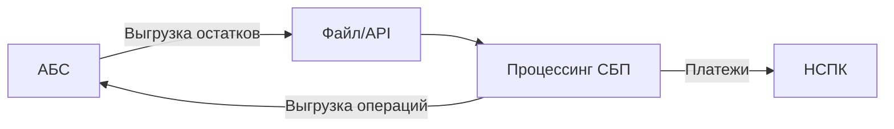

# Платежный клиринг в процессинге системе

## 👤 **Kirill**

платежный клиринг в процессинговой системе

---

## 🤖 **DeepSeek**

### **Платежный клиринг в процессинговой системе**  

**Клиринг** (англ. *clearing* — очистка) — это процесс взаимного зачета финансовых требований и обязательств между участниками платежной системы (банками, эквайерами, эмитентами, платежными шлюзами и т. д.).  

В **процессинговой системе** клиринг играет ключевую роль, так как обеспечивает расчеты между сторонами после проведения транзакций.  

---

## **1. Основные этапы клиринга в процессинге**  

### **1.1. Авторизация транзакции**  
- Покупатель совершает платеж (например, картой или электронным кошельком).  
- Запрос отправляется в процессинговый центр, который проверяет данные (достаточность средств, статус карты и т. д.).  
- Если проверка успешна, транзакция **авторизуется**, но деньги еще не переведены.  

### **1.2. Фиксация транзакций (бэтчинг)**  
- Торговые точки (мерчанты) формируют **транзакционные пакеты (бэтчи)** и отправляют их в процессинговый центр.  
- Обычно это происходит в конце дня или по расписанию.  

### **1.3. Клиринг (взаимозачет)**  
- Процессинговый центр анализирует все транзакции и определяет, сколько денег должны получить мерчанты и сколько должны списать банки-эмитенты.  
- Формируются **клиринговые файлы**, которые передаются в расчетный банк или платежную систему (Visa, Mastercard и др.).  

### **1.4. Расчеты между банками (сеттльмент)**  
- На основе клиринговых данных деньги списываются со счетов банков-эмитентов (карт покупателей) и зачисляются на счета банков-эквайеров (торговых точек).  
- Обычно расчеты происходят в течение **1–3 дней** (T+1, T+2).  

---

## **2. Участники клиринга**  

| Участник | Роль |
|----------|------|
| **Банк-эмитент** | Выпускает карты, списывает деньги со счетов клиентов |
| **Банк-эквайер** | Обслуживает мерчантов, зачисляет деньги на их счета |
| **Процессинговый центр** | Обрабатывает транзакции, проводит клиринг |
| **Платежная система (Visa, MC, МИР)** | Обеспечивает правила клиринга и сеттльмента |
| **Расчетный банк** | Выполняет финальные переводы между участниками |

---

## **3. Виды клиринга**  

### **3.1. Многосторонний клиринг**  
- Используется в международных платежных системах (Visa, Mastercard).  
- Все транзакции агрегируются, и расчеты происходят через центральный клиринговый хаб.  

### **3.2. Двусторонний клиринг**  
- Прямые расчеты между банком-эмитентом и банком-эквайером (например, в локальных платежных системах).  

### **3.3. Внутрибанковский клиринг**  
- Если эквайер и эмитент — один и тот же банк, клиринг упрощается.  

---

## **4. Время проведения клиринга**  
- **Онлайн-клиринг** (редко, только для мгновенных платежей).  
- **Оффлайн-клиринг** (стандартный вариант, раз в сутки или по графику).  

---

## **5. Проблемы и риски клиринга**  
- **Ошибки в транзакциях** → необходимость ручных корректировок.  
- **Мошенничество** → отзыв платежей (чарджбэк).  
- **Задержки расчетов** → ликвидность мерчантов.  

---

### **Вывод**  
Клиринг в процессинге — это ключевой этап, который обеспечивает корректный расчет между всеми участниками платежной цепочки. Без него невозможны быстрые и безопасные переводы денег между банками и торговыми точками.  

Если нужно углубиться в какие-то аспекты (например, алгоритмы взаимозачета или особенности клиринга в конкретных платежных системах), уточните — разберём детальнее!

---

## 👤 **Kirill**

методы в soap

---

## 🤖 **DeepSeek**

### **Методы в SOAP (Simple Object Access Protocol)**  

SOAP — это протокол обмена структурированными сообщениями в распределённых системах, чаще всего используемый в **веб-сервисах (SOAP Web Services)**. В отличие от REST, SOAP строго стандартизирован и работает поверх **XML**.  

Одним из ключевых элементов SOAP-сервиса являются **методы** — операции, которые можно вызывать удалённо.  

---

## **1. Основные методы SOAP**  

В SOAP методы определяются в **WSDL (Web Services Description Language)**-файле, который служит контрактом между клиентом и сервером.  

### **1.1. Типы операций (по стилю обмена)**  
В SOAP есть два основных стиля взаимодействия:  

| Стиль | Описание | Пример |
|-------|----------|--------|
| **RPC (Remote Procedure Call)** | Вызов удалённой процедуры, как локальной | `<getUser><id>123</id></getUser>` |
| **Document (Document-style)** | Обмен XML-документами (более гибкий) | `<UserRequest><id>123</id></UserRequest>` |

### **1.2. Пример SOAP-запроса (RPC-style)**  
```xml
<soap:Envelope xmlns:soap="http://schemas.xmlsoap.org/soap/envelope/">
  <soap:Body>
    <getUser xmlns="http://example.com/ws">
      <id>123</id>
    </getUser>
  </soap:Body>
</soap:Envelope>
```

### **1.3. Пример SOAP-ответа**  
```xml
<soap:Envelope xmlns:soap="http://schemas.xmlsoap.org/soap/envelope/">
  <soap:Body>
    <getUserResponse xmlns="http://example.com/ws">
      <user>
        <id>123</id>
        <name>John Doe</name>
      </user>
    </getUserResponse>
  </soap:Body>
</soap:Envelope>
```

---

## **2. Основные HTTP-методы в SOAP**  
Хотя SOAP работает поверх **HTTP**, он **не зависит** от REST-подобных методов (GET, POST, PUT, DELETE). В SOAP все вызовы обычно отправляются через:  

- **POST** (основной метод, используется в 99% случаев)  
- **GET** (редко, только для простых запросов)  

### **Пример HTTP-заголовка для SOAP**  
```http
POST /UserService HTTP/1.1
Host: example.com
Content-Type: text/xml; charset=utf-8
Content-Length: 250
SOAPAction: "http://example.com/ws/getUser"
```

> **SOAPAction** — заголовок, указывающий, какой метод вызывается (в WSDL он соответствует `<soap:operation>`).  

---

## **3. Типы методов в WSDL**  
WSDL описывает методы веб-сервиса в секции `<portType>` (или `<interface>` в WSDL 2.0).  

### **3.1. Пример WSDL с методами**  
```xml
<definitions xmlns="http://schemas.xmlsoap.org/wsdl/"
            targetNamespace="http://example.com/ws">
  
  <!-- Типы данных (XML Schema) -->
  <types>
    <xsd:schema>
      <xsd:element name="getUser">
        <xsd:complexType>
          <xsd:sequence>
            <xsd:element name="id" type="xsd:int"/>
          </xsd:sequence>
        </xsd:complexType>
      </xsd:element>
    </xsd:schema>
  </types>

  <!-- Операции (методы) -->
  <portType name="UserService">
    <operation name="getUser">
      <input message="tns:getUserRequest"/>
      <output message="tns:getUserResponse"/>
    </operation>
  </portType>

  <!-- Привязка к SOAP -->
  <binding name="UserServiceSOAP" type="tns:UserService">
    <soap:binding style="rpc" transport="http://schemas.xmlsoap.org/soap/http"/>
    <operation name="getUser">
      <soap:operation soapAction="http://example.com/ws/getUser"/>
      <input><soap:body use="literal"/></input>
      <output><soap:body use="literal"/></output>
    </operation>
  </binding>
</definitions>
```

### **3.2. Основные элементы WSDL для методов**  
- `<portType>` (или `<interface>`) — определяет доступные операции.  
- `<operation>` — описывает метод (например, `getUser`).  
- `<input>` и `<output>` — входные и выходные параметры.  
- `<binding>` — привязка к SOAP/HTTP.  

---

## **4. Популярные SOAP-методы в реальных API**  
Некоторые распространённые методы в SOAP-сервисах:  

| Метод | Описание |
|-------|----------|
| **getUser** | Получение данных пользователя по ID |
| **createOrder** | Создание заказа |
| **checkPaymentStatus** | Проверка статуса платежа |
| **getBalance** | Запрос баланса счёта |
| **sendTransaction** | Отправка транзакции |

---

## **5. Отличие SOAP-методов от REST**  
| Характеристика | SOAP | REST |
|---------------|------|------|
| **Протокол** | Только XML | JSON, XML, TEXT |
| **Методы** | Все через POST (реже GET) | GET, POST, PUT, DELETE |
| **Стандартизация** | Жёсткая (WSDL) | Гибкая |
| **Кэширование** | Нет | Да |
| **Использование** | Банки, платежи, корп. системы | Мобильные приложения, веб-API |

---

### **Вывод**  
Методы в SOAP — это операции, описанные в WSDL и вызываемые через XML-запросы. В отличие от REST, SOAP строго типизирован и требует чёткого описания контракта.  

Если нужно разобрать **конкретный пример SOAP-запроса или WSDL** — уточните, помогу детализировать!

---

## 👤 **Kirill**

Сформулируй вопрос для заказчика по негативным сценариям процесса переводов СБП из контекста: 

Нужно определить унифицированный негативный ответ для клиентов по операциям сбп кроме ответов инициируемых НСПК

Видение что отказ в выполнении операции (не по техничиским причинам) будет с кодом Http 422 - Невозможно выполнить операцию на бизнес уровнеДля большей детализации нужны коды ошибок от систем с которыми будет интегрироваться процессинговая система.

Какая детализация нужна для кодов ошибок от систем?Текст отказа (какой текст допустим для клиента)?

т.е. получается нужны справочники с описанием ошибок от систем и переменные на которые будут мапится негативные ответы для клиентов

---

## 🤖 **DeepSeek**

### **Вопрос для заказчика по негативным сценариям переводов СБП**  

**Тема:** Унификация негативных ответов клиентам при отказах в операциях СБП (не связанных с техническими сбоями НСПК).  

**Контекст:**  
Мы планируем обрабатывать отказы в выполнении операций СБП (например, недостаток средств, блокировка счёта, ограничения лимитов) с HTTP-статусом **422 (Unprocessable Entity)** и детализированными кодами ошибок.  

**Уточнения для заказчика:**  

1. **Детализация кодов ошибок от внешних систем**  
   - Какие системы (банки, ФИС, антифрод и др.) будут передавать ошибки в процессинг?  
   - Есть ли у них стандартизированные справочники ошибок (например, `REJECT_REASON` от банка, коды ФИС)?  
   - Нужно ли группировать ошибки по типам (например, "Недостаточно средств", "Счёт заблокирован", "Превышен лимит")?  

2. **Формат и содержание текста отказа для клиента**  
   - Должен ли текст быть унифицированным (например, *"Операция отклонена по причине: [причина]"*) или кастомизированным под каждый сценарий?  
   - Какие переменные допустимы в сообщении (например, `{error_code}`, `{limit_amount}`, `{account}`)?  
   - Есть ли требования к тональности (нейтральная, техническая, дружелюбная)?  

3. **Справочники ошибок и маппинг**  
   - Нужно ли создавать внутренний справочник ошибок процессинга с маппингом на коды внешних систем?  
   - Как обрабатывать ошибки, которые не должны показываться клиенту (например, внутренние сбои валидации)?  

4. **Примеры ожидаемых ответов**  
   - **HTTP 422 + JSON:**  
     ```json
     {
       "error_code": "SBP_LIMIT_EXCEEDED",
       "message": "Превышен дневной лимит перевода: 100 000 ₽",
       "details": {
         "source_system": "BANK_X",
         "original_code": "LIMIT_DAILY_OVER"
       }
     }
     ```
   - Устраивает ли такой формат или нужна другая структура?  

**Цель:**  
Определить единый подход к обработке и отображению ошибок, чтобы клиенты получали понятные отказы, а поддержка могла быстро идентифицировать источник проблемы.  

**Дополнительно:**  
Если у заказчика есть примеры ошибок из текущей системы или интеграций, это ускорит разработку справочников.  

---

### **Короткая версия для письма/обсуждения:**  
*"Какая детализация ошибок от внешних систем (банки, ФИС и др.) необходима для маппинга в унифицированные негативные ответы клиентам при отказах в СБП? Нужны ли справочники кодов, и какие переменные (например, лимиты, номера счетов) допустимы в тексте сообщения? Есть ли примеры ожидаемых форматов ответов?"*  

Этот вопрос поможет согласовать стандартизацию ошибок без избыточной технической сложности.

---

## 👤 **Kirill**

как из абс мигрировать остатки по счетам в систему процессинга СБП платежей? Предполагается, что мастер системой по платежам должна стать процессинговая система. Бух учет и любые отчеты  остаются в АБС

---

## 🤖 **DeepSeek**

### **Миграция остатков по счетам из АБС в процессинговую систему СБП**  

**Цель:** Перенос остатков по счетам клиентов из АБС в процессинговую систему СБП, чтобы последняя стала мастер-системой для платежей, при этом бухгалтерский учет и отчетность остаются в АБС.  

#### **1. Подготовка данных в АБС**  
Перед миграцией необходимо:  
✅ **Выгрузить актуальные остатки** по всем счетам клиентов на определенную дату (например, конец операционного дня).  
✅ **Провести сверку** (реконсиляцию) данных между АБС и будущей процессинговой системой.  
✅ **Определить формат передачи** (CSV, XML, API, прямой доступ к БД).  

#### **2. Выбор механизма миграции**  
Варианты передачи данных:  

| **Способ** | **Плюсы** | **Минусы** | **Когда использовать** |  
|------------|-----------|------------|----------------------|  
| **Единоразовый выгрузка + загрузка** (CSV/XML) | Простота, минимальные доработки | Риск расхождений при обновлениях | Если миграция однократная |  
| **API-интеграция в реальном времени** | Актуальные данные, автоматизация | Сложность настройки, нагрузка | Если АБС поддерживает API |  
| **Репликация БД (DWH, Change Data Capture)** | Автоматическое обновление | Требует администрирования БД | Для больших объемов данных |  

#### **3. Процесс миграции**  
**Шаг 1. Выгрузка из АБС**  
- Формат: `account_id, client_id, balance, currency, status` (пример CSV):  
  ```csv
  123456,100500,15000.50,RUB,ACTIVE
  789012,100501,500.00,USD,BLOCKED
  ```  
- Фильтрация: только активные счета с ненулевыми остатками.  

**Шаг 2. Валидация данных**  
- Проверка на дубликаты счетов.  
- Контроль корректности валют и статусов.  

**Шаг 3. Загрузка в процессинговую систему**  
- Через **REST API** (если поддерживается):  
  ```http
  POST /api/v1/accounts/import
  Body: { "accounts": [ { "account_id": "123456", "balance": 15000.50, ... } ] }
  ```  
- Через **файловый импорт** (если API нет).  

**Шаг 4. Сверка остатков**  
- Сравнение итоговых сумм в АБС и процессинге.  
- Логирование расхождений для ручной корректировки.  

#### **4. Поддержание актуальности**  
После миграции:  
🔹 **Для новых счетов:** Автоматическая синхронизация через API или ночные выгрузки.  
🔹 **Для изменений остатков:**  
- **Вариант A:** Периодическая (ежедневная) выгрузка из АБС.  
- **Вариант B:** Триггеры в АБС на изменение баланса → вебхук в процессинг.  

#### **5. Бухгалтерский учет**  
- **АБС остается источником истины** для отчетности и балансов.  
- **Процессинговая система** отражает только операционные остатки для платежей СБП.  
- **Реконсиляция:** Ежедневное закрытие дня с выгрузкой проводок из процессинга в АБС.  

#### **6. Пример архитектуры**  


#### **7. Риски и решения**  
- **Расхождения в остатках:** Внедрить механизм ручной коррекции через админ-панель.  
- **Задержки синхронизации:** Использовать очередь сообщений (Kafka, RabbitMQ).  
- **Ошибки формата:** Валидация данных перед загрузкой.  

**Итог:**  
Миграция требует четкого плана выгрузки, загрузки и регулярной сверки. Оптимальный вариант — комбинация первоначального импорта + API для обновлений.  

Если нужна помощь с выбором инструментов или настройкой интеграции — уточните детали!

---

