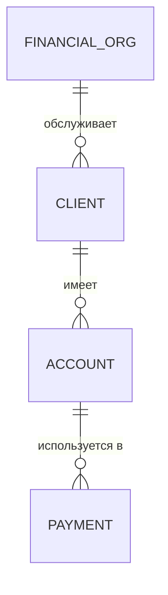

# Процесс проведения платежей СБП B2C

## 👤 **Kirill**

Как бизнес-аналитик опиши процесс на основании sequence диаграммы по шаблону:

Процесс: "uml name"
Краткое описание: Проведение платежей СБП B2C по сценарию "Прочие выплаты физическому лицу"
Бизнес-цель:
Действующие лица:
Предусловия:
Ограничения:
Инициирующее событие:
Ожидаемый результат:
Разделы: Инициализация(проверка возможности выполнения платежа)
Выполнение операции (холдирование, списание средств и т.д.) 
Финализация(информирование и т.д.)

Важно! Сохрани нумерацию шагов при описании процесса


@startuml B2C_SBP_Processing_Sequence


actor Payer
participant API 
participant NSPK 
participant Core
participant EDO
participant SFD
participant FinMon
participant ABS
participant SBM
participant Payments
participant CFT


Autonumber 1.1
Payer -> Core : Запрос на проведение операции СБП 
Core -> EDO : Запрос на проведение проверки подписи и полномочий
Core <-- EDO : Ответ на запрос на проведение проверки подписи и полномочий 

group#cadetblue Подпись корректна
	Core -> EDO : Запрос на подписание и регистрацию исходящего ответа
    EDO --> Core : Ответ на запрос на подписание и регистрцию исходящего ответа
	Core -> API : Запрос на провдение операции СБП
end


Core -> SFD : Запрос на проведение проверок скоринга

group#cadetblue Успешный Скоринг
	Core <-- SFD : Ответ на запрос проведения проверок скоринга
	Core -> EDO : Запрос на подписание и регистрацию исходящего ответа
	EDO --> Core : Ответ на запрос на подписание и регистрцию исходящего ответа
end

Core -> API : Запрос на провдение операции СБП
API -> NSPK : Запрос подтверждения Операции СБП от БПл (D01)
NSPK --> API : Ответ на запрос подтверждения Операции СБП от ОПКЦ СБП (D02)
API --> Core : Платежные реквизиты  по операции СБП


Core -> SFD : Платежные реквизиты  по операции СБП

group#cadetblue Успешный контроль реквизитов SFD
	Core <-- SFD : Результат контроля платежных реквизитов
	Core -> EDO : Запрос на подписание и регистрацию исходящего ответа
	EDO --> Core : Ответ на запрос на подписание и регистрцию исходящего ответа 
end

Core -> FinMon : Платежные реквизиты  по операции СБП
 

group#cadetblue Успешный контроль реквизитов FinMon
	Core <-- SFD :  Результат контроля платежных реквизитов
	Core -> EDO : Запрос на подписание и регистрацию исходящего ответа
	EDO --> Core : Ответ на запрос на подписание и регистрцию исходящего ответа
end

group#Gold Для операций возврата B2C
	Core -> Core : Проверка операции на сооответствие требованиям валютного контроля
	
end


Core -> Payer : Запрос подтверждения Операции СБП клиентом
Payer --> Core : Подтверждение на проведение операции СБП


Core -> EDO : Запрос на проведение проверки подписи и полномочий
  

group#Gold Подпись корректна
	Core <-- EDO : Ответ на запрос на проведение проверки подписи и полномочий
	Core -> EDO : Запрос на подписание и регистрацию исходящего ответа
EDO --> Core : Ответ на запрос на подписание и регистрцию исходящего ответа
   
end


Core -> Core : Контроль достаточности лимита / ликвидности для проведения платежа
Activate Core 
Core -> Core : Резервирование средств

deactivate Core


group#Gold Низкий уровень ликвидности
	Core -> SBM : Уведомление о предельном уровне лимита / ликвидности
      
end

Core -> API : Подтверждение о резервировании средств


API -> NSPK : Распоряжение на выполнение Операции СБП от БПл (D05)


API <-- NSPK : Ответ на распоряжение на выполнение Операции СБП от ОПКЦ СБП (D06)
 

API <-- NSPK : Уведомление БПл о финальном статусе Операции СБП от ОПКЦ СБП (D21)
 

API -> NSPK : Подтверждение получения уведомления о финальном статусе Операции СБП от БПл (D22)


API --> Core : Подтверждение о выполнения операции СБП


API --> Core : Callback по операции
 

Core -> EDO : Запрос на подписание и регистрацию исходящего ответа


EDO --> Core : Ответ на запрос на подписание и регистрцию исходящего ответа
 

Core --> Payer : Callback по операции


EDO --> Payer : Уведомление о зачислении / списании средсв со счета camt.054
 

Core -> EDO : Уведомление о зачислении / списании средсв со счета camt.054


EDO -> Payer : Уведомление о зачислении / списании средсв со счета camt.054


Core -> Payments : Подтверждение о выполнении операции СБП

Payments -> ABS  : Подтверждение о выполнении операции СБП


ABS -> CFT : Данные по проведенной операции В2С


ABS -> API : Информация о состоянии счетов


@enduml

---

## 🤖 **DeepSeek**

### **Процесс: "B2C_SBP_Processing_Sequence"**  
**Краткое описание:** Проведение платежей СБП B2C по сценарию "Прочие выплаты физическому лицу".  

**Бизнес-цель:** Обеспечение безопасного и корректного проведения платежей через Систему быстрых платежей (СБП) между бизнесом и физическим лицом.  

**Действующие лица:**  
- **Payer** (Плательщик)  
- **API** (Интерфейс взаимодействия с СБП)  
- **NSPK** (Национальная система платежных карт / ОПКЦ СБП)  
- **Core** (Ядро платежной системы)  
- **EDO** (Электронный документооборот)  
- **SFD** (Сервис финансового контроля)  
- **FinMon** (Финансовый мониторинг)  
- **ABS** (Абонентская система)  
- **SBM** (Система балансового мониторинга)  
- **Payments** (Платежный модуль)  
- **CFT** (Система учета транзакций)  

**Предусловия:**  
- Плательщик авторизован в системе.  
- Доступ к СБП подтвержден.  
- У плательщика есть необходимые средства для проведения платежа.  

**Ограничения:**  
- Соблюдение требований валютного контроля (для операций возврата).  
- Контроль ликвидности и лимитов.  
- Проверка подписи и полномочий.  

**Инициирующее событие:** Плательщик отправляет запрос на проведение операции СБП.  

**Ожидаемый результат:** Успешное проведение платежа с уведомлением плательщика о зачислении/списании средств.  

---

### **Разделы процесса:**  

#### **1. Инициализация (проверка возможности выполнения платежа)**  
1.1 **Payer → Core:** Запрос на проведение операции СБП.  
1.2 **Core → EDO:** Запрос на проверку подписи и полномочий.  
1.3 **Core ← EDO:** Ответ о корректности подписи.  

**Если подпись корректна:**  
1.4 **Core → EDO:** Запрос на подписание и регистрацию исходящего ответа.  
1.5 **Core ← EDO:** Подтверждение подписания.  
1.6 **Core → API:** Запрос на проведение операции СБП.  

1.7 **Core → SFD:** Запрос на проверку скоринга.  

**Если скоринг успешен:**  
1.8 **Core ← SFD:** Ответ с результатом скоринга.  
1.9 **Core → EDO:** Запрос на подписание ответа.  
1.10 **Core ← EDO:** Подтверждение подписания.  

1.11 **Core → API:** Запрос на проведение операции СБП.  
1.12 **API → NSPK:** Запрос подтверждения операции (D01).  
1.13 **API ← NSPK:** Ответ от СБП (D02).  
1.14 **API → Core:** Передача платежных реквизитов.  

1.15 **Core → SFD:** Передача реквизитов для контроля.  

**Если контроль SFD успешен:**  
1.16 **Core ← SFD:** Результат контроля.  
1.17 **Core → EDO:** Запрос на подписание ответа.  
1.18 **Core ← EDO:** Подтверждение подписания.  

1.19 **Core → FinMon:** Передача реквизитов для финмониторинга.  

**Если контроль FinMon успешен:**  
1.20 **Core ← FinMon:** Результат контроля.  
1.21 **Core → EDO:** Запрос на подписание ответа.  
1.22 **Core ← EDO:** Подтверждение подписания.  

**Для операций возврата B2C:**  
1.23 **Core → Core:** Проверка валютного контроля.  

---

#### **2. Выполнение операции (холдирование, списание средств и т.д.)**  
2.1 **Core → Payer:** Запрос подтверждения операции.  
2.2 **Core ← Payer:** Подтверждение плательщика.  

2.3 **Core → EDO:** Проверка подписи и полномочий.  

**Если подпись корректна:**  
2.4 **Core ← EDO:** Ответ о корректности.  
2.5 **Core → EDO:** Запрос на подписание ответа.  
2.6 **Core ← EDO:** Подтверждение подписания.  

2.7 **Core → Core:** Контроль ликвидности и лимитов.  
2.8 **Core → Core:** Резервирование средств.  

**Если ликвидность низкая:**  
2.9 **Core → SBM:** Уведомление о предельном уровне ликвидности.  

2.10 **Core → API:** Подтверждение резервирования.  
2.11 **API → NSPK:** Распоряжение на выполнение операции (D05).  
2.12 **API ← NSPK:** Ответ от СБП (D06).  
2.13 **API ← NSPK:** Уведомление о финальном статусе (D21).  
2.14 **API → NSPK:** Подтверждение получения (D22).  

2.15 **API → Core:** Подтверждение выполнения операции.  
2.16 **API → Core:** Callback по операции.  

---

#### **3. Финализация (информирование и т.д.)**  
3.1 **Core → EDO:** Запрос на подписание ответа.  
3.2 **Core ← EDO:** Подтверждение подписания.  
3.3 **Core → Payer:** Callback по операции.  

3.4 **EDO → Payer:** Уведомление о зачислении/списании (camt.054).  
3.5 **Core → EDO:** Передача уведомления.  
3.6 **EDO → Payer:** Отправка уведомления клиенту.  

3.7 **Core → Payments:** Подтверждение выполнения операции.  
3.8 **Payments → ABS:** Передача подтверждения.  
3.9 **ABS → CFT:** Фиксация данных операции.  
3.10 **ABS → API:** Обновление состояния счетов.  

**Процесс завершен.**

---

## 👤 **Kirill**

напиши более развернуто только пошаговое описание процесса

---

## 🤖 **DeepSeek**

### **Развернутое пошаговое описание процесса: "Проведение платежей СБП B2C (Прочие выплаты физическому лицу)"**  

#### **1. Инициализация (проверка возможности выполнения платежа)**  

1. **Запрос на проведение операции**  
   - **Payer → Core**: Плательщик инициирует платеж, отправляя запрос в ядро системы (Core).  

2. **Проверка подписи и полномочий**  
   - **Core → EDO**: Ядро системы направляет запрос в систему электронного документооборота (EDO) для проверки подписи и полномочий плательщика.  
   - **Core ← EDO**: EDO возвращает результат проверки.  

3. **Обработка успешной проверки подписи** *(если подпись корректна)*  
   - **Core → EDO**: Запрос на подписание и регистрацию исходящего ответа.  
   - **Core ← EDO**: Подтверждение подписания и регистрации.  
   - **Core → API**: Передача запроса в API для дальнейшей обработки платежа.  

4. **Проверка скоринга (антифрод)**  
   - **Core → SFD**: Запрос в систему финансового контроля (SFD) для проверки платежа на мошенничество.  
   - **Core ← SFD**: Получение результата скоринга.  

5. **Обработка успешного скоринга** *(если проверка пройдена)*  
   - **Core → EDO**: Запрос на подписание ответа.  
   - **Core ← EDO**: Подтверждение подписания.  

6. **Подтверждение операции в СБП**  
   - **Core → API**: Запрос на проведение платежа.  
   - **API → NSPK**: Отправка запроса в НСПК (СБП) на подтверждение операции (D01).  
   - **API ← NSPK**: Получение ответа от СБП (D02) с платежными реквизитами.  
   - **API → Core**: Передача реквизитов в Core.  

7. **Контроль платежных реквизитов в SFD**  
   - **Core → SFD**: Передача реквизитов для дополнительной проверки.  
   - **Core ← SFD**: Получение результата проверки.  

8. **Обработка успешного контроля реквизитов**  
   - **Core → EDO**: Запрос на подписание ответа.  
   - **Core ← EDO**: Подтверждение подписания.  

9. **Проверка в финансовом мониторинге (FinMon)**  
   - **Core → FinMon**: Передача данных для проверки на соответствие AML/CFT.  
   - **Core ← FinMon**: Получение результата проверки.  

10. **Обработка успешного финмониторинга**  
    - **Core → EDO**: Запрос на подписание ответа.  
    - **Core ← EDO**: Подтверждение подписания.  

11. **Дополнительная проверка для операций возврата** *(если платеж — возврат)*  
    - **Core → Core**: Проверка соответствия требованиям валютного контроля.  

---

#### **2. Выполнение операции (резервирование и списание средств)**  

12. **Запрос подтверждения у плательщика**  
    - **Core → Payer**: Запрос подтверждения операции (например, через СМС/пуш-уведомление).  
    - **Core ← Payer**: Получение подтверждения.  

13. **Повторная проверка подписи** *(если требуется)*  
    - **Core → EDO**: Запрос на проверку подписи.  
    - **Core ← EDO**: Подтверждение корректности.  

14. **Резервирование средств**  
    - **Core → Core**: Проверка ликвидности и лимитов.  
    - **Core → Core**: Блокировка суммы платежа (холдирование).  

15. **Уведомление о низкой ликвидности** *(если средств недостаточно)*  
    - **Core → SBM**: Отправка предупреждения в систему балансового мониторинга.  

16. **Подтверждение резервирования в СБП**  
    - **Core → API**: Передача подтверждения о резервировании.  
    - **API → NSPK**: Отправка распоряжения на выполнение платежа (D05).  
    - **API ← NSPK**: Получение ответа от СБП (D06).  

17. **Финальное уведомление от СБП**  
    - **API ← NSPK**: Получение статуса завершения операции (D21).  
    - **API → NSPK**: Подтверждение получения (D22).  

18. **Фиксация завершения операции**  
    - **API → Core**: Передача финального статуса платежа.  
    - **API → Core**: Callback с деталями операции.  

---

#### **3. Финализация (уведомления и учет)**  

19. **Формирование подтверждающих документов**  
    - **Core → EDO**: Запрос на подписание финального уведомления.  
    - **Core ← EDO**: Подтверждение подписания.  

20. **Уведомление плательщика**  
    - **Core → Payer**: Отправка callback с результатом платежа.  
    - **EDO → Payer**: Отправка официального уведомления (camt.054) о списании/зачислении средств.  

21. **Учет операции в платежной системе**  
    - **Core → Payments**: Передача данных о завершенной операции.  
    - **Payments → ABS**: Фиксация в абонентской системе.  
    - **ABS → CFT**: Передача данных в систему учета транзакций.  

22. **Обновление балансов**  
    - **ABS → API**: Синхронизация состояния счетов.  

**Процесс завершен: платеж успешно проведен, все участники уведомлены.**  

### **Ключевые особенности:**  
- **Двухэтапная проверка подписи** (в начале и перед списанием).  
- **Многоуровневый контроль** (антифрод, финмониторинг, валютный контроль).  
- **Резервирование средств** перед финальным списанием.  
- **Автоматизированные уведомления** через EDO и API.  
- **Интеграция с НСПК (СБП)** по стандартизированным сообщениям (D01, D02, D05, D06, D21, D22).  

Этот процесс обеспечивает безопасность, соответствие регуляторным требованиям и оперативность обработки платежей.

---

## 👤 **Kirill**

что такое трассировка логов

---

## 🤖 **DeepSeek**

### **Трассировка логов (Log Tracing)**
**Трассировка логов** — это процесс сбора, анализа и отслеживания последовательности событий (логов) в распределенных системах для понимания выполнения транзакции или запроса. Она помогает выявлять проблемы, оптимизировать производительность и обеспечивать прозрачность работы системы.

---

## **1. Основные понятия**
### **1.1. Лог (Log)**
- Запись о событии в системе (например, "Пользователь авторизован", "Ошибка при обработке платежа").
- Содержит:
  - **Временную метку** (когда произошло).
  - **Уровень логирования** (INFO, WARN, ERROR, DEBUG).
  - **Контекст** (ID транзакции, пользователь, система).

### **1.2. Трассировка (Trace)**
- **Цепочка связанных логов**, отражающая путь выполнения запроса через несколько сервисов.
- Пример:  
  ```
  Платеж ID:123 → Проверка баланса → Списание → Уведомление → Успех
  ```

### **1.3. Span (Сегмент трассировки)**
- Отдельный этап выполнения операции в рамках трассы (например, "Проверка подписи", "Резервирование средств").
- Имеет:
  - **Span ID** (уникальный идентификатор).
  - **Parent Span ID** (связь с родительским этапом).
  - **Время начала и окончания**.

---

## **2. Зачем нужна трассировка логов?**
| **Проблема**               | **Как помогает трассировка**                          |
|----------------------------|------------------------------------------------------|
| Поиск ошибок в микросервисах | Показывает, в каком сервисе и на каком этапе упал запрос. |
| Анализ медленных запросов   | Выявляет узкие места (например, долгий вызов API).   |
| Мониторинг бизнес-процессов | Отслеживает выполнение сложных транзакций (например, платежей). |
| Расследование инцидентов   | Восстанавливает цепочку событий перед сбоем.          |

---

## **3. Как работает трассировка?**
### **3.1. Идентификаторы трассировки**
- **Trace ID** — уникальный ID для всей транзакции (например, `7a3b5c2d`).  
- **Span ID** — ID каждого этапа (например, `a1b2c3`).  
- Пример заголовков HTTP:  
  ```http
  X-Trace-ID: 7a3b5c2d
  X-Span-ID: a1b2c3
  ```

### **3.2. Пример трассировки платежа**
1. **Клиент → API**  
   - `TraceID=7a3b5c2d, SpanID=abc123` → "Начало платежа".
2. **API → Core**  
   - `TraceID=7a3b5c2d, SpanID=def456 (Parent: abc123)` → "Проверка подписи".
3. **Core → SFD**  
   - `TraceID=7a3b5c2d, SpanID=ghi789 (Parent: def456)` → "Антифрод-проверка".
4. **Ошибка в SFD** → В логах видно, что проблема на этом этапе.

### **3.3. Инструменты для трассировки**
- **OpenTelemetry** — открытый стандарт для сбора логов и метрик.
- **Jaeger** / **Zipkin** — системы визуализации трассировок.
- **ELK Stack (Elasticsearch, Logstash, Kibana)** — анализ и поиск логов.
- **Sentry** — мониторинг ошибок с привязкой к трассировке.

---

## **4. Пример из вашей Sequence-диаграммы**
В процессе **B2C-платежа через СБП** трассировка поможет:
1. Найти, почему платеж завис (например, задержка в NSPK).
2. Увидеть, на каком этапе failed скоринг в SFD.
3. Измерить время выполнения каждого шага (например, "Резервирование средств заняло 2 сек").

---

## **5. Best Practices**
✅ **Сквозная идентификация** — передавать `TraceID` между всеми сервисами.  
✅ **Логировать контекст** — добавлять `UserID`, `PaymentID` в логи.  
✅ **Настроить алерты** — если трассировка показывает ошибки в критичных этапах.  
✅ **Хранить логи структурированно** (JSON вместо текста).  

---
### **Вывод**
Трассировка логов — это "чёрный ящик" для сложных систем. Без нее анализ ошибок превращается в поиск иголки в стоге сена. В вашем B2C-платежном процессе она особенно важна из-за множества интеграций (СБП, EDO, SFD).

---

## 👤 **Kirill**

trace id уникальный?

---

## 🤖 **DeepSeek**

### **Является ли Trace ID уникальным?**  
**Да, Trace ID должен быть глобально уникальным** для каждой отдельной транзакции (запроса) в распределённой системе. Это ключевое требование для корректной трассировки.

---

## **1. Почему Trace ID должен быть уникальным?**
- **Идентификация всей цепочки операций**. Даже если запрос проходит через 10 микросервисов, все связанные логи будут иметь один и тот же `Trace ID`.  
- **Избежание коллизий**. Если два разных запроса получат одинаковый `Trace ID`, их логи смешаются, и трассировка станет невозможной.  
- **Поддержка распределённых систем**. Уникальность гарантирует, что логи из разных сервисов можно однозначно связать.

---

## **2. Как генерируется Trace ID?**
### **Стандартные методы генерации**  
1. **UUID/GUID** (например, `7a3b5c2d-4e5f-6a7b-8c9d-0e1f2a3b4c5d`)  
   - Вероятность коллизии крайне низка (практически нулевая).  
   - Пример инструментов: `java.util.UUID.randomUUID()`, Python `uuid.uuid4()`.  

2. **ULID** (Universally Unique Lexicographically Sortable Identifier)  
   - Сочетает уникальность и сортируемость по времени (например, `01H5Z7X9Y-3K4M5N6P7Q8R9S`).  

3. **Snowflake ID** (от Twitter)  
   - Генерируется на основе временной метки, номера ноды и последовательности.  

4. **Генерация на основе хеша**  
   - Например, комбинация: `[timestamp]-[random_hex]` → `1698765432-a1b2c3d4`.  

---

## **3. Где и как передаётся Trace ID?**
### **Механизмы передачи**  
- **HTTP-заголовки** (стандартные или кастомные):  
  ```http
  X-Trace-ID: 7a3b5c2d-4e5f-6a7b-8c9d-0e1f2a3b4c5d
  ```
- **Контекст выполнения** (для языков программирования):  
  - В Java — `MDC` (Mapped Diagnostic Context), `ThreadLocal`.  
  - В Python — `contextvars`, `OpenTelemetry Context`.  
- **Message Queues** (Kafka, RabbitMQ):  
  ```json
  {
    "headers": {
      "trace_id": "01H5Z7X9Y3K4M5N6P7Q8R9S"
    },
    "body": {...}
  }
  ```

### **Пример из вашей Sequence-диаграммы (платеж СБП)**  
1. **Payer → Core**:  
   - Генерируется `Trace ID = abc123`.  
2. **Core → EDO → SFD → NSPK**:  
   - Во всех вызовах передаётся тот же `Trace ID = abc123`.  
3. **Логирование**:  
   - В логах каждого сервиса будет указан `abc123`, что позволяет собрать полную историю платежа.

---

## **4. Что делать, если Trace ID дублируется?**  
Риск коллизии минимален, но в высоконагруженных системах возможен. Решения:  
1. **Использовать криптостойкие генераторы** (UUIDv4, ULID).  
2. **Добавлять префиксы** (например, `сервис_1-abc123`, `сервис_2-abc123`).  
3. **Валидировать уникальность** на уровне централизованного лог-агрегатора (например, Elasticsearch).  

---

## **5. Инструменты для работы с Trace ID**  
- **OpenTelemetry** — автоматически генерирует и передаёт `Trace ID` между сервисами.  
- **Jaeger/Zipkin** — визуализируют трассировки по уникальному `Trace ID`.  
- **Лог-агрегаторы** (ELK, Grafana Loki) — позволяют искать логи по `Trace ID`.  

---

### **Вывод**  
**Trace ID должен быть уникальным для каждого запроса**, иначе трассировка теряет смысл. Для генерации используют криптографически стойкие алгоритмы (UUID, ULID), а передача обеспечивается через заголовки или контекст выполнения. В вашем B2C-платежном процессе это критично для отслеживания транзакций между Core, EDO, NSPK и другими системами.  

**Пример корректной трассировки:**  
```
[2023-11-01 12:00:00] INFO  TraceID=abc123 – Платеж начат (Payer → Core).  
[2023-11-01 12:00:01] DEBUG TraceID=abc123 – Проверка подписи в EDO.  
[2023-11-01 12:00:02] ERROR TraceID=abc123 – Ошибка в SFD (антифрод).  
```

---

## 👤 **Kirill**

Может ли на post запрос прийти несколько ответов?

---

## 🤖 **DeepSeek**

### **Может ли на POST-запрос прийти несколько ответов?**  

**Короткий ответ:**  
❌ **Нет**, по стандарту HTTP/1.1 и HTTP/2 на один **POST**-запрос сервер должен вернуть **ровно один ответ** (код статуса + тело).  

**Но есть исключения и нюансы** ⚠️  

---

## **1. Стандартное поведение (HTTP/1.1, HTTP/2)**
По спецификации **RFC 7231** (HTTP/1.1):  
- **1 запрос → 1 ответ**.  
- Сервер обязан отправить только один финальный ответ (например, `200 OK` или `500 Error`).  

**Пример:**  
```http
POST /payment HTTP/1.1  
Host: example.com  

{ "amount": 1000 }  

HTTP/1.1 200 OK  
{"status": "success"}  
```

---

## **2. Когда возможны "множественные ответы"?**  
### **2.1. Чанки (Chunked Transfer Encoding)**  
Сервер может отправить **один ответ частями** (например, стриминг данных):  
```http
HTTP/1.1 200 OK  
Transfer-Encoding: chunked  

[часть 1 данных]  
[часть 2 данных]  
...  
```
**Это всё ещё один ответ**, просто разделённый на фрагменты.

### **2.2. Server-Sent Events (SSE)**  
Технология для **односторонней потоковой передачи** от сервера к клиенту:  
- Клиент отправляет **один POST-запрос**.  
- Сервер может присылать **множество событий** в одном соединении.  

**Пример:**  
```http
POST /updates HTTP/1.1  

HTTP/1.1 200 OK  
Content-Type: text/event-stream  

event: payment  
data: {"status": "processing"}  

event: payment  
data: {"status": "completed"}  
```
**Важно:** Это не отдельные ответы, а поток в рамках одного соединения.

### **2.3. WebSockets**  
После рукопожатия (HTTP-запроса) соединение переходит на **двустороннюю потоковую передачу**:  
- Клиент отправляет POST (как часть upgrade-запроса).  
- Далее обмен сообщениями идёт уже по протоколу WebSocket.  

**Это не HTTP-ответы**, а отдельные сообщения.

### **2.4. HTTP/3 (QUIC)**  
В HTTP/3 возможна **мультиплексированная передача**, но логика "1 запрос → 1 ответ" сохраняется.

---

## **3. Ошибочные сценарии**  
### **3.1. Сервер отправил два ответа**  
Иногда из-за багов сервер может попытаться отправить несколько ответов на один запрос.  
**Что произойдёт:**  
- Клиент (браузер, curl) обработает **только первый ответ**.  
- Последующие данные будут считаться мусором.  

**Пример (ошибка):**  
```http
POST /bugged-endpoint HTTP/1.1  

HTTP/1.1 200 OK  
{"status": "ok"}  

HTTP/1.1 500 Error  
{"error": "oops"}  // Клиент проигнорирует это.  
```

### **3.2. Прокси и балансировщики**  
Некорректно настроенный **Nginx/HAProxy** может:  
- Разорвать соединение после первого ответа.  
- Объединить несколько ответов в один (и сломать JSON/XML).  

---

## **4. Как обрабатывать "прогрессивные" ответы?**  
Если нужно получать несколько состояний операции (например, статус платежа):  
1. **Polling**: Клиент периодически опрашивает сервер (`GET /status`).  
2. **Webhooks**: Сервер отправляет уведомления на callback-URL.  
3. **SSE/WebSockets**: Для потоковой передачи в реальном времени.  

---

## **5. Вывод**  
✅ **По HTTP стандарту** на POST-запрос приходит **только один ответ**.  
⚠️ **Исключения**:  
   - Чанки (`Transfer-Encoding: chunked`).  
   - Server-Sent Events (SSE).  
   - WebSockets (после апгрейда соединения).  
❌ **Два ответа подряд** — это ошибка сервера или прокси.  

**Для вашего B2C-платежа:**  
- Используйте **webhooks** или **SSE**, если нужно получать несколько статусов (например, "списание → проведение → завершение").  
- Стандартный POST-запрос к СБП должен вернуть **один финальный ответ** (успех/ошибка).

---

## 👤 **Kirill**

как бизнес аналитик опиши входы и выходы процесса

---

## 🤖 **DeepSeek**

### **Описание входов и выходов процесса**  
**Процесс:** Проведение платежей СБП B2C по сценарию *"Прочие выплаты физическому лицу"*  

Как бизнес-аналитик, я структурирую входы и выходы процесса по стандартам **BABOK** (Business Analysis Body of Knowledge), используя категории:  
- **Входы (Inputs)** — что запускает процесс и какие данные нужны для его выполнения.  
- **Выходы (Outputs)** — результаты процесса, включая данные, статусы и уведомления.  

---

## **1. Входы (Inputs)**  
### **1.1. Инициирующие события**  
- **Запрос на проведение платежа** от плательщика (Payer) через интерфейс (API, мобильное приложение, личный кабинет).  
  *Пример:*  
  ```json
  {
    "amount": 10000,
    "recipient_phone": "+79123456789",
    "payer_account": "40817810000000000001",
    "currency": "RUB"
  }
  ```

### **1.2. Данные для выполнения процесса**  
- **Реквизиты платежа**:  
  - Сумма, валюта, номер телефона получателя, назначение платежа.  
- **Данные плательщика**:  
  - Идентификатор (ClientID), подпись запроса (для EDO), токен авторизации.  
- **Параметры СБП**:  
  - Лимиты, тарифы, правила валютного контроля (для операций возврата).  

### **1.3. Внешние интеграции**  
- **Ответы от сторонних систем**:  
  - Проверка подписи (EDO).  
  - Результат скоринга (SFD).  
  - Подтверждение от НСПК (D01, D02, D05, D06).  

---

## **2. Выходы (Outputs)**  
### **2.1. Основные результаты**  
- **Успешный платеж**:  
  - Финальный статус `200 OK` с деталями:  
    ```json
    {
      "status": "completed",
      "transaction_id": "12345",
      "timestamp": "2023-11-01T12:00:00Z"
    }
    ```  
  - Уведомление получателю (camt.054 через EDO).  

- **Ошибка платежа**:  
  - Код и описание ошибки (например, `403 Forbidden` от SFD из-за подозрения на мошенничество).  

### **2.2. Побочные выходы**  
- **Логи и трассировки**:  
  - Записи в Elasticsearch/Kibana с `TraceID` для аудита.  
- **Документы для регуляторов**:  
  - Подписанные ЭДО-документы (например, распоряжение на списание).  
- **Обновленные данные в системах**:  
  - Смена баланса в ABS (АБС), транзакция в CFT.  

### **2.3. Уведомления**  
- **Для плательщика**:  
  - СМС/email/push-уведомление о статусе (`Платеж проведен успешно`).  
- **Для внутренних систем**:  
  - Алёрты в SBM при низкой ликвидности.  

---

## **3. Схема входов-выходов**  
| **Категория**       | **Примеры**                                                                 |  
|----------------------|-----------------------------------------------------------------------------|  
| **Входы**           | Запрос от Payer, реквизиты платежа, подпись EDO, лимиты СБП.               |  
| **Выходы**          | Статус платежа, callback-уведомления, логи, обновленные балансы.           |  
| **Ошибки**          | `400 Bad Request`, `403 Forbidden (SFD)`, `500 Internal Server Error`.      |  

---

## **4. Особенности для вашего процесса (СБП B2C)**  
- **Критичные входы**:  
  - Корректная подпись EDO (иначе отказ на этапе 1.3).  
  - Успешный скоринг SFD (антифрод).  
- **Критичные выходы**:  
  - Фиксация платежа в НСПК (D21).  
  - Отправка camt.054 получателю.  

---

## **5. Проверка качества**  
Для каждого входа/выхода аналитик должен задать вопросы:  
1. **Входы**:  
   - Все ли обязательные поля есть в запросе? (валидация JSON Schema).  
   - Как обрабатываются некорректные подписи?  
2. **Выходы**:  
   - Все ли системы получили уведомления? (чек-лист: Core → EDO → ABS → CFT).  
   - Как фиксируются ошибки (например, таймаут NSPK)?  

---

### **Итог**  
Описание входов и выходов помогает:  
- Выявить **точки отказа** (например, зависимость от SFD).  
- Настроить **мониторинг** (алерты на ошибки).  
- Улучшить **документацию** для разработчиков и поддержки.  

**Дополнительно:** Для визуализации используйте **BPMN-диаграмму** с lanes (ролями) или **таблицу RACI** для ответственных за каждый выход.

---

## 👤 **Kirill**

Для бэк офиса нужны основные сущности: финансовая организация, клиент, счет 
Как описать эти сущности в рамках процесса?

---

## 🤖 **DeepSeek**

### **Описание сущностей для бэк-офиса в рамках процесса СБП B2C-платежей**  

Для обеспечения прозрачности и контроля в бэк-офисе необходимо четко определить ключевые сущности процесса:  
1. **Финансовая организация** (Банк/Платежная система).  
2. **Клиент** (Юрлицо/Физлицо).  
3. **Счет** (Банковский счет/Электронный кошелек).  

---

## **1. Финансовая организация**  
**Описание:** Юридическое лицо, имеющее лицензию на проведение платежей (например, банк или платежный сервис).  

### **Атрибуты:**  
| Поле               | Тип данных       | Описание                                  | Пример значения              |  
|---------------------|------------------|-------------------------------------------|-------------------------------|  
| `org_id`            | UUID             | Уникальный идентификатор                 | `b5a9e1d3-4f6c-8d2e-0a1b3c4d` |  
| `org_name`          | String           | Название организации                     | `Тинькофф Банк`              |  
| `license_number`    | String           | Номер лицензии ЦБ/НСПК                   | `1234-5678`                   |  
| `bic`               | String           | БИК банка                                | `044525974`                   |  
| `is_sbp_member`     | Boolean          | Участник Системы Быстрых Платежей (СБП)  | `true`                        |  

### **Роль в процессе:**  
- Проверяет легальность операций (через EDO, FinMon).  
- Резервирует средства на счетах.  
- Отправляет уведомления в НСПК (СБП).  

---

## **2. Клиент**  
**Описание:** Физическое или юридическое лицо, инициирующее или получающее платеж.  

### **Атрибуты:**  
| Поле               | Тип данных       | Описание                                  | Пример значения              |  
|---------------------|------------------|-------------------------------------------|-------------------------------|  
| `client_id`         | UUID             | Уникальный идентификатор                 | `a1b2c3d4-5e6f-7g8h-9i0j`     |  
| `client_type`       | Enum (B2C/B2B)   | Тип клиента                              | `B2C`                         |  
| `phone`             | String           | Номер телефона (для СБП)                 | `+79123456789`                |  
| `tax_id`            | String (опц.)    | ИНН (для юрлиц)                          | `7712345678`                  |  
| `signature_cert`    | String           | Сертификат ЭП (для EDO)                  | `-----BEGIN CERTIFICATE-----...` |  

### **Роль в процессе:**  
- Инициирует платеж (Payer).  
- Подтверждает операцию (через SMS/подпись).  
- Получает уведомления о статусе.  

---

## **3. Счет**  
**Описание:** Банковский счет или электронный кошелек, используемый для списания/зачисления средств.  

### **Атрибуты:**  
| Поле               | Тип данных       | Описание                                  | Пример значения              |  
|---------------------|------------------|-------------------------------------------|-------------------------------|  
| `account_id`        | UUID             | Уникальный идентификатор счета           | `acc_78901234`               |  
| `client_id`         | UUID             | Ссылка на клиента                        | `a1b2c3d4-5e6f-7g8h-9i0j`     |  
| `org_id`            | UUID             | Ссылка на финансовую организацию         | `b5a9e1d3-4f6c-8d2e-0a1b3c4d` |  
| `balance`           | Decimal          | Текущий баланс                           | `15000.50`                    |  
| `currency`          | String (ISO)     | Валюта счета                             | `RUB`                         |  
| `is_sbp_enabled`    | Boolean          | Возможность оплаты через СБП             | `true`                        |  

### **Роль в процессе:**  
- Источник списания средств (для плательщика).  
- Получатель средств (для выплат физлицу).  
- Контроль лимитов (через Core/SBM).  

---

## **4. Связи между сущностями**  
1. **Финансовая организация → Клиент** (1:M):  
   - Одна организация обслуживает множество клиентов.  
2. **Клиент → Счет** (1:M):  
   - У клиента может быть несколько счетов в одной или разных организациях.  
3. **Счет → Платеж** (1:M):  
   - Каждый платеж привязан к счету списания и зачисления.  



---

## **5. Пример использования в процессе**  
**Сценарий:** Платеж 10 000 ₽ с карты клиента на телефон через СБП.  

1. **Клиент** (`client_id=123`) отправляет запрос через API.  
2. **Финансовая организация** (`org_id=456`) проверяет:  
   - Подпись (через EDO).  
   - Баланс **счета** (`account_id=acc_789`).  
3. При успехе:  
   - Списание с `account_id=acc_789`.  
   - Зачисление на счет получателя по номеру телефона.  
   - Фиксация операции в **CFT** (с привязкой к `client_id` и `org_id`).  

---

## **6. Требования к данным для бэк-офиса**  
- **Аудит**: Все изменения балансов должны логироваться с `timestamp` и `transaction_id`.  
- **Отчетность**: Связь счетов с клиентами и организациями для регуляторов (ЦБ, НСПК).  
- **Валидация**:  
  - Проверка `is_sbp_enabled` перед проведением платежа.  
  - Контроль `currency` (рубли для СБП).  

--- 

### **Итог**  
Четкое описание сущностей позволяет:  
- Отслеживать **источники средств** (счета).  
- Идентифицировать **участников** (клиенты, банки).  
- Формировать **аналитические отчеты** (например, объем платежей B2C за месяц).  

**Рекомендация:** Дополнить ER-диаграммой в документации и примерами JSON-объектов для API.

---

