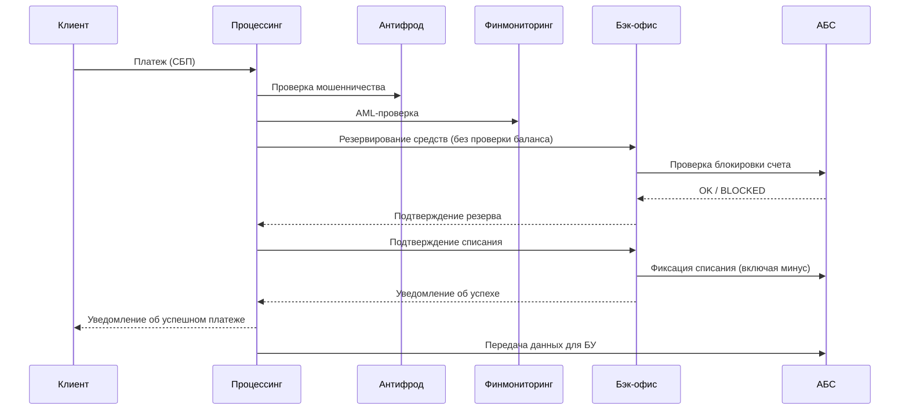

# Разница между авторизацией пользователей и систем

## 👤 **Kirill**

в чем разница авторизации пользователей и систем при взаимодействии через API?

---

## 🤖 **DeepSeek**

Разница между авторизацией пользователей и систем при взаимодействии через API заключается в том, **кто** и **с какой целью** проходит аутентификацию и авторизацию.  

### 🔹 **Авторизация пользователей (User Authentication/Authorization)**  
**Цель:** Проверить, кто такой пользователь и какие у него права.  
**Как работает:**  
- Пользователь вводит логин/пароль, использует OAuth, JWT, API-ключи и т. д.  
- Сервер API проверяет его учетные данные и решает, какие данные или действия ему доступны.  
**Примеры:**  
- Вход в мобильное приложение через Google OAuth.  
- Получение данных профиля пользователя после проверки JWT-токена.  

### 🔹 **Авторизация систем (System/Service Authentication/Authorization)**  
**Цель:** Убедиться, что запрос идет от доверенного сервиса/приложения, а не от злоумышленника.  
**Как работает:**  
- Сервис (например, микросервис или внешнее приложение) аутентифицируется с помощью API-ключа, сертификата (mTLS), OAuth для машин (Client Credentials Flow) и т. д.  
- API проверяет подлинность системы, а не конкретного пользователя.  
**Примеры:**  
- Микросервис запрашивает данные из другого сервиса с помощью API-ключа.  
- Внешний партнерский сервис получает доступ к API через mTLS (взаимную аутентификацию TLS).  

### 🔥 **Ключевые отличия**  
| Критерий | Авторизация пользователей | Авторизация систем |
|----------|--------------------------|--------------------|
| **Кто авторизуется** | Человек (или приложение от его имени) | Другое приложение/сервис |
| **Механизмы** | OAuth (Authorization Code, Implicit), JWT, Cookies | API-ключи, mTLS, OAuth (Client Credentials) |
| **Пример использования** | Пользователь заходит в приложение | Сервис синхронизирует данные с другим API |
| **Уровень доступа** | Зависит от роли пользователя | Зависит от доверия между системами |

### 💡 **Вывод**  
- **User Auth** — для людей, работающих с API через интерфейс.  
- **System Auth** — для машин, взаимодействующих между собой.  

Иногда они комбинируются: например, сервис аутентифицируется (System Auth), а затем передает токен пользователя (User Auth) для выполнения запроса.

---

## 👤 **Kirill**

опиши схему взаимодействия системы процессинга платежей (в которой проходит этап проверок платежа с помощью запросов в системы антифрод, финомниторинг и т.д.) с системой бэк-офиса (в которой проводится авторизация платежа: 1. резервирование средств 2. снятие резерва/списание средств). Важно учитывать, что текущий остаток (Ledger) не проверяется и даже если его не достаточно, то платеж должен списаться в минус. Исключением, когда платежи не могут проводиться, может быть только полная блокировка счета передаваемая АБС. 
Результат процесса:
1. проведенный платеж СБП
2. Уведомление процессинговой системы о выполнении платежа
3. Уведомление процессинговой системой АБС об успешно выполненном платеже с передачей транзакции для дальнейшего отражения в БУ

---

## 🤖 **DeepSeek**

### **Схема взаимодействия процессинга платежей и бэк-офиса**  

#### **Участники:**  
1. **Процессинг платежей** – отвечает за прием платежа, проверки (антифрод, финмониторинг), инициирование списания.  
2. **Бэк-офис** – отвечает за резервирование и списание средств, ведение лимитов.  
3. **АБС (Аналитическая банковская система)** – хранит балансы счетов, блокировки.  
4. **Внешние сервисы (антифрод, финмониторинг и др.)** – проводят дополнительные проверки.  

---

### **1. Последовательность запросов**  

#### **🔹 Шаг 1: Инициализация платежа (Процессинг → Внешние сервисы)**  
- Платеж поступает в процессинг (например, СБП-перевод).  
- **Проверки:**  
  - Антифрод (риск мошенничества).  
  - Финмониторинг (AML, санкционные списки).  
- Если проверки пройдены → запрос в бэк-офис.  

#### **🔹 Шаг 2: Резервирование средств (Процессинг → Бэк-офис)**  
- **Запрос:** `POST /api/reserve`  
  ```json
  {
    "transaction_id": "12345",
    "account": "40817810000001234567",
    "amount": 1000.00,
    "currency": "RUB",
    "operation_type": "SBP_OUT"
  }
  ```
- **Бэк-офис:**  
  - **Не проверяет текущий остаток (Ledger), разрешает уход в минус.**  
  - **Исключение:** только если счет заблокирован в АБС.  
  - **Действия:**  
    1. Фиксирует резервирование (временное холдирование суммы).  
    2. Возвращает `200 OK` с подтверждением.  

#### **🔹 Шаг 3: Подтверждение списания (Процессинг → Бэк-офис)**  
- **Запрос:** `POST /api/commit`  
  ```json
  {
    "transaction_id": "12345",
    "status": "APPROVED"  // или "REJECTED", если что-то пошло не так
  }
  ```
- **Бэк-офис:**  
  - Если `APPROVED` → списывает зарезервированные средства (окончательное списание).  
  - Если `REJECTED` → отменяет резерв.  

#### **🔹 Шаг 4: Уведомление о проведенном платеже**  
1. **Бэк-офис → Процессинг:**  
   - Ответ `200 OK` с финальным статусом:  
     ```json
     {
       "transaction_id": "12345",
       "status": "SUCCESS",
       "timestamp": "2025-05-16T12:00:00Z"
     }
     ```
2. **Процессинг → АБС:**  
   - Отправка данных для бухгалтерского учета:  
     ```json
     {
       "transaction_id": "12345",
       "account": "40817810000001234567",
       "amount": -1000.00,
       "currency": "RUB",
       "operation_type": "SBP_OUT",
       "timestamp": "2025-05-16T12:00:00Z"
     }
     ```
   - АБС отражает операцию в балансе (даже если ушел в минус).  

---

### **2. Обработка ошибок**  
- **Если АБС сообщает о блокировке счета:**  
  - Бэк-офис сразу отклоняет резервирование (`status: REJECTED`).  
- **Если процессинг не получил ответ от бэк-офиса:**  
  - Retry-логика (3 попытки) → затем отмена платежа.  

---

### **3. Итоговая схема**  


---

### **Вывод**  
- **Баланс не проверяется** – списание проходит даже в минус.  
- **Единственное ограничение** – блокировка счета в АБС.  
- **Финансовая состоятельность** контролируется постфактум (например, овердрафтными лимитами).  
- **АБС получает данные после завершения операции** для бухгалтерского учета.

---

