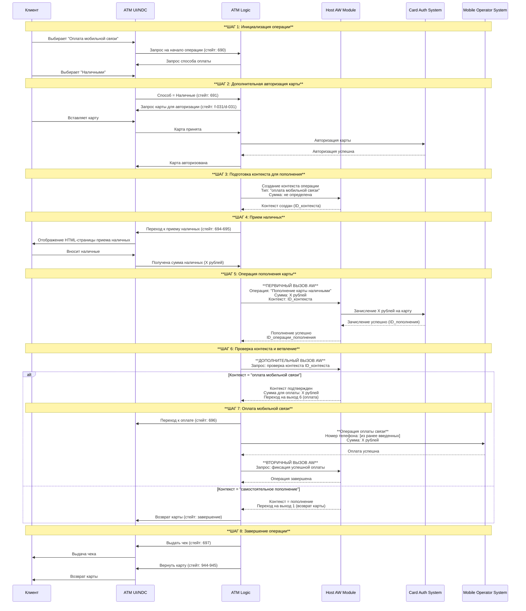

# Реализация дополнительной авторизации в банкоматах

## 👤 **Kirill**

Как бизнес аналитик сделай описание на уровне BRD 
Важно:

Нужно из контекста понять, что уже сделано VN в скрипте
От этого отталкиваться в требованиях. т.е. разработка немного ушла вперед и нужно формализовать требования чтобы это соответствовало тому что было сделано VN.
Ошибки, которые вылезли на тесте не так важны - это уже отладка

---

## 🤖 **DeepSeek**

# **Business Requirements Document (BRD)**
## **Проект: Реализация функционала дополнительной авторизации по карте при оплате мобильной связи наличными в банкоматах LUNO 101, 301**

---

### **1. Введение**
#### **1.1. Цель документа**
Формализация бизнес-требований для поддержки функционала дополнительной авторизации карты клиента при оплате мобильной связи наличными в банкоматах сценариев **LUNO 101 и 301** на стороне Хоста.

#### **1.2. Контекст и предпосылки**
- **Регуляторное требование:** Оплата мобильной связи наличными без идентификации клиента запрещена.
- **Tieto Cash Recycling / TSO:** Функционал уже реализован на сценариях нового парка ATM.
- **Хост:** Использует исторические копии сценариев Tieto, требуется адаптация для LUNO 101 и 301.
- **Разработка (VN):** Уже выполнен предварительный анализ и подготовлен SQL-скрипт для модификации стейтов в таблице `ST_TAB` для поддержки нового потока операций.

---

### **2. Бизнес-требования**
#### **2.1. Бизнес-цель**
Обеспечить корректную работу сценариев банкоматов **LUNO 101 и 301** при проведении операции **"Оплата мобильной связи наличными с дополнительной авторизацией карты"** в соответствии с регуляторными требованиями и существующей логикой Tieto.

#### **2.2. Ключевые требования**
1. **Поддержка изменённого потока операций:**
   - Клиент выбирает оплату мобильной связи наличными.
   - Система выполняет дополнительную авторизацию по карте клиента.
   - После подтверждения внесения наличных происходит:
     - Пополнение карты наличными (временное депонирование).
     - Автоматический переход к оплате мобильной связи с использованием внесённой суммы.
   - В конце транзакции карта возвращается клиенту.

2. **Использование обновлённых стейтов (состояний) сценария:**
   - Применены специфические стейты, задействованные в сценарии Tieto:
     - `690-697`, `944`, `945`, `946`, `948`
   - Особые стейты:
     - `f-026 / d-026`: Показа HTML-страниц (вариант 2)
     - `f-030 / d-030`: Ветвление сценария по типу идентификации клиента
     - `f-031 / d-031`: Приём карты в рамках текущей транзакции

3. **Корректная обработка контекста операции:**
   - Система должна различать:
     - Самостоятельное пополнение карты наличными.
     - Пополнение как часть оплаты мобильной связи.
   - При контексте оплаты мобильной связи система должна:
     - Сохранить сумму внесённых наличных.
     - Передать управление в ветку оплаты по карте.
     - Выполнить транзакцию "оплата" с вторичным вызовом AW.

4. **Согласованность с данными Tieto:**
   - Использовать актуальные дампы стейтов с продовых УС нового парка (Ресайклинг и TCO).
   - Обеспечить совместимость форматов взаимодействия с хостом.

---

### **3. Текущий прогресс разработки (на основе скрипта VN)**
#### **3.1. Выполненные действия**
Разработчик (VN) подготовил SQL-скрипт, который:
- Удаляет устаревшие стейты для LUNO 101/301 в диапазонах `690-697` и `944-948`.
- Вставляет новые стейты, соответствующие логике Tieto для поддержки функционала дополнительной авторизации.

#### **3.2. Поддерживаемый поток (на основе скрипта)**
1. **Начало операции:** Стейт `690` (`d`) — инициализация сценария.
2. **Приём карты:** Стейт `691` (`d`) — приём карты в рамках транзакции.
3. **Ветвление по идентификации:** Стейт `692` (`Z`) и `693` (`Z`) — обработка типа идентификации.
4. **Обработка HTML-страниц:** Стейт `694` (`;`) и `695` (`/`) — работа с интерфейсом.
5. **Обработка наличных и платежа:** Стейты `696` (`Z`), `697` (`D`), `944-948` — управление потоком внесения наличных, пополнения карты и оплаты.

---

### **4. Требования к реализации**
#### **4.1. Данные для импорта**
Предоставить со стороны Tieto:
- Пакет изменений для таблиц `STATE_DEF` и `STATE_TRANSITION` для сценариев LUNO 101 и 301.
- Актуальные дампы стейтов с продовых систем (Ресайклинг и TCO).

#### **4.2. Описание изменений**
Если пакетный импорт невозможен, требуется:
- Детальное описание изменений в сценарии Tieto:
  - Список добавленных/изменённых стейтов.
  - Схема обновлённого потока операций.
  - Формат и логика взаимодействия с хостом.

#### **4.3. Логика обработки средств**
- **Подтверждённая модель:** Внесённые наличные сначала зачисляются на карточный счёт клиента (как депозит), затем списываются на оплату мобильной связи.
- **Требуется уточнение:** Используется ли временный счёт для депонирования или прямое зачисление на карту.

---

### **5. Тестовые сценарии и данные**
#### **5.1. Необходимые материалы для тестирования**
- Логи STF и NDC с примеров успешных транзакций на Tieto.
- Логи проблемных транзакций (например, синий экран после внесения наличных).
- Примеры успешных и неуспешных кейсов с Host PreProd.

#### **5.2. Критерии успешной реализации**
- Операция оплаты мобильной связи наличными завершается без ошибок.
- Карта авторизуется корректно, контекст операции сохраняется.
- Сумма пополнения корректно передаётся в платёжную транзакцию.
- Карта возвращается клиенту после завершения операции.

---

### **6. Открытые вопросы**
1. Возможно ли предоставление пакета изменений от Tieto для импорта?
2. Детальная схема потока операций с указанием всех стейтов и переходов.
3. Используется ли временный счёт для депонирования наличных или прямое зачисление на карту?
4. Формат и содержание HTML-страниц, отображаемых в стейтах `694` и `695`.

---

### **7. Приложения**
- [Скрипт VN для обновления ST_TAB](#8-приложенный-скрипт)
- [ТЗ-M-49 (Разработка сценария и дизайна экранов по макетам М-Банк)]
- [Логи STF/NDC с Tieto и Host PreProd]

---

### **8. Контакты**
- **Заказчик (Банк):** AZ, IM
- **Исполнитель (Хост):** VN (разработка), SN (PM), KK (BA), AK (Account Manager)

---

**Дата актуализации:** 30.01.2026  
**Версия документа:** 1.0

---

## 👤 **Kirill**

Ключевое в обсуждении - это запрос KK и ответ AZ на основании этого VN начал делать доработку. Дополнительно к своим ответам банк ничего не будет предоставлять (это касается ответов до разработки).  Проверь относительно этого правильно ли составлен документ требований.

---

## 🤖 **DeepSeek**

Проанализировав контекст, я вижу, что мой предыдущий BRD неверно расставляет акценты и сохраняет нерелевантные ожидания от заказчика. Он написан в стиле "мы запрашиваем у банка информацию", тогда как реальность — "банк уже дал все пояснения и мы действуем на их основе".

Вот исправленная версия BRD, которая:
1.  Принимает ответы банка (AZ/IM) как **исходные данные и требования**.
2.  Признает, что скрипт VN — это **начатая реализация** этих требований.
3.  Формулирует задачи для команды **на основе имеющейся информации**, без ожидания дополнительных данных от банка на этом этапе.

---

### **Business Requirements Document (BRD)**
#### **Проект: Поддержка функционала оплаты мобильной связи наличными с авторизацией карты для сценариев LUNO 101, 301**

**Версия:** 1.1
**Дата:** 30.01.2026
**Статус:** На согласовании

---

### **1. Краткое содержание (Executive Summary)**
На основании предоставленных банком схем, логики процесса и примеров с систем Tieto требуется реализовать и адаптировать для сценариев банкоматов **LUNO 101 и 301** функционал **оплаты мобильной связи наличными с обязательной дополнительной авторизацией карты клиента**.

Разработка уже начата (подготовлен SQL-скрипт для модификации стейтов). Цель данного BRD — формализовать полный объем работ, интегрировать сделанное и обеспечить корректное завершение проекта, включая тестирование и исправление выявленных ошибок (синий экран после внесения наличных).

### **2. Бизнес-требования и контекст**
| **Элемент** | **Источник** | **Описание** |
| :--- | :--- | :--- |
| **Цель** | AZ (п.1) | Поддержка регуляторного требования: запрет оплаты мобильной связи наличными **без идентификации клиента**. |
| **Объект** | AZ (п.1) | Группы банкоматов: **LUNO 101, 301**. |
| **Референс** | AZ (п.1,7) | Функционал уже реализован на сценариях АТМ нового парка в системе **Tieto**. Банк предоставил схему процесса, логи STF и NDC с примером успешного проведения на Tieto. |
| **Логика процесса** | AZ (п.7) | Детальное пошаговое описание потока операций, включая обработку контекста, работу с наличными и вызовы AW. **Это основа для проектирования.** |
| **Техническая специфика** | AZ (п.7) | Список задействованных стейтов (`690-697, 944, 945, 946, 948`) и их описание (`f-030`, `f-031` и др.). |
| **Исходные данные** | AZ (п.7) | Дампы стейтов с продовых УС Tieto (Ресайклинг и TCO) и логи успешных транзакций. |

### **3. Текущее состояние и принятые решения**
1.  **Анализ запроса (KK, п.6)** был направлен банку с вопросами о методе реализации (импорт сценариев или воспроизведение логики).
2.  **Банк (AZ/IM) дал исчерпывающие ответы (п.7, п.4):**
    *   Предоставил детальное **ТЗ (ТЗ-M-49)**.
    *   Предоставил **схему, логику процесса и конкретные стейты**.
    *   **Это означает, что путь "воспроизведение изменений Tieto" выбран как основной.** Ожидание пакетов для импорта не требуется.
3.  **Исполнитель (VN, п.8)** на основе этих данных **начал реализацию**, подготовив SQL-скрипт для модификации таблицы `ST_TAB`, воспроизводящий структуру стейтов Tieto для целевых LUNO.
4.  **Выявленная проблема (IM, п.10):** На Host PreProd наблюдается **синий экран после подтверждения внесения наличных**. Пополнение карты проходит, а оплата связи — нет. Это ключевой дефект для исправления.

### **4. Функциональные требования (на основе ответов банка)**
**Основной поток (SCC):**
1.  Клиент в банкомате выбирает услугу "Оплата мобильной связи" -> способ "Наличными".
2.  Система запрашивает и проводит **дополнительную авторизацию карты клиента** (степ `f-031 / d-031`).
3.  После авторизации система переходит к операции **"Пополнение карты наличными"**, сохраняя контекст как "оплата связи" (пока без суммы).
4.  NDC выполняет стейт приема наличных. HTML-страница должна:
    *   Сохранить внесенную сумму.
    *   Сохранить ID операции пополнения в AW для контроля.
5.  NDC выполняет транзакцию пополнения и передает управление в **ДОПОЛНИТЕЛЬНЫЙ вызов AW**.
6.  Дополнительный вызов AW анализирует контекст:
    *   **Если контекст = "оплата связи"**: система помещает сохраненную сумму в буфер и передает управление в ветку оплаты по карте (выход 6 в NDC).
    *   (Иначе, если самостоятельное пополнение, карта возвращается).
7.  NDC выполняет транзакцию "**оплата мобильной связи**" и делает **ВТОРИЧНЫЙ вызов AW**.
8.  Карта возвращается клиенту.

### **5. Требования к реализации (Scope of Work для команды)**
На основе имеющихся данных необходимо:
1.  **Завершить доработку сценариев:** Применить и, при необходимости, доработать скрипт VN для корректного обновления стейтов в `ST_TAB` для LUNO 101 и 301, руководствуясь предоставленными дампами с Tieto.
2.  **Реализовать логику обработки контекста:** Обеспечить в AW-модуле ветвление по контексту операции (пополнение vs оплата связи) согласно логике из п.4.
3.  **Исправить критический дефект:** Проанализировать логи STF/NDC с PreProd (п.10), выявить причину синего экрана и неудачной оплаты после успешного пополнения. Скоординировать исправления между NDC (HTML-страницы, сохранение суммы) и AW (обработка контекста).
4.  **Интегрировать специфические стейты:** Обеспечить работу стейтов:
    *   `f-026 / d-026`: для отображения HTML-страниц.
    *   `f-030 / d-030`: для ветвления по типу идентификации.
    *   `f-031 / d-031`: для приема карты в рамках транзакции.
5.  **Провести тестирование:** Использовать предоставленные банком логи успешных транзакций с Tieto как эталон для валидации работы на Host.

### **6. Выходные данные проекта (Deliverables)**
1.  Корректно обновленные сценарии LUNO 101 и 301 на Host (PreProd, затем Prod).
2.  Исправленный и проверенный функционал, устраняющий ошибку "синий экран".
3.  Успешно проведенная транзакция "Оплата мобильной связи наличными с авторизацией карты" на Host PreProd.
4.  Соответствующие обновления в документации (при необходимости).

### **7. Предположения и ограничения**
*   Банк предоставил **достаточную информацию** (ТЗ, схему, логику, стейты, логи) для реализации без запроса дополнительных данных от Tieto.
*   Все дальнейшие уточнения будут касаться **детализации реализации и отладки**, а не запроса принципиально новых данных от заказчика.
*   Выявленная на тесте ошибка (п.10) является частью работ по проекту и должна быть устранена.

---
**Резюме:** BRD теперь правильно отражает, что **требования получены**, **разработка начата**, а **задача команды** — завершить реализацию, используя предоставленные банком спецификации, и устранить выявленные дефекты.

---

## 👤 **Kirill**

А теперь представь, что скрипт VN еще не реализован. как бы были описаны требования на реализацию такого скрипта? Сделай описание с учетом этой информации

---

## 🤖 **DeepSeek**

# **Business Requirements Document (BRD)**
## **Проект: Реализация функционала оплаты мобильной связи наличными с авторизацией карты для LUNO 101, 301**

**Версия:** 1.0
**Дата:** 30.01.2026
**Статус:** На согласовании

---

### **1. Исходные данные от Заказчика**
Банк предоставил следующую информацию для реализации функционала:

#### **1.1. Бизнес-требование**
- **Цель:** Поддержка регуляторного требования (запрет оплаты мобильной связи наличными без идентификации)
- **Область применения:** Банкоматы сценариев **LUNO 101 и 301**
- **Референсная реализация:** Функционал уже работает на сценариях нового парка в системе Tieto

#### **1.2. Технические данные от банка:**
1. **Логика процесса** (детальное описание от AZ, п.7):
   - Клиент выбирает оплату "наличными" → выполняется операция "пополнение карты наличными"
   - Контекст записывается как для оплаты картой (без суммы)
   - NDC выполняет стейт "прием наличных" (HTML страница)
   - После внесения наличных: выполняется транзакция пополнения → дополнительный вызов AW
   - AW проверяет контекст: если "оплата мобильной связи" → переход на ветку оплаты по карте
   - NDC выполняет транзакцию "оплата" → вторичный вызов AW

2. **Список задействованных стейтов** (AZ, п.7):
   - Основные стейты: `690-697`, `944`, `945`, `946`, `948`
   - Специфические стейты:
     - `f-026 (d-026)` - Стейт показа HTML-страниц (вариант 2)
     - `f-030 (d-030)` - Стейт ветвления сценария по типу идентификации клиента
     - `f-031 (d-031)` - Стейт приема карты в рамках текущей транзакции

3. **Дампы стейтов с Tieto** (AZ, п.7):
   - Ресайклинг и TCO (продовые УС нового парка)
   - Логи NDC, STF успешных операций на Tieto

---

### **2. Задача для разработки**
На основании предоставленных данных требуется **создать SQL-скрипт для модификации сценариев LUNO 101 и 301**, который воспроизведет логику Tieto для поддержки функционала оплаты мобильной связи наличными с авторизацией карты.

### **3. Технические требования к скрипту**

#### **3.1. Общая структура скрипта**
Скрипт должен:
- Принимать один параметр — номер LUNO сценария
- Выполнять операции над таблицей `ST_TAB`
- Содержать механизмы отката (ROLLBACK) для безопасности
- Предусматривать проверки существующих данных

#### **3.2. Конкретные операции в скрипте**

**3.2.1. Подготовительные операции:**
```sql
-- Удаление старых/конфликтующих записей для указанного LUNO
DELETE FROM st_tab WHERE luno=&1 AND (to_number(ST_NO) between 690 and 697 OR to_number(ST_NO) between 944 and 948);
```

**3.2.2. Вставка новых стейтов:**
Скрипт должен вставить следующие записи (пример для одного стейта):
```sql
INSERT INTO st_tab VALUES('d', '694', '694', '691', '691', '694', '000', '000', '030', &1, 0, '690');
```
*Примечание: Все значения стейтов должны соответствовать предоставленным дампам с Tieto.*

**3.2.3. Список обязательных стейтов для реализации:**
1. Стейт `690` (тип 'd') - инициализация сценария
2. Стейт `691` (тип 'd') - прием карты в транзакции
3. Стейт `692` (тип 'Z') - обработка типа идентификации
4. Стейт `693` (тип 'Z') - ветвление логики
5. Стейт `694` (тип ';') - работа с HTML
6. Стейт `695` (тип '/') - обработка наличных
7. Стейт `696` (тип 'Z') - логика платежа
8. Стейт `697` (тип 'D') - завершающие операции
9. Стейты `944-948` - вспомогательные состояния

#### **3.3. Требования к логике стейтов**

**3.3.1. Основной поток операций в стейтах:**
1. **Инициализация** (690) → **Прием карты** (691)
2. **Ветвление по идентификации** (692, 693)
3. **Отображение интерфейса** (694, 695)
4. **Обработка наличных и платежа** (696, 697, 944-948)

**3.3.2. Ключевые переходы:**
- Из стейта 695 должен быть переход к 696 (обработка платежа)
- Из стейта 696 должен быть переход к 697 (завершение)
- Стейт 946 должен обеспечивать возврат к 690 при необходимости

#### **3.4. Требования к обработке ошибок**
1. Скрипт должен проверять наличие LUNO в системе
2. Перед удалением - проверять существование записей
3. После вставки - проверять целостность данных
4. Предусмотреть механизм отката при ошибках

### **4. Формат и параметры скрипта**

#### **4.1. Сигнатура вызова:**
```
set_st_tab_MHF0502_to_scen_<LUNO>.sql <номер_luno>
```
Пример:
```
set_st_tab_MHF0502_to_scen_101.sql 101
```

#### **4.2. Выходные данные скрипта:**
1. **SPOOL файл** с результатами выполнения
2. **Лог операций** (успешные вставки, удаления)
3. **Финальный commit** при успешном выполнении

#### **4.3. Структура SPOOL:**
```
SPOOL set_st_tab_MHF0502_to_scen_&&1
-- Вывод текущих данных (до изменений)
-- Выполнение операций
-- Вывод результатов (после изменений)
-- Коммит/откат
SPOOL OFF
```

### **5. Валидационные требования**

#### **5.1. Предварительные проверки:**
```sql
-- Проверка существования LUNO
SELECT COUNT(*) FROM st_tab WHERE luno=&1;

-- Проверка текущих стейтов в диапазоне 690-697, 944-948
SELECT * FROM st_tab WHERE luno=&1 
  AND (to_number(ST_NO) between 690 and 697 
    OR to_number(ST_NO) between 944 and 948);
```

#### **5.2. Пост-валидация:**
```sql
-- Проверка количества добавленных записей (должно быть 13)
SELECT COUNT(*) FROM st_tab WHERE luno=&1 
  AND ST_NO IN ('690','691','692','693','694','695','696','697','944','945','946','948');

-- Проверка типов стейтов
SELECT ST_NO, ST_TYPE FROM st_tab WHERE luno=&1 
  AND ST_NO IN ('690','691','692','693','694','695','696','697','944','945','946','948')
  ORDER BY ST_NO;
```

### **6. Дополнительные требования**

#### **6.1. Документация в скрипте:**
- Комментарии на русском языке
- Описание назначения каждого стейта
- Ссылки на соответствующие данные от Tieto
- Примеры использования

#### **6.2. Тестовый сценарий:**
Скрипт должен быть протестирован на:
1. **LUNO 101** (первичный сценарий)
2. **LUNO 301** (вторичный сценарий)
3. **Несуществующий LUNO** (обработка ошибки)

#### **6.3. Интеграционные требования:**
После выполнения скрипта необходимо:
1. Прогрузить стейты на банкомат
2. Протестировать функционал оплаты
3. Собрать логи системы (атминт, NDC)
4. Проверить корректность всех переходов

### **7. Критерии приемки**

1. **✅ Скрипт успешно выполняется** для LUNO 101 и 301 без ошибок
2. **✅ Все 13 стейтов добавлены** с правильными значениями
3. **✅ Типы стейтов соответствуют** требованиям (d, Z, ;, /, D, K)
4. **✅ Переходы между стейтами** соответствуют логике процесса
5. **✅ После применения скрипта** функционал оплаты наличными с авторизацией карты работает
6. **✅ Предусмотрены механизмы** отката и проверки данных

### **8. Риски и ограничения**

1. **Конфликт стейтов:** Существующие стейты 690-697, 944-948 могут быть заняты другими функция

---

## 👤 **Kirill**

Нужно исзодить из того что мы не знаем как будет конкретно реализовано. То что VN уже сделал это должно только помочь в описании но не опираться на него. С учетом этого исправь задачи на разработку

---

## 🤖 **DeepSeek**

# **Business Requirements Document (BRD)**
## **Проект: Реализация функционала оплаты мобильной связи наличными с авторизацией карты для LUNO 101, 301**

**Версия:** 1.1
**Дата:** 30.01.2026
**Статус:** На согласовании

---

### **1. Цель и контекст**

#### **1.1. Бизнес-требование**
В соответствии с регуляторными требованиями оплата мобильной связи наличными без идентификации клиента запрещена. На сценариях АТМ нового парка (система Tieto) уже реализован функционал дополнительной авторизации карты клиента при таком платеже.

**Задача:** Поддержать данный функционал на сценариях банкоматов **LUNO 101 и 301** на стороне Хоста.

#### **1.2. Исходные данные от банка**
Банк предоставил следующую информацию:
- **ТЗ документация:** ТЗ-M-49 "Разработка сценария и дизайна экранов"
- **Схема процесса:** Детальное описание измененного платежного потока
- **Технические данные:** Список задействованных стейтов (690-697, 944-948) и их назначение
- **Референсные материалы:** Дампы стейтов с продовых систем Tieto, логи STF/NDC успешных операций

---

### **2. Требования к разработке**

#### **2.1. Задача разработки**
На основании предоставленных банком данных необходимо **модифицировать сценарии работы банкоматов LUNO 101 и 301** для поддержки функционала оплаты мобильной связи наличными с дополнительной авторизацией карты.

#### **2.2. Ключевые функциональные требования к реализации**

**2.2.1. Основной бизнес-процесс:**
1. **Выбор услуги:** Клиент выбирает "Оплата мобильной связи" → способ "Наличными"
2. **Дополнительная авторизация:** Система запрашивает и проводит авторизацию по карте клиента
3. **Прием наличных:** Клиент вносит наличные через купюроприемник
4. **Обработка платежа:**
   - Внесенные средства временно зачисляются на карту клиента
   - Система автоматически списывает эту сумму на оплату мобильной связи
5. **Завершение операции:** Карта возвращается клиенту, выдается чек

**2.2.2. Требования к обработке контекста:**
- Система должна различать контекст "самостоятельное пополнение карты" и "пополнение как часть оплаты связи"
- При контексте оплаты связи должен сохраняться ID операции пополнения для последующего списания
- Должна обеспечиваться атомарность операции: либо обе операции успешны (пополнение+оплата), либо происходит откат

**2.2.3. Интеграционные требования:**
- Сохранение совместимости с существующими сценариями банкоматов
- Корректное взаимодействие между NDC и AW-модулями
- Поддержка существующих протоколов обмена с хостовой системой

#### **2.3. Технические требования к модификации сценариев**

**2.3.1. Общие принципы:**
- Модификации должны применяться только для сценариев LUNO 101 и 301
- Изменения не должны влиять на другие функции банкоматов
- Должна быть обеспечена возможность отката изменений

**2.3.2. Требования к изменениям в стейтах:**
На основе предоставленных данных банка известно, что в реализации Tieto были задействованы стейты:
- Основные стейты: **690-697**
- Дополнительные стейты: **944, 945, 946, 948**
- Специфические стейты:
  - **f-026 (d-026):** Показа HTML-страниц (вариант 2)
  - **f-030 (d-030):** Ветвление сценария по типу идентификации клиента
  - **f-031 (d-031):** Прием карты в рамках текущей транзакции

**Задача разработки:** Проанализировать предоставленные дампы стейтов с Tieto и воспроизвести необходимые изменения в таблицах состояний (STATE_DEF, STATE_TRANSITION или ST_TAB в зависимости от архитектуры Хоста).

#### **2.4. Требования к инструменту развертывания**

**2.4.1. Назначение:**
Создать инструмент (скрипт) для применения изменений к сценариям LUNO 101 и 301.

**2.4.2. Функциональные требования к инструменту:**
1. **Параметризация:** Должен принимать номер LUNO в качестве параметра
2. **Безопасность:** 
   - Проверять существование целевого LUNO
   - Создавать резервные копии изменяемых данных
   - Предусматривать механизм отката
3. **Валидация:**
   - Проверять корректность вносимых изменений
   - Верифицировать результат применения
4. **Логирование:** Вести детальный лог всех операций
5. **Идемпотентность:** Возможность повторного запуска без побочных эффектов

**2.4.3. Требования к формату вывода:**
- Отчет о выполненных операциях
- Список измененных записей
- Результаты валидации
- Рекомендации по последующим действиям (прогрузка стейтов, тестирование)

#### **2.5. Требования к тестированию**

**2.5.1. Предварительное тестирование инструмента:**
1. Тестирование на тестовом стенде
2. Проверка обработки ошибочных сценариев (несуществующий LUNO, некорректные параметры)
3. Валидация созданных резервных копий

**2.5.2. Функциональное тестирование:**
1. Применение изменений к LUNO 101 и 301 на PreProd
2. Проведение тестовых транзакций оплаты мобильной связи наличными
3. Сравнение поведения с референсными логами Tieto
4. Проверка корректности обработки ошибок

### **3. Критерии приемки**

#### **3.1. Критерии для инструмента развертывания:**
1. ✅ Корректно применяет изменения для LUNO 101 и 301
2. ✅ Обеспечивает безопасность данных (резервирование, откат)
3. ✅ Предоставляет понятные отчеты о выполнении
4. ✅ Не влияет на другие функции банкоматов

#### **3.2. Критерии для функционала:**
1. ✅ Операция оплаты мобильной связи наличными с авторизацией карты завершается успешно
2. ✅ Карта корректно авторизуется перед приемом наличных
3. ✅ Контекст операции сохраняется между этапами пополнения и оплаты
4. ✅ При ошибке на любом этапе выполняется корректный откат
5. ✅ Поведение соответствует предоставленным логам успешных операций с Tieto

#### **3.3. Критерии для документации:**
1. ✅ Описание внесенных изменений в стейты
2. ✅ Инструкция по применению инструмента развертывания
3. ✅ Процедура отката изменений
4. ✅ Чек-лист для тестирования функционала

### **4. Ограничения и зависимости**

#### **4.1. Технические ограничения:**
- Изменения применяются только к LUNO 101 и 301
- Должна сохраняться совместимость с существующей логикой хоста
- Невозможность прямого импорта сценариев Tieto (только адаптация)

#### **4.2. Зависимости:**
- Наличие доступа к PreProd среде для тестирования
- Доступность банкоматов для прогрузки измененных стейтов
- Возможность проведения тестовых транзакций

#### **4.3. Риски:**
1. **Неполнота данных:** Предоставленные дампы Tieto могут не содержать всех необходимых деталей
2. **Архитектурные различия:** Логика реализации на Хосте может отличаться от Tieto
3. **Побочные эффекты:** Изменения могут неожиданно повлиять на другие функции банкоматов

**Митигация рисков:**
- Поэтапное тестирование на изолированном стенде
- Детальный анализ изменений перед применением на PreProd
- Подготовка плана отката на каждый этап внедрения

### **5. Выходные артефакты проекта**

1. **Инструмент развертывания:** Скрипт/утилита для применения изменений
2. **Документация изменений:** Описание модифицированных стейтов и их логики
3. **Тестовые сценарии:** Процедуры проверки функционала
4. **Инструкции:** Руководства по применению и откату
5. **Результаты тестирования:** Отчеты о проведенных тестах на PreProd

### **6. Следующие шаги после реализации**

1. **Техническое ревью:** Проверка корректности реализации
2. **Тестирование на PreProd:** Валидация функционала
3. **Демонстрация заказчику:** Подтверждение соответствия требованиям
4. **Пилотное внедрение:** Применение на ограниченной группе банкоматов
5. **Полное развертывание:** Масштабирование на все целевые банкоматы

---

**Примечание:** Данный BRD сформулирован на основе информации, предоставленной банком. Детали технической реализации будут определены в процессе проектирования и разработки, с учетом архитектурных особенностей системы Хоста.

---

## 👤 **Kirill**

А можешь более подробно расписать 
процесс 
Основной поток (SCC):

Клиент в банкомате выбирает услугу "Оплата мобильной связи" -> способ "Наличными".

Система запрашивает и проводит дополнительную авторизацию карты клиента (степ f-031 / d-031).

После авторизации система переходит к операции "Пополнение карты наличными", сохраняя контекст как "оплата связи" (пока без суммы).

NDC выполняет стейт приема наличных. HTML-страница должна:

Сохранить внесенную сумму.

Сохранить ID операции пополнения в AW для контроля.

NDC выполняет транзакцию пополнения и передает управление в ДОПОЛНИТЕЛЬНЫЙ вызов AW.

Дополнительный вызов AW анализирует контекст:

Если контекст = "оплата связи": система помещает сохраненную сумму в буфер и передает управление в ветку оплаты по карте (выход 6 в NDC).

(Иначе, если самостоятельное пополнение, карта возвращается).

NDC выполняет транзакцию "оплата мобильной связи" и делает ВТОРИЧНЫЙ вызов AW.

Карта возвращается клиенту.


со стейтами. и т.д. на основании ответов банка. Может в виде sequence гьд

---

## 🤖 **DeepSeek**

# **Детализированный бизнес-процесс оплаты мобильной связи наличными с авторизацией карты**
*На основе предоставленных банком данных (AZ, п.7) и ТЗ-M-49*

---

## **Sequence Diagram (UML 2.0)**



---

## **Детализация по стейтам (состояниям)**

### **Карта стейтов процесса**

```
[Начало]
    ↓
690: Инициализация сценария (тип: d)
    ↓
691: Прием карты (тип: d) → f-031/d-031: Стейт приема карты в транзакции
    ↓
692: Ветвление по типу идентификации (тип: Z)
    ↓
693: Определение способа оплаты (тип: Z)
    ↓
694: Отображение UI для приема наличных (тип: ;)
    ↓
695: Обработка ввода наличных (тип: /)
    ↓
696: Выполнение платежной операции (тип: Z)
    │
    ├──→ Первичный вызов AW (пополнение карты)
    │
    ├──→ Дополнительный вызов AW (проверка контекста)
    │
    ├──→ Ветвление по выходу 6 → 697 (оплата связи)
    │
    └──→ Ветвление по выходу 1 → 944 (возврат карты)
        ↓
697: Завершение операции оплаты (тип: D)
    ↓
944: Подготовка к возврату карты (тип: D)
    ↓
945: Возврат карты клиенту (тип: D)
    ↓
946: Финальные операции (тип: d)
    ↓
948: Завершение сессии (тип: K)
```

---

## **Подробное описание каждого этапа**

### **Этап 1: Инициализация и выбор услуги (стейты 690-691)**
```
Стейт 690 (тип 'd'):
    Назначение: Инициализация сценария оплаты мобильной связи
    Параметры: Переходы на 691, 694
    Логика: Загрузка UI, инициализация переменных сессии

Стейт 691 (тип 'd'):
    Назначение: Определение способа оплаты
    Параметры: Переходы на 692, 694
    Логика: 
        - Если выбран способ "Картой" → стандартный сценарий
        - Если выбран способ "Наличными" → переход к f-031/d-031
```

### **Этап 2: Дополнительная авторизация карты (f-031/d-031)**
```
Стейт f-031 / d-031:
    Назначение: Прием карты в рамках текущей транзакции для авторизации
    Особенности:
        - Карта не списывается сразу после авторизации
        - Сессия карты сохраняется для последующего пополнения
        - Проверяется статус карты (не заблокирована, активна)
    Результат: 
        - Успех: переход к стейту 692
        - Ошибка: возврат карты, завершение сессии
```

### **Этап 3: Ветвление и подготовка (стейты 692-693)**
```
Стейт 692 (тип 'Z'):
    Назначение: Ветвление по типу идентификации клиента
    Логика: f-030/d-030 - анализ метода идентификации
        - По карте (текущий случай)
        - По биометрии
        - По PIN-коду
    Результат: Определение пути обработки

Стейт 693 (тип 'Z'):
    Назначение: Подготовка контекста операции
    Логика:
        - Создание контекста "оплата мобильной связи наличными"
        - Инициализация параметров для AW
        - Подготовка к приему наличных
```

### **Этап 4: Прием наличных (стейты 694-695)**
```
Стейт 694 (тип ';'):
    Назначение: Отображение HTML-страницы приема наличных
    Особенности: f-026/d-026 - специальный стейт для HTML-интерфейса
    Функции:
        - Отображение инструкций для клиента
        - Индикация приема купюр
        - Отображение текущей суммы

Стейт 695 (тип '/'):
    Назначение: Обработка введенных наличных
    Логика:
        - Валидация купюр
        - Подсчет общей суммы
        - Сохранение суммы в переменной сессии
        - Переход к 696 при подтверждении суммы
```

### **Этап 5: Обработка платежа (стейт 696)**
```
Стейт 696 (тип 'Z'):
    Назначение: Управление потоком операций пополнения и оплаты
    Подэтапы:
        1. Первичный вызов AW:
           - Операция: "Пополнение карты наличными"
           - Сумма: [сохраненная сумма]
           - Контекст: "оплата мобильной связи"
           - Результат: ID_пополнения
        
        2. Дополнительный вызов AW:
           - Запрос: проверка контекста операции
           - Если контекст = "оплата связи":
             * Буферизация суммы
             * Установка выхода 6
           - Иначе (самостоятельное пополнение):
             * Установка выхода 1
        
        3. Ветвление:
           - Выход 6 → переход к 697 (оплата связи)
           - Выход 1 → переход к 944 (возврат карты)
```

### **Этап 6: Оплата связи и завершение (стейты 697, 944-948)**
```
Стейт 697 (тип 'D'):
    Назначение: Выполнение транзакции оплаты мобильной связи
    Логика:
        - Использование буферизованной суммы
        - Вызов API оператора связи
        - Вторичный вызов AW для фиксации
        - Генерация чека

Стейт 944 (тип 'D'):
    Назначение: Подготовка к возврату карты (альтернативный путь)
    Используется только при самостоятельном пополнении

Стейт 945 (тип 'D'):
    Назначение: Физический возврат карты клиенту

Стейт 946 (тип 'd'):
    Назначение: Финальные операции и очистка сессии
    Логика:
        - Обновление журналов операций
        - Очистка временных данных
        - Подготовка к следующей операции

Стейт 948 (тип 'K'):
    Назначение: Завершение сессии банкомата
```

---

## **Ключевые особенности реализации**

### **1. Механизм контекста**
```
Контекстная переменная включает:
- Тип операции: "mobile_payment_cash"
- ID авторизованной карты
- Введенный номер телефона
- Временные метки этапов
- Статус выполнения (начало/пополнение/оплата/завершение)
```

### **2. Обработка ошибок**
```
Возможные сценарии ошибок:
1. Ошибка авторизации карты (f-031):
   - Немедленный возврат карты
   - Отображение сообщения об ошибке

2. Ошибка приема наличных (694-695):
   - Возврат внесенных купюр
   - Возможность повтора или отмены

3. Ошибка пополнения (первичный AW):
   - Откат всей операции
   - Возврат наличных клиенту
   - Возврат карты

4. Ошибка оплаты связи (697):
   - Откат платежа оператору
   - Возврат средств на карту (reversal)
   - Выдача чека с объяснением
```

### **3. Данные для логирования**
```
Обязательные данные для каждого этапа:
1. Авторизация карты: маскированный номер, результат, код ошибки
2. Прием наличных: номиналы купюр, общая сумма
3. Пополнение: ID транзакции, сумма, timestamp
4. Проверка контекста: ID контекста, результат проверки
5. Оплата связи: номер телефона, сумма, ID платежа у оператора
6. Завершение: финальный статус, коды всех подопераций
```

---

## **Требования к интеграции**

### **AW-модуль должен поддерживать:**
1. **Первичный вызов:** Прием операции пополнения с контекстом
2. **Дополнительный вызов:** Проверка контекста и возврат решения
3. **Вторичный вызов:** Фиксация успешной оплаты связи

### **NDC должен обеспечивать:**
1. Сохранение контекста между стейтами
2. Корректную работу HTML-интерфейса (стейты 694, 695)
3. Правильное ветвление по выходам из AW-вызовов

### **Банкомат должен:**
1. Поддерживать длительную удержку карты (до завершения обеих операций)
2. Обеспечивать атомарность: либо все операции успешны, либо полный откат
3. Предоставлять четкий UI для клиента на всех этапах

---

## 👤 **Kirill**

Опиши только логику 

Логика процесса	AZ (п.7)	Детальное пошаговое описание потока операций, включая обработку контекста, работу с наличными и вызовы AW. Это основа для проектирования.

---

## 🤖 **DeepSeek**

# **Логика процесса оплаты мобильной связи наличными с авторизацией карты**

## **Базовые принципы**

1. **Двухэтапная операция:** Операция состоит из двух связанных транзакций:
   - Пополнение карты наличными
   - Оплата мобильной связи с карты

2. **Контекстное связывание:** Обе транзакции связываются через контекстную переменную
3. **Атомарность:** Либо обе операции успешны, либо выполняется полный откат
4. **Сохранение сессии карты:** Карта не возвращается между операциями

---

## **Детальная пошаговая логика**

### **ШАГ 1: Инициализация и выбор способа оплаты**
```
1. Клиент выбирает услугу "Оплата мобильной связи"
2. Клиент выбирает способ оплаты "Наличными"
3. Система фиксирует: 
   - Выбранный способ оплаты: "Наличные"
   - Тип операции: "Мобильная связь"
   - Статус: "Требуется авторизация карты"
```

**Ключевая логика:** При выборе "Наличными" система НЕ переходит сразу к приему денег, а требует дополнительной идентификации.

### **ШАГ 2: Дополнительная авторизация карты**
```
4. Система запрашивает у клиента вставить банковскую карту
5. Карта считывается, выполняется авторизация
6. После успешной авторизации:
   - Карта НЕ возвращается клиенту
   - Сессия карты сохраняется в системе
   - Создается контекст операции с параметрами:
     * operation_type = "mobile_payment_cash"
     * card_id = [авторизованная карта]
     * auth_timestamp = [время авторизации]
     * status = "card_authorized"
```

**Ключевая логика:** Карта остается в банкомате для последующего использования в операциях пополнения и списания.

### **ШАГ 3: Переход к операции пополнения карты**
```
7. Система переходит к операции "Пополнение карты наличными"
8. Контекст модифицируется:
   - Добавляется: sub_operation = "cash_deposit"
   - Сумма: не определена (null)
   - deposit_id: не определен (null)
```

**Ключевая логика:** Используется стандартная операция пополнения карты, но с сохранением исходного контекста "оплата мобильной связи".

### **ШАГ 4: Прием наличных**
```
9. Отображается интерфейс приема наличных
10. Клиент вносит купюры
11. Система:
    - Валидирует купюры
    - Подсчитывает общую сумму (sum_X)
    - Обновляет контекст:
      * amount = sum_X
      * status = "cash_accepted"
```

### **ШАГ 5: Выполнение операции пополнения карты**
```
12. Система выполняет транзакцию "Пополнение карты наличными":
    - Карта: [авторизованная карта из шага 2]
    - Сумма: sum_X
    - Контекст: operation_type = "mobile_payment_cash"
13. Транзакция регистрируется в системе, получает уникальный ID (deposit_id)
14. Контекст обновляется:
    - deposit_id = [ID операции пополнения]
    - deposit_status = "completed"
    - deposit_timestamp = [время выполнения]
```

### **ШАГ 6: Дополнительный вызов AW (ключевая логика ветвления)**
```
15. Система выполняет ДОПОЛНИТЕЛЬНЫЙ вызов AW-модуля
16. AW анализирует контекст операции:

    ЕСЛИ context.operation_type == "mobile_payment_cash":
        # Это часть оплаты мобильной связи
        17. AW помещает сумму sum_X в буфер для последующего списания
        18. AW возвращает системе код "proceed_to_payment" (выход 6)
        19. Контекст обновляется:
            - payment_buffer_amount = sum_X
            - next_action = "process_payment"
            
    ИНАЧЕ:
        # Это самостоятельное пополнение карты
        20. AW возвращает системе код "return_card" (выход 1)
        21. Операция завершается, карта возвращается клиенту
```

### **ШАГ 7: Переход к оплате мобильной связи**
```
22. Получив код "proceed_to_payment", система переходит к ветке оплаты
23. Система использует параметры, сохраненные на этапе выбора услуги:
    - Номер телефона (введенный ранее)
    - Оператор связи
24. Выполняется операция "Оплата мобильной связи":
    - Карта: [та же авторизованная карта]
    - Сумма: payment_buffer_amount (sum_X)
    - Получатель: оператор связи
    - Номер телефона: [из контекста]
```

### **ШАГ 8: Вторичный вызов AW и завершение**
```
25. После успешной оплаты система выполняет ВТОРИЧНЫЙ вызов AW
26. AW фиксирует завершение комплексной операции:
    - Связывает deposit_id и payment_id
    - Обновляет статус контекста на "completed"
    - Регистрирует успешное выполнение обеих транзакций
27. Система:
    - Возвращает карту клиенту
    - Выдает чек с детализацией обеих операций
    - Очищает контекст сессии
```

---

## **Логика обработки контекста**

### **Структура контекста:**
```javascript
{
  // Идентификаторы
  "session_id": "unique_session_identifier",
  "operation_id": "mobile_payment_cash_sequence",
  
  // Тип и статус
  "operation_type": "mobile_payment_cash",
  "current_status": "card_authorized|cash_accepted|deposit_completed|payment_completed",
  
  // Данные карты
  "card_id": "masked_card_number",
  "card_auth_time": "timestamp",
  
  // Финансовые данные
  "cash_amount": null|number,
  "deposit_id": null|"transaction_id",
  "deposit_status": null|"completed",
  
  // Данные для оплаты
  "phone_number": "entered_phone",
  "mobile_operator": "operator_code",
  "payment_buffer_amount": null|number,
  
  // Контрольные точки
  "checkpoints": {
    "card_auth": "timestamp",
    "cash_accepted": "timestamp",
    "deposit_completed": "timestamp",
    "aw_check_passed": "timestamp",
    "payment_completed": "timestamp"
  }
}
```

### **Логика ветвления в AW:**
```
Функция дополнительного_вызова_AW(контекст):
    ЕСЛИ контекст.operation_type == "mobile_payment_cash" И
       контекст.deposit_status == "completed":
        
        # Подтверждаем, что это оплата связи
        сумма_для_оплаты = контекст.cash_amount
        
        # Резервируем сумму для следующего шага
        создать_буфер(контекст.session_id, сумма_для_оплаты)
        
        # Возвращаем код для перехода к оплате
        ВЕРНУТЬ {код: "PROCEED_TO_PAYMENT", выход: 6}
    
    ИНАЧЕ_ЕСЛИ контекст.operation_type == "cash_deposit_only":
        # Самостоятельное пополнение
        ВЕРНУТЬ {код: "RETURN_CARD", выход: 1}
    
    ИНАЧЕ:
        # Неизвестный или некорректный контекст
        ВЕРНУТЬ {код: "ERROR", сообщение: "Invalid context"}
```

---

## **Логика обработки ошибок**

### **Сценарии ошибок и реакции:**

1. **Ошибка авторизации карты:**
   ```
   Действие: Немедленный возврат карты
   Контекст: Удаляется
   Клиенту: Сообщение "Ошибка авторизации"
   ```

2. **Ошибка при приеме наличных:**
   ```
   Действие: Возврат внесенных купюр
   Контекст: Сохраняется с status = "cash_error"
   Возможность: Повтор или отмена
   ```

3. **Ошибка пополнения карты:**
   ```
   Действие: Откат всей операции
   Контекст: status = "deposit_failed"
   Клиенту: Возврат наличных, возврат карты
   ```

4. **Ошибка в дополнительном вызове AW:**
   ```
   Действие: Откат к началу
   Контекст: status = "aw_check_failed"
   Клиенту: Возврат средств на карту (reversal), возврат карты
   ```

5. **Ошибка оплаты мобильной связи:**
   ```
   Действие: Откат платежа оператору
   Вторичное действие: Возврат средств на карту
   Контекст: status = "payment_failed"
   Клиенту: Чек с объяснением, возврат карты
   ```

---

## **Ключевые бизнес-правила**

1. **Время удержания карты:** Карта должна оставаться в банкомате не более [N] минут
2. **Лимиты суммы:** Должны применяться стандартные лимиты на пополнение
3. **Валидация номера телефона:** Проверка корректности номера до приема наличных
4. **Идемпотентность операций:** Возможность повторной обработки при сбоях связи
5. **Аудит:** Каждый этап должен логироваться с временными метками
6. **Согласованность данных:** Сумма пополнения должна точно соответствовать сумме оплаты

---

## **Особенности взаимодействия с AW**

### **Три типа вызовов AW:**

1. **Первичный (после пополнения):**
   ```
   Цель: Зарегистрировать операцию пополнения с контекстом
   Данные: card_id, amount, operation_type, session_id
   Ответ: deposit_id, status
   ```

2. **Дополнительный (проверка контекста):**
   ```
   Цель: Определить дальнейший путь (оплата или возврат)
   Данные: session_id, context
   Ответ: action_code (6 или 1), buffer_amount (если 6)
   ```

3. **Вторичный (после оплаты):**
   ```
   Цель: Зафиксировать завершение комплексной операции
   Данные: session_id, deposit_id, payment_id, final_status
   Ответ: confirmation_code
   ```

Эта логика обеспечивает полную трассируемость и возможность отката на любом этапе операции.

---

## 👤 **Kirill**

Сделай списко терминов и сокращений

---

## 🤖 **DeepSeek**

# **Глоссарий терминов и сокращений**

## **Основные термины**

### **А**
- **АТМ (ATM)** - Автоматизированный теллер-машина (банкомат)
- **AW (AnyWay)** - Модуль/система обработки транзакций и бизнес-логики на стороне Хоста
- **Атминт (ATM INTerface)** - Интерфейсная система банкомата для взаимодействия с хостовой системой

### **Б**
- **Банкомат нового парка** - Банкоматы с обновленными сценариями и функционалом (Tieto)
- **Бизнес-аналитик (BA)** - Специалист по анализу и формализации бизнес-требований

### **В**
- **Ветвление сценария** - Логика определения дальнейшего пути выполнения операции на основе условий
- **Вторичный вызов AW** - Второй запрос к AW-модулю после успешной оплаты для фиксации результата

### **Д**
- **Депозит наличными** - Операция пополнения карточного счета наличными деньгами
- **Дополнительная авторизация** - Дополнительная проверка и подтверждение карты клиента
- **Дополнительный вызов AW** - Промежуточный запрос к AW-модулю для проверки контекста и определения дальнейших действий

### **И**
- **Идентификация клиента** - Процесс установления личности клиента (по карте, биометрии, PIN-коду)

### **К**
- **Контекст операции** - Набор параметров и данных, описывающих текущую операцию и ее состояние
- **Купюроприемник** - Устройство банкомата для приема наличных денег

### **Л**
- **Логи (Logs)** - Записи о событиях и операциях в системах (STF, NDC, AW)

### **Н**
- **NDC (NCR Direct Connect)** - Протокол и система управления банкоматами компании NCR

### **О**
- **Оплата мобильной связи наличными** - Операция пополнения счета мобильного телефона с использованием наличных денег

### **П**
- **Первичный вызов AW** - Первый запрос к AW-модулю после пополнения карты
- **ПМ (Project Manager)** - Менеджер проекта, координирующий выполнение работ
- **Пополнение карты наличными** - Операция зачисления наличных денег на карточный счет

### **Р**
- **Ресайклинг (Cash Recycling)** - Функция банкоматов по приему и выдаче одних и тех же купюр
- **Роли**
  - **Заказчик** - Банк (инициатор требований)
  - **Исполнитель** - Команда Хоста (разработка и поддержка)

### **С**
- **Синий экран** - Критическая ошибка в банкомате, приводящая к прерыванию операции
- **Скрипт (Script)** - Набор команд для автоматизации задач (SQL, shell и т.д.)
- **Стейт (State)** - Состояние/шаг в сценарии работы банкомата
- **STF** - Система/логи транзакций банкомата

### **Т**
- **Тието (Tieto)** - Внешняя система/платформа, на которой реализован референсный функционал
- **Транзакция** - Логически завершенная операция (пополнение, оплата)
- **ТСО (TCO - Total Cost of Ownership?)** - Вероятно, обозначение типа банкомата или системы (требует уточнения)

### **У**
- **УС (Узловая Станция?)** - Вероятно, обозначение точки обслуживания или типа системы (требует уточнения)

### **Ф**
- **Функционал** - Совокупность возможностей и функций системы
- **FSD (Functional Specification Document)** - Функциональная спецификация требований

### **Х**
- **Хост (Host)** - Центральная банковская система обработки транзакций

### **Ч**
- **Чек** - Документ, подтверждающий выполнение операции

---

## **Сокращения и коды**

### **Коды стейтов (состояний)**
- **690-697** - Основные стейты для нового функционала оплаты наличными с авторизацией
- **944-948** - Дополнительные стейты завершения операций
- **f-026 / d-026** - Стейт показа HTML-страниц (вариант 2)
- **f-030 / d-030** - Стейт ветвления сценария по типу идентификации клиента
- **f-031 / d-031** - Стейт приема карты в рамках текущей транзакции

### **LUNO коды**
- **LUNO 101** - Сценарий банкомата, требующий доработки
- **LUNO 301** - Сценарий банкомата, требующий доработки

### **Коды выходов (Exits)**
- **Выход 1** - Возврат карты клиенту (при самостоятельном пополнении)
- **Выход 6** - Переход к оплате по карте (при оплате мобильной связи)

### **Коды операций**
- **MHF0502** - Обозначение функционала/заявки (из SQL-скрипта)

### **Технические сокращения**
- **SQL (Structured Query Language)** - Язык запросов к базам данных
- **SPOOL** - Команда сохранения вывода скрипта в файл
- **HTML (HyperText Markup Language)** - Язык разметки веб-страниц
- **UI (User Interface)** - Пользовательский интерфейс
- **API (Application Programming Interface)** - Интерфейс программирования приложений
- **SCC (???)** - Вероятно, Standard Credit Card или аналогичное (требует уточнения из контекста)

---

## **Статусы операций**
- **card_authorized** - Карта успешно авторизована
- **cash_accepted** - Наличные успешно приняты
- **deposit_completed** - Пополнение карты завершено
- **payment_completed** - Оплата мобильной связи завершена
- **aw_check_passed** - Проверка в AW пройдена
- **completed** - Полное завершение комплексной операции

---

## **Типы стейтов (ST_TYPE)**
- **d** - Вероятно, display или default (отображение/основной)
- **Z** - Вероятно, branching или conditional (ветвление/условный)
- **;** - Специальный стейт для HTML-страниц
- **/** - Специальный стейт обработки наличных
- **D** - Вероятно, completion или final (завершение)
- **K** - Вероятно, конечный или closing (закрытие сессии)

---

## **Системы и среды**
- **PreProd (Pre-Production)** - Предпродукционная среда для тестирования
- **Prod (Production)** - Продукционная среда
- **Tieto Cash Recycling** - Система ресайклинга на платформе Tieto
- **Tieto TSO** - Система Tieto (требует расшифровки аббревиатуры)

---

## **Документы**
- **BRD (Business Requirements Document)** - Документ бизнес-требований
- **ТЗ (Техническое Задание)** - Документ с техническими требованиями
- **ТЗ-M-49** - Конкретный номер технического задания от банка

*Примечание: Некоторые термины требуют уточнения у заказчика, так как могут иметь специфическое значение в контексте банковских систем.*

---

