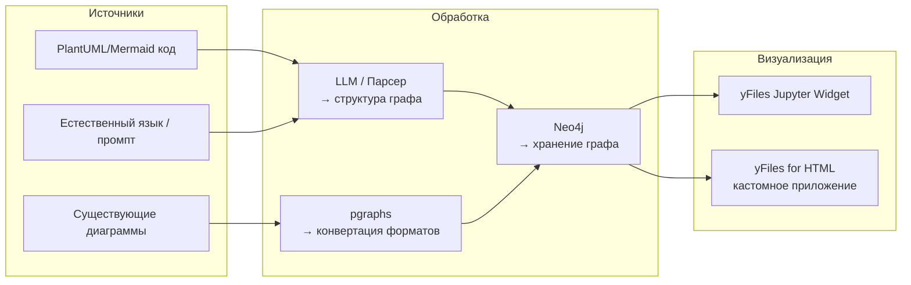

# Создание движка редактора диаграмм

## 👤 **Kirill**

нужно создать свой "движок" редактора диаграмм. или может быть это будет надстройка на уже существующие (plantuml, mermaid, d2, react flow). 
проблема существующих редакторов в ужасной компоновке элементов (элементы располагаются произвольно даже если указываешь направление, связи строятся нелогичные - там где можно "обойти" элемент связи располагаются под этими элементами, надписи налезают друг на друга.) в итоге из диаграммы получается что-то несуразное. 
хочется иметь инструмент для преобразования компоновки из различных редакторов в точные "перфикционистские" диаграммы, которые можно презентовать и заказчику и публике. 

напиши как ты понял задачу. и может быть видение такого проекта. оцени насколько сложна такая разработка?

---

## 🤖 **DeepSeek**

Отлично, я понял задачу. Давайте разложу её по полочкам, а затем предложу видение и оценку сложности.

---

### Как я понял задачу

Вам нужен инструмент (или надстройка), который решает **проблему «визуального мусора»** в автоматически сгенерированных диаграммах.

**Суть проблемы:**
Существующие инструменты (PlantUML, Mermaid, даже React Flow с автоматическим лейаутом) ориентированы на **графовую логику**, а не на **визуальную эстетику**. Они:
1.  **Плохо уважают пространство:** Элементы располагаются с нелогичными отступами.
2.  **Игнорируют геометрию маршрутов:** Ребра лезут сквозь узлы, вместо того чтобы их обходить (отсутствует *obstacle avoidance*).
3.  **Допускают коллизии:** Текст налезает на линии и другие тексты.
4.  **Слабо контролируют порядок:** Даже с указанием направления (`top to bottom`), компоновка ломается при наличии обратных связей или сложных групп.

**Цель:**
Создать инструмент, который берет «грязную» диаграмму (логику связей) на входе и выдает на выходе **презентабельную, выровненную по сетке, с чистыми ортогональными или плавными линиями без пересечений** диаграмму, готовую для показа заказчику.

---

### Видение проекта

Я вижу два архитектурных пути. Первый — это «cleaner» (надстройка), второй — «native» (свой движок). Учитывая вашу формулировку («движок редактора диаграмм»), я бы предложил гибридную архитектуру, которая минимизирует риски, но дает полный контроль над компоновкой.

#### Концепция: «Компоновщик-Перфекционист» (Layout Engine + Renderer)

Проект можно разделить на три независимых слоя:

**1. Слой парсинга и абстракции (Input)**
Вам не нужно изобретать синтаксис. Инструмент должен уметь принимать:
*   **Код:** PlantUML, Mermaid, D2 (текст).
*   **JSON:** экспорт из React Flow, Draw.io, Excalidraw.
*   **Цель:** Превратить это в универсальный граф (Node + Edge), где у узла есть тип (прямоугольник, ромб, группа), а у ребра — точки привязки (порты).

**2. Слой «Идеальной компоновки» (Layout Engine — сердце проекта)**
Это самое сложное место. Вам нужен не просто алгоритм компоновки (как у Dagre или ELK), а **алгоритм с пост-процессингом**.
*   **Шаг 1: Иерархия (Sugiyama-style):** Расположить узлы так, чтобы основной поток был направлен сверху вниз или слева направо. Использовать *Dagre* или *ELK* как базовый каркас, но с жесткими настройками приоритетов.
*   **Шаг 2: Выравнивание по сетке (Snap to Grid):** Это ключевое отличие от "мусора". После того как алгоритм выдал позиции, движок должен "притянуть" узлы к идеальной сетке (например, шаг 20px) и выровнять их по осям X или Y относительно соседей. Сложные группы (боксы) должны быть привязаны к родительским контейнерам жестко.
*   **Шаг 3: Роутинг ребер (Orthogonal / Curved):**
    *   Запретить проход ребра сквозь ноду.
    *   Использовать алгоритмы поиска пути (A* на сетке) для построения обходных маршрутов.
    *   Для презентабельных диаграмм критически важны *orthogonal connectors* (с прямыми углами) с фиксированными отступами от узлов (20-30px), чтобы линии не слипались с границами блоков.
*   **Шаг 4: Размещение меток:** Тексты не должны плавать. Метки ребер должны быть либо встроены в разрыв линии (с белым подложкой), либо вынесены строго в определенные четверти (север/юг от линии), с проверкой коллизий с другими метками.

**3. Слой визуализации и редактирования (Output)**
Здесь можно схитрить. Не нужно писать Canvas с нуля.
*   **Бэкенд-рендеринг:** Можно генерировать SVG через *Puppeteer* или *Rust* (если нужна производительность).
*   **Фронтенд-редактор:** Использовать *React Flow* или *XState* **только как рендерер**, отключив в нем встроенный автоматический лейаут. Ваш движок будет просто обновлять `position` у нод и `path` у эджей. React Flow идеально подходит для ручного "допиливания" после автоматики.

---

### Оценка сложности разработки

Оцениваю по шкале от 1 до 10, где 10 — это создание нового Figma или AutoCAD.

#### Общая сложность: **7.5 / 10** (Очень высоко, но выполнимо для опытной команды)

Это не «сделать за выходные», но и не «сложность операционной системы». Основная сложность не в коде как таковом, а в **математике и компромиссах**.

#### Детализация по модулям:

**1. Парсеры форматов (PlantUML, Mermaid, D2) — Сложность: 5/10**
*   *Нюанс:* Это скорее нудная работа. Mermaid и PlantUML имеют сложную грамматику. Проще не поддерживать 100% синтаксиса на старте, а ограничиться подмножеством (классические диаграммы классов, последовательностей, блок-схемы).
*   *Риск:* Если гнаться за поддержкой всех фич всех форматов, разработка превратится в болото.

**2. Алгоритм компоновки (Layout Engine) — Сложность: 9/10**
*   *Почему так сложно:* Готовые библиотеки (Dagre, ELK) дают 80% результата, но именно последние 20% («перфекционизм») требуют написания кастомной логики поверх.
*   *Основные вызовы:*
    *   **Поддержка групп (кластеров):** Стандартные алгоритмы часто ломают границы групп, если внутри группы есть связи наружу. Нужна сложная логика «портов» на границах групп.
    *   **Роутинг с обходом препятствий:** Реализовать A* для графов с тысячей элементов так, чтобы это работало за миллисекунды — нетривиальная задача.
    *   **Итеративный фидбек:** Система должна уметь «толкать» узлы, если при роутинге ребер обнаружилось, что линия не может пройти (force-directed коррекция).

**3. Рендеринг и взаимодействие — Сложность: 4/10**
*   Если брать React Flow (или аналоги) и отдать ему на отрисовку уже готовые идеальные координаты и пути, сложность низкая.
*   *Нюанс:* Если вы захотите сделать свой WebGL/Canvas рендерер для миллионных графов — сложность взлетит до 10. Для презентационных диаграмм (до 100-200 элементов) это не нужно.

**4. UI/UX «Ручной доводки» — Сложность: 6/10**
*   *Почему важно:* Заказчик всегда хочет подвинуть одну стрелку на 2 пикселя влево. Если ваш инструмент после авто-компоновки «запрещает» ручное редактирование или ломает сетку при ручном сдвиге — он бесполезен.
*   *Решение:* Нужна система *магнитов* и *смарт-гайдов*, как в Figma. Реализация этого на React сложнее, чем кажется, требует хорошей математики для выравнивания.

---

### Рекомендация по реализации (MVP)

Чтобы не утонуть в разработке «велосипеда», я бы предложил такой стек и подход:

1.  **Ядро (TypeScript / Rust (WebAssembly)):**
    *   Использовать **ELK (Eclipse Layout Kernel)** в качестве базы. Это самый мощный и настраиваемый фреймворк компоновки графов, который используют многие профессиональные инструменты.
    *   Написать **Post-Processor** на TS, который будет:
        *   Округлять координаты до сетки.
        *   Запускать алгоритм *Edge Bundling* или *Orthogonal Router* (например, *Dijkstra* на виртуальной сетке вокруг нод) поверх результатов ELK.

2.  **Фронтенд:**
    *   **React Flow** (или **xyflow**, его коммерческая версия). У него есть отличная поддержка кастомных ребер и возможность полного отключения автоматического позиционирования.
    *   *Фича:* Сделать кнопку "Auto-Layout Perfection". Она запускает ELK -> Post-Processor -> обновляет позиции в React Flow. Пользователь видит идеальную картинку и может её руками чуть-чуть подправить.

3.  **Импорт:**
    *   Начать с **Mermaid**. У неё самое активное сообщество и проще всего распарсить AST (Abstract Syntax Tree), так как она сама написана на JS.

### Главные риски

1.  **Производительность:** Если вы решите строить обходные пути для всех ребер на больших диаграммах (300+ нод) в реальном времени, браузер может зависнуть. Придется либо делать асинхронный Web Worker, либо ограничивать сложность диаграмм.
2.  **Сложность групп (containers):** Самый частый камень преткновения. Алгоритмы плохо понимают, что группа — это контейнер, а не просто большой узел. Если это критично для ваших диаграмм, закладывайте на этот модуль 40% времени разработки.
3.  **Субъективность «перфекционизма»:** То, что кажется идеальным вам (строгая сетка, ортогональные линии), может не нравиться дизайнерам, привыкшим к плавным линиям и свободной компоновке. Нужно закладывать много *настроек* (слайдеры для отступов, чекбоксы «избегать пересечений любой ценой»).

### Итог

**Стоит ли делать?**
Да, если вы часто сталкиваетесь с тем, что тратите часы на ручную правку стрелок в Draw.io после экспорта из PlantUML.

**Сложность разработки:**
Для создания *рабочего прототипа* (MVP), который берет Mermaid и выдает красивую диаграмму с обходом препятствий в React Flow, **2-3 месяца** работы опытного фронтенд-разработчика (full-stack) или команды из 2 человек.

Для создания *продукта*, который конкурирует с профессиональными редакторами (типа Lucidchart или Visio) по качеству авто-лейаута — **от 1 года** и команда 3-4 человека (математик/алгоритмист, фронтенд, бэкенд для парсинга).

---

## 👤 **Kirill**

а можно ли такое провернуть с графами? на том же neo4j или 3d graph (не знаю может еще есть какие-то движеи для графов. предложи варианты)

---

## 🤖 **DeepSeek**

Конечно, можно. Более того, **ваша идея "перфекционистской" компоновки для графов не просто возможна, а лежит в русле развития профессиональных инструментов.**

Если в первой части разговора мы говорили о диаграммах (блок-схемы, архитектура), то здесь речь пойдет о графах (социальные сети, знания, данные из Neo4j). Проблема та же: стандартные визуализаторы выдают "колючий шар" из пересекающихся линий, который невозможно презентовать заказчику.

Вот видение того, как можно провернуть это с графами, используя Neo4j как источник данных и специализированные движки для идеальной компоновки.

---

### Вариант 1. Связка: Neo4j (данные) → yFiles / OGDF (алгоритмы) → React/Vue (интерфейс)

Это самый надежный и "промышленный" вариант, если вам нужен контроль над компоновкой, как вы описывали.

**1. Neo4j — источник данных**
Здесь все понятно. Вы пишете Cypher-запрос, получаете JSON с узлами и связями. Сама Neo4j не занимается красивой компоновкой. Её встроенный визуализатор (Neo4j Browser) использует упрощенный силовой алгоритм (D3-force), который далек от "перфекционизма" [citation:1][citation:5]. Поэтому Neo4j у нас просто "база данных графа", а не движок отрисовки.

**2. yFiles (или OGDF) — "Мозг" компоновки**
Это ключевой момент. Вместо того чтобы писать алгоритмы с нуля, вы берете профессиональный коммерческий (yFiles) или opensource (OGDF на C++) фреймворк.
Эти движки умеют делать то, чего не умеет обычный `d3-force`:
*   **Иерархическая компоновка (Hierarchical Layout):** Располагает граф как направленный ациклический граф, чтобы стрелки смотрели в одну сторону, а не пересекались [citation:1][citation:5].
*   **Ортогональная компоновка (Orthogonal Layout):** Рисует граф в стиле чертежей печатных плат — только прямые углы, линии не лезут на узлы [citation:3][citation:7].
*   **Роутинг ребер (Edge Routing):** Это именно то, что вам нужно. Алгоритм воспринимает узлы как препятствия и прокладывает маршрут (обходной путь) для каждого ребра, чтобы оно не пересекало ноду [citation:3][citation:4][citation:7]. yFiles, например, умеет даже "bus routing", когда несколько ребер группируются в общий ствол, выходя из порта узла [citation:7].

**3. React Flow / Cytoscape.js — Фронтенд**
Вы получаете от yFiles (или OGDF) готовые координаты (`x, y`) для узлов и детальный путь (`path`) для ребер (последовательность точек изгибов). После этого вы просто рендерите это в любом визуализаторе. React Flow (о котором мы говорили ранее) подходит идеально, так как вы просто передаете ему готовые позиции.

---

### Вариант 2. 3D графы: Neo4j + 3d-force-graph

Если ваши данные настолько сложны (сотни узлов), что на 2D-плоскости они неизбежно превращаются в "спагетти", можно уйти в третье измерение. Однако здесь есть нюанс: **3D редко бывает "презентабельным" для заказчика, если это не дашборд для технических специалистов.**

Библиотека `3d-force-graph` — это стандарт де-факто для 3D визуализации графов в браузере [citation:2][citation:6].
*   **Плюсы:** Шикарная производительность (WebGL/ThreeJS), поддержка Neo4j (можно передавать данные напрямую), интерактивность, поддержка VR/AR.
*   **Минусы:** Использует **силовой алгоритм (force-directed)**. Это значит, что узлы будут "плавать" и отталкиваться друг от друга. **Он не дает "перфекционистской" компоновки.** Линии всё равно будут проходить сквозь узлы, если не написать сложные кастомные обработчики физики.

**Вывод по 3D:** Если вам нужен "вау-эффект" и исследование больших данных — 3d-force-graph отличный выбор. Если нужна "идеальная диаграмма для презентации" — 3D не подходит из-за отсутствия четкой сетки и ортогональной маршрутизации.

---

### Вариант 3. Graphviz (DOT) как "компоновщик" для Neo4j

Это самый простой способ, если вы хотите минимальную разработку. Graphviz — это движок, который как раз и создан для "перфекционистских" диаграмм (ортогональные линии, никаких наезжаний).

**Схема работы:**
1.  Данные из Neo4j (Cypher) -> конвертер в формат **DOT** (текстовое описание графа).
2.  Запускаем движок `dot` (или `neato` с настройками) из Graphviz.
3.  Получаем на выходе SVG или JSON с идеально рассчитанными координатами.
4.  Рендерим через React Flow или любой другой компонент.

Этот подход решает вашу главную проблему: Graphviz содержит тот самый "роутер", который строит обходные пути и не позволяет линиям пересекать блоки [citation:4][citation:8]. Однако, у него сложный DSL (DOT), который придется генерировать самостоятельно.

---

### Сравнение подходов

| Характеристика | **Neo4j + yFiles/OGDF** | **Neo4j + 3d-force-graph** | **Neo4j + Graphviz** |
| :--- | :--- | :--- | :--- |
| **Качество компоновки** | **Идеальное** (ортогональная, иерархическая, роутинг с обходом) [citation:3][citation:7] | Среднее (силовая, "колючий шар") [citation:2] | **Идеальное** (ортогональная, splines) [citation:4] |
| **Работа с Neo4j** | Нужен конвертер (JSON -> формат движка) | Нативная интеграция (прямая передача данных) [citation:6] | Нужен конвертер (Cypher -> DOT) |
| **Презентабельность** | **Высокая** (подходит для заказчика) | Средняя (больше подходит для исследований) | **Высокая** (классический инженерный стиль) |
| **Сложность реализации** | **Высокая** (интеграция Java/JS библиотек) | **Низкая** (подключил библиотеку и отдал данные) | **Средняя** (генерация DOT и парсинг SVG) |
| **Интерактивность** | Полная (drag, zoom, edit) | Полная (вращение камеры, клики) | Статичная (или через перерисовку) |

### Итоговая рекомендация

Поскольку ваша цель — **"презентовать заказчику и публике"**, а проблема — **"ужасная компоновка, связи строятся нелогично"**, я рекомендую **Вариант 1 (yFiles/OGDF) или Вариант 3 (Graphviz)** .

**Вот архитектура, которая даст вам тот самый "перфекционизм":**

1.  **Бэкенд (Python/Java/Node.js):** Пишем сервис, который получает данные из Neo4j.
2.  **Движок компоновки:** Используем **yFiles** (если есть бюджет) или **OGDF / Graphviz** (если бесплатно). Задача движка — не просто расположить узлы, а **прокладывать пути ребер через "каналы"**, огибая узлы и группируя линии [citation:7].
3.  **Фронтенд (React Flow):** Используем React Flow в режиме "только отображение" (с отключенной автоматической компоновкой). Он получает от бэкенда:
    *   Позиции узлов (выровненные по сетке).
    *   Координаты путей ребер (изогнутые или ортогональные).
4.  **Результат:** Вы получаете граф из Neo4j, который выглядит как аккуратная схема электрической платы или архитектурная блок-схема, а не как клубок паутины.

### Сложность такого проекта (графовая версия)

Если сравнивать с диаграммным движком из прошлого вопроса, **графовый "перфекционист" сложнее примерно на 20-30%** .

*   **Интеграция с Neo4j:** не сложно (4/10).
*   **Настройка промышленного роутера (yFiles/OGDF):** **8/10**. Эти библиотеки имеют очень сложное API. Настроить их так, чтобы они выдавали именно "презентабельную" картинку, а не просто технический результат — задача для опытного инженера.
*   **Синхронизация с React Flow:** 5/10 (нужно будет писать кастомные типы ребер для поддержки сложных путей из yFiles).

**Стоит ли оно того?** Да, если вы часто показываете заказчикам сложные графы из баз данных. Это превращает "сырые данные" в "архитектурную схему", что значительно повышает доверие и качество коммуникации.

---

## 👤 **Kirill**

а есть примеры визуализации на этих инструментах?

---

## 🤖 **DeepSeek**

Да, конечно. Вот наглядные примеры того, как каждый из рассмотренных инструментов визуализирует графы из Neo4j. Они наглядно демонстрируют разницу между "просто графом" и "перфекционистской диаграммой", которую вы хотите получить.

---

### 1. yFiles: Промышленный стандарт идеальной компоновки

**yFiles** — это движок, который решает именно ту задачу, которую вы описали: автоматическое построение "перфекционистских" диаграмм с ортогональными линиями, обходящими узлы.

**Примеры реализации с Neo4j:**

*   **Neo4j + yFiles в Jupyter Notebook** — это готовое решение. Библиотека `yfiles-jupyter-graphs-for-neo4j` позволяет выполнить Cypher-запрос и сразу получить визуализацию с профессиональной компоновкой [citation:5][citation:9].
    *   **Ключевая функция:** Вы можете выбирать алгоритм компоновки: `"hierarchic"` (иерархическая), `"orthogonal"` (ортогональная — с прямыми углами), `"radial"` (радиальная), `"organic"` (органическая) [citation:5].
    *   **Внешний вид:** Узлы будут аккуратно выровнены, а линии (ребра) проведены по "каналам", не пересекая блоки. Именно это делает диаграмму презентабельной.

*   **Neo4j + yFiles + Streamlit** — еще один готовый пример. Разработчик выложил на GitHub полноценное приложение, которое подключается к Neo4j, выполняет запрос и рисует граф с помощью yFiles [citation:1].

**Что вы получите:** Граф, выглядящий как инженерная схема или архитектурная блок-схема, где все элементы расположены строго по сетке, а связи проведены по оптимальным путям.

---

### 2. 3D-графы (3d-force-graph): Эффектно, но хаотично

**3d-force-graph** — это библиотека, которая создает впечатляющие 3D-визуализации, но с точки зрения "перфекционизма" она противоположна yFiles. Вместо четкой структуры она использует **силовой алгоритм (force-directed)**: узлы "плавают" и отталкиваются друг от друга, связи пересекаются, а конечный вид предсказать сложно.

**Примеры реализации с Neo4j:**

*   **Проект neo4j-3d-force-graph** на GitHub содержит серию примеров визуализации данных из Neo4j в 3D [citation:3][citation:7].
    *   **Базовая загрузка:** Просто отображает 5000 связей в виде "паутины" [citation:3][citation:7].
    *   **Продвинутые примеры:** Можно раскрашивать узлы по типу (label), показывать вес узлов (PageRank) размером сферы, а связи визуализировать в виде "роя частиц", движущихся от одного узла к другому [citation:7]. Это выглядит очень технологично, но для презентации заказчику, который ждет четкую схему, это может быть слишком "шумно".

**Что вы получите:** Впечатляющую интерактивную 3D-сцену, которую можно крутить и приближать. Однако она не будет соответствовать вашему критерию "точных перфекционистских диаграмм" из-за хаотичной природы силовой компоновки.

---

### 3. Graphviz (DOT): Классическая инженерная графика

**Graphviz** — это старейший и проверенный инструмент для получения аккуратных, четких диаграмм. Он также не создает "паутину", а стремится к структурированному виду.

**Примеры реализации с Neo4j:**

*   **Встроенный экспорт из Neo4j** — сама Neo4j имеет скрытую функцию экспорта в формат DOT [citation:6].
    *   **Процесс:** Выполнив запрос в Neo4j, вы можете сгенерировать `.dot`-файл, а затем через утилиту командной строки `dot` превратить его в PNG или SVG [citation:6][citation:10].
    *   **Внешний вид:** Результат получается в стиле "инженерной схемы": прямоугольники, линии с прямыми углами или плавные изгибы (splines), строгое направление сверху-вниз или слева-направо.
*   **El Dorado UI** — пример более сложной архитектуры, где приложение на Ruby (Sinatra) берет данные из Neo4j, превращает их в DOT-код через шаблоны и отдает на рендеринг в Graphviz [citation:2].

**Что вы получите:** Классическую, строгую диаграмму, идеально подходящую для технической документации. Однако взаимодействие с такой картинкой (zoom, drag) потребует дополнительных усилий.

---

### 4. React Flow: Базовый рендер без "мозгов"

**React Flow** — это библиотека для отрисовки, но в ней **нет встроенных алгоритмов компоновки** [citation:8]. Это как холст и кисти, но без художника.

**Примеры реализации с Neo4j:**
*   **neo-flow-viz** — пример библиотеки на TypeScript, которая пытается связать React Flow с Neo4j [citation:4].
*   **Самостоятельная реализация:** Как отмечают разработчики на Stack Overflow, чтобы получить "умную" компоновку (force, tree, circle), вам придется реализовать её самостоятельно, используя, например, `d3-force` [citation:8].

**Что вы получите:** React Flow сам по себе не решает вашу главную проблему (ужасная компоновка). Он станет отличным **инструментом отрисовки**, если вы будете передавать в него идеальные координаты и пути, рассчитанные yFiles или Graphviz.

---

### Итоговое сравнение визуализаций

| Инструмент | Внешний вид | Компоновка | Соответствие вашей задаче |
| :--- | :--- | :--- | :--- |
| **yFiles** | Идеальная, строгая, линии не пересекают узлы | Ортогональная, иерархическая (высший пилотаж) | **Полностью соответствует**. Дает "перфекционистские" диаграммы. |
| **3d-force-graph** | Хаотичная, "паутина", но эффектная 3D-графика | Силовая (force-directed), непредсказуемая | Не соответствует. Скорее для исследований, чем для презентаций. |
| **Graphviz** | Четкая, инженерная, структурированная | Иерархическая, ортогональная (классика) | **Соответствует**. Отличный выбор для статичных схем. |
| **React Flow** | Зависит от того, какие данные вы в него передадите | Отсутствует (нужно подключать внешний движок) | Это "холст". Без связки с yFiles или Graphviz проблему не решает. |

### Рекомендация

Если вы хотите показать заказчику идеальную диаграмму из базы данных, **ваш выбор — связка Neo4j + yFiles**. Это готовый, проверенный путь, который используется в профессиональных инструментах.

*   **Для Jupyter Notebook:** используйте `yfiles-jupyter-graphs-for-neo4j` [citation:5].
*   **Для веб-приложения:** используйте `yfiles-graphs-for-streamlit` или интеграцию через JavaScript [citation:1][citation:9].

yFiles дает вам те самые алгоритмы (orthogonal, hierarchic, radial), которые раскладывают "кашу" из данных в аккуратную, презентабельную схему, где связи логично обходят элементы, а надписи не налезают друг на друга.

---

## 👤 **Kirill**

Остается вопрос как на лету делать диаграммы в "привычном" редакторе (plantuml, mermaid) или естественным языком (в виде промпта с описанием архитектуры) и преобразовывать их в связке neo4j + yFiles

---

## 🤖 **DeepSeek**

Отличный вопрос! Вы описываете именно то, что сейчас формируется как **новый стандарт работы с графами** — конвертация из любого источника (текст, код диаграмм, естественный язык) в структурированный граф Neo4j с последующей профессиональной визуализацией через yFiles.

Схематично архитектуру можно представить так:



---

## Решение 1: Текстовые диаграммы (PlantUML/Mermaid) → Neo4j → yFiles

### Инструмент: pgraphs

Существует готовый инструмент — библиотека **pgraphs**, которая умеет конвертировать Mermaid и GraphViz DOT в формат, загружаемый в Neo4j [citation:2].

```bash
# Установка
npm install -g pgraphs

# Конвертация Mermaid в Cypher CREATE statements
pgraph diagram.mmd -t cypher > import.cypher

# Или через Neo4j напрямую
pgraph diagram.mmd -t neo4j
```

**Как это работает:**

1. Вы подаете на вход файл с диаграммой в формате Mermaid или DOT
2. `pgraph` парсит структуру графа (узлы, связи, свойства)
3. На выходе получаете Cypher-запросы для Neo4j или прямую загрузку в БД

**Поддерживаемые форматы на входе** [citation:2]:
- Mermaid (экспериментально)
- GraphViz DOT
- Trivial Graph Format (TGF)
- JSON Canvas
- Cypher CREATE (уже готовые запросы)

### Интеграция с yFiles

После загрузки графа в Neo4j, используйте **yFiles Jupyter Widget** для визуализации прямо из ноутбука [citation:5]:

```python
from neo4j import GraphDatabase
from yfiles_jupyter_graphs import GraphWidget

# Подключение к Neo4j
driver = GraphDatabase.driver(
    "neo4j+s://your-instance.databases.neo4j.io", 
    auth=("username", "password")
)
session = driver.session()

# Функция визуализации результата запроса
def show_graph(cypher_query):
    widget = GraphWidget(graph=session.run(cypher_query).graph())
    
    # Настройка отображения меток
    def node_label_mapping(node):
        props = node["properties"]
        return props.get("name", props.get("label", "<unlabeled>"))
    
    widget.node_label_mapping = node_label_mapping
    display(widget)

# Показать граф
show_graph("MATCH (n)-[r]->(m) RETURN n,r,m LIMIT 50")
```

**Важно:** yFiles Jupyter Widget — это **бесплатный инструмент** [citation:6]. Он автоматически применяет профессиональные алгоритмы компоновки (иерархический, ортогональный, органический) к вашему графу.

---

## Решение 2: Естественный язык / промпт → Neo4j → yFiles

### Инструмент: LLM Graph Builder

Существует готовое opensource-решение — **LLM Graph Builder** от Neo4j [citation:3].

**Архитектура:**
```
Текст/промпт → LLM (OpenAI, Gemini, Anthropic и др.) → структура графа → Neo4j → yFiles
```

**Что умеет:**

1. **Извлечение сущностей и связей** из любого текста с помощью LLM
2. **Поддержка пользовательской схемы** — можно задать, какие типы узлов и связей нужно извлекать
3. **Обработка различных источников**: PDF, DOC, YouTube, веб-страницы, просто текст
4. **Визуализация через Neo4j Bloom** (и через yFiles при желании)

**Поддерживаемые LLM** [citation:3]:
- OpenAI (GPT-4o, GPT-4o-mini)
- Google Gemini
- Anthropic Claude
- Groq
- Ollama (локальные модели)
- Deepseek
- Amazon Bedrock

### Быстрый старт с LLM Graph Builder:

```bash
# Клонирование репозитория
git clone https://github.com/auggernaut/llm-graph-builder
cd llm-graph-builder

# Запуск через Docker Compose
docker-compose up

# Или ручной запуск
# Бэкенд (Python/FastAPI)
cd backend
python -m venv venv
source venv/bin/activate
pip install -r requirements.txt
uvicorn score:app --reload

# Фронтенд (React)
cd frontend
yarn
yarn dev
```

**Процесс работы:**

1. Подключаетесь к Neo4j через интерфейс приложения
2. Выбираете LLM (например, OpenAI GPT-4o)
3. Вводите текст или загружаете документ
4. LLM извлекает сущности и связи
5. Данные загружаются в Neo4j
6. Открываете Neo4j Bloom или yFiles для визуализации

---

## Решение 3: Полная интеграция в кастомное приложение

Если вам нужен веб-интерфейс, а не Jupyter Notebook, используйте **yFiles for HTML** с прямым подключением к Neo4j [citation:9].

### Пример кода:

```javascript
import neo4j from 'neo4j-driver';
import * as yfiles from 'yfiles';

// 1. Подключение к Neo4j
const driver = neo4j.driver(
    'neo4j://localhost:7687',
    neo4j.auth.basic('username', 'password')
);

// 2. Выполнение Cypher-запроса
const session = driver.session();
const result = await session.run(`
    MATCH (n)-[r]->(m)
    RETURN n, r, m
    LIMIT 100
`);

// 3. Построение графа для yFiles
const graphBuilder = new yfiles.GraphBuilder();
graphBuilder.addNodesFrom(result.records, record => record.get('n').identity);
graphBuilder.addEdgesFrom(result.records, record => ({
    source: record.get('n').identity,
    target: record.get('m').identity,
    label: record.get('r').type
}));

const graph = graphBuilder.build();

// 4. Применение идеальной компоновки
const layout = new yfiles.HierarchicLayout();
layout.orthogonalRouting = true;  // ортогональные линии
layout.integratedEdgeLabeling = true;  // умное размещение меток
await layout.applyLayout(graph);

// 5. Рендеринг
const graphComponent = new yfiles.GraphComponent();
graphComponent.graph = graph;
```

**Доступные алгоритмы компоновки в yFiles** [citation:4][citation:8]:
- **Hierarchic Layout** — для направленных графов (сверху-вниз или слева-направо)
- **Orthogonal Layout** — все линии под прямыми углами, как на чертежах
- **Organic Layout** — для ненаправленных графов
- **Circular Layout** — циклическая компоновка
- **Radial Layout** — радиальная (от центра)
- **Tree Layout** — для древовидных структур

---

## Сравнение подходов

| Характеристика | **pgraphs + yFiles Jupyter** | **LLM Graph Builder** | **yFiles for HTML кастомное** |
| :--- | :--- | :--- | :--- |
| **Входной формат** | Mermaid, DOT, TGF | Любой текст, документы, ссылки | Любой (через код) |
| **Работа с естественным языком** | ❌ | ✅ (через LLM) | ❌ (нужно реализовать) |
| **Требует кода** | Минимум (CLI + Python) | Минимум (Docker) | Много (JS/TS) |
| **Качество компоновки** | ✅ yFiles | ⚠️ Bloom (среднее) | ✅ yFiles (макс) |
| **Интерактивность** | Высокая (Jupyter) | Средняя (Bloom) | Максимальная (кастомное) |
| **Сложность внедрения** | Низкая | Низкая | Высокая |

---

## Моя рекомендация

Для вашей задачи — **создание "перфекционистских" диаграмм из любого источника** — оптимальный путь:

### Этап 1: Быстрый старт (для экспериментов)
Используйте **pgraphs** для конвертации Mermaid/DOT в Neo4j + **yFiles Jupyter Widget** для визуализации [citation:5][citation:6].

```bash
# Конвертация
pgraph my-diagram.mmd -t cypher > import.cypher
cat import.cypher | cypher-shell -u neo4j -p password

# Визуализация в Jupyter
from yfiles_jupyter_graphs import GraphWidget
widget = GraphWidget(graph=session.run("MATCH (n) RETURN n LIMIT 100").graph())
display(widget)
```

### Этап 2: Продакшен-решение
Если хотите работать с **естественным языком**, разверните **LLM Graph Builder** [citation:3]:

1. Запустите через Docker Compose
2. Настройте подключение к Neo4j
3. Вводите текст или промпты — LLM сам извлечет структуру
4. Для визуализации используйте Neo4j Bloom или интегрируйте yFiles

### Этап 3: Промышленная платформа
Если нужен полноценный продукт с кастомным UI — используйте **yFiles for HTML** с прямым подключением к Neo4j [citation:9][citation:10].

---

## Ключевой вывод

Вы можете **автоматизировать весь пайплайн**:

1. **Промпт** (естественный язык) → LLM → структура графа → Neo4j
2. **PlantUML/Mermaid код** → pgraphs → Cypher → Neo4j
3. **Neo4j** → yFiles → идеальная компоновка с ортогональными линиями и обходом узлов

yFiles Jupyter Widget — бесплатный инструмент, который сразу дает профессиональное качество визуализации [citation:6]. А LLM Graph Builder позволяет "на лету" превращать текстовые описания архитектуры в структурированные графы [citation:3].

Вам не нужно писать сложный код с нуля — достаточно соединить готовые компоненты в единый конвейер.

---

## 👤 **Kirill**

Должна быть возможность управлять самому (подвигать стрелочки, узлы как в редакторах типа draw.io, visio и т.д. Заменить отрисовку компоненто, например не просто прямоугольник а в виде икони) Это будет в таком решении?

---

## 🤖 **DeepSeek**

Да, в решении на основе **yFiles for HTML** есть **полноценная поддержка всех перечисленных вами функций**. Более того, yFiles — это не просто визуализатор, а именно **профессиональный редактор диаграмм**, который по своим возможностям сопоставим с draw.io и Visio, но при этом программно управляем.

Ниже я подробно разберу, как каждая из ваших потребностей реализуется в этом стеке.

---

## 1. Ручное управление: перемещение узлов, стрелок, линий

**Да, поддерживается в полном объеме.** yFiles предоставляет готовый интерактивный режим `GraphEditorInputMode`, который включает весь спектр привычных операций редактирования [citation:5].

### Что можно делать мышью:
| Операция | Реализация в yFiles |
|----------|---------------------|
| **Перемещение узлов** | Drag & drop, есть магнитные направляющие (snap guides) для выравнивания [citation:2] |
| **Перетаскивание стрелок (связей)** | Edge reconnection — захват за порт и перетягивание на другой узел [citation:4] |
| **Изменение формы линий** | Добавление/перемещение изгибов (bends) на ребрах |
| **Изменение размера узлов** | Ресайз-хендлы по углам и сторонам [citation:2] |
| **Сетка и привязка** | Отображение сетки (grid) и принудительное выравнивание (grid snapping) [citation:2] |
| **Выделение нескольких элементов** | Marquee selection — выделение рамкой, lasso selection [citation:9] |
| **Копирование/вставка** | Полноценный clipboard с поддержкой undo [citation:2] |
| **Группировка** | Поддержка вложенных групп (group nodes) с возможностью collapse/expand [citation:2] |

### Пример включения режима редактирования:
```javascript
// Включаем полноценный редактор вместо простого просмотрщика
graphComponent.inputMode = new GraphEditorInputMode();

// Теперь пользователь может:
// - двигать узлы
// - переподключать связи
// - изменять размеры
// - добавлять/удалять элементы
```

---

## 2. Замена отрисовки компонентов (не просто прямоугольники, а иконки)

**Да, это одна из сильных сторон yFiles.** Вы можете полностью кастомизировать визуальное представление узлов и связей.

### Варианты стилизации узлов:

#### 2.1 Готовые формы
```javascript
import { ShapeNodeStyle, RectangleNodeStyle, ArrowNodeStyle } from 'yfiles';

// Прямоугольник со скругленными углами
const roundedStyle = new RectangleNodeStyle({
  cornerStyle: 'round',
  cornerSize: 10,
  fill: '#4a90e2',
  stroke: '#2c3e50'
});

// Форма "стрелка" — для обозначения направлений
const arrowStyle = new ArrowNodeStyle({
  shape: 'notched-arrow',
  direction: 'right',
  fill: '#e67e22'
});
```

#### 2.2 Иконки и изображения (ImageNodeStyle)
```javascript
import { ImageNodeStyle } from 'yfiles';

// Узел в виде иконки из внешнего файла
const databaseIcon = new ImageNodeStyle({
  href: '/icons/database.svg',
  aspectRatio: 1,  // сохраняем пропорции
  normalizedOutline: new GeneralPath().appendEllipse(new Rect(0,0,1,1), true)
});

// Узел с иконкой AWS
const awsS3Icon = new ImageNodeStyle({
  href: '/icons/aws-s3.svg'
});

graph.createNode([0, 0, 48, 48], databaseIcon);
```

#### 2.3 SVG-шаблоны с данными (TemplateNodeStyle)
Позволяет создавать сложные визуальные компоненты, которые динамически подставляют данные из Neo4j:

```xml
<script type="text/yfiles-template">
  <g id="server-template">
    <rect fill="{Binding fillColor}" width="60" height="60" rx="8" />
    <image xlink:href="{Binding iconUrl}" width="32" height="32" x="14" y="14" />
    <text x="30" y="85" text-anchor="middle">{Binding name}</text>
  </g>
</script>
```

#### 2.4 Полностью кастомная отрисовка
Можно реализовать свой собственный `INodeStyle` и рисовать что угодно через Canvas или SVG [citation:10].

---

## 3. Поддержка Neo4j в этом сценарии

**yFiles имеет готовую интеграцию с Neo4j** [citation:7]. Это означает, что вы можете:

1. Подключиться к Neo4j напрямую из браузера через официальный JavaScript-драйвер
2. Выполнить Cypher-запрос
3. Преобразовать результат в граф yFiles с помощью `GraphBuilder`
4. Предоставить пользователю полный контроль над визуализацией

### Архитектура решения:

```
Neo4j Database
    ↓ (Bolt Protocol / Neo4j Driver)
yFiles GraphBuilder
    ↓ (преобразование данных)
IGraph (yFiles)
    ↓
GraphComponent (интерактивный редактор)
    ↓
Пользователь: двигает узлы, переподключает связи, меняет стили
    ↓
Возможность синхронизации изменений обратно в Neo4j (по вашему усмотрению)
```

### Пример полной интеграции:
```javascript
import neo4j from 'neo4j-driver';
import { GraphComponent, GraphBuilder, GraphEditorInputMode, OrganicLayout } from 'yfiles';

// 1. Подключение к Neo4j
const driver = neo4j.driver('neo4j://localhost:7687', 
                            neo4j.auth.basic('neo4j', 'password'));

// 2. Выполнение Cypher-запроса
const session = driver.session();
const result = await session.run(`
    MATCH (n:Person)-[r:KNOWS]->(m:Person)
    RETURN n, r, m
    LIMIT 100
`);

// 3. Построение графа yFiles из данных Neo4j
const graphBuilder = new GraphBuilder();
graphBuilder.addNodesFrom(result.records, record => record.get('n').identity);
graphBuilder.addEdgesFrom(result.records, record => ({
    source: record.get('n').identity,
    target: record.get('m').identity,
    label: record.get('r').type
}));

const graph = graphBuilder.build();

// 4. Инициализация редактора
const graphComponent = new GraphComponent('#canvas');
graphComponent.graph = graph;
graphComponent.inputMode = new GraphEditorInputMode();  // полное редактирование

// 5. Автоматическая компоновка (иерархическая или ортогональная)
const layout = new OrganicLayout();  // или HierarchicLayout
await layout.applyLayout(graphComponent.graph);

// 6. Настройка стилей узлов на основе данных из Neo4j
graph.nodeStyles.setDefault(new ShapeNodeStyle({
    fill: '#4a90e2',
    stroke: '#2c3e50',
    shape: 'round-rectangle'
}));
```

---

## 4. Как это все объединяется: полная архитектура

```
┌─────────────────────────────────────────────────────────────────┐
│                       Источник данных                           │
├─────────────────────────────────────────────────────────────────┤
│  PlantUML/Mermaid  │  Естественный язык (LLM)  │  Neo4j Query  │
└─────────┬───────────┴──────────────┬───────────┴───────┬───────┘
          │                           │                   │
          ▼                           ▼                   ▼
┌─────────────────────────────────────────────────────────────────┐
│                    Преобразование в граф                        │
├─────────────────────────────────────────────────────────────────┤
│  pgraphs (конвертация)  │  LLM Graph Builder  │  Neo4j Driver  │
└─────────────────────────┴─────────────────────┴────────────────┘
                              │
                              ▼
┌─────────────────────────────────────────────────────────────────┐
│              Neo4j Database (опционально)                       │
│                 Хранение структуры графа                        │
└─────────────────────────────────────────────────────────────────┘
                              │
                              ▼
┌─────────────────────────────────────────────────────────────────┐
│              yFiles for HTML — ЯДРО ВИЗУАЛИЗАЦИИ                │
├─────────────────────────────────────────────────────────────────┤
│  • GraphBuilder — загрузка данных                               │
│  • HierarchicLayout / OrganicLayout — авто-компоновка          │
│  • GraphEditorInputMode — интерактивное редактирование         │
│     - Drag & Drop узлов                                        │
│     - Переподключение связей                                   │
│     - Изменение размеров                                       │
│     - Snap to grid / snap guides                               │
│  • Кастомные NodeStyle — иконки, изображения, SVG-шаблоны      │
└─────────────────────────────────────────────────────────────────┘
                              │
                              ▼
┌─────────────────────────────────────────────────────────────────┐
│                    Готовая диаграмма                            │
│         Презентабельная + полностью редактируемая              │
└─────────────────────────────────────────────────────────────────┘
```

---

## 5. Готовые примеры для быстрого старта

### 5.1 Data Explorer for Neo4j (бесплатное веб-приложение)
yWorks предлагает готовое приложение **Data Explorer for Neo4j**, которое:
- Подключается к вашей Neo4j базе
- Позволяет выполнять Cypher-запросы
- Дает полноценный редактор с возможностью двигать элементы
- Позволяет экспортировать настройки в App Generator [citation:7]

### 5.2 Neo4j Integration Sample Application
Входит в состав yFiles for HTML. Демонстрирует:
- Загрузку данных из Neo4j
- Отображение с автоматическим лейаутом
- Интерактивное расширение графа (double-click для загрузки новых узлов)
- Просмотр свойств узлов [citation:3]

### 5.3 App Generator (low-code инструмент)
Позволяет в визуальном интерфейсе настроить:
- Какие данные загружать из Neo4j
- Как выглядят узлы (иконки, цвета, формы)
- Какие стили связей использовать
- И сгенерировать готовое приложение [citation:7]

---

## 6. Ограничения и важные нюансы

### 6.1 yFiles — коммерческая библиотека
Это платный продукт от yWorks. Однако:
- Есть **бесплатный trial** для оценки
- Стоимость лицензии оправдана для промышленного использования
- Альтернатива: использовать **бесплатные библиотеки** (Cytoscape.js, D3.js), но тогда придется самостоятельно реализовывать весь функционал ручного редактирования

### 6.2 Что нужно будет написать самому
yFiles дает ядро, но несколько вещей придется реализовать:
- **Синхронизацию изменений обратно в Neo4j** (yFiles не записывает данные автоматически)
- **Конвертацию из PlantUML/Mermaid в структуру графа** (можно через pgraphs)
- **Интеграцию с LLM** для преобразования естественного языка в граф

### 6.3 Альтернативный бесплатный путь
Если бюджет ограничен, можно использовать **Cytoscape.js** + ручная реализация редактирования:
- Cytoscape.js имеет базовые возможности drag & drop
- Но функционал переподключения связей, сетки и профессионального редактирования придется писать самому

---

## Резюме

| Ваше требование | Реализация в yFiles + Neo4j |
|-----------------|---------------------------|
| **Ручное перемещение узлов** | ✅ `GraphEditorInputMode` + drag & drop |
| **Ручное перемещение стрелок (переподключение)** | ✅ Edge reconnection через порты [citation:4] |
| **Управление линиями (bends)** | ✅ Интерактивное добавление/перемещение изгибов |
| **Замена прямоугольников на иконки** | ✅ `ImageNodeStyle`, `TemplateNodeStyle`, кастомные стили [citation:10] |
| **Привязка к сетке (snap to grid)** | ✅ Встроенная поддержка [citation:2] |
| **Источник: PlantUML/Mermaid** | ✅ через pgraphs → Neo4j → yFiles |
| **Источник: естественный язык** | ✅ через LLM Graph Builder → Neo4j → yFiles |
| **Источник: Neo4j напрямую** | ✅ нативная интеграция через Neo4j driver [citation:7] |

**Вывод:** решение на основе yFiles for HTML + Neo4j **полностью покрывает все ваши требования** — и автоматическую "перфекционистскую" компоновку, и ручное редактирование как в Visio/draw.io, и кастомизацию внешнего вида узлов, и работу с различными источниками входных данных (диаграммы, промпты, Neo4j).

---

## 👤 **Kirill**

плохо что платно. сколько это стоит?

---

## 🤖 **DeepSeek**

Понимаю ваше беспокойство. Давайте разберем стоимость yFiles и что можно с этим сделать.

---

## Бесплатная альтернатива, которая есть уже сейчас

**Есть бесплатный вариант**, который уже покрывает часть ваших потребностей:

**yFiles Jupyter Widget** — это бесплатный инструмент для визуализации графов из Neo4j прямо в Jupyter Notebook [citation:1][citation:2]. Он:
- Не требует лицензии
- Дает профессиональную компоновку (иерархическую, ортогональную)
- Подключается напрямую к Neo4j
- Работает "из коробки" после установки

Но **минус**: это не полноценный интерактивный редактор, как draw.io. Вы не можете мышкой двигать узлы и перетаскивать связи — это статическая или полу-интерактивная визуализация.

---

## Стоимость коммерческой лицензии yFiles for HTML

**Точных публичных цен yWorks не раскрывает** — они предлагают индивидуальный расчет под проект [citation:5]. Однако на основе обсуждений разработчиков и доступной информации можно составить примерную картину:

### Типы лицензий [citation:8][citation:10]

| Тип лицензии | Для кого | Что дает |
|-------------|----------|----------|
| **Single Developer License** | Один разработчик | Право использовать библиотеку одному человеку |
| **Project License** | Один проект | До 3 разработчиков на один проект |
| **Site License** | Вся компания (одна локация) | Неограниченное число разработчиков на одной площадке |

### Ориентировочные цены (из обсуждений разработчиков) [citation:3]

| Тип лицензии | Цена (примерно) |
|-------------|-----------------|
| Single Developer License | **~$7,200** (однократно) |
| Project License | **~$14,400** (однократно) |
| Site License | **~$28,800** (однократно) |

**Важно**: это **perpetual license** — вы покупаете библиотеку один раз и можете использовать ее бессрочно [citation:5][citation:10].

### Подписка на поддержку и обновления [citation:7]

Техническая поддержка и обновления продаются отдельно как **annual subscription**:
- Примерно **~$3,000 в год** (в зависимости от типа лицензии)
- **Необязательна** — библиотека продолжает работать и без нее
- Нужна, если хотите получать новые версии и официальную поддержку

---

## Что входит в стоимость

За эти деньги вы получаете [citation:5]:

1. **Полнофункциональную библиотеку** — все алгоритмы компоновки (иерархический, ортогональный, органический, радиальный, круговой)
2. **GraphEditorInputMode** — готовый редактор с drag & drop, переподключением связей, сеткой, направляющими
3. **Кастомные стили узлов** — поддержка иконок, SVG-шаблонов, изображений
4. **Интеграцию с Neo4j** — через стандартный JavaScript-драйвер
5. **Право на распространение** — вы можете встраивать yFiles в свои приложения и распространять их без роялти
6. **Документацию, примеры, поддержку** (при наличии подписки)

---

## Варианты действий

### Вариант 1: Начать с бесплатного (рекомендую)

1. **Скачайте 60-дневную trial-версию** yFiles for HTML с сайта my.yworks.com [citation:1][citation:6]
2. **Протестируйте** — сможете ли вы за 60 дней реализовать прототип
3. **Используйте бесплатный yFiles Jupyter Widget** для визуализации из Neo4j, если интерактивное редактирование не критично
4. **Примите решение** — нужна ли вам именно полная версия с ручным редактированием

### Вариант 2: Если бюджет ограничен

Рассмотрите альтернативы с открытым исходным кодом:

| Инструмент | Преимущества | Недостатки |
|-----------|-------------|------------|
| **Cytoscape.js** | Бесплатно, хорошая компоновка (dagre, cose), базовая интерактивность | Нет встроенного "умного" роутинга ребер с обходом узлов, сложнее реализовать редактирование уровня Visio |
| **React Flow + dagre** | Бесплатно, React-нативный, есть drag & drop | Алгоритм компоновки примитивный (без обхода препятствий), нужно писать свой роутер |
| **D3.js + force layout** | Максимальная гибкость | Все нужно писать с нуля — это "конструктор", а не готовый редактор |

**Оценка**: переход на opensource потребует **дополнительных 3-6 месяцев разработки** для реализации функционала, который в yFiles уже есть "из коробки".

### Вариант 3: Обратиться к yWorks за индивидуальным расчетом

Если проект коммерческий и вы видите в нем потенциал:

1. **Свяжитесь с sales@yworks.com** или заполните форму на yfiles.com/pricing [citation:5]
2. **Опишите проект** — количество разработчиков, масштаб, необходимость ручного редактирования
3. **Получите индивидуальное предложение** — возможно, для стартапов или небольших команд есть особые условия (официально не публикуются, но стоит спросить)

---

## Итоговая рекомендация

| Ваш бюджет | Что делать |
|-----------|-----------|
| **0 рублей** | Используйте **yFiles Jupyter Widget** (бесплатно) + связку pgraphs → Neo4j для конвертации диаграмм. Вы получите идеальную компоновку, но без ручного редактирования. |
| **~$7,000–15,000** | Покупайте **Single Developer или Project License**. Это окупится, если вы экономите 3–6 месяцев разработки своего редактора. |
| **Не уверены** | Начните с **60-дневной trial**. Реализуйте прототип своей идеи. Если за 2 месяца поймете, что без yFiles не обойтись — покупайте. |

**Ключевой вопрос**: насколько критично для вашего продукта, чтобы пользователь мог **двигать узлы мышкой прямо в интерфейсе**?
- Если **да** — opensource-альтернативы потребуют много доработок, yFiles оправдан.
- Если **достаточно автоматической компоновки + экспорта** — бесплатный Jupyter Widget + pgraphs решат задачу без затрат.

Хотите, я помогу спроектировать архитектуру на бесплатных инструментах (Cytoscape.js + dagre) или детальнее расскажу, как начать работу с trial-версией yFiles?

---

## 👤 **Kirill**

а как Jupyter Widget  выглядит?

---

## 🤖 **DeepSeek**

Вот как выглядит Jupyter Widget — и да, это **полноценный интерактивный инструмент**, а не просто картинка.

---

## Внешний вид

Скриншот с официального сайта показывает виджет в Jupyter Lab [citation:1][citation:3]:


Как видно на скриншоте, это:
- **Интерактивный граф** с возможностью панорамирования (pan) и масштабирования (zoom)
- **Боковая панель** с информацией об узлах и связях
- **Выделенные узлы** разных цветов и форм
- **Подписи** на узлах и связях

---

## Функциональность: что можно делать

Виджет предоставляет следующие возможности [citation:2][citation:3][citation:10]:

| Функция | Описание |
|---------|----------|
| **Выбор компоновки** | 9+ алгоритмов: `hierarchic`, `organic`, `orthogonal`, `circular`, `radial`, `tree`, `map` и другие [citation:5][citation:10] |
| **Панорамирование и масштабирование** | Drag для перемещения, scroll/zoom для приближения |
| **Выделение узлов/связей** | Клик по элементу — подсвечивается, можно получить его ID [citation:4][citation:10] |
| **Просмотр свойств** | На боковой панели видны все свойства узла/связи (name, title, label, и т.д.) [citation:9] |
| **Поиск** | Можно искать узлы и связи по тексту [citation:3] |
| **Экспорт данных** | Данные узлов и связей доступны программно |
| **Импорт из разных источников** | Neo4j, NetworkX, igraph, PyGraphviz, pandas [citation:2][citation:9] |

---

## Настройка внешнего вида узлов (стили, иконки)

**Да, можно настраивать.** Через `add_node_configuration` вы задаете:

```python
# Пример из документации [citation:4][citation:10]
g.add_node_configuration(
    "Person",                      # метка узла
    text="name",                   # какое поле отображать
    color="blue",                  # цвет узла
    styles={
        "shape": "round-rectangle", # форма: ellipse, hexagon, pill, rectangle, triangle
        "image": "person-icon.png"  # можно указать иконку!
    }
)
```

**Доступные формы узлов** [citation:4][citation:10]:
- `ellipse` — круг/эллипс
- `hexagon` / `hexagon2` — шестиугольники
- `octagon` — восьмиугольник
- `pill` — "таблетка" (прямоугольник со скругленными торцами)
- `rectangle` / `round-rectangle` — прямоугольник / со скругленными углами
- `triangle` — треугольник

**Иконки** — через параметр `image` можно указать URL или путь к PNG/SVG.

---

## Главное ограничение (важно!)

**В Jupyter Widget нет возможности мышкой двигать узлы и перетаскивать связи.**

Это **интерактивный просмотрщик**, а не полноценный редактор. Функции [citation:3][citation:5]:
- ✅ Можно: выделять, приближать, смотреть свойства
- ❌ Нельзя: перетаскивать узлы вручную, переподключать ребра, добавлять/удалять элементы мышкой

Компоновка применяется **только автоматически** при загрузке графа. Пользователь не может "поправить стрелочку" в интерфейсе — только перезапустить авто-компоновку с другим алгоритмом.

---

## Пример кода для работы с Neo4j

Установка и базовое использование [citation:4][citation:8]:

```bash
pip install yfiles_jupyter_graphs_for_neo4j
```

```python
from yfiles_jupyter_graphs_for_neo4j import Neo4jGraphWidget
from neo4j import GraphDatabase

# Подключение к Neo4j (публичный demo с фильмами)
driver = GraphDatabase.driver(
    uri="neo4j+ssc://demo.neo4jlabs.com",
    auth=("movies", "movies"),
    database="movies"
)

# Создание виджета
g = Neo4jGraphWidget(driver)

# Визуализация Cypher-запроса
g.show_cypher("MATCH (p:Person)-[r:ACTED_IN]->(m:Movie) RETURN p,r,m LIMIT 30")
```

Результат — интерактивный граф, где:
- Узлы `Person` и `Movie` раскрашены автоматически
- Связи `ACTED_IN` показаны со стрелками
- Можно кликать на любой элемент и видеть его свойства

---

## Сравнение с платным yFiles for HTML

| Возможность | Jupyter Widget (бесплатно) | yFiles for HTML (платно) |
|-------------|---------------------------|--------------------------|
| **Автоматическая компоновка** | ✅ (9 алгоритмов) | ✅ (все алгоритмы) |
| **Кастомизация стилей (иконки, формы)** | ✅ | ✅ |
| **Работа с Neo4j** | ✅ (через `Neo4jGraphWidget`) | ✅ (через driver) |
| **Drag & Drop узлов мышкой** | ❌ | ✅ |
| **Переподключение связей мышкой** | ❌ | ✅ |
| **Ресайз узлов мышкой** | ❌ | ✅ |
| **Добавление/удаление элементов** | ❌ | ✅ |
| **Сохранение позиций после редактирования** | ❌ | ✅ |
| **Стоимость** | **Бесплатно** | От $7,200 |

---

## Вывод для вашей задачи

**Jupyter Widget — идеальный бесплатный старт**, если:
- Вы готовы работать в Jupyter Notebook/Lab (а не в веб-приложении)
- Вам достаточно автоматической компоновки + просмотра свойств
- Ручная "доводка" мышкой не критична

**Если без ручного редактирования (двигать узлы, перетаскивать связи) не обойтись**, то нужна платная yFiles for HTML с интеграцией в кастомное веб-приложение.

Но начать я рекомендую с виджета:
1. Установите за 2 минуты
2. Подключитесь к Neo4j
3. Посмотрите, насколько качественная компоновка получается
4. Если автоматики хватает — отлично, вы сэкономили $7,000+
5. Если нет — тогда идете в платную версию, уже имея готовый прототип

---

## 👤 **Kirill**

возможности экспорта в jupiter widget?

---

## 🤖 **DeepSeek**

В Jupyter Widget возможности экспорта **ограничены и не включают выгрузку в Visio/draw.io**, но есть несколько полезных вариантов.

---

## Доступные варианты экспорта

### 1. Сохранение графа в структурированном формате

Сам виджет **не имеет кнопок "Сохранить как PNG/SVG"** прямо в интерфейсе, но вы можете программно сохранять данные графа:

```python
from yfiles_jupyter_graphs import GraphWidget

# Создание виджета с графом
w = GraphWidget(graph=your_graph)

# Доступ к данным графа программно
graph_data = w.graph  # структура узлов и связей
nodes = w.nodes       # список узлов
edges = w.edges       # список связей
```

Вы можете экспортировать эти данные в **JSON**, **GraphML** или любой другой формат, который вам нужен, через обычный Python-код.

### 2. Экспорт в формат Graphviz (DOT)

Виджет **поддерживает импорт из Graphviz**, и вы можете сохранить данные в DOT-формате, а затем использовать Graphviz для генерации изображений [citation:5]:

```python
# Импорт из Graphviz
import pygraphviz as pgv
A = pgv.AGraph(directed=True)
A.add_edge(1,2)
A.add_edge(2,3)
A.add_edge(1,3)

# Передача в виджет
w = GraphWidget(graph=A)

# Сохранение в DOT-файл (через pygraphviz)
A.write('my_graph.dot')
```

После этого вы можете использовать утилиту `dot` из командной строки для экспорта в PNG/SVG/PDF:
```bash
dot -Tpng my_graph.dot -o my_graph.png
dot -Tsvg my_graph.dot -o my_graph.svg
```

### 3. Программное сохранение скриншота (Jupyter)

В Jupyter Notebook можно сделать скриншот виджета программно с помощью библиотек типа `selenium` или `pyppeteer`, но это сложный путь.

---

## Чего НЕТ в Jupyter Widget

| Возможность | Доступность |
|------------|-------------|
| **Прямой экспорт в PNG/SVG** через интерфейс | ❌ Нет |
| **Экспорт в Visio (.vsdx)** | ❌ Нет (только в платной версии yFiles for HTML [citation:4]) |
| **Сохранение позиций узлов после ручной настройки** | ❌ Нет (компоновка только автоматическая) |
| **Выгрузка в draw.io формат** | ❌ Нет |

---

## Альтернативы для экспорта

### Если вам нужны изображения:

```python
# Вариант 1: через pygraphviz в PNG
A = pgv.AGraph()
A.add_edges_from([(1,2), (2,3), (1,3)])
A.layout(prog='dot')
A.draw('graph.png')

# Вариант 2: через networkx + matplotlib
import networkx as nx
import matplotlib.pyplot as plt

G = nx.DiGraph()
G.add_edges_from([(1,2), (2,3), (1,3)])
nx.draw(G, with_labels=True)
plt.savefig('graph.png')
```

### Если вам нужен экспорт в Visio:

Это возможно только с **платной версией yFiles for HTML** + **VSDX Export Add-on** [citation:4][citation:7]. yWorks предлагает отдельное расширение для экспорта в формат Visio (.vsdx), но оно требует коммерческой лицензии.

---

## Сравнение: Jupyter Widget vs yFiles for HTML (платный)

| Возможность | Jupyter Widget (бесплатно) | yFiles for HTML (платно) |
|------------|---------------------------|--------------------------|
| **Экспорт в PNG/SVG** | ❌ | ✅ |
| **Экспорт в Visio (.vsdx)** | ❌ | ✅ (через VSDX Export) [citation:4] |
| **Экспорт в PDF/EMF/SWF** | ❌ | ✅ |
| **Экспорт в GraphML/GML/TGF** | ❌ | ✅ [citation:6] |
| **Программный экспорт данных** | ✅ (JSON, DOT) | ✅ (все форматы) |

---

## Что делать для вашей задачи

Если вам нужно:
- **Просто посмотреть диаграмму в Jupyter** → достаточно Jupyter Widget.
- **Сохранить диаграмму как PNG/SVG для презентации** → экспортируйте через Graphviz (DOT) или networkx + matplotlib.
- **Экспортировать в Visio/draw.io для ручной доводки** → увы, нужна платная версия yFiles for HTML.

**Мой совет:** начните с бесплатного Jupyter Widget + экспорт через Graphviz. Если формат PNG/SVG для презентаций вам подходит, вы сэкономите деньги. Если же без Visio/draw.io-экспорта не обойтись, придется рассматривать платную лицензию.

---

## 👤 **Kirill**

А если не из графа, а как обсуждали раньше из кода или естественного языка и использовать react flow как рендер и редактор? Это бесплатное решение? По сути то нужны диаграммы архитектуры но с хорошей компоновкой + возможность редаактиврования

---

## 🤖 **DeepSeek**

**Да, это абсолютно рабочее и полностью бесплатное решение.**

React Flow (библиотека `@xyflow/react`) распространяется под лицензией MIT и не требует оплаты даже для коммерческого использования[citation:1][citation:6]. Разработчики просят коммерческие организации поддерживать проект через GitHub Sponsors, но это добровольно — платить за использование библиотеки не нужно[citation:1].

---

## Архитектура бесплатного решения

Вот как выглядит полный пайплайн:

```
┌─────────────────────────────────────────────────────────────────┐
│                       Источники данных                          │
├─────────────────────────────────────────────────────────────────┤
│  PlantUML/Mermaid  │  Естественный язык (LLM)  │  Neo4j Query  │
└─────────┬───────────┴──────────────┬───────────┴───────┬───────┘
          │                           │                   │
          ▼                           ▼                   ▼
┌─────────────────────────────────────────────────────────────────┐
│                    Преобразование в граф                        │
├─────────────────────────────────────────────────────────────────┤
│  pgraphs (конвертация)  │  LLM Graph Builder  │  Neo4j Driver  │
└─────────────────────────┴─────────────────────┴────────────────┘
                              │
                              ▼
┌─────────────────────────────────────────────────────────────────┐
│              Neo4j Database (опционально)                       │
└─────────────────────────────────────────────────────────────────┘
                              │
                              ▼
┌─────────────────────────────────────────────────────────────────┐
│           Автоматическая компоновка (БЕСПЛАТНО)                 │
├─────────────────────────────────────────────────────────────────┤
│  dagre  │  elkjs  │  d3-hierarchy  │  d3-dag                   │
│  + кастомный A* роутер для обхода узлов                         │
└─────────────────────────────────────────────────────────────────┘
                              │
                              ▼
┌─────────────────────────────────────────────────────────────────┐
│              React Flow (рендер + редактор)                     │
├─────────────────────────────────────────────────────────────────┤
│  ✅ Drag & Drop узлов                                           │
│  ✅ Переподключение связей                                      │
│  ✅ Кастомные узлы (иконки, изображения)                        │
│  ✅ Экспорт в PNG/SVG/PDF                                       │
│  ✅ Привязка к сетке (snap to grid)                             │
└─────────────────────────────────────────────────────────────────┘
```

---

## 1. Автоматическая компоновка (хорошая, с обходом узлов)

React Flow не имеет встроенного лейаута, но легко интегрируется с внешними библиотеками[citation:4]. Для "перфекционистской" компоновки вам понадобятся:

### 1.1 Базовые алгоритмы (бесплатные)

| Библиотека | Что дает | Сложность |
|-----------|----------|-----------|
| **dagre** | Иерархическая компоновка (сверху-вниз/слева-направо) — идеально для архитектурных диаграмм[citation:2] | Низкая |
| **elkjs** | Более продвинутые алгоритмы (ортогональные, радиальные, группы)[citation:2] | Средняя |
| **d3-hierarchy** | Для древовидных структур[citation:2] | Низкая |

### 1.2 Умный роутинг ребер (обходит узлы) — готовое решение

Существует готовый opensource проект **reactflow-auto-layout**, который реализует именно то, что вам нужно[citation:7]:

- **Edge Auto Routing** — использует A* алгоритм с манхэттенской метрикой для поиска оптимального пути, который **обходит узлы и минимизирует пересечения**[citation:7]
- **Edge Polyline Drag Editing** — связи рисуются как ломаные под прямыми углами (как в draw.io/Visio) с возможностью перетаскивать контрольные точки[citation:7]
- **Поддержка нескольких подграфов** — автоматическая компоновка для несвязанных групп[citation:7]

Этот код полностью открыт и может быть скопирован в ваш проект[citation:7].

---

## 2. React Flow как редактор (Drag & Drop, редактирование)

React Flow предоставляет все необходимые функции интерактивного редактирования "из коробки"[citation:4]:

| Функция | Реализация |
|---------|------------|
| **Drag & Drop узлов** | Встроено, работает автоматически[citation:1] |
| **Переподключение связей** | `onConnect` + `onEdgeUpdate`[citation:1] |
| **Множественный выбор** | Ctrl+клик, выделение рамкой[citation:4] |
| **Масштабирование и панорамирование** | Zoom + pan[citation:4] |
| **Мини-карта** | Компонент `<MiniMap />`[citation:1] |
| **Привязка к сетке** | Настраивается через `snapToGrid` и `snapGrid` |
| **Удаление элементов** | Клавиша Delete[citation:4] |

**Минимальный работающий редактор:**

```javascript
import React, { useCallback } from 'react';
import {
  ReactFlow,
  MiniMap,
  Controls,
  Background,
  useNodesState,
  useEdgesState,
  addEdge,
} from '@xyflow/react';
import '@xyflow/react/dist/style.css';

function FlowEditor() {
  const [nodes, setNodes, onNodesChange] = useNodesState([]);
  const [edges, setEdges, onEdgesChange] = useEdgesState([]);

  const onConnect = useCallback(
    (params) => setEdges((eds) => addEdge(params, eds)),
    [setEdges]
  );

  return (
    <ReactFlow
      nodes={nodes}
      edges={edges}
      onNodesChange={onNodesChange}
      onEdgesChange={onEdgesChange}
      onConnect={onConnect}
      snapToGrid={true}
      snapGrid={[15, 15]}
      fitView
    >
      <MiniMap />
      <Controls />
      <Background />
    </ReactFlow>
  );
}
```

---

## 3. Кастомные узлы с иконками

React Flow позволяет создавать **полностью кастомные узлы** как обычные React-компоненты[citation:4][citation:8]:

```javascript
// Кастомный узел с иконкой
function CustomNode({ data }) {
  return (
    <div style={{
      padding: '10px',
      background: '#fff',
      border: '1px solid #ddd',
      borderRadius: '8px',
      display: 'flex',
      alignItems: 'center',
      gap: '8px'
    }}>
      
      <span>{data.label}</span>
    </div>
  );
}

// Регистрация типа узла
const nodeTypes = { custom: CustomNode };

// Использование
<ReactFlow nodeTypes={nodeTypes} ... />
```

Можно использовать:
- **SVG иконки** (как отдельные файлы)[citation:8]
- **Emoji или иконки из библиотек** (FontAwesome, Material Icons)
- **Любые React-компоненты** внутри узла

---

## 4. Экспорт в PNG, SVG, PDF (бесплатно)

React Flow не имеет встроенного экспорта, но есть проверенные решения[citation:5][citation:10]:

### 4.1 Экспорт в PNG через html-to-image

```javascript
import { toPng } from 'html-to-image';
import { getRectOfNodes, getTransformForBounds, useReactFlow } from '@xyflow/react';

function DownloadButton() {
  const { getNodes } = useReactFlow();
  const reactFlowWrapper = useRef(null);

  const downloadImage = () => {
    const nodesBounds = getRectOfNodes(getNodes());
    const transform = getTransformForBounds(nodesBounds, 50, 50, 0.5);

    toPng(reactFlowWrapper.current, {
      backgroundColor: '#ffffff',
      width: nodesBounds.width,
      height: nodesBounds.height,
      style: { transform: `translate(${transform[0]}px, ${transform[1]}px) scale(${transform[2]})` }
    }).then(dataUrl => {
      const a = document.createElement('a');
      a.download = 'diagram.png';
      a.href = dataUrl;
      a.click();
    });
  };

  return <button onClick={downloadImage}>Экспорт PNG</button>;
}
```

### 4.2 Экспорт в PDF (через jsPDF + html-to-image)

```javascript
import { toCanvas } from 'html-to-image';
import jsPDF from 'jspdf';

const downloadPDF = async () => {
  const canvas = await toCanvas(reactFlowWrapper.current);
  const imgData = canvas.toDataURL('image/png');
  const pdf = new jsPDF('landscape');
  pdf.addImage(imgData, 'PNG', 0, 0, 297, 210); // A4 landscape
  pdf.save('diagram.pdf');
};
```

---

## 5. Сравнение с платными альтернативами

| Возможность | React Flow + dagre/elkjs | yFiles (платный) |
|-------------|--------------------------|------------------|
| **Лицензия** | MIT (бесплатно) | Платная ($7,200+) |
| **Автокомпоновка** | ✅ dagre/elkjs | ✅ (более продвинутая) |
| **Обход узлов при роутинге** | ✅ (A* реализация из reactflow-auto-layout)[citation:7] | ✅ |
| **Drag & Drop** | ✅ | ✅ |
| **Кастомные узлы (иконки)** | ✅ | ✅ |
| **Экспорт PNG/SVG/PDF** | ✅ (через html-to-image)[citation:5] | ✅ |
| **Готовый Visio-style редактор** | Нужно собрать самому | ✅ "из коробки" |
| **Стоимость** | **0 рублей** | ~$7,200+ |

---

## 6. Рекомендация по реализации

1. **Начните с reactflow-auto-layout** — этот проект уже содержит всё необходимое[citation:7]:
   - Автоматическая компоновка через dagre/elk
   - Умный роутинг ребер с обходом узлов (A*)
   - Редактирование ломаных линий (как в draw.io)

2. **Добавьте кастомные узлы** под свои нужды (иконки, изображения)

3. **Интегрируйте импорт** из:
   - PlantUML/Mermaid → через `pgraphs` в JSON
   - Естественного языка → через LLM Graph Builder в Neo4j → JSON

4. **Добавьте кнопки экспорта** в PNG/SVG/PDF

---

## Итог

**Да, это полностью бесплатное решение.** Вы получаете:
- ✅ Бесплатный рендер и редактор (React Flow, MIT License)
- ✅ Бесплатную автоматическую компоновку (dagre/elkjs)
- ✅ Бесплатный умный роутинг с обходом узлов (A* из opensource)
- ✅ Бесплатный экспорт в PNG/SVG/PDF

Вам не нужно платить $7,000+ за yFiles. Все компоненты уже существуют в открытом доступе и готовы к использованию. Единственная "плата" — это ваше время на интеграцию этих инструментов в единый пайплайн.

---

## 👤 **Kirill**

В чем будет преимущество отонистельно того же draw.io или visio? Будет ли прирост производительности? Имею ввиду где будет быстрее сделать диаграмму?

---

## 🤖 **DeepSeek**

Отличный вопрос. Давайте честно разберем преимущества и недостатки вашего подхода по сравнению с draw.io и Visio.

---

## Сравнение: React Flow (ваш движок) vs draw.io vs Visio

### 1. Ключевая метрика: время создания диаграммы

| Сценарий | Ваш движок (React Flow + автокомпоновка) | draw.io / Visio |
|----------|------------------------------------------|-----------------|
| **Диаграмма с нуля (5-10 элементов)** | 🔴 **Медленнее** — нужно описать структуру кодом или промптом | 🟢 **Быстрее** — drag & drop, сразу видно результат |
| **Диаграмма с нуля (50+ элементов)** | 🟢 **Быстрее** — автокомпоновка делает всю работу за секунды | 🔴 **Медленнее** — часы ручного выравнивания, переноса элементов |
| **Изменение существующей диаграммы** | 🟢 **Быстрее** — меняете данные, автокомпоновка перестраивает всё | 🔴 **Медленнее** — каждый элемент двигаете вручную |
| **Сложная архитектура с множеством связей** | 🟢 **Значительно быстрее** — алгоритмы прокладывают оптимальные пути | 🔴 **Медленнее** — линии нужно проводить и обходить узлы вручную |
| **Презентационная доводка (пиксель-перфект)** | 🔴 **Медленнее или невозможно** — авто-алгоритмы могут не дать идеал | 🟢 **Быстрее** — полный ручной контроль |

---

## 2. Где ваш движок выигрывает

### 2.1 Масштабируемость (ключевое преимущество)

**draw.io и Visio не предназначены для работы с большими графами.** [citation:2] отмечает, что даже в draw.io "большие диаграммы могут замедлять производительность". А если у вас 100+ элементов и 200+ связей — ручное выравнивание становится практически невозможным за разумное время.

**Ваш движок решает эту проблему кардинально:**
- Автоматическая компоновка (ELK, Dagre) [citation:3][citation:6] раскладывает 100+ элементов за секунды
- Умный роутинг ребер (A* алгоритм) автоматически обходит узлы, не требуя ручной правки [citation:6]
- Это **принципиально другой масштаб задач**

### 2.2 Согласованность и переиспользование

**В draw.io/Visio** каждая диаграмма создается с нуля. Нет единого источника истины. Обновить архитектуру — значит заново перерисовать.

**В вашем движке:**
- Диаграмма = данные (JSON из Neo4j, PlantUML, или LLM)
- Изменилась архитектура в коде → кнопка "обновить" → диаграмма перестроена
- Можно генерировать десятки вариантов одной архитектуры с разными акцентами

### 2.3 Интеграция с существующими артефактами

**Вы можете "импортировать" диаграммы из:**
- Кода (PlantUML, Mermaid) через pgraphs
- Естественного языка (промпт) через LLM
- Базы данных (Neo4j) напрямую

В draw.io/Visio всё это нужно рисовать вручную или писать сложные скрипты.

---

## 3. Где draw.io/Visio выигрывают

### 3.1 Простота начала работы

**В draw.io** открыл браузер и через 30 секунд уже рисуешь. **В вашем движке** нужно:
1. Написать/настроить код
2. Описать структуру текстом или промптом
3. Запустить автокомпоновку
4. (Возможно) довести вручную

**Для простых диаграмм (3-5 элементов) draw.io будет быстрее.**

### 3.2 Свобода компоновки

В draw.io/Visio вы можете разместить элемент **где угодно** — даже если это "нелогично" с точки зрения алгоритма. В вашем движке вы ограничены тем, что позволяет автокомпоновка (хотя ручное редактирование после автокомпоновки возможно).

### 3.3 Специализированные элементы

Visio имеет огромные библиотеки форм для конкретных отраслей: инженерные схемы, электрика, архитектура зданий [citation:5]. draw.io также имеет обширные библиотеки иконок AWS, Azure, GCP.

Ваш движок требует, чтобы вы сами создавали кастомные узлы с иконками.

### 3.4 Интеграция с Microsoft/Google экосистемой

Visio глубоко интегрирован с Office 365, SharePoint, Teams. draw.io — с Google Drive, Confluence, Jira [citation:5]. Это готовые рабочие процессы, которые не нужно настраивать.

---

## 4. Честная оценка производительности

### Сценарий 1: Новая диаграмма архитектуры микросервисов (15 сервисов, 25 связей)

| Этап | Ваш движок | draw.io/Visio |
|------|-----------|---------------|
| Описание структуры | 5-10 минут (промпт или PlantUML) | — |
| Размещение элементов | 2 секунды (автокомпоновка) | 15-25 минут |
| Проведение связей | 2 секунды (автороутинг) | 10-15 минут |
| Выравнивание и доводка | 5-10 минут | 5-10 минут |
| **ИТОГО** | **10-20 минут** | **30-50 минут** |

**Выигрыш: в 2-3 раза быстрее**

### Сценарий 2: Простая блок-схема (5 элементов, 6 связей)

| Этап | Ваш движок | draw.io/Visio |
|------|-----------|---------------|
| Описание структуры | 2-3 минуты (промпт) | — |
| Размещение элементов | 2 секунды | 2 минуты |
| Проведение связей | 2 секунды | 1 минута |
| Выравнивание и доводка | 0-2 минуты | 0-1 минута |
| **ИТОГО** | **2-5 минут** | **3-4 минуты** |

**Сравнимо, разница несущественна.**

### Сценарий 3: Редактирование существующей диаграммы (добавление 3 элементов)

| Этап | Ваш движок | draw.io/Visio |
|------|-----------|---------------|
| Добавление элементов | 1 минута (в код/данные) | 2 минуты (drag & drop) |
| Перекомпоновка | 2 секунды (автоматически) | 10-15 минут (ручное перемещение всех затронутых элементов) |
| Перепрокладка связей | 2 секунды (автороутинг) | 5-10 минут |
| **ИТОГО** | **~2 минуты** | **15-25 минут** |

**Выигрыш: в 5-10 раз быстрее**

---

## 5. Сводная таблица сравнения

| Критерий | Ваш движок (React Flow + авто) | draw.io | Visio |
|----------|-------------------------------|---------|-------|
| **Стоимость** | Бесплатно [citation:7] | Бесплатно | Платно ($5/мес или $299+) [citation:2][citation:5] |
| **Скорость: 5-10 элементов** | Средняя | **Высокая** | Высокая |
| **Скорость: 50+ элементов** | **Высокая** | Низкая [citation:2] | Средняя |
| **Скорость: обновление диаграммы** | **Мгновенно** | Низкая | Низкая |
| **Импорт из кода/Promt** | **Да (из коробки)** | Нет | Нет |
| **Импорт из Neo4j** | **Да** | Нет | Частично (Excel/SQL) |
| **Ручное редактирование** | Да (через React Flow) | **Да (отлично)** | **Да (отлично)** [citation:5] |
| **Авто-роутинг с обходом узлов** | **Да (A* алгоритм)** [citation:6] | Нет | Да (базовый) |
| **Кастомные узлы с иконками** | **Да (React-компоненты)** | Да (библиотеки) | Да (огромные библиотеки) |
| **Готовые шаблоны** | Нет (создаете сами) | Да (обширные) [citation:5] | Да (профессиональные) [citation:5] |
| **Интеграция с MS Office** | Нет | Нет | **Да** [citation:5] |
| **Интеграция с Confluence/Jira** | Нет | **Да** [citation:5] | Нет |
| **Кривая обучения** | Высокая (нужен код) | **Низкая** | Средняя |

---

## 6. Итоговая рекомендация

### Ваш движок лучше, если:

1. **Диаграммы сложные** (50+ элементов, множество связей) — выигрыш во времени 3-10x
2. **Диаграммы часто меняются** (архитектура эволюционирует) — обновление за секунды
3. **Диаграммы генерируются из данных** (Neo4j, код, документация) — единый источник истины
4. **Диаграммы создаются командой** (можно хранить в Git, ревьюить изменения)
5. **Вам нужна интеграция с разработкой** (CI/CD, автогенерация документации)

### draw.io/Visio лучше, если:

1. **Диаграммы простые** (до 20 элементов) — быстрее нарисовать мышкой
2. **Диаграммы требуют "пиксель-перфект" ручной доводки** — полный контроль
3. **Нужны специализированные библиотеки форм** (электрика, инженерия)
4. **Диаграммы создают не-технические пользователи** — порог входа ниже
5. **Нужна готовая интеграция** с Confluence, Jira, Google Drive, Office 365

---

## Мой вывод

**Прирост производительности будет значительным для сложных и динамических диаграмм**, особенно когда:
- Элементов много (30+)
- Связи сложные и требуют обходных путей
- Диаграмма — это "слепок" данных, а не разовое творчество

**Но для простых, разовых диаграмм draw.io останется быстрее.** Поэтому идеальная стратегия — дать пользователю выбор: для быстрых правок — ручной режим (как в draw.io), для сложных структур — автоматическая компоновка из кода или промпта. Именно это и предлагает ваш движок, так как React Flow сохраняет полную возможность ручного редактирования после автокомпоновки [citation:6][citation:7].

Что скажете — попробуем спроектировать конкретную архитектуру такого гибридного решения?

---

