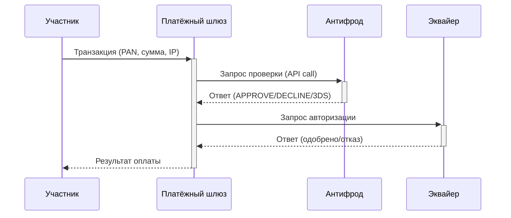
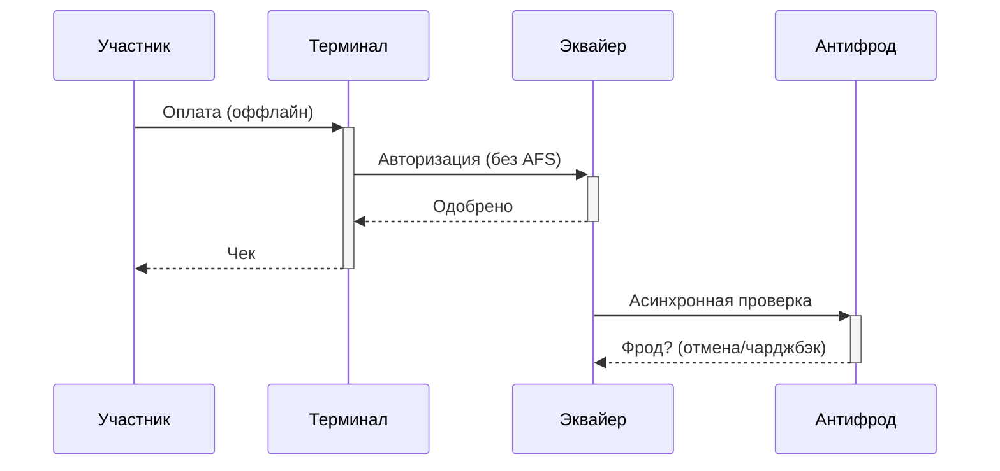

# Техническое задание на столешницы

## 👤 **Kirill**

Сформулируй понятно:  
ТЗ для столешниц по размерам:
Добрый день! Нужны 2 столешницы для рабочей зоны по размерам с выемкой для кабель менеджмента. Материал: массив или лдсп. Цвет: дуб натур

 Важно! поверхность должна быть гладкой без текстуры.

размеры:
1. столешница
д - 105,5 см
ш - 60 см
т - 2,5-3

2. столешница
д - 105,5 см
ш - 60 см
т - 2,5-3

Общие требования:
Глубина выемки (по заднему краю прилегающему к стене) 6-7см
длина прорези (внутренняя длина выемки) 20 см. длина прорези 28 см

Кромка плавная, без острых краев. Углы скругленные (диаметр не более 2 см)

---

## 🤖 **DeepSeek**

### **Техническое задание на изготовление столешниц**  

**Материал:**  
- Массив или ЛДСП  
- Цвет: *дуб натуральный*  

**Поверхность:**  
- Гладкая, без текстуры  

**Размеры:**  
1. **Столешница №1**  
   - Длина: 105,5 см  
   - Ширина: 60 см  
   - Толщина: 2,5–3 см  

2. **Столешница №2** (аналогичная)  
   - Длина: 105,5 см  
   - Ширина: 60 см  
   - Толщина: 2,5–3 см  

**Выемка для кабель-менеджмента:**  
- Расположение: по заднему краю (прилегает к стене)  
- Глубина: 6–7 см  
- Длина внутренней прорези: **20 см** (или **28 см** – уточните, возможно, опечатка в ТЗ)  

**Кромка и углы:**  
- Плавная закругленная кромка без острых краев  
- Углы скругленные (радиус скругления ≤ 2 см)  

**Дополнительно:**  
- Устойчивость к царапинам и влаге (если ЛДСП – желательно покрытие защитным слоем)  
- Отсутствие сколов и неровностей по краям  

Если требуется корректировка размеров выемки или другие уточнения – сообщите.

---

## 👤 **Kirill**

trace_id в заголовке дай описание

---

## 🤖 **DeepSeek**

### **`trace_id` в HTTP-заголовках**  

**Описание:**  
`trace_id` (или `X-Trace-ID`) – это уникальный идентификатор, который используется для отслеживания цепочки связанных запросов в распределённых системах (микросервисах, API, лог-системах).  

### **Назначение:**  
- Позволяет связать логи одного запроса across разных сервисов.  
- Упрощает диагностику ошибок в сложных системах.  
- Используется в системах мониторинга (например, **Jaeger**, **Zipkin**, **OpenTelemetry**).  

### **Формат:**  
- Обычно представляет собой **UUID** или **хеш-строку** (например, `a1b2c3d4-e5f6-7890`).  
- Может быть передан в заголовке HTTP-запроса:  
  ```http
  X-Trace-ID: 123e4567-e89b-12d3-a456-426614174000
  ```  
  или  
  ```http
  traceparent: 00-0af7651916cd43dd8448eb211c80319c-b7ad6b7169203331-01
  ``` *(стандарт W3C Trace Context)*  

### **Где применяется?**  
1. **Логирование** – все логи по одному запросу помечаются одним `trace_id`.  
2. **Мониторинг** – в Grafana, Kibana, Jaeger можно фильтровать по `trace_id`.  
3. **Отладка** – если запрос упал, по `trace_id` можно найти все связанные события.  

### **Пример использования:**  
```python
# Генерация trace_id (Python)
import uuid
trace_id = str(uuid.uuid4())
headers = {"X-Trace-ID": trace_id}
```  

Если нужно больше деталей по конкретному стандарту (например, **OpenTelemetry** или **W3C Trace Context**) – уточните!

---

## 👤 **Kirill**

Как происходит подключение нового (карточного) канала к антифрод системе для проверки транзакций?
Примеры онлайн и оффлайн потока

---

## 🤖 **DeepSeek**

### **Подключение нового карточного канала к антифрод-системе**  

При подключении нового платежного канала (например, эквайрингового банка, процессинга или платёжного шлюза) к антифрод-системе (AFS) важно обеспечить корректную интеграцию для проверки транзакций в **онлайн-** и **оффлайн-режимах**.  

---

## **1. Основные этапы подключения**  

### **1.1. Предварительная настройка**  
- **Определение формата данных** (JSON/XML, ISO-8583, API спецификации).  
- **Настройка правил антифрода** (скоринг, лимиты, блокировки).  
- **Интеграция с мониторингом и алертами** (SIEM, Grafana, Kibana).  

### **1.2. Техническая интеграция**  
#### **Онлайн-поток (Real-Time)**  
1. **Транзакция отправляется** в антифрод-систему **до авторизации**.  
2. **AFS анализирует** данные (скоринг, ML-модели, правила).  
3. **Решение возвращается** (разрешить/отклонить/запросить 3DS).  

#### **Оффлайн-поток (Post-Processing)**  
1. **Транзакция сначала авторизуется** (без проверки AFS).  
2. **Данные передаются** в антифрод **после завершения операции**.  
3. **AFS проверяет** и может инициировать **чарджбэк или отмену**.  

---

## **2. Примеры потоков**  

### **2.1. Онлайн-поток (Real-Time Anti-Fraud)**  

**Где применяется?**  
- Интернет-эквайринг (карты, Apple Pay, Google Pay).  
- Мобильные платежи.  

### **2.2. Оффлайн-поток (Post-Screening)**  

**Где применяется?**  
- POS-терминалы (оффлайн-платежи).  
- Отложенные транзакции (например, авиабилеты).  

---

## **3. Ключевые данные для проверки**  
| Параметр          | Онлайн | Оффлайн |  
|-------------------|--------|---------|  
| **Номер карты (PAN)** | ✅ | ✅ |  
| **IP-адрес**      | ✅ | ❌ |  
| **Геолокация**    | ✅ | ❌ |  
| **Device ID**     | ✅ | ❌ |  
| **3DS/OTP**       | ✅ | ❌ |  
| **История операций** | ✅ | ✅ |  

---

## **4. Дополнительные механизмы защиты**  
- **Velocity checks** (лимиты операций за время).  
- **Бинарные правила** (блокировка VPN, анонимных прокси).  
- **ML-модели** (аномалии в поведении).  
- **Чёрные списки** (карты, мерчанты, IP).  

---

### **Итог**  
- **Онлайн-поток** → мгновенная блокировка мошенничества.  
- **Оффлайн-поток** → пост-анализ и отмена подозрительных транзакций.  

Если нужны детали по API или конкретным системам (Kount, Forter, SAS Fraud) – уточните!Этот ответ сгенерирован AI, только для справки.

---

## 👤 **Kirill**

что такое скс счета

---

## 🤖 **DeepSeek**

### **Что такое СКС-счета?**  
**СКС** (**Специальный Корреспондентский Счёт**) – это счёт, который банк открывает в другом банке или в центральном банке (например, в ЦБ РФ) для проведения межбанковских расчётов.  

#### 🔹 **Основные особенности:**  
1. **Используются для межбанковских операций** – переводы, клиринг, платежи по корреспондентским договорам.  
2. **Могут быть:**  
   - **Ностро (Nostro)** – счёт вашего банка в другом банке (*"наш счёт у вас"*).  
   - **Лоро (Loro)** – счёт другого банка в вашем банке (*"их счёт у нас"*).  
   - **Востро (Vostro)** – устаревший термин, аналогичный "лоро".  
3. **Открываются в разных валютах** (рубли, доллары, евро).  

#### 🔹 **Примеры использования:**  
- **Банк "А"** открывает **СКС в Банке "Б"**, чтобы проводить платежи клиентов в этом банке.  
- **ЦБ РФ** использует СКС для контроля ликвидности банковской системы.  

#### 🔹 **Чем отличается от расчётного счёта?**  
| Характеристика      | СКС-счёт | Обычный расчётный счёт |  
|---------------------|----------|------------------------|  
| **Владелец**        | Банк     | Юрлицо/ИП/Физлицо      |  
| **Назначение**      | Межбанк  | Коммерческие платежи   |  
| **Регулятор**       | ЦБ       | Банк-эквайер           |  

### **Вывод:**  
СКС-счета – это "расчётные счета для банков", обеспечивающие бесперебойные межбанковские платежи. Если нужно больше деталей (например, про SWIFT или SEPA-корреспонденцию) – уточните!

---

## 👤 **Kirill**

Сделай описание процесса по диаграмме

@startuml OfflineCardChannel
 
'Общие настройики отображения
skinparam monochrome true
skinparam defaultFontName Helvetica
skinparam defaultFontSize 16 
skinparam sequenceMessageAlign left
skinparam minClassWidth 100
skinparam maxMessageSize 250
skinparam shadowing false
 
hide footbox
 
'Настройки отображения диаграммы
skinparam sequence {
ActorBackgroundColor #LemonChiffon
ActorFontStyle bold
ParticipantBackgroundColor #B2E7EA/#C8EEF0
ParticipantFontStyle bold
ParticipantPadding 30
LifeLineBorderColor black
LifelineBackgroundColor #B2E7EA/#C8EEF0
participantPadding 50
ArrowFontName Helvetica
}
 
actor "Отправитель\n " as Payer
participant "СДБО\n " as IB
participant "Платежный шлюз\n " as Payments
participant "SVFM\n " as AF
 
Autonumber
Payer ->> IB : Запрос проведения платежа\n message_type=XXX1 
Activate IB
IB ->> Payments : Авторизация (без проверки АФ)
Activate Payments
Payments -->> IB : Ответ. Одобрено
deactivate Payments
||30||
IB ->> AF : Асинхронная проверка\n message_type=XXX1
Activate AF
 
AF ->> AF : Оценка риска, формирование ответа
 
 
AF -->> IB : Фрод? (Решение о блокировке, отмена)
 
Deactivate AF
IB -->> Payer : Уведомление клиенту об операции
Deactivate IB
 
 
@enduml

---

## 🤖 **DeepSeek**

### **Описание процесса по диаграмме: OfflineCardChannel**  

Диаграмма отображает **оффлайн-поток проверки транзакций** с отложенной (асинхронной) антифрод-проверкой.  

---

### **1. Участники процесса**  
| Участник               | Роль                                                                 |
|------------------------|----------------------------------------------------------------------|
| **Отправитель (Payer)** | Клиент, инициирующий платёж (например, держатель карты).            |
| **СДБО (IB)**           | Интернет-банк или платёжная система, принимающая запрос от клиента. |
| **Платежный шлюз**      | Обрабатывает авторизацию транзакции без проверки антифрода.         |
| **SVFM (AF)**           | Антифрод-система, проверяющая транзакцию постфактум.                |

---

### **2. Пошаговый процесс**  

#### **Шаг 1: Клиент инициирует платёж**  
- **Отправитель** отправляет запрос на платёж в **СДБО** (сообщение типа `XXX1`).  
- Пример: оплата картой в мобильном приложении банка.  

```plaintext
Payer -> IB: Запрос проведения платежа (message_type=XXX1)
```

#### **Шаг 2: Авторизация без антифрода**  
- **СДБО** передаёт запрос в **Платежный шлюз**, который проводит авторизацию **без проверки антифрода**.  
- Платёж временно одобряется.  

```plaintext
IB -> Payments: Авторизация (без проверки АФ)
Payments --> IB: Ответ. Одобрено
```

#### **Шаг 3: Асинхронная проверка антифродом**  
- Через **30 условных единиц времени** (например, секунд или минут) **СДБО** отправляет данные транзакции в **SVFM (AF)**.  
- Антифрод-система анализирует риск:  
  - Проверяет историю операций, подозрительные паттерны, чёрные списки.  
  - Формирует решение: **блокировка** или **подтверждение**.  

```plaintext
IB -> AF: Асинхронная проверка (message_type=XXX1)
AF -> AF: Оценка риска → решение
AF --> IB: Фрод? (Блокировка/Отмена)
```

#### **Шаг 4: Уведомление клиента**  
- **СДБО** уведомляет **Отправителя** о результате операции.  
- Если транзакция признана мошеннической:  
  - Деньги могут быть возвращены (чарджбэк).  

```plaintext
IB --> Payer: Уведомление клиенту об операции
```

---

### **3. Ключевые особенности процесса**  
- **Оффлайн-проверка**: Антифрод вмешивается **после авторизации**, а не в реальном времени.  
- **Риск для мерчанта**: Если транзакция фродовая, возможен **откат** (отмена).  
- **Где применяется?**  
  - POS-терминалы (оффлайн-платежи).  
  - Отложенные транзакции (авиабилеты, бронирования).  

---

### **4. Сравнение с онлайн-потоком**  
| Параметр          | Оффлайн (на диаграмме) | Онлайн-поток           |  
|-------------------|-----------------------|------------------------|  
| **Проверка АФ**   | После авторизации     | До авторизации         |  
| **Скорость**      | Медленнее             | Мгновенно              |  
| **Риск фрода**    | Выше (возможен чарджбэк) | Ниже (блокировка до списания) |  

---

### **Итог**  
Диаграмма описывает **отложенную антифрод-проверку**, где решение принимается **уже после списания средств**. Это рискованнее для банка/мерчанта, но необходимо для оффлайн-сценариев.  

Если нужно уточнить форматы сообщений (`XXX1`) или логику SVFM – задавайте вопросы!

---

## 👤 **Kirill**

сделай описание шагов. Всего их должно быть 7 как в диаграмме

---

## 🤖 **DeepSeek**

### **Описание 7 шагов процесса OfflineCardChannel**  

Диаграмма отображает **оффлайн-поток платежа** с отложенной антифрод-проверкой.  

---

### **1. Шаг 1: Клиент инициирует платёж**  
**Действие:**  
- Отправитель (клиент) отправляет запрос на платёж через интернет-банк (СДБО).  
**Данные:**  
- Тип сообщения: `XXX1` (например, запрос на перевод/оплату).  

---

### **2. Шаг 2: СДБО принимает запрос**  
**Действие:**  
- Система интернет-банка (СДБО) получает запрос и готовится к авторизации.  
**Особенность:**  
- Проверка антифрода **не выполняется** на этом этапе.  

---

### **3. Шаг 3: Авторизация через платёжный шлюз**  
**Действие:**  
- СДБО отправляет запрос в **Платежный шлюз** для авторизации транзакции.  
**Результат:**  
- Шлюз возвращает статус **"Одобрено"** (без проверки рисков).  

---

### **4. Шаг 4: Задержка перед проверкой антифрода**  
**Действие:**  
- После авторизации следует пауза (`||30||` – условное время, например, 30 секунд/минут).  
**Цель:**  
- Обеспечить асинхронную обработку (чтобы не замедлять платёж).  

---

### **5. Шаг 5: Антифрод-проверка (SVFM)**  
**Действие:**  
- СДБО отправляет данные транзакции в антифрод-систему (**SVFM**).  
**Анализ:**  
- SVFM оценивает риск:  
  - Проверяет историю операций, подозрительные паттерны.  
  - Формирует решение: **"Фрод?"** (блокировка или подтверждение).  

---

### **6. Шаг 6: Решение антифрода**  
**Действие:**  
- SVFM возвращает решение в СДБО:  
  - **Отмена транзакции** (если фрод).  
  - **Подтверждение** (если риск низкий).  

---

### **7. Шаг 7: Уведомление клиента**  
**Действие:**  
- СДБО отправляет клиенту финальный статус операции:  
  - Успешное проведение.  
  - Отмена (если антифрод выявил мошенничество).  

---

### **Ключевые особенности процесса**  
1. **Оффлайн-проверка**: Антифрод работает **после авторизации**, а не в реальном времени.  
2. **Риск для мерчанта**: Возможен **чарджбэк** (если транзакция отменена постфактум).  
3. **Где применяется**:  
   - POS-терминалы (оффлайн-платежи).  
   - Отложенные транзакции (бронирования, подписки).  

---

### **Схематичное отличие от онлайн-потока**  
```plaintext
Онлайн-поток:  
Клиент → СДБО → Антифрод → Шлюз → Авторизация  

Оффлайн-поток (на диаграмме):  
Клиент → СДБО → Шлюз → Авторизация → Антифрод → Решение  
```  

Если нужно добавить детали по форматам сообщений или логике SVFM – уточняйте!

---

## 👤 **Kirill**

Оцени достаточно ли требований для создания объектов в БД системы приемника для заливки справочников БИК

---

## 🤖 **DeepSeek**

### Оценка требований для создания объектов в БД системы-приемника

На основании предоставленного описания можно сделать следующие выводы о достаточности требований для создания объектов в БД приемника:

#### **Достаточные аспекты:**
1. **Полная схема данных**:
   - Четко определены структуры таблиц как в источнике (SSYS.V_BANK_SUZ), так и в приемнике (etl.t_svbic и etl.t_etl_svbic).
   - Указаны все поля, их типы данных и ограничения.

2. **Трансформация данных**:
   - Описаны правила преобразования полей (прямое копирование с изменением длины строки).
   - Указаны различия в форматах между источником и приемником (например, VARCHAR2(24 CHAR) → VARCHAR2(9 CHAR)).

3. **Процедуры обработки**:
   - Упомянуты ключевые хранимые процедуры:
     - `etl.p_trunc_etl_svbic` — для очистки технической таблицы.
     - `etl.p_etl_svbic` — для переноса данных из технической таблицы в бизнес-таблицу.

4. **Условия выборки**:
   - Четко определены критерии фильтрации (исключение статусов «0 - Неактивный» и «4 - Удален»).

5. **Расписание и интерфейсы**:
   - Указано время запуска (раз в сутки в 8:00).
   - Описан интерфейс (Y3) и маршрутизация запросов.

---

#### **Недостающие или требующие уточнения аспекты:**
1. **Индексы и ограничения**:
   - Нет информации о первичных ключах, индексах или уникальных ограничениях для таблиц приемника (например, должен ли BIC быть уникальным в etl.t_svbic?).

2. **Обработка ошибок**:
   - Указано, что используется «стандартная обработка ошибок», но нет деталей:
     - Как обрабатываются несоответствия типов данных (например, если в источнике BIC длиннее 9 символов)?
     - Куда записываются ошибки трансформации?

3. **Логирование**:
   - Не описаны таблицы или механизмы логирования результатов загрузки (успешные/неуспешные операции).

4. **Триггеры и зависимости**:
   - Нет информации о триггерах, которые могут срабатывать при вставке/обновлении данных в приемнике.

5. **Резервное копирование**:
   - Не указано, требуется ли создание резервных копий таблиц перед очисткой.

6. **Параметры производительности**:
   - Нет рекомендаций по настройке транзакций (размер batch-операций, таймауты).

---

#### **Рекомендации по доработке:**
1. **Добавить в ТЗ**:
   - Определение первичных ключей и индексов для таблиц приемника.
   - Подробное описание обработки ошибок (например, таблица etl.error_log для записи проблемных записей).
   - Требования к логированию (например, колонки created_at, status в технической таблице).

2. **Пример SQL для создания таблиц**:
   ```sql
   -- Техническая таблица
   CREATE TABLE etl.t_etl_svbic (
       BIC         VARCHAR2(9 CHAR),
       BANK_NAME   VARCHAR2(160 CHAR),
       CITY        VARCHAR2(25 CHAR),
       ADDRESS     VARCHAR2(160 CHAR),
       CORR_ACC    VARCHAR2(20 CHAR),
       ACTIVE      VARCHAR2(8 CHAR),
       load_date   TIMESTAMP DEFAULT CURRENT_TIMESTAMP
   );

   -- Бизнес-таблица
   CREATE TABLE etl.t_svbic (
       BIC         VARCHAR2(9 CHAR) PRIMARY KEY,
       BANK_NAME   VARCHAR2(160 CHAR),
       CITY        VARCHAR2(25 CHAR),
       ADDRESS     VARCHAR2(160 CHAR),
       CORR_ACC    VARCHAR2(20 CHAR),
       ACTIVE      VARCHAR2(8 CHAR)
   );
   ```

3. **Проверить согласованность данных**:
   - Убедиться, что длины полей в приемнике (например, CITY — 25 символов) достаточны для данных из источника (1000 символов).

---

### Итог:
Требования **достаточны** для базовой реализации, но **рекомендуется дополнить** их:
1. Детализацией индексов и ограничений.
2. Процедурами обработки ошибок и логирования.
3. Проверкой на соответствие данных (особенно для усекаемых полей, таких как CITY). 

Если эти аспекты учтены, создание объектов в БД приемника будет корректным и полным.

---

## 👤 **Kirill**

как передать массив в json запросе

---

## 🤖 **DeepSeek**

### **Как передать массив в JSON-запросе**

В JSON массивы передаются в квадратных скобках `[]` и могут содержать элементы любого типа: числа, строки, объекты или даже другие массивы.

---

## **1. Примеры передачи массива в JSON**

### **1.1. Простой массив (числа, строки)**
```json
{
  "order_id": 12345,
  "items": ["apple", "banana", "orange"],
  "quantities": [1, 2, 3]
}
```

### **1.2. Массив объектов**
```json
{
  "users": [
    { "id": 1, "name": "Alice" },
    { "id": 2, "name": "Bob" }
  ]
}
```

### **1.3. Вложенные массивы**
```json
{
  "matrix": [
    [1, 2, 3],
    [4, 5, 6],
    [7, 8, 9]
  ]
}
```

---

## **2. Как отправить такой JSON в HTTP-запросе**
Запросы с массивами чаще всего отправляются через **POST/PUT** с заголовком `Content-Type: application/json`.

### **2.1. Пример на JavaScript (Fetch API)**
```javascript
const data = {
  "products": [101, 102, 103],
  "prices": [19.99, 29.99, 9.99]
};

fetch('https://api.example.com/orders', {
  method: 'POST',
  headers: {
    'Content-Type': 'application/json',
  },
  body: JSON.stringify(data),
})
.then(response => response.json())
.then(data => console.log(data));
```

### **2.2. Пример на Python (requests)**
```python
import requests

data = {
    "users": [
        {"id": 1, "name": "Alice"},
        {"id": 2, "name": "Bob"}
    ]
}

response = requests.post(
    'https://api.example.com/users',
    json=data,
    headers={'Content-Type': 'application/json'}
)
print(response.json())
```

### **2.3. Пример на PHP (cURL)**
```php
$data = [
    "items" => ["book", "pen", "notebook"],
    "counts" => [1, 2, 3]
];

$ch = curl_init('https://api.example.com/update');
curl_setopt($ch, CURLOPT_RETURNTRANSFER, true);
curl_setopt($ch, CURLOPT_POST, true);
curl_setopt($ch, CURLOPT_POSTFIELDS, json_encode($data));
curl_setopt($ch, CURLOPT_HTTPHEADER, ['Content-Type: application/json']);

$response = curl_exec($ch);
curl_close($ch);
echo $response;
```

---

## **3. Как принять массив на сервере**
### **3.1. Node.js (Express)**
```javascript
app.post('/api/orders', (req, res) => {
  const items = req.body.items; // Получаем массив items
  console.log(items); // ["apple", "banana", "orange"]
  res.json({ status: 'success' });
});
```

### **3.2. Python (Flask)**
```python
from flask import Flask, request

app = Flask(__name__)

@app.route('/api/orders', methods=['POST'])
def handle_order():
    data = request.get_json()
    items = data['items']  # Получаем массив items
    print(items)  # ["apple", "banana", "orange"]
    return {'status': 'success'}
```

### **3.3. PHP**
```php
$data = json_decode(file_get_contents('php://input'), true);
$items = $data['items']; // Получаем массив items
print_r($items); // ["apple", "banana", "orange"]
```

---

## **4. Важные замечания**
1. **Правильный Content-Type**:  
   Обязательно указывайте `Content-Type: application/json`, иначе сервер может не распарсить данные.
2. **Валидация данных**:  
   Всегда проверяйте, что массив пришёл в ожидаемом формате (например, `Array.isArray(items)` в JS).
3. **Ограничения**:  
   Некоторые API могут ограничивать размер JSON-запроса (например, 1–10 МБ).

---

### **Итог**
- Массив в JSON передаётся через `[]`.
- Отправляется в теле POST/PUT-запроса с `Content-Type: application/json`.
- На сервере обрабатывается как обычный объект (в Python — `dict`, в JS — `object`).

Если нужно передать сложные структуры (например, массивы внутри объектов), просто следуйте той же логике вложенности.

---

## 👤 **Kirill**

Простое письмо: коллеги, прошу ознакомиться с документом ТУ ваши комментарии и замечания. Просьба ответить по пунктам в разделе Открытые вопросы

---

## 🤖 **DeepSeek**

**Тема:** Просим ознакомиться с документом ТУ – комментарии и замечания  

**Коллеги, добрый день!**  

Прошу вас ознакомиться с приложенным документом **Технических Условий (ТУ)** и предоставить ваши комментарии и замечания.  

**Просьба:**  
1. Проверить раздел **"Открытые вопросы"** и ответить **по пунктам**, где требуется ваша экспертиза.  
2. Если есть дополнительные правки – указать их прямо в документе или списком в ответном письме.  

**Срок:** До **[укажите дату, если есть дедлайн]**.  

Благодарю за участие!  

**С уважением,**  
[Ваше имя]  
[Ваша должность]  
[Контакт для вопросов]  

---  
*Приложение: [Название файла ТУ]*  

*(Если нужно более официально или срочно – можно добавить: "Прошу подтвердить получение и дать обратную связь до...")*

---

