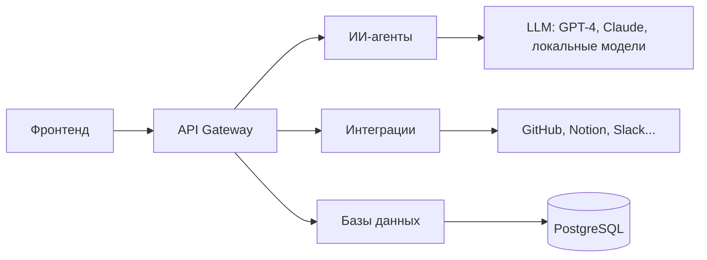

# Цифровая мастерская для автоматизации исследований

## 👤 **Kirill**

Ведем такое понятие как "цифровая мастерская". Идея состоит в создании веб-сервиса, который будет напоминать обычную мастерскую с множеством инструментов объединенных интеграционной платформой. Управлять и настраивать тот или иной процесс по аналогии с BPMS системами или n8n. Ключевые функции: 
- проведение полноценных исследований с помощью ии агентов
- генерация документации
- визуализация процессов и данных
- форматер
- white board.

Т.е. предполагается что будет возможность интегрировать различные сервисы и итогово выводить результат исследований в виде блога с блоками (markdown текст, диаграммы, таблицы, макеты, схемы и т.д.)

---

## 🤖 **DeepSeek**

### **Цифровая мастерская: концепция веб-сервиса для исследований и автоматизации**  

Ваша идея напоминает гибрид **low-code платформы**, **исследовательского инструментария** и **публикационной среды**. Такой сервис мог бы стать мощным решением для аналитиков, инженеров, разработчиков и технических писателей.  

#### **Ключевые компоненты системы**  

1. **Интеграционная платформа (ядро)**  
   - Подключение внешних сервисов (API, базы данных, облачные хранилища).  
   - Готовые коннекторы к OpenAI, Notion, Miro, Google Docs, GitHub и др.  
   - Возможность создавать собственные адаптеры (как в n8n/Zapier).  

2. **Агенты ИИ для исследований**  
   - Автоматический сбор и анализ данных (например, через поиск, парсинг или запросы к базам знаний).  
   - Генерация гипотез, summaries, выводов.  
   - Поддержка разных моделей (GPT, Claude, Gemini, локальные LLM).  

3. **Генерация документации**  
   - Поддержка Markdown, LaTeX, AsciiDoc.  
   - Автоматическое формирование отчетов из данных (как в Pandoc или Obsidian).  
   - Шаблоны для ТЗ, спецификаций, презентаций.  

4. **Визуализация данных и процессов**  
   - Диаграммы (Mermaid, PlantUML, D3.js).  
   - Графы знаний, ментальные карты.  
   - Интерактивные дашборды (как в Tableau или Grafana).  

5. **Whiteboard (рабочее пространство)**  
   - Совместимость с Miro/Excalidraw.  
   - Вставка блоков с кодом, формулами, изображениями.  
   - Коллаборация в реальном времени.  

6. **Форматер и обработчик данных**  
   - Конвертация между JSON, XML, CSV, YAML.  
   - Очистка и нормализация данных (Regex, Python-скрипты).  
   - Валидация схем (JSON Schema, XSD).  

7. **Публикация в блог/отчет**  
   - Экспорт в статические сайты (Hugo, Jekyll).  
   - Поддержка PDF, Word, HTML.  
   - Интерактивные элементы (как в ObservableHQ).  

---

### **Технологический стек (пример)**  
- **Backend**: Node.js/Python (FastAPI) + WebSockets для коллаборации.  
- **Frontend**: React/Svelte + Blockly (для визуального программирования).  
- **Хранение данных**: PostgreSQL + S3 для медиа.  
- **Агенты ИИ**: LangChain/RAG + OpenAI API.  
- **Визуализация**: Mermaid, Chart.js, D3.js.  

---

### **Аналоги и вдохновение**  
- **n8n/Airtable** — автоматизация workflows.  
- **Obsidian/Logseq** — управление знаниями.  
- **Miro/Excalidraw** — whiteboard.  
- **Notion** — универсальный workspace.  
- **Hugging Face Spaces** — публикация ML-проектов.  

---

### **Бизнес-модель**  
- **Freemium**: Бесплатно — базовые функции, подписка — расширенные интеграции.  
- **Корпоративные лицензии**: Для команд с приватными агентами и хранилищами.  
- **Marketplace**: Платные шаблоны, агенты, коннекторы от сообщества.  

---

### **Развитие идеи**  
1. **MVP**: Прототип с Markdown + диаграммами + ИИ-ассистентом.  
2. **Пилот**: Привлечь технических блогеров, аналитиков.  
3. **Масштабирование**: Добавление плагинов и API.  

Если нужна помощь с архитектурой или конкретными решениями — готов обсудить детали! 🚀

---

## 👤 **Kirill**

продолжай

---

## 🤖 **DeepSeek**

### **Развитие концепции цифровой мастерской: детализация и расширение возможностей**  

Чтобы превратить идею в полноценный продукт, нужно проработать **архитектуру, пользовательские сценарии и уникальные фичи**, которые выделят сервис на фоне аналогов.  

---

## **1. Углубление в функционал**  

### **1.1. ИИ-агенты для исследований (Research Agents)**  
- **Типы агентов:**  
  - **Поисковый агент** — сканирует научные статьи, GitHub, Stack Overflow.  
  - **Аналитик** — строит гипотезы на основе данных (например, через PySpark/SQL-запросы).  
  - **Критик** — проверяет выводы на противоречия (как "адвокат дьявола").  
- **Пример сценария:**  
  - Пользователь вводит запрос: *"Сравнить эффективность Rust и Go для высоконагруженных API"*.  
  - Агенты автоматически собирают бенчмарки, статьи, отзывы и генерируют сводку с графиками.  

### **1.2. Генерация документации с контекстом**  
- **Динамические шаблоны:**  
  - Документ подстраивается под аудиторию (менеджеру — кратко, инженеру — с техническими деталями).  
  - Поддержка **версионирования** (как в Git) и **diff-просмотра** изменений.  
- **Интеграция с кодом:**  
  - Автодокументирование API (Swagger/OpenAPI).  
  - Извлечение docstring из Python/Rust-кода.  

### **1.3. Визуализация процессов (нотация + low-code)**  
- **Drag-and-drop редактор** для:  
  - Бизнес-процессов (BPMN).  
  - Архитектурных диаграмм (C4, UML).  
  - Data pipelines (Apache Airflow-подобные схемы).  
- **Автогенерация диаграмм** из текста:  
  - *"Пользователь входит в систему → отправляет запрос → сервис отвечает"* → превращается в последовательность.  

### **1.4. Whiteboard с "живыми" объектами**  
- Возможность встраивать:  
  - **Интерактивные SQL-запросы** (результаты обновляются при изменении данных).  
  - **Виджеты Python** (например, Plotly-график, который можно править прямо на доске).  
  - **Видео-аннотации** (разметка поверх роликов, как в V7 Labs).  

### **1.5. Форматер с AI-Assist**  
- **Умное форматирование:**  
  - Автоматическое исправление JSON/XML (даже если есть ошибки).  
  - Конвертация "грязного" CSV в нормализованную таблицу.  
- **Пример:**  
  - Вставляете неструктурированные логи Nginx → сервис предлагает разбить их на поля (IP, timestamp, метод).  

---

## **2. Техническая реализация**  

### **2.1. Архитектура**  

### **2.2. Стек технологий**  
| Компонент       | Технологии                          |  
|-----------------|-------------------------------------|  
| **Frontend**    | React + Redux, Blockly, Mermaid.js  |  
| **Backend**     | FastAPI (Python) / NestJS (Node.js) |  
| **Workflow Engine** | Apache Airflow / Camunda         |  
| **AI**          | LangChain, LlamaIndex, OpenAI API   |  
| **Хранение**    | PostgreSQL + MinIO (S3-совместимое) |  

### **2.3. Открытые вопросы**  
- **Как обрабатывать большие данные?**  
  - Вариант: интеграция с Apache Spark/DuckDB для аналитики.  
- **Оффлайн-режим?**  
  - Локальные LLM (Mistral, Phi-3) + SQLite для хранения.  
- **Безопасность:**  
  - Разграничение доступа (RBAC), аудит изменений.  

---

## **3. Отличия от конкурентов**  

| Функция               | Цифровая мастерская | Notion | n8n     | Miro      |  
|-----------------------|---------------------|--------|---------|-----------|  
| **ИИ-агенты**         | ✅                  | ❌      | ❌       | ❌         |  
| **Генерация доков**   | ✅ (с контекстом)   | ✅      | ❌       | ❌         |  
| **Визуализация**      | ✅ (BPMN + код)     | ❌      | ❌       | ✅         |  
| **Whiteboard + код**  | ✅                  | ❌      | ❌       | ❌         |  
| **Форматер данных**   | ✅                  | ❌      | Частично | ❌         |  

**УТП:** Сочетание **гибкости n8n**, **визуализации Miro** и **ИИ-ассистентов** в одном workspace.  

---

## **4. Следующие шаги**  

1. **Прототип:**  
   - Собрать MVP на базе Obsidian + плагинов (например, для Markdown и диаграмм).  
2. **Пилот с пользователями:**  
   - Дать доступ бета-тестерам (аналитикам, инженерам).  
3. **Монетизация:**  
   - Подписка за расширенные ИИ-функции (например, $20/мес).  
4. **Экосистема:**  
   - Marketplace для шаблонов и агентов (как у Zapier).  

---

### **Итог**  
Цифровая мастерская — это **"швейцарский нож" для исследований**, который сокращает время от идеи до результата. Если делать упор на **гибкость** (как в n8n) и **визуальную совместную работу** (как в Miro), продукт может занять нишу между Notion и специализированными low-code платформами.  

Нужна помощь с конкретным модулем? Например, с дизайном workflow-редактора или выбором LLM? 🛠️

---

## 👤 **Kirill**

задай мне вопросы которые нужно проработать, чтобы ты смог полностью описать проект. Разбей по этапам проекта

---

## 🤖 **DeepSeek**

Отличный подход! Чтобы детально описать проект, нужно проработать несколько ключевых этапов. Вот **структурированный список вопросов**, разбитых по фазам проекта.  

---

## **1. Предпроектный анализ (Постановка задачи)**  
**Цель:** Уточнить цели, целевую аудиторию и основные требования.  

### **Вопросы:**  
1. **Проблема и ценность:**  
   - Какие конкретные проблемы пользователей решает сервис? (Пример: "Долгая подготовка ТЗ", "Сложность визуализации данных").  
   - В чем уникальность идеи по сравнению с Notion/Miro/n8n?  

2. **Целевая аудитория:**  
   - Кто основные пользователи? (Инженеры, аналитики, product-менеджеры?)  
   - Каков их уровень технической подготовки?  

3. **Сценарии использования:**  
   - Топ-3 сценария, которые должны работать идеально (например: "Исследование + генерация отчета", "Автоматизация сбора данных").  
   - Нужна ли поддержка командной работы?  

4. **Бизнес-модель:**  
   - Планируется монетизация (подписка, разовые платежи, корпоративные лицензии)?  
   - Есть ли требования к окупаемости?  

---

## **2. Технические требования (Архитектура)**  
**Цель:** Определить стек технологий и ограничения.  

### **Вопросы:**  
1. **Интеграции:**  
   - Какие внешние сервисы критичны (GitHub, Slack, OpenAI и т.д.)?  
   - Нужна ли поддержка self-hosted версии?  

2. **Масштабируемость:**  
   - Ожидается ли работа с большими данными (например, обработка логов)?  
   - Нужна ли оффлайн-работа?  

3. **Безопасность:**  
   - Какие данные требуют шифрования?  
   - Нужна ли аутентификация через SSO (Google, GitHub)?  

4. **Производительность:**  
   - Какие процессы должны быть реального времени (например, коллаборация в whiteboard)?  
   - Допустимы ли задержки в генерации контента ИИ?  

---

## **3. Дизайн и UX**  
**Цель:** Проработать интерфейсы и пользовательские потоки.  

### **Вопросы:**  
1. **Интерфейс:**  
   - Предпочтительный стиль: минимализм (как Notion) или насыщенный функционал (как Miro)?  
   - Нужны ли мобильные версии?  

2. **Whiteboard:**  
   - Какие элементы обязательны (текст, диаграммы, код, видео)?  
   - Должен ли поддерживать экспорт в PDF/PowerPoint?  

3. **Работа с документами:**  
   - Какой редактор использовать (Markdown, WYSIWYG, LaTeX)?  
   - Нужна ли версионность (как в Git)?  

4. **Визуализация данных:**  
   - Какие типы диаграмм критичны (графы, временные ряды, схемы процессов)?  
   - Должны ли диаграммы обновляться автоматически при изменении данных?  

---

## **4. Разработка (MVP)**  
**Цель:** Определить приоритеты для первой версии.  

### **Вопросы:**  
1. **Ядро функционала:**  
   - Что войдет в MVP? (Например: Markdown-редактор + ИИ-ассистент + экспорт).  
   - Какие интеграции сделать первыми?  

2. **Технологии:**  
   - Какой бэкенд (Python/Node.js/Go)?  
   - Использовать готовые решения (например, Mermaid для диаграмм) или кастомные?  

3. **ИИ-компоненты:**  
   - Какие модели использовать (OpenAI, локальные LLM)?  
   - Нужен ли RAG (доступ к базам знаний)?  

4. **Тестирование:**  
   - Кто будет тестировать MVP (фокус-группа)?  
   - Какие метрики успеха (скорость генерации документов, % завершенных workflows)?  

---

## **5. Развитие продукта**  
**Цель:** План пост-MVP.  

### **Вопросы:**  
1. **Roadmap:**  
   - Какие фичи добавить после MVP (например, командные роли, marketplace)?  
   - Планируется ли API для разработчиков?  

2. **Маркетинг:**  
   - Как привлекать первых пользователей (SEO, соцсети, партнерства)?  
   - Нужен ли бесплатный тариф?  

3. **Поддержка:**  
   - Как организовать обратную связь (чат, форум, GitHub Issues)?  
   - Планируется ли документация для пользователей?  

---

## **6. Риски**  
**Цель:** Выявить потенциальные проблемы.  

### **Вопросы:**  
1. **Технические:**  
   - Что делать, если API внешних сервисов изменится?  
   - Как избежать vendor lock-in (зависимости от одного ИИ-провайдера)?  

2. **Бизнес-риски:**  
   - Что если конкуренты скопируют функционал?  
   - Есть ли юридические ограничения (например, для ИИ в ЕС)?  

---

### **Итог:**  
Ответы на эти вопросы помогут сформировать:  
- **Техническое задание** (для разработчиков).  
- **Презентацию для инвесторов** (если нужно).  
- **Roadmap проекта**.  

Какой этап вас интересует больше всего? Можно начать с проработки любого блока (например, UX или архитектуры). 🚀

---

