# Mermaid Diagram Styling and Layout Guide

## 👤 **Kirill**

стили и компоновка в mermaid

---

## 🤖 **DeepSeek**

Вот подробный обзор стилей и компоновки в **Mermaid** (диаграммы в коде). В отличие от визуальных редакторов, в Mermaid стилизация достигается за счет комбинации синтаксиса, конфигурации `%%{init}` и CSS (если диаграмма встраивается в веб-страницу).

---

### 1. Компоновка (Layout)

Mermaid автоматически рассчитывает расположение узлов, но вы можете управлять этим процессом с помощью **направления графа** и **ранжирования**.

#### Направление графа (Graph Direction)
В диаграммах типа `graph` (или `flowchart`) первая строка задает направление:

*   **`TD` / `TB`** (Top-Down / Top to Bottom): Сверху вниз (используется чаще всего).
    ```mermaid
    graph TD
        A --> B
    ```
*   **`LR`** (Left-Right): Слева направо (удобно для временных линий или горизонтальных процессов).
    ```mermaid
    graph LR
        A --> B
    ```
*   **`RL`** (Right-Left): Справа налево (редко).
*   **`BT`** (Bottom-Top): Снизу вверх.

#### Ранжирование (Ranking)
Чтобы узлы находились на одном уровне (горизонтально в TD или вертикально в LR), используйте `subgraph` или одинаковую "длину" пути.
Для принудительного выравнивания используется синтаксис `~~~` или точки (в `flowchart`):

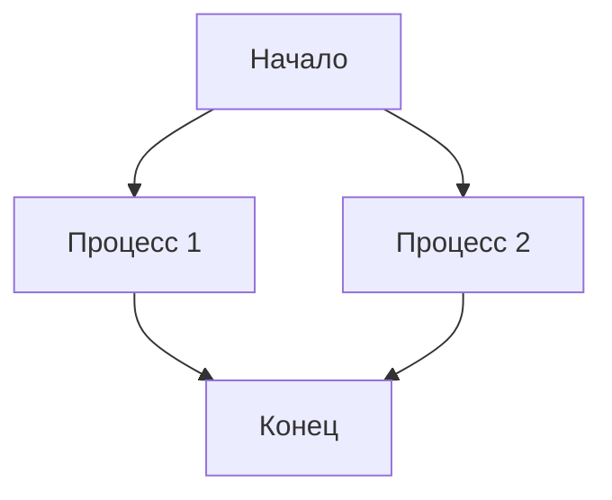
*Здесь B и C будут автоматически выровнены по одной горизонтали.*

---

### 2. Стилизация элементов

Самый мощный способ изменить внешний вид — это директивы `style` и конфигурация `init`.

#### A. Инлайн-стили (Direct `style`)
Используются в конце описания диаграммы. Работают для `graph`, `flowchart` и `classDiagram`.

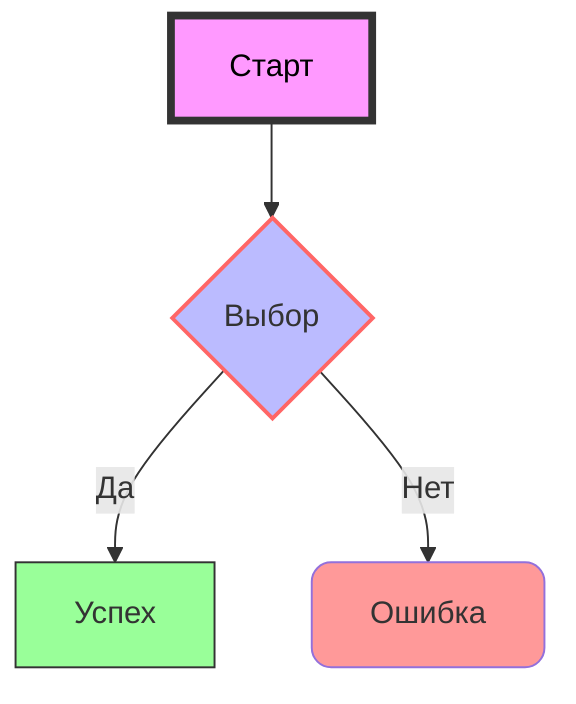

**Параметры:**
*   `fill`: цвет заливки (`#hex`, `rgb()`, `red`).
*   `stroke`: цвет обводки.
*   `stroke-width`: толщина линии.
*   `rx` / `ry`: радиус скругления углов.
*   `color`: цвет текста.

#### B. Глобальная стилизация (Initialization)
Рекомендуемый способ для единообразия. Вставляется в начале:

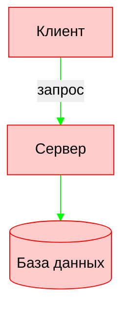

**Популярные темы:** `base`, `forest`, `dark`, `default`, `neutral`.

#### C. Стилизация классов (CSS Classes)
Можно создать класс стиля и применять его ко многим узлам (экономит код).

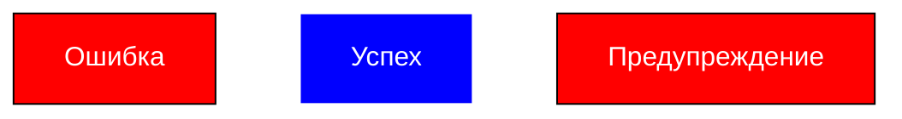

---

### 3. Особенности компоновки в разных типах диаграмм

#### Sequence Diagram (Секвенции)
Здесь компоновка линейна (временная), но можно менять расположение акторов:

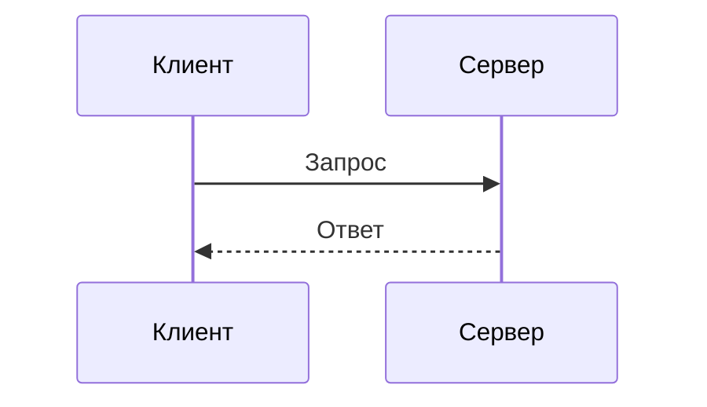
Чтобы переместить актора влево/вправо относительно других, используется свойство `mirrorActors` в `init`.

#### Flowchart vs Graph
Рекомендуется использовать **`flowchart`** вместо устаревшего `graph`. `flowchart` поддерживает более продвинутую компоновку:

*   **`&`** (ampersand): Разветвление без дополнительных узлов.
*   **`---o`** и **`--x`**: Круглые и крестообразные окончания.
*   **`<-->`**: Двунаправленные стрелки.

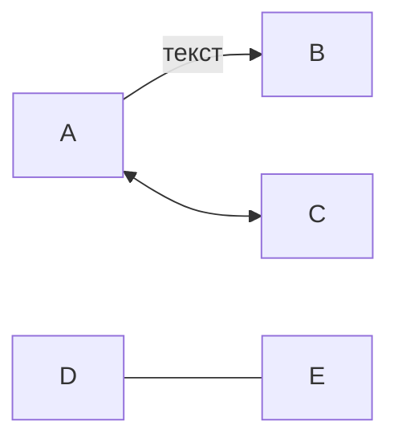

---

### 4. Продвинутая компоновка (Subgraphs и скрытые связи)

#### Subgraphs (Подграфы)
Позволяют группировать узлы визуально и логически.

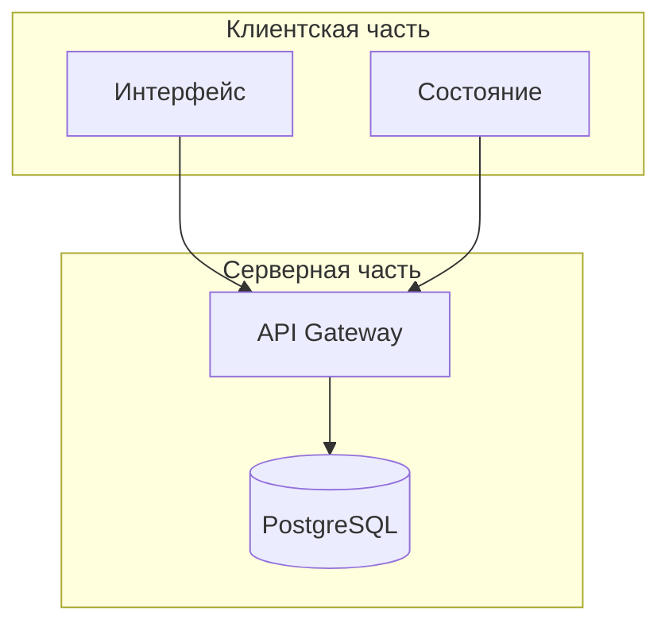

#### Невидимые связи (Invisible Links)
Используются для принудительного выравнивания, когда автоматика не справляется.

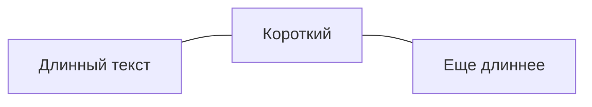
*Связь `~~~` (три тильды) создает невидимую линию без стрелки, заставляя рендерер учитывать расстояние.*

---

### 5. Стилизация текста

Внутри узлов работает HTML-подобный синтаксис (теги `<br>`, `<b>`, `<i>`), но только если включена опция `htmlLabels` (по умолчанию включена).

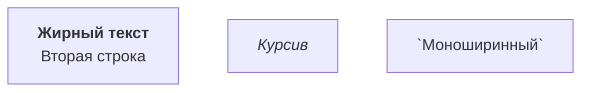

### 6. Советы по кросс-браузерности и экспорту

1.  **Для документов (Notion, Confluence, GitHub):** Большинство параметров `style` работают, но `%%{init}` может игнорироваться в некоторых средах (например, старый GitHub Wiki). Используйте `style` напрямую.
2.  **Для презентаций (reveal.js, Docs):** Если вы экспортируете диаграмму в SVG/PNG через инструменты (mermaid-cli), стили сохраняются точно.
3.  **Размер шрифта:** Регулируется глобально через `themeVariables` -> `fontSize`, либо в CSS при встраивании.

### Пример комплексной стилизации

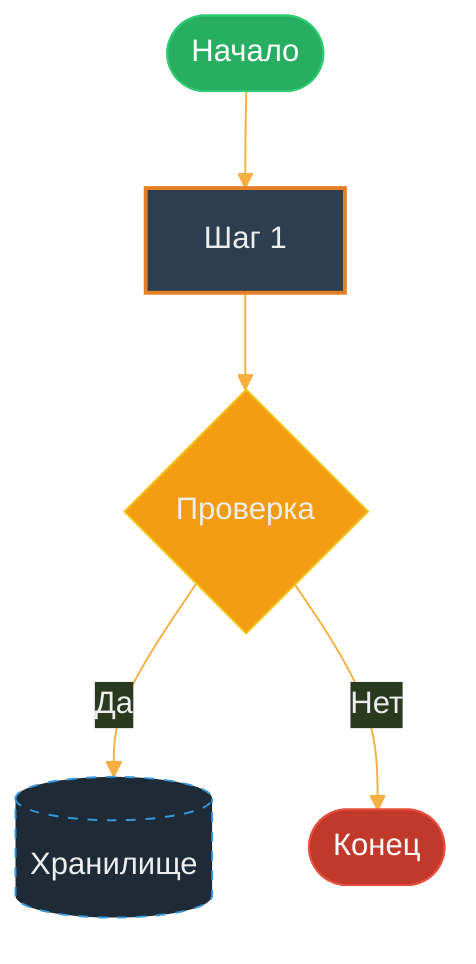

Этот подход позволяет создавать чистые, поддерживаемые диаграммы, которые выглядят профессионально и при этом остаются текстовыми файлами в репозитории.

---

## 👤 **Kirill**

стилизация subgraph

---

## 🤖 **DeepSeek**

## Стилизация Subgraph в Mermaid

Стилизация подграфов (subgraph) имеет свои особенности и ограничения. Вот полный обзор возможностей:

### 1. Базовая стилизация Subgraph

#### Заголовок и внешний вид
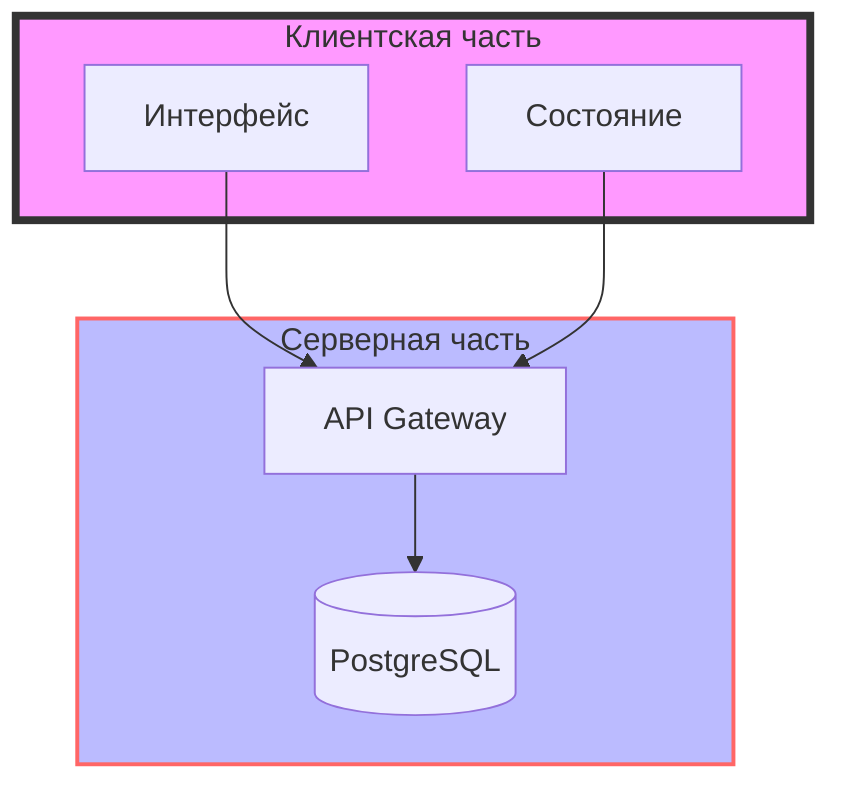

### 2. Полная кастомизация Subgraph

#### Стилизация через style
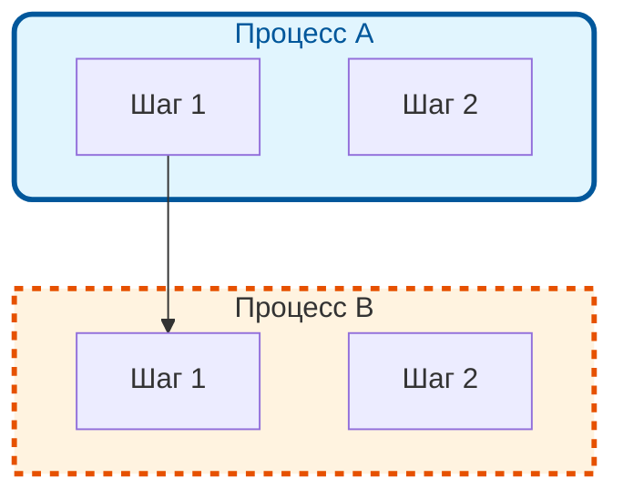

### 3. Продвинутая стилизация через CSS классы

Mermaid позволяет применять классы к subgraph:

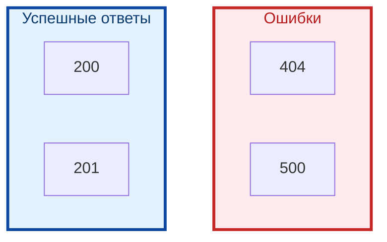

### 4. Вложенные Subgraph с разной стилизацией

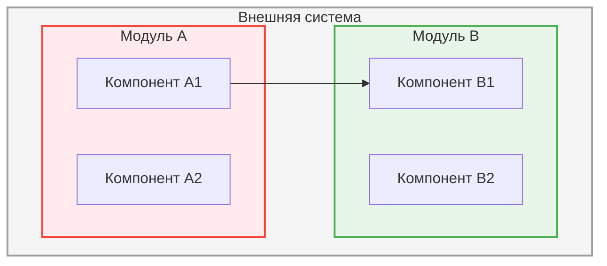

### 5. Скрытие границ Subgraph

Иногда нужно сделать подграф невидимым для группировки:

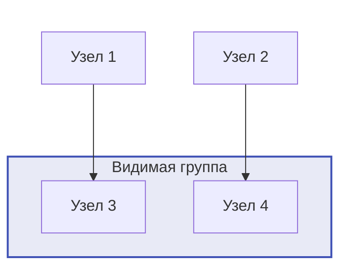

### 6. Использование themeVariables для subgraph

Глобальная настройка через init влияет на все подграфы:

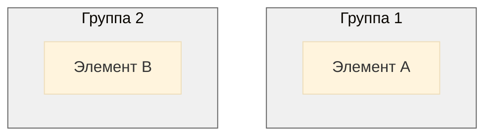

### 7. Стилизация связей между subgraph

Связи между подграфами можно стилизовать отдельно:

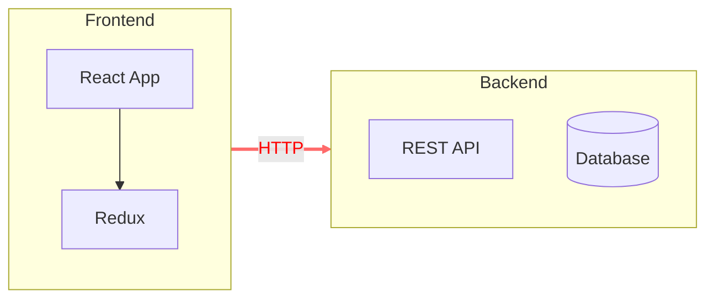

### 8. Ограничения и особенности

#### ❌ НЕ РАБОТАЕТ:
- **rx/ry для subgraph** — скругление углов может не применяться в некоторых рендерерах
- **Прозрачность через opacity** — может влиять на содержимое
- **Разные шрифты** для заголовка subgraph отдельно от содержимого

#### ✅ РАБОТАЕТ:
- `fill` — заливка фона
- `stroke` — цвет границы
- `stroke-width` — толщина границы
- `stroke-dasharray` — пунктирная граница
- `color` — цвет текста заголовка (ограниченно)

### 9. Практический пример: Архитектура микросервисов

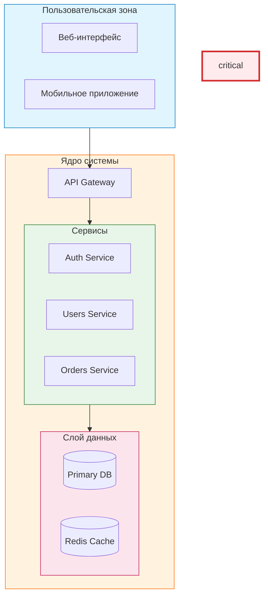

### 10. Динамическая стилизация через CSS (для веб-интеграции)

Если вы встраиваете Mermaid в HTML, можно использовать CSS:

```html
<style>
    .mermaid .cluster {
        fill: #f0f0f0 !important;
        stroke: #333 !important;
        stroke-width: 2px !important;
    }
    
    .mermaid .cluster-label {
        fill: #ff6b6b !important;
        font-weight: bold !important;
    }
</style>

<div class="mermaid">
graph TD
    subgraph MyGroup [Моя группа]
        A --> B
    end
</div>
```

### 11. Советы по стилизации subgraph

1. **Используйте classDef** для переиспользования стилей между subgraph
2. **Комбинируйте subgraph** с невидимыми связями для точного позиционирования
3. **Проверяйте рендеринг** в целевой среде (GitHub, Notion, Confluence могут по-разному обрабатывать стили)
4. **Для критичных проектов** используйте mermaid-cli для экспорта в SVG с гарантированным сохранением стилей

```bash
# Экспорт с сохранением всех стилей
mmdc -i diagram.mmd -o diagram.svg -t dark -b transparent
```

Стилизация subgraph позволяет создавать профессиональные архитектурные диаграммы с четкой визуальной иерархией, что особенно важно для документации сложных систем.

---

## 👤 **Kirill**

как поставить срытый компонент и скрытую линию в блоке, чтобы увеличить его размер? Есть другие варианты как задать размер subgraph?

---

## 🤖 **DeepSeek**

## Управление размером Subgraph в Mermaid

К сожалению, Mermaid не имеет прямого способа задать размер subgraph (как width/height в CSS). Однако есть несколько **хитростей** для увеличения размера подграфа.

### 1. Скрытые компоненты и линии (основной метод)

Используйте невидимые элементы для "растягивания" subgraph:

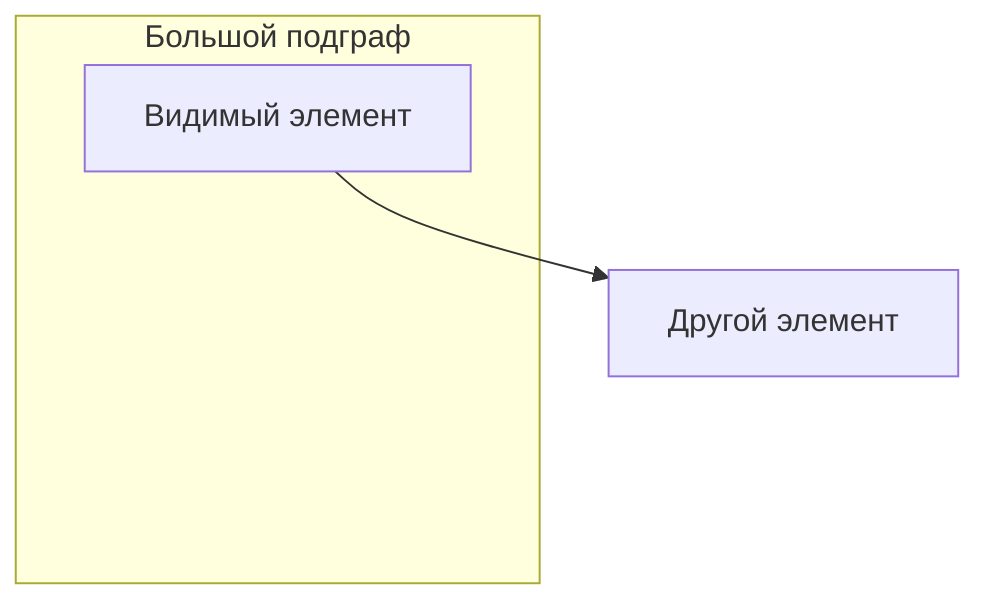

### 2. Горизонтальное расширение через скрытые связи

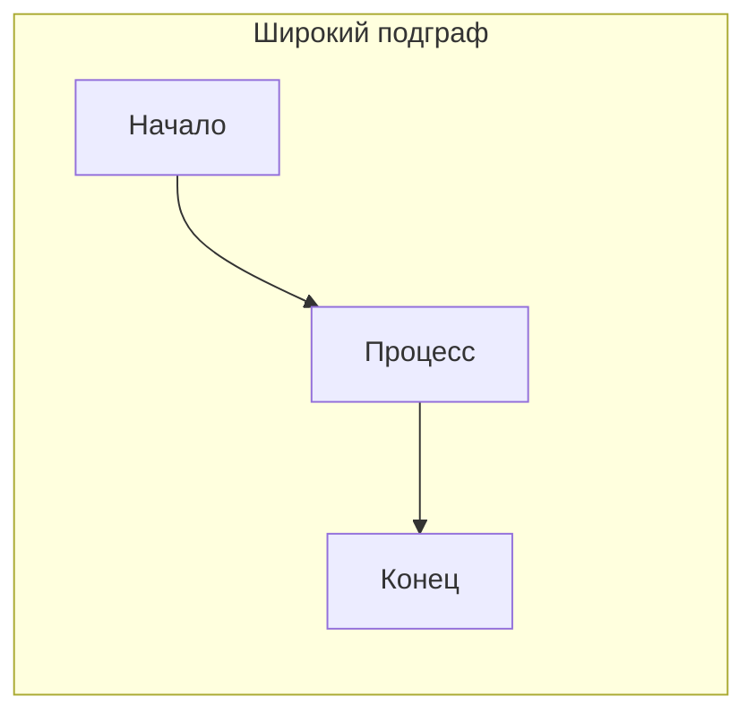

### 3. Вертикальное расширение через невидимые строки

```mermaid
graph TD
    subgraph Tall [Высокий подграф]
        Top[Верхний элемент]
        Middle[Средний элемент]
        Bottom[Нижний элемент]
        
        %% Невидимые связи для вертикального растяжения
        Top ~~~ Middle
        Middle ~~~ Bottom
    end
    
    style Top fill:#e1f5fe
    style Middle fill:#e1f5fe
    style Bottom fill:#e1f5fe
```

### 4. Использование многострочного текста

Самый простой способ увеличить высоту - добавить переносы строк:

```mermaid
graph TD
    subgraph Styled [Заголовок подграфа]
        A["Элемент<br/>с переносом<br/>строки<br/><br/>дополнительный отступ"]
        B["Обычный элемент"]
    end
    
    A --> B
```

### 5. Комбинация скрытых элементов и отступов

```mermaid
graph TB
    classDef hidden fill:none,stroke:none,color:white
    
    subgraph CustomSize [Настраиваемый размер]
        Visible[Видимый контент]
        
        %% Скрытые элементы-распорки
        TopPad[ ]
        BottomPad[ ]
        LeftPad[ ]
        RightPad[ ]
        
        %% Связи для фиксации позиций
        TopPad ~~~ Visible
        Visible ~~~ BottomPad
        LeftPad ~~~ Visible
        Visible ~~~ RightPad
    end
    
    class TopPad,BottomPad,LeftPad,RightPad hidden
```

### 6. Использование HTML-сущностей и пробелов

```mermaid
graph TD
    subgraph Wide [Подграф с отступами]
        A["Элемент A"]
        B["Элемент B" + "&nbsp;&nbsp;&nbsp;&nbsp;&nbsp;&nbsp;&nbsp;&nbsp;&nbsp;&nbsp;"]
        
        %% Невидимая цепочка для расширения
        C[ ]
        D[ ]
        
        A ~~~ C
        C ~~~ D
        D ~~~ B
    end
    
    style C fill:none,stroke:none
    style D fill:none,stroke:none
```

### 7. Продвинутый метод: вложенные подграфы

Создание внешнего подграфа как "рамки" для внутреннего:

```mermaid
graph TD
    subgraph Outer [ ]
        style Outer fill:#e8eaf6,stroke:#3f51b5,stroke-width:3px
        
        subgraph Inner [Содержимое]
            A[Элемент 1]
            B[Элемент 2]
            C[Элемент 3]
            
            A --> B --> C
        end
        
        %% Скрытые элементы вокруг внутреннего подграфа
        Pad1[ ]
        Pad2[ ]
        Pad3[ ]
        Pad4[ ]
        
        Pad1 ~~~ Inner
        Pad2 ~~~ Inner
        Pad3 ~~~ Inner
        Pad4 ~~~ Inner
    end
    
    style Pad1 fill:none,stroke:none
    style Pad2 fill:none,stroke:none
    style Pad3 fill:none,stroke:none
    style Pad4 fill:none,stroke:none
```

### 8. Метод с точками и длинными текстами

Использование длинных невидимых текстов для расширения:

```mermaid
graph LR
    subgraph WideBox [Расширенный бокс]
        A[Элемент]
        
        %% Длинный невидимый текст для ширины
        Spacer[................................................................................................................................................................]
        
        A ~~~ Spacer
    end
    
    style Spacer fill:none,stroke:none,color:white
```

### 9. Практический пример: форма с фиксированными пропорциями

```mermaid
graph TB
    classDef hidden fill:none,stroke:none,color:white
    
    subgraph Form [Форма регистрации]
        Title[<b>Регистрация пользователя</b>]
        
        %% Поля формы
        Name[Имя: _______________]
        Email[Email: _______________]
        Phone[Телефон: _______________]
        
        %% Скрытые элементы для увеличения высоты
        Spacer1[ ]
        Spacer2[ ]
        Spacer3[ ]
        
        Title --> Name --> Email --> Phone
        Spacer1 ~~~ Name
        Spacer2 ~~~ Email
        Spacer3 ~~~ Phone
    end
    
    class Spacer1,Spacer2,Spacer3 hidden
    style Form fill:#f5f5f5,stroke:#333,stroke-width:2px
```

### 10. Альтернативные подходы

#### А. Использование разных типов диаграмм

Для сложных макетов иногда лучше подходит другой тип:

```mermaid
flowchart LR
    subgraph Container [Контейнер]
        direction LR
        A[Элемент 1]
        B[Элемент 2]
        C[Элемент 3]
        
        %% В flowchart работает более гибкая компоновка
        A <--> B <--> C
    end
```

#### Б. Использование пробелов в названиях

```mermaid
graph TD
    subgraph S["     Подграф с отступами     "]
        A[Элемент]
        B[Элемент]
    end
```

### 11. Полный пример с комбинацией методов

```mermaid
graph TB
    classDef hidden fill:none,stroke:none,color:white
    
    subgraph Dashboard [Информационная панель]
        direction TB
        
        Header[<b>Заголовок панели</b>]
        
        subgraph Content [Контент]
            direction LR
            Chart[График]
            Stats[Статистика]
            Table[Таблица]
        end
        
        Footer[<i>Обновлено: сегодня</i>]
        
        %% Вертикальные распорки
        VSpacer1[ ]
        VSpacer2[ ]
        
        %% Горизонтальные распорки
        HSpacer1[ ]
        HSpacer2[ ]
        
        Header --> VSpacer1 --> Content --> VSpacer2 --> Footer
        
        %% Невидимые связи для расширения по горизонтали
        HSpacer1 ~~~ Content
        Content ~~~ HSpacer2
    end
    
    class VSpacer1,VSpacer2,HSpacer1,HSpacer2 hidden
    style Dashboard fill:#f8f9fa,stroke:#007bff,stroke-width:3px,rx:15,ry:15
    style Content fill:#ffffff,stroke:#6c757d,stroke-width:1px
```

### Ограничения и советы

1. **Скрытые элементы все равно занимают место** в DOM, что влияет на рендеринг
2. **Не злоупотребляйте** - слишком много скрытых элементов могут запутать алгоритм компоновки
3. **Тестируйте в целевой среде** - GitHub, Notion и локальный рендеринг могут отличаться
4. **Используйте `flowchart` вместо `graph`** для более предсказуемой компоновки
5. **Для точного позиционирования** рассмотрите экспорт в SVG и ручную правку

К сожалению, прямого способа задать width/height для subgraph в Mermaid нет, но эти методы позволяют добиться приемлемого контроля над размерами.

---

## 👤 **Kirill**

как задать направление стрелкам

---

## 🤖 **DeepSeek**

## Направление стрелок в Mermaid

В Mermaid есть несколько способов управления направлением и стилем стрелок. Вот полный обзор:

### 1. Базовые типы стрелок

```mermaid
graph LR
    A-->B    %% Стрелка вперед
    C---D    %% Линия без стрелки
    E<-->F   %% Двунаправленная стрелка
    G--xH    %% Стрелка с крестиком
    I--oJ    %% Стрелка с кружком
```

### 2. Стрелки с текстом

```mermaid
graph TD
    A-->|текст над стрелкой| B
    C-- текст над линией -->D
    E-.-F    %% Пунктирная линия
    G-. текст .->H   %% Пунктир со стрелкой и текстом
```

### 3. Детальные типы стрелок

```mermaid
flowchart LR
    %% Основные типы
    A --> B        %% Обычная стрелка
    C --- D        %% Линия без стрелки
    E <--> F       %% Двунаправленная
    
    %% Специальные окончания
    G --o H        %% Стрелка с кружком на конце
    I --x J        %% Стрелка с крестиком
    K o--o L       %% Кружки с двух сторон
    M x--x N       %% Крестики с двух сторон
    
    %% Пунктирные
    O -.-> P       %% Пунктирная со стрелкой
    Q <-.-> R      %% Двунаправленная пунктирная
```

### 4. Управление направлением в подграфах

```mermaid
flowchart TB
    subgraph Top [Верхняя часть]
        direction LR    %% Внутри подграфа - горизонтальное направление
        A --> B --> C
    end
    
    subgraph Bottom [Нижняя часть]
        direction TB    %% Внутри подграфа - вертикальное направление
        D --> E
        E --> F
    end
    
    Top --> Bottom
    C --> D
```

### 5. Стилизация стрелок (цвет, толщина)

```mermaid
graph LR
    A --> B
    B --> C
    C --> D
    
    linkStyle 0 stroke:#ff0000,stroke-width:3px
    linkStyle 1 stroke:#00ff00,stroke-width:2px,stroke-dasharray:5
    linkStyle 2 stroke:#0000ff,stroke-width:4px
```

### 6. Массовая стилизация стрелок

```mermaid
graph LR
    A --> B
    B --> C
    C --> D
    D --> E
    
    %% Стилизация нескольких стрелок
    linkStyle 0,1,2 stroke:#ff6b6b,stroke-width:2px
    
    %% Стилизация всех стрелок
    linkStyle default stroke:#4ecdc4,stroke-width:1px
```

### 7. Изогнутые стрелки (в flowchart)

```mermaid
flowchart LR
    A --> B
    A -.-> C
    A ==> D    %% Жирная стрелка
    
    %% Изогнутые стрелки через узлы-точки
    E --> F
    E --> G
    F --> H
    G --> H
```

### 8. Длинные стрелки с несколькими изгибами

```mermaid
graph LR
    Start --> Step1
    Step1 --> Step2
    Step2 --> Step3
    Step3 --> End
    
    %% Длинная стрелка в обход
    Step1 -.-> End
```

### 9. Стрелки с условиями и метками

```mermaid
graph TD
    Start([Начало]) --> Decision{Выбор}
    
    Decision -->|Условие 1| Process1[Действие 1]
    Decision -->|Условие 2| Process2[Действие 2]
    Decision -->|Условие 3| Process3[Действие 3]
    
    Process1 --> End([Конец])
    Process2 --> End
    Process3 --> End
    
    style Decision fill:#ffeb3b
    linkStyle 1 stroke:#f44336,stroke-width:2px
    linkStyle 2 stroke:#4caf50,stroke-width:2px
    linkStyle 3 stroke:#2196f3,stroke-width:2px
```

### 10. Комплексный пример: все типы стрелок

```mermaid
flowchart TB
    classDef redLink stroke:#ff0000,stroke-width:2px
    classDef blueLink stroke:#0000ff,stroke-width:2px,stroke-dasharray:5
    
    A[Обычный узел]
    B[Целевой узел]
    C[Пунктирный]
    D[Двунаправленный]
    E[С кружком]
    F[С крестиком]
    
    A -->|Прямая| B
    A -.->|Пунктирная| C
    A <-->|Двунаправленная| D
    A --o|С кружком| E
    A --x|С крестиком| F
    
    linkStyle 0 stroke:#ff6b6b,stroke-width:3px
    linkStyle 1 stroke:#4ecdc4,stroke-width:2px
    linkStyle 2 stroke:#45b7d1,stroke-width:2px
    linkStyle 3 stroke:#96ceb4,stroke-width:2px
    linkStyle 4 stroke:#ffeead,stroke-width:2px
```

### 11. Стрелки в различных типах диаграмм

#### Sequence Diagram
```mermaid
sequenceDiagram
    participant A as Клиент
    participant B as Сервер
    
    A->>B: Синхронный вызов
    A-->>B: Асинхронный вызов
    A-xB: Вызов с ошибкой
    A--)B: В конце стрелки
    A--xB: Пунктир с крестиком
```

#### State Diagram
```mermaid
stateDiagram-v2
    [*] --> State1
    State1 --> State2: Событие
    State2 --> State1: Обратно
    State2 --> [*]
```

#### Class Diagram
```mermaid
classDiagram
    Class1 <|-- Class2: Наследование
    Class1 *-- Class3: Композиция
    Class1 o-- Class4: Агрегация
    Class1 --> Class5: Ассоциация
```

### 12. Управление направлением через rank

```mermaid
graph LR
    %% Принудительное расположение узлов
    A[Узел A]
    B[Узел B]
    C[Узел C]
    D[Узел D]
    
    A --> B
    C --> D
    
    %% Указание одинакового ранга (уровня)
    A ~~~ C
    B ~~~ D
```

### 13. Сложные маршруты стрелок

```mermaid
graph TD
    Start --> Process1
    Process1 --> Process2
    Process2 --> Decision
    
    Decision -->|Путь 1| Process3
    Decision -->|Путь 2| Process4
    Decision -->|Путь 3| Process5
    
    Process3 --> Merge
    Process4 --> Merge
    Process5 --> Merge
    
    Merge --> End
    
    %% Стилизация сложных путей
    linkStyle 0,1 stroke:#888,stroke-width:1px
    linkStyle 2,3,4 stroke:#ff9800,stroke-width:2px
    linkStyle 5,6,7 stroke:#4caf50,stroke-width:2px
```

### 14. Специальные возможности в flowchart

```mermaid
flowchart LR
    %% Узлы-соединители для сложных маршрутов
    A[Начало] --> B{Выбор}
    B -->|Да| C[Действие]
    B -->|Нет| D[Альтернатива]
    
    %% Перекрестные связи
    C --> E[Результат 1]
    D --> F[Результат 2]
    
    %% Обратные связи
    E -.-> A
    F -.-> A
```

### 15. Полный справочник синтаксиса

| Синтаксис | Тип | Описание |
|-----------|-----|----------|
| `-->` | Стрелка | Обычная стрелка |
| `---` | Линия | Линия без стрелки |
| `<-->` | Двунаправленная | Стрелка в обе стороны |
| `--o` | Кружок | Стрелка с кружком на конце |
| `--x` | Крестик | Стрелка с крестиком |
| `-.->` | Пунктирная | Пунктирная линия со стрелкой |
| `==>` | Жирная | Жирная стрелка (flowchart) |
| `o--o` | Кружки | Кружки с двух сторон |
| `x--x` | Крестики | Крестики с двух сторон |
| `<-->` | Двунаправленная | Стрелка в обе стороны |
| `-->|текст|` | С текстом | Стрелка с текстом над ней |

### Практические советы

1. **Для сложной логики** используйте `flowchart` вместо `graph` - он предлагает больше возможностей
2. **Стилизуйте стрелки** через `linkStyle` для выделения критических путей
3. **Используйте метки** для документирования условий переходов
4. **Комбинируйте типы** стрелок для разных типов отношений
5. **В подграфах можно менять направление** с помощью директивы `direction`

Этот набор инструментов позволяет создавать наглядные диаграммы с четким отображением всех типов связей и потоков данных.

---

## 👤 **Kirill**

как скопоновать несколько subgraph

---

## 🤖 **DeepSeek**

## Компоновка нескольких Subgraph в Mermaid

Существует несколько эффективных способов управления расположением нескольких подграфов. Вот полный обзор:

### 1. Базовая компоновка через направление графа

```mermaid
graph TB
    subgraph SubA [Подграф A]
        A1[Элемент 1]
        A2[Элемент 2]
    end
    
    subgraph SubB [Подграф B]
        B1[Элемент 3]
        B2[Элемент 4]
    end
    
    subgraph SubC [Подграф C]
        C1[Элемент 5]
        C2[Элемент 6]
    end
    
    SubA --> SubB
    SubB --> SubC
```

### 2. Горизонтальная компоновка (LR)

```mermaid
graph LR
    subgraph Frontend [Frontend]
        React[React]
        Vue[Vue]
    end
    
    subgraph Backend [Backend]
        API[API]
        DB[Database]
    end
    
    subgraph DevOps [DevOps]
        Docker[Docker]
        K8s[K8s]
    end
    
    Frontend --> Backend --> DevOps
```

### 3. Сеточная компоновка с невидимыми связями

```mermaid
graph TB
    subgraph Row1 [Ряд 1]
        direction LR
        A[Компонент A]
        B[Компонент B]
        C[Компонент C]
    end
    
    subgraph Row2 [Ряд 2]
        direction LR
        D[Компонент D]
        E[Компонент E]
        F[Компонент F]
    end
    
    subgraph Row3 [Ряд 3]
        direction LR
        G[Компонент G]
        H[Компонент H]
        I[Компонент I]
    end
    
    %% Связи для выравнивания
    Row1 --> Row2 --> Row3
```

### 4. Использование ранжирования для группировки

```mermaid
graph LR
    subgraph Group1 [Группа 1]
        A1[Элемент 1]
        A2[Элемент 2]
    end
    
    subgraph Group2 [Группа 2]
        B1[Элемент 3]
        B2[Элемент 4]
    end
    
    subgraph Group3 [Группа 3]
        C1[Элемент 5]
        C2[Элемент 6]
    end
    
    %% Указываем, что группы на одном уровне
    Group1 ~~~ Group2 ~~~ Group3
```

### 5. Вложенные подграфы (каскадная компоновка)

```mermaid
graph TB
    subgraph Application [Приложение]
        subgraph Frontend [Клиентская часть]
            UI[UI]
            State[State]
        end
        
        subgraph Backend [Серверная часть]
            API[API]
            Logic[Business Logic]
            
            subgraph Data [Слой данных]
                DB[(Database)]
                Cache[(Cache)]
            end
        end
    end
    
    Frontend --> Backend
    Logic --> Data
```

### 6. Компоновка с использованием скрытых элементов для позиционирования

```mermaid
graph TB
    classDef hidden fill:none,stroke:none
    
    subgraph LeftPanel [Левая панель]
        L1[Элемент L1]
        L2[Элемент L2]
    end
    
    subgraph CenterPanel [Центральная панель]
        C1[Элемент C1]
        C2[Элемент C2]
    end
    
    subgraph RightPanel [Правая панель]
        R1[Элемент R1]
        R2[Элемент R2]
    end
    
    %% Скрытые элементы для выравнивания по горизонтали
    Spacer1[ ]:::hidden
    Spacer2[ ]:::hidden
    Spacer3[ ]:::hidden
    
    LeftPanel ~~~ Spacer1
    Spacer1 ~~~ CenterPanel
    CenterPanel ~~~ Spacer2
    Spacer2 ~~~ RightPanel
```

### 7. Матричная компоновка (2x2)

```mermaid
graph TB
    subgraph Quadrant1 [Квадрант 1]
        direction LR
        Q1A[Элемент]
        Q1B[Элемент]
    end
    
    subgraph Quadrant2 [Квадрант 2]
        direction LR
        Q2A[Элемент]
        Q2B[Элемент]
    end
    
    subgraph Quadrant3 [Квадрант 3]
        direction LR
        Q3A[Элемент]
        Q3B[Элемент]
    end
    
    subgraph Quadrant4 [Квадрант 4]
        direction LR
        Q4A[Элемент]
        Q4B[Элемент]
    end
    
    %% Компоновка 2x2
    Quadrant1 --> Quadrant2
    Quadrant3 --> Quadrant4
    Quadrant1 ~~~ Quadrant3
    Quadrant2 ~~~ Quadrant4
```

### 8. Использование direction внутри подграфов

```mermaid
flowchart TB
    subgraph Top [Верхний уровень]
        direction LR
        subgraph Left [Левый]
            direction TB
            L1[Элемент]
            L2[Элемент]
        end
        
        subgraph Center [Центр]
            C1[Элемент]
        end
        
        subgraph Right [Правый]
            direction TB
            R1[Элемент]
            R2[Элемент]
        end
    end
    
    subgraph Bottom [Нижний уровень]
        direction LR
        B1[Элемент]
        B2[Элемент]
        B3[Элемент]
    end
    
    Top --> Bottom
    Left --> Center --> Right
```

### 9. Компоновка с явными связями между подграфами

```mermaid
graph TD
    subgraph Development [Разработка]
        Dev[Код]
        Test[Тесты]
    end
    
    subgraph CI_CD [CI/CD Pipeline]
        Build[Сборка]
        Deploy[Деплой]
    end
    
    subgraph Monitoring [Мониторинг]
        Logs[Логи]
        Metrics[Метрики]
    end
    
    %% Связи между подграфами
    Development -->|push| CI_CD
    CI_CD -->|deploy| Monitoring
    Test --> Build
```

### 10. Динамическая компоновка с рангами

```mermaid
graph LR
    subgraph Rank1 [Первый уровень]
        direction TB
        R1A[Сервис A]
        R1B[Сервис B]
    end
    
    subgraph Rank2 [Второй уровень]
        direction TB
        R2A[Сервис C]
        R2B[Сервис D]
    end
    
    subgraph Rank3 [Третий уровень]
        direction TB
        R3A[Сервис E]
        R3B[Сервис F]
    end
    
    %% Принудительное ранжирование
    Rank1 ~~~ Rank2 ~~~ Rank3
    R1A --> R2A --> R3A
    R1B --> R2B --> R3B
```

### 11. Компоновка с разделителями

```mermaid
graph TB
    subgraph GroupA [Группа A]
        A1[Компонент 1]
        A2[Компонент 2]
    end
    
    Sep1[───────────]
    style Sep1 fill:none,stroke:none,color:#666
    
    subgraph GroupB [Группа B]
        B1[Компонент 3]
        B2[Компонент 4]
    end
    
    Sep2[───────────]
    style Sep2 fill:none,stroke:none,color:#666
    
    subgraph GroupC [Группа C]
        C1[Компонент 5]
        C2[Компонент 6]
    end
    
    GroupA --> Sep1 --> GroupB --> Sep2 --> GroupC
```

### 12. Сложная архитектурная компоновка

```mermaid
flowchart TB
    classDef layer1 fill:#e1f5fe,stroke:#01579b
    classDef layer2 fill:#f3e5f5,stroke:#4a148c
    classDef layer3 fill:#e8f5e9,stroke:#1b5e20
    
    subgraph Presentation [Презентационный слой]
        direction LR
        Web[Web App]
        Mobile[Mobile App]
        API_Gateway[API Gateway]
    end
    
    subgraph Business [Бизнес-слой]
        direction LR
        Auth[Auth Service]
        Users[Users Service]
        Orders[Orders Service]
        Payments[Payments Service]
    end
    
    subgraph Data [Слой данных]
        direction LR
        MainDB[(Main DB)]
        Cache[(Redis)]
        Queue[(Message Queue)]
    end
    
    subgraph External [Внешние системы]
        direction LR
        Email[Email Service]
        SMS[SMS Gateway]
        Payment_PS[Payment Provider]
    end
    
    Presentation --> Business
    Business --> Data
    Business --> External
    
    class Presentation layer1
    class Business layer2
    class Data,External layer3
```

### 13. Адаптивная компоновка с flex-эффектом

```mermaid
graph LR
    subgraph Container [Контейнер]
        direction TB
        
        subgraph Row1 [Строка 1]
            direction LR
            Item1[Элемент 1]
            Item2[Элемент 2]
            Item3[Элемент 3]
        end
        
        subgraph Row2 [Строка 2]
            direction LR
            Item4[Элемент 4]
            Item5[Элемент 5]
            Item6[Элемент 6]
        end
        
        Row1 --> Row2
    end
    
    style Container fill:#f5f5f5,stroke:#333,stroke-width:2px
```

### 14. Использование невидимых связей для точного позиционирования

```mermaid
graph TB
    classDef hidden fill:none,stroke:none
    
    subgraph TopLeft [Верхний левый]
        TL1[Данные 1]
    end
    
    subgraph TopRight [Верхний правый]
        TR1[Данные 2]
    end
    
    subgraph BottomLeft [Нижний левый]
        BL1[Результат 1]
    end
    
    subgraph BottomRight [Нижний правый]
        BR1[Результат 2]
    end
    
    %% Невидимая сетка для позиционирования
    H1[ ]:::hidden
    H2[ ]:::hidden
    V1[ ]:::hidden
    V2[ ]:::hidden
    
    TopLeft ~~~ H1 ~~~ TopRight
    BottomLeft ~~~ H2 ~~~ BottomRight
    TopLeft ~~~ V1 ~~~ BottomLeft
    TopRight ~~~ V2 ~~~ BottomRight
```

### 15. Полный пример: дашборд с несколькими панелями

```mermaid
graph TB
    classDef panel fill:#ffffff,stroke:#007bff,stroke-width:2px,rx:10
    classDef header fill:#007bff,stroke:none,color:white
    
    subgraph Dashboard [Дашборд аналитики]
        direction TB
        
        subgraph Header [Заголовок дашборда]
            Title[<b>📊 Аналитическая панель</b>]
            Date[📅 24 марта 2026]
        end
        
        subgraph Stats [Статистика]
            direction LR
            Visitors[👥 Посетители<br/><b>12,345</b>]
            Sales[💰 Продажи<br/><b>$54,321</b>]
            Conversion[📈 Конверсия<br/><b>3.2%</b>]
        end
        
        subgraph Charts [Графики]
            direction LR
            Chart1[📈 Трафик]
            Chart2[📊 Продажи]
            Chart3[📉 Тренды]
        end
        
        subgraph Table [Данные]
            TableData[Таблица с данными]
        end
        
        Header --> Stats
        Stats --> Charts
        Charts --> Table
    end
    
    class Stats,Charts,Table panel
    class Title,Date header
```

### Советы по компоновке subgraph:

1. **Используйте `direction` внутри подграфов** для управления внутренней компоновкой
2. **Применяйте невидимые связи** (`~~~`) для выравнивания без визуального шума
3. **Создавайте иерархию** с помощью вложенных подграфов
4. **Используйте ранжирование** для группировки подграфов на одном уровне
5. **Комбинируйте разные направления** для сложных макетов
6. **Добавляйте явные связи** между подграфами для управления потоком
7. **Используйте `flowchart` вместо `graph`** для более гибкой компоновки

Эти методы позволяют создавать сложные, хорошо организованные диаграммы с четкой визуальной структурой.

---

## 👤 **Kirill**

inquery поиск как и скать в проекте по конкретным словам 
project = AR AND resolution = Unresolved ORDER BY priority DESC, updated DESC + (нужно по кючевым словам

---

## 🤖 **DeepSeek**

Чтобы искать в проекте по конкретным ключевым словам, вам нужно добавить текстовый оператор в ваш JQL-запрос. Вы можете искать по конкретным полям (например, `summary`, `description`, `comments`) или использовать оператор `text` для полнотекстового поиска.

Вот как выглядит ваш запрос с добавлением поиска по ключевым словам:

```sql
project = AR AND resolution = Unresolved AND (summary ~ "ключевое слово" OR description ~ "ключевое слово") ORDER BY priority DESC, updated DESC
```

Разберем основные способы добавить поиск по словам:

### 1. Оператор `~` (содержит)

Используйте этот оператор для поиска в конкретных текстовых полях [citation:4][citation:7].
Он поддерживает подстановочные знаки (`*` для любого количества символов, `?` для одного).

*   **В поле `summary` (Заголовок):** `summary ~ "ошибка"` (найдет задачи, в заголовке которых есть слово "ошибка").
*   **В поле `description` (Описание):** `description ~ "база данных"` (найдет задачи с упоминанием "база данных" в описании).
*   **В поле `comments` (Комментарии):** `comment ~ "срочно"` (найдет задачи, в комментариях к которым есть слово "срочно").

### 2. Оператор `text` (полнотекстовый поиск)

Используйте `text`, чтобы искать слово сразу во всех текстовых полях задачи: `summary`, `description`, `environment`, `comments` и всех пользовательских текстовых полях [citation:3].

```sql
project = AR AND resolution = Unresolved AND text ~ "ключевое слово" ORDER BY priority DESC, updated DESC
```

### 3. Комбинирование условий

Вы можете комбинировать несколько условий для более точного поиска, используя операторы `AND` и `OR` [citation:4][citation:7].

*   **Пример 1:** Найти задачи, где в заголовке есть слово "лог" **ИЛИ** в описании есть слово "сервер":
    ```sql
    project = AR AND resolution = Unresolved AND (summary ~ "лог" OR description ~ "сервер")
    ```

*   **Пример 2:** Найти задачи, в названии которых есть слова "ошибка валидации":
    ```sql
    project = AR AND resolution = Unresolved AND summary ~ "ошибка валидации"
    ```

### 4. Поиск точной фразы

Чтобы найти точную фразу, заключите её в кавычки внутри оператора `~` [citation:3].
```sql
summary ~ "\"база данных не отвечает\""
```

### 5. Использование подстановочных знаков (Wildcards)

Если вы не уверены в точном написании слова или хотите найти все его формы, используйте символы `*` (ноль или более символов) и `?` (один символ) [citation:3].
*   `summary ~ "ошибк*"` — найдет "ошибка", "ошибки", "ошибкой".
*   `summary ~ "пробл?ма"` — найдет "проблема".

### Полный пример вашего запроса

Допустим, вы ищете в проекте "AR" все нерешенные задачи, которые содержат ключевое слово "интеграция" в заголовке или "API" в описании, и хотите отсортировать их по приоритету и дате обновления.

Ваш финальный JQL-запрос будет выглядеть так:

```sql
project = AR 
AND resolution = Unresolved 
AND (summary ~ "интеграция" OR description ~ "API") 
ORDER BY priority DESC, updated DESC
```

### Важное примечание о скобках
Когда вы комбинируете поиск по ключевым словам с другими условиями с помощью `AND`, важно использовать **круглые скобки `( )`** для группировки условий с `OR`. Без них логика запроса может быть нарушена, и вы получите не те результаты, которые ожидали [citation:4][citation:7].

*   **Правильно:** `project = AR AND (summary ~ "слово" OR description ~ "слово")` — ищет задачи в проекте AR, у которых в заголовке ИЛИ в описании есть слово.
*   **Неправильно:** `project = AR AND summary ~ "слово" OR description ~ "слово"` — найдет либо задачи в проекте AR со словом в заголовке, **либо вообще все задачи в любом проекте**, где слово есть в описании.

---

## 👤 **Kirill**

как добавить легенду в диаграмму?

---

## 🤖 **DeepSeek**

## Добавление легенды в Mermaid

Mermaid не имеет встроенной функции "легенда", но есть несколько эффективных способов добавить пояснения к диаграмме:

### 1. Простой способ: дополнительный подграф (subgraph)

Самый популярный метод - создать отдельный подграф в углу диаграммы:

```mermaid
graph TB
    subgraph Main [Основная диаграмма]
        A[Красный: Критический]
        B[Зеленый: Успех]
        C[Желтый: Предупреждение]
        D[Синий: Информация]
    end
    
    subgraph Legend [Легенда]
        direction LR
        L1[🔴 Критический]
        L2[🟢 Успех]
        L3[🟡 Предупреждение]
        L4[🔵 Информация]
    end
    
    style A fill:#ff6b6b
    style B fill:#51cf66
    style C fill:#ffd43b
    style D fill:#74c0fc
    
    style Legend fill:#f8f9fa,stroke:#868e96,stroke-width:1px
```

### 2. Легенда с цветными квадратами через эмодзи

```mermaid
graph LR
    subgraph Diagram [Архитектура]
        DB[(Database)]
        API[API Service]
        Cache[(Redis)]
    end
    
    subgraph Legend [Условные обозначения]
        direction TB
        L1[🟦 Основные сервисы]
        L2[🟩 Базы данных]
        L3[🟧 Кэш-хранилища]
        L4[⬜ Внешние системы]
    end
    
    style API fill:#74c0fc
    style DB fill:#51cf66
    style Cache fill:#ffa94d
    
    style Legend fill:#f1f3f5,stroke:#495057,stroke-width:1px,rx:5
```

### 3. Легенда с использованием CSS классов

```mermaid
graph TB
    classDef critical fill:#ff6b6b,stroke:#c92a2a,color:white
    classDef success fill:#51cf66,stroke:#2b8a3e,color:white
    classDef warning fill:#ffd43b,stroke:#e67700,color:black
    classDef info fill:#74c0fc,stroke:#1864ab,color:white
    
    subgraph System [Система]
        Auth[Сервис авторизации]:::critical
        Payment[Платежный шлюз]:::success
        Logger[Логирование]:::warning
        Analytics[Аналитика]:::info
    end
    
    subgraph Legend [Легенда]
        direction LR
        Leg1[■ Критический]:::critical
        Leg2[■ Успешный]:::success
        Leg3[■ Предупреждение]:::warning
        Leg4[■ Информация]:::info
    end
    
    style Legend fill:#f8f9fa,stroke:#adb5bd
```

### 4. Горизонтальная легенда вверху/внизу

```mermaid
graph TB
    subgraph Legend [Обозначения]
        direction LR
        L1[🔴 Ошибка] 
        L2[🟢 Успех]
        L3[🟡 Предупреждение]
        L4[🔵 Информация]
        L5[🟣 Сторонний сервис]
    end
    
    subgraph Content [Содержимое]
        direction TB
        A[Компонент A]
        B[Компонент B]
        C[Компонент C]
    end
    
    Legend --> Content
    
    style Legend fill:#e9ecef,stroke:#6c757d
```

### 5. Легенда с иконками и описанием

```mermaid
graph LR
    subgraph Main [Процесс развертывания]
        Dev[Разработка] --> Test[Тестирование] --> Prod[Продакшен]
    end
    
    subgraph Legend [Условные обозначения]
        direction TB
        Icon1[📝 Коммит кода]
        Icon2[🧪 Автотесты]
        Icon3[🚀 Деплой]
        Icon4[⚠️ Требует проверки]
        Icon5[✅ Готово]
    end
    
    style Legend fill:#f8f9fa,stroke:#dee2e6
```

### 6. Двухколоночная легенда

```mermaid
graph TB
    subgraph Diagram [Архитектура микросервисов]
        A[Gateway]
        B[Auth Service]
        C[User Service]
        D[Order Service]
    end
    
    subgraph Legend [Легенда]
        direction LR
        subgraph Col1 [ ]
            L1[🟢 Бизнес-логика]
            L2[🔵 Данные]
        end
        subgraph Col2 [ ]
            L3[🟠 Внешние API]
            L4[🟣 Инфраструктура]
        end
    end
    
    style Legend fill:#f1f3f5,stroke:#868e96
    style Col1 fill:none,stroke:none
    style Col2 fill:none,stroke:none
```

### 7. Легенда с использованием HTML-символов

```mermaid
graph TD
    subgraph Workflow [Бизнес-процесс]
        Start([Начало]) --> Decision{Выбор}
        Decision -->|Да| Process[Действие]
        Decision -->|Нет| End([Конец])
    end
    
    subgraph Legend [Обозначения]
        direction LR
        L1["◉ Начало/Конец"]
        L2["◇ Условие"]
        L3["□ Действие"]
        L4["→ Поток данных"]
        L5["--- Пунктир"]
    end
    
    style Legend fill:#fff,stroke:#333,stroke-dasharray: 5 5
```

### 8. Интерактивная легенда (для веб-страниц)

Если вы встраиваете Mermaid в HTML, можно добавить кликабельную легенду:

```html
<div class="diagram-container">
    <div class="mermaid">
        graph TD
            A[Критический сервис] --> B[Обычный сервис]
            C[Резервный сервис] --> B
    </div>
    <div class="legend">
        <div><span style="background:#ff6b6b"></span> Критический</div>
        <div><span style="background:#74c0fc"></span> Обычный</div>
        <div><span style="background:#ffd43b"></span> Резервный</div>
    </div>
</div>

<style>
    .diagram-container {
        position: relative;
    }
    .legend {
        position: absolute;
        bottom: 10px;
        right: 10px;
        background: white;
        padding: 10px;
        border: 1px solid #ccc;
        border-radius: 5px;
        font-size: 12px;
    }
    .legend span {
        display: inline-block;
        width: 20px;
        height: 20px;
        margin-right: 5px;
        vertical-align: middle;
    }
</style>
```

### 9. Легенда с использованием меток и подписей

```mermaid
graph LR
    subgraph System [Система мониторинга]
        direction TB
        Metrics[Метрики]
        Logs[Логи]
        Traces[Трейсы]
    end
    
    subgraph Legend [ ]
        direction LR
        L1[📊 Метрики — числовые показатели]
        L2[📝 Логи — текстовые события]
        L3[🔗 Трейсы — цепочки вызовов]
    end
    
    style Legend fill:#faf0e6,stroke:#cd9777
```

### 10. Компактная легенда в одну строку

```mermaid
graph TB
    subgraph Diagram [CI/CD Pipeline]
        Build[Build] --> Test[Test] --> Deploy[Deploy]
    end
    
    Legend1["🔵 Build | 🟢 Test | 🟠 Deploy | 🔴 Failed"]
    
    style Legend1 fill:#e9ecef,stroke:none,color:#495057
```

### 11. Полный пример: легенда для архитектурной диаграммы

```mermaid
graph TB
    classDef critical fill:#ff6b6b,stroke:#c92a2a,color:white
    classDef database fill:#51cf66,stroke:#2b8a3e,color:white
    classDef external fill:#ffd43b,stroke:#e67700,color:black
    classDef cache fill:#74c0fc,stroke:#1864ab,color:white
    
    subgraph Architecture [Системная архитектура]
        direction TB
        
        subgraph Core [Ядро]
            Auth[Auth Service]:::critical
            API[API Gateway]:::critical
        end
        
        subgraph Storage [Хранилища]
            DB[(PostgreSQL)]:::database
            Redis[(Redis)]:::cache
        end
        
        subgraph External [Внешние системы]
            Email[Email Service]:::external
            SMS[SMS Gateway]:::external
        end
        
        Core --> Storage
        Core --> External
    end
    
    subgraph Legend [Легенда]
        direction LR
        L1[■ Критический сервис]:::critical
        L2[■ База данных]:::database
        L3[■ Кэш]:::cache
        L4[■ Внешний сервис]:::external
    end
    
    style Legend fill:#f1f3f5,stroke:#adb5bd,stroke-width:1px
```

### 12. Позиционирование легенды с помощью невидимых связей

```mermaid
graph TB
    classDef hidden fill:none,stroke:none
    
    subgraph Main [Основная диаграмма]
        A[Компонент A]
        B[Компонент B]
        C[Компонент C]
    end
    
    subgraph Legend [Легенда]
        direction LR
        Leg[🟢 Активный | 🔴 Остановлен | 🟡 В процессе]
    end
    
    %% Невидимые связи для позиционирования
    Spacer[ ]:::hidden
    Main ~~~ Spacer
    Spacer ~~~ Legend
    
    style Legend fill:#f8f9fa,stroke:#dee2e6
```

### Советы по созданию легенды:

1. **Расположение:** Легенду лучше размещать в углу (обычно правом нижнем или левом верхнем)
2. **Размер:** Делайте легенду компактной, чтобы она не отвлекала от основного содержания
3. **Цвета:** Используйте те же цвета, что и в основной диаграмме
4. **Стиль:** Отделяйте легенду визуально (светлый фон, тонкая рамка)
5. **Иконки:** Используйте эмодзи для быстрого визуального распознавания
6. **Позиционирование:** Используйте невидимые связи для точного размещения

### Альтернативные подходы:

- **Для сложных диаграмм:** создавайте легенду как отдельную диаграмму рядом
- **Для документации:** добавляйте текстовое описание под диаграммой
- **Для презентаций:** используйте слои в инструментах визуализации

Эти методы позволяют создать понятную и профессиональную легенду для любой диаграммы Mermaid.

---

