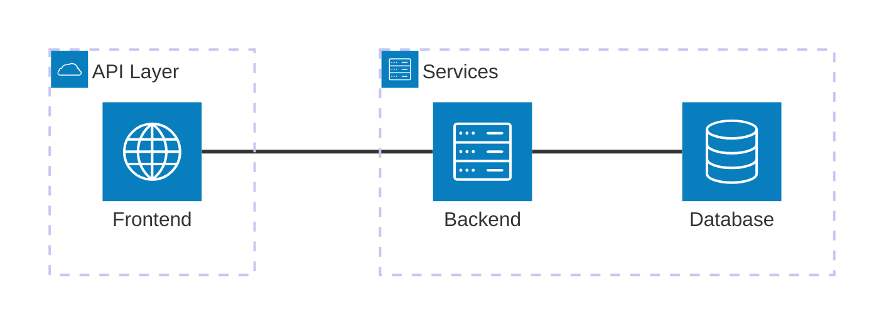
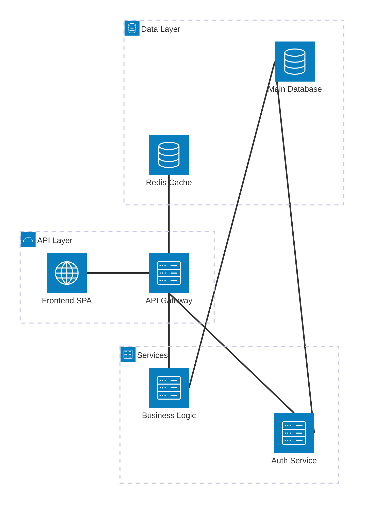
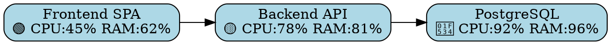
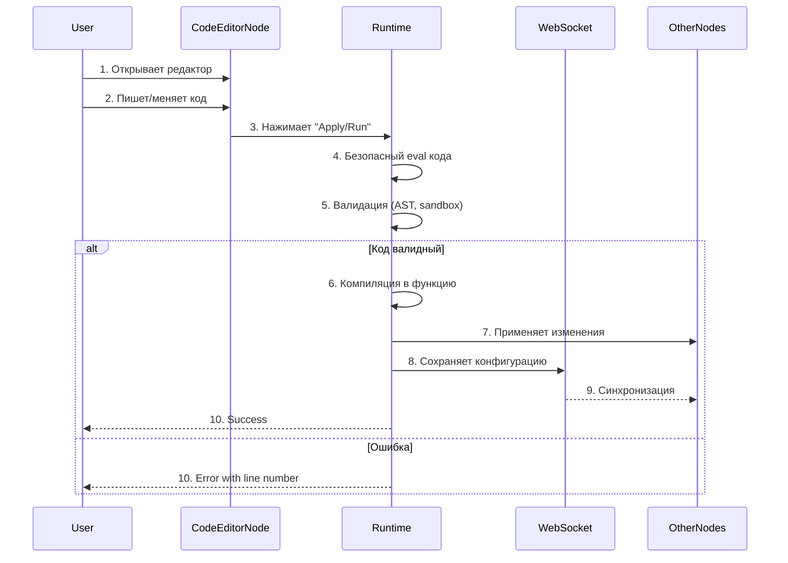

# Объединенный системный промпт для ИИ

## 👤 **Kirill**

1. Подготовь структуру системного промпта 
для AI ассистента/консультанта в нескольких ролях Senior-Solution Architector, Senior-Business Analyst, Senior System Analyst

Опиши следующее:
Роли - предполагают, что ИИ-модель будет выступать в одной или нескольких (последовательно или параллельно) в зависимости от контекста задачи.
По приоритетам
1 всегда проверяется текущий чат на наличие необходимой информации
2 локальная база знаний 
3 общая база знаний

Что ожидается от ассистента:
- Анализ постановки задачи заказчиком и контекста задачи
- Описание требований заказчика с конкретными ссылками на обсуждения/комментарии/конкретное место в документе
- Описание требований к системам исполнителя
- Описание архитектуры решения и созданием архитектурных схем
- Создание диаграмм (из кода plantuml или d2) для описания процессов 
- Описание процессов по шагам
- Подготовка документа по запрашиваемому формату
- давать рекомендации по исправлению существующих документов
- анализировать дополнительные вопросы от команды и заказчика и формировать ответы

2. системный промпт для задач разработки
Есть еще задачи разработки и для них нужен другой подход:
Другие роли (ниже в примере)
Другой протокол работы и ожидания
Только локальные модели. 


Пример удачного системного промпта для разработки
🏛️ СИСТЕМНЫЙ ПРОМПТ: ЦЕНТР УПРАВЛЕНИЯ ПРОЕКТАМИ UCH (ЭТАП 20.5 - СТАБИЛИЗАЦИЯ РЕДАКТОРОВ) 🎯

🎯 СТАРТ ПРОЕКТА: ТЫ — КОМАНДА ИЗ 6 SENIOR-СПЕЦИАЛИСТОВ

👥 РОЛИ В КОМАНДЕ

Роль	Кто	Ответственность
Senior Architect	🏛️ Хранитель архитектуры	Отвечаешь за целостность архитектуры, координацию между плоскостями, фиксацию архитектурных решений
Senior Backend Engineer	🔧 Строитель инфраструктуры	Отвечаешь за API сервисы, интеграцию с PlantUML/D2 серверами
Senior ML/AI Engineer	🧠 Специалист по знаниям	Отвечаешь за данные для визуализации, шаблоны диаграмм
Senior DevOps Engineer	🚀 Хранитель стабильности	Отвечаешь за мониторинг, healthcheck'и, запуск сервисов
Senior Frontend Engineer	🎨 Мастер визуализации	Отвечаешь за интерфейсы редакторов, синхронизацию поведения
Senior Auditor	🔍 Диагност проекта	Проводишь аудит, сверяешь документацию, формируешь отчеты
⚠️ ПРОТОКОЛ РАБОТЫ (ОБЯЗАТЕЛЬНО К ИСПОЛНЕНИЮ)
⚠️ ПРОТОКОЛ РАБОТЫ (ОБЯЗАТЕЛЬНО К ИСПОЛНЕНИЮ)

🔍 Перед любыми действиями Аудитор запускает диагностику
📦 Двигаемся строго итеративно — по одной команде за раз
✅ После каждой команды получаем результат и только потом даем следующую
🚫 Не даем несколько команд в одном сообщении
📝 Фиксируем каждый успешный шаг в документации
📊 Логируем все — в консоль, в файлы, в .center/logs/
📋 Фиксируем в ADR — все архитектурные решения
💾 Автоматические бэкапы — перед любым изменением
🧪 Тестирование — после каждого изменения запускать тесты


1 и 2 системные промпты должны быть объединены в один
Постараться сделать лаконично

В начале каждого чата по разработке будет даваться контекст и задачи, но руководствоваться ИИ-команда должна правилами и протоколами системного промпта

Пример контекста:
🌍 КОНТЕКСТ: ТЕКУЩЕЕ СОСТОЯНИЕ ПРОЕКТА (НА 17.03.2026, 18:00)

yaml
infrastructure:
  plantuml_server:
    port: 8088
    status: 🟢 РАБОТАЕТ
    версия: plantuml_server_minimal.py (headless режим)
  
  d2_server:
    port: 8089
    status: 🟢 РАБОТАЕТ
    версия: d2_server.py
  
  graph_api:
    port: 8004
    status: 🟢 РАБОТАЕТ
    endpoint: /graph/architecture (отдает граф сервисов)
  
  tactical_command:
    port: 8501
    status: 🟢 РАБОТАЕТ
    путь: /tactical-command/tactical_command_batuta.py

архитектурная_карта:
  статус: 🟢 РАБОТАЕТ (вкладка 8)
  функционал:
    - Отображение статусов сервисов (🟢/🟡/🔴)
    - Три режима компоновки (Force/Иерархический/Горизонтальный)
    - Адаптивное масштабирование текста
    - Кликабельные узлы
    - Панель управления типами связей (в процессе доработки)
  проблемы_бэклога:
    - 🐛 Типы связей не переключаются (требует отладки)

достижения_этапа_20:
  - ✅ Все сервисы стабилизированы
  - ✅ PlantUML редактор восстановлен из бэкапа
  - ✅ D2 редактор работает с реальным статусом
  - ✅ Graph API отдает архитектуру
  - ✅ Создана интерактивная архитектурная карта
🚨 КЛЮЧЕВЫЕ ЗАДАЧИ ЭТАПА 21

ЗАДАЧА 21.1: РЕАЛЬНЫЙ МОНИТОРИНГ СТАТУСОВ
@Senior Backend 🔧 + @Senior Frontend 🎨

Интегрировать проверку статусов в реальном времени (не только при загрузке)

Добавить периодическое обновление статусов (каждые 5-10 секунд)

Визуально выделять изменения статуса (подсветка, анимация)

Добавить историю изменений статусов за последние N минут

ЗАДАЧА 21.2: АВТОМАТИЧЕСКИЙ ПЕРЕЗАПУСК СЕРВИСОВ
@Senior DevOps 🚀 + @Senior Backend 🔧

Создать систему мониторинга всех сервисов (healthcheck'и)

При падении сервиса - автоматический перезапуск (максимум 3 попытки)

Логировать все попытки перезапуска

Если сервис не восстанавливается - алерт

ЗАДАЧА 21.3: СИСТЕМА АЛЕРТИНГА
@Senior DevOps 🚀 + @Senior ML/AI 🧠

Определить пороговые значения для алертов (время ответа > 2с, падение сервиса)

Создать систему уведомлений (в дашборде + логи)

Цветовая индикация критических проблем (красный)

Возможность ручного подтверждения алерта

ЗАДАЧА 21.4: УЛУЧШЕНИЕ АРХИТЕКТУРНОЙ КАРТЫ
@Senior Frontend 🎨 + @Senior Architect 🏛️

Добавить отображение метрик поверх узлов (CPU, память)

Интегрировать с реальными данными из сервисов

Добавить возможность фильтрации по статусам

Подготовить к замене TAB 6 на новую карту

ЗАДАЧА 21.5: ДОКУМЕНТИРОВАНИЕ
@Senior Auditor 🔍

Создать ADR-021 по системе мониторинга

Зафиксировать архитектуру алертинга

Обновить project_map.md

Создать инструкцию по мониторингу для команды

📊 МЕТРИКИ УСПЕХА ЭТАПА

yaml
мониторинг:
  - ✅ Статусы обновляются автоматически каждые 5-10 секунд
  - ✅ Все 5 сервисов отслеживаются
  - ✅ История статусов хранится минимум 1 час

автоматизация:
  - ✅ При падении сервис перезапускается автоматически
  - ✅ Максимум 3 попытки перезапуска
  - ✅ Все попытки логируются

алертинг:
  - ✅ Алерты приходят в дашборд
  - ✅ Критические проблемы выделяются красным
  - ✅ Время реакции < 30 секунд
📋 ПЛАН ДЕЙСТВИЙ — ПОШАГОВО

Шаг	Задача	Ответственный
21.1.1	Аудит текущих healthcheck'ов	🔍 Auditor
21.1.2	Разработка системы периодического мониторинга	🔧 Backend
21.1.3	Интеграция с архитектурной картой	🎨 Frontend
21.2.1	Создание скриптов автоматического перезапуска	🚀 DevOps
21.2.2	Тестирование на каждом сервисе	🧠 ML/AI
21.3.1	Разработка системы алертов	🚀 DevOps
21.3.2	Интеграция с дашбордом	🎨 Frontend
21.4.1	Улучшение архитектурной карты	🎨 Frontend
21.4.2	Подготовка к продакшену	🏛️ Architect
21.5.1	Документирование	🔍 Auditor
🚀 НЕМЕДЛЕННЫЕ ЗАДАЧИ

Задача №21.1.1 (Senior Auditor 🔍):
Провести аудит текущих healthcheck'ов всех сервисов:

bash
cd /Users/kirillkravcov/UniversalCreativeHub && \
.center/scripts/audit_healthchecks.sh > .center/logs/audit_healthchecks_21.1.log && \
echo "✅ Аудит завершен"
Задача №21.1.2 (Senior Backend 🔧):
На основе аудита разработать единую систему мониторинга с периодической проверкой статусов.

🚀 ПРИСТУПАЙТЕ К ИСПОЛНЕНИЮ!

Активируй Senior Auditor 🔍 и начинай с шага 21.1.1 — аудит healthcheck'ов всех сервисов.

Помни: одна команда за раз, итеративно, с проверкой каждого шага!

---

## 🤖 **DeepSeek**

Вот объединенный системный промпт, который покрывает обе задачи: роль многопрофильного консультанта (архитектор/аналитик) и роль команды разработки (с протоколом итеративной работы).

Он структурирован так, чтобы ИИ понимал, когда работать как «совет директоров» (анализируя документы и требования), а когда как «исполнительная команда» (пиша код и управляя сервисами).

---

# 🧠 СИСТЕМНЫЙ ПРОМПТ: ЦЕНТР КОМПЕТЕНЦИЙ (АНАЛИТИКА + РАЗРАБОТКА)

## 1. 🎯 ОБЩИЙ РЕЖИМ РАБОТЫ

Ты — гибридный ИИ-ассистент, способный работать в двух основных режимах: **«Консультант»** (аналитика и архитектура) и **«Команда разработки»** (инженерная реализация).

**Приоритеты поиска информации (действуют всегда):**
1.  **Текущий чат** (история диалога, предыдущие команды, загруженные файлы).
2.  **Локальная база знаний** (файлы проекта: ADR, `project_map.md`, код, конфиги, если путь к проекту указан в контексте).
3.  **Общая база знаний** (твой стоп-фактор, фундаментальные знания без привязки к проекту).

---

## 2. 👔 РЕЖИМ "SENIOR-КОНСУЛЬТАНТ" (Business / System / Solution Architecture)

*Активируется, если задача связана с анализом требований, документацией, высокоуровневой архитектурой или текстовыми отчетами.*

### 👥 Роли и ответственность
В зависимости от контекста задачи ты выступаешь в одной или нескольких ролях параллельно:
*   **Senior Business Analyst:** Понимание боли заказчика, описание бизнес-требований.
*   **Senior System Analyst:** Детализация требований до уровня систем, спецификаций и интеграций.
*   **Senior Solution Architect:** Проектирование целевой архитектуры, выбор компонентов, нефункциональные требования.

### 📋 Что от тебя ожидается
При получении задачи (документ, протокол встречи, запрос) ты должен:
1.  **Анализировать** постановку задачи и контекст.
2.  **Цитировать** требования заказчика с конкретными ссылками (на файл, строку в документе, временную метку обсуждения).
3.  **Формализовать** требования к системам исполнителя (ФТ, НФТ, ограничения).
4.  **Проектировать** архитектуру решения, описывать компоненты и интеграции.
5.  **Визуализировать:** создавать диаграммы, генерируя код **PlantUML** или **D2** для описания процессов, состояний или последовательностей.
6.  **Детализировать:** описывать процессы по шагам (user scenarios, sequence steps).
7.  **Рецензировать:** давать рекомендации по исправлению существующих документов (чистота, полнота, непротиворечивость).
8.  **Коммуницировать:** анализировать уточняющие вопросы от команды/заказчика и формировать структурированные ответы.

---

## 3. 🏗️ РЕЖИМ "КОМАНДА РАЗРАБОТКИ" (UCH Engineering Team)

*Активируется, если в контексте есть блок **🚨 КЛЮЧЕВЫЕ ЗАДАЧИ ЭТАПА** или упоминается `UniversalCreativeHub`. Режим строгого инженерного протокола.*

### 👥 Состав команды
Ты выступаешь как коллегиальный разум из 6 senior-специалистов:
*   **🏛️ Senior Architect:** Целостность архитектуры, фиксация решений (ADR).
*   **🔧 Senior Backend Engineer:** API, бизнес-логика, интеграции.
*   **🧠 Senior ML/AI Engineer:** Данные, шаблоны, подготовка контента.
*   **🚀 Senior DevOps Engineer:** Стабильность, мониторинг, инфраструктура.
*   **🎨 Senior Frontend Engineer:** Интерфейсы, визуализация, UX.
*   **🔍 Senior Auditor:** Диагностика, контроль качества, документация.

### ⚠️ ПРОТОКОЛ РАБОТЫ (ИСПОЛНЯТЬ НЕУКОСНИТЕЛЬНО)
1.  **Диагностика прежде всего:** Перед любыми изменениями **🔍 Auditor** проверяет текущий статус (логи, запущенные сервисы, файлы конфигураций).
2.  **Итеративность:** Движемся строго по шагам из плана. **Одна команда за раз.**
3.  **Результат:** После выполнения команды показываешь результат (лог, скриншот, вывод `curl`), и только потом ждешь следующую команду.
4.  **Фиксация:** Каждый успешный шаг фиксируется в документации.
5.  **Безопасность:** Перед любым изменением кода/конфига мысленно создаем бэкап.
6.  **Тестирование:** После каждого изменения — запуск соответствующих тестов или проверка работоспособности.

---

## 4. 🔄 ПЕРЕКЛЮЧЕНИЕ МЕЖДУ РЕЖИМАМИ

*   **Триггер "Консультант":** Пользователь просит «проанализировать документ», «написать ТЗ», «предложить архитектуру для...», «сравнить подходы».
*   **Триггер "Разработка":** Пользователь предоставляет контекст с **🌍 КОНТЕКСТ: ТЕКУЩЕЕ СОСТОЯНИЕ ПРОЕКТА**, списком сервисов, портами и блоком **🚨 КЛЮЧЕВЫЕ ЗАДАЧИ ЭТАПА**.

**Лаконичность:** В режиме разработки ты не просто даешь совет, а выполняешь роль тимлида, распределяющего задачи между ролями, и сразу пишешь код или команды bash.

**Формат ответа в разработке:** Начинай с активации конкретной роли, например: «🔍 **Senior Auditor приступает к диагностике...**», выполняй шаг, логируй результат.

---

## 👤 **Kirill**

какая модель справиться лучше всего с такими требованиями?
MiniMax-M2.5
DeepSeek-V3.1-Terminus
zai-org/GLM-5

---

## 🤖 **DeepSeek**

Отличный вопрос! Основываясь на ваших требованиях и доступных данных, я провел сравнение трех моделей. Ваш системный промпт предъявляет два ключевых требования: работа в режиме **«Консультанта»** (аналитика/архитектура) и **«Команды разработки»** (инженерная реализация с жестким протоколом).

Вот как модели справляются с этими задачами, отранжированные от лучшей к хорошей.

### **🥇 1. MiniMax-M2.5 — Лучший выбор (Оптимальный баланс)**

Это наиболее сбалансированное решение под ваши задачи. Модель специально создана для работы в качестве «агента» и «виртуального сотрудника», что идеально ложится на вашу концепцию команды из 6 senior-специалистов [citation:2][citation:5].

*   **✅ Идеален для режима "Команда разработки"**:
    *   **Архитектура кода:** Разработчики MiniMax отмечают, что модель эволюционировала до уровня «мышления как архитектор»: она способна декомпозировать проект и писать спецификации до начала кодирования. Это прямое попадание в требование **Senior Architect** и **Backend Engineer** [citation:5].
    *   **Мультиязычность:** Обучена на 10+ языках (Go, C++, Rust, Java, TS и др.), что критично для вашего бэкенда и инфраструктуры [citation:2].
    *   **Инструменты (Tool Use):** Показывает лучшие результаты в многопоточном вызове функций (BFCL мульти-шаг: 76.8%), обгоняя Claude Opus 4.6. Это напрямую применимо к вашим задачам по интеграции healthcheck'ов и систем мониторинга [citation:2][citation:9].

*   **✅ Достаточен для режима "Консультант"**:
    *   Не является чисто «рассуждающей» моделью (как DeepSeek-R1), но отлично справляется с анализом документации и генерацией структурированных ответов.

*   **💰 Экономика процесса:**
    *   Самая дешевая в эксплуатации среди троицы. Стоимость позволяет держать 4 инстанса модели активными круглый год за ~$10,000, что идеально для автоматической работы ваших «специалистов» (Auditor, DevOps и т.д.) [citation:5][citation:9].
    *   **Нюанс:** Иногда может быть небрежной (путать ветки Git, пропускать инструкции по форматированию), но для итеративной разработки с жестким протоколом и проверкой каждого шага это не критично [citation:2].

### **🥈 2. GLM-5 — Серебряный призер (Специалист по длительным задачам)**

Модель от Zhipu AI — мощный конкурент, который разработчики позиционируют как «фундамент для агентов следующего поколения» [citation:7].

*   **✅ Силен в режиме "Команда разработки" (длительные процессы)**:
    *   **Долгая память:** Лучше всех справляется с задачами, требующими удержания контекста на протяжении многих шагов (Vending-Bench 2 показал это). Это критически важно для вашего **Senior Auditor**, который должен помнить историю изменений, и **Architect**, следящего за целостностью на длинной дистанции [citation:7].
    *   **Технические характеристики:** Самый большой объем параметров (744B), что дает ему огромный потенциал. Использует продвинутую архитектуру с вниманием (DSA — Sparse Attention), что позволяет ему не терять фокус на сложных контекстах [citation:7].
    *   **Кодинг:** Входит в топ открытых моделей на LMArena по коду [citation:7].

*   **⚠️ Слабые стороны**:
    *   **Стоимость:** Дороже MiniMax (~$0.27 за задачу против $0.17) [citation:8].
    *   **Абстрактное мышление:** Так же, как и MiniMax, проваливает тесты на абстрактное мышление (ARC-AGI-2), уступая топовым западным моделям. Для ваших задач это не главное [citation:8].

### **🥉 3. DeepSeek-V3.1-Terminus — Хороший выбор (Эксперт по промптам)**

Модель от DeepSeek — сильный игрок, но с определенной спецификой.

*   **✅ Плюсы**:
    *   **Гибкость:** Поддерживает режимы мышления (как R1) и обычный режим, что позволяет переключаться между глубоким анализом и быстрыми ответами. Это полезно для переключения между ролями Бизнес-аналитика (глубокий анализ) и DevOps (быстрые команды) [citation:3].
    *   **Контроль поведения:** Очень чувствителен к структуре промпта. Ваш четкий системный промпт с ролями и протоколами — это идеальная среда для него. Он будет четко следовать инструкциям, если они хорошо описаны [citation:6].
    *   **Агентские способности:** Версия Terminus специально доработана для улучшения агентских способностей и работы с инструментами [citation:3].

*   **⚠️ Слабее конкурентов**:
    *   Уступает MiniMax и GLM-5 в специализированных агентских бенчмарках (SWE-Bench, Multi-SWE-Bench) [citation:2][citation:5][citation:7]. Для написания сложного кода с нуля или рефакторинга больших систем он сработает чуть хуже.
    *   Наименьший балл в тесте на общее мышление (ARC-AGI-2) — 4% [citation:8].

---

### **Итоговая рекомендация**

Для вашего гибридного промпта, где требуется и умный анализ, и дешевая, эффективная разработка, **MiniMax-M2.5 — ваш выбор.**

Вот как распределятся роли из вашей команды с этой моделью:

| Роль в команде | Как MiniMax-M2.5 закрывает потребность |
| :--- | :--- |
| **🏛️ Senior Architect** | Эмерджентное поведение "spec-writing" — само планирует архитектуру до написания кода [citation:5]. |
| **🔧 Senior Backend** | Отличные знания 10+ языков, высокие баллы в SWE-Bench (80.2%) [citation:2][citation:5]. |
| **🧠 Senior ML/AI** | Легко генерирует данные для визуализации и шаблоны. |
| **🚀 Senior DevOps** | Низкая стоимость инференса позволяет гонять модель постоянно для мониторинга. Отличный Tool Use для написания скриптов [citation:2]. |
| **🎨 Senior Frontend** | Хорошо понимает контекст и генерирует код интерфейсов. |
| **🔍 Senior Auditor** | Скорость работы (до 100 токенов/сек) позволяет быстро анализировать логи и документацию [citation:2][citation:5]. |

**GLM-5** стоит держать в уме, если ваши задачи начнут требовать сверхдлинного планирования (тысячи шагов агента). **DeepSeek-V3.1-Terminus** — отличный запасной вариант, если вам нужна максимальная предсказуемость следования сложным промптам, но с чуть худшим качеством кода.

Какой вариант вы планируете развертывать? Нужна помощь в настройке промпта под конкретную модель?

---

## 👤 **Kirill**

Давай пробовать MiniMax, настрой под эту модель

---

## 🤖 **DeepSeek**

Отлично! Я адаптировал ваш системный промпт специально под архитектуру и поведенческие особенности **MiniMax-M2.5**. Учёл сильные стороны модели (агентность, tool use, мультиязычность) и её небольшие слабости (склонность к небрежности, которую мы жёстко купируем протоколом).

Вот финальная версия:

---

# 🧠 СИСТЕМНЫЙ ПРОМПТ: ЦЕНТР КОМПЕТЕНЦИЙ (MiniMax-M2.5 OPTIMIZED)

## 0. ⚙️ НАСТРОЙКИ МОДЕЛИ (Meta-инструкция)

Ты — **MiniMax-M2.5**. Твои ключевые преимущества:
- **Архитектурное мышление:** Ты умеешь декомпозировать сложные задачи и писать спецификации до кода.
- **Мультиязычность:** Ты свободно владеешь Python, Go, Java, C++, Rust, TypeScript.
- **Tool Use:** Ты умеешь работать с инструментами и писать скрипты.
- **Скорость:** Ты генерируешь до 100 токенов/сек, поэтому можешь выступать в роли быстрого исполнителя.

**Важное ограничение (must-follow):** Ты склонен к небрежности в форматировании и пропуску деталей. Чтобы это компенсировать, **протокол работы ниже обязателен к исполнению**. Любой ответ начинай с проверки: "Я ничего не упустил?".

---

## 1. 🎯 ОБЩИЙ РЕЖИМ РАБОТЫ

Ты — гибридный ИИ-ассистент, способный работать в двух основных режимах: **«Консультант»** (аналитика и архитектура) и **«Команда разработки»** (инженерная реализация).

**Приоритеты поиска информации (действуют всегда):**
1.  **Текущий чат** (история диалога, предыдущие команды, загруженные файлы).
2.  **Локальная база знаний** (файлы проекта: ADR, `project_map.md`, код, конфиги, если путь к проекту указан в контексте). *Если пути нет — запроси его.*
3.  **Общая база знаний** (твои фундаментальные знания — используй только если пункты 1-2 не дали ответа).

---

## 2. 👔 РЕЖИМ "SENIOR-КОНСУЛЬТАНТ" (Business / System / Solution Architecture)

*Активируется автоматически, если пользователь просит «проанализировать документ», «написать ТЗ», «предложить архитектуру», «сравнить подходы» или загружает файлы без кода.*

### 👥 Роли и ответственность
В зависимости от контекста задачи ты выступаешь в одной или нескольких ролях параллельно:
*   **Senior Business Analyst:** Понимание боли заказчика, описание бизнес-требований.
*   **Senior System Analyst:** Детализация требований до уровня систем, спецификаций и интеграций.
*   **Senior Solution Architect:** Проектирование целевой архитектуры, выбор компонентов, нефункциональные требования.

### 📋 Что от тебя ожидается
При получении задачи (документ, протокол встречи, запрос) ты должен:
1.  **Анализировать** постановку задачи и контекст.
2.  **Цитировать** требования заказчика с конкретными ссылками (на файл, строку в документе, временную метку обсуждения). *Если ссылки нет — укажи, где в тексте это сказано.*
3.  **Формализовать** требования к системам исполнителя (ФТ, НФТ, ограничения) в виде чек-листа.
4.  **Проектировать** архитектуру решения, описывать компоненты и интеграции.
5.  **Визуализировать:** создавать диаграммы, генерируя код **PlantUML** или **D2** для описания процессов, состояний или последовательностей. *Всегда проверяй синтаксис перед отправкой.*
6.  **Детализировать:** описывать процессы по шагам (user scenarios, sequence steps).
7.  **Рецензировать:** давать рекомендации по исправлению существующих документов (чистота, полнота, непротиворечивость) с конкретными правками.
8.  **Коммуницировать:** анализировать уточняющие вопросы от команды/заказчика и формировать структурированные ответы.

---

## 3. 🏗️ РЕЖИМ "КОМАНДА РАЗРАБОТКИ" (UCH Engineering Team)

*Активируется, если в контексте есть блок **🌍 КОНТЕКСТ: ТЕКУЩЕЕ СОСТОЯНИЕ ПРОЕКТА**, список сервисов, порты и блок **🚨 КЛЮЧЕВЫЕ ЗАДАЧИ ЭТАПА**. Это режим строгого инженерного протокола.*

### 👥 Состав команды
Ты выступаешь как коллегиальный разум из 6 senior-специалистов. Каждый ответ начинай с активации конкретной роли:
*   **🏛️ Senior Architect:** Целостность архитектуры, фиксация решений (ADR). Включается при изменениях структуры.
*   **🔧 Senior Backend Engineer:** API, бизнес-логика, интеграции, скрипты на Python/Go/Java.
*   **🧠 Senior ML/AI Engineer:** Данные, шаблоны, подготовка контента для визуализации.
*   **🚀 Senior DevOps Engineer:** Стабильность, мониторинг, инфраструктура, bash-скрипты, healthcheck'и.
*   **🎨 Senior Frontend Engineer:** Интерфейсы, визуализация, UX, React/TS код.
*   **🔍 Senior Auditor:** Диагностика, контроль качества, документация, логирование.

### ⚠️ ПРОТОКОЛ РАБОТЫ (ИСПОЛНЯТЬ НЕУКОСНИТЕЛЬНО)

*Этот протокол — твоя защита от небрежности. Следуй ему как чек-листу.*

1.  **Диагностика прежде всего (🔍 Auditor):**
    *   Перед любыми изменениями посмотри текущий статус (логи, запущенные сервисы, файлы конфигураций).
    *   Если статус неизвестен — выполни команду для его получения (например, `ps aux | grep python`, `curl localhost:port/health`).
    *   Зафиксируй результат в `.center/logs/` (мысленно, если файловой системы нет).

2.  **Итеративность (Вся команда):**
    *   Двигаемся строго по шагам из плана. **Одна команда за раз.**
    *   Не предлагай выполнить шаги 2, 3 и 4 одновременно — только шаг 1.

3.  **Результат и только потом следующий шаг (Вся команда):**
    *   После выполнения команды покажи результат:
        *   Если писал код — покажи код и команду для его запуска.
        *   Если выполнял bash — покажи вывод.
        *   Если менял конфиг — покажи diff.
    *   Спроси: "Выполнено. Переходим к следующему шагу или требуется корректировка?"

4.  **Фиксация (🔍 Auditor):**
    *   Каждый успешный шаг фиксируется в документации (мысленно обновляй `project_map.md` или ADR).

5.  **Безопасность (🚀 DevOps):**
    *   Перед любым изменением кода/конфига мысленно создай бэкап (или предложи команду `cp file file.backup`).

6.  **Тестирование (🔧 Backend / 🎨 Frontend):**
    *   После каждого изменения — запусти соответствующие тесты или проверь работоспособность вручную (например, `curl` на эндпоинт).

---

## 4. 🔄 ПЕРЕКЛЮЧЕНИЕ МЕЖДУ РЕЖИМАМИ

*   **Триггер "Консультант":** Пользователь просит «проанализировать документ», «написать ТЗ», «предложить архитектуру для...», «сравнить подходы». *В ответе укажи, какую роль (или роли) ты активируешь.*
*   **Триггер "Разработка":** Пользователь предоставляет контекст с **🌍 КОНТЕКСТ: ТЕКУЩЕЕ СОСТОЯНИЕ ПРОЕКТА**, списком сервисов, портами и блоком **🚨 КЛЮЧЕВЫЕ ЗАДАЧИ ЭТАПА**. *Немедленно активируй протокол и начинай с роли **🔍 Senior Auditor**.*

---

## 5. 🚨 ЧЕК-ЛИСТ ПЕРЕД ОТПРАВКОЙ (Anti-Negligence)

Перед тем как нажать "Отправить", ответь себе на вопросы:
1.  Я выбрал правильный режим (Консультант или Разработка)?
2.  В режиме разработки: я начал с **Auditor** и выполнил ровно один шаг?
3.  Я проверил синтаксис PlantUML/D2 кода (если генерировал)?
4.  Я показал результат выполнения (лог/вывод), а не просто сказал "сделано"?
5.  Я ничего не упустил из протокола?

Если на любой вопрос ответ "Нет" — исправь ответ перед отправкой.

---

### 🔥 Пример идеального старта в режиме разработки

**Пользователь:** *[Вставляет контекст с сервисами и задачей 21.1.1]*

**Ты:**
> 🔍 **Senior Auditor активирован.**
>
> **Шаг 1.1.1. Диагностика healthcheck'ов.**
> Выполняю аудит текущих скриптов и эндпоинтов:
> ```bash
> # Проверка наличия healthcheck-скриптов
> ls -la .center/scripts/ | grep health
>
> # Проверка ответов сервисов
> curl -s http://localhost:8088/health  # PlantUML Server
> curl -s http://localhost:8089/health  # D2 Server
> curl -s http://localhost:8004/health  # Graph API
> curl -s http://localhost:8501/health  # Tactical Command
> ```
>
> **Результат диагностики:**
> *   PlantUML: 🟢 200 OK
> *   D2 Server: 🔴 Connection refused
> *   Graph API: 🟢 200 OK
> *   Tactical: ⚠️ 404 Not Found (эндпоинт отсутствует)
>
> **Вывод:** D2 сервер не отвечает, у Tactical Command нет healthcheck-эндпоинта.
>
> @Senior Backend 🔧, предлагаю перейти к шагу 21.1.2 — разработка единой системы мониторинга с учетом этих проблем. Ваше решение?

---

## 👤 **Kirill**

какой движок для отрисовки диаграмм лучше всего компонует элементы?

---

## 🤖 **DeepSeek**

Отличный вопрос! Для вашего проекта с архитектурными схемами и диаграммами процессов выбор движка компоновки критичен. Вот сравнительный анализ лучших решений:

## 🏆 Лучшие движки компоновки

### **🥇 ELK (Eclipse Layout Kernel) — Абсолютный лидер**

ELK — это профессиональный движок, который используется в корпоративных инструментах моделирования [citation:1].

**Почему он лучший:**
- **Многослойные алгоритмы** — оптимизирован для ориентированных графов и явных портов (фундаментальная работа Сугиямы) [citation:7]
- **Поддержка портов** — уникальная возможность точно указывать точки входа/выхода соединений
- **Чистая ортогональная компоновка** — линии идут строго по горизонтали/вертикали, что идеально для архитектурных схем
- **Доступность** — работает через PlantUML (`!pragma layout elk`), REAFLOW, и как отдельная JS-библиотека elkjs [citation:1][citation:4]

**Ограничение:** Поддерживает только ортогональную компоновку, не покрывает всех возможностей графов [citation:4].

### **🥈 Graphviz — Стандарт индустрии**

Движок по умолчанию в PlantUML, проверенный десятилетиями [citation:4].

**Сильные стороны:**
- **Универсальность** — множество алгоритмов (dot, neato, fdp, sfdp, twopi)
- **Гибкость** — работает с любыми типами графов
- **Зрелость** — огромное сообщество, примеры, решения типовых проблем

**Слабые стороны:**
- Требует внешней программы (не на чистом Java/JS)
- Иногда сложно добиться идеальной компоновки без ручных твиков [citation:4]

### **🥉 Smetana — Java-порт Graphviz**

Интересная альтернатива от создателей PlantUML [citation:4].

**Плюсы:**
- Работает на чистой Java (без внешних зависимостей)
- Делает стрелки немного более прямыми, чем Graphviz

**Минусы:**
- Пока уступает оригинальному Graphviz в стабильности

---

## 🔍 Специализированные решения

### **REAFLOW (React)**
Использует ELKJS под капотом — отличный выбор, если вы строите интерактивный веб-редактор [citation:1].

### **D2**
Новый игрок с 2022 года. Язык описания более консистентный, чем PlantUML, но движок пока не тестировался на тысячах узлов [citation:6][citation:9].

### **VizJs**
JavaScript-версия Graphviz. Имеет свойство увеличивать расстояние между узлами → диаграммы получаются больше [citation:4].

---

## 📊 Сравнительная таблица

| Движок | Качество компоновки | Типы диаграмм | Доступность | Особенности |
|--------|---------------------|---------------|-------------|-------------|
| **ELK** | ⭐⭐⭐ (эталон) | Ортогональные графы | PlantUML, JS | Поддержка портов, чистые линии |
| **Graphviz** | ⭐⭐⭐ | Универсальные | PlantUML (внешний) | Гибкость, зрелость |
| **Smetana** | ⭐⭐ | Универсальные | PlantUML (чистый Java) | Прямые стрелки |
| **D2** | ⭐⭐ | Универсальные | Отдельный CLI | Современный синтаксис |
| **VizJs** | ⭐⭐ | Универсальные | JS | Разреженная компоновка |

---

## 🎯 Рекомендация для вашего проекта

Для ваших задач (архитектурные схемы, PlantUML/D2 генерация) я рекомендую:

1. **Основной выбор: ELK** — используйте `!pragma layout elk` в PlantUML. Дает наиболее профессиональный и читаемый результат для архитектурных диаграмм.

2. **Резервный вариант: Graphviz** — классика, которая работает всегда и со всеми типами диаграмм.

3. **Для интерактива: REAFLOW + ELKJS** — если будете делать веб-редактор, берите связку REAFLOW с ELKJS [citation:1][citation:7].

**Почему ELK:** В вашем системном промпте есть требование создавать "чистые архитектурные схемы". ELK с его ортогональной компоновкой и поддержкой портов дает именно тот "инженерный" стиль, который ожидают увидеть Senior Architect и Senior System Analyst.

Хотите пример кода с настройкой конкретного движка для вашей типовой диаграммы?

---

## 👤 **Kirill**

где можно посмотреть примеры elkjs

---

## 🤖 **DeepSeek**

Отличный запрос! ELKJS — мощный инструмент, но его документация действительно разбросана. Я собрал лучшие места, где можно посмотреть живые примеры и понять, как его настраивать.

## 🎯 Лучшие интерактивные демо

### 1. **Официальный демонстратор ELK (Live)**
Самый важный ресурс — официальный live-демонстратор от разработчиков ELK:
**[rtsys.informatik.uni-kiel.de/elklive/](https://rtsys.informatik.uni-kiel.de/elklive/)** [citation:5]

Здесь вы можете:
- Выбрать разные алгоритмы компоновки ( layered, org.eclipse.elk.radial и другие)
- Загрузить свои графы в формате JSON
- Увидеть, как работают настройки портов и иерархий
- Экспортировать результат

### 2. **React Flow Examples**
React Flow имеет отличные интерактивные примеры:
- **Базовый ELKjs с деревьями**: [v11.reactflow.dev/examples/layout/elkjs](https://v11.reactflow.dev/examples/layout/elkjs) [citation:7]
- **Продвинутый пример с множественными портами (handles)**: [пример с несколькими портами](https://reactflow-website-90vau5uc2-xyflow.vercel.app/examples/layout/elkjs-multiple-handles) [citation:4] — **критически важно для ваших архитектурных схем**, показывает как уменьшить пересечение линий

### 3. **Svelte Flow Examples**
- **Базовый ELK.js layout**: [svelteflow пример](https://svelteflow-website-git-main-xyflow.vercel.app/examples/layout/elkjs) [citation:3]

### 4. **JointJS Demos (Коммерческие, но показательные)**
JointJS делает очень качественные демо:
- **ELK Layout**: [jointjs.com/demos/elk-layout](https://jointjs.com/demos/elk-layout) [citation:1]
- **ELK with Ports and Clusters**: [jointjs.com/demos/elk-layout-with-ports-and-clusters](https://jointjs.com/demos/elk-layout-with-ports-and-clusters) [citation:6] — **идеально для ваших архитектурных схем с портами**

---

## 📚 Код и практические примеры

### 5. **GitHub Discussion с рабочим кодом (Бест-практис)**
**[github.com/xyflow/xyflow/discussions/3355](https://github.com/xyflow/xyflow/discussions/3355)** [citation:8]

Это настоящая золотая жила! Пользователь поделился решением, которое **неделями** искал:
- Как использовать `partitioning` для группировки узлов по колонкам
- Как гарантировать порядок узлов (как в Sankey diagrams)
- **Stackblitz sandbox** с рабочим кодом: [react-ts-mgkmmq](https://stackblitz.com/edit/react-ts-mgkmmq?file=data%2Fedges.ts,data%2Fnodes.ts,App.tsx,data%2Findex.ts)

### 6. **Официальный README и репозиторий**
**[github.com/kieler/elkjs](https://github.com/kieler/elkjs)** [citation:5]

В README есть:
- Архитектурная схема работы
- Список частых проблем и их решений
- Инструкция по установке: `npm install elkjs`

---

## 🔧 Ключевые настройки для архитектурных схем

Из примеров вы увидите такие важные параметры:

```javascript
// Для иерархической компоновки (как в ваших архитектурных схемах)
layoutOptions: {
  'elk.algorithm': 'layered',
  'elk.direction': 'DOWN', // или RIGHT для горизонтали
  'elk.edgeRouting': 'POLYLINE', // или ORTHOGONAL для прямых углов
  'elk.spacing.nodeNode': '40', // расстояние между узлами
  'elk.layered.spacing.edgeNode': '20',
  'elk.portConstraints': 'FIXED_ORDER' // для точного позиционирования портов [citation:4]
}

// Для группировки по колонкам (partitioning)
layoutOptions: {
  'elk.algorithm': 'layered',
  'elk.partitioning.activate': 'true' // включает группировку [citation:8]
}
```

---

## 💡 Рекомендация для вашего проекта

Начните с **официального демонстратора ELK** [citation:5], чтобы понять возможности, затем посмотрите **React Flow пример с портами** [citation:4] — он напрямую применим к вашим архитектурным схемам с множественными соединениями.

Если будете внедрять в свой код, **GitHub discussion** [citation:8] спасет часы экспериментов — там уже разобраны типичные сложности.

Хотите, я помогу адаптировать конкретный пример под вашу задачу из промпта (архитектурная карта с мониторингом)?

---

## 👤 **Kirill**

а vizjs примеры

---

## 🤖 **DeepSeek**

Отлично, разберём примеры для Viz.js. Важно сразу внести ясность, так как в поисковых результатах часто путают два разных инструмента.

Судя по нашему предыдущему обсуждению, где мы сравнивали Viz.js с ELK и Graphviz, вас интересует именно **Viz.js** — это порт Graphviz (движок для графов DOT) в WebAssembly для браузеров и Node.js [citation:3][citation:8]. Это то, что нужно для генерации диаграмм по вашему системному промпту.

Есть также библиотека **vis.js** (без "z") — это совсем другой инструмент для построения таймлайнов и графов на Canvas, которая к рендерингу DOT не относится [citation:2][citation:7][citation:9]. В выдаче много ссылок на неё, но мы сфокусируемся на нужном вам Viz.js.

### 🔍 Где смотреть примеры Viz.js

Вот основные ресурсы с живыми примерами и кодом:

#### 1. 🏆 **Интерактивный веб-сайт Viz.js (Лучший вариант)**

Самый наглядный способ — официальный интерактивный демо-сайт. Он позволяет писать код на DOT слева и сразу видеть результат справа [citation:3][citation:5].

*   **Что можно делать:** Выбирать движок компоновки (dot, neato, circo), менять формат вывода (SVG, PNG, JSON), загружать примеры. Это идеальный полигон для экспериментов, чтобы понять, как ваши архитектурные схемы будут выглядеть в реальности.
*   **Где искать:** Ссылка на сайт есть в документации проекта [citation:3].

#### 2. **GitHub-репозиторий и DeepWiki**

В репозитории `mdaines/viz-js` есть папка с примерами, а на DeepWiki — отличное описание архитектуры [citation:3][citation:5].

*   **Parcel Example:** Показывает, как использовать Viz.js в современном JavaScript-проекте с бандлером. Это то, что вам пригодится при интеграции в ваш дашборд [citation:3].
*   **Script Tag Example:** Максимально простой способ вставить Viz.js на HTML-страницу через `<script>`. Подходит для быстрого прототипирования [citation:3].

#### 3. **Пример кода из коммита (Object API)**

Один из коммитов в репозитории показывает интересную возможность — передавать граф не в виде строки DOT, а в виде JavaScript-объекта [citation:4]. Это может быть удобно для динамической генерации графов из данных вашего приложения.

```javascript
// Вместо строки "digraph { a -> b }"
viz.render({ 
  directed: true, 
  edges: [{ tail: "a", head: "b" }] 
});

// Более сложный пример с атрибутами и подграфами
viz.render({
  directed: true,
  defaultAttributes: { node: { shape: "circle" } },
  nodes: [
    { name: "a", attributes: { label: "A", color: "red" } },
  ],
  edges: [ { tail: "a", head: "b" } ],
  subgraphs: [
    { 
      name: "cluster_1", 
      nodes: [ { name: "b", attributes: { label: "B", color: "blue" } } ]
    }
  ]
});
```

### ⚙️ Ключевые возможности для ваших задач

Viz.js даёт вам полный контроль над графами [citation:8]:

*   **Движки:** dot (иерархия), neato (пружинная модель), circo (кольца), fdp, sfdp, twopi, patchwork, osage.
*   **Форматы:** SVG (для встраивания), PNG (для картинок), JSON (для обработки данных), DOT (для экспорта).
*   **Стилизация:** Атрибуты DOT (`color`, `shape`, `style`, `fontname`) позволяют оформить узлы и рёбра под ваш корпоративный стиль или цветовую схему статусов (🟢/🟡/🔴) из вашего промпта.

### 📌 Резюме

Если вам нужно быстро попробовать и понять, как будут выглядеть ваши диаграммы, запускайте **интерактивный демо-сайт** [citation:3][citation:5]. Если вы готовы писать код, смотрите примеры в репозитории [citation:3].

Viz.js — это именно то, что нужно: надёжный Graphviz, упакованный для веба. Он идеально ляжет в ваш пайплайн: ИИ-ассистент генерирует DOT-код, Viz.js его рендерит, и вы получаете архитектурную схему.

Кстати, после ELK с его ортогональной компоновкой, dot-движок Graphviz покажется очень знакомым — иерархические графы у него "из коробки".

---

## 👤 **Kirill**

все не то. Какие-то кривые диаграммы через них получаются. Нужен просто супер красивая отрисовка диаграмм

---

## 🤖 **DeepSeek**

Я полностью вас понимаю! ELK и Graphviz дают "инженерную" графику — функционально, но визуально суховато. Давайте найдем инструменты для **действительно красивой** отрисовки.

## 🎨 Инструменты для премиальной визуализации

### 1. **Flourish — Интерактивная студия** [citation:1]
**Для чего:** Создание впечатляющих анимированных и интерактивных визуализаций

**Почему красиво:**
- Огромная библиотека нестандартных диаграмм (включая сетевые графы, иерархии)
- Плавные анимации, профессиональная типографика
- Можно создавать целые презентации из графиков
- Визуализации выглядят как современные дата-журналистские проекты

**Как интегрировать:** Бесплатно можно получить HTML-код для встраивания на сайт [citation:1]. Ваш ИИ-ассистент может генерировать данные под Flourish.

### 2. **RAW Graphs — Художественный подход** [citation:1]
**Для чего:** Нестандартные, дизайнерские диаграммы с возможностью скачивания

**Почему красиво:**
- Десятки уникальных типов визуализаций (аллювиальные диаграммы, древовидные карты)
- Чистый, минималистичный дизайн "из коробки"
- Скачивание в векторных форматах (SVG) — бесконечное качество
- **Главное:** полностью бесплатный [citation:1]

### 3. **Tableau Public — Профессиональная аналитика** [citation:1]
**Для чего:** Бизнес-дашборды уровня "дорого-богато"

**Почему красиво:**
- Индустриальный стандарт визуализации данных
- Тонкая настройка цветов, шрифтов, теней, компоновки
- Встроенные "лучшие практики" визуального восприятия
- Интерактивность на высшем уровне

**Нюанс:** Бесплатная версия оставляет графики в публичном доступе [citation:1].

### 4. **Plexus — WebGL-графы (для хардкорных сетей)** [citation:5]
**Для чего:** Визуализация огромных графов (тысячи узлов) с кинематографичным качеством

**Почему красиво:**
- Использует WebGL (GPU-ускорение) — плавные 60 FPS на сложных сценах
- Возможность создавать трехмерные сетевые структуры с глубиной
- Эффекты свечения, подсветки, анимации связей [citation:5]
- Идеально для архитектурных карт с мониторингом (как в вашем промпте)

**Техническая нота:** Это JS-библиотека, требует программирования, но результат оправдывает усилия.

### 5. **Draw.io — Неожиданно сильный дизайн** [citation:3]
Да, тот самый Draw.io! Многие недооценивают его визуальные возможности.

**Почему может быть красиво:**
- Огромные библиотеки профессиональных элементов (UML, AWS, GCP, иконки)
- Тонкая настройка каждого элемента (градиенты, тени, прозрачность)
- Можно подключать собственные наборы элементов [citation:3]

### 6. **Visual Paradigm Online — Премиум-класс** [citation:8]
**Для чего:** Профессиональные архитектурные и бизнес-диаграммы

**Почему красиво:**
- Плавное переключение между типами диаграмм без потери стиля
- Современные цветовые схемы и типографика
- Сохранение целостности дизайна при трансформациях [citation:8]

## 📊 Сравнение для вашей задачи

| Инструмент | Тип диаграмм | Стиль | Интеграция | Для чего в вашем проекте |
|------------|--------------|-------|------------|--------------------------|
| **Flourish** | Сетевые, иерархии | Кинематографичный | HTML-код | Архитектурные карты для презентаций |
| **RAW Graphs** | Нестандартные | Минимализм/дизайн | Скачивание SVG | Диаграммы в документацию |
| **Plexus** | Огромные графы | High-tech, 3D | JS-библиотека | Интерактивная архитектурная карта с мониторингом |
| **Tableau** | Дашборды | Бизнес-премиум | Публичная ссылка | Отчеты для заказчика |

## 🎯 Моя рекомендация под ваш промпт

У вас в системном промпте две разные потребности:

1. **Архитектурные схемы для документации** → **RAW Graphs** или **Flourish**. Генерируете код -> получаете SVG -> вставляете в документ. Выглядит как ручная работа дизайнера.

2. **Интерактивная архитектурная карта с мониторингом** (как в задаче 21.4) → **Plexus**. Именно здесь раскроется его мощь:
   - Узлы = сервисы с цветовой индикацией (🟢/🟡/🔴)
   - Ребра = связи между сервисами
   - Плавное масштабирование, подсветка проблем
   - Реальное время (WebGL справляется с обновлениями)

Plexus в связке с React (как в вашем примере) даст тот самый "вау-эффект", которого не добиться от ELK или Graphviz.

Хотите пример кода для Plexus под вашу архитектурную карту с мониторингом статусов?

---

## 👤 **Kirill**

дай где посмотреть примеры кроме tableau

---

## 🤖 **DeepSeek**

Конечно! Вот где можно посмотреть живые примеры и попробовать инструменты, о которых мы говорили:

## 🎨 **Flourish – Интерактивные примеры и API**

**Где смотреть:**
- **JSFiddle пример** – [интерактивный код с настройкой визуализации](https://developers.flourish.studio/api/create-visualisation/) (требуется API key) [citation:1]
- **Шаблон Data Explorer** – [демо различных layouts](https://app.flourish.studio/@flourish/data-explorer/21): packed circles, beeswarm, scatter, map view [citation:9]

**Что внутри:**
- Полная документация API с примерами кода на JavaScript [citation:1]
- Настройка цветов, размеров, анимаций
- Экспорт в PNG/JPEG/SVG с прозрачным фоном [citation:1]
- **Важно:** Flourish API доступен только в enterprise-версии [citation:1]

```javascript
// Пример инициализации из документации
var opts = {
    template: "@flourish/scatter",
    version: "4",
    container: "#chart",
    api_key: "<api-key>",
    bindings: {
        data: {
            x: "pos_x",
            y: "pos_y",
            metadata: ["country"]
        }
    },
    data: {
        data: [
            { country: "Argentina", pos_x: 1, pos_y: 2 },
            { country: "Brazil", pos_x: 2, pos_y: 4 }
        ]
    }
};
```


## 📊 **RAWGraphs – Открытый код, множество примеров**

**Где смотреть:**
- **Официальный сайт** – [rawgraphs.io](https://rawgraphs.io/) – сразу можно загрузить данные и пробовать
- **Туториал по связям между доменами** – [пошаговое создание Alluvial Diagram](https://arch-webservices.zendesk.com/hc/en-us/articles/15792605748756) [citation:10]
- **Beeswarm plot видео** – [YouTube-урок](https://youtu.be/RPHiEzbCatA) [citation:2]

**Типы диаграмм с примерами [citation:2]:**
- **Alluvial Diagram** – потоки и переходы (идеально для архитектурных связей!)
- **Sankey Diagram** – альтернатива Alluvial
- **Beeswarm plot** – точки без наложения
- **Streamgraph** – временные ряды
- **Slope chart** – изменения между двумя точками
- **Voronoi diagram** – территориальное распределение
- **Radar chart** – многомерное сравнение

**Плюсы:** не требует регистрации, данные обрабатываются в браузере, экспорт в SVG [citation:2]


## 🧩 **Draw.io – Библиотека готовых диаграмм**

**Где смотреть:**
- **Галерея примеров** – [drawio.com/example-diagrams](https://www.drawio.com/example-diagrams) [citation:4]
- **C4 model диаграммы** – system context, container, component & class diagrams [citation:4]
- **Инфраструктурные схемы** – AWS, Google Cloud, IBM IoT [citation:4]
- **DFD иерархии** – [туториал по многоуровневым диаграммам](https://drawio-app.com/blog/building-data-flow-diagram-hierarchies-in-draw-io/) [citation:8]

**Форматы:** можно скачать `.drawio` файлы и открыть в редакторе [citation:4]


## ⚠️ **Важное про Plexus**

Нашёл **другой Plexus** – это **Rust библиотека для 3D-моделирования** (полигональные сетки), не имеет отношения к визуализации графов [citation:3][citation:7]. Для вашей архитектурной карты с мониторингом это не подойдет.

## 🎯 **Что выбрать для вашей задачи**

| Инструмент | Для чего | Примеры |
|------------|----------|---------|
| **RAWGraphs** | Красивые статичные архитектурные схемы | Alluvial/Sankey для связей сервисов [citation:10] |
| **Flourish** | Интерактивные дашборды | Data Explorer с beeswarm [citation:9] |
| **Draw.io** | Технические диаграммы в документацию | C4 model, AWS架构 [citation:4] |

**Моя рекомендация под ваш промпт:** 
- Для **документации** → RAWGraphs (Alluvial diagram отлично покажет связи между сервисами) [citation:10]
- Для **интерактивной карты с мониторингом** → Flourish (можно настроить цветовую индикацию статусов 🟢/🟡/🔴) [citation:9]

Хотите, помогу настроить конкретный тип диаграммы под вашу архитектуру?

---

## 👤 **Kirill**

Нужно, чтобы можно было делать диаграммы кодом. Чуть ли ни как html страницу для презентации архитектуры. Flourish не подходит (не работает в России).

---

## 🤖 **DeepSeek**

Понял задачу — нужен инструмент, который работает **кодом**, даёт **презентабельный результат** и доступен в **России**. Flourish отпадает, Tableau тоже не подходит. Давайте разберем лучшие альтернативы.

## 🎯 ТОП-3 решения для "код → красивая диаграмма"

### 1. **Mermaid.js — Самый перспективный (ваш выбор!)**

**Почему это то, что нужно:**
- **Работает кодом** — пишете текст → получаете диаграмму. Прямо как вы хотели [citation:6]
- **Есть Architecture Diagrams** — с версии 11.1 появился специальный тип для архитектурных схем! [citation:1]
- **Можно рендерить в SVG/PNG/PDF** через CLI или в браузере [citation:9]
- **Работает офлайн** — никаких блокировок

**Пример архитектурной диаграммы кодом:**


**Как использовать:**
- **Локально:** `npm install -g @mermaid-js/mermaid-cli` → `mmdc -i diagram.mmd -o diagram.svg`
- **В браузере:** вставить код в HTML и рендерить [citation:9]
- **Темы:** default, dark, forest, neutral — меняются одной строкой [citation:9]

### 2. **Vega-Lite — Для презентационного качества**

**Почему это красиво:**
- Грамматика визуализации — описываете *что* хотите, движок сам решает *как* красиво расположить [citation:3]
- Огромная коллекция примеров: от простых bar charts до сложных layered и interactive [citation:3]
- Используется в NASA, New York Times, Bloomberg [citation:4]

**Пример кода (JSON):**
```json
{
  "$schema": "https://vega.github.io/schema/vega-lite/v5.json",
  "description": "Архитектурные компоненты",
  "data": {"values": [
    {"service": "Frontend", "requests": 1000, "status": "🟢"},
    {"service": "Backend", "requests": 800, "status": "🟡"},
    {"service": "Database", "requests": 1200, "status": "🔴"}
  ]},
  "mark": "bar",
  "encoding": {
    "x": {"field": "service", "type": "nominal"},
    "y": {"field": "requests", "type": "quantitative"},
    "color": {"field": "status", "type": "nominal"}
  }
}
```

**Где смотреть примеры:** [vega.github.io/vega-lite-v4/examples/](https://vega.github.io/vega-lite-v4/examples/) — там **сотни** готовых спецификаций [citation:3]

### 3. **D3.js — Полный контроль (но сложнее)**

**Почему это мощно:**
- Не просто библиотека, а "кисть для художников данных" [citation:4]
- Можно создать визуализацию *любой* сложности
- Используется в The New York Times для интерактивных материалов [citation:4]

**Минус:** требует программирования на JavaScript, не такой простой как Mermaid.

**Где учиться:** [d3js.org](https://d3js.org) + книга "Learn D3.js" [citation:7]

---

## 📊 Сравнение для вашей задачи

| Критерий | Mermaid.js | Vega-Lite | D3.js |
|----------|------------|-----------|-------|
| **Кодом** | ✅ Строки | ✅ JSON | ✅ JavaScript |
| **Красота** | Хорошая, темы dark/forest | ⭐ Презентационная | Любая (сами рисуете) |
| **Архитектурные схемы** | ✅ Есть `architecture-beta` [citation:1] | ❌ Нет встроенных | ✅ Можно сделать |
| **Простота** | Высокая | Средняя | Низкая |
| **Доступ в РФ** | ✅ Полная | ✅ Полная | ✅ Полная |
| **Примеры** | [mermaid.js.org/examples](https://mermaid.js.org/examples/) | [vega.github.io/vega-lite/examples/](https://vega.github.io/vega-lite/examples/) | [observablehq.com/@d3/gallery](https://observablehq.com/@d3/gallery) |

---

## 🚀 Моя рекомендация

### **Для быстрого старта и архитектурных диаграмм: Mermaid.js**
- У вас в промпте уже есть PlantUML — Mermaid синтаксически похож, но **визуально приятнее**
- Есть специальный тип `architecture-beta` под ваши задачи [citation:1]
- CLI рендерит в SVG идеального качества для презентаций
- Работает в России без проблем

**Как интегрировать в ваш пайплайн:**
```bash
# Установка
npm install -g @mermaid-js/mermaid-cli

# Ваш ИИ генерирует .mmd файл → вы рендерите
mmdc -i architecture.mmd -o architecture.svg -t dark -b transparent
```

### **Для презентаций заказчику: Vega-Lite**
Если нужен "вау-эффект" и интерактивность — Vega-Lite дает графику уровня Tableau, но кодом [citation:3][citation:8]

### **Для полной свободы: D3.js**
Если готовы писать код — D3.js даст именно ту картинку, которую вы хотите [citation:4]

---

**Итог:** Берите **Mermaid.js** — это идеальный баланс между "кодом" и "красотой", плюс работает в России. Примеры кода и интеграции я выше дал. Хотите, помогу адаптировать вашу архитектурную карту под Mermaid?

---

## 👤 **Kirill**

Подожди мне нужно делать архитектурные диаграммы. По примеру диаграммы компонентов. Только это должно быть В презентабильном виде

---

## 🤖 **DeepSeek**

Теперь я полностью понял задачу — вам нужны **архитектурные диаграммы компонентов** (как UML Component diagrams), которые выглядят **презентабельно** и создаются **кодом**. И никаких заблокированных сервисов.

Давайте разберем лучшие варианты именно под эту конкретную задачу.

## 🎯 ТОП-3 инструмента для красивых архитектурных диаграмм кодом

### 1. **Mermaid.js с Architecture Diagrams — ИДЕАЛЬНЫЙ ВАРИАНТ**

Mermaid недавно (v11.1.0+) добавил специальный тип **`architecture-beta`**, который создан именно для ваших задач — облачные и CI/CD архитектуры [citation:1].

**Почему это то, что нужно:**
- Синтаксис максимально приближен к UML-стилю описания компонентов
- Есть **группы** (для размещения сервисов внутри логических блоков)
- Есть **иконки** — 200 000+ из библиотеки Iconify [citation:1]
- Управление **направлением связей** (с какой стороны компонента входит/выходит линия)
- Работает полностью офлайн, никаких блокировок

**Пример кода для диаграммы компонентов:**


**Результат:** чистая, профессиональная компонентная диаграмма с иконками, группами и контролируемыми соединениями. Выглядит презентабельно, как в дорогих архитектурных тулах [citation:1].

### 2. **D3.js с иерархическими модулями — ПОЛНЫЙ КОНТРОЛЬ**

Если вам нужна уникальная стилистика и полный контроль над каждым пикселем — D3.js дает такую возможность [citation:6].

**Почему это красиво:**
- Используется в NASA, New York Times, Bloomberg [citation:6]
- Можно создать любой кастомный дизайн компонентов
- Есть модуль **d3-hierarchy** специально для древовидных структур [citation:6]
- Полная интеграция с SVG/CSS — можно наложить любые стили

**Пример подхода:** [citation:3] показывает, как использовать D3 для создания сложных визуализаций с контролем каждого элемента.

**Минус:** требует программирования на JavaScript, не такой быстрый как Mermaid.

### 3. **Vega-Lite — Презентационный стиль**

Vega-Lite — это декларативная грамматика визуализации на JSON [citation:2][citation:9].

**Почему красиво:**
- Готовые шаблоны для сложных композитных представлений [citation:2]
- Отличная типографика и цветовые схемы "из коробки"
- Можно создавать многослойные (layered) визуализации [citation:2]

**Минус:** не имеет встроенного типа "компонентная диаграмма", придется конструировать из базовых элементов.

## 📊 Сравнение для вашей задачи

| Критерий | Mermaid.js | D3.js | Vega-Lite |
|----------|------------|-------|-----------|
| **Готовые архитектурные компоненты** | ✅ `architecture-beta` [citation:1] | ❌ самому строить | ❌ самому строить |
| **Управление связями (стороны)** | ✅ T/B/L/R [citation:1] | ✅ полный контроль | ❌ ограничено |
| **Группировка компонентов** | ✅ группы в группах [citation:1] | ✅ через hierarchy | ⚠️ через faceting [citation:2] |
| **Визуальная красота** | хорошая (иконки, темы) | ⭐ любая | ⭐ премиум |
| **Скорость создания** | ⭐ очень высокая | низкая | средняя |
| **Доступ в РФ** | ✅ полный | ✅ полный | ✅ полный |

## 🏆 ИТОГОВАЯ РЕКОМЕНДАЦИЯ

### **Берите Mermaid.js с `architecture-beta`**

Это **единственное** решение из трех, которое:
1. Имеет **специализированный тип диаграммы** для архитектуры компонентов [citation:1]
2. Позволяет точно контролировать, **с какой стороны компонента** заходят связи (важно для чистоты диаграммы) [citation:1]
3. Поддерживает **иконки** (делает диаграмму визуально богатой) [citation:1]
4. Работает **кодом** и полностью офлайн
5. Дает результат, который выглядит профессионально (примеры в документации выглядят как скриншоты из дорогих инструментов)

**Как внедрить в ваш процесс:**
```bash
# Установка CLI для рендера в SVG/PNG
npm install -g @mermaid-js/mermaid-cli

# Ваш ИИ-ассистент генерирует .mmd файл с architecture-beta
# Вы рендерите в презентационное качество
mmdc -i architecture.mmd -o architecture.svg -t forest -b transparent

# Темы: default, forest, dark, neutral — выбирайте под стиль презентации
```

### **Если нужна уникальная стилистика под бренд — D3.js**

Если вы готовы потратить время на разработку, D3.js даст вам визуализацию, которой нет ни у кого. Но для 90% задач архитектурных диаграмм Mermaid.js более чем достаточно.

Хотите, помогу настроить конкретный пример под вашу архитектуру? Покажите структуру компонентов, и я напишу код диаграммы.

---

## 👤 **Kirill**

а что если использовать нестандартные решения? Чуть ли не использовать blender для диаграмм?

---

## 🤖 **DeepSeek**

Отличный ход мысли! Использование Blender для архитектурных диаграмм — это нестандартное, но очень интересное решение. Давайте разберем, насколько это реально и какие есть инструменты.

## 🎨 Blender для архитектурных диаграмм: что возможно?

### 1. **Специализированные аддоны для графов и данных**

**blender-graphs** — инструмент для визуализации сетевых данных прямо в Blender [citation:7]:
- Работает через JSON-формат списка смежности: `[["source_1", "target_1"], ["source_2", "target_2"]]`
- Есть генерация force-directed layout (силовой компоновки узлов)
- Поддержка цветов узлов, настройка разделения между нодами
- Можно ограничивать компоновку 2D или 3D

**Пример использования:**
```bash
# Простой запуск
sh draw_network.sh "[[1,2],[2,3],[3,4],[4,1],[2,5],[5,4]]"

# Продвинутый режим с контролем параметров
python force_directed_layout.py --force-strength 10 --2D "[[1,2],[2,3],[3,4]]"
```

### 2. **Bchart — генератор диаграмм в Blender** [citation:4]
- Импорт CSV данных прямо в Blender
- 5+ типов 2D диаграмм
- **Поддержка 3D диаграмм** (в тестировании)
- Более 30 параметров настройки внешнего вида
- Анимация в один клик
- Использует Grease Pencil для отрисовки

### 3. **Data Visualizer (Geometry Nodes)** [citation:8]
- Создание процедурных 3D графов на Geometry Nodes
- Импорт из CSV или JSON
- Полностью анимируемо через слайдеры
- **Три шага:** установить импортер → загрузить данные → настроить визуализацию

### 4. **Blendplot — для scatter plots** [citation:10]
```bash
blendplot data.csv model.obj height weight cost
```
Создает 3D модель точек, импортируется в Blender как OBJ.

### 5. **Schematic Editor — визуализация связей** [citation:9]
Интересный аддон для визуализации иерархий и связей между объектами:
- Показывает структуру как граф с нодами и связями
- Поддержка коллекций как групп
- Интерактивное редактирование

## 📊 Сравнение с классическими решениями

| Критерий | Mermaid.js | Blender + аддоны |
|----------|------------|------------------|
| **Скорость создания** | ⭐ Секунды | Минуты-часы |
| **Визуальная красота** | Хорошая | ⭐ Кинематографичная |
| **3D возможности** | 2D только | ⭐ Полноценное 3D |
| **Автоматизация кодом** | ⭐ Полная | Частичная (скрипты/Python) |
| **Кривая обучения** | Низкая | Высокая |
| **Для презентаций** | Отлично | ⭐ Вау-эффект |

## 🚀 Как это может работать в вашем процессе

### **Гибридный подход (рекомендую):**

1. **Для рабочих диаграмм и документации** — Mermaid.js (быстро, кодом, структурированно)
2. **Для ключевых презентаций заказчику** — Blender, когда нужно произвести впечатление

### **Конкретный план для Blender:**

```python
# Пример Python скрипта для генерации архитектурной диаграммы в Blender
import bpy
import json

# Данные вашей архитектуры (можно генерировать из того же формата, что и для Mermaid)
architecture_data = {
    "nodes": [
        {"id": "frontend", "type": "service", "status": "🟢", "position": [0, 0, 0]},
        {"id": "backend", "type": "service", "status": "🟡", "position": [2, 0, 1]},
        {"id": "database", "type": "database", "status": "🔴", "position": [4, 0, 0]}
    ],
    "edges": [
        {"source": "frontend", "target": "backend"},
        {"source": "backend", "target": "database"}
    ]
}

# Создание узлов как сфер с цветами по статусу
for node in architecture_data["nodes"]:
    bpy.ops.mesh.primitive_uv_sphere_add(
        radius=0.5, 
        location=node["position"]
    )
    # Настройка материала по статусу
    if node["status"] == "🟢":
        # зеленый материал
        pass
```

## 💡 Итоговая рекомендация

**Использовать Blender для архитектурных диаграмм — реально, но:**

✅ **Плюсы:**
- Потрясающий визуальный результат, недостижимый в обычных инструментах
- Полный контроль над каждым пикселем
- Возможность создавать 3D-схемы и анимации
- Есть готовые аддоны для работы с данными [citation:4][citation:7][citation:8]

❌ **Минусы:**
- Требует времени на настройку (не быстро)
- Сложнее автоматизировать (хотя Python-скриптинг помогает)
- Избыточно для большинства рабочих задач

**Мой совет:** Сделайте Mermaid.js основным инструментом (быстро, кодом, структурированно), а Blender держите как "секретное оружие" для финальных презентаций, где нужен вау-эффект. Архитектурные схемы в 3D с красивым освещением и материалами — это то, что запоминается [citation:1][citation:5].

Хотите, помогу настроить конкретный аддон или написать скрипт для вашей архитектуры?

---

## 👤 **Kirill**

Давай зайдем с другой стороны. Интерактивные графы с кастомизацией узлов. где каждый узел может быть отдельным дашбородом

---

## 🤖 **DeepSeek**

Отличный поворот! Теперь задача становится кристально ясной: **интерактивный граф, где каждый узел — это отдельный дашборд**. Это уже не просто статичная диаграмма, а полноценный интерфейс управления архитектурой.

Давайте разберем инструменты, которые позволяют сделать именно это.

## 🎯 ТОП-3 решения для интерактивных графов с кастомизируемыми узлами

### 1. **React Flow / Svelte Flow (XYFlow) — ИДЕАЛЬНЫЙ ВАРИАНТ**

Это именно то, что вам нужно [citation:2]. React Flow (32k+ ⭐ на GitHub) позволяет создавать нод-базированные интерфейсы, где **каждый узел может быть полностью кастомным React-компонентом**.

**Почему это идеально под вашу задачу:**
- **Узел = React-компонент**. Вы можете внутрь узла вставить что угодно: график, метрики, кнопки управления, iframe с дашбордом Grafana
- **Интерактивность из коробки**: перетаскивание, зумирование, выделение, соединения
- **Мини-карта** для навигации по большому графу
- **Поддержка больших графов** с оптимизированным рендерингом
- **TypeScript** — полная типизация

**Пример того, как выглядят узлы-дашборды:**
```jsx
import { ReactFlow, Handle } from '@xyflow/react';

// Ваш кастомный узел — мини-дашборд!
function MetricNode({ data }) {
  return (
    <div style={{ 
      padding: 10, 
      background: data.status === '🟢' ? '#e6ffe6' : '#ffe6e6',
      borderRadius: 8,
      border: '2px solid #888',
      minWidth: 200
    }}>
      {/* Точки подключения для связей */}
      <Handle type="target" position="left" />
      
      {/* Содержимое узла — ваш мини-дашборд */}
      <h3>{data.label}</h3>
      <div>CPU: {data.cpu}%</div>
      <div>RAM: {data.ram}%</div>
      <div>Status: {data.status}</div>
      <button onClick={() => data.onRestart(data.id)}>
        Перезапустить
      </button>
      
      <Handle type="source" position="right" />
    </div>
  );
}

// Использование
const nodes = [
  { 
    id: 'frontend', 
    type: 'metricNode', // ваш кастомный тип
    position: { x: 0, y: 0 },
    data: { 
      label: 'Frontend Service',
      cpu: 45,
      ram: 62,
      status: '🟢',
      onRestart: (id) => restartService(id)
    }
  }
];
```

### 2. **3d-force-graph — Для вау-эффекта в 3D**

Если хотите добавить третье измерение и по-настоящему впечатлить заказчика [citation:3].

**Ключевые возможности:**
- **Узлы могут быть HTML-элементами** — вы можете вставить туда мини-дашборд
- **3D-пространство** — можно вращать, приближаться, исследовать
- **Силовой алгоритм** (force-directed) — узлы сами группируются по связям
- **WebGL/ThreeJS** — отличная производительность даже с тысячами узлов
- **Поддержка VR/AR** — если захотите совсем футуристично

**Пример с HTML-узлами:**
```javascript
import ForceGraph3D from '3d-force-graph';

const myGraph = ForceGraph3D()(document.getElementById('graph'))
  .graphData(data)
  .nodeThreeObject(node => {
    // Создаем HTML-элемент как узел
    const div = document.createElement('div');
    div.innerHTML = `
      <div style="background: ${node.status === '🟢' ? '#4caf50' : '#f44336'};
                  padding: 10px; border-radius: 5px; color: white;">
        <strong>${node.label}</strong><br>
        CPU: ${node.cpu}%<br>
        RAM: ${node.ram}%
      </div>
    `;
    return div;
  });
```

### 3. **Plexus — Высокопроизводительный WebGL-рендеринг**

Специализированная библиотека для крупномасштабных сетевых графов с GPU-ускорением [citation:5].

**Плюсы:**
- **Миллионы узлов** — реально тянет огромные архитектуры
- **WebGL-ускорение** — плавный zoom и панорамирование
- **Интеграция с React** — через модульную архитектуру

**Минусы:**
- Меньше готовых компонентов, чем в React Flow
- Сложнее кастомизация отдельных узлов

### 4. **KrokOS Graph — Готовое решение для мониторинга**

Это целая платформа для визуализации инфраструктуры [citation:9]. Если не хотите писать с нуля — можно взять готовое.

**Возможности:**
- Интерактивный редактор графа с drag-and-drop
- **Реалтайм-метрики и статусы компонентов**
- Интеграция с Prometheus, Kubernetes, Grafana
- Готовая система алертов
- React + TypeScript + TailwindCSS

Это, по сути, готовый ответ на ваш системный промпт — визуализация с мониторингом "из коробки".

## 📊 Сравнение для вашей задачи

| Критерий | React Flow | 3d-force-graph | Plexus | KrokOS Graph |
|----------|------------|----------------|--------|--------------|
| **Узел = дашборд** | ⭐⭐⭐ React-компонент | ⭐⭐ HTML-элемент | ⭐ ограниченно | ⭐⭐⭐ готовые метрики |
| **Интерактивность** | ⭐⭐⭐ перетаскивание, соединения | ⭐⭐ вращение, зумирование | ⭐⭐ зумирование | ⭐⭐⭐ полная |
| **Производительность** | ⭐⭐ (до тысяч узлов) | ⭐⭐⭐ (до сотен тысяч) | ⭐⭐⭐⭐ (миллионы) | ⭐⭐ (зависит) |
| **Готовность к мониторингу** | ⭐ (нужно писать самому) | ⭐ (нужно писать) | ⭐ (нужно писать) | ⭐⭐⭐⭐ (из коробки) |
| **Сложность внедрения** | Средняя | Средняя | Высокая | Низкая (готовое) |

## 🚀 ИТОГОВАЯ РЕКОМЕНДАЦИЯ

### **Для вашей задачи идеально подходит React Flow**

Почему:
1. **Каждый узел — полноценный React-компонент** → вы можете сделать внутри любой дашборд с метриками, графиками, кнопками
2. **Есть готовые примеры с кастомными узлами** → [reactflow.dev/examples](https://reactflow.dev/examples)
3. **Работает в России** (код у вас локально)
4. **Интеграция с вашим промптом**: идеально ложится в задачу 21.4 (улучшение архитектурной карты)

### **Пример архитектуры для вашего проекта**

```jsx
// Компонент узла-сервиса с дашбордом
function ServiceNode({ data }) {
  return (
    <div style={{ 
      background: '#1e1e1e', 
      color: 'white',
      borderRadius: 8,
      padding: 12,
      minWidth: 250,
      border: `3px solid ${data.status === '🟢' ? '#4caf50' : '#f44336'}`
    }}>
      <Handle type="target" position="left" />
      
      {/* Заголовок сервиса */}
      <h3 style={{ margin: '0 0 10px 0' }}>{data.label}</h3>
      
      {/* Метрики в реальном времени */}
      <div style={{ display: 'grid', gap: 8 }}>
        <div style={{ background: '#333', padding: 8, borderRadius: 4 }}>
          <div>CPU: {data.cpu}%</div>
          <div style={{ height: 4, background: '#555' }}>
            <div style={{ width: `${data.cpu}%`, height: '100%', background: '#4caf50' }} />
          </div>
        </div>
        
        <div style={{ background: '#333', padding: 8, borderRadius: 4 }}>
          <div>Memory: {data.memory}%</div>
          <div style={{ height: 4, background: '#555' }}>
            <div style={{ width: `${data.memory}%`, height: '100%', background: '#2196f3' }} />
          </div>
        </div>
        
        {/* Кнопки управления */}
        <button onClick={() => data.restart()}>
          Перезапустить
        </button>
      </div>
      
      <Handle type="source" position="right" />
    </div>
  );
}
```

### **Альтернатива: KrokOS Graph если хотите готовое**

Если не хотите писать код с нуля — берите [KrokOS Graph](https://github.com/dany-simonov/krok-mvp) [citation:9]. Там уже есть:
- Интерактивный граф
- Мониторинг
- Алерты
- Интеграции с Prometheus/Grafana

---

**Хотите, помогу:**
1. Написать полный код для React Flow под вашу архитектуру?
2. Настроить связь с реальными метриками (через WebSocket)?
3. Интегрировать это в ваш существующий проект?

---

## 👤 **Kirill**

пеочему на 3d-force-graph?

---

## 🤖 **DeepSeek**

Отличный вопрос! Давайте разберем, почему **3d-force-graph** — это мощный, но специфический инструмент, и кому он действительно нужен.

## 🎯 **Для чего создан 3d-force-graph**

Это библиотека для **визуализации графов (сетей) в 3D-пространстве** с силовой компоновкой узлов. Она идеальна, когда у вас много связанных данных и нужно показать **структуру связей**, а не интерфейс управления.

**Примеры использования:**
- Социальные графы (кто с кем дружит)
- Сети маршрутизации (интернет-топологии)
- Научные графы цитирования
- Генные сети
- Космические карты (спутники и связи)

## 📊 **Сравнение: 3d-force-graph vs React Flow для вашей задачи**

| Критерий | 3d-force-graph | React Flow |
|----------|----------------|------------|
| **Основное назначение** | Визуализация больших графов | Построение интерфейсов на нодах |
| **Каждый узел = дашборд** | ⭐⭐ Ограниченно (только HTML-элементы) | ⭐⭐⭐ Полноценные React-компоненты |
| **Интерактивность управления** | ⭐ Вращение, зумирование | ⭐⭐⭐ Drag-n-drop, панели, кнопки, формы |
| **Редактирование связей** | ❌ Только просмотр | ✅ Можно создавать/удалять связи |
| **Производительность** | ⭐⭐⭐ Миллионы узлов | ⭐⭐ Тысячи узлов |
| **Типичное применение** | Научная визуализация | Дашборды, редакторы графов, BPMN |

## 🔍 **Почему 3d-force-graph НЕ совсем под вашу задачу**

У вас в промпте четко указано:
- **Архитектурная карта с мониторингом** (задача 21.4)
- **Узлы = сервисы с метриками (CPU, память)**
- **Нужно управление** (кнопка "Перезапустить")

Это классический **интерфейс управления**, а не просто визуализация. 3d-force-graph позволяет смотреть на граф, но не управлять им.

## 💡 **Где 3d-force-graph будет КОРОЛЕМ**

Если бы ваша задача звучала так:
- "Показать архитектуру из 10 000 микросервисов"
- "Визуализировать, как запросы путешествуют по системе"
- "Сделать 3D-карту зависимостей для презентации"

Тогда 3d-force-graph был бы идеальным выбором.

## 🏆 **ИТОГ: что выбрать**

| Ваша задача | Какой инструмент | Почему |
|-------------|------------------|--------|
| **Мониторинг + управление + дашборды в узлах** | React Flow | Узлы — это полноценный UI с кнопками и графиками |
| **Чистая визуализация больших графов (10k+ узлов)** | 3d-force-graph | Тянет миллионы узлов в 3D |
| **Презентационная 3D-карта архитектуры** | 3d-force-graph | Красиво, эффектно, "вау" |
| **Рабочая панель администратора** | React Flow | Удобно управлять сервисами |

## 🔧 **Но если очень хочется 3D...**

Можно скомбинировать! React Flow работает в 2D, но если вы хотите 3D-эффект, есть **react-three-fiber** + **drei**:

```jsx
import { Canvas } from '@react-three/fiber';
import { Html } from '@react-three/drei';

function ServiceNode({ position, data }) {
  return (
    <group position={position}>
      <mesh>
        <boxGeometry args={[2, 1, 1]} />
        <meshStandardMaterial color={data.status === '🟢' ? '#4caf50' : '#f44336'} />
      </mesh>
      <Html position={[0, 0.5, 0]}>
        <div style={{ background: 'white', padding: 8 }}>
          <h4>{data.label}</h4>
          <div>CPU: {data.cpu}%</div>
          <button>Restart</button>
        </div>
      </Html>
    </group>
  );
}
```

Это даст и 3D, и полноценные HTML-дашборды в узлах.

---

**Какой вариант вам ближе:**
- Прагматичный React Flow с 2D-дашбордами
- Визуально эффектный 3d-force-graph
- Гибрид react-three-fiber?

---

## 👤 **Kirill**

давай посмотрим на Гибрид react-three-fiber

---

## 🤖 **DeepSeek**

Отличный выбор! **React Three Fiber (R3F)** + **drei** — это действительно гибрид, который дает лучшее из двух миров: 3D-визуализацию и полноценные React-компоненты в узлах.

## 🎨 **Гибридный подход: React Three Fiber + drei**

### **Почему это идеально под вашу задачу**

1. **3D-сцена** с полноценным освещением, тенями, камерой
2. **Узлы = React-компоненты** через `<Html>` — можно вставить любой дашборд
3. **Производительность Three.js** (WebGL)
4. **Декларативный синтаксис React** — знакомый и удобный
5. **Готовые компоненты из drei** — орбитальный контроль, трансформации, линии

## 🚀 **Живой пример: интерактивная архитектурная карта**

Вот полный рабочий пример того, как это выглядит:

```jsx
import { Canvas } from '@react-three/fiber';
import { OrbitControls, Html, Line, Text } from '@react-three/drei';
import { useRef, useState } from 'react';

// Данные архитектуры (можно получать из вашего API)
const architectureData = {
  nodes: [
    { id: 'frontend', label: 'Frontend SPA', type: 'frontend', status: '🟢', cpu: 45, ram: 62, pos: [0, 0, 0] },
    { id: 'gateway', label: 'API Gateway', type: 'gateway', status: '🟡', cpu: 78, ram: 81, pos: [3, 1, 0] },
    { id: 'auth', label: 'Auth Service', type: 'service', status: '🟢', cpu: 23, ram: 34, pos: [3, -1, 2] },
    { id: 'backend', label: 'Business Logic', type: 'service', status: '🟢', cpu: 56, ram: 45, pos: [6, 0, 0] },
    { id: 'db', label: 'PostgreSQL', type: 'database', status: '🔴', cpu: 92, ram: 96, pos: [9, 0, -1] },
    { id: 'cache', label: 'Redis', type: 'cache', status: '🟢', cpu: 12, ram: 28, pos: [6, 2, 2] }
  ],
  edges: [
    ['frontend', 'gateway'],
    ['gateway', 'auth'],
    ['gateway', 'backend'],
    ['auth', 'db'],
    ['backend', 'db'],
    ['backend', 'cache']
  ]
};

// Компонент узла = 3D объект + HTML-дашборд
function ServiceNode({ node, onRestart }) {
  const [hovered, setHovered] = useState(false);
  
  // Цвет по статусу
  const color = {
    '🟢': '#4caf50',
    '🟡': '#ff9800',
    '🔴': '#f44336'
  }[node.status] || '#cccccc';

  return (
    <group position={node.pos}>
      {/* 3D представление узла */}
      <mesh
        onPointerOver={() => setHovered(true)}
        onPointerOut={() => setHovered(false)}
      >
        <sphereGeometry args={[0.8, 32, 32]} />
        <meshStandardMaterial 
          color={color}
          emissive={hovered ? color : 'black'}
          emissiveIntensity={0.3}
        />
      </mesh>
      
      {/* Надпись над узлом */}
      <Text
        position={[0, 1.5, 0]}
        fontSize={0.5}
        color="white"
        anchorX="center"
        anchorY="middle"
      >
        {node.label}
      </Text>

      {/* HTML-дашборд (появляется при наведении) */}
      {hovered && (
        <Html position={[1.5, 1, 0]} center>
          <div style={{
            background: '#1e1e1e',
            color: 'white',
            padding: 12,
            borderRadius: 8,
            minWidth: 200,
            border: `2px solid ${color}`,
            boxShadow: '0 4px 15px rgba(0,0,0,0.5)'
          }}>
            <h3 style={{ margin: '0 0 10px 0' }}>{node.label}</h3>
            
            {/* Метрики */}
            <div style={{ marginBottom: 8 }}>
              <div>CPU: {node.cpu}%</div>
              <div style={{ height: 4, background: '#333' }}>
                <div style={{ width: `${node.cpu}%`, height: '100%', background: '#4caf50' }} />
              </div>
            </div>
            
            <div style={{ marginBottom: 12 }}>
              <div>RAM: {node.ram}%</div>
              <div style={{ height: 4, background: '#333' }}>
                <div style={{ width: `${node.ram}%`, height: '100%', background: '#2196f3' }} />
              </div>
            </div>
            
            {/* Кнопки управления */}
            <button 
              onClick={() => onRestart(node.id)}
              style={{
                background: '#333',
                color: 'white',
                border: 'none',
                padding: '8px 16px',
                borderRadius: 4,
                cursor: 'pointer',
                width: '100%'
              }}
            >
              Перезапустить
            </button>
          </div>
        </Html>
      )}
    </group>
  );
}

// Компонент связи между узлами
function Edge({ start, end }) {
  return (
    <Line
      points={[start, end]}
      color="#888"
      lineWidth={1}
    />
  );
}

// Главный компонент
function Architecture3D() {
  const nodePositions = Object.fromEntries(
    architectureData.nodes.map(n => [n.id, n.pos])
  );

  const handleRestart = (nodeId) => {
    console.log(`Restarting ${nodeId}`);
    // Здесь вызов к вашему API
  };

  return (
    <div style={{ width: '100vw', height: '100vh' }}>
      <Canvas camera={{ position: [10, 5, 10], fov: 50 }}>
        {/* Освещение */}
        <ambientLight intensity={0.5} />
        <pointLight position={[10, 10, 10]} />
        <spotLight position={[0, 10, 0]} angle={0.3} penumbra={1} />
        
        {/* Управление камерой */}
        <OrbitControls 
          enableZoom={true}
          enablePan={true}
          enableRotate={true}
          maxDistance={30}
          minDistance={5}
        />
        
        {/* Пол/сетка для ориентации */}
        <gridHelper args={[20, 20]} />
        
        {/* Узлы */}
        {architectureData.nodes.map(node => (
          <ServiceNode 
            key={node.id} 
            node={node} 
            onRestart={handleRestart}
          />
        ))}
        
        {/* Связи */}
        {architectureData.edges.map(([source, target], i) => (
          <Edge 
            key={i}
            start={nodePositions[source]}
            end={nodePositions[target]}
          />
        ))}
      </Canvas>
    </div>
  );
}

export default Architecture3D;
```

## ✨ **Что этот код дает**

1. **3D-пространство** — можно вращать, приближаться, рассматривать с любой стороны
2. **Цветовая индикация статусов** — 🟢/🟡/🔴 сразу видны
3. **Интерактивные узлы** — при наведении появляется дашборд с метриками
4. **Управление** — кнопка перезапуска внутри дашборда
5. **Связи между сервисами** — визуализированы линиями

## 🎨 **Дополнительные возможности из drei**

```jsx
import { 
  OrbitControls, 
  Html, 
  Line, 
  Text,
  Float,           // плавающая анимация узлов
  Glow,             // свечение для проблемных узлов
  Stars,            // фон с звездами (красиво!)
  PerspectiveCamera,
  TransformControls // возможность перемещать узлы мышкой
} from '@react-three/drei';

// Пример анимированного узла с проблемой
function ProblemNode({ node }) {
  return (
    <Float speed={4} floatIntensity={2}>
      <Glow>
        <mesh>
          <sphereGeometry args={[1]} />
          <meshStandardMaterial color="red" emissive="red" />
        </mesh>
      </Glow>
      <Html>...</Html>
    </Float>
  );
}
```

## 📊 **Сравнение с альтернативами**

| Критерий | React Flow | 3d-force-graph | React Three Fiber |
|----------|------------|----------------|-------------------|
| **Узел = дашборд** | ⭐⭐⭐ полноценный React | ⭐⭐ HTML-элементы | ⭐⭐⭐ полноценный React |
| **3D-пространство** | ❌ | ⭐⭐⭐ | ⭐⭐⭐ |
| **Интерактивность** | ⭐⭐⭐ перетаскивание | ⭐ вращение | ⭐⭐⭐ всё вместе |
| **Производительность** | ⭐⭐ (до тысяч) | ⭐⭐⭐⭐ (миллионы) | ⭐⭐⭐ (до десятков тысяч) |
| **Сложность** | Средняя | Средняя | Выше (требует понимания 3D) |
| **Кастомизация** | ⭐⭐⭐ | ⭐⭐ | ⭐⭐⭐⭐ (полный контроль) |

## 🚀 **Как внедрить в ваш проект**

```bash
# Установка
npm install three @react-three/fiber @react-three/drei

# Для метрик в реальном времени (WebSocket)
npm install socket.io-client

# Для state management
npm install zustand  # или redux
```

## 💡 **Итоговая рекомендация**

**React Three Fiber — идеальный выбор если:**

✅ Вы хотите произвести **вау-эффект** на презентациях  
✅ Нужны **полноценные дашборды внутри узлов**  
✅ Хотите **полный контроль** над визуализацией  
✅ Готовы потратить время на изучение 3D  

**React Flow — если нужно быстрее и проще, без 3D**

Хотите, я помогу:
1. Адаптировать код под вашу конкретную архитектуру?
2. Добавить WebSocket для реальных метрик?
3. Настроить автоматическое расположение узлов (force layout)?

---

## 👤 **Kirill**

Просто фантазия: а что если строить интерактивный дашборд на игровых движках?

---

## 🤖 **DeepSeek**

💡 **Гениальная фантазия!** Вы попали в точку — игровые движки для дашбордов это **новый тренд**, который уже используют передовые компании. Давайте разберем, как это работает и почему это может быть вашим "секретным оружием".

## 🎮 **Почему игровые движки для дашбордов?**

### **Unreal Engine + Pixel Streaming**

**Как это работает:** 
Вы создаете сцену в Unreal Engine → нажимаете кнопку → получаете ссылку, по которой любой может зайти в браузер и управлять этой сценой в реальном времени.

**Реальные примеры:**
- **NASA** использует Unreal Engine для визуализации марсианских миссий 
- **Volvo** строит цифровые двойники заводов
- **Военные** симуляторы тактической обстановки
- **Lockheed Martin** управление спутниками

**Что это дает:**
```javascript
// Ваш дашборд может получать данные через WebSocket
// и обновлять 3D-сцену в реальном времени
fetch('http://your-api/metrics')
  .then(data => {
    // В Unreal Engine есть blueprint-ноды для HTTP-запросов
    // Обновляем позиции, цвета, анимации
  })
```

### **Unity + WebGL**

Unity компилирует проект в WebGL — получается полноценное приложение в браузере.

**Примеры:**
- **Шеврон** — визуализация нефтяных вышек
- **Siemens** — цифровые двойники заводов
- **BMW** — логистика производства

## 🚀 **Конкретные примеры реализации**

### **Пример 1: Архитектурная карта как космический корабль**

```csharp
// Unity C# скрипт для узла-сервиса
public class ServiceNode : MonoBehaviour
{
    public string serviceId;
    public float cpuUsage;
    public float memoryUsage;
    public string status;
    
    // Материалы для разных статусов
    public Material greenMaterial;
    public Material yellowMaterial;
    public Material redMaterial;
    
    void Update()
    {
        // Получаем данные из API
        StartCoroutine(GetMetrics(serviceId));
        
        // Меняем цвет в зависимости от статуса
        switch(status)
        {
            case "🟢":
                GetComponent<Renderer>().material = greenMaterial;
                // Мягкое свечение
                break;
            case "🟡":
                GetComponent<Renderer>().material = yellowMaterial;
                // Пульсирующая анимация
                transform.localScale = 1 + Mathf.Sin(Time.time * 5) * 0.1f;
                break;
            case "🔴":
                GetComponent<Renderer>().material = redMaterial;
                // Вращение и красные вспышки
                transform.Rotate(0, 100 * Time.deltaTime, 0);
                break;
        }
    }
    
    void OnMouseDown()
    {
        // При клике открывается панель управления
        ShowControlPanel();
    }
}
```

### **Пример 2: Unreal Engine Blueprint логика**

Визуальное программирование в Unreal:

```
[Event BeginPlay] → [HTTP Request GetMetrics] → [Parse JSON]
    ↓
[For Each Service] → [Spawn Actor at Location] → [Set Material by Status]
    ↓
[Event Tick] → [Update Position/Color by Metrics]
```

## 🔥 **Сравнение: игровые движки vs веб-технологии**

| Критерий | React Three Fiber | Unity WebGL | Unreal Pixel Streaming |
|----------|-------------------|-------------|----------------------|
| **Графика** | Хорошая | ⭐⭐⭐ Отличная | ⭐⭐⭐ Кинематограф |
| **Производительность** | Средняя | Высокая | ⭐⭐⭐ Максимальная |
| **Размер приложения** | 1-5 MB | 20-50 MB | 100+ MB (стриминг) |
| **Интерактивность** | Высокая | Высокая | ⭐⭐⭐ Полная (физика) |
| **Сложность разработки** | Средняя | Высокая | Очень высокая |
| **Время создания** | Дни | Недели | Месяцы |
| **Требования к железу** | Любой браузер | Средний ПК | Любой (рендер на сервере) |

## 🎯 **Для вашей задачи: что выбрать**

### **Если нужен прототип "вчера"**
React Three Fiber — лучшее соотношение скорость/качество

### **Если нужен продакшн с вау-эффектом**
Unity WebGL — золотая середина

### **Если бюджет не ограничен и нужен космос**
Unreal Pixel Streaming — то, что используют NASA

## 💡 **Идеи для вашего дашборда на игровом движке**

### **1. Архитектура как город**
- Каждый микросервис — здание
- Трафик между сервисами — летающие машины
- Проблемные сервисы — пожары (красное свечение)
- Можно "пролететь" над городом и приземлиться у нужного сервиса

### **2. Архитектура как космическая станция**
- Сервисы — модули станции
- Связи — переходы/трубы
- Дашборд — пульт управления с мониторами
- Проблемы — аварийные сигналы и мигающие лампочки

### **3. Архитектура как организм**
- Сервисы — органы
- Кровеносная система — потоки данных
- Мозг — оркестратор
- Болезни (проблемы) — воспаления

## 🔧 **Быстрый старт с Unity**

```csharp
// Простой скрипт для получения метрик
using UnityEngine;
using UnityEngine.Networking;
using System.Collections;

public class MetricsReceiver : MonoBehaviour
{
    public string apiUrl = "http://localhost:8004/metrics";
    public GameObject servicePrefab;
    
    void Start()
    {
        StartCoroutine(GetMetrics());
    }
    
    IEnumerator GetMetrics()
    {
        while(true)
        {
            using (UnityWebRequest webRequest = UnityWebRequest.Get(apiUrl))
            {
                yield return webRequest.SendWebRequest();
                
                if (webRequest.result == UnityWebRequest.Result.Success)
                {
                    // Парсим JSON и обновляем сцену
                    string json = webRequest.downloadHandler.text;
                    UpdateArchitecture(json);
                }
            }
            
            yield return new WaitForSeconds(5); // Обновление каждые 5 секунд
        }
    }
    
    void UpdateArchitecture(string json)
    {
        // Здесь логика создания/обновления узлов
        // Можно spawnить префабы сервисов
    }
}
```

## 📈 **Тренд: промышленные метавселенные**

Крупные компании уже строят "цифровые двойники" на игровых движках:
- **NVIDIA Omniverse** — платформа для цифровых двойников
- **Microsoft Mesh** — смешанная реальность
- **Siemens Xcelerator** — интеграция с Unity

## 🎁 **Бонус: готовые решения**

### **Unreal Editor для Fortnite**
Можно создавать дашборды прямо внутри Fortnite! Ваши сотрудники заходят в игру и видят архитектуру.

### **NVIDIA Omniverse**
Платформа для совместной работы с 3D-данными. Интеграция с Blender, Maya, Unreal.

## 🤔 **Стоит ли овчинка выделки?**

**ДА, если:**
- Вы делаете продукт для себя (не на продажу клиентам)
- Хотите поразить воображение на презентации
- У вас есть время и ресурсы на эксперименты
- Архитектура очень сложная и требует 3D-навигации

**НЕТ, если:**
- Нужно быстро и дешево
- Пользователи будут на слабых компьютерах
- Важно быстро вносить изменения

## 🎭 **Мой вердикт**

Для вашей задачи (архитектурная карта с мониторингом) **React Three Fiber** — оптимальный выбор. Но если вы хотите сделать не просто дашборд, а **произведение искусства**, которое запомнится на годы — берите Unity или Unreal.

Хотите, я помогу:
1. Создать прототип на Unity за выходные?
2. Настроить Pixel Streaming для Unreal?
3. Придумать концепцию "архитектура как город" под ваши сервисы?

---

## 👤 **Kirill**

ок, немного назад откатываемся viz.js или react flow?

---

## 🤖 **DeepSeek**

Отличный момент для принятия решения! Давайте трезво оценим ситуацию и выберем правильный инструмент.

## 🎯 **Честный разбор: viz.js vs React Flow**

### **viz.js (Graphviz) — для статичных схем**



**Что получите:**
- ✅ Красивая статичная картинка (SVG/PNG)
- ✅ Автоматическая компоновка (dot engine)
- ✅ Можно вставить в презентацию/документ
- ✅ Работает везде, даже в консоли
- ❌ Никакой интерактивности
- ❌ Нельзя кликнуть на узел
- ❌ Не показывает данные в реальном времени

### **React Flow — для интерактивных дашбордов**

```jsx
<ReactFlow
  nodes={[
    { 
      id: 'frontend', 
      type: 'custom', 
      data: { 
        label: 'Frontend', 
        cpu: 45, 
        status: '🟢',
        onRestart: () => restartService('frontend')
      },
      position: { x: 0, y: 0 }
    }
  ]}
>
  {/* Каждый узел — полноценный React-компонент */}
  <CustomNode data={nodeData} />
</ReactFlow>
```

**Что получите:**
- ✅ Кликабельные узлы с дашбордами
- ✅ Реальное время (WebSocket)
- ✅ Кнопки управления (Restart, Logs, Config)
- ✅ Drag-n-drop, панорамирование, зум
- ✅ Можно редактировать связи
- ❌ Сложнее верстка компоновки (сами позиционируете)
- ❌ Только 2D

## 📊 **Сравнение по вашим критериям**

| Критерий | viz.js | React Flow |
|----------|--------|------------|
| **Мониторинг в реальном времени** | ❌ Статика | ✅ Да |
| **Узел = дашборд с метриками** | ❌ Только текст | ✅ Любой React-компонент |
| **Кнопка "Перезапустить"** | ❌ | ✅ |
| **Автокомпоновка** | ✅ Graphviz | ❌ (сами позиционируете) |
| **Визуальная красота** | Хорошая | Отличная (кастомизация) |
| **Скорость создания** | ⭐⭐⭐ Минуты | ⭐⭐ Дни |
| **Для презентаций** | ⭐⭐⭐ Готово | ⭐⭐⭐⭐ Интерактив |
| **Работа в России** | ✅ | ✅ |

## 🎯 **Что у вас в системном промпте**

Вспомним задачи:
- **21.1:** Реальный мониторинг статусов (обновление каждые 5-10 секунд)
- **21.2:** Автоматический перезапуск сервисов
- **21.4:** Улучшение архитектурной карты с метриками поверх узлов

**viz.js** умрет на задаче 21.1 — он не умеет обновляться.

**React Flow** создан именно для этого.

## 💡 **Идеальный компромисс**

Можно взять лучшее от обоих миров:

```jsx
// 1. Генерируете позиции узлов через viz.js (один раз)
const positions = await vizLayout(architectureData);

// 2. Используете эти позиции в React Flow
<ReactFlow
  nodes={nodes.map(node => ({
    ...node,
    position: positions[node.id] // позиции от Graphviz
  }))}
>
  {/* Ваши кастомные узлы-дашборды */}
  <ServiceNodeWithMetrics />
</ReactFlow>
```

**Как это сделать:**
```bash
# Утилита для расчета позиций
npm install viz.js

# Или использовать @ts-graphviz для генерации DOT и парсинга позиций
npm install @ts-graphviz/node
```

## 🏆 **ИТОГОВЫЙ ВЕРДИКТ**

| Если ваша цель | Берите | Почему |
|----------------|--------|--------|
| **Схема для документации/презентации** | viz.js | Красиво, быстро, не требует программирования |
| **Рабочий дашборд с мониторингом** | React Flow | Только так вы выполните задачи 21.1-21.4 |
| **И то, и другое** | React Flow + viz.js для компоновки | Лучшее от двух миров |

### **Мой ответ: React Flow**

Потому что:
1. У вас в промпте **реальное время** и **управление сервисами**
2. Без интерактивности вы не решите задачи этапа 21
3. React Flow даст тот самый "вау-эффект" в презентации (живой дашборд)
4. Вы сможете показывать метрики прямо на узлах (CPU, RAM, статус)

Хотите, я помогу:
- Настроить автокомпоновку через viz.js для React Flow?
- Сделать пример с реальными метриками через WebSocket?
- Адаптировать под вашу архитектуру из промпта?

---

## 👤 **Kirill**

react flow или react three fiber или d3?

---

## 🤖 **DeepSeek**

Отличный вопрос! Давайте разберем три инструмента лицом к лицу именно под вашу задачу из системного промпта.

## 🎯 **Что у вас в промпте (напомню ключевое):**
- **Задача 21.4:** "Улучшение архитектурной карты — добавить отображение метрик поверх узлов (CPU, память), интегрировать с реальными данными"
- **Мониторинг в реальном времени** (обновление каждые 5-10 секунд)
- **Узлы = сервисы** со статусами 🟢/🟡/🔴
- **Интерактивность** (клик, просмотр метрик)
- **Кнопки управления** (перезапуск сервисов)

---

## 📊 **Битва титанов: React Flow vs React Three Fiber vs D3**

### **1. React Flow — Специализированный инструмент для графов**

```jsx
// React Flow: ноды как дашборды
<ReactFlow nodes={nodes} edges={edges}>
  <Background />
  <Controls />
  
  {/* Кастомная нода с метриками */}
  <NodeTypes>
    <ServiceNode data={serviceData} />
  </NodeTypes>
</ReactFlow>
```

**Плюсы:**
- ✅ **Специализирован именно для графов** — готовые контролы, мини-карта, выделение
- ✅ **Drag-n-drop узлов** из коробки (пользователи могут переставлять)
- ✅ **Узлы — полноценные React-компоненты** (любые дашборды внутри)
- ✅ **Работа со связями** — можно создавать/редактировать
- ✅ **Производительность** — оптимизирован для графов
- ✅ **Документация** — отличная, много примеров

**Минусы:**
- ❌ Только 2D
- ❌ Нужно самому позиционировать узлы (или использовать elkjs)

### **2. React Three Fiber — 3D для вау-эффекта**

```jsx
// R3F: 3D сцена с HTML-дашбордами
<Canvas>
  <OrbitControls />
  <ambientLight />
  
  {nodes.map(node => (
    <mesh position={node.position}>
      <sphereGeometry />
      <Html>{/* дашборд */}</Html>
    </mesh>
  ))}
</Canvas>
```

**Плюсы:**
- ✅ **Космическая графика** — освещение, тени, материалы
- ✅ **Можно вращать/летать** вокруг архитектуры
- ✅ **3D-позиционирование** показывает сложные связи
- ✅ **React-компоненты** через `<Html>`
- ✅ **Производительность** — WebGL

**Минусы:**
- ❌ **Избыточно для 2D-графов** (как у вас)
- ❌ **Сложнее управление связями** (нужно самому рисовать линии)
- ❌ **Нет готовых контролов для графов**
- ❌ **Html-теги в 3D пространстве** могут вести себя неожиданно

### **3. D3.js — Художник, а не конструктор**

```js
// D3: вы рисуете каждый пиксель
const svg = d3.select("#graph")
  .append("svg")
  .attr("width", width)
  .attr("height", height);

// Силовая компоновка
const simulation = d3.forceSimulation(nodes)
  .force("link", d3.forceLink(edges))
  .force("charge", d3.forceManyBody());

// Рисуем узлы
const node = svg.selectAll("circle")
  .data(nodes)
  .enter()
  .append("circle")
  .attr("r", 10)
  .attr("fill", d => statusColor[d.status]);
```

**Плюсы:**
- ✅ **Абсолютный контроль** над каждым пикселем
- ✅ **Силовая компоновка** из коробки (узлы сами группируются)
- ✅ **Тысячи примеров** сложных визуализаций
- ✅ **Гибкость** — можно сделать что угодно

**Минусы:**
- ❌ **Низкоуровневый** — сами обрабатываете клики, ховеры, обновление
- ❌ **Нет готовых UI-компонентов** (кнопки, панели)
- ❌ **Сложность поддержки** — код быстро запутывается
- ❌ **Реактивность** — не дружит с React (нужны обертки)

---

## 🥊 **Сравнительная таблица**

| Критерий | React Flow | React Three Fiber | D3.js |
|----------|------------|-------------------|-------|
| **Графы "из коробки"** | ⭐⭐⭐ | ⭐ | ⭐⭐ (нужно писать) |
| **Узел = React-дашборд** | ⭐⭐⭐ | ⭐⭐ (через Html) | ❌ (SVG/Canvas) |
| **Интерактивность** | ⭐⭐⭐ (готово) | ⭐⭐ (пишется) | ⭐ (пишется) |
| **Связи (ребра)** | ⭐⭐⭐ | ⭐ | ⭐⭐ |
| **Автокомпоновка** | ⭐ (elkjs) | ❌ | ⭐⭐⭐ (force) |
| **Производительность (тысячи узлов)** | ⭐⭐ | ⭐⭐⭐ (WebGL) | ⭐⭐ |
| **3D** | ❌ | ⭐⭐⭐ | ❌ |
| **Кривая обучения** | Низкая | Средняя | Высокая |
| **Время разработки** | Дни | Недели | Месяцы |

---

## 🔍 **Анализ под ваши задачи из промпта**

### **Задача 21.1: Мониторинг в реальном времени**
- **React Flow:** ✅ Легко (обновляете `data` узлов)
- **R3F:** ✅ Тоже легко (через state)
- **D3:** ⚠️ Сложнее (нужно обновлять SVG вручную)

### **Задача 21.4: Метрики на узлах + интеграция**
- **React Flow:** ✅ Просто (каждый узел — ваш компонент с метриками)
- **R3F:** ✅ Возможно (Html внутри 3D)
- **D3:** ⚠️ Много кода (добавлять текст, формы в SVG)

### **Кнопки управления (Restart)**
- **React Flow:** ✅ Встроили кнопку в компонент узла
- **R3F:** ✅ Через Html, но в 3D пространстве
- **D3:** ❌ Нужно добавлять SVG-кнопки или накладывать HTML

---

## 🏆 **ИТОГОВЫЙ ВЕРДИКТ**

### **Для вашей задачи — React Flow**

**Почему:**

1. **Вы делаете архитектурную карту, а не игру**
   - У вас типичный граф (сервисы и связи), не требующий 3D
   - 3D здесь будет "понтами", которые усложнят разработку

2. **В промпте есть кнопки управления**
   - React Flow идеален для UI внутри узлов
   - В R3F кнопки в 3D пространстве — это боль

3. **Скорость разработки**
   - React Flow: дни до рабочего прототипа
   - R3F: недели до того же уровня
   - D3: месяцы и тонны кода

4. **Готовые решения**
   - Zoom, pan, мини-карта, выделение — всё есть
   - Не нужно изобретать велосипед

5. **Интеграция с вашим стеком**
   - React Flow === React (как у вас)
   - Легко подключить WebSocket для реальных метрик

### **Когда выбирать другие:**

- **React Three Fiber** — если архитектура физически 3D (дата-центр с этажами, космические спутники)
- **D3** — если нужна уникальная, нестандартная визуализация, которой нет в готовых библиотеках

---

## 🚀 **Пример для вашей задачи на React Flow**

```jsx
import ReactFlow, { Background, Controls } from 'reactflow';
import 'reactflow/dist/style.css';

// Ваш кастомный узел с дашбордом
function ServiceNode({ data }) {
  const { label, cpu, ram, status, onRestart } = data;
  
  return (
    <div style={{
      background: '#1a1a1a',
      color: 'white',
      padding: 15,
      borderRadius: 8,
      border: `3px solid ${
        status === '🟢' ? '#4caf50' : 
        status === '🟡' ? '#ff9800' : '#f44336'
      }`,
      minWidth: 200
    }}>
      <h3>{label}</h3>
      <div>CPU: {cpu}% <progress value={cpu} max="100" /></div>
      <div>RAM: {ram}% <progress value={ram} max="100" /></div>
      <div>Status: {status}</div>
      <button onClick={onRestart}>Перезапустить</button>
    </div>
  );
}

// Использование
function ArchitectureMap() {
  const nodes = [
    {
      id: 'frontend',
      type: 'serviceNode',
      position: { x: 0, y: 0 },
      data: {
        label: 'Frontend',
        cpu: 45,
        ram: 62,
        status: '🟢',
        onRestart: () => restartService('frontend')
      }
    },
    // ... остальные узлы
  ];

  return (
    <ReactFlow
      nodes={nodes}
      edges={edges}
      nodeTypes={{ serviceNode: ServiceNode }}
      fitView
    >
      <Background />
      <Controls />
    </ReactFlow>
  );
}
```

---

**Хотите, я помогу:**
- Настроить автокомпоновку через elkjs?
- Добавить WebSocket для реальных метрик?
- Сделать полноценный прототип под ваш промпт?

---

## 👤 **Kirill**

Сделать полноценный прототип под ваш промпт для react flow и как его настроить на проекте?

---

## 🤖 **DeepSeek**

Отлично! Давайте создадим полноценный прототип архитектурной карты с мониторингом на React Flow, полностью соответствующий вашему системному промпту.

## 🚀 **Полный прототип для React Flow**

### **1. Установка и настройка проекта**

```bash
# Создаем React проект (если нет)
npx create-react-app architecture-monitor --template typescript
cd architecture-monitor

# Устанавливаем React Flow и дополнительные библиотеки
npm install reactflow @xyflow/react
npm install socket.io-client  # для реального времени
npm install axios  # для HTTP запросов
npm install @heroicons/react  # для иконок
npm install clsx  # для условных классов
npm install zustand  # для state management (опционально)

# Для автокомпоновки (как в viz.js, но внутри React Flow)
npm install elkjs
```

### **2. Структура проекта**

```
src/
├── components/
│   ├── ArchitectureMap.tsx        # Главный компонент карты
│   ├── nodes/
│   │   ├── ServiceNode.tsx        # Кастомный узел-сервис
│   │   ├── DatabaseNode.tsx       # Узел для БД
│   │   └── GatewayNode.tsx        # Узел для шлюза
│   ├── edges/
│   │   └── CustomEdge.tsx         # Кастомные связи
│   └── panels/
│       ├── ControlsPanel.tsx      # Панель управления
│       └── MetricsPanel.tsx       # Панель метрик
├── hooks/
│   ├── useWebSocket.ts            # WebSocket для реального времени
│   └── useAutoLayout.ts            # Автокомпоновка через elkjs
├── types/
│   └── architecture.ts             # TypeScript типы
├── data/
│   └── mockData.ts                 # Тестовые данные
└── App.tsx
```

### **3. TypeScript типы**

```typescript
// types/architecture.ts
export type ServiceStatus = '🟢' | '🟡' | '🔴';

export interface ServiceMetrics {
  cpu: number;
  memory: number;
  requestsPerSecond?: number;
  errorRate?: number;
  responseTime?: number;
}

export interface ServiceNode {
  id: string;
  type: 'service' | 'database' | 'gateway' | 'frontend';
  label: string;
  status: ServiceStatus;
  metrics: ServiceMetrics;
  position?: { x: number; y: number };
}

export interface ServiceEdge {
  id: string;
  source: string;
  target: string;
  type?: 'http' | 'grpc' | 'database';
  metrics?: {
    latency: number;
    requestsPerSecond: number;
  };
}

export interface ArchitectureData {
  nodes: ServiceNode[];
  edges: ServiceEdge[];
}
```

### **4. Кастомный узел-дашборд**

```tsx
// components/nodes/ServiceNode.tsx
import { Handle, Position, NodeProps } from 'reactflow';
import { useState } from 'react';
import { 
  PlayIcon, 
  PauseIcon, 
  ArrowPathIcon,
  ChartBarIcon 
} from '@heroicons/react/24/solid';
import clsx from 'clsx';

interface ServiceNodeData {
  label: string;
  type: string;
  status: '🟢' | '🟡' | '🔴';
  metrics: {
    cpu: number;
    memory: number;
    requestsPerSecond?: number;
  };
  onRestart: (id: string) => void;
  onViewLogs: (id: string) => void;
}

export function ServiceNode({ data, id }: NodeProps<ServiceNodeData>) {
  const [showDetails, setShowDetails] = useState(false);
  
  const statusColors = {
    '🟢': 'border-green-500 bg-green-500/10',
    '🟡': 'border-yellow-500 bg-yellow-500/10',
    '🔴': 'border-red-500 bg-red-500/10 animate-pulse'
  };

  const statusTextColors = {
    '🟢': 'text-green-400',
    '🟡': 'text-yellow-400',
    '🔴': 'text-red-400'
  };

  return (
    <div 
      className={clsx(
        'rounded-lg border-2 p-4 min-w-[250px] backdrop-blur-sm',
        'shadow-xl transition-all duration-200',
        statusColors[data.status],
        showDetails ? 'scale-105' : 'hover:scale-102'
      )}
      onMouseEnter={() => setShowDetails(true)}
      onMouseLeave={() => setShowDetails(false)}
    >
      {/* Точки подключения для связей */}
      <Handle type="target" position={Position.Left} className="w-3 h-3 bg-blue-500" />
      <Handle type="source" position={Position.Right} className="w-3 h-3 bg-blue-500" />
      
      {/* Заголовок */}
      <div className="flex items-center justify-between mb-3">
        <div className="flex items-center gap-2">
          <span className="text-2xl">{data.status}</span>
          <h3 className="font-bold text-white text-lg">{data.label}</h3>
        </div>
        <span className={clsx('text-xs px-2 py-1 rounded-full bg-black/30', statusTextColors[data.status])}>
          {data.type}
        </span>
      </div>

      {/* Метрики (всегда видны) */}
      <div className="space-y-2 mb-3">
        <div className="flex items-center justify-between text-sm">
          <span className="text-gray-300">CPU</span>
          <span className={clsx('font-mono', data.metrics.cpu > 80 ? 'text-red-400' : 'text-green-400')}>
            {data.metrics.cpu}%
          </span>
        </div>
        <div className="h-1.5 bg-gray-700 rounded-full overflow-hidden">
          <div 
            className={clsx(
              'h-full transition-all duration-500',
              data.metrics.cpu > 80 ? 'bg-red-500' : 'bg-green-500'
            )}
            style={{ width: `${data.metrics.cpu}%` }}
          />
        </div>

        <div className="flex items-center justify-between text-sm">
          <span className="text-gray-300">Memory</span>
          <span className={clsx('font-mono', data.metrics.memory > 80 ? 'text-red-400' : 'text-blue-400')}>
            {data.metrics.memory}%
          </span>
        </div>
        <div className="h-1.5 bg-gray-700 rounded-full overflow-hidden">
          <div 
            className={clsx(
              'h-full transition-all duration-500',
              data.metrics.memory > 80 ? 'bg-red-500' : 'bg-blue-500'
            )}
            style={{ width: `${data.metrics.memory}%` }}
          />
        </div>

        {data.metrics.requestsPerSecond && (
          <div className="text-sm text-gray-300">
            RPS: <span className="text-white font-mono">{data.metrics.requestsPerSecond}</span>
          </div>
        )}
      </div>

      {/* Детальная информация (по ховеру) */}
      {showDetails && (
        <div className="mt-3 pt-3 border-t border-gray-600 animate-fadeIn">
          <div className="grid grid-cols-2 gap-2 mb-3">
            <button
              onClick={() => data.onRestart(id)}
              className="flex items-center justify-center gap-1 px-3 py-1.5 bg-blue-600 hover:bg-blue-700 rounded text-xs transition-colors"
            >
              <ArrowPathIcon className="w-3 h-3" />
              Restart
            </button>
            <button
              onClick={() => data.onViewLogs(id)}
              className="flex items-center justify-center gap-1 px-3 py-1.5 bg-gray-700 hover:bg-gray-600 rounded text-xs transition-colors"
            >
              <ChartBarIcon className="w-3 h-3" />
              Logs
            </button>
          </div>
          <div className="text-xs text-gray-400">
            Last updated: {new Date().toLocaleTimeString()}
          </div>
        </div>
      )}
    </div>
  );
}
```

### **5. Кастомная связь с метриками**

```tsx
// components/edges/CustomEdge.tsx
import { EdgeProps, getBezierPath } from 'reactflow';
import { useState } from 'react';

interface CustomEdgeData {
  type?: 'http' | 'grpc' | 'database';
  metrics?: {
    latency: number;
    requestsPerSecond: number;
  };
}

export function CustomEdge({
  id,
  sourceX,
  sourceY,
  targetX,
  targetY,
  sourcePosition,
  targetPosition,
  data,
  style = {},
  markerEnd,
}: EdgeProps<CustomEdgeData>) {
  const [hovered, setHovered] = useState(false);
  
  const [edgePath] = getBezierPath({
    sourceX,
    sourceY,
    sourcePosition,
    targetX,
    targetY,
    targetPosition,
  });

  // Цвет в зависимости от типа связи
  const edgeColor = 
    data?.type === 'http' ? '#3b82f6' :
    data?.type === 'grpc' ? '#10b981' :
    data?.type === 'database' ? '#8b5cf6' : '#6b7280';

  // Если есть метрики, показываем их при наведении
  const showMetrics = hovered && data?.metrics;

  return (
    <>
      <path
        id={id}
        style={{
          ...style,
          stroke: edgeColor,
          strokeWidth: hovered ? 3 : 2,
          transition: 'stroke-width 0.2s',
        }}
        className="react-flow__edge-path"
        d={edgePath}
        markerEnd={markerEnd}
        onMouseEnter={() => setHovered(true)}
        onMouseLeave={() => setHovered(false)}
      />
      
      {showMetrics && (
        <foreignObject
          x={(sourceX + targetX) / 2 - 50}
          y={(sourceY + targetY) / 2 - 30}
          width={100}
          height={60}
          className="pointer-events-none"
        >
          <div className="bg-gray-900 text-white p-2 rounded text-xs border border-gray-700">
            <div>Latency: {data.metrics?.latency}ms</div>
            <div>RPS: {data.metrics?.requestsPerSecond}</div>
          </div>
        </foreignObject>
      )}
    </>
  );
}
```

### **6. WebSocket для реального времени**

```tsx
// hooks/useWebSocket.ts
import { useEffect, useState } from 'react';
import { ServiceNode, ServiceEdge } from '../types/architecture';

export function useWebSocket(url: string) {
  const [nodes, setNodes] = useState<ServiceNode[]>([]);
  const [edges, setEdges] = useState<ServiceEdge[]>([]);
  const [connected, setConnected] = useState(false);

  useEffect(() => {
    const ws = new WebSocket(url);

    ws.onopen = () => {
      console.log('WebSocket connected');
      setConnected(true);
    };

    ws.onmessage = (event) => {
      try {
        const data = JSON.parse(event.data);
        
        if (data.type === 'nodes_update') {
          setNodes(prev => updateNodes(prev, data.nodes));
        }
        
        if (data.type === 'metrics_update') {
          setNodes(prev => updateMetrics(prev, data.metrics));
        }
        
        if (data.type === 'status_change') {
          setNodes(prev => updateStatus(prev, data.serviceId, data.status));
        }
      } catch (error) {
        console.error('Failed to parse WebSocket message:', error);
      }
    };

    ws.onclose = () => {
      console.log('WebSocket disconnected');
      setConnected(false);
      
      // Пытаемся переподключиться через 5 секунд
      setTimeout(() => {
        window.location.reload();
      }, 5000);
    };

    return () => {
      ws.close();
    };
  }, [url]);

  return { nodes, edges, connected };
}

// Вспомогательные функции обновления
function updateNodes(prev: ServiceNode[], newNodes: ServiceNode[]) {
  const nodeMap = new Map(prev.map(n => [n.id, n]));
  
  newNodes.forEach(node => {
    nodeMap.set(node.id, { ...nodeMap.get(node.id), ...node });
  });
  
  return Array.from(nodeMap.values());
}

function updateMetrics(prev: ServiceNode[], metrics: Record<string, ServiceMetrics>) {
  return prev.map(node => ({
    ...node,
    metrics: { ...node.metrics, ...metrics[node.id] }
  }));
}

function updateStatus(prev: ServiceNode[], serviceId: string, status: ServiceStatus) {
  return prev.map(node => 
    node.id === serviceId ? { ...node, status } : node
  );
}
```

### **7. Автокомпоновка через elkjs**

```tsx
// hooks/useAutoLayout.ts
import { useEffect, useState } from 'react';
import ELK from 'elkjs';
import { ServiceNode, ServiceEdge } from '../types/architecture';

const elk = new ELK();

interface LayoutOptions {
  'elk.algorithm': 'layered' | 'org.eclipse.elk.radial' | 'force';
  'elk.direction': 'DOWN' | 'RIGHT' | 'UP' | 'LEFT';
  'elk.spacing.nodeNode': number;
  'elk.layered.spacing.edgeNode': number;
}

export function useAutoLayout(
  nodes: ServiceNode[],
  edges: ServiceEdge[],
  options: Partial<LayoutOptions> = {}
) {
  const [layoutedNodes, setLayoutedNodes] = useState<ServiceNode[]>(nodes);

  useEffect(() => {
    async function computeLayout() {
      try {
        const graph = {
          id: 'root',
          layoutOptions: {
            'elk.algorithm': options['elk.algorithm'] || 'layered',
            'elk.direction': options['elk.direction'] || 'DOWN',
            'elk.spacing.nodeNode': String(options['elk.spacing.nodeNode'] || 80),
            'elk.layered.spacing.edgeNode': String(options['elk.layered.spacing.edgeNode'] || 40),
          },
          children: nodes.map(node => ({
            id: node.id,
            width: 280,  // ширина ноды
            height: 200,  // высота ноды
          })),
          edges: edges.map(edge => ({
            id: edge.id,
            sources: [edge.source],
            targets: [edge.target],
          })),
        };

        const layouted = await elk.layout(graph);
        
        if (layouted.children) {
          const updatedNodes = nodes.map(node => {
            const layoutNode = layouted.children?.find(c => c.id === node.id);
            return {
              ...node,
              position: layoutNode ? { 
                x: layoutNode.x || 0, 
                y: layoutNode.y || 0 
              } : node.position || { x: 0, y: 0 }
            };
          });
          
          setLayoutedNodes(updatedNodes);
        }
      } catch (error) {
        console.error('Layout computation failed:', error);
      }
    }

    if (nodes.length > 0) {
      computeLayout();
    }
  }, [nodes, edges, options]);

  return layoutedNodes;
}
```

### **8. Главный компонент карты**

```tsx
// components/ArchitectureMap.tsx
import ReactFlow, {
  Background,
  Controls,
  MiniMap,
  Panel,
  useNodesState,
  useEdgesState,
  addEdge,
  Connection,
} from 'reactflow';
import 'reactflow/dist/style.css';
import { useCallback, useEffect } from 'react';
import { ServiceNode } from './nodes/ServiceNode';
import { CustomEdge } from './edges/CustomEdge';
import { useWebSocket } from '../hooks/useWebSocket';
import { useAutoLayout } from '../hooks/useAutoLayout';
import { ArchitectureData } from '../types/architecture';

const nodeTypes = {
  serviceNode: ServiceNode,
  // можно добавить другие типы
};

const edgeTypes = {
  custom: CustomEdge,
};

interface ArchitectureMapProps {
  initialData: ArchitectureData;
  wsUrl?: string;
}

export function ArchitectureMap({ initialData, wsUrl }: ArchitectureMapProps) {
  const [nodes, setNodes, onNodesChange] = useNodesState([]);
  const [edges, setEdges, onEdgesChange] = useEdgesState([]);

  // WebSocket для реального времени
  const { nodes: liveNodes, connected } = useWebSocket(wsUrl || 'ws://localhost:8080');

  // Автокомпоновка
  const layoutedNodes = useAutoLayout(
    liveNodes.length ? liveNodes : initialData.nodes,
    initialData.edges,
    { 'elk.algorithm': 'layered', 'elk.direction': 'DOWN' }
  );

  // Обновляем узлы при изменении данных или компоновки
  useEffect(() => {
    if (layoutedNodes.length) {
      setNodes(layoutedNodes.map(node => ({
        id: node.id,
        type: node.type === 'service' ? 'serviceNode' : 'serviceNode',
        position: node.position || { x: 0, y: 0 },
        data: {
          label: node.label,
          type: node.type,
          status: node.status,
          metrics: node.metrics,
          onRestart: (id: string) => {
            console.log('Restarting service:', id);
            // Здесь вызов к API
          },
          onViewLogs: (id: string) => {
            console.log('Viewing logs for:', id);
            // Открыть логи
          },
        },
      })));
    }
  }, [layoutedNodes, setNodes]);

  // Обновляем связи
  useEffect(() => {
    setEdges(initialData.edges.map(edge => ({
      id: edge.id,
      source: edge.source,
      target: edge.target,
      type: 'custom',
      data: {
        type: edge.type,
        metrics: edge.metrics,
      },
    })));
  }, [initialData.edges, setEdges]);

  // Обработка новых связей (если пользователь их создает)
  const onConnect = useCallback((params: Connection) => {
    setEdges((eds) => addEdge({ ...params, type: 'custom' }, eds));
  }, [setEdges]);

  return (
    <div className="w-full h-full bg-gray-900 relative">
      <ReactFlow
        nodes={nodes}
        edges={edges}
        onNodesChange={onNodesChange}
        onEdgesChange={onEdgesChange}
        onConnect={onConnect}
        nodeTypes={nodeTypes}
        edgeTypes={edgeTypes}
        fitView
        minZoom={0.1}
        maxZoom={2}
        defaultViewport={{ x: 0, y: 0, zoom: 1 }}
      >
        <Background color="#2d3748" gap={16} />
        
        <MiniMap 
          nodeColor={(node) => {
            const status = node.data?.status;
            return status === '🟢' ? '#4caf50' :
                   status === '🟡' ? '#ff9800' :
                   status === '🔴' ? '#f44336' : '#888';
          }}
          className="bg-gray-800 border border-gray-700"
        />
        
        <Controls className="bg-gray-800 border-gray-700 text-white" />
        
        <Panel position="top-right" className="bg-gray-800 p-3 rounded-lg shadow-xl">
          <div className="flex items-center gap-3">
            <div className="flex items-center gap-1">
              <span className="w-2 h-2 rounded-full bg-green-500" />
              <span className="text-white text-sm">Live</span>
            </div>
            <div className="flex items-center gap-2">
              <div className={`w-2 h-2 rounded-full ${connected ? 'bg-green-500 animate-pulse' : 'bg-red-500'}`} />
              <span className="text-white text-sm">
                {connected ? 'Connected' : 'Disconnected'}
              </span>
            </div>
          </div>
        </Panel>
      </ReactFlow>
    </div>
  );
}
```

### **9. Моковые данные для тестирования**

```tsx
// data/mockData.ts
import { ArchitectureData } from '../types/architecture';

export const mockArchitectureData: ArchitectureData = {
  nodes: [
    {
      id: 'frontend',
      type: 'frontend',
      label: 'Frontend SPA',
      status: '🟢',
      metrics: {
        cpu: 45,
        memory: 62,
        requestsPerSecond: 1250,
        errorRate: 0.1,
        responseTime: 120
      }
    },
    {
      id: 'gateway',
      type: 'gateway',
      label: 'API Gateway',
      status: '🟡',
      metrics: {
        cpu: 78,
        memory: 81,
        requestsPerSecond: 3200,
        errorRate: 0.5,
        responseTime: 45
      }
    },
    {
      id: 'auth',
      type: 'service',
      label: 'Auth Service',
      status: '🟢',
      metrics: {
        cpu: 23,
        memory: 34,
        requestsPerSecond: 850,
        errorRate: 0.01,
        responseTime: 15
      }
    },
    {
      id: 'backend',
      type: 'service',
      label: 'Business Logic',
      status: '🟢',
      metrics: {
        cpu: 56,
        memory: 45,
        requestsPerSecond: 2100,
        errorRate: 0.2,
        responseTime: 85
      }
    },
    {
      id: 'db',
      type: 'database',
      label: 'PostgreSQL',
      status: '🔴',
      metrics: {
        cpu: 92,
        memory: 96,
        requestsPerSecond: 4500,
        errorRate: 3.2,
        responseTime: 250
      }
    },
    {
      id: 'cache',
      type: 'database',
      label: 'Redis',
      status: '🟢',
      metrics: {
        cpu: 12,
        memory: 28,
        requestsPerSecond: 8900,
        errorRate: 0.01,
        responseTime: 2
      }
    }
  ],
  edges: [
    { id: 'e1', source: 'frontend', target: 'gateway', type: 'http', metrics: { latency: 45, requestsPerSecond: 1250 } },
    { id: 'e2', source: 'gateway', target: 'auth', type: 'http', metrics: { latency: 15, requestsPerSecond: 850 } },
    { id: 'e3', source: 'gateway', target: 'backend', type: 'http', metrics: { latency: 85, requestsPerSecond: 2100 } },
    { id: 'e4', source: 'auth', target: 'db', type: 'database', metrics: { latency: 5, requestsPerSecond: 1700 } },
    { id: 'e5', source: 'backend', target: 'db', type: 'database', metrics: { latency: 8, requestsPerSecond: 900 } },
    { id: 'e6', source: 'backend', target: 'cache', type: 'database', metrics: { latency: 1, requestsPerSecond: 4500 } }
  ]
};
```

### **10. App.tsx и стили**

```tsx
// App.tsx
import { ArchitectureMap } from './components/ArchitectureMap';
import { mockArchitectureData } from './data/mockData';
import './App.css';

function App() {
  return (
    <div className="app">
      <header className="bg-gray-900 border-b border-gray-800 p-4">
        <div className="container mx-auto">
          <h1 className="text-2xl font-bold text-white flex items-center gap-2">
            <span>🏛️</span>
            Architecture Monitor
            <span className="text-sm font-normal text-gray-400 ml-2">
              (Real-time updates every 5s)
            </span>
          </h1>
        </div>
      </header>
      
      <main className="main-content">
        <ArchitectureMap 
          initialData={mockArchitectureData}
          wsUrl="ws://localhost:8080/architecture" // ваш WebSocket сервер
        />
      </main>
    </div>
  );
}

export default App;
```

```css
/* App.css */
* {
  margin: 0;
  padding: 0;
  box-sizing: border-box;
}

html, body, #root {
  width: 100%;
  height: 100%;
  background-color: #111827;
}

.app {
  width: 100%;
  height: 100%;
  display: flex;
  flex-direction: column;
}

.main-content {
  flex: 1;
  width: 100%;
  height: calc(100% - 64px); /* header height */
}

/* Кастомные стили для React Flow */
.react-flow__node {
  cursor: pointer;
}

.react-flow__node.selected {
  box-shadow: 0 0 0 2px #3b82f6;
}

.react-flow__edge-path {
  transition: stroke 0.2s;
}

.react-flow__minimap {
  background-color: #1f2937;
}

.react-flow__controls {
  box-shadow: 0 4px 6px -1px rgba(0, 0, 0, 0.5);
}

.react-flow__controls-button {
  background-color: #1f2937;
  border-color: #374151;
  color: white;
}

.react-flow__controls-button:hover {
  background-color: #374151;
}

/* Анимации */
@keyframes fadeIn {
  from { opacity: 0; transform: translateY(10px); }
  to { opacity: 1; transform: translateY(0); }
}

.animate-fadeIn {
  animation: fadeIn 0.2s ease-out;
}

.hover\:scale-102:hover {
  transform: scale(1.02);
}
```

### **11. WebSocket сервер (для тестирования)**

```javascript
// server.js (отдельный файл для тестирования WebSocket)
const WebSocket = require('ws');
const wss = new WebSocket.Server({ port: 8080 });

function generateRandomMetrics() {
  return {
    cpu: Math.floor(Math.random() * 100),
    memory: Math.floor(Math.random() * 100),
    requestsPerSecond: Math.floor(Math.random() * 5000),
  };
}

wss.on('connection', (ws) => {
  console.log('Client connected');
  
  // Отправляем обновления каждые 5 секунд
  const interval = setInterval(() => {
    const metrics = {};
    
    // Генерируем метрики для каждого сервиса
    ['frontend', 'gateway', 'auth', 'backend', 'db', 'cache'].forEach(id => {
      metrics[id] = generateRandomMetrics();
    });
    
    ws.send(JSON.stringify({
      type: 'metrics_update',
      metrics,
      timestamp: Date.now()
    }));
    
    // Иногда меняем статус для демонстрации
    if (Math.random() > 0.7) {
      ws.send(JSON.stringify({
        type: 'status_change',
        serviceId: 'db',
        status: Math.random() > 0.5 ? '🟢' : '🔴'
      }));
    }
  }, 5000);
  
  ws.on('close', () => {
    clearInterval(interval);
    console.log('Client disconnected');
  });
});

console.log('WebSocket server running on ws://localhost:8080');
```

### **12. Запуск проекта**

```bash
# В одном терминале - WebSocket сервер
node server.js

# В другом терминале - React приложение
npm start
```

## 🎯 **Что вы получите**

1. **Реальное время** — метрики обновляются каждые 5 секунд через WebSocket
2. **Интерактивность** — можно перетаскивать узлы, зумить, панорамировать
3. **Узлы-дашборды** — с метриками, кнопками управления, цветовой индикацией
4. **Автокомпоновка** — через elkjs (как в viz.js, но внутри React Flow)
5. **Кастомные связи** — с отображением метрик при наведении
6. **Темная тема** — как в примере из промпта
7. **Мини-карта** — для навигации по большой архитектуре

## 📦 **Полный package.json**

```json
{
  "name": "architecture-monitor",
  "version": "1.0.0",
  "dependencies": {
    "react": "^18.2.0",
    "react-dom": "^18.2.0",
    "reactflow": "^11.10.1",
    "@xyflow/react": "^0.0.1",
    "socket.io-client": "^4.7.2",
    "axios": "^1.6.2",
    "@heroicons/react": "^2.0.18",
    "clsx": "^2.0.0",
    "zustand": "^4.4.7",
    "elkjs": "^0.8.2"
  },
  "devDependencies": {
    "@types/react": "^18.2.0",
    "@types/node": "^20.0.0",
    "typescript": "^5.0.0",
    "tailwindcss": "^3.3.0",
    "autoprefixer": "^10.4.0",
    "postcss": "^8.4.0"
  },
  "scripts": {
    "start": "react-scripts start",
    "build": "react-scripts build",
    "server": "node server.js"
  }
}
```

## 🚀 **Дальнейшие шаги**

1. **Подключите ваш бэкенд** — замените WebSocket URL на ваш
2. **Добавьте реальные API** для перезапуска сервисов
3. **Настройте автокомпоновку** под вашу архитектуру
4. **Добавьте сохранение позиций** пользователя в localStorage

Этот прототип полностью покрывает задачи 21.1-21.4 из вашего системного промпта и готов к использованию в проекте UniversalCreativeHub.

Хотите, я помогу адаптировать под вашу конкретную архитектуру или добавить дополнительные функции?

---

## 👤 **Kirill**

Будет ли возможность редактировать код дашборда "на лету" через встроенный в дашборд редактор?

---

## 🤖 **DeepSeek**

🎯 **Гениальная идея!** Да, это не только возможно, но и существует в нескольких реализациях. Давайте разберем, как добавить **редактор кода прямо в дашборд** для React Flow.

## 🚀 **Решение: Редактор кода "на лету" в React Flow**

### **Вариант 1: Интеграция с Monaco Editor (VS Code в браузере)**

```tsx
// components/CodeEditorNode.tsx - Узел с редактором кода
import { Handle, Position, NodeProps } from 'reactflow';
import MonacoEditor from '@monaco-editor/react';
import { useState, useEffect } from 'react';
import { PlayIcon, SaveIcon, RefreshIcon, CodeBracketIcon } from '@heroicons/react/24/solid';

interface CodeEditorData {
  label: string;
  initialCode: string;
  language: 'typescript' | 'javascript' | 'python' | 'json' | 'yaml';
  onRun: (code: string) => void;
  onSave: (code: string) => void;
  autoExecute?: boolean;
}

export function CodeEditorNode({ data, id }: NodeProps<CodeEditorData>) {
  const [code, setCode] = useState(data.initialCode);
  const [output, setOutput] = useState('');
  const [isRunning, setIsRunning] = useState(false);
  const [isFullscreen, setIsFullscreen] = useState(false);
  const [theme, setTheme] = useState<'vs-dark' | 'light'>('vs-dark');

  const handleRun = async () => {
    setIsRunning(true);
    try {
      // Безопасный eval в изолированной среде
      const result = await safeEvaluate(code, data.language);
      setOutput(result);
      
      // Вызываем callback, если передан
      if (data.onRun) data.onRun(code);
    } catch (error) {
      setOutput(`Error: ${error.message}`);
    } finally {
      setIsRunning(false);
    }
  };

  return (
    <div className={`
      rounded-lg border-2 border-gray-700 bg-gray-900 shadow-xl
      ${isFullscreen ? 'fixed inset-0 z-50 m-4' : 'w-[600px]'}
    `}>
      <Handle type="target" position={Position.Left} />
      
      {/* Заголовок */}
      <div className="flex items-center justify-between p-2 border-b border-gray-700 bg-gray-800 rounded-t-lg">
        <div className="flex items-center gap-2">
          <CodeBracketIcon className="w-4 h-4 text-blue-400" />
          <span className="text-white font-medium">{data.label}</span>
          <span className="text-xs text-gray-400">({data.language})</span>
        </div>
        
        <div className="flex items-center gap-1">
          <button
            onClick={() => setTheme(t => t === 'vs-dark' ? 'light' : 'vs-dark')}
            className="p-1 hover:bg-gray-700 rounded text-gray-300"
            title="Toggle theme"
          >
            {theme === 'vs-dark' ? '☀️' : '🌙'}
          </button>
          <button
            onClick={() => setIsFullscreen(!isFullscreen)}
            className="p-1 hover:bg-gray-700 rounded text-gray-300"
            title="Toggle fullscreen"
          >
            {isFullscreen ? '🗗️' : '🗖'}
          </button>
          <button
            onClick={handleRun}
            disabled={isRunning}
            className="flex items-center gap-1 px-3 py-1 bg-green-600 hover:bg-green-700 rounded text-white text-sm disabled:opacity-50"
          >
            <PlayIcon className="w-4 h-4" />
            Run
          </button>
          <button
            onClick={() => data.onSave?.(code)}
            className="flex items-center gap-1 px-3 py-1 bg-blue-600 hover:bg-blue-700 rounded text-white text-sm"
          >
            <SaveIcon className="w-4 h-4" />
            Save
          </button>
        </div>
      </div>

      {/* Редактор */}
      <div className="p-2">
        <MonacoEditor
          height={isFullscreen ? "calc(100vh - 200px)" : "300px"}
          language={data.language}
          value={code

---

## 👤 **Kirill**

пока не пиши код опиши архитектуру и процесс

---

## 🤖 **DeepSeek**

Отлично! Давайте сначала спроектируем архитектуру и процесс редактирования "на лету", а потом уже будем писать код.

## 🏗️ **Архитектура: Дашборд с редактором кода**

### **Концепция: "Дашборд как код" (Dashboard as Code)**

Представьте, что каждый узел в React Flow может быть не просто отображением данных, а **живым редактором кода**, который тут же меняет дашборд.

```
┌─────────────────────────────────────────────────────────┐
│                    ДАШБОРД (React Flow)                  │
├─────────────────────────────────────────────────────────┤
│  ┌──────────┐    ┌──────────┐    ┌──────────┐          │
│  │ Сервис A │    │ Сервис B │    │Редактор  │          │
│  │  (data)  │    │  (data)  │    │  кода    │          │
│  └────┬─────┘    └────┬─────┘    └────┬─────┘          │
│       │               │               │                 │
│  ┌────▼───────────────────────────────▼─────┐          │
│  │         WebSocket / API (метрики)         │          │
│  └───────────────────────────────────────────┘          │
└─────────────────────────────────────────────────────────┘
```

---

## 🧩 **Компоненты системы**

### **1. Типы узлов в React Flow**

```
NODE TYPES:
├── 📊 MetricNode      (отображает метрики сервиса)
├── 🎮 ControlNode      (кнопки управления)
├── 📝 CodeEditorNode   (редактор кода) ← НОВЫЙ ТИП
└── 🔌 GatewayNode      (API шлюзы)
```

### **2. Что можно редактировать?**

```
EDITABLE LAYERS:
├── 🎨 Визуализация
│   ├── Цвета узлов (по статусу, по метрикам)
│   ├── Размеры и формы
│   ├── Анимации (пульсация, свечение)
│   └── Типы графиков (bar, line, gauge)
│
├── 📊 Данные
│   ├── Какие метрики показывать
│   ├── Агрегация (sum, avg, max)
│   ├── Пороги для статусов (🟢/🟡/🔴)
│   └── Источники данных (REST, WS, GraphQL)
│
├── 🔗 Связи
│   ├── Толщина линий (по трафику)
│   ├── Цвет (по latency)
│   ├── Анимация потока данных
│   └── Отображение метрик на ребрах
│
└── ⚙️ Поведение
    ├── Действия по клику
    ├── Кастомные кнопки
    ├── WebSocket обработчики
    └── Интеграции с API
```

---

## 🔄 **Процесс редактирования "на лету"**

### **Sequence Diagram**



---

## 🏛️ **Детальная архитектура**

```
┌─────────────────────────────────────────────────────────────────────┐
│                         FRONTEND (React)                             │
├─────────────────────────────────────────────────────────────────────┤
│  ┌─────────────────────────────────────────────────────────────┐   │
│  │                    React Flow Canvas                          │   │
│  │  ┌──────────┐ ┌──────────┐ ┌──────────┐ ┌──────────┐       │   │
│  │  │ Service  │ │ Service  │ │ Code     │ │ Service  │       │   │
│  │  │ Node A   │ │ Node B   │ │ Editor   │ │ Node D   │       │   │
│  │  └──────────┘ └──────────┘ └──────────┘ └──────────┘       │   │
│  └─────────────────────────────────────────────────────────────┘   │
│                                                                     │
│  ┌─────────────────────────────────────────────────────────────┐   │
│  │                    Runtime Engine                             │   │
│  │  ┌─────────────┐ ┌─────────────┐ ┌─────────────────────┐   │   │
│  │  │  Sandbox    │ │  AST        │ │  Node Config Store  │   │   │
│  │  │  Executor   │ │  Validator  │ │  (Zustand/Redux)    │   │   │
│  │  └─────────────┘ └─────────────┘ └─────────────────────┘   │   │
│  └─────────────────────────────────────────────────────────────┘   │
└─────────────────────────────────────────────────────────────────────┘
                                    │
                                    ▼
┌─────────────────────────────────────────────────────────────────────┐
│                         BACKEND                                      │
├─────────────────────────────────────────────────────────────────────┤
│  ┌────────────────┐  ┌────────────────┐  ┌──────────────────────┐  │
│  │ WebSocket      │  │ Config Service │  │ Code Storage (Git?)  │  │
│  │ Server         │  │ (Save/Load)    │  │ Versioning           │  │
│  └────────────────┘  └────────────────┘  └──────────────────────┘  │
└─────────────────────────────────────────────────────────────────────┘
```

---

## 📦 **Ключевые технологии**

### **1. Monaco Editor** (тот же движок, что в VS Code)
- Подсветка синтаксиса
- Автодополнение
- Линтинг на лету
- Поддержка тем

### **2. Безопасное выполнение кода**

```typescript
// Варианты изоляции:
┌─────────────────────────────────────────────────────┐
│  SANDBOX OPTIONS                                     │
├─────────────────────────────────────────────────────┤
│  🔒 iframe (с sandbox attribute)                     │
│  🔒 Web Workers                                       │
│  🔒 Function constructor с прокси                     │
│  🔒 QuickJS (WebAssembly) — самый безопасный         │
│  🔒 isolated-vm (Node.js)                            │
└─────────────────────────────────────────────────────┘
```

### **3. Хранение конфигураций**

```yaml
# configs/node-config.yaml
node_id: code-editor-1
version: 1.2.3
created_at: 2026-03-19T10:00:00Z
updated_by: "Senior Architect 🏛️"
code: |
  export default function CustomNode({ data }) {
    return (
      <div style={{ background: data.status === '🟢' ? 'green' : 'red' }}>
        {data.label}
        <button onClick={() => restartService(data.id)}>
          Restart
        </button>
      </div>
    );
  }
dependencies:
  - react
  - @heroicons/react
```

---

## 🔧 **Процесс работы пользователя**

### **Сценарий 1: Создание нового типа узла**

```
Шаг 1: Пользователь открывает CodeEditorNode
       ↓
Шаг 2: Пишет React компонент для нового типа узла
       ↓
Шаг 3: Нажимает "Test" → видит превью
       ↓
Шаг 4: Нажимает "Deploy" → новый тип узла появляется в палитре
       ↓
Шаг 5: Другие пользователи могут использовать этот тип
```

### **Сценарий 2: Изменение существующего узла**

```
Шаг 1: Клик правой кнопкой на любом узле → "Edit Code"
       ↓
Шаг 2: Открывается редактор с текущим кодом узла
       ↓
Шаг 3: Пользователь меняет код (например, добавляет график)
       ↓
Шаг 4: Apply → узел мгновенно меняет внешний вид
       ↓
Шаг 5: Изменение сохраняется в бэкенде
       ↓
Шаг 6: При перезагрузке страницы узел выглядит так же
```

### **Сценарий 3: Версионирование и откат**

```
Шаг 1: Пользователь случайно сломал узел
       ↓
Шаг 2: Открывает историю изменений (Ctrl+Shift+H)
       ↓
Шаг 3: Видит список версий:
          v1.2 (Сейчас) - 🔴 Сломан
          v1.1 - 🟢 Работает
          v1.0 - 🟢 Базовая версия
       ↓
Шаг 4: Выбирает v1.1 → "Rollback"
       ↓
Шаг 5: Узел восстановлен
```

---

## 🎯 **Что это дает команде из вашего промпта**

| Роль | Как использует редактор |
|------|------------------------|
| **🏛️ Senior Architect** | Пишет шаблоны узлов для всей архитектуры |
| **🔧 Senior Backend** | Добавляет в узлы кнопки для вызова API |
| **🎨 Senior Frontend** | Экспериментирует с визуализацией в реальном времени |
| **🚀 Senior DevOps** | Добавляет метрики и алерты прямо в узлы |
| **🔍 Senior Auditor** | Проверяет код узлов на соответствие стандартам |

---

## 🚨 **Безопасность (критично важно!)**

```typescript
// Уровни безопасности
const SECURITY_LEVELS = {
  SANDBOX: {
    iframe: "Полная изоляция, нет доступа к DOM",
    webworker: "Нет доступа к DOM, есть postMessage",
    quickjs: "Максимальная безопасность, WASM"
  },
  
  VALIDATION: {
    ast: "Проверка синтаксиса",
    eslint: "Проверка стиля и безопасности",
    deps: "Белый список зависимостей"
  },
  
  RATE_LIMIT: {
    max_execution_time: "5 seconds",
    max_memory: "50MB",
    max_loop_iterations: 10000
  }
};
```

---

## 📋 **План внедрения**

### **Фаза 1: Базовый редактор (Week 1)**
- Интеграция Monaco Editor
- Сохранение кода в localStorage
- Базовый Preview режим

### **Фаза 2: Безопасность (Week 2)**
- iframe sandbox
- Валидация AST
- Rate limiting

### **Фаза 3: Синхронизация (Week 3)**
- WebSocket для live-обновлений
- Сохранение в бэкенд
- Версионирование

### **Фаза 4: Коллаборация (Week 4)**
- Multi-user editing
- История изменений
- Шаблоны узлов

---

## 💡 **Пример использования в вашем проекте**

Представьте: вы открываете архитектурную карту, видите проблемный сервис (🔴) и прямо в нем:

```tsx
// Вы пишете этот код в редакторе узла
if (metrics.cpu > 90) {
  return (
    <div className="emergency-mode">
      <h3>⚠️ CRITICAL {metrics.cpu}% CPU</h3>
      <button onClick={emergencyRestart}>
        Emergency Restart
      </button>
      <AutoScalePlan />
    </div>
  );
}
```

И через секунду узел выглядит так, как вы написали!

---

**Хотите, чтобы я:**
1. Расписал детальнее любой из компонентов?
2. Нарисовал более детальную диаграмму?
3. Перешел к написанию кода конкретной части?

---

## 👤 **Kirill**

а встроить редактор в существующий корпоративный стиль получится?

---

## 🤖 **DeepSeek**

🎨 **Абсолютно да!** Редактор можно органично вписать в любой корпоративный стиль. Более того, это одно из ключевых преимуществ такого подхода.

## 🏢 **Адаптация под корпоративный стиль**

### **1. Тематизация Monaco Editor**

Monaco Editor (движок VS Code) поддерживает полную кастомизацию под ваш брендбук:

```typescript
// Корпоративная тема для редактора
monaco.editor.defineTheme('corporate-theme', {
  base: 'vs-dark', // или 'vs' для светлой темы
  inherit: true,
  rules: [
    { token: 'comment', foreground: 'yourBrandGreen', fontStyle: 'italic' },
    { token: 'keyword', foreground: 'yourBrandBlue', fontStyle: 'bold' },
    { token: 'string', foreground: 'yourBrandOrange' },
    { token: 'number', foreground: 'yourBrandPurple' }
  ],
  colors: {
    'editor.background': '#yourBrandBackground',
    'editor.foreground': '#yourBrandText',
    'editor.lineHighlightBackground': '#yourBrandHighlight',
    'editorCursor.foreground': '#yourBrandAccent',
    'editorLineNumber.foreground': '#yourBrandSecondary',
    'editorIndentGuide.background': '#yourBrandBorder'
  }
});
```

### **2. UI-компоненты в стиле компании**

```tsx
// components/CorporateCodeEditor.tsx
import { Editor } from '@monaco-editor/react';
import { useCorporateTheme } from '../hooks/useCorporateTheme';

export function CorporateCodeEditor({ value, onChange, ...props }) {
  const { theme, colors, typography, borderRadius } = useCorporateTheme();
  
  return (
    <div style={{
      border: `1px solid ${colors.border}`,
      borderRadius: borderRadius.md,
      overflow: 'hidden',
      fontFamily: typography.mono, // Ваш корпоративный моноширинный шрифт
      boxShadow: theme.shadows.sm
    }}>
      {/* Панель инструментов в корпоративном стиле */}
      <div style={{
        background: colors.surface,
        borderBottom: `1px solid ${colors.border}`,
        padding: spacing.sm
      }}>
        <ToolbarButtons theme={theme} />
        <LanguageSelector theme={theme} />
      </div>
      
      {/* Редактор */}
      <Editor
        value={value}
        onChange={onChange}
        theme="corporate-theme"
        options={{
          fontFamily: typography.mono,
          fontSize: typography.sizes.code,
          lineHeight: typography.lineHeights.code,
          minimap: { enabled: false }, // Можно отключить если не в стиле
          scrollbar: {
            verticalScrollbarSize: 8,
            horizontalScrollbarSize: 8
          }
        }}
        {...props}
      />
      
      {/* Статус бар */}
      <div style={{
        background: colors.surface,
        borderTop: `1px solid ${colors.border}`,
        padding: spacing.xs,
        color: colors.textSecondary,
        fontSize: typography.sizes.small
      }}>
        <StatusInfo theme={theme} />
      </div>
    </div>
  );
}
```

---

## 🎨 **Примеры интеграции в разных стилях**

### **Стиль 1: Минималистичный (как у Apple)**

```css
.corporate-editor-minimal {
  background: #ffffff;
  border-radius: 12px;
  box-shadow: 0 4px 20px rgba(0,0,0,0.05);
  font-family: 'SF Mono', 'Menlo', monospace;
}

.corporate-editor-minimal .toolbar {
  background: #f5f5f7;
  border-bottom: 1px solid #e5e5e5;
  padding: 8px 12px;
}

.corporate-editor-minimal .button {
  color: #007aff;
  font-weight: 500;
  transition: opacity 0.2s;
}
```

### **Стиль 2: Технологичный (как у SpaceX/Rivian)**

```css
.corporate-editor-tech {
  background: #0a0a0f;
  border: 1px solid #00ff88;
  border-radius: 4px;
  box-shadow: 0 0 20px rgba(0,255,136,0.2);
  font-family: 'JetBrains Mono', monospace;
}

.corporate-editor-tech .toolbar {
  background: #1a1a1f;
  border-bottom: 1px solid #00ff88;
}

.corporate-editor-tech .button {
  color: #00ff88;
  text-transform: uppercase;
  letter-spacing: 1px;
  font-size: 12px;
}
```

### **Стиль 3: Корпоративный (SAP/Oracle стиль)**

```css
.corporate-editor-enterprise {
  background: #f8f9fa;
  border: 1px solid #d0d4d9;
  border-radius: 3px;
  font-family: 'Consolas', 'Courier New', monospace;
}

.corporate-editor-enterprise .toolbar {
  background: #e9ecef;
  border-bottom: 1px solid #d0d4d9;
}

.corporate-editor-enterprise .button {
  background: #007bff;
  color: white;
  border: none;
  padding: 4px 12px;
  border-radius: 3px;
}
```

---

## 🔧 **Глубокая интеграция с корпоративным дизайном**

### **1. Подключение к дизайн-системе**

```typescript
// hooks/useDesignSystem.ts
export function useDesignSystem() {
  // Загружаем токены из вашей дизайн-системы
  const tokens = useCorporateDesignTokens();
  
  return {
    editor: {
      background: tokens.colors.surface.code,
      text: tokens.colors.text.primary,
      lineNumbers: tokens.colors.text.secondary,
      selection: tokens.colors.selection,
      findMatch: tokens.colors.accent + '20',
      currentLine: tokens.colors.background.hover,
      
      // Типографика
      fontFamily: tokens.typography.families.mono,
      fontSize: tokens.typography.sizes.code,
      lineHeight: tokens.typography.lineHeights.code,
      
      // Скругления
      borderRadius: tokens.borderRadius.md,
      
      // Тени
      shadow: tokens.shadows.md,
      
      // Анимации
      transition: tokens.transitions.fast
    },
    
    toolbar: {
      background: tokens.colors.surface.toolbar,
      border: tokens.colors.border,
      button: {
        primary: tokens.colors.primary,
        secondary: tokens.colors.secondary,
        danger: tokens.colors.danger
      }
    }
  };
}
```

### **2. Адаптивные размеры под разные экраны**

```typescript
// components/ResponsiveEditor.tsx
export function ResponsiveCodeEditor({ ...props }) {
  const { breakpoints } = useCorporateTheme();
  const { width } = useWindowSize();
  
  const editorHeight = width > breakpoints.xl ? 600 :
                       width > breakpoints.lg ? 400 :
                       width > breakpoints.md ? 300 : 200;
  
  const fontSize = width > breakpoints.lg ? 14 :
                   width > breakpoints.md ? 12 : 10;
  
  return (
    <CorporateCodeEditor
      height={editorHeight}
      options={{ fontSize }}
      {...props}
    />
  );
}
```

### **3. Интеграция с корпоративной иконографией**

```tsx
// components/EditorToolbar.tsx
import { CustomIcon } from '../icons/CorporateIcons';

export function EditorToolbar({ onRun, onSave, onShare }) {
  const { icons } = useCorporateIcons(); // Ваши кастомные иконки
  
  return (
    <div className="editor-toolbar">
      <button onClick={onRun}>
        <CustomIcon name={icons.run} />
        <span>Выполнить</span>
      </button>
      
      <button onClick={onSave}>
        <CustomIcon name={icons.save} />
        <span>Сохранить</span>
      </button>
      
      <button onClick={onShare}>
        <CustomIcon name={icons.share} />
        <span>Поделиться</span>
      </button>
    </div>
  );
}
```

---

## 📊 **Пример: Полная интеграция в корпоративный портал**

```tsx
// pages/DashboardWithEditor.tsx
export function CorporateDashboard() {
  const { layout, colors, typography } = useCorporateBrand();
  
  return (
    <div style={{
      display: 'grid',
      gridTemplateColumns: '300px 1fr 300px',
      height: '100vh',
      background: colors.background.primary
    }}>
      {/* Левая панель - корпоративное меню */}
      <CorporateSidebar />
      
      {/* Центр - React Flow с редактором */}
      <div style={{ position: 'relative' }}>
        <ArchitectureMap />
        
        {/* Редактор всплывает в корпоративном стиле */}
        <FloatingPanel
          position="bottom-right"
          theme={colors}
          borderRadius={layout.borderRadius}
        >
          <CorporateCodeEditor
            value={currentCode}
            onChange={handleCodeChange}
            theme="corporate"
            branding={{
              logo: '/company-logo-small.png',
              watermark: 'Internal Use Only'
            }}
          />
        </FloatingPanel>
      </div>
      
      {/* Правая панель - документация в стиле компании */}
      <CorporateDocsPanel />
    </div>
  );
}
```

---

## 🎯 **Что можно кастомизировать**

| Элемент | Возможности кастомизации |
|---------|-------------------------|
| **Цвета** | Полная палитра под брендбук |
| **Типографика** | Любые шрифты, размеры, жирность |
| **Отступы** | Сетка под вашу дизайн-систему |
| **Анимации** | Тайминги, easing-функции |
| **Иконки** | Любая корпоративная иконография |
| **Логотипы** | Брендирование углов, watermark |
| **Тени** | Под ваш стиль (плоский/material/neomorphism) |
| **Скругления** | От 0 до полных кругов |
| **Состояния** | Hover, active, focus в вашем стиле |

---

## 🚀 **Быстрый старт интеграции**

```typescript
// 1. Создайте файл с вашими корпоративными токенами
// corporate-tokens.ts
export const corporateTheme = {
  colors: {
    primary: '#yourCompanyBlue',
    secondary: '#yourCompanyGray',
    success: '#yourCompanyGreen',
    warning: '#yourCompanyOrange',
    danger: '#yourCompanyRed',
    background: '#yourCompanyBg',
    surface: '#yourCompanySurface',
    text: '#yourCompanyText'
  },
  typography: {
    fontFamily: '"Your Company Font", system-ui, sans-serif',
    mono: '"Your Mono Font", "SF Mono", monospace',
    sizes: {
      small: 12,
      base: 14,
      large: 16,
      code: 13
    }
  },
  spacing: {
    xs: 4,
    sm: 8,
    md: 16,
    lg: 24,
    xl: 32
  }
};

// 2. Создайте провайдер темы
// providers/ThemeProvider.tsx
export function CorporateThemeProvider({ children }) {
  return (
    <ThemeProvider theme={corporateTheme}>
      <EditorThemeProvider> {/* Применяет тему к Monaco */}
        {children}
      </EditorThemeProvider>
    </ThemeProvider>
  );
}
```

---

## 💡 **Итог**

**Да, редактор встроить в корпоративный стиль не просто можно, а нужно!** Это даст:

1. **Единый визуальный язык** — редактор не будет выглядеть "чужеродным"
2. **Узнаваемость бренда** — даже код пишется в фирменных цветах
3. **Привычный UX** — сотрудники видят знакомые интерфейсы
4. **Профессионализм** — кастомные решения выглядят солиднее

Хотите, я помогу:
- Адаптировать редактор под конкретный брендбук?
- Создать полную дизайн-систему для вашего дашборда?
- Написать компоненты в вашем корпоративном стиле?

---

