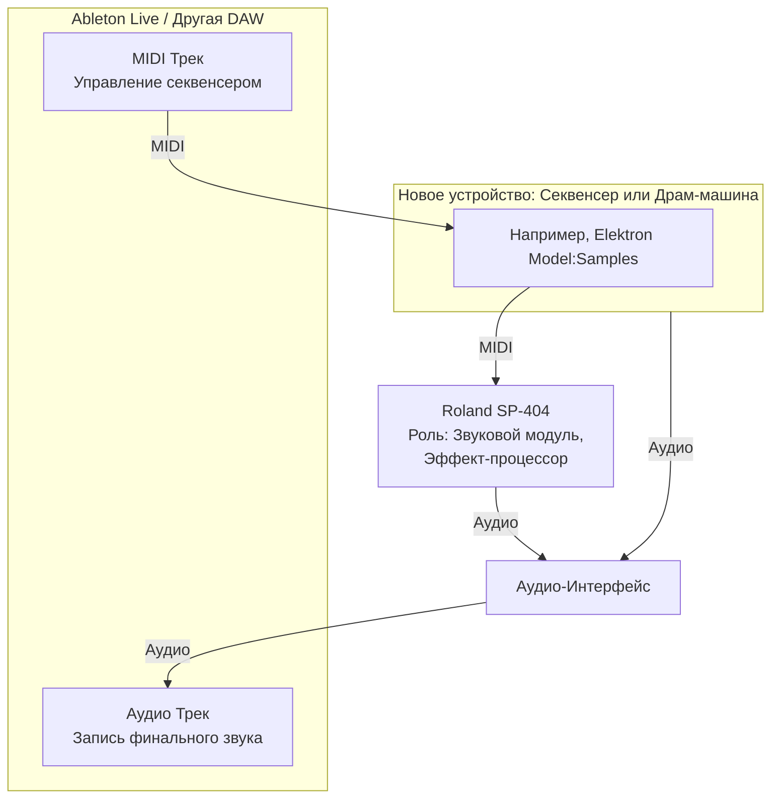

# octatrack vs sp404

## 👤 **Kirill**

octatrack vs sp404

---

## 🤖 **DeepSeek**

Of course. This is a classic debate in the sampler world. The Octatrack and the SP-404 are both legendary instruments, but they have fundamentally different philosophies.

Here’s a detailed breakdown to help you understand which one might be right for you.

### At a Glance: The Core Difference

*   **Ele

---

## 👤 **Kirill**

сравнение на русском

---

## 🤖 **DeepSeek**

Конечно! Это классическое сравнение в мире семплеров. Octatrack и SP-404 — это легендарные инструменты, но с совершенно разной философией.

Вот подробное сравнение на русском, чтобы понять, что подходит именно вам.

### Главное отличие: Философия

*   **Elektron Octatrack:** Это **продвинутая рабочая станция для перформанса и сложного сэмплирования**. Его логика построена на секвенсоре, треках и машинах (Flex, Static, Thru). Это инструмент для тотального контроля, построения сложных аранжировок и живых выступлений, где все синхронизировано и предсказуемо.
*   **Roland SP-404 (MKII):** Это **творческий спутник, цифровой скетчбук и лёгкая грув-машина**. Его логика построена на падах и банках. Это инструмент для быстрых набросков, лупов, применения эффектов в реальном времени (как DJ-микшер) и создания лоу-фай/хип-хоп атмосферы.

---

### Детальное сравнение

| Характеристика | Elektron Octatrack | Roland SP-404 (MKII) |
| :--- | :--- | :--- |
| **Подход и логика** | **Секвенсорная.** Всё строится на 8 треках, которые управляют семплами (треками). Точное программирование паттернов. | **Пэдовая / Performance.** Акцент на живую игру пэдами, запись в реальном времени, импровизацию. |
| **Секвенсор** | **Мощный, многодорожечный.** 8 треков (каждый может управлять семплом или внешним MIDI-устройством). Параметрический автоматизация, условные триггеры. | **Простой, однодорожечный.** Один трек на 16 шагов (в новой MKII он стал лучше, но всё ещё проще октатрековского). |
| **Работа с семплами** | **Недеструктивная.** Вы работаете с записанными семплами через «машины» (Flex, Static), которые меняют их воспроизведение (старт, длина, pitch) на лету, не меняя исходник. | **Деструктивная (часто).** Многие операции (нарезка, truncate) меняют исходный семпл. Процесс более прямой и быстрый, но требует аккуратности. |
| **Эффекты** | **2 стерео-слота на трек + мастер-эффекты.** Эффекты глубокие, ими можно тонко управлять через секвенсор и LFO. Интеграция в общую систему. | ****Легендарные фирменные эффекты.*** 27+ эффектов, знаменитые DJ-505, isolator, vinyl sim. Эффекты применяются в реальном времени на весь выход, это ключевая часть перформанса. |
| **Рабочий процесс** | **Студийный, методичный.** Требует изучения, подготовки семплов (в идеале — на компьютере). Мощный, но может быть медленным для спонтанного творчества. | **Быстрый, интуитивный.** Идеален для записи идеи «здесь и сейчас». Записал с линейного входа, нарезал, применил эффект — готово. |
| **Живой перформанс** | **Контроль и синхронизация.** Идеален для запуска заранее подготовленных паттернов, сцен, с плавными переходами и автоматизацией. | **Импровизация и драйв.** Фокус на живую игру пэдами, наложение эффектов "на ходу", создание шума и энергии. |
| **Цена** | **Высокая.** Один из самых дорогих семплеров на рынке. | **Доступная (особенно MKII).** Значительно дешевле Octatrack. Отличное соотношение цены и возможностей. |
| **Кривая обучения** | **Крутая.** Чтобы раскрыть его потенциал, нужно потратить много времени и прочитать мануал. | **Пологая.** Начать работать можно буквально через 10 минут. Глубину тоже нужно осваивать, но начальный порог входа низкий. |

---

### Плюсы и минусы

#### **Elektron Octatrack**
**Плюсы (+):**
+   Невероятно мощный секвенсор с автоматизацией.
+   Параметрическое сэмплирование (LFO, машины) даёт безграничные возможности для звукового дизайна.
+   Отличный контроль над внешним MIDI-оборудованием (можно быть мозгом всей setup).
+   Сцены и кроссфейдер для плавных и сложных переходов в live.
+   Стабильность и предсказуемость.

**Минусы (-):**
-   Высокая цена.
-   Сложность в освоении, может отпугнуть новичков.
-   Не самый быстрый workflow для простых задач.
-   Отсутствие встроенного микрофона и аудиоинтерфейса (как у SP-404).

#### **Roland SP-404 (MKII)**
**Плюсы (+):**
+   Быстрый, вдохновляющий workflow. Идеален для скетчей.
+   Портативный, работает от батареек.
+   Есть встроенный микрофон и аудиоинтерфейс (можно семплить с телефона/ноутбука без лишних проводов).
+   Знаменитые, «вкусные» эффекты, которые стали частью звучания целых жанров.
+   Отличное соотношение цены и качества.

**Минусы (-):**
-   Секвенсор слабее, не подходит для сложных аранжировок.
-   Деструктивное редактирование семплов может привести к ошибкам.
-   Меньше контроля и точности по сравнению с Octatrack.

---

### Кому что выбрать?

**Выбирайте Octatrack, если вы:**
*   **Технарь** и любите глубоко копать в функционале.
*   Хотите быть **мозгом своей студии или live-сета**, управляя другими устройствами.
*   Создаете **сложные, многослойные аранжировки** с автоматизацией.
*   Ваша цель — **тотальный контроль** над звуком и перформансом.
*   Работаете в жанрах типа techno, IDM, экспериментальной электроники.

**Выбирайте SP-404 (MKII), если вы:**
*   **Битмейкер** или **лупмейкер**, который ценит быстроту и vibe.
*   Ищете инструмент для **быстрых набросков**, идей и импровизации.
*   Хотите мощный и портативный **источник эффектов** для любого аудио.
*   Любите **лоу-фай, хип-хоп, boom-bap** эстетику.
*   Цените **живую, немного хаотичную энергию** в перформансе.
*   Ищете **более доступный по цене** и простой в освоении инструмент.

### Итог

Это не соперники, а **инструменты для разных задач**. Их даже можно отлично использовать вместе: SP-404 для быстрого создания идей и применения эффектов, а Octatrack — для финальной аранжировки, секвенирования и управления всей установкой.

*   **SP-404** — это **диджейский вертушечный подход** к семплеру.
*   **Octatrack** — это **армейский швейцарский нож** с секвенсором вместо лезвия.

---

## 👤 **Kirill**

более лучший секвенсер, альтернатива этим двум

---

## 🤖 **DeepSeek**

Отличный вопрос! Если вам нужен **«более лучший» секвенсер**, чем у Octatrack и SP-404, значит вы ищете устройство, которое сочетает мощное секвенирование с современным и удобным workflow.

И Octatrack, и SP-404 имеют свои недостатки в этом плане:
*   **Octatrack:** Мощный, но сложный, старый экран и меню, не самый интуитивный способ работы с мелодиями и нотной информацией.
*   **SP-404:** Секвенсер очень простой, больше подходит для лупов и одноразовых паттернов, а не для сложных аранжировок.

Вот список альтернатив, которые стоит рассмотреть, сгруппированных по философии.

---

### 1. Прямые конкуренты и эволюция концепции (Электроника + Сэмплинг)

#### **Akforce (AKAI Force)**
Это, пожалуй, **самый прямой и современный ответ на ваш запрос**.

*   **Почему это «лучший секвенсер»:** Он сочетает в себе мощь Ableton Live (клип-ориентированный секвенсор) с тактильным контролем аппаратного обеспечения. 8 дорожек с потрясающим секвенсером, который может работать как в пошаговом режиме, так и в реальном времени.
*   **Плюсы:**
    *   **Гибкость:** Работает с клипами (как SP-404, но мощнее) и Arrangement (как Octatrack, но современнее).
    *   **Мощный семплер:** Отличные возможности для нарезки, warping (как в Ableton), управления семплами.
    *   **Интеграция:** Встроенный аудио-интерфейс, может быть хабом для всей студии.
    *   **Экран:** Большой цветной сенсорный экран — это огромное преимущество перед Octatrack.
*   **Минусы:** Большой размер, высокая цена, требует погружения.
*   **Для кого:** Для тех, кто хочет максимальной мощности и современного workflow, не привязываясь к компьютеру.

#### **Synthstrom Deluge**
Легендарный автономный монстр с невероятно логичным и мощным секвенсером.

*   **Почему это «лучший секвенсер»:** Его секвенсер в виде сетки «пикселей» невероятно нагляден, быстр и гибок. Вы *видите* всю аранжировку. Он отлично справляется и с нотами, и с семплами.
*   **Плюсы:**
    *   **Полная автономность:** Работает от батареи, идеален для создания треков от начала и до конца.
    *   **Всё-в-одном:** Мощный семплер, синтез (FM, subtractive, wavetable), потрясающий секвенсер.
    *   **Очень интуитивный:** Кривая обучения гораздо положе, чем у Octatrack.
*   **Минусы:** Маленький монохромный экран (но он очень эффективно используется), высокая цена.
*   **Для кого:** Для создателей музыки, ценящих портативность и полный цикл производства на одном устройстве.

---

### 2. Секвенсеры-монстры для аранжировки и перформанса

#### **Squarp Instruments Pyramid**
Это не семплер, а **специализированный секвенсер премиум-класса**. Если вам нужна именно сила секвенирования — это топ.

*   **Почему это «лучший секвенсер»:** Его логика построена на уникальных режимах (пианино, аккорды, стохастический, рандом и т.д.), которые генерируют музыкальные идеи. Управляет по MIDI всем, что есть в вашей студии.
*   **Плюсы:**
    *   Невероятная глубина секвенирования и генеративная функциональность.
    *   Может быть мозгом любой setup, управляя десятками инструментов.
    *   Отлично работает с семплерами (например, вы можете запускать семплы на SP-404 или любом другом, управляя ими с Pyramind).
*   **Минусы:** Требует других инструментов (сам по себе не издает звуков, только управляет), своя уникальная логика, которую нужно освоить.
*   **Для кого:** Для композиторов и экспериментаторов, которые хотят максимального контроля над MIDI-аранжировками.

#### **Roland MC-707 / MC-101**
Это модернизированные наследники классических groovebox.

*   **Почему это «лучший секвенсер»:** Современный, понятный секвенсер с цветным экраном. Мощная движок ZEN-Core (тонны готовых звуков) и отличные возможности для семплинга (особенно на MC-707).
*   **Плюсы:**
    *   Отличный баланс между глубиной и доступностью.
    *   Мощные встроенные синтезы и эффекты.
    *   MC-707 имеет 8 дорожек для полноценной аранжировки.
*   **Минусы:** Workflow может показаться немного меню-ориентированным, как у Octatrack, но более современный.
*   **Для кого:** Для тех, кому нужна современная грувбокс с сильным секвенсером и большим количеством готовых звуков "из коробки".

---

### 3. Программные решения (самый мощный секвенсер)

Не стоит сбрасывать со счетов **DAW (Digital Audio Workstation)**. Если вам нужен *самый мощный* секвенсер в принципе, то это именно они.

*   **Ableton Live:** Его сессионный режим (Session View) — это идеальный гибрид клип-ориентированного подхода SP-404 и Arrangement View (дорожек как в Octatrack или любой другой DAW). Мощность и гибкость несравнимы ни с одним аппаратным секвенсером.
*   **Bitwig Studio:** Еще более гибкая и модульная, с невероятными возможностями для автоматизации и модуляции, похожими на то, что можно делать на Octatrack, но на другом уровне.
*   **Как использовать:** Вы можете использовать **SP-404 MKII** или **AKAI Force** в качестве **контроллера** для Ableton Live, объединяя тактильность аппаратуры с мощью софта.

### Итог: какая альтернатива лучше?

*   Для **мощи и современного подхода «всё в одном»**: **Akai Force** или **Synthstrom Deluge**.
*   Если нужен **специализированный мозг для управления всей аппаратурой**: **Squarp Pyramid**.
*   Для **классического, но современного грувбокс-подхода**: **Roland MC-707**.
*   Для **максимальной мощности без ограничений**: **Связка аппаратного семплера (например, SP-404) + DAW (Ableton Live)**.

Выбор зависит от того, хотите ли вы полностью автономное решение или готовы работать в связке с компьютером.

---

## 👤 **Kirill**

daw + аппаратный семплер с аудиоинтерфейсом

---

## 🤖 **DeepSeek**

Отличный выбор! Связка **DAW + аппаратный семплер с аудиоинтерфейсом** — это, возможно, самая мощная и гибкая студийная конфигурация. Она сочетает неограниченные возможности цифровой аудиостанции с тактильностью, уникальным саундом и скоростью работы аппаратного семплера.

Давайте разберем, как это работает, какие есть варианты и как все настроить.

### Концепция связки: Разделение обязанностей

*   **DAW (Ableton Live, Bitwig, Logic Pro и т.д.)**:
    *   **Мозг центра**: Многодорожечная запись, аранжировка, сведение, автоматизация, плагины, виртуальные инструменты.
    *   **Производство семплов**: Вы можете готовить семплы (нарезать, обрабатывать) прямо в DAW и затем загружать их в семплер.

*   **Аппаратный семплер (SP-404, MPC, Octatrack и т.д.)**:
    *   **Тактильный инструмент и эффект-процессор**: Быстрая игра пэдами, живое сэмплирование.
    *   **Источник уникального звука**: Аппаратные цифро-аналоговые преобразователи (ЦАП) и фирменные эффекты дают тот самый "теплый" или "лоу-фай" саунд, который сложно повторить плагинами.
    *   **Препроцессор**: Через него можно пропускать любые звуки (например, дорожку из DAW или живой инструмент) для обработки его эффектами в реальном времени.

---

### Как подключить: Основные схемы

Для работы вам понадобится аудиоинтерфейс с достаточным количеством входов и выходов.

#### Схема 1: Семплер как инструмент (последовательное подключение)

```
[Семплер] --> [Аудиоинтерфейс] --> [DAW (трек аудио)]
```
*   **Как работает**: Вы играете на семплере, а его выход подключаете к входу аудиоинтерфейса. В DAW вы создаете аудио-трек, который записывает этот сигнал.
*   **Плюсы**: Простота.
*   **Минусы**: Нельзя записывать чистый звук из DAW и звук с эффектами семплера одновременно.

#### Схема 2: Семплер как эффект-процессор (сквозное подключение / эффект-посыл)

Это самая мощная и популярная схема!

```
[DAW (Аудио-трек)] --> [Выход Аудиоинтерфейса] --> [Вход Семплера]
[Выход Семплера] --> [Вход Аудиоинтерфейса] --> [Новый аудио-трек в DAW]
```
*   **Как работает**:
    1.  Вы отправляете звук из DAW (например, ударные или вокал) на свободный выход вашего аудиоинтерфейса.
    2.  Этот выход физическим кабелем подключается ко входу семплера.
    3.  Вы обрабатываете этот звук эффектами на семплере (например, винтажным дилеем или компрессором SP-404).
    4.  Выход семплера подключаете к свободному входу аудиоинтерфейса.
    5.  В DAW вы создаете *новый* аудио-трек, который записывает этот уже обработанный сигнал.
*   **Плюсы**: Вы можете обрабатывать любые звуки из DAW аппаратными эффектами семплера и записывать результат. Это называется "re-amping" для эффектов.
*   **Минусы**: Требует больше кабелей и свободных входов/выходов на интерфейсе.

#### Схема 3: Гибридная (с использованием семплера по ситуации)

Вы используете семплер и как самостоятельный инструмент (Схема 1), и как эффект-процессор (Схема 2), переключая кабели по необходимости. Многие продюсеры работают именно так.

---

### Лучшие кандидаты на роль аппаратного семплера в связке с DAW

1.  **Roland SP-404 MKII (Фаворит для этой задачи)**
    *   **Почему**: Имеет **встроенный аудиоинтерфейс**, что упрощает подключение. Его главная сила — уникальные эффекты в реальном времени. Идеален по схеме 2 как процессор для дорожек из DAW. Прост в использовании.

2.  **AKAI MPC One / Live / X**
    *   **Почему**: Фактически это самостоятельная DAW в аппаратной форме. В связке с компьютерной DAW может работать как мощный семплер-синтезатор-секвенсер, управляемый по MIDI. Можно экспортивать семплы и проекты между устройствами.

3.  **Elektron Octatrack**
    *   **Почему**: Более сложный, но невероятно гибкий. Его можно настроить как мощный микшер и эффект-процессор для нескольких аудио-каналов одновременно с помощью машин `Thru` и `Flex`. Для тех, кто готов разбираться.

4.  **Isla Instruments S2400**
    *   **Почему**: Если вам важен легендарный "олдскульный" звук семплеров Akai S950/S1000. Это современная реинкарнация той классики. Отлично справляется с ролью источника уникального звука.

---

### Пример рабочего процесса на основе SP-404 MKII и Ableton Live

1.  **Подготовка**: SP-404 подключен к компьютеру по USB (режим аудиоинтерфейса). Его входы и выходы видны в Ableton Live.
2.  **Производство бита**: Вы создаете грув в Ableton.
3.  **Обработка эффектами**: Вы отправляете дорожку с ударными (`Ext. Out` в Ableton) на выход интерфейса, который идет на вход SP-404.
4.  **Запись результата**: На SP-404 вы применяете эффект `DJ FX Looper` или `Cassette Sim`, и его выход записывается на новый аудио-трек в Ableton.
5.  **Итог**: У вас есть оригинальная дорожка и ее обработанная, "оживленная" аппаратом версия. Вы можете их смикшировать.

### Итог

Связка **DAW + аппаратный семплер** — это профессиональный подход, который дает вам:
*   **Бесконечные возможности** DAW.
*   **Тактильность и скорость** работы с семплами.
*   **Уникальный саунд** аппаратных процессоров.
*   **Гибкость** использования семплера и как инструмента, и как эффекта.

**Roland SP-404 MKII** является, пожалуй, идеальным выбором для этой роли благодаря своему ценнику, простоте и встроенному аудиоинтерфейсу.

---

## 👤 **Kirill**

бюджетная альтернатива sp404 mk2

---

## 🤖 **DeepSeek**

Отличный вопрос! **Roland SP-404 MKII** — это король в своей нише, но его цена действительно кусается. К счастью, есть несколько достойных бюджетных альтернатив, которые ловят ту же волну лоу-фай, импровизации и быстрого сэмплинга.

Вот список вариантов, от самых очевидных до более креативных.

### 1. Прямые конкуренты: Аппаратные семплеры

#### **Korg Volca Sample 2**
Самая бюджетная и веселая альтернатива.
*   **Цена:** Значительно ниже SP-404.
*   **Плюсы:**
    *   Очень компактный и портативный, работает от батареек.
    *   Аналоговый фильтр, который здорово "утепляет" звук.
    *   Простой в освоении, сразу понятно, как запускать лупы и применять эффекты.
    *   Есть встроенный секвенсер для создания простых паттернов.
*   **Минусы:**
    *   **Нельзя записывать семплы напрямую!** Семплы нужно загружать через специальное приложение/программу на компьютере. Это главное ограничение.
    *   Очень мало памяти.
    *   Монофонический выход (нет стерео).
*   **Для кого:** Для тех, кто хочет потратить минимум денег и готов мириться с загрузкой семплов через компьютер. Отличная "игрушка" для быстрых набросков.

#### **Teenage Engineering PO-33 K.O!**
Карманный семплер-игрушка с невероятным потенциалом.
*   **Цена:** Самый дешевый вариант в списке.
*   **Плюсы:**
    *   Невероятно портативный.
    *   Позволяет и записывать (есть встроенный микрофон и линейный вход), и нарезать семплы, и применять эффекты.
    *   Уникальный лоу-фай звук из-за битрейта.
    *   Невероятно вдохновляющий и затягивающий workflow.
*   **Минусы:**
    *   Очень хрупкий корпус.
    *   Крошечные кнопки, не предназначен для активного live-использования.
    *   Очень ограниченное время сэмплирования (около 40 секунд в сумме).
*   **Для кого:** Для путешественников, любителей лоу-фай эстетики и тех, кто ищет максимально дешевый способ начать семплить.

---

### 2. Умное ПО + Контроллер (Самая мощная альтернатива)

Этот вариант не является *аппаратным* семплером, но он **дает функционал, превосходящий SP-404, за те же или даже меньшие деньги**.

*   **Связка: Недорогой MIDI-контроллер (например, Novation Launchpad Mini/MK2, AKAI MPD218) + Специализированное ПО.**
*   **Цена:** Стоимость контроллера (можно найти б/у) + стоимость ПО (часто есть бесплатные аналоги).

**Варианты ПО:**

1.  **Koala Sampler (для iOS/Android):** Это **главный убийца SP-404** в бюджетном сегменте. Приложение стоит копейки, но оно невероятно мощное. Поддерживает нарезку семплов, секвенирование, кучу эффектов (в том числе и фирменные, как на SP), запись с микрофона. Купите недорогой контроллер с пэдами и подключите его к планшету/телефону — вы получите 90% функционала SP-404 за в разы меньшие деньги.
2.  **Ableton Live Lite (часто идет в комплекте с контроллерами):** Используйте сессионный режим (Session View) для запуска аудио-клипов. Это очень похоже на логику работы с банками на SP-404, но с безграничными возможностями.
3.  **Bitwig Studio 8-Track:** Имеет демо-версию и недорогие стартовые лицензии. Его модульная система и клип-ориентированный подход также отлично подходят для такой задачи.

**Плюсы подхода:**
*   Максимальная мощность и гибкость.
*   Легко обновлять и расширять.
*   Можно использовать профессиональные плагины и инструменты.

**Минусы:**
*   Требует ноутбук/планшет.
*   Нет того ощущения "аппаратного standalone-устройства".

---

### 3. Б/У рынок (Винтажные и классические варианты)

Здесь нужно быть осторожным с состоянием техники, но можно найти жемчужины.

*   **Roland SP-404A / SP-404SX:** Предыдущие поколения легенды. У них нет такого красивого экрана и некоторых новых функций MKII (как секвенсор), но **главное — фирменные эффекты — на месте!** Если вам нужен именно уникальный звук эффектов для обработки, это отличный вариант. Цены на б/у рынке стали адекватнее.
*   **AKAI MPC 500 / 1000:** Старые MPC — это классика битмейкинга. MPC 1000 с ОС JJOS — это вообще монстр. Они больше ориентированы на секвенирование, но как семплеры справляются на ура.
*   **BOSS RC-505 (MK1):** Это лупер, а не семплер, но его логика работы с петлями и мощные эффекты могут дать схожий опыт live-импровизации. На б/у рынке можно найти по хорошей цене.

### Сравнение в таблице

| Устройство | Плюсы | Минусы | Бюджет |
| :--- | :--- | :--- | :--- |
| **Korg Volca Sample 2** | Портируемость, цена, аналоговый фильтр | Нельзя записывать на лету, нет стерео | Низкий |
| **PO-33 K.O!** | Супер-портативный, вдохновляющий, свой саунд | Хрупкий, мало памяти, малые кнопки | Очень низкий |
| **Koala + Контроллер** | Максимальная функциональность за деньги | Требует планшет/телефон, не standalone | Средний |
| **SP-404SX (б/у)** | Настоящие эффекты SP, standalone | Старая ОС, нет новых фич MKII | Средний |

### Итог: Что выбрать?

*   Если вам **нужен чисто аппаратный опыт и портативность** и вы готовы возиться с загрузкой семплов -> **Korg Volca Sample 2**.
*   Если вы хотите **максимум функций за минимальные деньги** и не против использовать планшет -> **Связка Koala Sampler + недорогой MIDI-контроллер**. Это, пожалуй, **самая умная и выгодная покупка**.
*   Если вы **фанат именно того самого звука SP** и ищете standalone -> ищите **б/у Roland SP-404SX/A**.
*   Если вы просто хотите поэкспериментировать -> **PO-33 K.O!**.

---

## 👤 **Kirill**

какой апгрейд может быть для связки daw+sp404, чтобы улучшить сиквенсер 404-го

---

## 🤖 **DeepSeek**

Отличный вопрос! Вы правильно подметили главную слабость SP-404 в этой связке — его секвенсер, который больше подходит для лупов и одноразовых паттернов, чем для сложных аранжировок.

Есть несколько путей для апгрейда, которые **не заменят, а усилят** вашу текущую связку, взяв на себя слабые стороны SP-404.

### Стратегия 1: Добавить специализированный секвенсер ("Мозг")

Это самый кардинальный и мощный апгрейд. Вы подключаете отдельное устройство, которое будет заниматься только сложным секвенированием, а SP-404 будет выполнять роль звукового модуля и эффект-процессора.

**Как это работает:**
*   **Секвенсер** по MIDI управляет нотами и параметрами **SP-404**.
*   **Аудио** с выхода SP-404 идет обратно в аудиоинтерфейс и записывается в **DAW**.

**Кандидаты:**

1.  **Elektron Model:Cycles / Model:Samples**
    *   **Почему:** Доступные, но невероятно мощные секвенсеры с параметрической автоматизацией и условиями (conditional triggers). Они могут оживить любой статичный паттерн на SP-404. Model:Samples — идеальный партнер, так как тоже работает с семплами.
    *   **Что дает:** Сумасшедшая грув-ориентированная автоматизация, которую не может дать ни SP-404, ни большинство DAW в такой наглядной форме.

2.  **Synthstrom Deluge**
    *   **Почему:** Это один из лучших standalone-секвенсеров на рынке. Его сетка невероятно наглядна и мощна. Он может быть мозгом всей вашей setup, управляя и SP-404, и другими инструментами.
    *   **Что дает:** Полноценное, мощное секвенирование с визуализацией всей аранжировки, куда более продвинутое, чем у SP-404.

3.  **Squarp Pyramid или Polyend Play**
    *   **Почему:** Это специализированные секвенсеры-монстры. Pyramid славится генеративными функциями, а Play — своим визуальным и игровым подходом к создаению паттернов.
    *   **Что дает:** Максимально глубокий и нестандартный контроль над секвенированием ваших семплов.

---

### Стратегия 2: Добавить драм-машину или грувбокс

Этот подход добавляет не только секвенсер, но и новые звуки, делая связку более универсальной.

**Кандидаты:**

1.  **Roland TR-6S / TR-8S**
    *   **Почему:** Прямой потомок классических драм-машин Roland. Имеет отличный, интуитивный секвенсер с индивидуальными выходами для каждого звука. Вы можете секвенировать на нем драм-партии, а семплы и мелодии оставить на SP-404.
    *   **Что дает:** Фирменный звук драм-машин Roland и качественный секвенсер для ударных.

2.  **Novation Circuit Tracks / Rhythm**
    *   **Почему:** Невероятно доступный и удобный грувбокс. Circuit Tracks имеет 2 MIDI-трека для управления внешними устройствами (как ваш SP-404) и 4 трека для драм-секвенсора. Идеальный хаб для джем-сета.
    *   **Что дает:** Простой, но эффективный секвенсер для мелодий и барабанов, который может управлять SP-404.

---

### Стратегия 3: Программное решение (Max for Live, Плагины)

Зачем покупать железо, если можно улучшить софт? Ваша DAW (особенно если это Ableton Live) — уже мощнейший секвенсер.

**Решения:**

1.  **Использовать Ableton Live как секвенсер для SP-404**
    *   **Как:** Отправляйте **MIDI-ноты** из Ableton Live на SP-404. Для этого:
        *   Подключите SP-404 к компьютеру по USB (он передает и аудио, и MIDI).
        *   В Ableton создайте **MIDI-трек**.
        *   Выход этого трека назначьте на канал SP-404.
        *   На этом MIDI-треке вы можете рисовать сложнейшие паттерны, использовать пиано-ролл, арпеджиатор — всю мощь DAW-секвенсера.
    *   **Что дает:** Полноценное использование продвинутого секвенсора Ableton Live для управления семплами на SP-404.

2.  **Плагины-арпеджиаторы и секвенсеры (Cthulhu, Thesys, HY-RPE2)**
    *   **Как:** Эти плагины генерируют сложные MIDI-последовательности (арпеджио, аккорды, риффы). Вы пишете в них простой аккорд, а на выходе получаете сложный паттерн, который отправляется на SP-404.
    *   **Что дает:** Легкость создания сложных и интересных мелодий для управления семплами на SP.

3.  **Max for Live устройства**
    *   **Как:** В Ableton Live есть бесчисленное количество M4L-девайсов, которые являются уникальными секвенсерами (например, **Probability Pack**, **Sequential Switch**, **Bytebeats**). Они могут случайным образом, или по сложным алгоритмам генерировать MIDI, управляя вашим SP-404.
    *   **Что дает:** Бесконечные возможности для экспериментального и генеративного секвенирования.

### Схема подключения (Стратегия 1 или 2)

Вот как будет выглядеть ваша усложненная, но более мощная setup:



### Итог: что выбрать?

*   **Для максимальной мощности и интеграции с DAW:** Используйте **Ableton Live как MIDI-секвенсер** для SP-404. Это самый прямой и дешевый (если у вас уже есть Live) апгрейд.
*   **Для тактильности и standalone-работы:** Добавьте **Elektron Model:Samples** или **Novation Circuit Tracks**. Это даст вам отличный аппаратный секвенсер, сохранив мобильность связки.
*   **Для экспериментального подхода:** Изучите **Max for Live** или **плагины-генераторы** MIDI.

Таким образом, вы оставляете сильные стороны SP-404 (эффекты, работый процесс, саунд), замещая его слабое место — секвенсер — на более мощное и специализированное решение.

---

