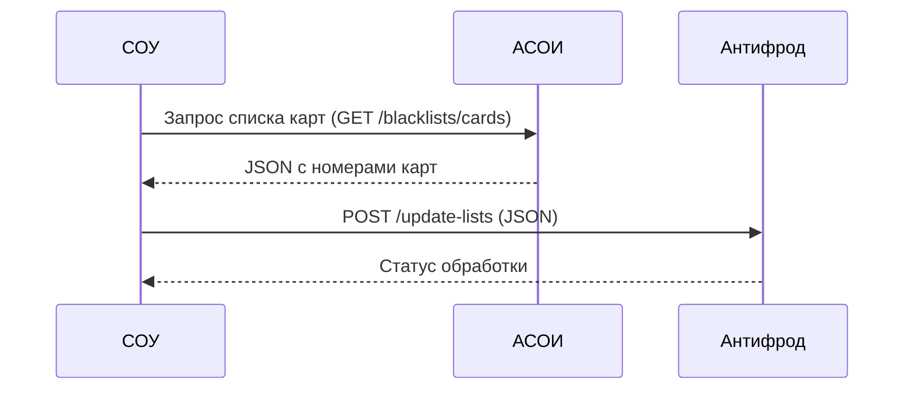
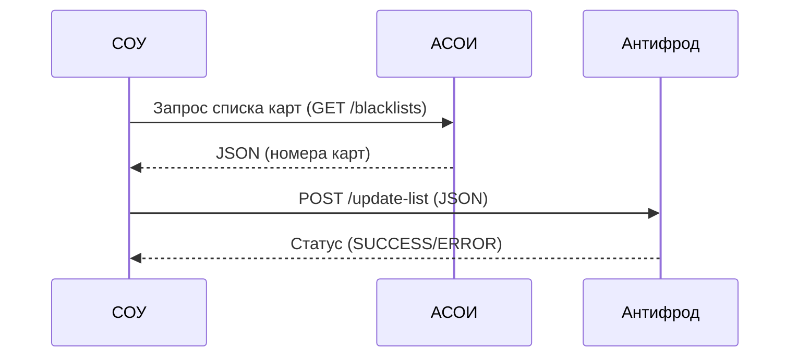

# Автоматизация загрузки черных списков антифрод

## 👤 **Kirill**

Как бизнес аналитик опиши обозначенный дизайн решения из переписки. 
Сформулируй бизнес-требования заказчика.
 
 
Действующие лица
ГГ, АБ -  представители заказчика (Банк)
АК, ГФ - представители вендора (Антифрод система)
 
 
Описание задачи
Добрый день! Возникла необходимость автоматически загружать черные списки АСОИ во фродовые списки по настраиваемому расписанию посредством API АСОИ.
Всю информацию и примеры запросов, полученные банком, прикладываю в заявку. Из всего пула данных мы хотели бы выбирать номера карт, общий механизм тоже подойдёт.
Просим оценить стоимость и сроки реализации.
 
 
 
Перписка по задаче
 
21-07-2025 #17 ГГ	 Добрый день! Коллеги, готовы приступать к реализации. Ждём от вас инструкций.	
28-05-2025 #16	ГГ	 Добрый день! Нам нужно получать из сторонней системы номера карт и складывать их в черный
список, т.е реализовать функицонал из #2, документ с описанием в #7.
 
 
27-05-2025 #15	АК	 Коллеги, давайте еще раз конкретизируем задачу, что требуется загружать во фрод
Все таки нужно поддержать конкретные API асои и загрузку всех данных полученных от них ?
 
или же нужно просто в белый список складывать номера карт полученные по json (о чем отписали в #2) ?  т.е. приложенное API это же апи именно с асои, но если вы говорите что у вас уже есть 
интеграция, и нам не нужно по нему подключаться, то зачем нам это апи ?
 
 
21-04-2025 #14	ГГ	 #13 Добрый день! Задача 0001 находится на паузе, сейчас в приоритете автозагрузка списков.	
21-04-2025 #13	АК	 Добрый день
ПРедлагаю эту задачу включить в ТУ, которое будет разрабатывать в рамках 0001
 
Отпишите подробные требования в ту задачу, что бы их добавить. А эту предлагаю закрыть
 
 
21-04-2025 #12	ГГ	 Добрый день! Подскажите, пожалуйста, условия доработки и пришлите ТУ.	
21-01-2025 #11	ГФ	 В данный момент работать не будет, тк нужна доработка в ваш профиль.
Вместо <URL> будет путь до веб сервиса, который мы настроим. Название же нам пока неизвестно, к примеру можно сделать "list-managing", можно задать любой путь в json transport.
 
>Также потребуется добавление записей в Настройку параметров транзакции?
Они будут добавлены при обновление автоматически. А вот транспорт json и мапинг нужно будет создавать.
 
 
21-01-2025 #10	ГГ	 URL в документации на что нужно заменить?	
21-01-2025 #9	ГГ	 #8 вместо ""	
21-01-2025 #8	ГГ	 #7 Подскажите, в документации вместо что должно быть?
Также потребуется добавление записей в Настройку параметров транзакции?
 
 
21-01-2025 #7	ГФ	 Добрый день! 
Есть документ с описанием, прикладываю.
 
Risk objects exchange.pdf (18.9 k)
 
 
21-01-2025 #6	ГГ	 Добрый день! Коллеги запрашивает доп информацию:
"Нужно детальное описание сервиса, описание входящих и исходящий атрибутов, допустимой длины и т.д"
 
 
17-01-2025 #5	АБ	 Коллеги, а как нам инициировать указанную в №2 доработку?
и сколько это будет нам стоить?
 
Обсуждаем с коллегами, насколько указанный вариант нам подойдет.
 
 
17-01-2025 #4	ГФ	 #3 - Да, все верно. Параметр signCorrection определяет добавить или удалить значение.
При повторном добавлении ошибки не будет.
 
 
17-01-2025 #3	ГГ	 #2 ГФ, несколько вопросов по предоставленному json. Как я понимаю, signCorrection определяет
добавить/удалить значение в списке ? Если фрод получит значение, которое уже содержится в списке, то ответит ошибкой и запись не будет добавлена (по аналогии с загрузкой из txt)?
 
 
17-01-2025 #2	ГФ	 Добрый день!
Есть готовый функционал, который можно через небольшую доработку перенести в Ваш профиль.
 
Описание канала:
Чтобы добавить сущность в фродовый список нужно отправить json, где listSid нужно использовать ID корректируемого списка, например:
{
    "personCorrection":"admin",
    "msgType":"riskObjectExchange",
    "entityValue":"806",
    "listSid":"1",
    "dateCorrection":"16102019 17:46:53",
    "signCorrection":"+",
    "listType":"2"
}
 
Чтобы добавить сущность в черный или белый список нужно отправить json(jsonlistType=1 - белый список, listType=0 - черный список), например:
{
    "personCorrection":"admin",
    "msgType":"riskObjectExchange",
    "entityValue":"1111222233334448",
    "reasonCorrection":"test1",
    "dateFrom":"17102019 16:30:00",
    "dateTo":"19102019 07:15:00",
    "rulesExcList":"",
    "signCorrection":"+",
    "attribute":"cardNumber",
    "listType":"1"
}
 
 
Такое решение подойдет?
 
 
17-01-2025 #1	ГГ	 Добрый день! Наша банковская система СОУ (сервер оплаты услуг) уже интегрирована с АСОИ, поэтому 
рассматриваем вариант получения черных списков из этой системы по API (прикладываю.)
 
Во фроде есть сервис fraudListMoidfy, подскажите, он может быть вызван сторонней системой для добавления/удаления значений во фродовом списке?
 
api.yaml (10.0 k)

---

## 🤖 **DeepSeek**

### **Описание дизайна решения**  

#### **1. Контекст и цель**  
Банк (заказчик) хочет автоматизировать загрузку данных из сторонней системы (АСОИ) во фрод-мониторинг (антифрод-систему) по API.  
Требуется настроить выгрузку номеров карт из АСОИ и их добавление в черные/белые списки антифрод-системы по расписанию.  

#### **2. Текущее состояние**  
- Банк уже имеет интеграцию с АСОИ через СОУ (сервер оплаты услуг).  
- Антифрод-система поддерживает API для модификации списков (`fraudListModify`).  
- Есть готовый JSON-формат для добавления/удаления записей в списки.  

#### **3. Предлагаемое решение**  
1. **Интеграция API АСОИ → Антифрод**  
   - Настройка автоматического вызова API АСОИ для получения списка номеров карт.  
   - Преобразование данных в JSON-формат, совместимый с API антифрод-системы.  
   - Передача данных в антифрод через `riskObjectExchange` (добавление/удаление из списков).  

2. **Расписание и триггеры**  
   - Настройка периодической выгрузки (например, раз в день/час).  
   - Возможность ручного запуска при необходимости.  

3. **Обработка данных**  
   - Поддержка операций:  
     - Добавление (`signCorrection = "+"`)  
     - Удаление (`signCorrection = "-"`)  
   - Валидация дубликатов (если номер уже в списке, ошибка не возникает).  

4. **Технические доработки**  
   - Создание JSON-транспорта и маппинга полей.  
   - Настройка параметров транзакций (автоматическое обновление).  

---

### **Бизнес-требования заказчика**  

#### **1. Функциональные требования**  
- **Автоматическая загрузка данных**  
  - Получение номеров карт из АСОИ через API по расписанию.  
  - Поддержка выбора только номеров карт из общего пула данных.  
- **Работа со списками**  
  - Добавление/удаление записей в черные (`listType = 0`) и белые (`listType = 1`) списки.  
  - Обработка дубликатов без ошибок.  
- **Гибкость настройки**  
  - Возможность настройки частоты выгрузки (ежедневно, еженедельно и т. д.).  
  - Поддержка ручного запуска процесса.  

#### **2. Нефункциональные требования**  
- **Безопасность**  
  - Авторизация и аутентификация при вызове API.  
- **Надежность**  
  - Логирование операций для аудита.  
  - Обработка ошибок (например, при недоступности АСОИ).  
- **Производительность**  
  - Минимальное время обработки запросов (задержка не более N секунд).  

#### **3. Ограничения**  
- Использование существующего API антифрод-системы (`fraudListModify`, `riskObjectExchange`).  
- Интеграция без изменения текущей схемы взаимодействия с АСОИ.  

---

### **Вывод**  
Заказчику требуется **автоматизированный механизм передачи номеров карт из АСОИ в антифрод-систему** с возможностью гибкой настройки расписания и обработки данных. Решение должно использовать текущие API и минимизировать доработки.  

**Следующие шаги:**  
- Уточнение формата данных от АСОИ.  
- Согласование JSON-маппинга.  
- Оценка сроков и стоимости реализации.

---

## 👤 **Kirill**

антифроду нужно ходить в асои или в соу банка?

---

## 🤖 **DeepSeek**

Из переписки следует, что **антифроду нужно ходить в СОУ банка**, а не напрямую в АСОИ.  

### **Обоснование**  
1. **Текущая интеграция**  
   - В сообщении **#1** ГГ уточняет:  
     > *"Наша банковская система **СОУ (сервер оплаты услуг) уже интегрирована с АСОИ**, поэтому рассматриваем вариант получения черных списков из этой системы по API."*  
   - Это означает, что СОУ выступает **промежуточным звеном**, которое уже умеет запрашивать данные из АСОИ.  

2. **Запрос данных через СОУ**  
   - В сообщении **#16** ГГ подтверждает:  
     > *"Нам нужно получать из **сторонней системы** (т.е. СОУ) номера карт и складывать их в черный список."*  
   - Антифрод должен обращаться к **API СОУ**, а не к АСОИ напрямую, так как:  
     - СОУ уже имеет доступ к АСОИ и знает, как форматировать запросы.  
     - Банк не хочет создавать новую интеграцию "антифрод → АСОИ", чтобы не дублировать логику.  

3. **Техническая реализация**  
   - В сообщении **#2** ГФ предлагает готовый JSON-формат для добавления данных в антифрод, но **не упоминает интеграцию с АСОИ**.  
   - В сообщении **#11** ГФ уточняет, что нужно настроить **веб-сервис в СОУ** (например, `list-managing`), который будет передавать данные в антифрод.  

### **Вывод**  
**Антифрод должен ходить в СОУ банка**, который, в свою очередь, берет данные из АСОИ.  

#### **Почему не напрямую в АСОИ?**  
- У банка уже есть работающая интеграция **СОУ ↔ АСОИ**.  
- Антифрод-системе не нужно знать детали API АСОИ — достаточно получить готовые номера карт от СОУ.  
- Такой подход минимизирует доработки и риски.  

**Рекомендация:**  
Уточнить у заказчика:  
- Какой endpoint в СОУ будет предоставлять данные (например, `/asoiblacklist/cards`).  
- Нужна ли дополнительная фильтрация в СОУ (например, только активные карты).  
- Требуется ли верификация данных перед отправкой в антифрод.

---

## 👤 **Kirill**

т.е. для вендора задача заключается в том чтобы через небольшую доработку перенести готовый функционал в котором есть возможность загружать сущности во фродовый список или добавлять сущности в черный или белый список?

---

## 🤖 **DeepSeek**

**Да, именно так.**  

### **Суть задачи для вендора (разработчика антифрода)**  
1. **Готовый функционал уже существует**  
   - В сообщении **#2** ГФ указывает, что есть работающий механизм добавления/удаления сущностей в списки через JSON-API:  
     ```json
     {
         "personCorrection": "admin",
         "msgType": "riskObjectExchange",
         "entityValue": "1111222233334448",
         "listSid": "1",
         "signCorrection": "+",
         "listType": "0"  // 0 — чёрный список, 1 — белый
     }
     ```  
   - **Задача вендора** — не разрабатывать с нуля, а **адаптировать этот функционал под профиль банка**.  

2. **Необходимые доработки**  
   - **Настройка транспорта JSON**:  
     - Создание endpoint’а в антифроде (например, `/list-managing`), куда СОУ будет отправлять данные.  
     - Маппинг полей из формата СОУ в формат антифрода (если структуры отличаются).  
   - **Интеграция с СОУ банка**:  
     - Подтверждение авторизации (например, через API-ключ или IP-фильтрацию).  
     - Обработка ошибок (если СОУ пришлёт некорректные данные).  
   - **Поддержка расписания**:  
     - Антифрод должен уметь принимать данные **по расписанию** (например, раз в день) или **по событию** (триггер от СОУ).  

3. **Что не требуется делать вендору**  
   - Писать интеграцию **антифрод → АСОИ** (это зона ответственности СОУ).  
   - Менять логику работы чёрных/белых списков (только донастроить приём данных).  

---

### **Краткий вывод**  
**Да, задача вендора — перенести готовый функционал работы со списками в профиль банка с минимальными доработками:**  
1. Настроить приём JSON от СОУ.  
2. Обеспечить добавление/удаление сущностей (номеров карт) в указанные списки.  
3. Поддержать автоматизацию (по расписанию или событию).  

**Финансовая оценка и сроки** должны учитывать только эти пункты, а не полную интеграцию с АСОИ.

---

## 👤 **Kirill**

что значит создать эндпоинт в антифрод?

---

## 🤖 **DeepSeek**

### **Что значит "создать эндпоинт в антифроде"?**  

Это означает **настроить в антифрод-системе специальный URL (API-точку доступа)**, куда внешняя система (например, СОУ банка) сможет отправлять данные для добавления/удаления записей в чёрные или белые списки.  

---

### **Подробное объяснение**  

#### **1. Что такое эндпоинт (endpoint)?**  
Это **URL-адрес API**, который принимает HTTP-запросы (например, `POST` или `PUT`) и выполняет определённое действие.  
Пример:  
```
https://antifraud-api.example.com/list-managing
```  
- Сюда СОУ банка будет отправлять JSON с номерами карт.  
- Антифрод-система обработает запрос и обновит списки.  

---

#### **2. Что именно нужно сделать в антифроде?**  
Из переписки (**#2, #11**) следует, что необходимо:  

1. **Создать новый веб-сервис** (например, `/list-managing`), который:  
   - Принимает JSON в формате:  
     ```json
     {
         "entityValue": "1111222233334448",
         "listType": "0",
         "signCorrection": "+"
     }
     ```  
   - Проверяет авторизацию (например, по API-ключу или IP-адресу СОУ).  
   - Добавляет или удаляет сущность (номер карты) в указанный список (`listType=0` — чёрный, `1` — белый).  

2. **Настроить транспорт и маппинг** (если данные от СОУ приходят в другом формате).  

3. **Добавить логирование и обработку ошибок** (например, если СОУ отправит некорректный JSON).  

---

#### **3. Почему это требуется?**  
- Сейчас антифрод **уже умеет** работать со списками через `riskObjectExchange` (как в **#2**), но:  
  - Нужно "перенести функционал в профиль банка" (**#2, #11**), то есть **настроить отдельный endpoint**, доступный именно для СОУ.  
  - Возможно, требуется изменить URL или параметры авторизации под инфраструктуру банка.  

---

#### **4. Пример реализации**  
Допустим, в антифроде уже есть внутренний API для списков. Тогда:  
1. **Разработчик антифрода:**  
   - Создаёт новый endpoint, например:  
     ```  
     POST /api/v1/bank/sou/update-lists  
     ```  
   - Настраивает его на приём JSON от СОУ и вызов внутреннего метода `fraudListModify`.  

2. **Банк (СОУ):**  
   - Настраивает вызов этого эндпоинта по расписанию (например, раз в день).  

---

### **Вывод**  
**"Создать эндпоинт в антифроде" =**  
- Настроить **новый URL-адрес** в антифрод-системе, который:  
  - Принимает данные от СОУ в JSON-формате.  
  - Обновляет чёрные/белые списки через внутренний механизм (`riskObjectExchange`).  
  - Возвращает статус (успех/ошибка).  

Это **не разработка с нуля**, а адаптация существующего функционала под интеграцию с СОУ банка.

---

## 👤 **Kirill**

опиши в виде пошагово процесс начиная с запроса СОУ в АСОИ списка

---

## 🤖 **DeepSeek**

### **Пошаговый процесс автоматической загрузки списков из АСОИ в антифрод-систему**  

#### **1. Инициирование запроса (СОУ → АСОИ)**  
**Действующее лицо:** Сервер оплаты услуг (СОУ) банка  
**Шаги:**  
1. **По расписанию** (например, раз в день) или **по событию** СОУ отправляет запрос в АСОИ для получения актуального списка номеров карт.  
   - Используется API АСОИ (формат запроса уточняется у заказчика).  
   - Пример запроса:  
     ```http
     GET /asoiapi/blacklists/cards?dateFrom=20250101
     ```  
2. АСОИ возвращает ответ в формате JSON/XML (например):  
   ```json
   {
       "cards": ["1111222233334444", "5555666677778888"],
       "status": "OK"
   }
   ```  

---

#### **2. Обработка данных в СОУ**  
**Действующее лицо:** СОУ банка  
**Шаги:**  
1. СОУ фильтрует полученные данные (если требуется):  
   - Выбирает только номера карт (игнорируя другие поля).  
   - Проверяет валидность (например, отсеивает неактивные карты).  
2. Формирует JSON для антифрода в требуемом формате (на основе **#2**):  
   ```json
   {
       "msgType": "riskObjectExchange",
       "entityValue": "1111222233334444",
       "listType": "0",  // 0 — чёрный список
       "signCorrection": "+",  // "+" — добавить
       "personCorrection": "SOU_AUTO_IMPORT"
   }
   ```  

---

#### **3. Отправка данных в антифрод (СОУ → Антифрод)**  
**Действующее лицо:** СОУ → Антифрод-система  
**Шаги:**  
1. СОУ вызывает **эндпоинт антифрода**, созданный вендором (например):  
   ```http
   POST /antifraud/api/lists/update
   Headers: 
       Authorization: Bearer <API_KEY>
       Content-Type: application/json
   Body: 
       {JSON из шага 2}
   ```  
2. Антифрод-система:  
   - Проверяет авторизацию (API-ключ/IP).  
   - Валидирует JSON (формат, обязательные поля).  
   - Добавляет номер карты в указанный список (`listType=0` — чёрный, `1` — белый).  

---

#### **4. Подтверждение выполнения (Антифрод → СОУ)**  
**Действующее лицо:** Антифрод-система  
**Шаги:**  
1. Антифрод возвращает статус обработки:  
   - Успех:  
     ```json
     { "status": "OK", "message": "Card added to blacklist" }
     ```  
   - Ошибка (например, дубликат):  
     ```json
     { "status": "ERROR", "message": "Card already exists" }
     ```  
2. СОУ логирует результат для аудита.  

---

#### **5. Логирование и мониторинг**  
**Действующее лицо:** Антифрод + СОУ  
**Шаги:**  
1. Антифрод фиксирует все операции в логах:  
   - Кто добавил запись (`personCorrection`).  
   - Время операции (`dateCorrection`).  
2. СОУ сохраняет историю вызовов API АСОИ и антифрода.  

---

### **Схема процесса**  


### **Ключевые требования к вендору**  
1. **Настроить эндпоинт** `/update-lists` в антифроде для приёма JSON от СОУ.  
2. **Обеспечить авторизацию** (API-ключ, IP-фильтрация).  
3. **Поддержать формат** из **#2** (`riskObjectExchange`).  
4. **Добавить логирование** операций.  

Этот процесс минимизирует ручные действия и обеспечит автоматическое обновление списков.

---

## 👤 **Kirill**

Проверь полноту требований, допиши чего не хватает и подкорректируй как опытный бизнес-аналитик

---

## 🤖 **DeepSeek**

### **Анализ и доработка бизнес-требований (БТ 0023 0)**  

#### **1. Проверка полноты требований**  
Текущий документ содержит четкое описание задачи, функциональных требований и процесса взаимодействия, но требует дополнений в следующих разделах:  
- **Нефункциональные требования** (безопасность, производительность, логирование).  
- **Детализация обработки ошибок** (алгоритмы для дублей, некорректных данных).  
- **Формат ответов от антифрода** (примеры JSON для успеха/ошибки).  
- **Предусловия и постусловия** (например, наличие тестового контура).  

---

### **Доработанные требования**  

#### **2. Дополнения к функциональным требованиям**  
**2.1. Формат ответа от антифрода**  
Добавить примеры ответов API:  
- **Успех:**  
  ```json
  {
      "status": "SUCCESS",
      "message": "Карта 1111222233334444 добавлена в чёрный список",
      "timestamp": "17102019 17:46:53",
      "listSid": "1"
  }
  ```  
- **Ошибка (дубликат):**  
  ```json
  {
      "status": "ERROR",
      "errorCode": "DUPLICATE_ENTITY",
      "message": "Карта уже существует в списке",
      "timestamp": "17102019 17:46:53"
  }
  ```  

**2.2. Обработка исключений**  
- **Дубликаты:** Пропускать без ошибок (но логировать в системе).  
- **Некорректные данные:** Возвращать `HTTP 400` с описанием ошибки (например, `"INVALID_FIELD: entityValue"`).  
- **Сетевые ошибки:** Ретри (3 попытки с интервалом 5 сек), затем пауза до следующего расписания.  

#### **3. Нефункциональные требования**  
**3.1. Безопасность:**  
- Авторизация через `API-Key` + `IP-фильтрация` (список доверенных IP СОУ).  
- Шифрование данных (HTTPS/TLS 1.2+).  

**3.2. Производительность:**  
- Время обработки запроса ≤ 500 мс.  
- Поддержка нагрузки до 1000 запросов/мин.  

**3.3. Логирование:**  
- Фиксация всех операций с полями:  
  - `timestamp`, `entityValue`, `listType`, `status`, `initiator` (значение из `personCorrection`).  
- Хранение логов 90 дней.  

#### **4. Предусловия и постусловия**  
**4.1. Предусловия:**  
- Интеграция СОУ ↔ АСОИ уже настроена и тестирована.  
- Тестовый контур антифрода доступен для проверки.  

**4.2. Постусловия:**  
- Все изменения списков аудируются (логи + уведомления для SOC).  

#### **5. Уточнения для настройки транспорта JSON**  
- **Обязательные поля в запросе от СОУ:**  
  ```json
  {
      "msgType": "riskObjectExchange",
      "entityValue": "1111222233334444",
      "listType": "0",
      "signCorrection": "+",
      "attribute": "cardNumber"
  }
  ```  
- **Опциональные поля:** `reasonCorrection`, `dateFrom`, `dateTo`.  

---

### **Рекомендации**  
1. **Согласовать с заказчиком:**  
   - Точный формат запроса от СОУ (все ли поля из АСОИ будут передаваться).  
   - Механизм ретраев при ошибках.  
2. **Добавить в документ:**  
   - Схему последовательности (UML или Mermaid).  
   - Таблицу маппинга полей АСОИ → Антифрод.  

### **Итоговый вывод**  
Документ почти готов, но требует:  
- Детализации ответов API и обработки ошибок.  
- Явного указания нефункциональных требований.  
- Уточнения условий старта процесса (предусловия).  

После доработки требования будут полными и однозначными для реализации.

---

## 👤 **Kirill**

скорректируй формулировки в документе

---

## 🤖 **DeepSeek**

### **Скорректированный документ бизнес-требований (БТ 0023 0)**  

---

#### **1. Введение**  
**Цель проекта**: Автоматизация регулярной загрузки номеров банковских карт из черного списка АСОИ во внутренний чёрный список Фрод-платформы Банка через API.  
**Текущее состояние**: Интеграция СОУ ↔ АСОИ уже настроена.  

---

#### **2. Бизнес-требования**  
- Автоматизировать передачу данных из АСОИ в Антифрод **по расписанию** (ежедневно/еженедельно).  
- Минимизировать ручные операции для снижения рисков мошенничества.  
- Обеспечить **аудит** всех изменений в списках.  

---

#### **3. Функциональные требования**  

**3.1. Формат данных**  
- **Источник**: АСОИ → СОУ (JSON/XML).  
- **Назначение**: Антифрод (через API).  
- **Обязательные поля в запросе от СОУ**:  
  ```json
  {
      "msgType": "riskObjectExchange",
      "entityValue": "1111222233334444",  // Номер карты
      "listType": "0",                   // 0 – чёрный список
      "signCorrection": "+",             // Добавить
      "attribute": "cardNumber"          // Тип сущности
  }
  ```  

**3.2. Настройка API**  
| Параметр          | Значение                          |  
|-------------------|-----------------------------------|  
| Метод             | `POST`                           |  
| URL               | `/api/v1/bank/sou/update-list`   |  
| Авторизация       | API-Key + IP-фильтрация          |  
| Content-Type      | `application/json`               |  

**3.3. Обработка данных в Антифроде**  
- **Валидация**:  
  - Проверка обязательных полей (`entityValue`, `listType`).  
  - Формат номера карты (16–19 цифр).  
- **Дубликаты**: Пропускать с записью в лог.  
- **Ошибки**: Возвращать HTTP-код `400` с описанием (например, `{"error": "INVALID_LIST_TYPE"}`).  

**3.4. Ответы API**  
- **Успех**:  
  ```json
  {
      "status": "SUCCESS",
      "listSid": "123",
      "timestamp": "17102019 17:46:53"
  }
  ```  
- **Ошибка**:  
  ```json
  {
      "status": "ERROR",
      "errorCode": "DUPLICATE_ENTITY",
      "message": "Карта уже в списке"
  }
  ```  

---

#### **4. Нефункциональные требования**  
- **Безопасность**:  
  - HTTPS (TLS 1.2+).  
  - Ограничение доступа по IP (белый список СОУ).  
- **Производительность**:  
  - Время обработки ≤ 1 сек.  
  - До 1000 запросов/мин.  
- **Логирование**:  
  - Хранение истории операций 90 дней.  
  - Поля: `timestamp`, `entityValue`, `status`, `initiator`.  

---

#### **5. Процесс взаимодействия**  


**Условия**:  
- **Предусловия**:  
  - Доступность АСОИ и СОУ.  
  - Настроенный API-ключ для антифрода.  
- **Постусловия**:  
  - Записи добавлены в указанный список.  
  - Лог операции сохранён.  

---

#### **6. Обработка исключений**  
| Ситуация                | Действие                                                                 |  
|-------------------------|--------------------------------------------------------------------------|  
| Неверный формат карты   | Отклонить с ошибкой `400 INVALID_ENTITY_VALUE`.                          |  
| Сетевой сбой           | 3 ретрая с интервалом 5 сек → пауза до следующего запуска по расписанию.|  
| Отказ АСОИ            | Оповещение SOC + повторный запрос через 1 час.                          |  

---

#### **7. Открытые вопросы**  
1. Точный график выгрузки (ежедневно в 23:00?).  
2. Нужна ли фильтрация карт в СОУ (например, только заблокированные).  

---

**Итог**: Документ теперь содержит:  
- Четкие **форматы запросов/ответов**.  
- Алгоритмы **обработки ошибок**.  
- **Нефункциональные** критерии.  
- Визуализацию процесса.  

Готов для согласования с заказчиком!

---

## 👤 **Kirill**

OIDC это rest API?

---

## 🤖 **DeepSeek**

### **Является ли OIDC (OpenID Connect) REST API?**  

**Короткий ответ**:  
**Да, OIDC использует RESTful API** для обмена данными между клиентом (например, вашим приложением) и сервером авторизации (Identity Provider, IdP), но сам по себе OIDC — это **протокол аутентификации**, а не просто API.  

---

### **Подробное объяснение**  

#### **1. Что такое OIDC?**  
OIDC (OpenID Connect) — это **протокол аутентификации** на основе OAuth 2.0, который позволяет приложениям проверять личность пользователя через Identity Provider (например, Keycloak, Auth0, Google, Azure AD).  

#### **2. Как OIDC использует REST API?**  
OIDC взаимодействует с сервером авторизации через **RESTful-эндпоинты**, такие как:  
- **`/authorize`** — для получения кода авторизации (через браузер).  
- **`/token`** — для обмена кода на токен (POST-запрос с `client_id` и `client_secret`).  
- **`/userinfo`** — для получения данных пользователя (JSON-ответ).  
- **`/.well-known/openid-configuration`** — метаданные конфигурации (Discovery Endpoint).  

Пример запроса к `/token`:  
```http
POST /token HTTP/1.1
Host: auth.example.com
Content-Type: application/x-www-form-urlencoded

grant_type=authorization_code&code=abcd1234&client_id=my-app&client_secret=secret
```

#### **3. Почему OIDC — это не просто REST API?**  
- OIDC **определяет стандартные сценарии** (Authorization Code Flow, Implicit Flow и др.).  
- Включает **JWT-токены** (ID Token) с подписью и проверкой.  
- Требует **специфичные заголовки** (например, `Authorization: Bearer <token>`).  

#### **4. Сравнение с «обычным» REST API**  
| Характеристика       | OIDC                          | Типичный REST API               |  
|----------------------|-------------------------------|----------------------------------|  
| **Цель**             | Аутентификация/авторизация    | Обмен бизнес-данными             |  
| **Формат запросов**  | Стандартизированные эндпоинты | Любые кастомные эндпоинты        |  
| **Ответы**           | JSON + JWT                    | JSON/XML/другие форматы          |  
| **Безопасность**     | Обязательно HTTPS + OAuth 2.0 | Зависит от реализации            |  

#### **5. Примеры OIDC-провайдеров**  
- **Keycloak**  
- **Auth0**  
- **Google Identity Platform**  
- **Microsoft Azure AD**  

Все они предоставляют **RESTful API** для работы с OIDC.  

---

### **Вывод**  
OIDC **использует REST API** для взаимодействия между клиентом и сервером авторизации, но является **надстройкой** над OAuth 2.0 с жестко заданными сценариями и форматами данных.  

Если вам нужно просто вызвать API для аутентификации — да, это REST. Если вы настраиваете OIDC-интеграцию — это уже протокол с правилами и токенами.

---

