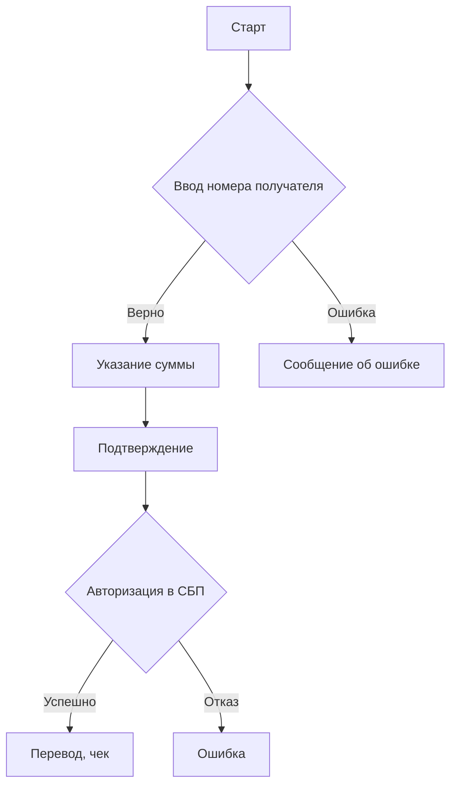

# Данные для авторизации платежа СБП

## 👤 **Kirill**

какие данные нужны в процессинговой системе (АБС) для авторизации платежа СБП

---

## 🤖 **DeepSeek**

Для авторизации платежа через **Систему быстрых платежей (СБП)** в процессинговой системе (АБС — автоматизированной банковской системе) необходимы следующие данные:  

### **1. Данные плательщика (отправителя)**  
- **Номер телефона** (привязанный к банковскому счету в СБП)  
- **БИК банка отправителя** (если требуется)  
- **Реквизиты счета/карты** (если списание не через СБП, а с карты/счета)  

### **2. Данные получателя**  
- **Номер телефона получателя** (привязанный к банковскому счету в СБП)  
- **Счет получателя** (если перевод не по номеру телефона)  
- **БИК банка получателя**  

### **3. Данные платежа**  
- **Сумма платежа**  
- **Назначение платежа** (комментарий, если поддерживается)  
- **Уникальный идентификатор платежа (UUID)**  

### **4. Данные для авторизации в СБП**  
- **Идентификатор участника СБП (БИК или SPID)**  
- **API-ключ или сертификат** для подписи запроса  
- **IP-адрес** (если требуется белый список)  

### **5. Технические параметры**  
- **URL API СБП** (например, `https://sbp.nspk.ru/api/v1/payments`)  
- **Метод запроса** (POST для инициации платежа)  
- **Формат данных** (обычно JSON)  

### **Пример запроса на авторизацию платежа в СБП**  
```json
{
  "sender": "+79001234567",
  "receiver": "+79007654321",
  "amount": 1000.50,
  "currency": "RUB",
  "paymentPurpose": "Оплата услуг",
  "bank_id": "044525999",  // БИК банка отправителя
  "requestId": "123e4567-e89b-12d3-a456-426614174000"  // UUID
}
```

### **Ответ от СБП (успешная авторизация)**  
```json
{
  "status": "ACCEPTED",
  "transactionId": "a1b2c3d4-5678-90ef-1234-567890abcdef",
  "timestamp": "2025-04-21T12:34:56Z"
}
```

### **Что проверяет процессинг (АБС) перед авторизацией?**  
1. Достаточность средств у отправителя.  
2. Корректность реквизитов получателя.  
3. Соответствие лимитам СБП (например, макс. 1 млн руб. для физ. лиц).  
4. Наличие технической возможности у банка участвовать в СБП.  

Если всё в порядке — платеж авторизуется и проводится через НСПК (Национальную систему платежных карт).  

Нужны уточнения по конкретному банку или API? 🚀

---

## 👤 **Kirill**

как бизнес-аналитик напиши шаблон для описания сценариев пользователя в рамках проведения B2C\C2B переводов СБП

---

## 🤖 **DeepSeek**

### **Шаблон для описания сценариев пользователя (B2C / C2B переводы через СБП)**  
*Для бизнес-аналитика (BPMN, Use Case, User Story)*  

---

#### **1. Общая информация**  
| **Поле**          | **Описание** |  
|-------------------|-------------|  
| **Название сценария** | "Оплата услуг через СБП (C2B)" / "Перевод физ. лицу (B2C)" |  
| **Участники**      | Плательщик (клиент), Получатель (мерчант/физ. лицо), Банк, НСПК |  
| **Тип операции**   | P2P (C2C), P2B (C2B), B2P (B2C) |  
| **Предусловия**    | - Плательщик и получатель зарегистрированы в СБП  <br> - У плательщика достаточно средств |  
| **Постусловия**    | - Средства списаны/зачислены <br> - Отправлено уведомление |  

---

#### **2. Основной сценарий (Happy Flow)**  
| **Шаг** | **Действие пользователя** | **Система/Ответ** | **Бизнес-правила** |  
|--------|--------------------------|-------------------|-------------------|  
| 1 | Плательщик вводит номер телефона получателя (или выбирает из контактов) | Система проверяет формат номера | Номер должен быть в формате +7XXX… |  
| 2 | Указывает сумму перевода (например, 1000 ₽) | Проверка лимитов (мин. 1 ₽, макс. 1 млн ₽) | Лимиты СБП и банка |  
| 3 | Подтверждает платеж (SMS/биометрия) | Запрос в СБП → авторизация | 3DSecure/SCA при необходимости |  
| 4 | – | СБП возвращает статус "Успешно" | Транзакция в НСПК → мгновенный перевод |  
| 5 | Плательщик видит чек "Перевод выполнен" | Уведомление получателю | Данные чека: сумма, номер, время |  

---

#### **3. Альтернативные сценарии**  
| **Сценарий** | **Условие** | **Действие системы** |  
|-------------|------------|----------------------|  
| Неверный номер | Номер не зарегистрирован в СБП | Ошибка: "Получатель не найден в СБП" |  
| Недостаточно средств | Баланс < суммы перевода | Отказ: "Пополните счет" |  
| Лимит превышен | Сумма > 1 млн ₽ | Ошибка: "Используйте другой способ" |  
| Технический сбой | Нет ответа от СБП | Повтор запроса / отмена |  

---

#### **4. Дополнительные требования**  
- **UX/UI**: Кнопка "СБП" в интерфейсе, префильтрация банков-участников.  
- **Логирование**: Сохранение `transactionId` для аудита.  
- **Реквизиты в чеке**:  
  ```plaintext
  Способ: СБП  
  Номер операции: 123e4567-e89b-12d3-a456-426614174000  
  Счет списания: •••• 1234  
  Получатель: +7XXX (Иван Петров)  
  ```

---

#### **5. Диаграмма (BPMN / Use Case)**  
*(Можно добавить схему через Miro/Lucidchart)*  


---

#### **6. User Story (Agile-формат)**  
```plaintext
Как [клиент банка], 
Я хочу [переводить деньги по номеру телефона через СБП], 
Чтобы [платить быстро без реквизитов].

Критерии приемки:
- Перевод за 15 сек.
- Поддержка QR-кодов для C2B.
- Уведомление в SMS/банк-клиент.
```

---

#### **7. Вопросы для уточнения**  
1. Как обрабатываются возвраты?  
2. Нужна ли интеграция с ERP мерчанта (для B2C)?  
3. Поддержка SBP Merchant API для C2B?  

Шаблон можно адаптировать под конкретный банк или платежный сервис. Для детализации добавьте **варианты ошибок API СБП** (например, `error_code 500`).  

Нужна доработка под ваш кейс? Готов помочь! 🚀

---

## 👤 **Kirill**

Напиши пример ответа api с параметром статуса ошибки. коды ошибок 200 и 500

---

## 🤖 **DeepSeek**

### **Примеры ответов API СБП с кодами ошибок**  
Формат: **REST API (JSON)**  

---

### **1. Успешный ответ (HTTP 200 OK)**  
```json
{
  "status": "SUCCESS",
  "code": 200,
  "message": "Платеж успешно обработан",
  "data": {
    "transactionId": "a1b2c3d4-5678-90ef-1234-567890abcdef",
    "amount": 1000.50,
    "currency": "RUB",
    "sender": "+79001234567",
    "receiver": "+79007654321",
    "timestamp": "2025-04-21T12:34:56Z"
  }
}
```

**Поля:**  
- `status` — статус операции (`SUCCESS`, `PENDING`, `FAILED`).  
- `code` — HTTP-код (200 для успеха).  
- `data` — детали транзакции (ID, сумма, участники).  

---

### **2. Ошибка сервера (HTTP 500 Internal Server Error)**  
```json
{
  "status": "ERROR",
  "code": 500,
  "message": "Внутренняя ошибка сервера",
  "details": {
    "errorId": "500-NSPK-12345",
    "reason": "Timeout при подключении к НСПК",
    "timestamp": "2025-04-21T12:35:10Z",
    "action": "Повторите запрос позже"
  }
}
```

**Поля:**  
- `code` — HTTP-код 500.  
- `errorId` — уникальный ID ошибки для логов.  
- `reason` — техническая причина (например, недоступность СБП).  
- `action` — рекомендация для клиента/системы.  

---

### **3. Другие коды ошибок (Пример для 400 Bad Request)**  
```json
{
  "status": "FAILED",
  "code": 400,
  "message": "Неверный формат номера телефона",
  "details": {
    "field": "receiver_phone",
    "validationError": "Должен начинаться с +7 и содержать 11 цифр"
  }
}
```

---

### **Справочник кодов HTTP/СБП**  
| **Код** | **Тип**          | **Пример причины**                     |  
|--------|------------------|---------------------------------------|  
| 200    | Успех            | Платеж проведен.                       |  
| 400    | Клиентская ошибка | Неверные реквизиты, лимиты превышены.  |  
| 500    | Серверная ошибка  | Сбой НСПК/банка, timeout.              |  
| 503    | Сервис недоступен | Технические работы в СБП.              |  

---

### **Как обрабатывать в коде?**  
```python
if response.status_code == 200:
    print("Платеж успешен:", response.json()["data"]["transactionId"])
elif response.status_code == 500:
    print("Ошибка СБП:", response.json()["details"]["reason"])
else:
    print("Другая ошибка:", response.json()["message"])
```

Для полной документации запросите **Swagger-спецификацию API** вашего банка или НСПК. Нужны другие примеры? Готов дополнять! 🔍

---

## 👤 **Kirill**

объясни отражение операций по счетам незавершенных расчетов

---

## 🤖 **DeepSeek**

### **Отражение операций по счетам незавершенных расчетов (СНР) в банковском учете**  
Счета незавершенных расчетов (СНР) используются для временного учета операций, которые начаты, но еще не завершены (например, платежи в процессе обработки).  

---

## **1. Когда применяются СНР?**  
СНР используются в следующих сценариях:  
- **Платежи через СБП** (если транзакция принята, но еще не подтверждена НСПК).  
- **Межбанковские переводы** (проводки между корсчетами до окончательного проведения).  
- **Ожидание подтверждения** (например, 3D-Secure для карт).  

---

## **2. Типовые проводки по СНР**  
### **Пример для перевода через СБП**  

| **Этап**               | **Проводка (Дт/Кт)**       | **Комментарий** |  
|------------------------|----------------------------|----------------|  
| **1. Клиент инициирует платеж** |  
| Списание со счета клиента | Дт 40817 (счет клиента) <br> Кт 30230 (СНР) | Средства "заморожены" |  
| **2. Платеж обработан СБП** |  
| Перевод в НСПК          | Дт 30230 (СНР) <br> Кт 30102 (корсчет в ЦБ) | Средства ушли в СБП |  
| **3. Получатель подтвердил зачисление** |  
| Зачисление получателю   | Дт 30102 (корсчет) <br> Кт 40817 (счет получателя) | Финал проводки |  

Если платеж **не прошел**:  
- **Отмена операции**: Дт 30230 (СНР) Кт 40817 (возврат клиенту).  

---

## **3. Особенности учета**  
1. **Временный характер**: СНР закрываются в течение 1-3 рабочих дней.  
2. **Контроль ликвидности**: Средства на СНР исключаются из доступного остатка клиента.  
3. **Аудит**: Все операции по СНР логируются для сверки с выписками НСПК.  

---

## **4. Нормативная база**  
- **Положение Банка России № 646-П** (о порядке проведения переводов).  
- **Внутренние регламенты банка** (сроки автоматического закрытия СНР).  

---

## **5. Пример в учетной системе**  
```plaintext
Дата: 21.04.2025  
Операция: Перевод через СБП (+79001234567 → +79007654321)  
Дт 40817 (Клиент А) — 1000 ₽  
Кт 30230 (СНР) — 1000 ₽  
Статус: "В обработке"  
```  
После подтверждения:  
```plaintext
Дт 30230 (СНР) — 1000 ₽  
Кт 30102 (Корсчет) — 1000 ₽  
Статус: "Исполнено"  
```  

**Важно**: Если СБП возвращает ошибку (например, код 500), проводки сторнируются.  

---

### **6. Отражение в отчетности**  
- **Баланс банка**: СНР (30230) отображается как актив.  
- **Оборотка**: Проводки по СНР выделяются отдельной строкой.  

Нужны детали по конкретному банку или стандартам (МСФО/РСБУ)? Уточню! 🧾

---

## 👤 **Kirill**

в чем отличие от учета без счетов незавершенных расчетов

---

## 🤖 **DeepSeek**

### **Отличие учета со счетами незавершенных расчетов (СНР) и без них**  

Ключевое отличие — в **моменте признания операции** и **отражении средств в балансе**.  

---

## **1. Учет **с** использованием СНР**  
**(Традиционный метод, применяется в большинстве банков)**  

### **Характеристики:**  
- **Временные счета** (типа 30230, 47422) для фиксации "переходных" операций.  
- **Двухэтапное проведение**:  
  1. **Резервирование средств** (списание с клиента → зачисление на СНР).  
  2. **Фактическое перемещение** (СНР → получатель/корсчет).  
- **Контроль рисков**:  
  - Исключает двойное списание.  
  - Позволяет отслеживать "зависшие" платежи.  

### **Пример (перевод СБП):**  
```plaintext
1. Дт 40817 (клиент) — Кт 30230 (СНР) — 1000 ₽ — резерв.  
2. Дт 30230 (СНР) — Кт 30102 (корсчет) — 1000 ₽ — исполнение.  
```  
**Если платеж не прошел:**  
```plaintext
Дт 30230 (СНР) — Кт 40817 (клиент) — 1000 ₽ — отмена.  
```  

### **Плюсы:**  
- Прозрачность: видно, какие платежи "в процессе".  
- Соответствие регуляторным требованиям (например, Положение ЦБ № 646-П).  

### **Минусы:**  
- Усложнение бухгалтерии (дополнительные проводки).  
- Риск "зависания" средств на СНР при сбоях.  

---

## **2. Учет **без** СНР**  
**(Упрощенный метод, встречается в некоторых финтех-сервисах)**  

### **Характеристики:**  
- **Мгновенное отражение** операций на счетах клиентов.  
- **Одноэтапное проведение**:  
  - Списание с отправителя → Зачисление получателю **без промежуточных счетов**.  
- **Используется при:**  
  - Гарантированно быстрых платежах (например, СБП внутри одного банка).  
  - Технологиях с pre-validation (предварительной проверкой реквизитов).  

### **Пример (перевод СБП):**  
```plaintext
Дт 40817 (клиент А) — Кт 40817 (клиент Б) — 1000 ₽ — сразу.  
```  
**Если платеж не прошел:**  
```plaintext
Сторно: Дт 40817 (клиент Б) — Кт 40817 (клиент А) — 1000 ₽.  
```  

### **Плюсы:**  
- Простота: меньше проводок, выше скорость.  
- Лучший UX: клиент видит списание/зачисление сразу.  

### **Минусы:**  
- Риск некорректного баланса при сбоях (например, если платеж "пропал" между системами).  
- Сложнее аудит: нет промежуточного "следа" в учете.  

---

## **3. Сравнительная таблица**  

| **Критерий**               | **Со СНР**                          | **Без СНР**                     |  
|----------------------------|-------------------------------------|----------------------------------|  
| **Скорость учета**         | Медленнее (2+ проводки)             | Быстрее (1 проводка)             |  
| **Контроль рисков**        | Высокий (средства резервируются)    | Низкий (зависит от системы)      |  
| **Регуляторное соответствие** | Обязательно для банков             | Возможно в финтехах             |  
| **Аудит**                  | Детальный (есть "след" на СНР)      | Упрощенный                      |  
| **Пример использования**   | Межбанковские переводы, СБП между разными банками | СБП внутри одного банка, P2P-платформы |  

---

## **4. Когда какой метод выбрать?**  
- **Банки** → **Обязаны использовать СНР** (требования ЦБ).  
- **Финтех-компании** → Могут обходиться без СНР, если:  
  - Переводы мгновенные (внутри своей системы).  
  - Есть механизмы отката (compensation transactions).  

**Важно**: Для операций через НСПК (СБП) банки **всегда применяют СНР**, так как требуется подтверждение от НПСК.  

---

### **Вывод**  
СНР — это "буфер безопасности" для корректного учета, но усложняющий процесс. Упрощенные методы работают только в закрытых системах с гарантированной доставкой платежей.  

Нужны примеры для конкретного сценария? Готов уточнить! 🚀

---

