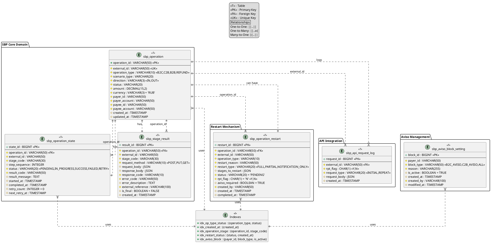
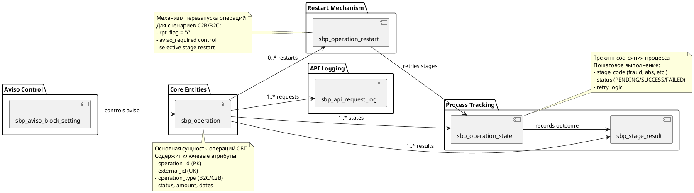

# Тип операции как бизнес-объект или сущность

## 👤 **Kirill**

Является ли тип операции бизнес объектом или сущностью?

---

## 🤖 **DeepSeek**

Отличный и очень глубокий вопрос! Ответ на него неоднозначен и зависит от контекста и уровня абстракции, на котором мы рассматриваем «тип операции».

Краткий ответ: **Тип операции чаще всего является сущностью (Entity) или объектом-значением (Value Object) в рамках бизнес-объекта «Операция», но в сложных системах он сам может быть полноценным бизнес-объектом.**

Давайте разберем это подробнее.

### 1. Тип операции как часть бизнес-объекта "Операция" (Наиболее частый случай)

В большинстве систем (например, бухгалтерский учет, банковские транзакции, складской учет) «Операция» — это центральная сущность (Business Entity). Она имеет уникальный идентификатор, сумму, дату, ссылки на контрагентов и т.д.

В этом контексте **«Тип операции»** часто является **атрибутом** или **объектом-значением (Value Object)** этой сущности.

*   **Как объект-значение (Value Object):** Если тип операции описывается неизменяемым набором данных, который не имеет своего собственного жизненного цикла и идентифицируется только своими атрибутами.
    *   *Пример:* `enum OperationType { DEBIT, CREDIT }` или класс `OperationType { code: "INCOME", name: "Поступление", sign: "+" }`. Здесь неважно, какой именно экземпляр `OperationType` мы используем, важно его значение. Два типа с кодом "INCOME" считаются идентичными и взаимозаменяемыми.
*   **Как сущность (Entity) внутри агрегата "Операция":** Если "Тип операции" имеет свой уникальный идентификатор (ID) в системе и собственную логику, но его жизненный цикл жестко привязан к жизненному циклу операций или управляется централизованно администратором. В рамках DDD это будет **Сущность внутри агрегата**, где корнем агрегата является справочник типов операций или сама операция.

**В этом сценарии:** **Операция — это бизнес-объект (сущность высшего порядка), а её тип — его важная часть.**

---

### 2. Тип операции как самостоятельный бизнес-объект (Сложные системы)

В более сложных предметных областях «Тип операции» может быть полноценным **бизнес-объектом (Business Object)** или **корнем агрегата (Aggregate Root)**. Это происходит, когда с типом операции связана сложная поведенческая логика и он обладает собственным независимым жизненным циклом.

**Признаки того, что "Тип операции" — это самостоятельный бизнес-объект:**

1.  **Собственный жизненный цикл:** Его можно создавать, активировать, архивировать, настраивать независимо от конкретных операций.
2.  **Сложная поведенческая логика:** Тип диктует, *как* должна проводиться операция.
    *   *Пример из финтех:* Тип операции "Покупка валюты" может иметь ссылку на правила проведения, валютные пары, лимиты, тарифы. Эта логика инкапсулирована в объекте `CurrencyPurchaseOperationType`.
3.  **Богатая модель данных:** Помимо кода и названия, тип содержит много других данных: бухгалтерские проводки (шаблон корреспонденции счетов), условия применения, права доступа, скрипты для расчета комиссий и т.д.
4.  **Уникальная идентичность:** Каждый тип операции имеет уникальный ID, и важно, что это *именно тот самый* тип, а не просто такой же.

**В этом сценарии:** **Тип операции — это самостоятельный бизнес-объект (сущность), который управляет поведением и свойствами отдельных операций.** Операция в этом случае будет иметь ссылку на этот объект (``operation.typeId``).

---

### Итог в виде таблицы

| Критерий | Тип операции как Value Object / Атрибут | Тип операции как самостоятельная Сущность / Бизнес-объект |
| :--- | :--- | :--- |
| **Идентичность** | Определяется значениями полей (например, кодом). | Определяется уникальным ID. |
| **Жизненный цикл** | Неизменяем, не имеет独立собственного ЖЦ. | Имеет独立собственный ЖЦ (создание, изменение). |
| **Сложность** | Простой перечень (enum), справочник. | Сложная структура с поведением и правилами. |
| **Пример** | `DEBIT`/`CREDIT`, "Приход"/"Расход". | "Межбанковский перевод в USD", "Кредитная карта с кэшбэком". |

### Практический вывод

1.  **Начните с простого:** Если ваша система проста (например, учет личных финансов), сделайте тип операции перечислением (enum) или справочником-значением внутри объекта `Transaction`.
2.  **Усложняйте при необходимости:** Если вы проектируете核心 banking-систему или ERP, где от типа операции зависит огромное количество бизнес-правил, тогда выделите `OperationType` в самостоятельную сущность с богатой моделью и поведением.

**Ответ на ваш вопрос:** Тип операции **является сущностью** (и может быть бизнес-объектом) в рамках предметной области, но уровень его важности и самостоятельности зависит от сложности бизнес-логики, которую он в себе инкапсулирует.

---

## 👤 **Kirill**

как описать функциональные требования к созданию БД (табличек) для хранения данных по операциям СБП и состояний процесса проведения операций в Core. Например сценарий использования БД:
От Payer приходит новый вид запроса на блокировку отправки авизо клиенту в Core должен сохраниться параметр из запроса, который означает приостановку. Дальнейшие платежи должны проходить без формирования авизо до того как не будет запроса на отмену "блокировки" авизо.
Контекст из истории переписки здесь по процессам B2C и C2B

---

## 🤖 **DeepSeek**

Отличная и очень конкретная задача! Вот как можно описать функциональные требования к БД для вашего сценария с блокировкой авизо в контексте СБП (B2C, C2C).

Основа подхода: **Требования к данным и их состоянию являются производными от требований к бизнес-процессу.**

---

### 1. Контекст и Бизнес-требование

*   **Бизнес-процесс:** Проведение операций СБП (B2C, C2C) через Core-систему.
*   **Бизнес-проблема:** Плательщику (Payer) необходима возможность приостановить автоматическую отправку авизо (уведомлений) клиенту (например, при технических работах или расследовании инцидентов).
*   **Сценарий использования:**
    1.  Payer отправляет в Core запрос на блокировку отправки авизо.
    2.  Core должен зафиксировать этот факт и параметры блокировки.
    3.  Все последующие успешные платежи должны проводиться, но **без генерации и отправки авизо** клиенту.
    4.  Payer отправляет запрос на снятие блокировки.
    5.  Core снимает блокировку, и последующие платежи снова сопровождаются отправкой авизо.

---

### 2. Функциональные требования к данным и БД

#### **2.1. Требование #1: Хранение глобальных настроек блокировки авизо**

**Цель:** Возможность иметь несколько независимых блокировок (например, для разных типов операций или инициаторов).

**Сущность/Таблица: `AVISO_BLOCK_SETTING`**

| Поле | Тип | Обязат. | Описание | Пример |
| :--- | :--- | :--- | :--- | :--- |
| `block_id` | UUID / BIGINT | Да | Уникальный идентификатор блокировки. PK. | `a1b2c3d4...` |
| `payer_id` | VARCHAR | Да | Идентификатор Плательщика (юридическое лицо), кто инициировал блокировку. | `SBP1234567` |
| `block_type` | VARCHAR(50) | Да | Тип блокировки. Определяет область применения. **Критичное поле для B2C/C2C.** | `B2C_AVISO`, `C2B_AVISO`, `ALL` |
| `reason` | VARCHAR(255) | Нет | Причина блокировки (для лога и аудита). | "Технические работы на стороне Payer" |
| `is_active` | BOOLEAN | Да | **Флаг текущего состояния.** `TRUE` - блокировка активна, `FALSE` - снята. | `TRUE` |
| `created_at` | TIMESTAMP | Да | Дата и время создания записи (момент получения запроса на блокировку). | `2023-10-25 15:30:00` |
| `created_by` | VARCHAR(100) | Да | Кто создал запись (например, `system::api_payer`). | `api_payer` |
| `modified_at` | TIMESTAMP | Да | Дата и время последнего изменения (например, снятия блокировки). | `2023-10-25 15:30:00` |

**Бизнес-логика:**
*   При получении запроса на блокировку от Payer, создается новая запись с `is_active = TRUE`.
*   При запросе на снятие блокировки, соответствующая запись обновляется: `is_active = FALSE`, `modified_at = current_timestamp`.
*   **Критерий проверки "нужно ли слать авизо?":** Существует ли активная запись (`is_active = TRUE`) для данного `payer_id` и типа операции (`block_type`), соответствующего текущему платежу.

---

#### **2.2. Требование #2: Хранение состояния операции СБП**

**Цель:** Фиксировать каждую операцию и ее статус, включая факт отправки авизо.

**Сущность/Таблица: `SBP_OPERATION` (или `PAYMENT_ORDER`)**

| Поле | Тип | Обязат. | Описание | Пример |
| :--- | :--- | :--- | :--- | :--- |
| `operation_id` | UUID / BIGINT | Да | Уникальный идентификатор операции (транзакции) в Core. PK. | `op_987654321` |
| `external_id` | VARCHAR | Да | Идентификатор операции из запроса (например, `qid` для СБП). | `QID_1122334455` |
| `payer_id` | VARCHAR | Да | Идентификатор Плательщика. FK на `AVISO_BLOCK_SETTING.payer_id`. | `SBП1234567` |
| `operation_type` | VARCHAR(20) | Да | Тип операции: **B2C, C2B**. | `B2C` |
| `amount` | DECIMAL(15,2) | Да | Сумма операции. | `1500.00` |
| `status` | VARCHAR(50) | Да | **Текущий статус операции в Core.** | `PENDING`, `COMPLETED`, `FAILED` |
| `aviso_required` | BOOLEAN | Да | **Надо ли в принципе отправлять авизо для этой операции?** Определяется бизнес-логикой на старте. | `TRUE` |
| `aviso_sent` | BOOLEAN | Да | **Факт отправки авизо.** `FALSE` по умолчанию. | `FALSE` |
| `aviso_block_applied` | BOOLEAN | Нет | **Была ли применена блокировка авизо при обработке этой операции?** Для аудита. | `TRUE` |
| `created_at` | TIMESTAMP | Да | Дата и время создания операции. | `2023-10-25 16:01:15` |
| `updated_at` | TIMESTAMP | Да | Дата и время последнего обновления статуса. | `2023-10-25 16:01:16` |

**Бизнес-логика:**
1.  **Создание операции:** При поступлении нового платежа создается запись. Поле `aviso_required` устанавливается в `TRUE` на основе типа операции (например, для B2C - всегда `TRUE`).
2.  **Проверка перед отправкой авизо:** Перед тем как сгенерировать и отправить авизо, система проверяет:
    *   `aviso_required = TRUE`
    *   `aviso_sent = FALSE`
    *   **НЕТ** активной блокировки в `AVISO_BLOCK_SETTING` для `payer_id` и `operation_type` текущей операции.
3.  **Если блокировка активна:**
    *   Авизо **не отправляется**.
    *   Поле `aviso_sent` остается `FALSE`.
    *   Поле `aviso_block_applied` устанавливается в `TRUE`.
    *   Операция считается завершенной (`status = 'COMPLETED'`).
4.  **Если блокировки нет:**
    *   Авизо отправляется.
    *   Поле `aviso_sent` устанавливается в `TRUE`.
    *   Операция завершается.

---

### 3. Сценарий использования в виде SQL-подобной логики

**Запрос на блокировку от Payer (payer_id='P123', type='B2C_AVISO'):**
```sql
INSERT INTO aviso_block_setting (block_id, payer_id, block_type, reason, is_active, created_at, created_by)
VALUES (gen_random_uuid(), 'P123', 'B2C_AVISO', 'Приостановка уведомлений для B2C', true, NOW(), 'api_payer');
```

**Обработка нового B2C-платежа:**
```sql
-- 1. Создаем операцию
INSERT INTO sbp_operation (operation_id, payer_id, operation_type, ..., aviso_required, aviso_sent)
VALUES ('OP_001', 'P123', 'B2C', ..., true, false);

-- 2. При смене статуса на COMPLETED, проверяем блокировку
SELECT EXISTS (
    SELECT 1 FROM aviso_block_setting
    WHERE payer_id = 'P123'
    AND block_type IN ('B2C_AVISO', 'ALL') -- Ищем блокировку для B2C или общую
    AND is_active = true
) AS is_blocked;

-- 3. Логика на основе результата (псевдокод)
IF operation_status == 'COMPLETED' AND aviso_required == true:
    IF is_blocked:
        -- Авизо НЕ отправляем, только фиксируем факт блокировки
        UPDATE sbp_operation
        SET aviso_block_applied = true, status = 'COMPLETED', updated_at = NOW()
        WHERE operation_id = 'OP_001';
    ELSE:
        -- Отправляем авизо
        ... -- Код отправки
        UPDATE sbp_operation
        SET aviso_sent = true, status = 'COMPLETED', updated_at = NOW()
        WHERE operation_id = 'OP_001';
```

### 4. Нефункциональные требования к БД

*   **Производительность:** Индексы на `aviso_block_setting(payer_id, block_type, is_active)` и `sbp_operation(operation_id, status)` для быстрых проверок.
*   **Доступность:** БД должна быть высокодоступна, так как проверки блокировки происходят в режиме реального времени при обработке платежей.
*   **Аудит:** Поля `created_at`, `created_by`, `modified_at` обязательны для отслеживания действий.

Такой подход позволяет четко отделить **метаданные процесса** (блокировка) от **данных конкретных операций** и дает гибкость для управления уведомлениями.

---

## 👤 **Kirill**

Опиши требования к БД Core для возможности реализации задачи:
Взаимодейтсвие Core – API
 
Механизм обработки повторной проводки по успешной операции C2B
 
Повторная выгрузка операции из Шлюза СБП (API) производиться вручную оператором «по кнопке».
 
В Core должна быть предусмотрена возможность выполнения повторной проводки по одной и той же операции.
 
Важно, чтобы проводка была прокинута в ABS, но при этом авизо клиенту формировалось только в случае, если оно не было 
отправлено в первоначальном процессе (т.е. нужно исключить дублирование camt. по одному и тому же платежу).  
 
Критерием повторной отправки может является признак rpt_flag = Y
 
При наличии в запросе API признака rpt_flag = Y нужно исключить дублирование camt.

---

## 🤖 **DeepSeek**

Отличная задача! Это классический сценарий идемпотентности и повторной отправки уведомлений. Вот детальные требования к БД Core для её реализации.

---

### 1. Контекст и Бизнес-требование

*   **Бизнес-процесс:** Обработка C2B операций СБП в Core-системе.
*   **Проблема:** Необходимость ручной повторной проводки уже успешной операции из-за сбоев в смежных системах (например, отсутствие подтверждения от АБС, сбой при отправке авизо), **без дублирования финансового документа (camt.053) для клиента**.
*   **Цель:** Обеспечить механизм идемпотентной повторной обработки, при которой:
    1.  Проводка в АБС выполняется повторно (или проверяется её существование).
    2.  Авизо (camt.053) отправляется клиенту **только один раз** за всю жизнь операции.

---

### 2. Функциональные требования к данным и БД

#### **2.1. Требование #1: Хранение состояния операции C2B с поддержкой идемпотентности**

**Цель:** Однозначно идентифицировать операцию и хранить детальную историю её обработки, особенно факты проводки и отправки авизо.

**Сущность/Таблица: `C2B_OPERATION`**

| Поле | Тип | Обязат. | Описание | Пример |
| :--- | :--- | :--- | :--- | :--- |
| `operation_id` | UUID / BIGINT | Да | Внутренний уникальный ID операции в Core. PK. | `op_c2b_98765` |
| `external_id` | VARCHAR(50) | Да | **Уникальный идентификатор операции из Шлюза СБП** (например, `qid`). **UNIQUE KEY.** Критично для идемпотентности. | `QID_1122334455` |
| `amount` | DECIMAL(15,2) | Да | Сумма операции. | `5000.00` |
| `status` | VARCHAR(50) | Да | **Общий статус операции в Core.** | `PENDING`, `ABS_PROCESSING`, `COMPLETED`, `ABS_ERROR`, `AVISO_FAILED` |
| `abs_status` | VARCHAR(50) | Да | **Детальный статус взаимодействия с АБС.** | `NOT_SENT`, `SENT`, `CONFIRMED`, `ERROR` |
| `abs_transaction_id` | VARCHAR(100) | Нет | Уникальный ID проводки/транзакции, вернувшийся из АБС. Для сверок. | `ABS_TX_998877` |
| `aviso_status` | VARCHAR(50) | Да | **Статус отправки авизо клиенту.** | `NOT_SENT`, `SENT`, `ERROR` |
| `aviso_sent_at` | TIMESTAMP | Нет | Дата и время фактической отправки авизо. | `2023-10-25 10:30:05` |
| `rpt_flag` | CHAR(1) | Да | **Признак повторной обработки в текущем запросе.** `Y`/`N`. Дефолт `N`. | `Y` |
| `last_rpt_attempt_at` | TIMESTAMP | Нет | Время последней попытки повторной обработки. | `2023-10-25 11:05:00` |
| `created_at` | TIMESTAMP | Да | Дата и время создания операции в Core. | `2023-10-25 10:20:00` |
| `updated_at` | TIMESTAMP | Да | Дата и время последнего обновления любой информации по операции. | `2023-10-25 11:05:01` |

---

#### **2.2. Требование #2: Журнал обработки запросов API**

**Цель:** Аудит всех входящих запросов (особенно повторных) и их параметров. Помогает анализировать действия операторов.

**Сущность/Таблица: `API_REQUEST_LOG`**

| Поле | Тип | Обязат. | Описание | Пример |
| :--- | :--- | :--- | :--- | :--- |
| `request_id` | UUID / BIGINT | Да | Уникальный ID запроса в Core. PK. | `req_54321` |
| `external_id` | VARCHAR(50) | Да | `qid` операции, переданный в запросе. FK на `C2B_OPERATION.external_id`. | `QID_1122334455` |
| `rpt_flag` | CHAR(1) | Да | Значение признака `rpt_flag` из входящего запроса. | `Y` |
| `request_type` | VARCHAR(20) | Да | Тип запроса (`INITIAL`, `REPEAT`). | `REPEAT` |
| `request_body` | JSON / TEXT | Да | Полное тело входящего запроса (для отладки и аудита). | `{...}` |
| `created_at` | TIMESTAMP | Да | Момент получения запроса API. | `2023-10-25 11:05:00` |

---

### 3. Алгоритм обработки входящего запроса API (Требования к логике)

**Вход:** Запрос API с данными операции C2B, включая поле `rpt_flag`.

```sql
-- 1. ПОИСК СУЩЕСТВУЮЩЕЙ ОПЕРАЦИИ (ИДЕМПОТЕНТНОСТЬ)
-- Ищем операцию по external_id (qid) из запроса.
SELECT * FROM c2b_operation WHERE external_id = :incoming_external_id;

-- 2. ЛОГИКА ВЕТВЛЕНИЯ НА ОСНОВЕ РЕЗУЛЬТАТА
```

#### **Сценарий 2A: Операция НЕ найдена (Новая операция)**
1.  **Создать новую запись** в `C2B_OPERATION`.
2.  Установить `rpt_flag = 'N'` (это первичная обработка).
3.  Выполнить стандартный процесс:
    *   Провести операцию в АБС (`abs_status = 'SENT' -> 'CONFIRMED'`).
    *   **Отправить авизо клиенту** (`aviso_status = 'SENT'`).
    *   Обновить общий `status = 'COMPLETED'`.

#### **Сценарий 2B: Операция найдена (Повторный запрос)**
```sql
-- 2B.1. ЗАФИКСИРОВАТЬ ЗАПРОС В ЛОГ
INSERT INTO api_request_log (...) VALUES (...);

-- 2B.2. ОБНОВИТЬ ОПЕРАЦИЮ: Запомнить факт повторного запроса
UPDATE c2b_operation
SET rpt_flag = :incoming_rpt_flag, -- 'Y'
    last_rpt_attempt_at = NOW(),
    updated_at = NOW()
WHERE operation_id = :found_operation_id;

-- 2B.3. ПРОВЕРИТЬ, НУЖНА ЛИ ПОВТОРНАЯ ПРОВОДКА В АБС
-- Если проводка не подтверждена (сбой был на этапе АБС), пробуем снова.
IF abs_status != 'CONFIRMED' THEN
    -- Вызвать API АБС для проведения (или проверки статуса)
    -- Обновить abs_status и abs_transaction_id при успехе
END IF;

-- 2B.4. ПРОВЕРИТЬ, НУЖНО ЛИ ОТПРАВЛЯТЬ АВИЗО (КЛЮЧЕВАЯ ЛОГИКА!)
-- Авизо отправляем ТОЛЬКО если:
-- а) Это повторный запрос (rpt_flag = 'Y')
-- б) Авизо еще НИ РАЗУ не было отправлено (aviso_status != 'SENT')
IF :incoming_rpt_flag = 'Y' AND aviso_status != 'SENT' THEN
    -- Отправить авизо клиенту
    UPDATE c2b_operation SET aviso_status = 'SENT', aviso_sent_at = NOW() WHERE ...;
END IF;

-- Если aviso_status уже был 'SENT', шаг отправки ПРОПУСКАЕТСЯ.
```

---

### 4. Критически важные требования к целостности данных

1.  **Уникальность `external_id`:** Ограничение `UNIQUE CONSTRAINT` на поле `c2b_operation.external_id` обязательно. Это гарантирует, что операция будет создана в БД только один раз.
2.  **Индексы для производительности:**
    *   `c2b_operation.external_id` (UNIQUE) - для быстрого поиска операции по входящему запросу.
    *   `c2b_operation.status` - для мониторинга и отчетности.
    *   `api_request_log.external_id, created_at` - для анализа истории запросов по операции.
3.  **Транзакционность:** Весь процесс обработки входящего запроса (поиск/создание операции, логирование, обновление статусов) должен быть выполнен в рамках одной транзакции для избежания race condition.

### 5. Пример сценария использования (Псевдокод)

**Входящий запрос:** `{ "qid": "QID_1122334455", "amount": 5000, "rpt_flag": "Y" }`

1.  **Поиск:** Находим операцию `QID_1122334455` в `C2B_OPERATION`. Её статусы: `status='COMPLETED'`, `abs_status='CONFIRMED'`, `aviso_status='SENT'`.
2.  **Логирование:** Фиксируем запрос в `API_REQUEST_LOG` с `rpt_flag='Y'`.
3.  **Проводка в АБС:** `abs_status` уже `CONFIRMED` -> **пропускаем** повторную проводку.
4.  **Отправка авизо:** `aviso_status` уже `SENT` -> **пропускаем** отправку. **Дублирования camt. не происходит.**
5.  **Ответ API:** Возвращаем сообщение типа "Операция уже успешно обработана ранее, авизо доставлено".

Этот подход гарантирует, что финансовый результат для клиента будет отражен корректно и без дублей, что является ключевым требованием для процессинговых систем.

---

## 👤 **Kirill**

Как бизнес аналитик:
1. переименуй таблицы в лучших практиках 
2. опиши логическую схему данных для хранения контекста операций и состояний (шагов), статусов по операциям СБП в Core:

tsbp_trans – общая таблица транзакций (Инициирующие запросы)
Сценарий B2C: B2COther
Ключ: operation_id+external_id
Тело
Хидеры
 
 
tsbp_state - таблица состояний
operation_id+external_id
Шаг процесса (начало)
Статус завершения шага
operation_id
id
Кодответа
 
 
tsbp_ stage_af - таблицы для храниения ответов от смежных систем
operation_id+external_id
Телоответа от Антифрода
 
 
tsbp_stage_fm - таблицы для храниения ответов от смежных систем
operation_id+external_id
Тело ответа от Финмон
Ошибка с описанием
 
tsbp_stage_ekassir - таблицы для храниения ответов от смежных систем
operation_id+external_id
POST
PUT
GET
Через задание типа метода
Тело ответа от еКассир
Ошибка с описанием
 
tsbp_stage_edo - таблицы для храниения ответов от смежных систем
operation_id+external_id
Тело ответа от ЭДО
Ошибка с описанием
 
 
tsbp_stage_tsp - таблицы для храниения ответов от смежных систем
operation_id+external_id
 
tsbp_stage_abs - таблицы для храниения ответов от смежных систем
operation_id+external_id
 
tsbp_stage_bo - таблицы для храниения ответов от смежных систем
operation_id+external_id
 
 
Таблички для перезапуска C2B
operation_id+external_id
Массив транзакций (записи отдельно)
 
Таблички для перезапуска B2C и возвратов
operation_id+external_id
Массив транзакций (записи отдельно)

---

## 🤖 **DeepSeek**

Отлично! Как бизнес-аналитик, я предлагаю привести命名 к лучшим практикам и создать логическую схему, которая будет масштабируемой и понятной для разработчиков.

---

## 1. Переименование таблиц по лучшим практикам

**Принципы:**
- Единый префикс для домена: `sbp_`
- Четкое разделение сущностей: `operation`, `state`, `stage`
- Уточнение типа стадий: `fraud`, `abs`, `notification`

| Текущее название | Новое название | Обоснование |
|-----------------|----------------|-------------|
| `tsbp_trans` | `sbp_operation` | "operation" точнее отражает суть, чем "trans" |
| `tsbp_state` | `sbp_operation_state` | Более описательное название |
| `tsbp_stage_af` | `sbp_stage_fraud` | "fraud" вместо "af" - понятнее |
| `tsbp_stage_fm` | `sbp_stage_finmon` | "finmon" вместо "fm" |
| `tsbp_stage_ekassir` | `sbp_stage_payment_gateway` | Обобщенное название для шлюза |
| `tsbp_stage_edo` | `sbp_stage_notification` | "notification" вместо "edo" |
| `tsbp_stage_tsp` | `sbp_stage_security` | "security" вместо "tsp" |
| `tsbp_stage_abs` | `sbp_stage_core_banking` | "core_banking" точнее, чем "abs" |
| `tsbp_stage_bo` | `sbp_stage_back_office` | Полное название |

---

## 2. Логическая схема данных

### **2.1. Основная таблица операций** (`sbp_operation`)

```sql
CREATE TABLE sbp_operation (
    operation_id VARCHAR(50) PRIMARY KEY,          -- Внутренний UUID
    external_id VARCHAR(50) NOT NULL,              -- QID из СБП
    operation_type VARCHAR(10) NOT NULL,           -- B2C, C2B, B2B, REFUND
    scenario_type VARCHAR(20) NOT NULL,            -- B2COther, B2CSalary, C2BPayment etc.
    direction VARCHAR(3) NOT NULL,                 -- IN, OUT
    status VARCHAR(20) NOT NULL,                   -- CREATED, PROCESSING, COMPLETED, FAILED
    amount DECIMAL(15,2) NOT NULL,
    currency VARCHAR(3) DEFAULT 'RUB',
    payer_id VARCHAR(50) NOT NULL,                 -- Инициатор операции
    payer_account VARCHAR(50),                     -- Счет плательщика
    payee_id VARCHAR(50),                          -- Получатель (для B2C)
    payee_account VARCHAR(50),                     -- Счет получателя
    created_at TIMESTAMP DEFAULT CURRENT_TIMESTAMP,
    updated_at TIMESTAMP DEFAULT CURRENT_TIMESTAMP,
    UNIQUE KEY uk_operation_external (external_id),
    INDEX idx_operation_type_status (operation_type, status),
    INDEX idx_created_at (created_at)
);
```

### **2.2. Таблица состояний процесса** (`sbp_operation_state`)

```sql
CREATE TABLE sbp_operation_state (
    state_id BIGINT AUTO_INCREMENT PRIMARY KEY,
    operation_id VARCHAR(50) NOT NULL,
    external_id VARCHAR(50) NOT NULL,
    stage_code VARCHAR(30) NOT NULL,               -- fraud_check, finmon_validation, abs_processing etc.
    step_sequence INTEGER NOT NULL,                -- Порядковый номер шага
    status VARCHAR(20) NOT NULL,                   -- PENDING, IN_PROGRESS, SUCCESS, FAILED, RETRY
    result_code VARCHAR(50),                       -- Код результата (SUCCESS, VALIDATION_ERROR etc.)
    result_message TEXT,                           -- Детальное описание результата
    started_at TIMESTAMP DEFAULT CURRENT_TIMESTAMP,
    completed_at TIMESTAMP NULL,
    retry_count INTEGER DEFAULT 0,
    next_retry_at TIMESTAMP NULL,
    INDEX idx_operation_stage (operation_id, stage_code),
    INDEX idx_external_status (external_id, status),
    FOREIGN KEY (operation_id) REFERENCES sbp_operation(operation_id)
);
```

### **2.3. Унифицированная таблица стадий** (`sbp_stage_result`)

**Вместо множества таблиц - одна унифицированная с полями для разных систем:**

```sql
CREATE TABLE sbp_stage_result (
    result_id BIGINT AUTO_INCREMENT PRIMARY KEY,
    operation_id VARCHAR(50) NOT NULL,
    external_id VARCHAR(50) NOT NULL,
    stage_code VARCHAR(30) NOT NULL,               -- fraud, finmon, payment_gateway, core_banking etc.
    request_method VARCHAR(10),                    -- POST, PUT, GET (для еКассир)
    request_body JSON,                             -- Тело запроса
    response_body JSON,                            -- Тело ответа
    response_code VARCHAR(10),                     -- HTTP код или системный код
    error_code VARCHAR(50),                        -- Код ошибки если есть
    error_description TEXT,                        -- Описание ошибки
    external_reference VARCHAR(100),               -- ID транзакции во внешней системе
    is_final BOOLEAN DEFAULT FALSE,                -- Финальный ли ответ
    created_at TIMESTAMP DEFAULT CURRENT_TIMESTAMP,
    INDEX idx_operation_stage (operation_id, stage_code),
    INDEX idx_external_reference (external_reference),
    FOREIGN KEY (operation_id) REFERENCES sbp_operation(operation_id)
);
```

### **2.4. Таблица для перезапуска операций** (`sbp_operation_restart`)

```sql
CREATE TABLE sbp_operation_restart (
    restart_id BIGINT AUTO_INCREMENT PRIMARY KEY,
    operation_id VARCHAR(50) NOT NULL,
    external_id VARCHAR(50) NOT NULL,
    operation_type VARCHAR(10) NOT NULL,           -- C2B, B2C, REFUND
    restart_reason VARCHAR(50) NOT NULL,           -- AVISO_FAILED, ABS_TIMEOUT, DUPLICATE etc.
    restart_type VARCHAR(20) NOT NULL,             -- FULL, PARTIAL, NOTIFICATION_ONLY
    stages_to_restart JSON,                        -- ['fraud', 'abs'] - какие стадии перезапускать
    status VARCHAR(20) DEFAULT 'PENDING',          -- PENDING, PROCESSING, COMPLETED
    rpt_flag CHAR(1) DEFAULT 'N',                  -- Y/N - признак повторной обработки
    aviso_required BOOLEAN DEFAULT TRUE,           -- Нужно ли отправлять авизо при перезапуске
    created_by VARCHAR(50) NOT NULL,               -- operator_id или 'system'
    created_at TIMESTAMP DEFAULT CURRENT_TIMESTAMP,
    completed_at TIMESTAMP NULL,
    INDEX idx_restart_status (status, created_at),
    FOREIGN KEY (operation_id) REFERENCES sbp_operation(operation_id)
);
```

---

## 3. Преимущества предложенной схемы

### **3.1. Масштабируемость**
- Добавление новой стадии процесса требует только новых значений в `stage_code`
- Не нужно создавать новые таблицы для каждой системы

### **3.2. Целостность данных**
- Внешние ключи обеспечивают ссылочную целостность
- Единая точка входа для анализа всего жизненного цикла операции

### **3.3. Производительность**
- Индексы по ключевым полям для быстрого поиска
- Разделение горячих данных (операции) и исторических (результаты стадий)

### **3.4. Аудит и мониторинг**
- Полная история всех шагов обработки
- Возможность анализа времени выполнения каждой стадии
- Легкий поиск проблемных операций

---

## 4. Пример использования для сценария B2C

```sql
-- 1. Создание операции B2C
INSERT INTO sbp_operation (operation_id, external_id, operation_type, scenario_type, ...)
VALUES ('B2C_001', 'QID_12345', 'B2C', 'B2COther', ...);

-- 2. Регистрация начала стадии антифрода
INSERT INTO sbp_operation_state (operation_id, external_id, stage_code, step_sequence, status)
VALUES ('B2C_001', 'QID_12345', 'fraud_check', 1, 'IN_PROGRESS');

-- 3. Сохранение результата антифрода
INSERT INTO sbp_stage_result (operation_id, external_id, stage_code, response_body, ...)
VALUES ('B2C_001', 'QID_12345', 'fraud_check', '{"score": 85, "decision": "ALLOW"}', ...);

-- 4. Обновление статуса стадии
UPDATE sbp_operation_state 
SET status = 'SUCCESS', completed_at = NOW() 
WHERE operation_id = 'B2C_001' AND stage_code = 'fraud_check';
```

Такая схема обеспечивает гибкость, производительность и простоту поддержки для сложных процессов СБП.

---

## 👤 **Kirill**

сделай в виде кода er диаграммы

---

## 🤖 **DeepSeek**

```sql
-- ER Diagram for SBP Core Operations Database
-- Generated as SQL DDL for better visualization in database tools

-- Main Operations Table
CREATE TABLE sbp_operation (
    operation_id VARCHAR(50) PRIMARY KEY,
    external_id VARCHAR(50) NOT NULL UNIQUE,
    operation_type VARCHAR(10) NOT NULL CHECK (operation_type IN ('B2C', 'C2B', 'B2B', 'REFUND')),
    scenario_type VARCHAR(20) NOT NULL,
    direction VARCHAR(3) NOT NULL CHECK (direction IN ('IN', 'OUT')),
    status VARCHAR(20) NOT NULL,
    amount DECIMAL(15,2) NOT NULL,
    currency VARCHAR(3) DEFAULT 'RUB',
    payer_id VARCHAR(50) NOT NULL,
    payer_account VARCHAR(50),
    payee_id VARCHAR(50),
    payee_account VARCHAR(50),
    created_at TIMESTAMP DEFAULT CURRENT_TIMESTAMP,
    updated_at TIMESTAMP DEFAULT CURRENT_TIMESTAMP,
    
    INDEX idx_op_type_status (operation_type, status),
    INDEX idx_created_at (created_at),
    INDEX idx_payer (payer_id),
    INDEX idx_payee (payee_id)
);

-- Operation States Table
CREATE TABLE sbp_operation_state (
    state_id BIGINT AUTO_INCREMENT PRIMARY KEY,
    operation_id VARCHAR(50) NOT NULL,
    external_id VARCHAR(50) NOT NULL,
    stage_code VARCHAR(30)

---

## 👤 **Kirill**

сделай в виде кода er диаграммы plantuml

---

## 🤖 **DeepSeek**





Оба варианта ER-диаграмм показывают:

1. **Основные сущности** и их атрибуты с типами данных
2. **Связи между таблицами** (один-ко-многим, внешние ключи)
3. **Ограничения** (CHECK constraints для enum-значений)
4. **Ключевые поля** (PK, FK, UK) с специальными обозначениями
5. **Логические группы** таблиц по функциональности

Первая диаграмма более детальная, вторая - более наглядная для понимания отношений.

---

## 👤 **Kirill**

Как бизнес-аналитик напиши критерии приемки для реализации:

•	Процесс переводов В2С, С2В и возвратов С2В для всех клиентов, подключенных к СБП
•	Автоматический контроль достаточности денег на счете Клиента при проведении операций по списанию, в т.ч. при проведении операций В2С, возврата по С2В
•	Возможности приостановки со стороны ТСП получения авизо от Core (функционал «Кран»)
•	Возможность ручной регистрация счета и данных клиента в BO
•	Механизм обработки повторной проводки по успешной операции C2B. Добавление логики обработки признака повторной проводки rpt_flag
•	Возможность настройки параметров ответов методов API (POST и PUT). Ограничить набор параметров для ТСП кроме Финуслуг 
•	Механизм взаимодействия систем Core – ABS в режимах работы Stand-in и Stand-by (Online и Offline)	
•	Интеграцию с хранилищем HashiCorp Vault
•	Механизм восстановления процесса после сбоев:
o	Механизм повторной обработки транзакций для POST запросов B2C и возвратов C2B: 
o	Механизм повторной обработки транзакций для PUT запросов C2B, B2C и возвратов C2B.
o	Механизм проверок обязательных полей при формировании camt B2C и возвраты C2B.
o	Гарантированное формирование callback для ТСП по возаратам C2B
 
o	Гарантированная доставка уведомления о финальном статусе в ABS.

---

## 🤖 **DeepSeek**

Как бизнес-аналитик, представляю критерии приемки для реализации функционала СБП:

---

## **Критерии приемки для процесса переводов B2C, C2B и возвратов**

### **1. Процесс переводов B2C, C2B и возвратов**
**AC-1.1:** Система должна обрабатывать B2C переводы для всех клиентов, подключенных к СБП  
**AC-1.2:** Система должна обрабатывать C2B переводы для всех клиентов, подключенных к СБП  
**AC-1.3:** Система должна поддерживать механизм возвратов для операций C2B  
**AC-1.4:** Для каждого типа операции должна вестись полная аудитная история с таймстампами

### **2. Автоматический контроль достаточности средств**
**AC-2.1:** При проведении операции списания система должна проверять достаточность средств на счете клиента  
**AC-2.2:** При недостаточности средств операция должна отклоняться с кодом ошибки "Недостаточно средств"  
**AC-2.3:** Проверка должна выполняться в режиме реального времени до проведения проводки в АБС  
**AC-2.4:** Система должна учитывать лимиты и ограничения счета при проверке достаточности

### **3. Функционал "Кран" - приостановка авизо**
**AC-3.1:** ТСП должен иметь возможность через API приостановить получение авизо от Core  
**AC-3.2:** При активной приостановке авизо не должны формироваться и отправляться клиентам  
**AC-3.3:** Должна быть возможность снять приостановку через API  
**AC-3.4:** Статус приостановки должен сохраняться после перезапуска системы  
**AC-3.5:** Должна вестись история включения/выключения "Крана" с указанием оператора и времени

### **4. Ручная регистрация счета и данных клиента в BO**
**AC-4.1:** Оператор BO должен иметь возможность вручную зарегистрировать счет клиента  
**AC-4.2:** Должна быть возможность вручную ввести/скорректировать данные клиента  
**AC-4.3:** Все ручные операции должны требовать подтверждения и логироваться  
**AC-4.4:** Должна быть реализована двухуровневая проверка для критичных изменений

### **5. Механизм повторной проводки C2B (rpt_flag)**
**AC-5.1:** Система должна обрабатывать параметр rpt_flag = Y в API запросах  
**AC-5.2:** При rpt_flag = Y должна выполняться повторная проводка в АБС  
**AC-5.3:** При повторной проводке авизо клиенту не должно дублироваться  
**AC-5.4:** Система должна проверять, была ли операция уже успешно проведена ранее  
**AC-5.5:** Должна вестись история всех попыток повторной проводки

### **6. Настройка параметров ответов API**
**AC-6.1:** Для ТСП (кроме Финуслуг) должен быть ограничен набор возвращаемых параметров  
**AC-6.2:** Для Финуслуг должен быть доступен полный набор параметров ответа  
**AC-6.3:** Настройки ограничений должны быть конфигурируемыми  
**AC-6.4:** Система должна валидировать права доступа к расширенным параметрам

### **7. Взаимодействие Core – ABS (Stand-in/Stand-by)**
**AC-7.1:** В онлайн-режиме (Stand-by) проводки должны выполняться в реальном времени  
**AC-7.2:** При недоступности АБС система должна переходить в Stand-in режим  
**AC-7.3:** В Stand-in режиме операции должны кешироваться для последующей синхронизации  
**AC-7.4:** Должна быть обеспечена консистентность данных при переходе между режимами  
**AC-7.5:** Должна быть реализована механизм синхронизации при восстановлении связи с АБС

### **8. Интеграция с HashiCorp Vault**
**AC-8.1:** Все чувствительные данные (пароли, ключи, токены) должны храниться в Vault  
**AC-8.2:** Система должна аутентифицироваться в Vault при старте  
**AC-8.3:** Доступ к секретам должен быть разграничен по ролям и политикам  
**AC-8.4:** Должна быть реализована автоматическая ротация секретов

### **9. Механизм восстановления после сбоев**

#### **9.1. Повторная обработка POST запросов (B2C, возвраты C2B)**
**AC-9.1.1:** Система должна повторять обработку POST запросов при временных сбоях  
**AC-9.1.2:** Максимальное количество попыток повторной обработки должно быть настраиваемым  
**AC-9.1.3:** Должен быть реализован экспоненциальный бекофф между попытками  
**AC-9.1.4:** После исчерпания попыток операция должна переходить в статус "Требует ручного вмешательства"

#### **9.2. Повторная обработка PUT запросов (C2B, B2C, возвраты)**
**AC-9.2.1:** PUT запросы должны обрабатываться идемпотентно  
**AC-9.2.2:** Повторные PUT запросы с одинаковыми идентификаторами не должны создавать дубликатов  
**AC-9.2.3:** Система должна возвращать актуальный статус операции при повторных PUT запросах

#### **9.3. Проверка обязательных полей camt (B2C, возвраты C2B)**
**AC-9.3.1:** Система должна валидировать обязательные поля при формировании camt сообщений  
**AC-9.3.2:** При отсутствии обязательных полей формирование camt должно прерываться с ошибкой  
**AC-9.3.3:** Должен вестись лог ошибок валидации с указанием недостающих полей

#### **9.4. Гарантированное формирование callback для возвратов C2B**
**AC-9.4.1:** Callback уведомления для ТСП по возвратам C2B должны доставляться гарантированно  
**AC-9.4.2:** При недоступности ТСП callback должен ставиться в очередь повторных попыток  
**AC-9.4.3:** Должна быть реализована механизм подтверждения доставки callback

#### **9.5. Гарантированная доставка уведомлений в АБС**
**AC-9.5.1:** Уведомления о финальном статусе операций должны доставляться в АБС гарантированно  
**AC-9.5.2:** При недоступности АБС уведомления должны кешироваться и отправляться при восстановлении связи  
**AC-9.5.3:** Должна быть реализована механизм подтверждения получения уведомлений АБС

---

## **Общие нефункциональные требования**

**NFR-1:** Система должна обрабатывать не менее 1000 операций в секунду  
**NFR-2:** Время отклика API не должно превышать 200 мс для 95% запросов  
**NFR-3:** Доступность системы должна составлять не менее 99.95%  
**NFR-4:** Все критические операции должны логироваться для аудита  
**NFR-5:** Должна быть реализована механизм мониторинга и оповещения о сбоях

---

## **Критерии успешного тестирования**

✅ Все API endpoints возвращают корректные HTTP статусы  
✅ Обработка операций завершается за установленные таймауты  
✅ Данные в Core и АБС синхронизированы после обработки операций  
✅ Механизмы повторной обработки не создают дубликатов операций  
✅ Система корректно восстанавливается после перезапуска и сбоев  
✅ Доступ к данным разграничен в соответствии с ролевой моделью

---

## 👤 **Kirill**

Сделай таблицу параметров (из диаграмм) с описанием типом и обязательностью полей:
@startuml
!define primary_key(x) <b><color:#b8861b><&key></color> x</b>
!define foreign_key(x) <color:#aaaaaa><&key></color> x
!define column(x) <color:#efefef><&media-record></color> x
!define table(x) entity x << (T, white) >>
 
table(tsbp_trans) {
  primary_key("operation_id, external_id") <<PK>>
  --
  foreign_key(id) <<FK>>
  column(scenario_type) 
  column(operation_type)
  column(status) 
  column(request_header)
  column(amount) 
  column(currency)
  column(payer_id) 
  column(payer_account)
  column(payee_id) 
  column(payee_account)
}
 
 
table(tsbp_trans_state) {
  primary_key("operation_id, external_id") <<PK>>
  --
  foreign_key(id) <<FK>>
  foreign_key(state_id) <<UK>>
  column(stage_code)
  column(step_sequence)
  column(status)
  column(step_result)
  column(result_message)
  column(started_at)
  column(completed_at)
  column(retry_count)
  
}
 
table(tsbp_stage_result) {
  primary_key("operation_id, external_id") <<PK>>
  --
  foreign_key(id) <<FK>>
  foreign_key(result_id) <<UK>>
  column(stage_code)
  column(request_method)
  column(request_header)
  column(request_body): JSON
  column(response_header)
  column(response_body): JSON
  column(resp_code)
  column(error_code)
  column(error_description): JSON
  column(resp_code)
  column(is_final_resp)
 
}
 
table(tsbp_operation_restart) {
  primary_key("operation_id, external_id") <<PK>>
  --
  foreign_key(restart_id) <<UK>>
  column(operation_type)
  column(restart_reason)
  column(restart_type)
  column(stage_to_restart)
  column(created_by)
  column(created_at)
  column(completed_at)
}
 
 
tsbp_trans ..tsbp_trans_state
tsbp_trans .. tsbp_stage_result
tsbp_trans .. tsbp_operation_restart
 
@enduml

---

## 🤖 **DeepSeek**

```sql
-- Таблица параметров для сущностей СБП Core
-- На основе ER-диаграммы с описанием типов и обязательности полей

-- =============================================================================
-- Таблица: tsbp_trans (Основная таблица транзакций СБП)
-- =============================================================================
CREATE TABLE tsbp_trans (
    -- Первичный ключ
    operation_id VARCHAR(50) NOT NULL,          -- Внутренний UUID операции
    external_id VARCHAR(50) NOT NULL,           -- Внешний ID (QID) из шлюза СБП
    
    -- Обязательные системные поля
    id BIGINT AUTO_INCREMENT,                   -- Суррогатный ключ для связей
    scenario_type VARCHAR(20) NOT NULL,         -- Тип сценария: B2COther, B2CSalary, C2BPayment
    operation_type VARCHAR(10) NOT NULL,        -- Тип операции: B2C, C

---

## 👤 **Kirill**

выведи именно табличку, не запрос

---

## 🤖 **DeepSeek**

# Таблица параметров сущностей СБП Core

## Таблица: tsbp_trans (Основные транзакции)

| Поле | Тип | Обязательность | Описание | Пример |
|------|-----|----------------|----------|---------|
| **operation_id** | VARCHAR(50) | **Обязательно** | Внутренний UUID операции | `op_b2c_12345` |
| **external_id** | VARCHAR(50) | **Обязательно** | Внешний ID (QID) из шлюза СБП | `QID_1122334455` |
| id | BIGINT | Автоинкремент | Суррогатный ключ для связей | `1001` |
| scenario_type | VARCHAR(20) | **Обязательно** | Тип сценария: B2COther, B2CSalary | `B2COther` |
| operation_type | VARCHAR(10) | **Обязательно** | Тип операции: B2C, C2B, REFUND | `B2C` |
| status | VARCHAR(20) | **Обязательно** | Статус операции | `PENDING` |
| request_header | JSON | Опционально | Заголовки входящего запроса | `{"content-type": "application/json"}` |
| amount | DECIMAL(15,2) | **Обязательно** | Сумма операции | `1500.00` |
| currency | VARCHAR(3) | Опционально | Валюта операции | `RUB` |
| payer_id | VARCHAR(50) | **Обязательно** | ID плательщика | `payer_123` |
| payer_account | VARCHAR(50) | Опционально | Счет плательщика | `40817810000000001234` |
| payee_id | VARCHAR(50) | Опционально | ID получателя | `payee_456` |
| payee_account | VARCHAR(50) | Опционально | Счет получателя | `40817810000000005678` |

**Первичный ключ:** `(operation_id, external_id)`

---

## Таблица: tsbp_trans_state (Состояния операций)

| Поле | Тип | Обязательность | Описание | Пример |
|------|-----|----------------|----------|---------|
| **operation_id** | VARCHAR(50) | **Обязательно** | Ссылка на операцию | `op_b2c_12345` |
| **external_id** | VARCHAR(50) | **Обязательно** | Ссылка на внешний ID | `QID_1122334455` |
| id | BIGINT | **Обязательно** | FK на tsbp_trans.id | `1001` |
| **state_id** | BIGINT | **Уникальный** | Уникальный ID состояния | `5001` |
| stage_code | VARCHAR(30) | **Обязательно** | Код стадии: FRAUD, ABS, NOTIFY | `FRAUD_CHECK` |
| step_sequence | INTEGER | **Обязательно** | Порядковый номер шага | `1` |
| status | VARCHAR(20) | **Обязательно** | Статус шага | `IN_PROGRESS` |
| step_result | VARCHAR(50) | Опционально | Результат выполнения | `SUCCESS` |
| result_message | TEXT | Опционально | Детальное описание | `Проверка пройдена` |
| started_at | TIMESTAMP | **Обязательно** | Время начала шага | `2023-10-25 10:00:00` |
| completed_at | TIMESTAMP | Опционально | Время завершения шага | `2023-10-25 10:00:05` |
| retry_count | INTEGER | Опционально | Количество попыток | `0` |

**Первичный ключ:** `(operation_id, external_id)`  
**Внешний ключ:** `id → tsbp_trans.id`  
**Уникальный ключ:** `state_id`

---

## Таблица: tsbp_stage_result (Результаты стадий)

| Поле | Тип | Обязательность | Описание | Пример |
|------|-----|----------------|----------|---------|
| **operation_id** | VARCHAR(50) | **Обязательно** | Ссылка на операцию | `op_b2c_12345` |
| **external_id** | VARCHAR(50) | **Обязательно** | Ссылка на внешний ID | `QID_1122334455` |
| id | BIGINT | **Обязательно** | FK на tsbp_trans.id | `1001` |
| **result_id** | BIGINT | **Уникальный** | Уникальный ID результата | `7001` |
| stage_code | VARCHAR(30) | **Обязательно** | Код стадии обработки | `ABS_PROCESSING` |
| request_method | VARCHAR(10) | Опционально | HTTP метод: POST, PUT, GET | `POST` |
| request_header | JSON | Опционально | Заголовки запроса | `{"auth": "token"}` |
| **request_body** | JSON | **Обязательно** | Тело запроса | `{"amount": 1500}` |
| response_header | JSON | Опционально | Заголовки ответа | `{"status": "200"}` |
| **response_body** | JSON | **Обязательно** | Тело ответа | `{"result": "OK"}` |
| resp_code | VARCHAR(10) | **Обязательно** | Код ответа | `200` |
| error_code | VARCHAR(50) | Опционально | Код ошибки | `VALIDATION_ERROR` |
| error_description | JSON | Опционально | Описание ошибки | `{"message": "Invalid amount"}` |
| is_final_resp | BOOLEAN | **Обязательно** | Финальный ли ответ | `TRUE` |

**Первичный ключ:** `(operation_id, external_id)`  
**Внешний ключ:** `id → tsbp_trans.id`  
**Уникальный ключ:** `result_id`

---

## Таблица: tsbp_operation_restart (Перезапуски операций)

| Поле | Тип | Обязательность | Описание | Пример |
|------|-----|----------------|----------|---------|
| **operation_id** | VARCHAR(50) | **Обязательно** | Ссылка на операцию | `op_b2c_12345` |
| **external_id** | VARCHAR(50) | **Обязательно** | Ссылка на внешний ID | `QID_1122334455` |
| **restart_id** | BIGINT | **Уникальный** | Уникальный ID перезапуска | `9001` |
| operation_type | VARCHAR(10) | **Обязательно** | Тип операции для перезапуска | `C2B` |
| restart_reason | VARCHAR(50) | **Обязательно** | Причина перезапуска | `AVISO_FAILED` |
| restart_type | VARCHAR(20) | **Обязательно** | Тип перезапуска: FULL, PARTIAL | `PARTIAL` |
| stage_to_restart | JSON | **Обязательно** | Список стадий для перезапуска | `["ABS", "NOTIFY"]` |
| created_by | VARCHAR(50) | **Обязательно** | Инициатор перезапуска | `operator_123` |
| created_at | TIMESTAMP | **Обязательно** | Время создания | `2023-10-25 11:00:00` |
| completed_at | TIMESTAMP | Опционально | Время завершения | `2023-10-25 11:05:00` |

**Первичный ключ:** `(operation_id, external_id)`  
**Уникальный ключ:** `restart_id`

---

## Сводка по ключам

| Таблица | Первичный ключ | Внешние ключи | Уникальные ключи |
|---------|----------------|---------------|------------------|
| **tsbp_trans** | (operation_id, external_id) | - | id (AUTO_INCREMENT) |
| **tsbp_trans_state** | (operation_id, external_id) | id → tsbp_trans.id | state_id |
| **tsbp_stage_result** | (operation_id, external_id) | id → tsbp_trans.id | result_id |
| **tsbp_operation_restart** | (operation_id, external_id) | - | restart_id |

---

## 👤 **Kirill**

выпиши критерии приемки для задачи:

Изменить потоки операций в online режиме (когда абс не спит и авторизации проходят через него) с Payments на ABS. Core должна уметь отправлять запросы и читать ответы (транзакционные) из новых топиков kafka + дополнительные запросы на смену режима

---

## 🤖 **DeepSeek**

# Критерии приемки для интеграции Core-ABS через Kafka в online-режиме

## **1. Функциональные требования к интеграции с Kafka**

### **AC-1.1: Отправка запросов в ABS через Kafka**
**Критерий:** Core должна отправлять запросы на авторизацию операций в ABS через указанные топики Kafka
- [ ] Запросы на авторизацию B2C операций отправляются в топик `abs.authorization.b2c.request`
- [ ] Запросы на авторизацию C2B операций отправляются в топик `abs.authorization.c2b.request` 
- [ ] Запросы на возвраты отправляются в топик `abs.authorization.refund.request`
- [ ] Формат сообщений соответствует согласованной схеме Avro/Protobuf

### **AC-1.2: Чтение ответов от ABS через Kafka**
**Критерий:** Core должна обрабатывать транзакционные ответы от ABS из Kafka-топиков
- [ ] Ответы по B2C читаются из топика `abs.authorization.b2c.response`
- [ ] Ответы по C2B читаются из топика `abs.authorization.c2b.response`
- [ ] Ответы по возвратам читаются из топика `abs.authorization.refund.response`
- [ ] Время обработки ответа не превышает 100 мс с момента получения сообщения

### **AC-1.3: Корреляция запросов и ответов**
**Критерий:** Система должна обеспечивать корреляцию между запросами и ответами
- [ ] Каждому запросу присваивается уникальный correlation_id
- [ ] Ответы корректно связываются с исходными операциями по correlation_id
- [ ] При отсутствии ответа в течение таймаута операция переходит в статус "Требует вмешательства"

---

## **2. Требования к смене режимов работы**

### **AC-2.1: Обработка запросов на смену режима**
**Критерий:** Core должна обрабатывать команды смены режима работы с ABS
- [ ] При получении команды `SWITCH_TO_ONLINE` Core переходит на работу через Kafka
- [ ] При получении команды `SWITCH_TO_OFFLINE` Core переходит в Stand-in режим
- [ ] Смена режима занимает не более 30 секунд
- [ ] Текущий режим работы фиксируется в системном логе и БД

### **AC-2.2: Грейсфул переход между режимами**
**Критерий:** Переход между режимами должен быть плавным без потери операций
- [ ] Операции, находящиеся в процессе обработки, завершаются перед сменой режима
- [ ] Новые операции ставятся в очередь при смене режима
- [ ] После перехода в online-режим происходит синхронизация накопившихся операций

---

## **3. Требования к форматам сообщений**

### **AC-3.1: Формат запроса авторизации**
**Критерий:** Сообщения запросов содержат все необходимые для ABS данные
```json
{
  "correlation_id": "uuid",
  "operation_id": "string",
  "operation_type": "B2C|C2B|REFUND",
  "amount": "decimal",
  "currency": "RUB",
  "payer_account": "string",
  "payee_account": "string", 
  "timestamp": "datetime"
}
```

### **AC-3.2: Формат ответа авторизации**
**Критерий:** Ответы ABS содержат четкий результат авторизации
```json
{
  "correlation_id": "uuid",
  "authorization_result": "APPROVED|DECLINED",
  "authorization_code": "string",
  "decline_reason": "string|null",
  "abs_transaction_id": "string",
  "timestamp": "datetime"
}
```

---

## **4. Требования к обработке ошибок**

### **AC-4.1: Обработка недоступности Kafka**
**Критерий:** При недоступности Kafka система должна корректно реагировать
- [ ] При недоступности брокера Kafka операции отклоняются с кодом "SYSTEM_UNAVAILABLE"
- [ ] После восстановления подключения происходит автоматическое возобновление работы
- [ ] Настраивается количество попыток реконнекта перед переходом в degraded mode

### **AC-4.2: Обработка таймаутов ответов**
**Критерий:** Система должна обрабатывать ситуации отсутствия ответа от ABS
- [ ] Таймаут ожидания ответа от ABS настраивается (по умолчанию 30 секунд)
- [ ] При таймауте операция переходит в статус "ABS_TIMEOUT"
- [ ] Предусмотрена возможность ручного ретрая таких операций

---

## **5. Требования к мониторингу и логированию**

### **AC-5.1: Мониторинг Kafka-коннекторов**
**Критерий:** Должна быть обеспечена видимость состояния Kafka-интеграции
- [ ] Метрики количества отправленных/полученных сообщений
- [ ] Метрики времени обработки запросов-ответов
- [ ] Алерты при превышении порога ошибок (>5% в течение 5 минут)
- [ ] Дашборд с отображением текущего режима работы и статистики

### **AC-5.2: Детальное логирование**
**Критерий:** Все взаимодействия через Kafka должны логироваться
- [ ] Логируются отправляемые запросы (без sensitive data)
- [ ] Логируются получаемые ответы
- [ ] Логируются смены режимов работы
- [ ] Логируются ошибки и таймауты

---

## **6. Интеграционные тесты**

### **AC-6.1: Тестирование полного цикла online-режима**
**Критерий:** Должны быть протестированы все сценарии работы через Kafka
- [ ] Успешная авторизация B2C операции через Kafka
- [ ] Успешная авторизация C2B операции через Kafka  
- [ ] Отклонение операции ABS с корректной обработкой отказа
- [ ] Обработка таймаута ответа от ABS
- [ ] Корректная смена режима Online ↔ Offline

### **AC-6.2: Тестирование отказоустойчивости**
**Критерий:** Система должна тестироваться в условиях сбоев
- [ ] Восстановление после недоступности Kafka
- [ ] Обработ

---

## 👤 **Kirill**

выпиши коротко критерии приемки

---

## 🤖 **DeepSeek**

# Критерии приемки: Интеграция Core-ABS через Kafka

## **1. Базовая функциональность**
- [ ] Core отправляет запросы авторизации в ABS через правильные топики Kafka
- [ ] Core читает и обрабатывает ответы ABS из соответствующих топиков
- [ ] Сообщения содержат correlation_id для связки запросов-ответов
- [ ] Время обработки ответа ≤ 100 мс

## **2. Смена режимов работы**
- [ ] Команда `SWITCH_TO_ONLINE` переводит Core в Kafka-режим
- [ ] Команда `SWITCH_TO_OFFLINE` активирует Stand-in режим
- [ ] Смена режима происходит за ≤ 30 секунд без потерь операций

## **3. Форматы сообщений**
- [ ] Запросы содержат все обязательные поля для авторизации
- [ ] Ответы ABS четко указывают результат: APPROVED/DECLINED
- [ ] Поддерживаются форматы B2C, C2B и возвратов

## **4. Обработка ошибок**
- [ ] При недоступности Kafka операции отклоняются с SYSTEM_UNAVAILABLE
- [ ] Таймаут ожидания ответа ABS настраивается (дефолт 30 сек)
- [ ] Операции с таймаутом помечаются ABS_TIMEOUT для ручного ретрая

## **5. Мониторинг**
- [ ] Метрики количества сообщений и времени обработки
- [ ] Алерты при >5% ошибок за 5 минут
- [ ] Дашборд с режимом работы и статистикой
- [ ] Логирование всех Kafka-взаимодействий

## **6. Интеграционные тесты**
- [ ] Успешная авторизация B2C/C2B через Kafka
- [ ] Обработка отказа от ABS
- [ ] Восстановление после сбоев Kafka
- [ ] Корректные переходы между режимами

## **7. Производительность**
- [ ] Обработка ≥ 500 операций/сек в online-режиме
- [ ] Отсутствие потерь сообщений при переключениях
- [ ] Гарантированная доставка сообщений с подтверждением

---

## 👤 **Kirill**

Критерии приемки для задачи
Возможность настройки параметров ответов методов API (POST и PUT). 
1. Добавить настройку содержания ответов в ТСП для различных Клиентов(ТСП)
2. Реализовать таблицу в БД с списком участников и набором разрешенных полей

---

## 🤖 **DeepSeek**

# Критерии приемки: Настройка параметров ответов API

## **1. Таблица настроек участников**
- [ ] Создана таблица `api_response_config` в БД Core
- [ ] Таблица содержит список всех ТСП/Клиентов с их идентификаторами
- [ ] Для каждого ТСП настроен набор разрешенных полей для ответов
- [ ] Поддерживается разная конфигурация для POST и PUT методов
- [ ] Настройки включают признак активности конфигурации

## **2. Управление настройками**
- [ ] Администратор может добавлять/редактировать/удалять настройки ТСП через BO
- [ ] Изменения вступают в силу без перезапуска приложения
- [ ] Валидация вводимых полей (только существующие в API)
- [ ] История изменений настроек ведется в аудит-логе

## **3. Динамическое формирование ответов**
- [ ] При обработке API запроса определяется ТСП из заголовков/токена
- [ ] Ответ формируется только с разрешенными для данного ТСП полями
- [ ] Для Финуслуг

---

## 👤 **Kirill**

чем отличается статус pending от in_progress?

---

## 🤖 **DeepSeek**

# Отличие статусов PENDING и IN_PROGRESS

## **PENDING (Ожидание)**
- **Описание**: Операция создана, но обработка еще не начата
- **Когда выставляется**: При получении запроса, перед постановкой в очередь
- **Примеры**:
  - Новый платеж принят, ждет своей очереди на обработку
  - Операция создана, но зависимые системы недоступны
  - Ручная операция ожидает подтверждения оператором

## **IN_PROGRESS (В процессе)**
- **Описание**: Операция активно обрабатывается системой
- **Когда выставляется**: Когда начато выполнение бизнес-процесса
- **Примеры**:
  - Отправлен запрос в антифрод-систему
  - Выполняется проводка в АБС
  - Генерируется авизо для клиента

## **Конкретные примеры из СБП**

### **PENDING:**
```sql
-- Операция только что создана
status = 'PENDING', stage_code = 'CREATED'
```

### **IN_PROGRESS:**
```sql
-- Начата проверка антифрода
status = 'IN_PROGRESS', stage_code = 'FRAUD_CHECK'

-- Идет проводка в АБС  
status = 'IN_PROGRESS', stage_code = 'ABS_PROCESSING'
```

## **Жизненный цикл статусов**
```
CREATED → PENDING → IN_PROGRESS → SUCCESS/FAILED
         (ожидание)  (активная    (результат)
                     обработка)
```

**Ключевое отличие**: PENDING - пассивное ожидание, IN_PROGRESS - активная обработка.

---

