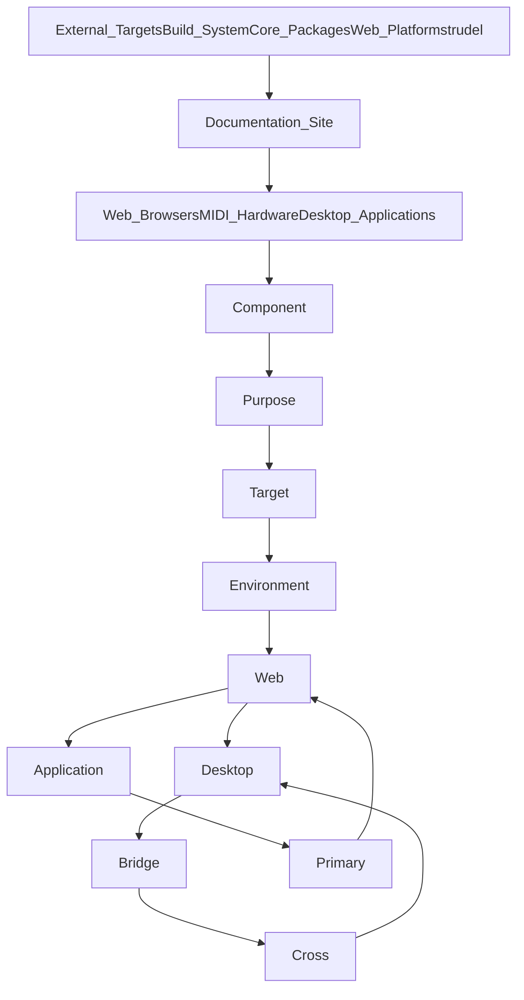

markdown

```mermaid
graph TD
    Component["Component"]
    External_TargetsBuild_SystemCore_PackagesWeb_Platformstrudel["External_TargetsBuild_SystemCore_PackagesWeb_Platformstrudel"]
    Application["Application"]
    Desktop["Desktop"]
    Bridge["Bridge"]
    Target["Target"]
    Documentation_Site["Documentation_Site"]
    Web_BrowsersMIDI_HardwareDesktop_Applications["Web_BrowsersMIDI_HardwareDesktop_Applications"]
    Environment["Environment"]
    Cross["Cross"]
    Web["Web"]
    Purpose["Purpose"]
    Primary["Primary"]
    External_TargetsBuild_SystemCore_PackagesWeb_Platformstrudel --> Documentation_Site
    Documentation_Site --> Web_BrowsersMIDI_HardwareDesktop_Applications
    Web_BrowsersMIDI_HardwareDesktop_Applications --> Component
    Component --> Purpose
    Purpose --> Target
    Target --> Environment
    Environment --> Web
    Web --> Application
    Application --> Primary
    Primary --> Web
    Web --> Desktop
    Desktop --> Bridge
    Bridge --> Cross
    Cross --> Desktop
```